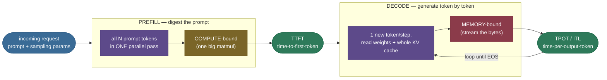
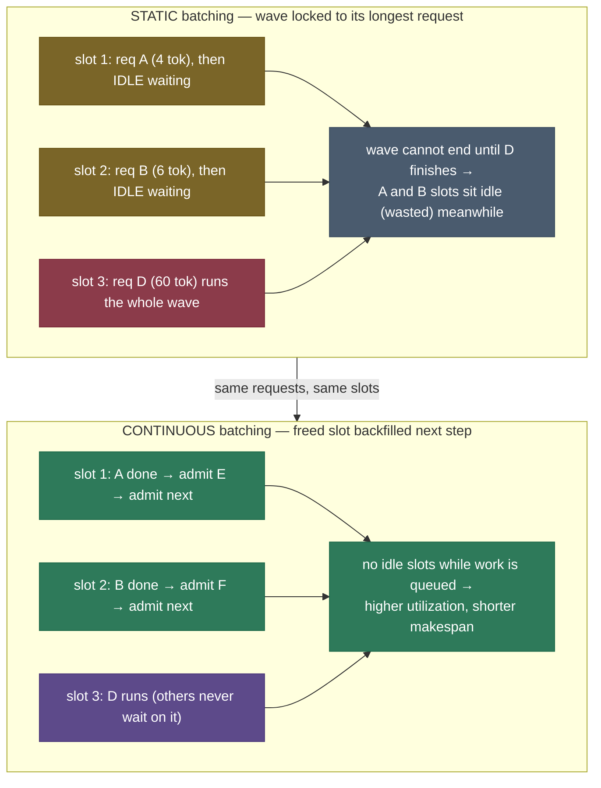
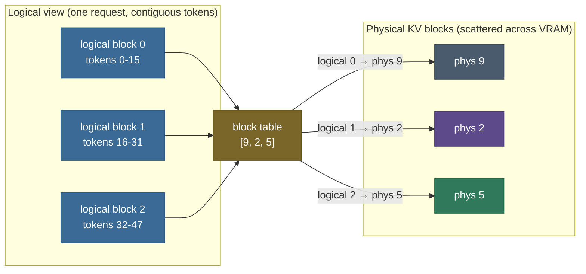

# Inference Optimization & Serving: turning a trained model into tokens/second

You have a trained LLM. It works. Now serve it to ten thousand people at once, fast enough that nobody notices the wait, cheap enough that you don't go bankrupt. This is a *completely different* engineering problem from training, and it is where most of the money in production AI is actually spent — inference, not training, dominates the lifetime compute bill of a deployed model. The frustrating part is that a single GPU running a single request wastes ~99% of its compute, *and you can prove it with one division.* This page is about why that waste happens and the small number of levers — **continuous batching, PagedAttention, speculative decoding** — that the entire LLM-serving industry uses to claw it back.

I'll explain this the way I'd walk a new teammate through their first capacity-planning meeting. We start by *feeling* the waste (one A100, one user, the GPU asleep), then derive **why decode is memory-bound** so the rest stops feeling like a bag of tricks, then build up the serving stack one lever at a time — each one a different answer to "how do I make that expensive memory read count for more tokens." By the end you'll be able to:

- name and reason about the **serving metrics** that matter — TTFT, TPOT/ITL, throughput, goodput under SLOs — and the **latency↔throughput tradeoff** that pits them against each other;
- explain why **prefill is compute-bound and decode is memory-bound**, and why that single split drives every optimization;
- explain **continuous (in-flight) batching** and *why* it beats static batching on real ragged traffic — the biggest throughput lever there is;
- explain **PagedAttention / vLLM** as virtual memory for the KV cache, and why it raises the batch size you can actually serve;
- reason about **speculative decoding**'s expected speedup from a draft model's acceptance rate;
- size a deployment and pick levers from first principles, not folklore.

> **Note:** this page is the *systems* counterpart to **[KV Cache](../05-KV-Cache/05-KV-Cache.md)**. KV-Cache explains the memory object; this page explains the engine that *serves* it. We'll lean on three results from there — the prefill/decode split, the memory-bound decode arithmetic, and the cache-size formula — and cross-link them as we go.

---

## The problem: a $20,000 GPU, asleep

Put a Llama-3-8B on one NVIDIA A100-80GB. The weights are 8B parameters × 2 bytes (FP16) = **16 GB**. To generate **one** output token for **one** user, the GPU must read **all 16 GB of weights out of memory** — every weight is used exactly once per token — and then do a tiny amount of arithmetic with them. The A100's memory bandwidth is ~2 TB/s, so that 16 GB read alone takes:

$$t_{\text{step}} \;\approx\; \frac{16\times10^9 \text{ bytes}}{2\times10^{12}\text{ bytes/s}} \;=\; 8\text{ ms}.$$

Eight milliseconds per token means ~125 tokens/second for that one user — and here's the gut-punch: the A100 can do ~312 TFLOP/s of compute, but generating that token needed only ~16 GFLOP of math, which the chip finishes in ~0.05 ms. So for 8 ms of memory reading, the compute units did 0.05 ms of work and **sat idle for the other 99.4% of the step.** You bought a Ferrari and you're stuck in a parking garage.


> **Note:** these are exactly the numbers the companion notebook prints (`batch=1: memory 8.02 ms vs compute 0.051 ms → memory-bound, ratio 156×`). The whole field of inference optimization is the answer to one question: *how do I make that unavoidable 16 GB read produce more than one token?*

This matters because it is the **production-LLM systems interview**, and the question behind the question in every serving design review. Be ready to distinguish prefill from decode, derive why decode is memory-bound, explain continuous batching and paged attention from scratch, and reason about the latency↔throughput tradeoff (TTFT vs TPOT) out loud.

---

## Intuition first: a kitchen that cooks one order at a time

Before any math, the mental model. Think of the GPU as a **professional kitchen** and the model weights as a **giant recipe book** locked in a back room. To cook *any* dish, a chef must walk to the back room, read the *entire* recipe book cover to cover, then cook. Reading the book takes 8 minutes; the actual cooking takes 3 seconds.

- **One order at a time (batch 1):** the chef reads the whole book, cooks one dish, and the kitchen is idle the entire 8 minutes of reading. Catastrophic waste — this is decode at batch 1.
- **Batch the orders:** here is the key move. The chef reads the book **once**, then cooks *all the orders that need that book* before walking back. Read once, cook many. Ten orders share one 8-minute read, so the per-dish overhead collapses. **This is batching, and it is the master lever** — it amortizes the fixed, expensive weight read across many tokens.
- **Ragged orders:** but real orders aren't equal — one customer wants a 3-token espresso, another a 500-token banquet. If you make the espresso customer's station sit idle until the banquet is done (a **static** batch), you waste the kitchen. If instead you seat a new customer the instant a station frees up (**continuous** batching), the kitchen stays full. This is the difference between static and in-flight batching.
- **A fast line cook guesses ahead (speculation):** while the head chef reads the book, a cheap line cook *guesses* the next few dishes; the head chef glances at all the guesses at once and keeps the ones that are right. When the line cook guesses well, several dishes get plated for one trip to the back room. This is **speculative decoding** — spending the idle time productively.


This analogy holds under follow-ups. *Why is the read so expensive relative to the cooking?* Because the "book" (16 GB of weights) lives in slow HBM and the "cooking" (a few GFLOP) is trivial for a tensor core — the arithmetic intensity is ~1 FLOP/byte against a GPU that wants ~156. *Why doesn't batching help latency?* Because each individual order still waits the full read; batching helps **throughput** (orders/hour), not the single order's **latency** — the exact tradeoff we'll formalize next.

---

## The mechanism: two phases, two bottlenecks, two metrics

The single most important structural fact in LLM serving — inherited directly from the **[KV cache](../05-KV-Cache/05-KV-Cache.md)** — is that generation splits into **two phases with opposite performance characteristics**.

- **Prefill** digests the whole prompt in **one parallel pass**, computing K/V for every prompt token at once. It's a big, dense matmul that saturates the compute units → **compute-bound**. It sets your **time-to-first-token (TTFT)**.
- **Decode** generates **one token at a time**, each step reading all the weights and the whole KV cache to do very little math → **memory-bound**. It sets your **time-per-output-token (TPOT)**, also called **inter-token latency (ITL)**.

Every optimization on this page is downstream of that split. Confuse the two phases and you will optimize the wrong thing.



*A request flows through one compute-bound prefill (which sets TTFT) into a memory-bound decode loop (each step sets TPOT/ITL). The two phases have opposite bottlenecks — the root of every serving decision below.*

### The metrics, precisely

You cannot tune what you cannot name. Production serving lives and dies by four numbers:

| Metric | What it measures | Bound by | Whose pain |
|---|---|---|---|
| **TTFT** (time-to-first-token) | Prompt arrives → first token emitted | Prefill (compute) + queueing | User waiting for the response to *start* |
| **TPOT / ITL** (time-per-output-token) | Steady-state gap between output tokens | Decode (memory bandwidth) | User watching the response *stream* |
| **Throughput** | Total tokens/s (or requests/s) across all users | Batch size vs the roofline | The operator's GPU bill |
| **Goodput** | Throughput of requests that *meet their SLO* | Everything, under latency constraints | What actually counts |


> **Note:** **goodput** is the metric that matters and the one beginners miss. Raw throughput counts every token; goodput counts only tokens delivered *within the latency SLO* (e.g. "TTFT < 500 ms, TPOT < 50 ms"). An engine can have spectacular throughput and terrible goodput if it gets there by making everyone wait too long. Optimize goodput, report throughput.

### The latency↔throughput tradeoff

Here is the tension at the center of every serving config. **Bigger batches raise throughput but raise latency.** Batch more requests together and you amortize the weight read across more tokens (throughput ↑), but each request now shares the GPU with more neighbors and its tokens come out slower (TPOT ↑). There is no free lunch: a latency-sensitive chat product runs small batches; a throughput-sensitive batch-summarization job runs huge ones. The whole job of a serving engine is to push this frontier outward — to get more throughput at the *same* latency — which is exactly what the levers below do.


> **Tip:** this is why you'll see serving benchmarks plotted as a **throughput-vs-latency curve**, not a single number. A better engine isn't "faster" — it's a curve that sits up and to the right of the old one, dominating at every latency target. See the [vLLM blog's throughput benchmarks](https://blog.vllm.ai/2023/06/20/vllm.html) for real measured versions of this curve.

---

## The math: why decode is memory-bound (derive it once, never forget it)

This is the load-bearing derivation. Get it and every lever becomes obvious; skip it and they stay folklore. The tool is **arithmetic intensity** — FLOPs performed per byte read from memory — compared against the GPU's **roofline ridge point**.

A decode step at batch $B$ pushes $B$ tokens through the model. Each parameter is used in exactly one multiply-add per token, and a multiply-add is 2 FLOPs, so the compute is:

$$\text{FLOPs} \;=\; 2 \times \text{params} \times B.$$

> **Source / derivation:** [kipply, *Transformer Inference Arithmetic*](https://kipp.ly/transformer-inference-arithmetic/) and [EleutherAI, *Transformer Math 101*](https://blog.eleuther.ai/transformer-math/) — the $2 \times \text{params}$-per-token inference-FLOP rule, derived from the per-layer matmul shapes.

To *do* that math, the GPU must read every weight once (16 GB) plus each sequence's KV cache:

$$\text{bytes} \;=\; \underbrace{W}_{\text{weights, once}} \;+\; \underbrace{B \times \text{ctx} \times \text{kv}_{\text{tok}}}_{\text{KV cache, per sequence}},$$

where $W = 16\text{ GB}$, $\text{kv}_{\text{tok}} = 0.125$ MiB/token for Llama-3-8B (GQA-8), straight from the **[KV-cache size formula](../05-KV-Cache/05-KV-Cache.md)**: $2 \times n_{\text{layers}} \times n_{\text{kv\_heads}} \times d_{\text{head}} \times \text{bytes} = 2\times32\times8\times128\times2$.

> **Source / derivation:** [Kwon et al., *Efficient Memory Management for LLM Serving with PagedAttention* (2023)](https://arxiv.org/abs/2309.06180), §2, and the KV-cache chapter — the per-token KV-cache footprint as $2 \cdot n_{\text{layers}} \cdot n_{\text{kv\_heads}} \cdot d_{\text{head}} \cdot \text{bytes}$.

At batch 1, short context, the weights dominate the bytes, so arithmetic intensity is:

$$\text{intensity} \;\approx\; \frac{2 \times \text{params}}{\text{bytes per param}} \;=\; \frac{16\times10^9 \text{ FLOP}}{16\times10^9 \text{ bytes}} \;\approx\; \mathbf{1\ \text{FLOP/byte}}.$$

Now the roofline. An A100 does ~312 TFLOP/s of compute but only ~2 TB/s of bandwidth, a ratio of:

$$\text{ridge} \;=\; \frac{312\times10^{12}\text{ FLOP/s}}{2\times10^{12}\text{ bytes/s}} \;=\; \mathbf{156\ \text{FLOP/byte}}.$$

> **Source / derivation:** [Williams, Waterman & Patterson, *Roofline: An Insightful Visual Performance Model* (CACM 2009)](https://www2.eecs.berkeley.edu/Pubs/TechRpts/2008/EECS-2008-134.html) — the model that pits a kernel's arithmetic intensity against the machine's compute-to-bandwidth ratio (the ridge point); below the ridge a kernel is memory-bound. Its application to transformer decode is [Pope et al., *Efficiently Scaling Transformer Inference* (2022)](https://arxiv.org/abs/2211.05102).

A kernel needs ~156 FLOP/byte to keep the compute units busy; decode delivers ~1. So decode is **deeply** memory-bound — by a factor of ~156 — exactly the ratio the notebook prints. **The cure is batching.** Process $B$ sequences together and you read each weight **once** but do $B\times$ the math, multiplying arithmetic intensity by $B$ and walking the kernel up toward the ridge.

### Throughput rises with batch — until it saturates

The step time is the **max** of the memory time and the compute time (the GPU can't finish until both the bytes are streamed *and* the math is done):

$$t_{\text{step}}(B) \;=\; \max\!\left(\frac{W + B\cdot\text{ctx}\cdot\text{kv}_{\text{tok}}}{\text{HBM}}, \; \frac{2\cdot\text{params}\cdot B}{\text{FLOP/s}}\right), \qquad \text{throughput}(B) = \frac{B}{t_{\text{step}}(B)}.$$

The companion demo evaluates this for Llama-3-8B on an A100 at 256-token context:

```
 batch |  latency/token |       throughput | bound
--------------------------------------------------------
     1 |        8.02 ms |         125 tok/s | memory
     8 |        8.13 ms |         983 tok/s | memory
    32 |        8.54 ms |        3748 tok/s | memory
    64 |        9.07 ms |        7053 tok/s | memory
   128 |       10.15 ms |       12614 tok/s | memory
   156 |       10.62 ms |       14693 tok/s | memory
   256 |       13.13 ms |       19500 tok/s | compute
   512 |       26.26 ms |       19500 tok/s | compute
compute-roofline crossover: B* = 232
  ...at 2048-token context: never (KV growth outpaces compute headroom)
```


Read it top to bottom. From batch 1 to 128, latency/token barely moves (8.0 → 10.2 ms) while throughput climbs **100×** (125 → 12,614 tok/s) — that's the weight read being amortized, nearly free tokens. Then near the **crossover batch $B^\star \approx 232$** the compute term overtakes memory, the `bound` column flips to `compute`, and throughput **saturates at the compute roofline** (~19,500 tok/s) — adding more batch now only adds latency. This curve *is* the latency↔throughput tradeoff, made of arithmetic.

> **Note (the long-context twist):** at 256-token context there's a crossover; at **2048**-token context there is **none** — decode stays memory-bound at *every* batch. Why? The KV term $B\cdot\text{ctx}\cdot\text{kv}_{\text{tok}}$ grows with $B$ faster than the compute headroom does, so you never reach the ridge. This is the systems-level reason **shrinking the KV cache (GQA, FP8) directly buys throughput at long context** — you're cutting the bytes that are the bottleneck. It connects this page straight back to the four levers in the **[KV-cache chapter](../05-KV-Cache/05-KV-Cache.md)**.

---

## Lever 1: continuous (in-flight) batching — the biggest win

Batching is the master lever, but *how* you batch is where the throughput actually lives. Real traffic is **ragged**: prompts and outputs vary wildly in length. The naive approach — **static batching** — collects a batch, runs it to completion, then starts the next. The pathology is **head-of-line blocking**: the batch can't finish until its *longest* request finishes, so every short request's GPU slot sits **idle**, burning capacity, waiting for the one long straggler.

**Continuous batching** (also "in-flight" or "iteration-level" batching), introduced by **Orca**, fixes this at the granularity of a single decode step: the moment *any* request in the batch emits its EOS token, its slot is **immediately refilled** with a waiting request — no waiting for the rest of the batch. The batch composition changes every iteration. Slots never sit idle while there's work queued.

> **Source / derivation:** [Yu et al., *Orca: A Distributed Serving System for Transformer-Based Generative Models* (OSDI 2022)](https://www.usenix.org/conference/osdi22/presentation/yu) — introduces iteration-level (continuous) scheduling, replacing request-level batching so finished sequences are evicted and new ones admitted between decode steps.



*Static batching (top): short requests A and B finish early but their slots stay idle until the long request D ends — head-of-line blocking. Continuous batching (bottom): the instant A or B finishes, the slot is refilled from the queue, so the GPU never idles while work remains.*

The companion demo models both on six ragged requests (4/6/20/60/5/8 output tokens) through a 3-slot engine:

```
[2] Static vs continuous batching: 6 ragged requests (4/6/20/60/5/8 tok), 3 slots, modeled:
  static     : makespan    800 ms | GPU util   43%
  continuous : makespan    640 ms | GPU util   54%
  -> continuous backfills freed slots immediately: 43% -> 54% util, makespan 1.25x shorter
```

![Animated — the same 6 ragged requests (4/6/20/60/5/8 tokens) on a 3-slot engine, played forward as a clock sweeps. Static batching (top) runs locked waves: short requests finish early but their slots sit idle (hatched) until the wave's longest request ends — 800 ms. Continuous batching (bottom) backfills a freed slot the very next step (D starts in slot 1 the instant A finishes) and visibly finishes first — 640 ms. Same hardware, same work, 1.25× faster. Generated by `tools/make_animations_09.py`.](../images/serving_batching_timeline.gif)

Same hardware, same requests — continuous batching finishes **1.25× sooner** at **54% vs 43%** utilization, purely by not wasting slots. On real production traffic the gap is far larger: Anyscale measured continuous batching at up to **23× the throughput** of naive static batching, because real workloads are *much* more ragged than this six-request toy.

> **Source / derivation:** [Anyscale, *How Continuous Batching Enables 23× Throughput in LLM Inference* (2023)](https://www.anyscale.com/blog/continuous-batching-llm-inference) — measures continuous batching against static on production-shaped traffic; the 23× headline quantifies the head-of-line-blocking waste this lever removes.

> **Gotcha:** continuous batching needs a **queue of waiting work** to backfill from — if you have exactly as many slots as requests and nothing queued, there's nothing to swap in and the win shrinks (try it: set `slots = 6` in the notebook). The lever pays off precisely when the engine is **saturated**, which is exactly when you most need it.

> **Tip:** continuous batching interacts with prefill. A naive engine stalls every user's decode to run a newcomer's big prefill — so modern engines do **chunked prefill**: split a long prompt's prefill into chunks and interleave them with ongoing decode steps, so one heavy prompt doesn't freeze everyone else's token stream. vLLM and TensorRT-LLM both do this by default.

---

## Lever 2: PagedAttention — virtual memory for the KV cache

Continuous batching wants to pack as many requests onto the GPU as possible — but the **KV cache allocation** fights back. From the **[KV-cache chapter](../05-KV-Cache/05-KV-Cache.md)**: a naive engine gives each request one **contiguous** buffer sized for the *worst-case* length it might reach. Two pathologies follow — **internal fragmentation** (a request that stops at 50 tokens still holds its 2,048-token reservation) and **external fragmentation** (free gaps too small for a new request). Real systems waste **60–80%** of KV memory this way, which directly caps how many requests you can batch.

**PagedAttention** (the core idea behind **vLLM**) borrows the operating system's **virtual memory** trick. Store the cache in small fixed-size **blocks** (16 tokens each by default), with a per-request **block table** mapping logical token positions to physical blocks — exactly like an OS page table maps virtual to physical pages. Memory is allocated **on demand**, one block at a time, so a request only ever holds blocks for tokens it actually generated. Waste drops from 60–80% to **under 4%** (at most one partially-filled block per sequence), and the attention kernel just gathers the scattered blocks via the block table.

> **Source / derivation:** [Kwon et al., *Efficient Memory Management for LLM Serving with PagedAttention* (2023, SOSP)](https://arxiv.org/abs/2309.06180) — the paper introducing PagedAttention and vLLM; §3–4 give the block-table mechanism and the near-zero-fragmentation result, and report **2–4× throughput** over prior systems (FasterTransformer, Orca) at the same latency, by reclaiming the wasted KV memory to raise the achievable batch size.



*Logically contiguous tokens 0–47 live in three physical blocks scattered anywhere in VRAM (9, 2, 5). The block table is the indirection that makes them look contiguous to the kernel. To read token 40: logical block $40 // 16 = 2$ → physical block 5, slot $40 \% 16 = 8$.*

> **See the original:** the [PagedAttention paper's block-table figure (Kwon et al. 2023, Fig. 6–7)](https://arxiv.org/pdf/2309.06180) shows this same logical→physical mapping for two real requests *sharing* a prefix block — the copy-on-write mechanism behind prefix caching — and the [vLLM blog's animated paging figure](https://blog.vllm.ai/2023/06/20/vllm.html) shows blocks being allocated on demand as a sequence grows.

> **Tip:** paging unlocks a second win — **sharing**. Because blocks are addressable, two requests with the same **prefix** (a shared system prompt, or beam-search branches) can *point at the same physical blocks*; when one diverges, only that block is copied and only that request's table repointed (**copy-on-write**). This is the substrate for **automatic prefix caching**, below — and it's why vLLM raised the *achievable batch size*, which (via Lever 0, batching) is what actually lifts throughput.

> **Note:** PagedAttention is what makes continuous batching *practical*. Continuous batching wants to admit new requests aggressively; paging means a new request grabs a few 16-token blocks instead of a giant contiguous reservation, so the engine can pack far more concurrent sequences into the same VRAM. The two levers are designed to work together — vLLM ships both.

---

## Lever 3: speculative decoding — spend idle compute to buy tokens

Recall the gut-punch: during decode the GPU's compute units sit ~99% idle, starved for bandwidth. **Speculative decoding** spends that idle compute. A small, cheap **draft** model proposes $k$ tokens ahead; the big **target** model then **verifies all $k$ in a single forward pass** — a mini-prefill that costs about *one* decode step — and accepts the longest correct prefix (with a rejection-sampling correction that makes the output **distributionally identical** to plain sampling from the target). If the draft guesses well, you plate several tokens for the price of one expensive weight read.

> **Source / derivation:** [Leviathan, Kalman & Matias, *Fast Inference from Transformers via Speculative Decoding* (2023, ICML)](https://arxiv.org/abs/2211.17192) and, concurrently, [Chen et al., *Accelerating Large Language Model Decoding with Speculative Sampling* (2023)](https://arxiv.org/abs/2302.01318) — both introduce draft-and-verify decoding with a modified rejection-sampling step that provably preserves the target model's output distribution.

### The expected speedup

Let $\alpha$ be the per-token **acceptance rate** (how often the target accepts a drafted token). The number of accepted tokens per target pass follows a truncated geometric distribution; its expectation is

$$\mathbb{E}[\text{accepted}] \;=\; \frac{1 - \alpha^{\,k+1}}{1 - \alpha},$$

and if each target verification also pays for $k$ cheap draft steps at cost ratio $c$ (draft step time ÷ target step time), the wall-clock speedup is

$$\text{speedup} \;=\; \frac{\mathbb{E}[\text{accepted}]}{1 + k\,c}.$$

> **Source / derivation:** [Leviathan et al. (2023)](https://arxiv.org/abs/2211.17192), §3.1 — derives the expected number of tokens generated per iteration as $\frac{1-\alpha^{k+1}}{1-\alpha}$ from the per-token acceptance probability $\alpha$, and the overall speedup as that expectation divided by the per-iteration cost (one target pass plus $k$ draft steps).

The demo sweeps $\alpha$ for $k=4$, $c=0.1$:

```
[3] Speculative decoding expected speedup (draft_k=4, draft_cost=0.1x target), modeled:
  acceptance alpha | expected speedup
--------------------------------------
               0.1 |           0.79x
               0.3 |           1.02x
               0.5 |           1.38x
               0.7 |           1.98x
               0.8 |           2.40x
               0.9 |           2.93x
```


The story is right there: at high acceptance ($\alpha = 0.9$) you get a **~2.9×** speedup; at low acceptance ($\alpha = 0.1$) the speedup is **0.79× — *slower than not using it at all***, because the draft overhead isn't earned back. Speculative decoding is not free; it pays off only when the draft model is both **cheap** ($c$ small) and **well-aligned** with the target ($\alpha$ high), which is why drafts are usually a tiny same-family model (e.g. a 1B drafting for a 70B), or a self-speculation head (Medusa) on the target itself.

> **Gotcha:** $\alpha$ is **workload-dependent**. Code and templated text are highly predictable → high $\alpha$ → big wins; open-ended creative generation is less predictable → lower $\alpha$. Measure $\alpha$ on *your* traffic before committing to a draft model — a number that looks great on a benchmark can underwhelm on production prompts.

---

## Other levers in the serving toolbox

The three above are the headline wins; a production stack layers several more, each cross-linking a neighbouring chapter:

- **FlashAttention kernels** (cross-link **[06](../06-Efficient-Attention-FlashAttention/06-Efficient-Attention-FlashAttention.md)**). The levers above set *how many bytes* must move; the attention **kernel** sets *how close to peak bandwidth* you move them. FlashAttention computes exact attention without materializing the $n\times n$ score matrix in HBM; **FlashDecoding** parallelizes a single decode query across chunks of the KV cache to keep a long-context decode step bandwidth-saturated.
- **Quantization** (cross-link **[10](../10-Quantization/10-Quantization.md)**). Storing weights and/or the KV cache in FP8/INT8/INT4 **halves or quarters the bytes streamed** — and in a bandwidth-bound regime, fewer bytes ≈ proportionally faster, on top of fitting more requests. FP8 KV cache is hardware-native on Hopper and often near-lossless.
- **Prefix caching** (RadixAttention). Many requests share a long identical prefix (a fixed system prompt, a few-shot preamble, a shared document). Compute it **once** and reuse the KV blocks for every request that shares it — turning most of prefill into a cache hit for agent/chat workloads. Built directly on PagedAttention's block sharing.
- **Prefill/decode disaggregation.** Since prefill is compute-bound and decode is memory-bound, run them on **separate GPU pools** tuned for each bottleneck and ship the KV cache between them over a fast interconnect — so a heavy prefill never stalls everyone's token stream.
- **Tensor / pipeline parallelism.** For models too big for one GPU, split each layer's matmuls across GPUs (tensor parallel) or assign layer ranges to different GPUs (pipeline parallel). Necessary above ~13B–70B; adds communication cost that itself needs optimizing.

> **Tip:** these compose. A production stack serving "Llama-3-70B at 128K context, low latency" is typically **GQA (architectural) + PagedAttention + FP8 KV cache + FlashAttention + continuous batching + tensor parallelism + prefix caching** — each attacking a different term of the latency/throughput budget. No single trick gets you there; the stack does.

---

## Worked code: model the levers from scratch

The clearest way to internalize "decode is memory-bound and batching fixes it" is to *compute* it. The companion **[teaching notebook](code/09-Inference-Optimization-and-Serving.ipynb)** and **[runnable script](code/inference_serving.py)** (`python inference_serving.py`) build three small models in pure NumPy — no GPU, every number labelled **modeled**, and every teaching claim asserted *before* it's printed. Here is the heart of the roofline model:

```python
# Hardware: one real NVIDIA A100-80GB (FP16); Model: Llama-3-8B (GQA-8).
HBM_BANDWIDTH_BYTES_PER_S = 2.0e12   # ~2.0 TB/s HBM2e bandwidth (the decode bottleneck)
PEAK_FLOPS = 312e12                   # ~312 TFLOP/s dense FP16
WEIGHT_BYTES = 8.0e9 * 2              # 16 GB streamed once per decode step
KV_BYTES_PER_TOKEN = 2 * 32 * 8 * 128 * 2   # 2(K,V)*layers*kv_heads*head_dim*bytes = 0.125 MiB

def decode_step_time_s(batch, context_tokens):
    """Modeled (memory_time, compute_time) for one decode step at this batch."""
    bytes_moved = WEIGHT_BYTES + batch * context_tokens * KV_BYTES_PER_TOKEN  # weights once + KV per seq
    memory_time = bytes_moved / HBM_BANDWIDTH_BYTES_PER_S                      # bandwidth-bound time
    compute_time = 2 * 8.0e9 * batch / PEAK_FLOPS                              # compute scales with batch
    return memory_time, compute_time

for batch in (1, 8, 32, 128, 256):
    mem, cmp = decode_step_time_s(batch, context_tokens=256)
    step = max(mem, cmp)                       # GPU waits on the slower resource
    print(f"B={batch:>4}  {step*1e3:6.2f} ms/step  {batch/step:8.0f} tok/s  "
          f"{'memory' if mem >= cmp else 'compute'}-bound")
```

This prints the throughput-vs-batch table reproduced above. The notebook then models static-vs-continuous batching and speculative speedup the same way, with `assert` statements that fail loudly if the qualitative lesson ever breaks. **Read the asserts as the contract**: throughput must rise with batch then saturate; continuous must beat static on ragged traffic; speculation must climb with the acceptance rate.

> **Reproducible figures:** every chart on this page is generated by [`tools/gen_inference_serving_diagrams.py`](../../tools/gen_inference_serving_diagrams.py) from the *same* named constants as the demo (so a constant change can't desync a figure from the text) — run `python tools/gen_inference_serving_diagrams.py` to rebuild them.

---

## Pitfalls and failure modes

These are the ones that bite in production — worth knowing before they page you:

- **Sizing capacity from the weights, not the cache.** The single most common planning error: budget GPUs from parameter count and forget the KV cache. The cache, not the weights, usually caps your batch size and therefore your throughput. Size from the decode-bytes formula, not from `model.num_parameters()`.
- **Optimizing throughput and shipping bad latency (goodput trap).** Cranking the batch size to maximize tokens/s can blow past your TPOT SLO, so *measured goodput drops while reported throughput rises*. Always benchmark against the latency target, not in a vacuum.
- **Confusing the two phases.** Tuning a decode-side lever (paging, FP8 cache) and expecting it to fix a TTFT problem (which is prefill/compute-bound) — or vice versa. Diagnose *which phase* is your bottleneck first; they respond to different levers.
- **Static batching in disguise.** Some "batching" implementations still lock the batch until the longest request finishes. If your GPU utilization is low under bursty traffic, check that you have *true* iteration-level continuous batching, not request-level batching with a fancy name.
- **Speculative decoding on the wrong workload.** A draft model benchmarked on code (high $\alpha$) deployed on open-ended chat (lower $\alpha$) can land *below 1× speedup*. Measure $\alpha$ on real traffic; the break-even is real.
- **Quantized KV cache, silent quality loss.** FP8 is usually safe; INT4 KV needs the per-channel/per-token scaling from the [KV-cache chapter](../05-KV-Cache/05-KV-Cache.md) and can quietly degrade outputs. Measure win-rate before/after; don't ship it on faith.
- **Context bleed across requests.** A pooled KV buffer reused without clearing can leak one user's tokens into another's generation — a correctness *and* privacy bug. Key the cache strictly to the request; paging makes this clean (free the blocks on completion).
- **OOM under load spikes.** The cache grows with concurrency × length; a burst of long requests can overflow VRAM mid-generation. Robust engines apply **admission control** and **preemption** (vLLM can evict and recompute a request's cache rather than crash) — but if you planned capacity from the weights, a spike still takes you down.

---

## Where it matters: the crux

The crux is this: **inference, not training, is where a deployed model spends its money — and decode is memory-bound, so serving is the art of making one expensive weight read produce as many tokens as possible.** Every lever on this page is a different answer to that one sentence:

- **Batching** amortizes the weight read across more tokens — the master lever.
- **Continuous batching** keeps the batch *full* on ragged traffic — the biggest practical throughput win.
- **PagedAttention** removes the KV-memory fragmentation that capped the batch size — the substrate the rest is built on.
- **Speculative decoding** spends the idle compute that the memory-bound regime leaves on the table.
- **Quantization / FlashAttention / GQA** cut the *bytes* you must stream — directly faster in a bandwidth-bound world.

Reach for them in that order, and stop when you've hit your SLO at your budget. Don't reach for speculative decoding before you've turned on continuous batching; don't tensor-parallelize a model that fits on one GPU; don't quantize the KV cache before you've measured that the cache is your bottleneck. **The levers are ordered by leverage — apply them in order, measure after each.**

---

## In production: real systems, real numbers

Tying the levers to systems you can run today:

- **vLLM** ships PagedAttention + continuous batching as its defaults and reports **2–4× throughput** over the prior generation (FasterTransformer, Orca) at equal latency, by reclaiming the 60–80% KV memory that fragmentation wasted ([Kwon et al. 2023](https://arxiv.org/abs/2309.06180)). It adds FP8 KV cache, automatic prefix caching, chunked prefill, and speculative decoding as configurable options.
- **Continuous batching** alone delivered up to **23× throughput** over naive static batching on production-shaped traffic ([Anyscale 2023](https://www.anyscale.com/blog/continuous-batching-llm-inference)) — the single largest software lever, no new hardware.
- **TensorRT-LLM** (NVIDIA) and **TGI** (Hugging Face) implement the same playbook — in-flight batching, paged KV, quantization, FlashAttention kernels — confirming this is the industry-standard stack, not one vendor's trick.
- **SGLang's RadixAttention** organizes shared prefixes in a radix tree for fast longest-prefix KV reuse — a large win for agent and few-shot workloads with multi-thousand-token shared preambles ([Zheng et al. 2023](https://arxiv.org/abs/2312.07104)).
- **Mooncake** (Moonshot AI) runs **disaggregated prefill/decode** with a shared KV-cache pool across machines, a design now adopted by several of the largest deployments to hit latency targets at scale ([Qin et al. 2024](https://arxiv.org/abs/2407.00079)).

> **Note:** the numbers above are **measured** by their respective papers/posts (linked, in references); the throughput-vs-batch table and batching/speculation results on *this* page are **modeled** from named A100/Llama-3-8B constants — reproducible on any machine, and labelled as modeled throughout. Both are honest; know which is which.

---

## Recap and rapid-fire

**If you remember nothing else:** decode is **memory-bound** — at batch 1 the GPU spends ~8 ms reading 16 GB of weights to emit one token and the compute units sit ~99% idle. Serving is the art of making that read count for more tokens: **batch** to amortize it, **continuous-batch** to keep the batch full on ragged traffic, **page** the KV cache to raise the batch you can fit, **speculate** to spend the idle compute, and **quantize/FlashAttention** to cut the bytes. The whole stack pushes the latency↔throughput frontier outward.

**Quick-fire — say these out loud:**

- *Why is decode memory-bound?* Arithmetic intensity ≈ 1 FLOP/byte vs the A100's ridge of ~156 — it moves bytes, barely computes.
- *Prefill vs decode?* Prefill = one parallel compute-bound pass (sets TTFT); decode = one-token-at-a-time memory-bound loop (sets TPOT/ITL).
- *What does batching change?* Amortizes the fixed weight read across $B$ tokens → throughput rises with $B$ until the compute roofline.
- *Static vs continuous batching?* Static locks the batch to its longest request (head-of-line blocking); continuous backfills freed slots every step — up to 23× throughput.
- *What does PagedAttention fix?* KV-memory fragmentation — page the cache into 16-token blocks (OS virtual memory) for <4% waste + prefix sharing → 2–4× throughput.
- *How does speculative decoding work?* A cheap draft proposes $k$ tokens; the target verifies all in one pass; speedup $= \frac{1-\alpha^{k+1}}{1-\alpha} / (1+kc)$ — only pays at high acceptance.
- *TTFT vs TPOT vs goodput?* First-token latency, per-token latency, and throughput-of-requests-that-meet-their-SLO — optimize goodput, report throughput.
- *Why does a bigger batch hurt latency?* Each request shares the GPU with more neighbours; throughput ↑ but TPOT ↑ — the core tradeoff.
- *What's the lever order?* Batch → continuous-batch → page → quantize/FlashAttention → speculate → parallelize. Measure after each.

---

## References and further reading

The curated link library for this topic — videos, courses, articles, papers, and interactive tools, including every cited formula source — lives in a companion file so it can be reused as a standalone reference list:

**→ [Inference Optimization & Serving — references and further reading](09-Inference-Optimization-and-Serving.references.md)**
