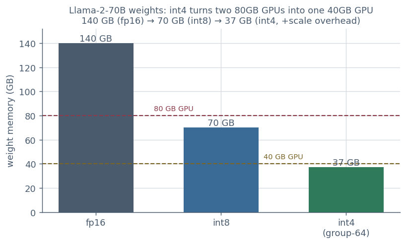
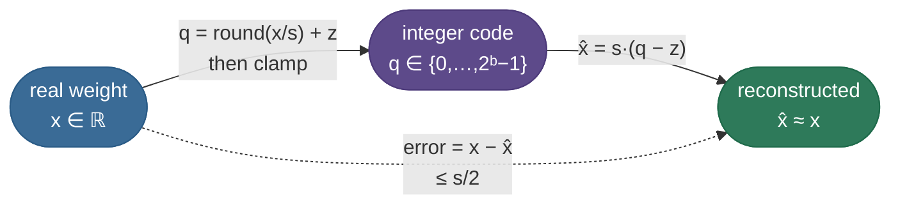
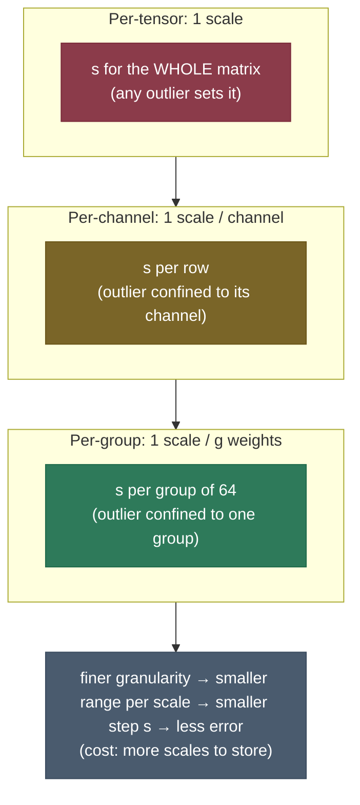
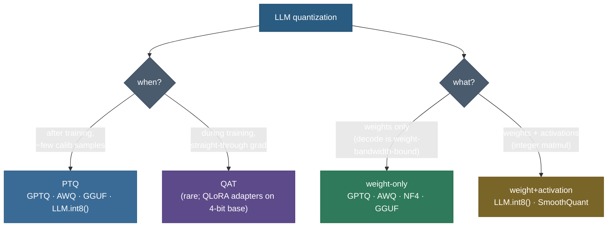

# Quantization: run a 140 GB model on a single GPU

Llama-2-70B in the precision it was trained at — FP16, two bytes per parameter — is **140 GB of weights**. No single GPU has that much memory: the largest commodity accelerator (an 80 GB A100 or H100) can't even *hold* it, let alone leave room for the KV cache and activations. So you either buy two GPUs and pay the cost (and latency) of splitting the model across them, or you find a way to make the weights smaller. **Quantization is that way.** Store each weight in 4 bits instead of 16 and the same model is **~37 GB** — it fits on one 40 GB GPU, with room to spare, at a quality loss small enough that most users never notice.

And it's not only about *fitting*. Recall from [KV Cache](../05-KV-Cache/05-KV-Cache.md) that LLM **decoding is memory-bandwidth-bound** — each generated token forces the GPU to stream every weight out of memory to do a tiny amount of math, so the GPU's compute units sit ~99% idle waiting on memory. Halve the bytes of those weights and you roughly **halve the time per token**. Quantization is the rare optimization that shrinks memory *and* speeds up the bottleneck at the same time.

I'm going to build this the way I'd actually teach it at a whiteboard: start with the **one formula** every method shares (map a real number to a small integer), feel exactly where it loses information, then hit the single fact that makes *LLM* quantization genuinely hard — **outliers** — and watch how each production method (LLM.int8(), GPTQ, AWQ, SmoothQuant, NF4/QLoRA, GGUF) is a different answer to that one problem. By the end you'll be able to:

- derive **affine quantization** — scale, zero-point, `round`, `clamp`, dequant — and compute the reconstruction error;
- explain **symmetric vs asymmetric** and **per-tensor vs per-channel vs per-group**, and *why finer granularity helps*;
- explain the **outlier problem** from first principles and why a single loud channel wrecks a per-tensor scale;
- place **PTQ vs QAT** and **weight-only vs weight+activation** on the map;
- say in one sentence each *what* LLM.int8(), GPTQ, AWQ, SmoothQuant, NF4, and GGUF actually contribute;
- recompute the **memory math** for any model at int8 / int4 on the spot.

> **Note:** "quantization" here means **post-hoc numeric compression of an existing model** — taking trained FP16 weights and storing them in fewer bits. It is *not* a modeling change like distillation (train a smaller model) or pruning (delete weights). The weights are the same weights, just stored coarsely.

---

## The problem: 16 bits is more precision than the weights need

To feel why this works, look at what an LLM weight actually *is*. After training, the weights of a layer are a dense cloud of small numbers — overwhelmingly in a tight band around zero, a Gaussian-ish blob with $\sigma \approx 0.1$. FP16 spends 16 bits giving each of those numbers ~3–4 significant decimal digits of precision. But the *next* layer doesn't care about the 4th digit of a weight: it sums thousands of weight×activation products, and that sum is robust to a little rounding in each term. **We are paying for precision the network doesn't use.**


Here is the felt cost of *not* quantizing, in the numbers a practitioner actually hits:

| Model | Params | FP16 weights | INT8 | INT4 | Fits on… |
|---|---:|---:|---:|---:|---|
| Llama-2-7B | 7 B | 14 GB | 7 GB | ~3.7 GB | INT4 → a laptop/8 GB GPU |
| Llama-2-13B | 13 B | 26 GB | 13 GB | ~6.9 GB | INT4 → one 8–12 GB GPU |
| Llama-2-70B | 70 B | **140 GB** | 70 GB | **~37 GB** | FP16 → 2× A100; INT4 → 1× A100 |

> **Source / derivation:** these are $\text{params} \times \text{bytes/param}$ with FP16 = 2, INT8 = 1, INT4 ≈ 0.53 bytes/param (4-bit code + group-scale overhead, derived below). Verified in this chapter's [`quantization.py`](code/quantization.py) §4.

The 70B row is the headline: **FP16 needs two top-end GPUs; INT4 needs one mid-range one.** That is the difference between "I can't run this" and "I can run this on the hardware I have."



So the question is purely: **how do we store a 16-bit number in 8, 4, or even 3 bits without breaking the model?**

---

## Intuition first: a ruler with only a few tick marks

Here is the whole idea before any symbols. You have a smooth quantity — a weight — that can take any real value in some range, say $[-2, 2]$. You want to store it using only a **small set of allowed values** (the integer codes). So you lay down a **ruler** across the range with a fixed number of evenly spaced **tick marks**, and you record, for each weight, *the nearest tick*.

- **INT8** is a ruler with **256 ticks**. Fine enough that the nearest tick is almost exactly your value — the error is tiny.
- **INT4** is a ruler with only **16 ticks**. Coarser: now your value can sit noticeably between two ticks, and you round to the nearer one, paying a bigger error.

Two numbers fully describe the ruler:

- the **scale** $s$ — the spacing between ticks (how much real value one integer step is worth);
- the **zero-point** $z$ — *which* tick corresponds to real value 0 (so the ruler can be slid to line up with your data).

"Quantize" = *find the nearest tick and write down its index*. "Dequantize" = *multiply the index back by the spacing* to recover an approximate real value. The error you pay is the gap between your value and the nearest tick — **at most half a tick**, which is why a finer ruler (more bits, smaller $s$) means less error.


This analogy holds up under the follow-up question that matters: *"what if one weight is enormous?"* Then the ruler has to stretch to reach it — same number of ticks spread across a much wider range — so **every other weight's ticks get coarser**. One outlier ruins the resolution for everyone. Hold onto that; it *is* the outlier problem, and it's the crux of the whole chapter.

---

## The mechanism: affine quantization, derived

Let's turn the ruler into the formula every method starts from. We map a real value $x$ to an integer code $q$ and back.



*The affine quantize → store → dequantize round-trip. Only the integer code $q$ (and the per-group $s$, $z$) are stored; $x̂$ is reconstructed on the fly. The dashed arrow is the error, bounded by half a step.*

**The quantize map.** Given a real range and a $b$-bit integer range $[q_\min, q_\max]$:

$$s = \frac{x_\max - x_\min}{q_\max - q_\min}, \qquad z = q_\min - \operatorname{round}\!\left(\frac{x_\min}{s}\right), \qquad q = \operatorname{clamp}\!\big(\operatorname{round}(x/s) + z,\; q_\min,\; q_\max\big).$$

> **Source / derivation:** [Jacob et al., *Quantization and Training of Neural Networks for Efficient Integer-Arithmetic-Only Inference* (2017)](https://arxiv.org/abs/1712.05877) — the canonical affine (scale + integer zero-point) formulation; see also the survey [Gholami et al., *A Survey of Quantization Methods for Efficient Neural Network Inference* (2021)](https://arxiv.org/abs/2103.13630) §III for the same map and its symmetric/asymmetric variants.

Reading it back through the ruler analogy: $s$ is the tick spacing (real range ÷ integer range); $z$ is the integer tick that real $0$ lands on (it *slides* the ruler so $[q_\min,q_\max]$ covers $[x_\min,x_\max]$); $\operatorname{round}$ snaps to the nearest tick — **this is the only lossy step** — and $\operatorname{clamp}$ keeps codes inside the grid.

**The dequantize map** simply inverts it:

$$\hat{x} = s\,(q - z).$$

**The error.** Because $\operatorname{round}$ snaps to the nearest of two ticks spaced $s$ apart, the per-value error is bounded by half a step:

$$|x - \hat{x}| \le \tfrac{s}{2}.$$

This single inequality drives everything: error $\propto s$, and $s = \text{range}/(2^b-1)$, so **adding one bit halves the step and halves the error**, while **widening the range (an outlier) raises the step and raises the error for every value**. Memorize this — it is the lever behind every method below.

### Symmetric vs asymmetric

Two flavors of the map, differing only in whether $z = 0$:

- **Symmetric** ($z = 0$): real $0$ maps to integer $0$; the ruler is centered on zero, spanning $[-\max|x|, +\max|x|]$. Set $s = \max|x| / q_\max$ with a signed range (e.g. $[-127, 127]$). **Best for weights**, which are roughly zero-centered — and it's cheaper (no zero-point to store or subtract), which is why weight-only int8/int4 schemes are almost always symmetric.

  $$s = \frac{\max|x|}{q_\max}, \qquad q = \operatorname{clamp}(\operatorname{round}(x/s),\, -q_\max,\, q_\max), \qquad \hat{x} = s\,q.$$

  > **Source / derivation:** [Gholami et al. (2021)](https://arxiv.org/abs/2103.13630) §III-A — symmetric quantization as the $z=0$ special case; standard in weight-only LLM quantizers (GPTQ, AWQ).

- **Asymmetric** ($z \ne 0$): the ruler slides to fit a range *not* centered on zero — e.g. a post-GELU activation with a short negative tail and a long positive one. Symmetric would waste every tick on the unused side; asymmetric fits the actual $[x_\min, x_\max]$ window, so its step is finer. **Best for activations.**

We can *see* the difference. On a lopsided tensor `[-0.5, -0.1, 0.3, 1.2, 2.5, 4.0]`, symmetric must span $[-4, 4]$ (wasting the levels below $-0.5$) while asymmetric spans only $[-0.5, 4.0]$:

```
lopsided tensor a : [-0.5, -0.1, 0.3, 1.2, 2.5, 4.0]
asymmetric scale s = 0.017647   zero-point z = 28
  quantized ints : [0, 22, 45, 96, 170, 255]
  mean|err| asym : 0.003922   (symmetric on same a: 0.006562)
  -> asymmetric < symmetric on a lopsided range (no levels wasted on the unused side)
```

Asymmetric's error is ~40% lower here purely because it didn't waste integer codes on a range with no data. (Numbers from [`quantization.py`](code/quantization.py) §1.)

### Granularity: per-tensor vs per-channel vs per-group

The *other* knob — and the one that matters most for LLMs — is **how many values share one scale**. Three levels, coarse to fine:

- **Per-tensor** — one $(s, z)$ for the **entire** weight matrix. Cheapest (one scale), most fragile (one outlier sets the scale for millions of weights).
- **Per-channel** — one $(s, z)$ per **row/column** (output channel). A loud output channel only spends bits on itself.
- **Per-group** — one $(s, z)$ per **contiguous group** of $g$ weights (e.g. $g=64$ or $128$) *within* a channel. The finest granularity used in practice; the scales add a small overhead ($\tfrac{2}{g}$ bytes/weight for an FP16 scale).



*Granularity is the primary defense against outliers: the more locally a scale is computed, the fewer values an outlier can drag down with it. The trade is storage — one scale per group is more metadata than one per tensor.*

Why does finer help? Directly from $|x-\hat x|\le s/2$ and $s = \text{range}/(2^b-1)$: a scale computed over a **smaller** set of values sees a **smaller** range, so a **smaller** $s$, so **less** error — *unless* an outlier is in that set. Finer granularity simply makes it likely that most scales never see an outlier.

---

## The crux: the outlier problem

Everything above is generic quantization. Here is what makes **LLM** quantization a research problem rather than a one-liner.

As transformers scale past ~6.7B parameters, a strange, consistent pathology appears: in the activations, **a few feature dimensions (channels) develop enormous magnitudes** — 10× to 100× larger than every other channel — and they sit in the *same* channels across nearly every token ([Dettmers et al., 2022](https://arxiv.org/abs/2208.07339) call these *emergent outlier features*). They're not noise; they're load-bearing — the model uses them to encode important information — so you can't just clip them away.


Now recall the ruler: one giant value forces the scale $s$ huge, and **every ordinary value loses resolution**. Worse, the outlier lives in a *column* (a fixed feature dimension present in every row), so per-*row* (per-output-channel) granularity doesn't even help — every row contains the loud column. Only granularity that cuts *across the columns* (per-group along the input dimension) isolates it. The code makes this concrete:

```
with ONE 100x-outlier COLUMN (input channel 17, in every row):
  per-tensor  mean|err| : 0.031840   <- the loud column sets ONE global scale; everything else is crushed
  per-channel mean|err| : 0.016886   <- per-ROW scale does NOT help: every row contains the loud column
  per-group   mean|err| : 0.002333   <- per-GROUP (along columns) isolates the outlier to its own group
  per-tensor error blew up 39x from the column outlier;
  per-group is 14x better than per-tensor and 7x better than per-channel
```


> **Note:** the per-tensor error jumped **39×** the moment one column went loud. Per-row quantization — the obvious first fix — barely dented it, because the outlier is a *column*. Only column-aware granularity (per-group) fixed it. **The entire menu of LLM quantization methods below is, at heart, a different clever answer to "what do we do about the outlier channels?"**

This is *why* there isn't one quantization method but a family — and why the good ones are activation-*aware*: the outliers live in the activations, so you can't decide how to quantize the weights without looking at what the activations do.

---

## PTQ vs QAT, and weight-only vs weight+activation

Two orthogonal axes organize every method.

**When do you quantize?**

- **Post-Training Quantization (PTQ)** — take a finished FP16 model and quantize it, using at most a few hundred *calibration* samples to estimate ranges/statistics. Cheap (minutes to hours), no training loop. **This is how essentially all LLMs are quantized** — GPTQ, AWQ, LLM.int8(), GGUF are all PTQ.
- **Quantization-Aware Training (QAT)** — simulate quantization *during* training (the forward pass rounds, the backward pass uses a "straight-through estimator" to pass gradients through the non-differentiable `round`). Higher quality at very low bits, but you pay a full training run. Rare for LLMs because of cost; the exception is **QLoRA**, which trains LoRA adapters *on top of* a frozen 4-bit base (more below).

**What do you quantize?**

- **Weight-only** — quantize the weights, keep activations in FP16. Since decode is bandwidth-bound on *weights*, this alone captures most of the speedup, and it sidesteps the worst activation outliers. GPTQ, AWQ, NF4, GGUF are weight-only.
- **Weight + activation** — quantize *both*, so the matmul itself runs in integer arithmetic (e.g. INT8×INT8). Bigger speedup on compute-bound phases (prefill), but now you must tame the activation outliers head-on. LLM.int8() and SmoothQuant are the canonical weight+activation methods.



*The two axes. Most LLM quantization you'll meet is PTQ + weight-only (the bottom-left to bottom-right path), because it's cheap and captures the decode speedup; weight+activation methods exist mainly to attack the activation outliers and accelerate prefill.*

---

## The methods: each is an answer to the outlier problem

Now the landscape. Read each as *"what does it do about outliers / low-bit error?"*

### LLM.int8() — isolate the outliers in FP16

The first method to make 8-bit work at scale. Its insight: the outlier features are **rare** (a fraction of a percent of dimensions) but **catastrophic** if quantized. So **decompose the matmul**: pull out the handful of outlier feature-columns and compute *those* in full FP16; quantize the remaining ~99.9% to INT8 and compute them in fast integer arithmetic; sum the two results. Mixed-precision, with FP16 reserved only for the dimensions that need it.

$$XW \approx \underbrace{X_{\text{out}}\,W_{\text{out}}}_{\text{FP16, the few outlier dims}} \;+\; \underbrace{s_X s_W \cdot (X_{\text{int8}}\,W_{\text{int8}})}_{\text{INT8 matmul, the other 99.9\%}}$$

> **Source / derivation:** [Dettmers et al., *LLM.int8(): 8-bit Matrix Multiplication for Transformers at Scale* (2022)](https://arxiv.org/abs/2208.07339) — the emergent-outlier finding and the mixed-precision decomposition that keeps outlier dimensions in FP16.

**Contributes:** the *diagnosis* (emergent outlier features) and the first essentially-lossless 8-bit LLM inference. Cost: the FP16 sidecar makes it slower than a pure-INT8 path, so it's prized for *fitting* models more than for raw speed.

### GPTQ — minimize the error layer by layer, second-order

LLM.int8() avoids the hard weights; **GPTQ** quantizes *all* of them to 3–4 bits but does it *smartly*. It quantizes one weight (column) at a time and, crucially, **updates the not-yet-quantized weights to compensate for the error just introduced** — choosing the compensation using **second-order (Hessian) information** about how sensitive the layer's output is to each weight. It's solving, per layer, "given that I must round these weights, how do I adjust the rest to keep the layer's *output* closest to the original?"

$$\min_{\widehat{W}} \; \big\| WX - \widehat{W}X \big\|_2^2 \quad\text{solved greedily, using the Hessian } H = XX^\top \text{ to pick the optimal compensation.}$$

> **Source / derivation:** [Frantar et al., *GPTQ: Accurate Post-Training Quantization for Generative Pre-trained Transformers* (2022)](https://arxiv.org/abs/2210.17323) — layer-wise quantization with Hessian-based error compensation (building on Optimal Brain Quantization). It makes 3–4 bit weight quantization accurate enough for production.

**Contributes:** accurate **3–4 bit** weight-only PTQ with a one-time, GPU-friendly calibration. The workhorse of open-source 4-bit models for a long time.

### AWQ — protect the salient weights the activations point to

**AWQ** starts from a sharp observation: not all weights matter equally, and *the activations tell you which ones do*. The weight channels that multiply large-magnitude activations are **salient** — getting them slightly wrong moves the output a lot. AWQ identifies the ~1% salient channels (by activation magnitude) and **scales them up before quantizing** (and the corresponding activations down to compensate), so the salient channels land on the fine part of the grid and survive 4-bit. No backprop, no Hessian — just an activation-aware per-channel scaling.

$$\widehat{W} = \operatorname{quant}(W \cdot \operatorname{diag}(\mathbf{s})), \qquad \mathbf{s}\text{ chosen from activation magnitudes to protect salient channels.}$$

> **Source / derivation:** [Lin et al., *AWQ: Activation-aware Weight Quantization for LLM Compression and Acceleration* (2023)](https://arxiv.org/abs/2306.00978) — protect the ~1% salient weight channels identified by activation statistics via a per-channel scaling, before 4-bit quantization.

**Contributes:** 4-bit weight-only that often **beats GPTQ on quality** and is faster to apply (no Hessian inversion), with better hardware-friendly kernels. A default choice for 4-bit serving today.

### SmoothQuant — migrate the outliers from activations into weights

For **weight+activation** INT8, the activation outliers are the blocker. **SmoothQuant**'s trick is algebraic: a matmul $XW$ is unchanged if you divide $X$ by a per-channel factor and multiply $W$ by the same factor — $XW = (X\operatorname{diag}(s)^{-1})(\operatorname{diag}(s)W)$. Choose $s$ to **shrink the activation outliers** (which are hard to quantize) by **growing the corresponding weights** (which are easy to quantize, being smooth). You *migrate the difficulty* from the activations to the weights, leaving both sides INT8-friendly.

$$XW = \big(X \cdot \operatorname{diag}(s)^{-1}\big)\big(\operatorname{diag}(s) \cdot W\big), \qquad s_j = \frac{\max|X_j|^{\alpha}}{\max|W_j|^{1-\alpha}}.$$

> **Source / derivation:** [Xiao et al., *SmoothQuant: Accurate and Efficient Post-Training Quantization for Large Language Models* (2022)](https://arxiv.org/abs/2211.10438) — the mathematically-equivalent per-channel migration of activation outliers into the weights, enabling INT8 weight+activation inference.

**Contributes:** makes **W8A8** (8-bit weights *and* activations) accurate, unlocking integer matmuls that speed up the **compute-bound prefill**, not just decode.

### NF4 / QLoRA — a 4-bit datatype shaped for weights, for fine-tuning

**NF4 (4-bit NormalFloat)** abandons the evenly-spaced ruler. Since weights are ~Gaussian, NF4 places its 16 levels at the **quantiles of a normal distribution** — denser near zero where the weights are, sparser in the tails — so it's *information-theoretically optimal for normally-distributed data*. **QLoRA** uses NF4 to freeze the base model in 4 bits and trains small [LoRA](../12-LoRA-and-PEFT/12-LoRA-and-PEFT.md) adapters on top in FP16, making it possible to **fine-tune a 65B model on a single 48 GB GPU**.

> **Source / derivation:** [Dettmers et al., *QLoRA: Efficient Finetuning of Quantized LLMs* (2023)](https://arxiv.org/abs/2305.14314) — the NF4 quantile-spaced datatype, double quantization (quantize the scales too), and paged optimizers; fine-tunes a 4-bit base via FP16 LoRA adapters.

**Contributes:** the bridge between quantization and **fine-tuning** — quantize the base for memory, adapt with LoRA for quality. (This is the direct link from this chapter to [LoRA / PEFT](../12-LoRA-and-PEFT/12-LoRA-and-PEFT.md).)

### GGUF / llama.cpp k-quants — quantization for running on *your* machine

**GGUF** is the on-device format (the `llama.cpp` ecosystem) and its **k-quant** schemes (`Q4_K_M`, `Q5_K_M`, `Q6_K`, …) are highly-tuned group-wise quantizations that mix bit-widths *within* a tensor (more bits for sensitive layers like attention/`down_proj`, fewer for the rest) plus a second level of quantization on the block scales. It's what powers local LLMs on CPUs, Macs, and consumer GPUs.

> **Note:** GGUF k-quants are an engineering format more than a single paper-backed algorithm; the canonical reference is the [`llama.cpp` quantization documentation](https://github.com/ggml-org/llama.cpp/blob/master/examples/quantize/README.md). The naming: `Q4_K_M` = 4-bit, k-quant, **M**edium variant; higher letter = more bits for the sensitive tensors.

**Contributes:** the practical, ubiquitous **local-inference** format — fine-grained group-wise k-quants tuned per-tensor for CPU/Mac/consumer-GPU deployment.

| Method | Bits | What | Outlier strategy | Best for |
|---|---|---|---|---|
| **LLM.int8()** | W8A8 | weight+act | keep outlier dims in FP16 (mixed) | lossless 8-bit, *fitting* models |
| **GPTQ** | W3–4 | weight-only | Hessian error compensation | accurate 4-bit weights |
| **AWQ** | W4 | weight-only | scale up salient (activation-identified) channels | fast, high-quality 4-bit serving |
| **SmoothQuant** | W8A8 | weight+act | migrate activation outliers → weights | INT8 prefill speedup |
| **NF4 / QLoRA** | W4 | weight-only | quantile-spaced datatype + LoRA adapters | 4-bit *fine-tuning* |
| **GGUF k-quants** | W2–8 | weight-only | mixed bit-width group-wise, tuned per tensor | local/CPU/Mac inference |

---

## How low can you go? error vs bit-width

The $|x-\hat x|\le s/2$ bound says error scales with the step, and the step halves per added bit — so reconstruction error should roughly **halve per extra bit**. Measured on a real weight block (group-wise, group = 64), that's exactly what happens:


This is the empirical face of the whole field's bias toward **4 bits**: it's the sweet spot where weight-only quantization is *nearly lossless* yet 4× smaller than FP16. Going to 3 or 2 bits is where the error curve turns sharply upward and you need the most sophisticated methods to hold quality.

---

## The memory math (recompute it on demand)

Interviewers love "how big is model X at int4?" It's just $\text{params}\times\text{bytes/param}$, plus the group-scale overhead for low bits.

**Bytes per parameter:**

- **FP16:** 2 bytes.
- **INT8:** 1 byte.
- **INT4:** the 4-bit code is $4/8 = 0.5$ byte, *plus* one FP16 scale per group of $g$ weights $= 2/g$ bytes/weight. For $g = 64$: $0.5 + 2/64 = 0.5 + 0.03125 = \mathbf{0.53125}$ bytes/param.

$$\text{bytes/param (int4, group } g) = \underbrace{\tfrac{4}{8}}_{\text{code}} + \underbrace{\tfrac{2}{g}}_{\text{FP16 scale per group}} = 0.5 + \tfrac{2}{g}.$$

> **Source / derivation:** the code term is bits/8; the scale term is one FP16 (2-byte) scale amortized over $g$ weights — see [`quantization.py`](code/quantization.py) `int4_bytes_per_param`. QLoRA's *double quantization* shrinks the scale term further by quantizing the scales themselves ([Dettmers et al., 2023](https://arxiv.org/abs/2305.14314)).

**Worked: Llama-2-70B.** $70\times10^9$ params:

```
  70B @ fp16        :  140.0 GB     (70e9 × 2)
  70B @ int8        :   70.0 GB     (70e9 × 1)
  70B @ int4 (group):   37.2 GB     (70e9 × 0.53125)
  -> int4 fits 70B in 37 GB (from 140 GB) — one 40GB GPU instead of two 80GB
```

The smaller $g$, the less error (finer scales) but the more scale overhead; $g \in \{64, 128\}$ is the usual balance. And note this is **weights only** — at inference you must *also* budget the [KV cache](../05-KV-Cache/05-KV-Cache.md) and activations, which is why a 37 GB int4 model still wants a 40 GB GPU rather than a 38 GB one.

> **Note (the bandwidth payoff):** because decode is memory-bandwidth-bound, these byte reductions translate almost directly into **speed** on the decode path — int4 weights stream in ~4× fewer bytes per token than FP16. This is the same "the bytes *are* the speed" logic from the [KV Cache](../05-KV-Cache/05-KV-Cache.md) chapter, now applied to the weights instead of the cache. Quantize **both** the weights *and* the KV cache and you've shrunk both terms the GPU has to stream.

---

## Worked code: build the ruler from scratch

The page's claims are all generated by a single from-scratch script — affine int8 (symmetric + asymmetric), the outlier experiment, and int4 group-wise — with every result asserted before it's printed. It runs on CPU in well under a second; no GPU.

> **Runnable project + teaching notebook:** the same verified code lives as a clean script and an executed step-by-step notebook next to this page — the [teaching notebook](code/10-Quantization.ipynb) and the [demo script](code/quantization.py) (`python quantization.py`). The figures above are produced by [`make_figures.py`](code/make_figures.py).

```python
"""From-scratch affine int8 quantization — the formula every method shares.
Verified on Python 3.12.13 / torch 2.12.0, CPU."""
import torch

INT8_QMAX = 127  # signed symmetric range is [-127, 127]

def quantize_symmetric_int8(x):
    scale = x.abs().max().item() / INT8_QMAX      # tick spacing: loudest value pins +/-127
    if scale == 0.0: scale = 1.0                  # guard an all-zero tensor
    q = torch.round(x / scale)                    # round-to-nearest tick — THE lossy step
    q = torch.clamp(q, -INT8_QMAX, INT8_QMAX)     # stay on the int8 grid
    return q.to(torch.int8), scale

def dequantize_symmetric(q, scale):
    return q.to(torch.float32) * scale            # x_hat = s * q  (zero-point is 0)

x = torch.tensor([-1.50, -0.30, 0.00, 0.42, 0.95, 2.10])
q, s = quantize_symmetric_int8(x)
x_hat = dequantize_symmetric(q, s)
print(f"scale s        = {s:.6f}")
print(f"quantized ints = {q.tolist()}")
print(f"dequantized    = {[round(v, 4) for v in x_hat.tolist()]}")
print(f"mean|err|      = {(x - x_hat).abs().mean().item():.6f}")
```

Output (CPU):

```
scale s        = 0.016535
quantized ints = [-91, -18, 0, 25, 57, 127]
dequantized    = [-1.5047, -0.2976, 0.0, 0.4134, 0.9425, 2.1]
mean|err|      = 0.003530
```

Read it against the number-line figure above: the loudest value `2.10` pins the scale ($2.10/127 = 0.01654$) and lands on `q = 127`; every other value snaps to its nearest tick, and the reconstruction is faithful to ~3 decimal places — the price of going from 16 bits to 8.

The full script then runs the **outlier column** experiment (per-tensor blows up 39×; per-group fixes it) and **int4 group-wise** (0.53 bytes/param, 73% smaller than FP16), asserting `per_group_error < per_tensor_error` and `int4_bytes < int8_bytes < fp16_bytes` **before** printing — so a regression in the math fails loudly instead of printing a wrong number.

> **Try it:** before running, **predict**: in `quantize_symmetric_int8`, if you change `INT8_QMAX` from 127 to 7 (i.e. int**4**), does the reconstruction error go up or down, and by roughly how much? (Hint: the step $s = \max|x|/q_\max$ grows by $127/7 \approx 18\times$, and error $\le s/2$ — so expect ~18× more error. Run it and check against the error-vs-bits figure.)

> **Device note:** the script detects CUDA/MPS but **pins the reproducible trace to CPU** and prints so honestly — `device: cpu (detected mps; pinned to CPU for reproducibility)`. The quantization math is identical on any device (it's elementwise `round`/`clamp`); CPU just makes the printed numbers reproducible for this page.

---

## Pitfalls and failure modes

The things that actually bite:

- **Quantizing activations per-tensor.** Weights tolerate per-tensor int8; **activations do not**, because of the outlier channels. Use per-token (or the LLM.int8()/SmoothQuant treatment) for activations, or quality silently craters. This is the single most common mistake.
- **Calibration set mismatch.** PTQ methods (GPTQ, AWQ, SmoothQuant) estimate ranges/saliency from a small calibration set. Calibrate on data unlike your deployment distribution (wrong language, wrong domain, too few samples) and the scales are wrong everywhere. Use a few hundred samples *from your actual use case*.
- **`round` half-away vs banker's rounding.** `torch.round` uses round-half-to-even; some kernels use round-half-up. On exact `.5` boundaries this shifts a code by one — usually negligible, but a source of mismatch when comparing your reference to a fused kernel.
- **Symmetric on lopsided activations.** Applying a symmetric ($z=0$) map to a non-zero-centered tensor wastes half the grid (the experiment above). Match the scheme to the data: symmetric for weights, asymmetric/per-token for activations.
- **Clamp/overflow at very low bits.** At 3–2 bits the grid is tiny; an underestimated range clips real values, an overestimated one wastes codes. This is why low-bit methods lean on per-group scales and careful range search.
- **FP16 vs BF16 confusion.** Both are "2 bytes," but BF16 has FP32's exponent range with fewer mantissa bits — it almost never overflows but is *coarser*. Quantization calibration assumes a precision; mixing them silently changes your effective ranges.
- **Double-counting the savings.** "int4 makes my model 4× smaller" ignores the KV cache and activations (FP16) and the group-scale overhead. The model *weights* shrink ~3.76× (0.53 vs 2 bytes); total memory shrinks less. Size from the full budget (weights + cache + activations), not the weights alone.

---

## Where it matters, and where it doesn't

**Reach for quantization when:**

- **You can't fit the model** — the 70B-on-one-GPU story. INT4 weight-only (GPTQ/AWQ/GGUF) is the default.
- **Decode latency/throughput matters** — fewer weight bytes streamed per token ≈ proportionally faster decode (the bandwidth-bound regime). Weight-only int4/int8 helps here even when memory isn't tight.
- **You're fine-tuning on a budget** — QLoRA (NF4 base + LoRA adapters) fine-tunes models far larger than full fine-tuning could fit.
- **You're deploying locally** — GGUF k-quants on a Mac/CPU/consumer GPU.

**Be cautious / don't, when:**

- **Quality is razor-thin and you're at ≤3 bits.** Below ~4 bits the error curve turns up; measure task accuracy (not just perplexity) before shipping. A 1-point perplexity move can be several points on a downstream benchmark.
- **The bottleneck is compute, not memory, and you only quantized weights.** Weight-only int4 speeds the bandwidth-bound *decode*; it does little for a compute-bound *prefill*. For prefill speedups you need weight+activation (SmoothQuant/W8A8) and integer-matmul kernels.
- **You need bit-exact reproducibility** (e.g. regression-testing logits) — quantization changes the outputs slightly by construction. Unlike the [KV cache](../05-KV-Cache/05-KV-Cache.md) (which is bit-for-bit identical), quantization is a genuine, if small, approximation.

---

## In production

Concrete, verified anchors:

- **bitsandbytes** ships **LLM.int8()** and **NF4/QLoRA** inside Hugging Face Transformers — `load_in_8bit=True` / `load_in_4bit=True`. QLoRA's headline: fine-tuning a **65B** model on a single **48 GB** GPU, recovering full-finetune quality on the Guanaco benchmark ([Dettmers et al., 2023](https://arxiv.org/abs/2305.14314)).
- **GPTQ** and **AWQ** are the two dominant 4-bit weight-only formats on the Hugging Face Hub; vLLM, TGI, and TensorRT-LLM all serve them with custom 4-bit kernels. AWQ is frequently the default for new 4-bit serving deployments for its quality-and-speed balance ([Lin et al., 2023](https://arxiv.org/abs/2306.00978)).
- **GGUF k-quants** power **llama.cpp** / **Ollama** / **LM Studio** — the standard way millions of people run LLMs locally. `Q4_K_M` is the most-downloaded variant: 4-bit, k-quant, medium — the practical sweet spot.
- **FP8** is the emerging production default on Hopper/Blackwell GPUs: hardware-native 8-bit floating point, often essentially lossless, increasingly used for *both* weights and the **KV cache** (tying back to the [KV Cache](../05-KV-Cache/05-KV-Cache.md) quantization lever).
- **The recurring stack:** a "70B served cheaply" deployment is usually **int4 (AWQ/GPTQ) weights + FP8 KV cache + PagedAttention + FlashAttention** — quantization shrinks the weights *and* the cache, and the [serving](../09-Inference-Optimization-and-Serving/09-Inference-Optimization-and-Serving.md) stack handles the rest.

---

## Recap and rapid-fire

**If you remember nothing else:** quantization stores each weight as the nearest tick on a low-bit ruler — `q = round(x/s) + z`, `x̂ = s(q − z)` — paying at most half a step of error. Adding a bit halves the error; an **outlier** widens the range and raises the error for *everyone*, which is the one hard problem in LLM quantization. Every production method (LLM.int8(), GPTQ, AWQ, SmoothQuant, NF4, GGUF) is a different answer to the outlier problem, and **int4 weight-only is the default** — 4× smaller, nearly lossless, and faster on the bandwidth-bound decode.

**Quick-fire — say these out loud:**

- *The affine formula?* `q = round(x/s) + z`; dequant `x̂ = s(q − z)`; error `≤ s/2`.
- *Symmetric vs asymmetric?* Symmetric `z=0` (zero-centered, for weights); asymmetric slides the ruler to a lopsided range (for activations).
- *Per-tensor vs per-channel vs per-group?* How many values share one scale; finer = smaller range per scale = less error, more scale overhead.
- *The outlier problem?* A few activation channels are ~100× louder; they force a huge scale that crushes every ordinary value. Finer granularity / activation-awareness is the fix.
- *PTQ vs QAT?* PTQ = quantize a finished model with a little calibration (almost all LLMs); QAT = simulate quantization during training (rare; QLoRA-style).
- *What does GPTQ do?* Layer-wise 4-bit with Hessian-based error compensation.
- *What does AWQ do?* Scale up the ~1% salient channels (found via activations) before 4-bit, to protect them.
- *What does SmoothQuant do?* Migrate activation outliers into the weights so both go INT8.
- *What does NF4/QLoRA do?* A quantile-spaced 4-bit datatype for Gaussian weights; fine-tune LoRA adapters on the frozen 4-bit base.
- *70B at int4?* ~70e9 × 0.53 ≈ **37 GB** — one 40 GB GPU instead of two 80 GB.
- *Does quantization change the output?* Yes, slightly (unlike the KV cache, which is exact). Measure quality before shipping low-bit.

---

## References and further reading

The curated link library for this topic — papers (with the formula sources cited above), videos, courses, articles, and interactive explainers — lives in a companion file so it can be reused as a standalone reference list:

**→ [Quantization — references and further reading](10-Quantization.references.md)**
