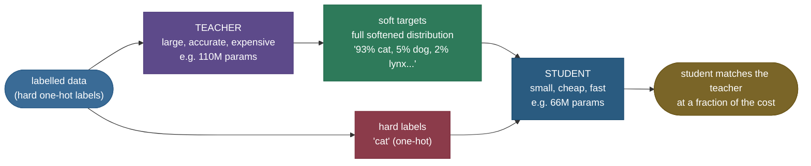
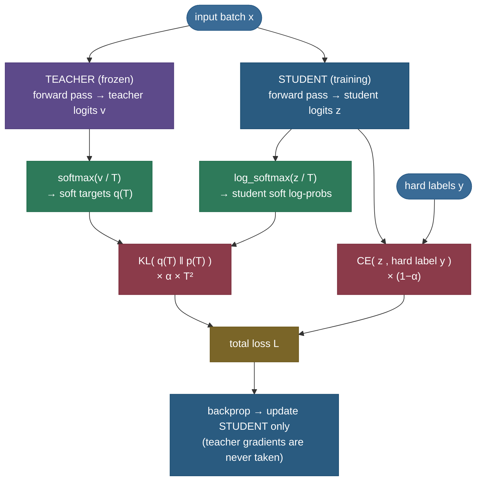
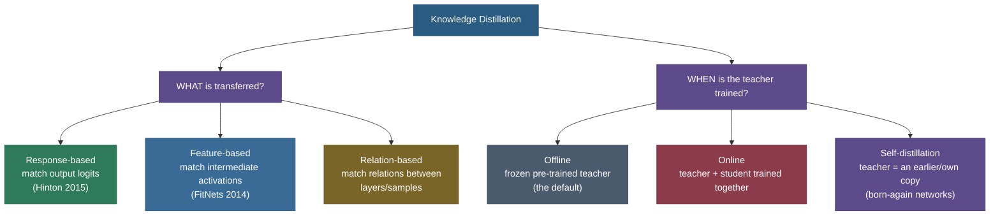
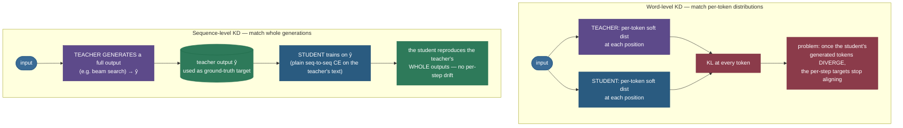

# Knowledge Distillation: teach a small model to think like a big one

You have a 70-billion-parameter teacher that answers brilliantly — and costs you a small fortune every time it does. You want a model a fraction of the size that's almost as good, cheap enough to serve at scale. The obvious move is to take the same labelled data and train the small model on it directly. But there's a better idea hiding in plain sight, and it's the whole subject of this page: **don't just train the small model on the answers — train it on the *teacher's* answers.** Not the teacher's final pick, but the *full, softened probability distribution* the teacher produces. That distribution carries information the bare labels never could, and transferring it is what turns a mediocre small model into a near-replica of the big one.

That extra information has a name — **dark knowledge** — and the single insight of this whole topic is this:

> **The core insight.** A hard label says "this is a cat." A teacher's softened output says "this is a cat — but it's *much* more dog-like than it is car-like." That relative ranking of the *wrong* answers is a rich, free training signal about how the world's categories relate, and a one-hot label throws every bit of it away. Knowledge distillation is the trick of *not* throwing it away.

By the end of this page you'll be able to:

- explain **dark knowledge** and *why* soft targets carry more information than hard labels — and feel it on real numbers;
- write the **KD loss** from memory (softened-KL + hard-CE) and **derive the $T^2$ factor** that almost everyone gets wrong;
- choose **temperature $T$** and the mix weight $\alpha$, and predict what happens when you change them;
- distinguish the **flavors** — response/feature/relation-based, offline/online/self, born-again;
- explain how distillation actually works for **LLMs** (DistilBERT, TinyBERT, sequence-level KD, reasoning distillation);
- name the **limits** — the capacity gap, teacher errors, and tuning — before they bite you.

> **Note:** distillation is one of the **three compression levers**, alongside [quantization](../10-Quantization/10-Quantization.md) (fewer *bits* per weight) and pruning (fewer *weights*). Distillation is the one that changes the model's *size and shape* — you get a genuinely smaller architecture, not the same one stored more cheaply. The three compose.

---

## The problem: a great model you can't afford to run

Make the pain concrete. Suppose your best model is BERT-base: **110M parameters**, and it scores well on your task. Serving it, every request runs all 110M parameters; at load that's your latency budget and your GPU bill. You'd happily trade a sliver of accuracy for a model **40% smaller and 60% faster** — if only you could get one without giving up most of the quality.

The naive fix is to just train a small model on your labels. It *works*, but it leaves accuracy on the table, and the reason is subtle. Your labels are **one-hot**: for a "cat" image the target vector is $[1, 0, 0, 0, 0]$ — 100% cat, and *exactly zero* for dog, lynx, car, plane. That target asserts something false and wasteful: that a cat is **equally unlike** a dog and a jet plane. The small model, trained on that, never learns that cats and dogs are neighbours in concept-space while planes are far away. It has to rediscover all category structure from scratch, from limited data — and a small model with limited data often can't.

The big model **already learned that structure.** When it sees a cat it doesn't output a clean one-hot; it outputs something like "93% cat, 5% dog, 2% lynx, ~0% car, ~0% plane." Those small numbers on dog and lynx are not noise — they are the model telling you *which* classes are confusable, a compressed summary of everything it learned about how categories relate. Distillation's whole bet is: **make the small model match that distribution, and you hand it the big model's hard-won structure for free.**



*The distillation setup: a frozen teacher turns the data into **soft targets**, and the student trains on those soft targets (mainly) plus the original hard labels (a little). The soft targets are the channel through which the teacher's knowledge flows into the smaller student.*

---

## Intuition first: learn from the expert's hesitation, not just their verdict

Here is an analogy that holds up under pressure. Imagine two ways to learn to identify mushrooms.

**Way 1 (hard labels).** A field guide gives you photos, each stamped with one name: "edible," "poisonous." You memorize the stamps. When you meet a *new* mushroom that looks halfway between two photos, the guide is silent — it only ever told you the final answer, never *how close* anything was to anything else.

**Way 2 (soft targets).** You walk the woods with an expert mycologist. She picks up a mushroom and says: "This is *edible* — but notice it's *easy to confuse* with that poisonous one over there; the gills are the giveaway. Nothing like the bracket fungus on the tree, though." She is handing you her **uncertainty** and her **sense of which mistakes are tempting** — the relationships between categories, not just the verdict. You learn the *structure of the problem*, not a lookup table. After a season you make her judgement calls, even on mushrooms neither of you has seen.

The expert's hesitation — *"edible, but watch out, it's dog-like in this one way"* — is the dark knowledge. **The soft target is the verdict plus the hesitation.** A student that hears the hesitation generalizes far better than one that only memorized verdicts.

> **Where the analogy holds (and where to push it):** the mapping is exact — the mushroom's true name is the *hard label*, the expert's full "edible-but-confusable-with-X" judgement is the *soft target*, and the gill-comparison reasoning is the *class-similarity structure* in the teacher's logits. The one place to be careful: the expert can be **wrong**, and if she is, you'll confidently learn her mistake. That's the *teacher-error* limit we hit later — a real failure mode, not a flaw in the analogy.

But there's a catch the analogy also predicts. If the expert is *too* confident — she just says "edible!" and walks on, giving you nothing — you're back to hard labels. A well-trained teacher is often *exactly* that confident: it outputs "99.5% cat" and the dog/lynx signal is squashed to near-zero. We need a knob to make the teacher **think out loud** — to spread its confidence out so the hesitation becomes visible. That knob is **temperature**.

---

## Mechanism: temperature makes the dark knowledge visible

The teacher's last layer produces **logits** $z = (z_1, \dots, z_K)$ — one raw score per class. The usual softmax turns them into probabilities:

$$p_i = \frac{\exp(z_i)}{\sum_{j} \exp(z_j)}$$

> **Source / derivation:** [Bridle, *Probabilistic Interpretation of Feedforward Classification Network Outputs* (1990)](https://link.springer.com/chapter/10.1007/978-3-642-76153-9_28) — introduces the softmax as the normalized-exponential output for a classifier; the standard reference for the $T=1$ form above.

A confident teacher has one logit far above the rest, so the $\exp$ blows that class up and crushes everything else to ~0 — the dark knowledge is *there in the logits* but invisible after softmax. **Temperature** $T$ rescales the logits *before* the exponential:

$$p_i(T) = \frac{\exp(z_i / T)}{\sum_{j} \exp(z_j / T)}$$

Define the symbols once: $z_i$ is the logit for class $i$; $K$ is the number of classes; $T > 0$ is the temperature. At $T = 1$ this is the ordinary softmax. As $T \to \infty$, every $z_i/T \to 0$, so all $\exp$ terms $\to 1$ and the distribution flattens toward **uniform** ($1/K$ each). As $T \to 0$, the largest logit dominates utterly and the distribution sharpens toward the **one-hot argmax**. So $T$ is a dial from "hard label" ($T\to0$) through "honest probabilities" ($T=1$) to "maximally spread out" ($T\to\infty$).

Dividing by $T > 1$ shrinks the *gaps* between logits, which is exactly what lifts the small probabilities up out of the floor where you can see — and learn from — them. Here is the *same* teacher output at three temperatures:


*Read it left to right. At $T=1$ the teacher says "94% cat" and the structure is hidden. At $T=4$ the *same logits* reveal "cat, but distinctly dog-like, somewhat lynx-like, nothing like car/plane" — the class-similarity ranking we want to transfer. At $T=10$ it over-flattens toward uniform and starts losing the signal. $T \approx 2\text{–}5$ is the usual sweet spot.* (Numbers from `code/make_figures_11.py`, the same logits used in the worked code below.)

Contrast that soft target with the hard label the small model would otherwise get:


*The hard label (left) is information-poor: it's true, but it claims a cat is *exactly* as unlike a dog as it is unlike a jet plane — which is false and unhelpful. The soft target (right) carries the **class-similarity geometry** the teacher learned. That difference is the entire value distillation extracts.*

---

## The math: the KD loss, derived (and the $T^2$ factor nobody explains)

The student trains against **two** targets at once: the teacher's soft distribution (most of the signal) and the true hard labels (a correction so it stays anchored to the ground truth). The loss is a weighted sum:

$$\boxed{\;\mathcal{L} \;=\; \underbrace{\alpha \, T^2 \, \mathrm{KL}\!\big(p^{\text{teacher}}(T)\;\|\;p^{\text{student}}(T)\big)}_{\text{soft term — match the teacher}} \;+\; \underbrace{(1-\alpha)\,\mathrm{CE}\big(y,\,p^{\text{student}}(1)\big)}_{\text{hard term — fit the labels}}\;}$$

> **Source / derivation:** [Hinton, Vinyals & Dean, *Distilling the Knowledge in a Neural Network* (2015), arXiv:1503.02531](https://arxiv.org/abs/1503.02531) — the founding paper; it introduces soft targets at temperature $T$, the combined soft+hard objective, and the $T^2$ rescaling derived below.

The symbols, each defined at first use:

- $p^{\text{student}}(T)$, $p^{\text{teacher}}(T)$ — the student's and teacher's softmax-with-temperature distributions, each a vector in $\mathbb{R}^K$ (shape `[K]` per example; `[batch, K]` for a batch).
- $\mathrm{KL}(p \| q) = \sum_i p_i \log \frac{p_i}{q_i}$ — the **KL divergence**, "how far the student's softened distribution is from the teacher's." Minimizing it pulls the student's *whole* distribution onto the teacher's, including the small dog/lynx masses. (Since the teacher is frozen, minimizing this KL is equivalent to minimizing the cross-entropy between the two softened distributions — they differ only by the teacher's fixed entropy.)
- $\mathrm{CE}(y, p) = -\sum_i y_i \log p_i$ — ordinary **cross-entropy** against the one-hot label $y$, evaluated at $T=1$ (the hard term uses normal, un-softened probabilities).
- $\alpha \in [0,1]$ — the **mix weight**: how much to trust the teacher vs. the labels. Typical values are high, $\alpha \approx 0.9$, because the soft targets are the richer signal; the hard term is a small anchor that keeps the student honest where the teacher is wrong.
- $T^2$ — the **temperature-squared rescaling factor**. This is the part worth deriving, because it's the most-misunderstood line in the whole topic.

### Why the $T^2$ factor must be there

The danger: temperature also *shrinks the gradients*, so naively raising $T$ to expose dark knowledge would quietly turn the soft term off. Here's the mechanism.

Consider the gradient of the soft cross-entropy w.r.t. a single student logit $z_i$. With softened probabilities $p_i(T) = \mathrm{softmax}(z_i/T)$ and teacher target $q_i(T)$, the gradient works out to

$$\frac{\partial \mathcal{L}_{\text{soft}}}{\partial z_i} \;=\; \frac{1}{T}\Big(p_i(T) - q_i(T)\Big).$$

(This is the standard softmax-cross-entropy gradient — the $\frac{1}{T}$ is the chain-rule factor from the $z_i/T$ inside the softmax; the zero-mean-logits assumption used next is without loss of generality, since softmax is shift-invariant — Hinton §2.1.) That leading $1/T$ is the first factor. Now expand $p_i(T)$ and $q_i(T)$ for **large $T$** (small $z_i/T$), using $\exp(x) \approx 1 + x$. When the logits are zero-meaned across classes, the high-temperature expansion gives $p_i(T) - q_i(T) \approx \frac{z_i - v_i}{K\,T}$, where $v_i$ are the teacher's logits. Substituting:

$$\frac{\partial \mathcal{L}_{\text{soft}}}{\partial z_i} \;\approx\; \frac{1}{T}\cdot\frac{z_i - v_i}{K\,T} \;=\; \frac{1}{K\,T^2}\,(z_i - v_i).$$

> **Source / derivation:** [Hinton, Vinyals & Dean, *Distilling the Knowledge in a Neural Network* (2015), §2.1, arXiv:1503.02531](https://arxiv.org/abs/1503.02531) — the high-temperature expansion showing the soft-target gradient scales as $1/T^2$, hence the compensating $T^2$ multiplier so soft and hard gradients stay comparable.

There it is: **the soft-target gradient scales as $1/T^2$.** Raise $T$ from 1 to 4 and the soft gradient shrinks by $16\times$ — the hard term would dominate and the dark knowledge would barely move the weights. Multiplying the soft loss by $T^2$ **exactly cancels** that shrink, so the soft and hard gradients keep comparable magnitudes no matter what $T$ you pick. That's the whole job of the factor:


*Without the factor (red), the soft gradient collapses as $T$ grows — exactly when you most want the dark knowledge to teach. With the factor (green), it stays flat, decoupling "how much to soften" from "how strongly the soft term trains." Pick $T$ for *visibility* of dark knowledge; the $T^2$ keeps its *influence* steady.*

And the two terms, composed, look like this for one training batch (synthetic but representative magnitudes):


*The raw soft-KL is small (the $/T$ shrinks logit gaps), but $\alpha T^2$ lifts it to dominate the total — which is what we want at $\alpha=0.9$: the teacher's distribution drives most of the update, with the hard labels a light anchor.*

> **Gotcha:** a common implementation bug is to soften with $T$ but **forget the $T^2$**. The code runs, loss goes down, accuracy is mediocre — because at $T=4$ your soft term is silently $16\times$ too weak. If raising $T$ makes distillation *worse*, suspect a missing $T^2$ first.

> **Note:** some libraries fold a $1/T^2$ into the KL term itself or use mean-reduction quirks; what matters is that the *effective* soft-gradient magnitude is roughly $T$-independent. Always check by raising $T$ and confirming the soft loss's *gradient* (not just its value) stays in the same ballpark.

---

## Mechanism, end to end: what flows where

Putting the pieces in order, one training step of distillation is:



*One KD training step (in the diagram, $q$ = teacher and $p$ = student, matching the boxed loss above). The teacher runs in `eval`/`no_grad` mode — it only *produces targets*, never learns. Both logits are softened by the same $T$ for the KL term; the student's *un-softened* logits feed the hard-label CE. The gradients update **only** the student. Forward cost is teacher + student per step (the teacher pass is the price of distillation); at inference you keep only the student.*

> **Tip:** in practice you often run the teacher **once, offline**, and cache its soft targets to disk. Then student training is as cheap as ordinary training — you're reading pre-computed targets, not re-running a 70B teacher every step. (This is *offline* distillation; more on the flavors below.)

---

## Worked example: see the dark knowledge, then prove KD beats hard-only

The code below does three things on a tiny synthetic 5-class task: (1) trains a **wide teacher** until it's accurate, (2) prints one of its outputs at $T=1$ vs $T=4$ so you *see* the dark knowledge emerge, and (3) trains a **narrow student** two ways — hard-labels-only vs the KD loss — from an *identical* initialization, and shows the KD student ends up agreeing with the teacher more. It runs on CPU in a few seconds.

> **Runnable project and a step-by-step notebook:** the full verified code lives as a clean script and an executed teaching notebook next to this page — see the [step-by-step teaching notebook](code/11-Knowledge-Distillation.ipynb) and the [runnable demo script](code/knowledge_distillation.py) (run it with `python knowledge_distillation.py`). The snippet below is the KD-loss heart of it.

```python
import torch
import torch.nn.functional as F

TEMPERATURE = 4.0   # T: softens the distributions to expose dark knowledge
ALPHA = 0.9         # weight on the soft (distillation) term; (1-alpha) on hard labels

def distillation_loss(student_logits, teacher_logits, hard_labels,
                      temperature=TEMPERATURE, alpha=ALPHA):
    """L = alpha * T^2 * KL(teacher_T || student_T) + (1-alpha) * CE(student, hard)."""
    # soft term: divide logits by T BEFORE softmax, then match distributions via KL
    student_log_soft = F.log_softmax(student_logits / temperature, dim=-1)  # student_T (log-probs)
    teacher_soft     = F.softmax(teacher_logits / temperature, dim=-1)       # teacher_T (the target)
    soft_kl = F.kl_div(student_log_soft, teacher_soft, reduction="batchmean")
    # the T^2 factor: cancels the 1/T^2 gradient shrink so the soft term keeps teaching
    soft_term = (temperature ** 2) * soft_kl
    # hard term: ordinary cross-entropy on the true labels (at T=1)
    hard_ce = F.cross_entropy(student_logits, hard_labels)
    return alpha * soft_term + (1.0 - alpha) * hard_ce
```

Running the full script prints the dark knowledge on one teacher "cat" example — the measured teacher logits, softened two ways:

```
Dark knowledge -- one teacher 'cat' example, softened by temperature:
     class |  T=1 prob |  T=4 prob
  --------------------------------
       cat |     0.953 |     0.630
       dog |     0.047 |     0.298
      lynx |     0.000 |     0.066
       car |     0.000 |     0.005
     plane |     0.000 |     0.000
  -> at T=1 'dog' carries 0.047; at T=4 it lifts to 0.298 (the dark knowledge a one-hot label discards)
```

At $T=1$ the teacher is 95% sure it's a cat and the dog signal (0.047) is nearly invisible; soften to $T=4$ and the *same logits* reveal a clear "cat, but quite dog-like, a bit lynx-like, nothing like car/plane" — the exact similarity structure our synthetic data baked in (we deliberately put the "dog" class close to "cat"). The teacher *learned* this from data; the one-hot label has none of it.

Then it trains the two students from a shared init and measures **agreement** (does the student's prediction match the *teacher's* prediction?) and test accuracy:

```
device: cpu (detected mps; pinned to CPU for reproducibility)
torch: 2.12.0

         student |  test acc |  agreement w/ teacher
------------------------------------------------------
hard-labels-only |     0.809 |                 0.812
  KD (soft+hard) |     0.882 |                 0.887
   teacher (ref) |     0.872 |                 1.000

PASS: KD student agreement 0.887 >= hard-only 0.812 (+7.6 points) -- distillation transferred
the teacher's behaviour, not just the labels.
```


*The payoff, on measured numbers. Both students saw the same tiny labelled subset (150 points) and started from identical weights — the **only** difference is the loss. The KD student agrees with the teacher **+7.6 points** more, and its raw test accuracy (0.882) even edges out the hard-only student (0.809) and the teacher itself — because in this data-starved regime the teacher's soft targets densify the sparse labels. That regime (strong teacher, few labels for the student) is exactly where distillation shines.*

> **Note:** this win is real but its *size* depends on the regime. Give the student abundant data and a task it can easily fit, and hard-only catches up — there was nothing the soft targets could add. Distillation buys the most when the student is **genuinely capacity- or data-limited** relative to the teacher. Reproduce by changing `N_STUDENT_TRAIN` in the script and watching the gap shrink as data grows.

---

## The flavors: what exactly do you transfer?

"Match the teacher's logits" is just the first and simplest form. The field organizes along two axes — **what** you transfer and **when**.



*The two axes of distillation. The Hinton 2015 loss is the top-left cell (response-based, offline) — the default and the one to know cold. The others extend it.*

**What you transfer:**

- **Response-based** — match the teacher's **output logits/probabilities**. This is Hinton 2015, the loss above. Simple, architecture-agnostic (teacher and student can be totally different inside), and the most common.
- **Feature-based** — match the teacher's **intermediate activations**, not just the final output. **FitNets** introduced this: a thin, deep student is guided by "hints" from the teacher's hidden layers, with a learned projection to align the (different) widths.

  > **Source / derivation:** [Romero et al., *FitNets: Hints for Thin Deep Nets* (2014), arXiv:1412.6550](https://arxiv.org/abs/1412.6550) — feature-based distillation: a regression loss from teacher hidden activations ("hints") to student layers, enabling thinner-and-deeper students than response matching alone.

- **Relation-based** — match the **relationships** between things: how layers relate to each other, or how samples relate in feature space (e.g. preserve the pairwise distances between examples). Useful when the student should mirror the teacher's *geometry* even if absolute activations differ.

**When the teacher is trained:**

- **Offline** — a fixed, pre-trained teacher produces targets; the student learns from them. The default, and what the worked example does.
- **Online** — teacher and student train **together** (no separately-pretrained teacher); they teach each other as they go (deep mutual learning, codistillation). Useful when you don't have a strong teacher lying around.
- **Self-distillation** — the teacher is *the same model* (or an earlier copy of it). **Born-Again Networks** showed the surprising result that distilling a model into a *fresh copy of identical architecture* can **beat the original** — the soft targets regularize and smooth training even with zero capacity gap.

  > **Source / derivation:** [Furlanello et al., *Born-Again Neural Networks* (2018), arXiv:1805.04770](https://arxiv.org/abs/1805.04770) — self-distillation into an identically-sized student that outperforms the teacher, isolating the regularization benefit of soft targets from the compression benefit.

---

## Distillation for LLMs and NLP

Everything above is classifier-shaped (a fixed set of classes). LLMs add a twist: the "classes" are the **vocabulary** (tens of thousands of tokens) and the model emits a *sequence* of them. Distillation adapts in a few important ways.

**DistilBERT — the canonical compression win.** Sanh et al. distilled BERT-base (12 layers, 110M params) into a **6-layer, 66M-param** student during *pretraining*. The result: **40% smaller, 60% faster, retaining ~97% of BERT's language-understanding (GLUE) performance.** The training objective is a **triple loss** — the distillation (soft-target) loss on the masked-LM predictions, the usual masked-LM loss on hard labels, *plus* a **cosine-embedding loss** that aligns the directions of the student's and teacher's hidden states (a feature-based term). A useful trick: they **initialized** the student by taking every other layer of the teacher, giving training a strong head start.

> **Source / derivation:** [Sanh et al., *DistilBERT, a distilled version of BERT* (2019), arXiv:1910.01108](https://arxiv.org/abs/1910.01108) — the triple loss (soft-target + masked-LM + cosine-embedding), the 6-layer student initialized from the teacher, and the 40%-smaller / 60%-faster / ~97%-performance headline.


*The headline result that put distillation on every LLM-compression checklist. Same idea as the classifier case — match the teacher's softened distribution — applied over the vocabulary during pretraining, with a feature-based cosine term added. Each number has a mechanism: the ~60%-faster (≈1.6× speedup) comes directly from the student having **6 transformer layers instead of 12** — half as many sequential matmuls per token — and the 40%-smaller from those missing layers' parameters.*

**TinyBERT — go deeper into the features.** TinyBERT pushes feature-based distillation hard: it matches not just outputs but the teacher's **embedding outputs, hidden states, *and* attention matrices**, in a two-stage (general + task-specific) scheme. The attention-matrix matching is the notable bit — the student is taught to *attend like the teacher*, which transfers linguistic structure that output matching alone misses.

> **Source / derivation:** [Jiao et al., *TinyBERT: Distilling BERT for Natural Language Understanding* (2019), arXiv:1909.10351](https://arxiv.org/abs/1909.10351) — multi-component feature distillation (embeddings, hidden states, **attention matrices**) in a two-stage general/task-specific procedure.

**Sequence-level KD — distill the *generations*, not the per-token distributions.** For generation (translation, summarization, chat), matching per-token distributions ("word-level KD") is weaker than it sounds, because the student's and teacher's sequences diverge and the per-step targets stop aligning. Kim & Rush's **sequence-level KD** sidesteps this elegantly: run the teacher to **generate** outputs (e.g. via beam search), then train the student on those teacher-generated sequences as if they were the ground truth. The student learns to reproduce the *teacher's whole outputs*, not just its token-by-token hesitation. This is the form most relevant to modern LLMs.

> **Source / derivation:** [Kim & Rush, *Sequence-Level Knowledge Distillation* (2016), arXiv:1606.07947](https://arxiv.org/abs/1606.07947) — distilling on the teacher's *generated sequences* rather than per-token soft targets; the foundation for generation-task and LLM distillation.



*Word-level vs sequence-level KD. **Word-level** (top) matches the teacher's and student's per-token distributions — but as the student generates, its tokens drift from the teacher's, so the per-step targets it's matched against no longer correspond to the text it actually produced. **Sequence-level** (bottom) sidesteps this: let the teacher **generate** a full output, then train the student on that output as if it were the gold label — the student learns to reproduce the teacher's whole generation, no per-step misalignment. This is the form behind modern LLM and synthetic-data distillation.*

**Reasoning / chain-of-thought distillation — the modern frontier.** A large teacher can be prompted to produce **step-by-step reasoning** (chain-of-thought) before its answer. CoT distillation trains a *small* student on the teacher's reasoning *traces* — not just the final answer but the intermediate steps. The student learns to "show its work" the way the big model does, transferring [reasoning ability](../17-Chain-of-Thought-Reasoning/17-Chain-of-Thought-Reasoning.md) that a same-size model trained on answers alone often can't acquire. This is how many small open "reasoning" models are made: generate reasoning data from a strong teacher, then fine-tune the student on it (a sequence-level KD in spirit, with reasoning traces as the targets).

> **Note:** the line between "sequence-level KD" and "just fine-tuning on synthetic data the big model wrote" is blurry — and deliberately so. When you fine-tune a small model on GPT-4-generated instructions and answers, **you are doing distillation** (the teacher's behaviour is the target), even if no temperature or KL appears. Much of the recent small-open-model wave is exactly this.

---

## Pitfalls and limits

Distillation is not magic; it has well-understood failure modes. Know them before you ship.

- **The capacity gap.** A student that is *too* small simply cannot represent the teacher's function, and pushing it to match a much stronger teacher can *hurt* — the soft targets become a moving target it can't fit, and quality can drop *below* training it on hard labels alone. There's a sweet spot in teacher-to-student size ratio; an enormous teacher is sometimes a *worse* distillation source than a moderate one. If distillation underperforms, your teacher may be too strong for your student, not too weak.

- **Teacher errors propagate — confidently.** The student learns the teacher's *mistakes and biases* along with its skills, and learns them with the teacher's confidence. If the teacher systematically confuses two classes, the student will too. The hard-label term (the $(1-\alpha)$ part) is partly there to anchor the student to ground truth where the teacher is wrong — don't set $\alpha = 1$.

- **Temperature and $\alpha$ are real hyperparameters.** Too low a $T$ and there's no dark knowledge to transfer (you're back to hard labels); too high and you over-flatten toward uniform and transfer noise. Too high an $\alpha$ and a wrong teacher drags the student off; too low and you barely distill. $T \in [2,5]$ and $\alpha \in [0.5, 0.95]$ are common starting points — but *tune them*, and remember the **$T^2$ factor** so changing $T$ doesn't silently change the soft term's strength.

- **The missing-$T^2$ bug** (worth repeating because it's so common): soften with $T$, forget the $T^2$, and your soft loss is $T^2\times$ too weak. Symptom: raising $T$ makes results worse. Fix: multiply the soft term by $T^2$.

- **Mode-collapse in sequence-level KD.** Training on a *single* teacher generation per input can make the student overly peaked and lose diversity. Mitigations: sample multiple teacher outputs, or mix in real data.

- **You still pay for the teacher once.** Distillation moves cost from inference to *training*: you must run the (expensive) teacher to produce targets. It's worth it when you'll serve the student many times, but it isn't free.

---

## Where it matters

Distillation is everywhere small-but-capable models come from:

- **Production NLP** — DistilBERT, TinyBERT, MobileBERT and kin power latency- and cost-sensitive deployments (on-device, high-QPS APIs) at a fraction of the full model's cost.
- **The small-open-LLM wave** — a large swathe of capable small chat/instruct and "reasoning" models are distilled from stronger teachers (sequence-level / synthetic-data / CoT distillation). When a 7B model punches far above its weight, a strong teacher's generations are often behind it.
- **Edge and mobile** — distillation is the standard way to fit a usable model onto a phone or microcontroller, usually **stacked with [quantization](../10-Quantization/10-Quantization.md)** (distill to a small architecture, *then* quantize its weights).
- **Ensembles → one model** — Hinton's original motivation: distill a slow ensemble of models into a single fast network that retains most of the ensemble's accuracy.

**When *not* to reach for it:** if your student has plenty of capacity and you have abundant labelled data, plain training may match distillation with less machinery. And if you need the *teacher's* top-end accuracy (not 97% of it), distillation is the wrong tool — you can't compress away a capability the student is too small to hold. Distillation trades a little quality for a lot of efficiency; make sure that's the trade you want.

> **Tip:** the three compression levers compose and are usually applied in order — **distill** (smaller architecture) → **prune** (drop dead weights) → **quantize** (fewer bits). Each attacks a different axis of cost, and a production small model often has all three applied.

---

## Recap and rapid-fire

**If you remember nothing else:** a teacher's *softened output distribution* encodes which classes are confusable — **dark knowledge** that one-hot labels discard. Train a small student to match that distribution (soft-KL) plus the true labels (hard-CE), softening both with temperature $T$ to expose the dark knowledge, and multiply the soft term by $T^2$ so raising $T$ doesn't shrink its gradient. The student ends up behaving like the teacher at a fraction of the cost — that's DistilBERT (40% smaller, ~97% of the quality) and the small-LLM wave.

**Quick-fire — say these out loud:**

- *What is dark knowledge?* The relative probabilities the teacher assigns to the *wrong* classes — the class-similarity structure a one-hot label throws away.
- *Write the KD loss.* $\mathcal{L} = \alpha T^2 \,\mathrm{KL}(p^{\text{teacher}}_T \| p^{\text{student}}_T) + (1-\alpha)\,\mathrm{CE}(y, p^{\text{student}})$.
- *Why the $T^2$?* The soft-target gradient scales as $1/T^2$; the factor cancels it so soft and hard gradients stay comparable as $T$ changes.
- *What does temperature do?* $T>1$ flattens the distribution, lifting the small "wrong-class" probabilities into a learnable range; $T\to\infty$ → uniform, $T\to0$ → one-hot.
- *Soft targets vs hard labels — why better?* Soft targets carry inter-class similarity and densify the signal; the student generalizes from structure, not a lookup table.
- *Response vs feature vs relation distillation?* Match outputs / match intermediate activations / match relationships between layers or samples.
- *Offline vs online vs self?* Frozen pretrained teacher / train together / teacher is an earlier copy of the same model (born-again).
- *DistilBERT in one line?* 6-layer student of BERT via a triple loss (soft-target + MLM + cosine), 40% smaller, 60% faster, ~97% of GLUE.
- *Sequence-level KD?* Train the student on the teacher's *generated sequences*, not per-token distributions — the LLM-relevant form (and what synthetic-data fine-tuning really is).
- *The capacity gap?* A too-small student can't fit a too-strong teacher; distillation can then hurt. There's a sweet spot in size ratio.

---

## References and further reading

The curated link library for this topic — videos, courses, articles, papers, and interactive demos — lives in a companion file so it can be reused as a standalone reference list:

**→ [Knowledge Distillation — references and further reading](11-Knowledge-Distillation.references.md)**
