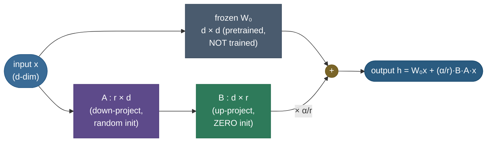
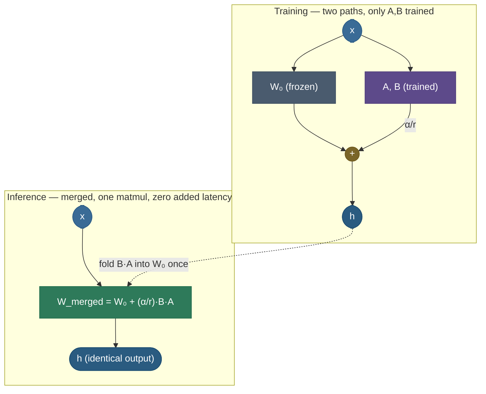
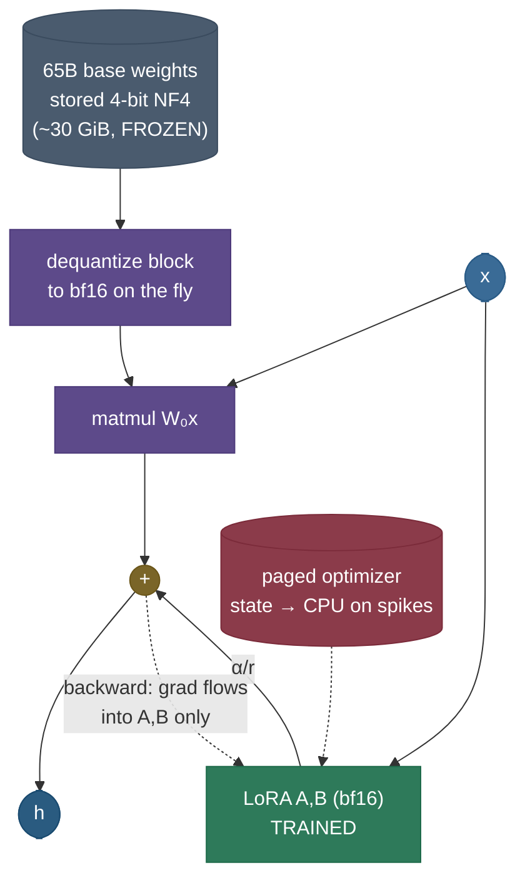
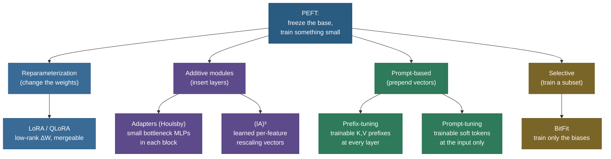

# LoRA & PEFT: fine-tune a frozen giant by training a tiny patch

Suppose you want to teach a 7-billion-parameter model to write in your company's voice. The obvious recipe — **full fine-tuning** — is to unfreeze all 7 billion weights and let the optimizer update every one. It works. It is also brutal: to *update* a parameter with Adam you don't just store the weight (2 bytes in fp16), you store a gradient and two optimizer moments and an fp32 master copy on top — so the *training* footprint balloons to roughly **8× the weights**, and that 14 GB model now needs **~100+ GB** of GPU memory just to take one step. Worse, the artifact you get back is a *complete new 14 GB copy of the model*, per task. Ten tasks, ten copies, 140 GB of weights to store and serve. The model barely changed — but you paid full price to change it.

**Parameter-Efficient Fine-Tuning (PEFT)** is the family of methods that says: *don't.* Freeze the giant, train a tiny add-on. **LoRA** — Low-Rank Adaptation — is the method that won, because it pairs a cheap-to-train patch with a beautiful property: at inference you can **fold the patch back into the weights** so it costs *zero* extra latency. **QLoRA** then stacks 4-bit quantization underneath and puts 65B fine-tuning on a single GPU.

I'm going to walk this the way I'd explain it to a teammate who has a fine-tune to ship and one GPU to do it on. We start with *why* full fine-tuning hurts (feel the memory), then the **one insight** LoRA is built on, then the mechanism and the exact math (every symbol, every shape), then we *build it from scratch* and prove the merge is free, then QLoRA and the wider PEFT family, then the pitfalls that actually bite. By the end you'll be able to:

- write **ΔW = (α/r)·B·A** from memory and say what every symbol and shape is;
- explain **why B is zero-initialized** (so training starts exactly at the pretrained model);
- compute the **parameter reduction** (2rd vs d², e.g. **64×** at d=1024, r=8) on the spot;
- explain why LoRA adds **zero inference latency** — and prove it in code;
- explain **QLoRA** (NF4 + double quant + paged optimizers) and the memory win it buys;
- place **adapters, prefix/prompt-tuning, (IA)³, BitFit** in the PEFT landscape and say what each tunes;
- reason about the knobs — **rank r, α, which modules to adapt** — and how each fails.

> **Note:** LoRA changes *how you train and store* a fine-tune, not *what the model can express*. A merged LoRA model is an ordinary model with ordinary weights — the low-rank constraint is a constraint on the *update*, not on the final weight.

---

## The problem: full fine-tuning pays full price to change little

To see why PEFT exists, you have to feel what full fine-tuning costs to *train*, not just to run.

A forward+backward pass needs more than the weights. With the **Adam/AdamW** optimizer — the default for LLMs — every trainable parameter drags along, per step:

- the **weight** itself,
- its **gradient**,
- two **optimizer moments** ($m$ and $v$, the running mean and variance of the gradient),
- and (in mixed-precision training) an **fp32 master copy** of the weight.

Count the bytes for a 7B model (in GiB, $1\,\text{GiB} = 1024^3$ bytes, matching the figure below). Weights in fp16 are $7\text{B} \times 2 = \mathbf{13.0\ GiB}$. Gradients in fp16 add another **13.0 GiB**. Adam's two moments plus the fp32 master are kept in **fp32** — that's $7\text{B} \times 3 \times 4 = \mathbf{78.2\ GiB}$. Total to *update*: $13.0 + 13.0 + 78.2 = $ **~104 GiB**, before a single activation. That does not fit on an 80 GB A100. (Even with everything in fp16 it is ~65 GiB.)


And memory is only half of it. The *output* of full fine-tuning is a brand-new full-size checkpoint. Want the model in five different voices? Five 14 GB checkpoints — 70 GB to store, and you can't serve them from one loaded base. The economics are upside-down: a small behavioral change costs a full model's worth of compute, memory, and storage.

> **Note:** the optimizer-state cost is the real villain, and it's the one people forget. The frozen *weights* are needed either way (you have to run the model). What full fine-tuning adds is **gradients + optimizer state for all 7B params**. PEFT's whole game is to make *that* set tiny.

---

## The one insight: the update is low-rank

Here is the observation the whole field turns on. When you fine-tune, you transform the pretrained weight $W_0$ into $W_0 + \Delta W$. The pretrained $W_0$ is a big, dense, full-rank matrix — it had to be, to store everything the model learned in pretraining. But the **update** $\Delta W$ — the *change* fine-tuning makes — is empirically very **low-rank**. Adapting to a new task nudges the model along only a handful of directions, not all $d$ of them.

Aghajanyan et al. measured this directly: large pretrained models have a low **intrinsic dimension** — you can fine-tune them in a tiny random subspace and still hit ~90% of full-fine-tuning quality. LoRA takes that to its logical conclusion: *if the update is low-rank, parameterize it as low-rank and never form the full thing.*

> **Source / derivation:** [Aghajanyan, Zettlemoyer & Gupta, *Intrinsic Dimensionality Explains the Effectiveness of Language Model Fine-Tuning* (2020)](https://arxiv.org/abs/2012.13255) — measures that fine-tuning lives in a low-dimensional subspace, the empirical premise LoRA is built on.

**The analogy that holds up.** Think of $W_0$ as a finished, professionally-mastered song — every instrument, fully mixed. Full fine-tuning re-records the entire song from scratch to change the vocals. LoRA records a **small correction track** and plays it *on top* of the original. The original master is untouched (frozen); the correction is cheap to make and tiny to store; and at the end you can **bounce them down to a single track** (merge) so playback costs exactly what the original did. The constraint that the correction is "low-rank" is the musical claim that *the change you want is simple* — a few knobs, not a re-recording.

The follow-up question that tests the analogy: *what if the change you want is genuinely complex — not low-rank?* Then a small correction track can't capture it, and you hear the gap (LoRA underfits). The fix is to allow a **richer** correction — a higher rank $r$ — at the cost of a bigger patch. That dial, rank, is exactly LoRA's central knob, and we'll see it cliff-edge below.



*The LoRA forward pass. The input fans out two ways: through the untouched frozen weight $W_0$, and through the thin adapter $A$ (down to rank $r$) then $B$ (back up), scaled by $\alpha/r$. The two sums. Only $A$ and $B$ are trained; $W_0$ never moves.*

---

## The mechanism: a low-rank bypass around a frozen weight

Concretely, LoRA wraps a weight matrix (in a transformer, usually an attention or MLP projection). Take a linear layer with weight $W_0 \in \mathbb{R}^{d \times k}$. LoRA leaves $W_0$ **frozen** and adds a parallel path made of two small matrices:

- $A \in \mathbb{R}^{r \times k}$ — the **down-projection**, squeezing the input to a tiny rank-$r$ bottleneck.
- $B \in \mathbb{R}^{d \times r}$ — the **up-projection**, expanding back to the output width.

with $r \ll \min(d, k)$ — a rank of 8 or 16 against a width of thousands. The forward pass runs both paths and sums them:

$$h = W_0 x + \Delta W x = W_0 x + \frac{\alpha}{r} B A x$$


Three details make this work, and each is an interview question:

1. **$W_0$ is frozen.** No gradient, no optimizer state for it. This is what makes the trainable set tiny — and what lets *one* loaded $W_0$ be shared across many adapters.
2. **$B$ is initialized to zero** (and $A$ to small random values). So at step 0, $\Delta W = BA = 0$, and $h = W_0 x$ exactly. **Training begins precisely at the pretrained model** — no random perturbation to recover from — and the adapter learns its way *away* from zero. (If you zeroed $A$ instead, $A$'s gradient would also be zero and it could never start learning; zeroing $B$ keeps $A$'s gradient alive. One of the two must be zero so $\Delta W$ starts at 0, and it has to be $B$.)
3. **The $\alpha/r$ scaling** lets you change $r$ without re-tuning the learning rate. $\alpha$ is a fixed constant (often $\alpha = 2r$ or $\alpha = r$); dividing by $r$ keeps the *magnitude* of the update roughly constant as you sweep rank.


The headline this buys is a parameter count: full fine-tuning trains all $d^2$ of $W_0$, while LoRA trains only the thin $2rd$ of $A$ and $B$.


We derive that count exactly in the next section.

---

## The math: derive the parameter win

Everything LoRA promises falls out of comparing two parameter counts. State the shapes, then count.

$$
\begin{aligned}
W_0 &\in \mathbb{R}^{d \times k} &&\text{frozen pretrained weight} \\
A &\in \mathbb{R}^{r \times k} &&\text{down-projection (trained)} \\
B &\in \mathbb{R}^{d \times r} &&\text{up-projection (trained)} \\
\Delta W = BA &\in \mathbb{R}^{d \times k} &&\text{the effective update, never stored explicitly}
\end{aligned}
$$

For a square layer ($k = d$, the common case for attention projections):

$$\underbrace{d \times d = d^2}_{\text{full fine-tuning trains this}} \quad\text{vs}\quad \underbrace{r \times d + d \times r = 2rd}_{\text{LoRA trains this}}$$

The reduction ratio is $\dfrac{d^2}{2rd} = \dfrac{d}{2r}$.

> **Source / derivation:** [Hu et al., *LoRA: Low-Rank Adaptation of Large Language Models* (2021)](https://arxiv.org/abs/2106.09685) — §4 introduces $h = W_0x + \tfrac{\alpha}{r}BAx$ with $B$ zero-init, $A$ random-init, and the $2rd$-vs-$d^2$ parameter accounting.

**Plug in real numbers.** Take $d = 4096$ (a 7B-class hidden size) and $r = 8$:

$$\text{full: } 4096^2 = 16{,}777{,}216 \text{ params per matrix} \qquad \text{LoRA: } 2 \times 8 \times 4096 = 65{,}536 \text{ params}$$

That's a **256× reduction per matrix** ($d/2r = 4096/16$). Apply LoRA only to the attention $q$ and $v$ projections across all layers (the standard placement) and the *total* trainable parameters for a 7B model land around **0.1–0.3% of full fine-tuning** — a few million parameters instead of seven billion.

> **Note:** the demo in the code section uses $d = 1024, r = 8$ for a tractable on-CPU run, giving $d/2r = 1024/16 = \mathbf{64\times}$ — the exact number the figures and notebook print. The *ratio scales with width*: the bigger the model, the bigger the LoRA win, because $W_0$ grows as $d^2$ while the adapter grows only as $2rd$.


The key sanity check, visible above: LoRA is only cheap **while $r \ll d/2$**. Push $r$ to $d/2$ and $2rd = d^2$ — you're training as many parameters as full fine-tuning, just factored. Rank is a budget, and small is the point.

---

## Mechanics: forward, backward, and the zero-latency merge

**Forward.** Two matmuls instead of one: the frozen $W_0 x$, and the adapter $\tfrac{\alpha}{r}B(Ax)$. Note the parenthesization — $A x$ first (down to $r$ dims), then $B(\cdot)$ (back up). You never form $BA$ as a $d \times d$ matrix during training; you keep the two thin factors. The extra FLOPs are $O(rd)$ on top of the layer's $O(d^2)$ — negligible while $r \ll d$.

**Backward.** Gradients flow into $A$ and $B$ only. $W_0$ has `requires_grad = False`, so it receives no gradient and the optimizer holds no state for it. This is the mechanical source of the memory win: the gradient and Adam moments exist for $2rd$ parameters, not $d^2$.

**The merge — why latency is zero.** At inference you don't need the two paths. Since both are linear in $x$:

$$h = W_0 x + \frac{\alpha}{r}BA x = \left(W_0 + \frac{\alpha}{r}BA\right)x = W_{\text{merged}}\, x$$

Compute $W_{\text{merged}} = W_0 + \tfrac{\alpha}{r}BA$ **once**, store it in place of $W_0$, and the served model is an ordinary linear layer — same shape, same FLOPs, same latency as the original. The adapter has *vanished* into the weights. This is LoRA's defining advantage over adapter-layer methods, which add modules that *stay* in the forward pass and cost latency forever.



*Train with two paths (cheap, only A,B move); serve with one merged matrix (zero extra cost). The dashed arrow is the fold: $W_{\text{merged}} = W_0 + \tfrac{\alpha}{r}BA$, done once before deployment.*

> **Gotcha:** merging is **per-adapter**. If you want to serve many task-specific LoRAs from one base, you *don't* merge — you keep $W_0$ shared and swap the tiny $B, A$ per request (multi-LoRA serving, below). Merge buys zero latency for a *single* adapter; keeping them separate buys cheap multi-task serving. You choose based on the deployment.

---

## Worked code: build it, prove the win, prove the merge is free

Here's a from-scratch LoRA-wrapped linear layer. It freezes $W_0$, trains only $A, B$ with the $\alpha/r$ scale and $B = 0$ init, prints the **trainable-vs-frozen** counts, confirms gradients reach $A,B$ but not $W_0$, trains on a tiny task whose true update is genuinely rank-4, and then **merges and asserts the merged forward equals the unmerged LoRA forward** — the zero-latency proof. It runs on CPU in a few seconds.

> **Runnable project and a step-by-step notebook:** the same verified code lives as a clean script and an executed teaching notebook next to this page — see the [step-by-step teaching notebook](code/12-LoRA-and-PEFT.ipynb) and the [runnable demo script](code/lora_peft.py) (run it with `python lora_peft.py`).

```python
"""From-scratch LoRA: frozen W + trainable low-rank B·A, with the merge proof.
Verified on Python 3.12 / torch 2.12.0, CPU."""
import torch, torch.nn as nn, torch.nn.functional as F

class LoRALinear(nn.Module):
    def __init__(self, in_f, out_f, rank, alpha):
        super().__init__()
        self.scaling = alpha / rank                          # the α/r scale
        self.weight = nn.Parameter(torch.randn(out_f, in_f) * 0.02,
                                   requires_grad=False)       # W₀ FROZEN
        self.lora_a = nn.Parameter(torch.empty(rank, in_f))   # A: r×d, random
        self.lora_b = nn.Parameter(torch.zeros(out_f, rank))  # B: d×r, ZERO -> ΔW=0 at init
        nn.init.kaiming_uniform_(self.lora_a, a=5**0.5)

    def forward(self, x):
        base   = F.linear(x, self.weight)                              # x·W₀ᵀ (frozen)
        update = F.linear(F.linear(x, self.lora_a), self.lora_b) * self.scaling  # (α/r)·B·A·x
        return base + update

    def merged_weight(self):
        return self.weight + (self.lora_b @ self.lora_a) * self.scaling  # W₀ + (α/r)·B·A

layer = LoRALinear(1024, 1024, rank=8, alpha=16)
trainable = sum(p.numel() for p in layer.parameters() if p.requires_grad)   # 2·8·1024 = 16,384
frozen    = sum(p.numel() for p in layer.parameters() if not p.requires_grad)# 1024² = 1,048,576
print(f"trainable {trainable:,} | frozen {frozen:,} | reduction {frozen/trainable:.0f}x")
```

Output:

```
trainable 16,384 | frozen 1,048,576 | reduction 64x
```

The full script also trains the adapter and verifies the merge. The two checks that matter:

```
=== B = 0 init => ΔW = 0 at step 0 ===
max|ΔW| before any training: 0.0e+00  (exactly zero -> starts at pretrained)

=== Merge B·A into W -> zero added inference latency ===
merged == unmerged forward: True   max abs diff: 8.11e-06 (within float-noise tolerance)
```

> **Note:** read those two outputs as the two halves of LoRA's promise. **First:** $\max|\Delta W| = 0$ before training — $B=0$ means the adapted model *is* the pretrained model at step 0, so fine-tuning starts from the right place. **Second:** the merged single-matrix forward equals the two-path LoRA forward to floating-point noise — so at inference you fold $BA$ into $W_0$ and pay **nothing** extra. The tiny $8\times10^{-6}$ gap is float rounding between "two matmuls then add" and "add then one matmul" — the fp32 accumulation floor, four-plus orders below the $10^{-4}$ assertion tolerance, and not a modeling difference.

**The rank cliff.** Sweeping $r$ on a task whose true update is rank-4 shows the central tradeoff concretely:

```
 rank r |  trainable | % of full FT |   final loss
----------------------------------------------------
      1 |      2,048 |       0.195% |   2.7211e-01   <- underfits: rank too small
      2 |      4,096 |       0.391% |   1.7230e-01   <- still underfits
      4 |      8,192 |       0.781% |   8.5932e-07   <- fits! r = true rank (loss drops 5 orders)
      8 |     16,384 |       1.562% |   2.1496e-07   <- fits, but 2x the params for nothing
     32 |     65,536 |       6.250% |   1.3950e-07   <- fits, 8x the params, no better
```


This is the rule of thumb made visible: **pick $r$ near the update's intrinsic rank.** Below it you underfit; above it you waste parameters. For real LLM fine-tunes the intrinsic rank is small, which is *why* $r = 8$ or $16$ is usually plenty.

---

## QLoRA: 4-bit base + adapters → 65B on one GPU

LoRA shrinks the **gradients and optimizer state** (only $A, B$ are trained). But the **frozen base weights** still sit in memory in fp16 — 14 GB for 7B, ~130 GB for 65B. For the biggest models, that base alone overflows the GPU before any adapter exists.

**QLoRA** removes that wall by quantizing the frozen base to **4 bits**. Three ideas combine:

- **4-bit NF4 (NormalFloat-4).** A 4-bit datatype whose 16 quantization levels are placed at the *quantiles of a normal distribution* — because neural-net weights are roughly Gaussian, this spends precision where the weights actually are, beating uniform INT4. The base is stored in NF4; it is **dequantized on the fly** to bf16 for each matmul, then discarded. (See [Quantization](../10-Quantization/10-Quantization.md) for NF4 and the dequant mechanics.)
- **Double quantization.** Even the *quantization constants* (one scale per block of weights) take space. QLoRA quantizes those constants too — a second, cheaper quantization — shaving the last ~0.4 bits/param.
- **Paged optimizers.** Use NVIDIA unified memory to **page** optimizer state to CPU RAM during memory spikes (e.g. a long sequence), so a transient peak doesn't OOM the run.

The adapters themselves stay in **bf16** and train normally — the gradient flows *through* the dequantized base into $A, B$. The base is never updated, so its lossy 4-bit storage doesn't accumulate error during training.

> **Source / derivation:** [Dettmers, Pagnoni, Holtzman & Zettlemoyer, *QLoRA: Efficient Finetuning of Quantized LLMs* (2023)](https://arxiv.org/abs/2305.14314) — introduces NF4, double quantization, and paged optimizers; shows 4-bit base + LoRA matches 16-bit full fine-tuning quality while fitting 65B on a single 48 GB GPU.


The result that made QLoRA famous: **fine-tuning a 65B model on a single GPU**, at quality matching 16-bit full fine-tuning. The combination — *quantize the part you don't train, keep precision on the tiny part you do* — is the template for memory-efficient adaptation.



*QLoRA's training step: the 4-bit base is dequantized block-by-block to bf16 for each matmul (never updated), the bf16 adapters train normally, and the optimizer state can page to CPU during a memory spike.*

---

## The PEFT family: LoRA is one of several

LoRA won the popularity contest, but it sits in a family of methods that all freeze the base and train something small. Knowing the others sharpens *why* LoRA is usually the pick — and when it isn't.



*The PEFT landscape by mechanism: reparameterize the weights (LoRA), insert modules (adapters, (IA)³), prepend vectors (prefix/prompt-tuning), or select a subset (BitFit). LoRA's edge is that its addition is linear, so it merges away at inference.*

| Method | What it trains | Trainable size | Inference cost | Key idea |
|---|---|---|---|---|
| **LoRA** | low-rank $A,B$ per adapted matrix | ~0.1–1% | **zero (mergeable)** | $\Delta W = \tfrac{\alpha}{r}BA$ |
| **Adapters** (Houlsby) | small bottleneck MLPs inside each block | ~1–4% | adds layers → small latency | insert down→nonlin→up modules |
| **Prefix-tuning** | trainable K/V "prefix" vectors at every layer | ~0.1–1% | adds to attention each step | steer attention with learned prefixes |
| **Prompt-tuning** | soft-prompt vectors at the **input only** | tiny (≪0.1%) | adds a few input tokens | learn "virtual tokens," not weights |
| **(IA)³** | per-feature scaling vectors (rescale K, V, FFN) | very small | element-wise scale, mergeable | learn what to *amplify/suppress* |
| **BitFit** | only the bias terms | ~0.1% | zero (biases already there) | surprisingly strong baseline |

> **Source / derivation:** [Houlsby et al., *Parameter-Efficient Transfer Learning for NLP* (2019)](https://arxiv.org/abs/1902.00751) — the original adapter: small bottleneck MLPs inserted in each transformer block, trained while the base is frozen.

> **Source / derivation:** [Li & Liang, *Prefix-Tuning: Optimizing Continuous Prompts for Generation* (2021)](https://arxiv.org/abs/2101.00190) — prepends trainable continuous key/value vectors at every layer, steering the model without touching its weights.

> **Source / derivation:** [Lester, Al-Rfou & Constant, *The Power of Scale for Parameter-Efficient Prompt Tuning* (2021)](https://arxiv.org/abs/2104.08691) — learns soft-prompt embeddings at the input only; shows it closes the gap to full fine-tuning as model scale grows.

**Where to put LoRA.** The standard, from the paper's ablations, is the attention **query and value projections** ($W_q, W_v$) — adapting those gives most of the benefit. Many modern recipes extend to all four attention projections ($q,k,v,o$) and sometimes the MLP, trading more parameters for a bit more quality. The choice of *which modules* is a real knob, second only to rank.

> **Note:** prefix/prompt-tuning vs LoRA in one line: prompt methods steer the model through its **inputs/activations** (they prepend vectors and leave every weight untouched), while LoRA edits an **effective weight** (and can merge into it). Prompt-tuning is the lightest-weight and gets better with scale, but LoRA tends to be more reliable on smaller models and harder tasks — and it's the one that disappears at inference.

---

## Multi-LoRA serving: one base, many tiny adapters

Because a LoRA adapter is a few MB and the base is shared, you get a serving pattern full fine-tuning can't touch: load $W_0$ **once**, keep a library of small adapters, and apply the right one per request.


This is how a single deployment serves dozens of customer-specific or task-specific models from one set of weights. Systems like **S-LoRA** and **LoRAX** push this to thousands of adapters on one base, batching requests that use *different* adapters together by computing the shared $W_0 x$ once and the per-request $B_i A_i x$ in a batched low-rank kernel. Full fine-tuning would need a separate loaded model per task; LoRA needs one base and a directory of patches.

> **Tip:** the decision rule. **Merge** when you serve *one* fine-tune (zero latency, single matmul). **Keep adapters separate** when you serve *many* (one base in memory, hot-swap MB-sized adapters). You can't have both for a given served weight — merging bakes one adapter in.

---

## Pitfalls and failure modes

The things that actually bite when you run LoRA in anger:

- **Rank too small → underfitting.** If the task needs a richer update than rank $r$ can express, the adapter plateaus at a worse loss (the $r=1,2$ rows in the sweep). Symptom: training loss stalls high and full fine-tuning clearly beats it. Fix: raise $r$, or adapt more modules.
- **Rank too large → savings evaporate.** At $r \to d/2$ you're training as many params as full fine-tuning. You also become more prone to overfitting small datasets. Most tasks need $r \in \{8, 16, 32\}$; reach higher only with evidence.
- **The $\alpha/r$ confusion.** $\alpha$ is *not* a second rank — it's a scale. A common bug is to raise $r$ and $\alpha$ together "to be safe," which silently changes the effective update magnitude. Keep $\alpha$ fixed (e.g. $2r$ via a convention) and let the $/r$ do the normalization, or you'll re-tune the learning rate every time you sweep rank.
- **Wrong modules adapted.** LoRA on only the embedding or only one projection often underperforms; the attention $q,v$ (or all of $q,k,v,o$) is the reliable default. Adapting *nothing* useful looks like "LoRA doesn't work for my task" when the placement is the problem.
- **Merging a quantized base (QLoRA) loses precision.** If you merge bf16 $BA$ into a **4-bit** base, you must dequantize, add, and (if re-quantizing) accept extra error — the merged 4-bit model is not bit-identical to the bf16 adapter+base path. For QLoRA, the common pattern is to keep adapters separate at serve time, or merge into a higher-precision copy. Measure quality after merging.
- **Forgetting LoRA is an *update*, not the model.** An adapter is meaningless without its exact base checkpoint. Ship the base version alongside the adapter, or a future base update silently breaks every adapter trained against the old one.

> **Gotcha:** "LoRA matches full fine-tuning" is true on *most* adaptation tasks but not a law. If a task requires the model to absorb genuinely new high-rank knowledge (large domain shift, lots of new facts), the low-rank constraint can cap quality — that's a case for higher rank, more modules, or full fine-tuning. Know the constraint you're imposing.

---

## Where it matters (the crux)

LoRA/PEFT is the reason fine-tuning a frontier model is something a single team — or a single GPU — can do at all. The crux, in one sentence: **it decouples the cost of *adapting* a model from the cost of *the model*.** A 70B model and a 7B model both get a few-MB adapter; the expensive frozen base is paid once and shared.

That decoupling is what enables three things the field now takes for granted:

1. **Democratized fine-tuning.** QLoRA put 65B fine-tuning on hardware a hobbyist can rent. The open-weights fine-tune ecosystem (the thousands of task- and persona-specific models on the Hub) exists because LoRA made each one cheap.
2. **Multi-tenant serving.** One base, a directory of adapters, per-customer behavior — the storage and serving math only works because the unit of customization is a patch, not a model.
3. **A composable adaptation stack.** LoRA is the parameter-efficient layer that **SFT** (supervised fine-tuning) and preference methods build on. In practice you rarely full-fine-tune for SFT or DPO — you LoRA-tune. (See [Supervised Fine-Tuning](../13-Supervised-Fine-Tuning/13-Supervised-Fine-Tuning.md).)

---

## In production: the real numbers

- **Hugging Face PEFT** is the de-facto library: `get_peft_model(base, LoraConfig(r=8, lora_alpha=16, target_modules=["q_proj","v_proj"]))` wraps a model in a few lines, and `merge_and_unload()` folds the adapter for zero-latency serving.
- **Typical config for a 7B fine-tune:** $r = 8\text{–}16$, $\alpha = 16\text{–}32$, LoRA on $q,k,v,o$ projections, adapter ~10–30 MB, trainable ~0.1–0.5% of params. Trains on a single consumer GPU.
- **QLoRA's headline:** a 65B model fine-tuned on a single 48 GB GPU; the resulting *Guanaco* models reached near-ChatGPT quality on benchmarks at a fraction of the compute — and the entire fine-tune artifact was the adapter, not a 130 GB checkpoint.
- **Multi-LoRA in serving engines:** vLLM, S-LoRA, and LoRAX serve hundreds-to-thousands of adapters off one base, batching across adapters. The shared $W_0x$ is computed once per batch; the per-adapter $BAx$ is a cheap batched low-rank op.
- **The standard pipeline today:** pretrain (expensive, once) → **LoRA/QLoRA SFT** (cheap, per use case) → optional **LoRA DPO** for preferences → merge or serve as adapters. PEFT is the rung the whole adaptation ladder stands on.

---

## Recap and rapid-fire

**If you remember nothing else:** fine-tuning's *update* is low-rank, so don't store it as a full matrix — parameterize it as $\Delta W = \tfrac{\alpha}{r}BA$ with $r \ll d$, freeze the base, and train only the thin factors $A,B$. You update <1% of parameters, $B=0$ init means you start exactly at the pretrained model, and at inference you fold $BA$ into $W_0$ for **zero added latency**. QLoRA quantizes the frozen base to 4-bit NF4 to fit even 65B on one GPU. The wider PEFT family (adapters, prefix/prompt-tuning, (IA)³, BitFit) all freeze-and-add; LoRA wins because its addition is linear and merges away.

**Quick-fire — say these out loud:**

- *Write the LoRA forward.* $h = W_0 x + \tfrac{\alpha}{r}BA\,x$, with $A \in \mathbb{R}^{r\times k}$, $B \in \mathbb{R}^{d\times r}$, $r \ll d$.
- *Why is $B$ zero-initialized?* So $\Delta W = BA = 0$ at step 0 — training begins at the pretrained model. ($A$ stays random so its gradient is nonzero.)
- *Parameter reduction at $d=4096, r=8$?* $d^2 = 16.7$M vs $2rd = 65$K per matrix → **256×**.
- *Why zero inference latency?* Both paths are linear, so $W_0 + \tfrac{\alpha}{r}BA$ is one merged matrix — same shape, same FLOPs.
- *What is $\alpha/r$ for?* A scale that decouples update magnitude from rank, so you can change $r$ without re-tuning the LR.
- *What does QLoRA add?* 4-bit NF4 frozen base + double quantization + paged optimizers + bf16 adapters → 65B on one GPU.
- *Where do you put LoRA?* Attention $q,v$ (standard) or $q,k,v,o$; the choice of modules is a real knob.
- *LoRA vs prompt-tuning?* LoRA edits an effective weight (mergeable); prompt-tuning prepends learned input vectors (weights untouched).
- *When does LoRA underperform full FT?* Genuinely high-rank updates (large domain shift / lots of new knowledge) can outrun a small $r$.

---

## References and further reading

The curated link library for this topic — videos, courses, articles, papers, and internal cross-links — lives in a companion file so it can be reused as a standalone reference list:

**→ [LoRA & PEFT — references and further reading](12-LoRA-and-PEFT.references.md)**
