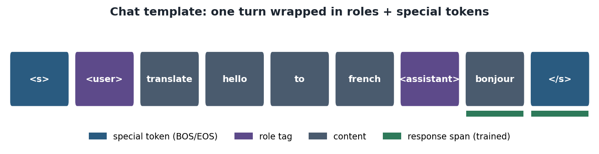
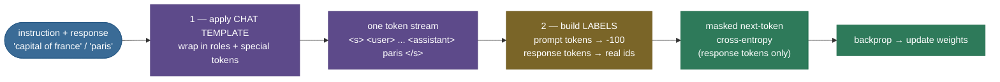
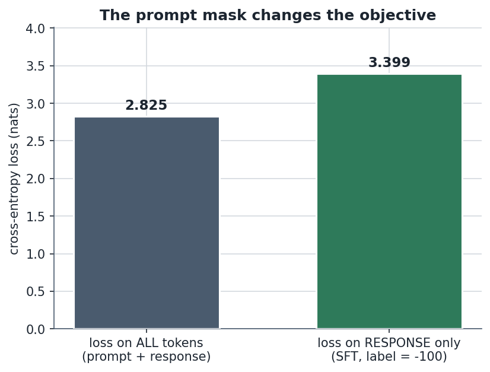
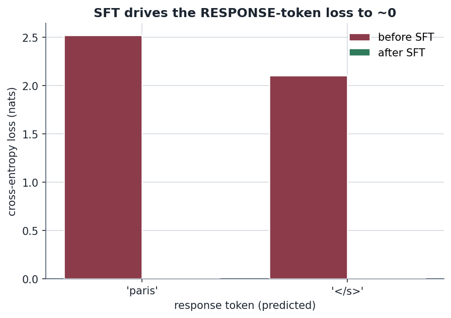
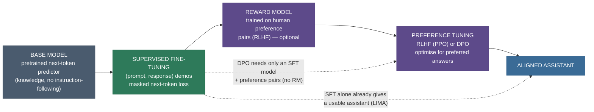

# Supervised Fine-Tuning: teach the base model how to answer

Hand a *raw pretrained* base model the prompt **"What is the capital of France?"** and it might reply: *"What is the capital of Germany? What is the capital of Italy? What is the largest..."* — it just keeps generating plausible *web text*, because that is the only thing it was ever trained to do: predict the next token of the internet. It knows the answer is Paris — that fact is sitting in its weights from pretraining — but nothing has ever taught it that a question is a request for an *answer* rather than a prompt to continue a list of questions. **Supervised Fine-Tuning (SFT)** is the first, and cheapest, step that fixes this: you continue training the same next-token objective, but on a curated set of **(prompt, response)** demonstrations, so the model learns *"when handed an instruction, respond like this."*

I'm going to walk this the way I'd explain it to a teammate who can fine-tune a model with `trl` but has never opened the loss function. We'll start by *feeling* the gap a base model leaves (so SFT feels necessary, not magical), then the one-sentence intuition for *what* SFT actually changes, then the mechanism — the **chat template** that formats the data and the **prompt-masked cross-entropy** that is the whole trick — then the math derived with shapes, then from-scratch code that *proves* the masking does what we claim, then the pitfalls that bite in practice, and finally where SFT sits in the real pipeline. By the end you'll be able to:

- explain **why a base model doesn't follow instructions** even though it "knows" the answer;
- state precisely what SFT changes (**format and behavior**) and what it does **not** (it adds little new knowledge);
- write the **prompt mask** by hand — labels = `-100` on prompt tokens — and explain *why* loss-on-the-prompt is the wrong objective;
- derive the **masked next-token cross-entropy** with shapes, and connect it to standard pretraining loss;
- reason about the hyperparameters that matter (**epochs, data quality, chat-template consistency**) and the failure modes (overfitting, catastrophic forgetting, template mismatch);
- place SFT correctly: **base → SFT → preference tuning (RLHF/DPO)**, and how it relates to instruction-tuning and LoRA.

> **Note:** SFT and pretraining use the **same loss** (next-token cross-entropy). What makes SFT "supervised post-training" and not just "more pretraining" is **(a)** the data is curated demonstration pairs, not raw web text, and **(b)** the loss is **masked to the response** so the model is trained on *how to answer*, not on *how to restate the prompt*. Hold those two differences — they are the whole chapter.

---

## The problem: a base model completes, it doesn't answer

To see why SFT exists, you have to feel the gap it closes.

A pretrained base LM is a pure **next-token predictor** trained on a giant corpus of internet text (see [Language-Modeling Objectives](../01-Language-Modeling-Objectives/01-Language-Modeling-Objectives.md)). Its one and only skill is: *given some text, continue it the way the internet would.* That skill is astonishing — it absorbed grammar, facts, code, reasoning patterns — but it is **not** the skill of being a helpful assistant. Watch the difference on the *same* model:

| You type | A **base** model is likely to continue with | An **SFT'd** model responds |
|---|---|---|
| `What is the capital of France?` | `What is the capital of Germany? What is the largest city in...` *(continues the list)* | `The capital of France is Paris.` |
| `Write a haiku about autumn.` | `Write a haiku about winter. Write a haiku about...` *(continues the instruction list)* | *(an actual haiku)* |
| `Translate "hello" to French.` | `Translate "goodbye" to French. Translate "thank you"...` | `"Hello" in French is "bonjour".` |

The base model **has the knowledge** (it will happily tell you Paris is the capital of France if you phrase the prompt as a sentence to complete, e.g. *"The capital of France is"*). What it lacks is the **behavior**: recognizing that an instruction is a request, and producing a well-formatted answer that *stops* when the answer is done. That behavioral gap — not a knowledge gap — is exactly what SFT targets.

> **Note (this is the crux, and the most-tested SFT interview point):** SFT primarily teaches **format and behavior**, not **facts**. The facts came from pretraining. LIMA ([Zhou et al. 2023](https://arxiv.org/abs/2305.11206)) makes this concrete and gives it a name — the **Superficial Alignment Hypothesis**: *"almost all knowledge in large language models is learned during pretraining, and only limited instruction tuning data is necessary to teach models to produce high quality output."* SFT is mostly **surfacing** capabilities the base model already has, in the right format.



*A single chat turn under a minimal chat template: special tokens (BOS/EOS) and role tags wrap the content, and only the response span (green underline) carries training loss. This is the exact format the from-scratch demo below uses.*

---

## Intuition first: pretraining is the medical degree, SFT is the bedside manner

Here is the analogy I'd lead with, because it survives the obvious follow-up questions.

**Pretraining is medical school.** Over years of reading, the student absorbs an enormous body of knowledge — anatomy, pharmacology, pathology. By graduation they *know* an extraordinary amount. But drop a fresh graduate, knowledge intact, in front of a frightened patient and they may recite a textbook paragraph instead of saying *"You'll be okay — here's what we're going to do."* The knowledge is all there; the **bedside manner — how to deploy that knowledge in the right form, for this person, right now — is not.**

**SFT is the bedside-manner training**: a relatively small number of *worked examples* of "patient says X → good doctor responds like Y." The resident isn't learning new medicine from these examples — they're learning **how to package what they already know** into a helpful, appropriately-formatted response. A few hundred good examples reshape the *behavior* without touching the underlying *knowledge*.

Now the follow-up that tests the analogy — *"so could you skip medical school and just teach bedside manner?"* No, and that's exactly the point: bedside manner with no medical knowledge is an empty performance — fluent, confident, and wrong. **SFT on a weak base model gives you a confident model that's still wrong**; it cannot teach facts the base never learned. That's why the pipeline is *pretrain first (get the knowledge), then SFT (get the format)* — and why LIMA's 1,000 examples work *only because* they sit on top of a 65B-parameter base that already knew the material. The analogy holds: you can't fine-tune your way to knowledge that isn't there.

> **Note:** this also tells you *when SFT will disappoint you*. If the task needs **knowledge** the base model lacks (a private codebase, post-cutoff facts, a niche domain), SFT on a handful of examples won't conjure it — you need either **continued pretraining** on that domain, **retrieval** ([RAG Fundamentals](../../11.%20RAG_and_LLM_Applications/01-RAG-Fundamentals/01-RAG-Fundamentals.md)) to supply the facts at inference, or far more data. SFT reshapes behavior; it is a poor tool for installing missing knowledge.

---

## The mechanism: format the data, then mask the loss

SFT has exactly two moving parts beyond ordinary LM training. Get both right and you have SFT; get either wrong and you have a subtle bug.



**Part 1 — the chat template.** A demonstration pair is turned into a *single token stream* by wrapping each turn in **role markers** and **special tokens**. A real Llama-3 template looks like `<|start_header_id|>user<|end_header_id|>\n\n{instruction}<|eot_id|><|start_header_id|>assistant<|end_header_id|>\n\n{response}<|eot_id|>`; ChatML uses `<|im_start|>role ... <|im_end|>`. The exact tokens differ per model, but the *structure* is always the same: **special tokens delimit turns, role tags say who is speaking, and an end-of-turn token tells the model where to stop.** The template is what teaches the model the *shape* of a conversation — including the all-important "stop here" signal.

**Part 2 — the prompt mask.** This is the heart of SFT. The whole stream (prompt + response) goes through the model, but the **loss is computed only on the response tokens.** Concretely, you build a `labels` tensor that is a copy of the input ids, then overwrite the prompt positions with the **ignore index `-100`**, which PyTorch's `cross_entropy` skips entirely. The model is therefore *never rewarded for predicting the prompt it was handed* — only for producing the response. This is called **completion-only** training or **response masking**.


*Prompt masking on the real demo example. Positions 0–6 are the prompt (`<s> <user> translate hello to french <assistant>`), labelled `-100`; positions 7–8 are the response (`bonjour </s>`), where the loss actually lands. The model learns to produce the response given the prompt — never to reproduce the prompt.*

> **Note (why mask at all? two reasons):** **(1) Signal, not noise.** You want the gradient spent on *learning to answer*, not on *learning to re-emit the user's question* (which the model can't control anyway — the user supplies it). Training on prompt tokens dilutes the signal with a task you don't care about. **(2) It matches inference.** At inference the prompt is *given* and the model only *generates the response*. Masking makes the training objective match the inference behavior exactly. We'll *measure* the difference these make in code below.

---

## The math: masked next-token cross-entropy, derived

Start from where you already are. **Standard LM pretraining** maximizes the likelihood of every token given its predecessors — equivalently, it minimizes the average next-token cross-entropy over a sequence $x = (x_1, \dots, x_T)$:

$$\mathcal{L}_{\text{LM}}(x) \;=\; -\frac{1}{T-1}\sum_{t=1}^{T-1} \log p_\theta\!\left(x_{t+1} \mid x_{1:t}\right)$$

where $p_\theta(\cdot \mid x_{1:t}) \in \Delta^{V-1}$ is the model's softmax over a vocabulary of size $V$, and $x_{1:t}$ is the prefix (the causal context). Every position $t$ predicts the *next* token $x_{t+1}$ — this is the teacher-forcing shift.

> **Source / derivation:** the next-token (autoregressive) cross-entropy objective is the standard maximum-likelihood language-modeling loss — see [Bengio et al., *A Neural Probabilistic Language Model* (2003)](https://www.jmlr.org/papers/volume3/bengio03a/bengio03a.pdf) for the neural formulation and the repo's [Language-Modeling Objectives](../01-Language-Modeling-Objectives/01-Language-Modeling-Objectives.md) chapter; the cross-entropy / MLE equivalence is Ch. 5 of [Goodfellow, Bengio & Courville, *Deep Learning* (2016)](https://www.deeplearningbook.org/).

**SFT changes exactly one thing: which tokens count.** Let the sequence be a single (prompt, response) stream of length $T$, where positions $1 \dots P$ are **prompt** and positions $P{+}1 \dots T$ are **response**. Define a per-position **loss mask** $m_t \in \{0, 1\}$:

$$
m_t =
\begin{cases}
0 & \text{if token } t \text{ is a prompt token (}t \le P\text{)} \\
1 & \text{if token } t \text{ is a response token (}t > P\text{)}
\end{cases}
$$

The **SFT loss** is the same cross-entropy, but averaged over **only the response positions**:

$$\boxed{\;\mathcal{L}_{\text{SFT}}(x) \;=\; -\frac{1}{\sum_{t} m_{t+1}}\sum_{t=1}^{T-1} m_{t+1}\,\log p_\theta\!\left(x_{t+1} \mid x_{1:t}\right)\;}$$

> **Source / derivation:** this masked-demonstration objective is the **SFT stage** of [Ouyang et al., *Training Language Models to Follow Instructions with Human Feedback* (InstructGPT, 2022)](https://arxiv.org/abs/2203.02155), §3.1 ("Step 1: Collect demonstration data, and train a supervised policy"), which fine-tunes GPT-3 on labeler demonstrations with the supervised next-token loss. The response-masking ("completion-only") implementation is standard in [Hugging Face TRL's `SFTTrainer`](https://huggingface.co/docs/trl/en/sft_trainer).

Read the boxed formula against the intuition: the $m_{t+1}$ factor **zeroes out every prompt-token term**, and the denominator $\sum_t m_{t+1}$ is *the number of response tokens*, so we average over those alone. Set $m_t = 1$ everywhere and you recover $\mathcal{L}_{\text{LM}}$ exactly — **SFT is pretraining's loss with a 0/1 mask on the prompt.** That's the entire mathematical content.

**Shapes (what the code actually moves):**

```
input_ids   ∈ ℤ^{B×T}          # B sequences, T tokens each (prompt ⧺ response)
labels      ∈ ℤ^{B×T}          # = input_ids, but prompt positions overwritten with -100
logits      ∈ ℝ^{B×T×V}        # model output: a V-dim score vector per position
# teacher-forcing shift: predict token t+1 from position t
shift_logits = logits[:, :-1, :]   # ℝ^{B×(T-1)×V}   drop last position (no t+1 target)
shift_labels = labels[:, 1:]       # ℤ^{B×(T-1)}     drop first label (no t-1 input)
loss = cross_entropy(shift_logits.flatten(0,1), shift_labels.flatten(), ignore_index=-100)
```

The `-100` is not magic: it is PyTorch's default `ignore_index`. Any position whose (shifted) label equals `-100` contributes **zero to the loss and zero to the gradient**. Implementing the mask is therefore as simple as *writing `-100` into the prompt slots of `labels`*.

> **Gotcha (the off-by-one that silently trains on one prompt token):** the loss predicts token $t{+}1$ from position $t$, so labels are shifted by one. After the shift, the model predicts the **first response token from the last prompt token** — which is correct and desired (that transition is *"given the prompt, start the response"*). The bug to avoid is the reverse: masking is on the **label** side after the shift, so you must mask exactly the prompt *target* positions. Off by one and you either leak a prompt token into the loss or drop the first response token from it. Always **print the per-token mask once** (the code below does) before trusting a training run.

---

## Full SFT vs LoRA SFT

The loss above is identical whether you update **all** the weights or just a small adapter. The choice is purely about *cost*:

- **Full SFT** — every parameter gets a gradient. Highest quality ceiling, but you need optimizer state (Adam keeps ~2 extra copies of every parameter), so fine-tuning a 7B model in FP16 needs roughly $7\text{B} \times (2_{\text{weights}} + 2_{\text{grad}} + 8_{\text{Adam fp32}}) \approx \mathbf{84\ GB}$ — multiple high-end GPUs.
- **LoRA SFT** — freeze the base weights and train tiny low-rank adapters (see [LoRA & PEFT](../12-LoRA-and-PEFT/12-LoRA-and-PEFT.md)). You update **<1%** of the parameters, so optimizer state collapses and the *same 7B model fine-tunes on a single consumer GPU*. The loss function does not change at all — only *which* parameters receive the gradient. This is how essentially all hobbyist and most production SFT is actually run.

> **Note:** because the **objective is identical**, everything in this chapter — the chat template, the prompt mask, the epochs/data-quality reasoning — applies unchanged to LoRA SFT. LoRA is an *efficiency* choice layered under the *same* SFT loss. Don't conflate "SFT" (the training stage) with "full fine-tuning" (one way to run it).

---

## Code: build it, then prove the mask is response-only

Here's a from-scratch SFT: a tiny GPT-style decoder LM, a few (instruction, response) pairs formatted with a minimal chat template, labels built with `-100` on the prompt, and the masked cross-entropy. It then **proves numerically** that the mask is doing exactly what the math claims — the masked loss *equals* a hand-rolled response-only average and *differs* from loss-on-all-tokens — and finally runs a few SFT steps so you can watch the response loss collapse. It runs on CPU in a few seconds; no GPU needed.

> **Runnable script and a step-by-step notebook:** the same verified code lives next to this page — see the [step-by-step teaching notebook](code/13-Supervised-Fine-Tuning.ipynb) and the [runnable demo script](code/supervised_fine_tuning.py) (run it with `python supervised_fine_tuning.py`).

The core is just two functions — *build the masked labels*, and *compute the shifted, masked cross-entropy*:

```python
IGNORE_INDEX = -100  # PyTorch cross_entropy skips any target == this

def build_example(instruction, response, stoi, device):
    """Return (input_ids, labels, n_prompt). labels = input_ids with the prompt set to -100."""
    prompt_text, full_text = format_chat(instruction, response)   # apply the chat template
    input_ids = encode(full_text, stoi, device)                   # prompt ⧺ response, one stream
    n_prompt = len(prompt_text.split())                           # how many leading tokens are prompt
    labels = input_ids.clone()
    labels[:n_prompt] = IGNORE_INDEX                              # MASK the prompt — the whole trick
    return input_ids, labels, n_prompt

def causal_lm_loss(logits, labels, ignore_index=IGNORE_INDEX):
    """Standard next-token cross-entropy with label masking. logits:(B,T,V) labels:(B,T)."""
    shift_logits = logits[:, :-1, :].contiguous()    # predict t+1 from t -> drop last position
    shift_labels = labels[:, 1:].contiguous()        # ... and the first label
    return F.cross_entropy(
        shift_logits.view(-1, shift_logits.size(-1)),  # (B*(T-1), V)
        shift_labels.view(-1),                         # (B*(T-1),)
        ignore_index=ignore_index,                     # -100 positions: zero loss, zero grad
    )
```

The proof that masking is genuinely response-only (not an approximation) is the key assertion — we recompute the response-only loss **by hand without `ignore_index`** and check it matches:

```python
loss_masked = causal_lm_loss(logits, labels)            # prompt = -100  -> response only
loss_all    = causal_lm_loss(logits, input_ids)         # labels = real ids everywhere -> trains on prompt too
loss_hand   = response_only_loss_by_hand(logits, input_ids, n_prompt)  # average ONLY response positions
assert torch.allclose(loss_masked, loss_hand, atol=1e-6)   # masking == response-only average
assert not torch.allclose(loss_masked, loss_all, atol=1e-3) # ... and it is NOT loss-on-all
```

**Output (CPU, reproducible):**

```
device: cpu (detected mps; pinned to CPU for reproducibility)
torch: 2.12.0

prompt : <s> <user> translate hello to french <assistant>
full   : <s> <user> translate hello to french <assistant> bonjour </s>

per-token label mask (-100 = prompt, ignored by loss):
 pos | token          |  label | trained?
--------------------------------------------
   0 | <s>            |   -100 | no (prompt)
   ...
   6 | <assistant>    |   -100 | no (prompt)
   7 | bonjour        |      4 | YES (response)
   8 | </s>           |      0 | YES (response)

loss on ALL tokens        : 2.8253  (prompt + response -- the WRONG objective)
loss on RESPONSE only (-100): 3.3993  (SFT: the masked objective)
same, re-derived by hand   : 3.3993  (should match the masked loss)
assert OK: masked loss == response-only average, and != loss-on-all-tokens

SFT training (60 steps, response-token loss):
 step | response-loss
-----------------------
    0 |        2.9196
   10 |        0.0894
   ...
   60 |        0.0045

after SFT, prompt 'capital of france' -> model's next token: 'paris' (gold: 'paris')
```

Read the output top to bottom. The **per-token mask** shows the prompt at `-100` and only `bonjour </s>` carrying loss. The **two loss numbers differ** (2.825 vs 3.399) — proof the mask changes the objective — and the **hand-rolled response-only average exactly equals the masked loss** (3.399), proof the mask is *precisely* response-only, not a heuristic. Then SFT **drives the response loss from 2.92 to 0.0045**, and the trained model now completes *"capital of france"* with *"paris"* — it learned the *behavior* from the demonstrations.

> **Note (two different "first loss" numbers — they're not supposed to match):** the proof block prints `3.3993` and the training trace starts at `~2.92`. These are **different measurements**, not a discrepancy: the `3.3993` is the masked loss on a **single** example, computed under `eval()`/`no_grad` (dropout off); the `~2.92` is the masked loss on the **4-example padded batch** under `train()` (dropout on). Different data *and* a different mode — so a reader should not expect them to agree. (The training trace itself — `2.9196 → 0.0045` — is byte-identical across this page, the notebook, the `.py`, and the figure caption, because all three re-seed and build a fresh model immediately before the loop.)



*The masked loss (3.399, green) is what SFT optimizes; loss-on-all-tokens (2.825, slate) would waste gradient teaching the model to re-emit prompts. The lower all-token number is **not** "better" — prompt tokens (special tokens, role tags, common words) are simply easier to predict at initialization, so adding them drags the average down; it's a **different** objective, not a superior one. These are the exact numbers the demo prints.*


*Response-token loss vs SFT step. The model learns the demonstrated behavior fast; on a real (large, diverse) SFT set the curve settles much higher — driving this to ~0 on real data is the **overfitting** failure mode discussed below.*



*Where the learning lands: the per-token response loss for both `paris` and `</s>` collapses to ~0 after SFT. Because the prompt was masked, no gradient was ever spent on the prompt tokens — the model only learned to *answer*.*

> **Try it:** before you change anything, **predict**: if you *remove* the prompt mask (train with `causal_lm_loss(logits, input_ids)` instead of `labels`), does the model still learn to answer "capital of france" → "paris"? Now run it. (Hint: on this toy set it often *still* learns the mapping — the response tokens still appear in the loss — but you've **diluted** the gradient with the prompt-prediction task and, on real data, this hurts: the model spends capacity learning to parrot user questions, and the train/inference objective mismatch shows up as worse responses. The mask matters *more*, not less, as data scales.)

---

## Pitfalls and failure modes

These are the ones that actually cost people a training run.

**1. Computing loss on the prompt tokens (the silent dilution).** The most common SFT bug is forgetting the mask — training on the *whole* stream. It often still "works" enough to look fine on a toy set (as the *Try it* above shows), which is exactly why it's dangerous: it degrades quality on real data without an obvious error. The model spends gradient learning to *reproduce user prompts* (a task it can't control and shouldn't learn) instead of concentrating on *responses*. **Fix:** always mask; **print the per-token mask once** and eyeball it before a long run.

**2. Overfitting from too many epochs.** SFT sets are small and curated, and the model is enormous — so it memorizes fast. Run 5–10 epochs and the model **memorizes the exact demonstrations**, loses generality, and starts regurgitating training phrasings. The demo's collapse to 0.0045 *is* overfitting in miniature. **Fix:** SFT is typically **1–3 epochs** (InstructGPT used ~2–16 epochs on a *tiny* demonstration set but selected by validation; most modern recipes use 1–3). Watch a held-out validation loss and stop when it turns up.

**3. Catastrophic forgetting.** Fine-tuning hard on a narrow SFT distribution can degrade the broad capabilities pretraining installed — the model gets better at your 1,000 examples and *worse* at everything else (math, code, other languages). **Fix:** keep SFT light (few epochs, modest LR), **mix in diverse data**, or use **LoRA** (frozen base weights can't be overwritten, which structurally limits forgetting), or replay a little pretraining data.

**4. Train/inference chat-template mismatch (the subtle production killer).** If you SFT with one template (say ChatML) but your inference server formats prompts with a *different* template — or omits a special token, or adds an extra newline — the model sees an input distribution it was never trained on, and quality silently craters. This is one of the most common "my fine-tune got worse" bugs. **Fix:** use the model's **exact** tokenizer chat template at *both* train and inference time (`tokenizer.apply_chat_template`), and verify the rendered strings match byte-for-byte.

**5. Low-quality or inconsistent data.** Because SFT teaches *behavior by imitation*, the model imitates whatever is in the demonstrations — including their flaws. Inconsistent formatting, factual errors, or a few toxic examples get **faithfully learned**. LIMA's headline is the positive framing of this: **1,000 carefully curated examples beat tens of thousands of noisy ones.** **Fix:** invest in curation and consistency over raw volume.


*Why "data quality ≫ quantity" is the SFT mantra: because SFT teaches behavior by imitation, a few hundred clean, consistent, well-formatted demonstrations reshape behavior better than a flood of noisy ones — the model imitates exactly what you show it.*

> **Gotcha:** SFT can also induce **hallucination** if your demonstrations teach the model to answer questions it *doesn't* know the answer to. If a demonstration shows the model confidently answering a question whose facts aren't in its weights, you're literally training it to **make things up in that format**. Demonstrations should match the model's actual knowledge — or explicitly teach "I don't know" where appropriate.

---

## Where SFT sits: the post-training pipeline

SFT is the **first** post-training stage and the foundation everything else refines. The canonical pipeline ([InstructGPT, Ouyang et al. 2022](https://arxiv.org/abs/2203.02155)):



- **Base → SFT** turns a completion engine into an instruction-follower. For many uses **SFT alone is enough** (LIMA showed a pure-SFT model competitive with RLHF'd ones on human preference).
- **SFT → preference tuning** is the refinement. SFT teaches the model to give *a* good answer; **RLHF/DPO** teach it to prefer the *better* of two answers (helpfulness, harmlessness, style) using human **preference** data rather than gold demonstrations. Critically, **a good SFT model is the starting point for both** — RLHF initializes its policy from the SFT model, and **DPO** ([Rafailov et al. 2023](https://arxiv.org/abs/2305.18290)) optimizes preferences directly from the SFT model *without a separate reward model*. See [RLHF & DPO](../15-RLHF-and-DPO/15-RLHF-and-DPO.md).

**SFT vs instruction-tuning — the distinction worth getting right.** They overlap and the terms are often used loosely, but the cleanest split: **SFT is the *mechanism*** (supervised training on demonstrations with prompt masking); **instruction-tuning is a *strategy* that uses that mechanism at scale across many diverse tasks** (FLAN-style: thousands of tasks reformatted as instructions) specifically to get *generalization to unseen instructions*. Instruction-tuning *is* SFT, applied to a deliberately broad, multi-task instruction dataset. SFT on a single narrow task (e.g. only summarization) is still SFT but is *not* instruction-tuning. See [Instruction Tuning](../14-Instruction-Tuning/14-Instruction-Tuning.md) for the scaling-task-diversity story.

---

## In production: the real numbers

Tying SFT to systems you've heard of:

- **InstructGPT / GPT-3.5.** OpenAI's labelers wrote **~13,000** demonstration prompts for the SFT stage; that SFT model was then the base for RLHF. The *behavioral* leap users felt going from GPT-3 (base) to InstructGPT came substantially from this supervised step ([Ouyang et al. 2022](https://arxiv.org/abs/2203.02155)).
- **LIMA.** A **65B** Llama fine-tuned on **just 1,000** curated examples, **no RLHF**, was preferred or equivalent to **GPT-4 in 43%** of cases, to Bard in 58%, and to RLHF-trained DaVinci003 in **65%** — the empirical core of "quality ≫ quantity" and the Superficial Alignment Hypothesis ([Zhou et al. 2023](https://arxiv.org/abs/2305.11206)).
- **Alpaca / Self-Instruct.** Stanford's [Alpaca](https://crfm.stanford.edu/2023/03/13/alpaca.html) SFT'd Llama-7B on **52,000** instruction-following examples generated by an existing model (the [Self-Instruct](https://arxiv.org/abs/2212.10560) bootstrap), for a few hundred dollars — popularizing **synthetic SFT data** and making instruction-following accessible on commodity hardware.
- **Llama-2-Chat.** Meta documented a full **SFT → RLHF** recipe; notably they found SFT data **quality** mattered far more than quantity and curated tens of thousands of high-quality examples by hand ([Touvron et al. 2023](https://arxiv.org/abs/2307.09288)).
- **How it's actually run today.** Most SFT in practice is **LoRA/QLoRA SFT** via Hugging Face [TRL's `SFTTrainer`](https://huggingface.co/docs/trl/en/sft_trainer) with **completion-only** masking, 1–3 epochs, on datasets of a few thousand to a few hundred thousand curated chat examples — on a single GPU.

> **When to reach for SFT, and when not:** reach for SFT when you need to change the model's **behavior, format, or style** — make it follow a schema, adopt a persona, use a tool-call format, or answer in your domain's voice — and the underlying *knowledge already exists* in the base model. Do **not** reach for SFT (alone) when you need new **facts** (use continued pretraining or RAG), or when you need the model to **prefer** subtly-better answers over merely-acceptable ones (add preference tuning). SFT is the right, cheap first move for "the model knows this but won't say it the way I need."

---

## Recap and rapid-fire

**If you remember nothing else:** SFT is pretraining's *same* next-token cross-entropy loss, run on curated **(prompt, response)** demonstrations formatted with a **chat template**, with the loss **masked to the response tokens** (prompt labels = `-100`). It teaches **format and behavior**, not facts (the facts came from pretraining — the *Superficial Alignment Hypothesis*), which is why **data quality ≫ quantity** and why it's the cheap, first post-training step: **base → SFT → preference tuning**.

**Quick-fire — say these out loud:**

- *Why doesn't a base model answer questions?* It only learned to continue text; instruction-following is a *behavior* pretraining never taught.
- *What does SFT change vs pretraining?* Same loss; different data (curated demos) + the loss is masked to the response.
- *What is the prompt mask?* Labels = `-100` on prompt tokens, so cross-entropy skips them — loss is computed only on the response.
- *Why mask the prompt?* To spend gradient on *answering* (not on re-emitting the prompt), and to match the inference objective.
- *What does SFT teach — facts or format?* Mostly **format/behavior**; the knowledge is from pretraining (LIMA's Superficial Alignment Hypothesis).
- *How much data?* Quality ≫ quantity — LIMA: **1,000** curated examples on a strong base.
- *How many epochs?* Usually **1–3** — more risks overfitting/memorization and catastrophic forgetting.
- *Full SFT or LoRA?* Same loss; LoRA freezes the base and trains <1% of params so it runs on one GPU.
- *Where does SFT sit?* First post-training stage; the foundation RLHF and DPO refine.
- *Biggest production gotcha?* **Train/inference chat-template mismatch** — use the model's exact template at both ends.

---

## References and further reading

The curated link library for this topic — videos, courses, articles, papers, books, and internal cross-links — lives in a companion file so it can be reused as a standalone reference list:

**→ [Supervised Fine-Tuning — references and further reading](13-Supervised-Fine-Tuning.references.md)**
