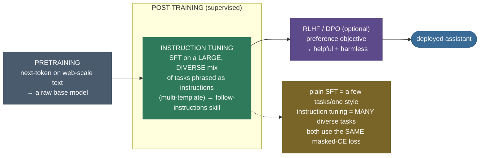
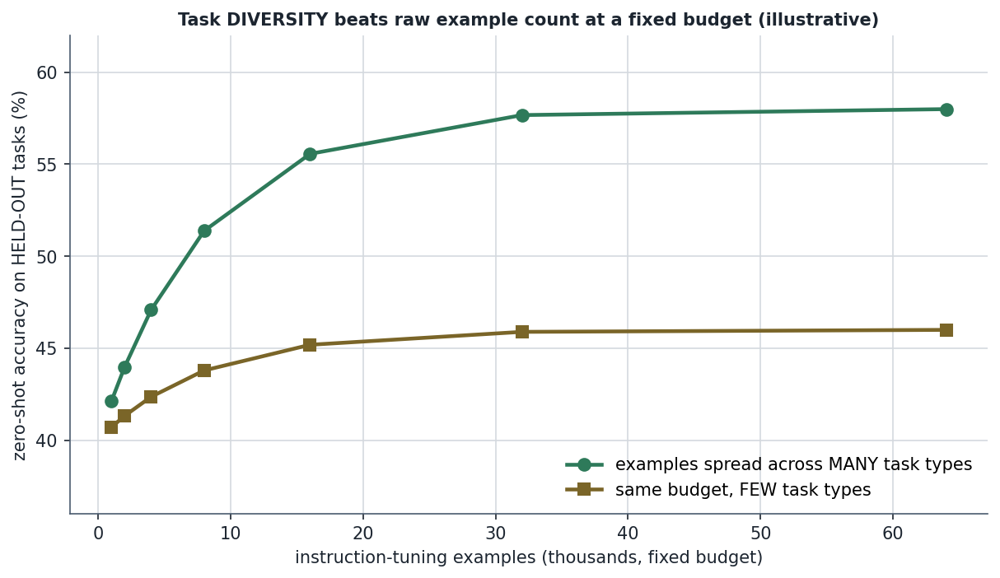
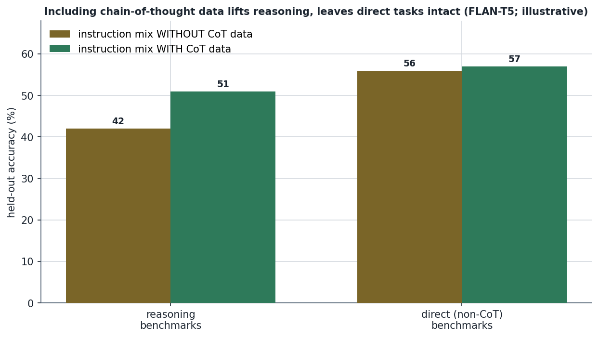
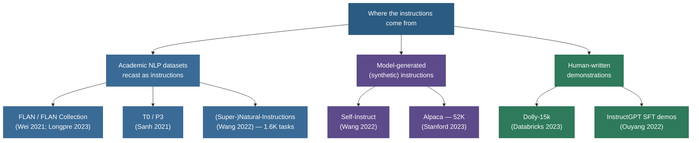

# Instruction Tuning: teach the meta-skill, not the task

A model that has been fine-tuned to do *summarization* and *translation* and *sentiment* — three tasks, well — will still stare blankly at a fourth task it has the latent knowledge to do, like *"classify whether these two sentences contradict each other."* It knows what contradiction is; it just doesn't realize that the sentence sitting in front of it is an **instruction to be followed**. **Instruction tuning** is the discovery that if you fine-tune on a *large, diverse set of tasks all phrased as natural-language instructions*, the model stops learning the tasks one by one and instead learns the **meta-skill** underneath them: *"read the instruction, then do what it says."* And that skill **transfers** — to instructions, and whole task types, it has never seen. This is the result that turned a raw next-token predictor into something you can actually *ask things of*, and it is the reason "zero-shot" went from a curiosity to the default way we use LLMs.

I'm going to walk this the way I'd explain it to a teammate who already understands SFT and is asking *"so what does instruction tuning add — isn't it just SFT on more data?"* We'll start by **feeling** the failure (a narrowly-tuned model that can't follow a new instruction it's perfectly capable of), then build the **one idea** (diversity → a transferable instruction-following skill), see the **mechanism** and the **empirical laws** that govern it (FLAN's scaling story), prove the whole thing **from scratch in runnable code** (a multitask model that generalizes to a held-out task vs. a single-task model that can't), and finish with the **datasets, pitfalls, and where it sits** in the pretraining → instruction-tuning → RLHF pipeline. By the end you'll be able to:

- state **precisely what instruction tuning adds over plain SFT** (diversity + instruction framing → zero-shot generalization), and not confuse it with RLHF;
- explain **why training on tasks A, B, C improves an unseen task D** — the meta-skill argument, holding it up under a follow-up;
- recite the **empirical laws**: zero-shot performance rises with the **number and diversity** of instruction tasks and with **model scale**, and that **diversity beats raw count**;
- name the **dataset landscape** — FLAN, T0/P3, (Super-)Natural-Instructions, Self-Instruct → Alpaca, the FLAN Collection — and what *templates/verbalizers* are;
- prove in code that a **diverse mix yields generalization a narrow mix cannot**, on identical compute;
- avoid the real traps: **held-out leakage**, **template overfitting**, **negative transfer**, and the big one — *instruction tuning is not alignment*.

> **One-line thesis:** instruction tuning is **[supervised fine-tuning](../13-Supervised-Fine-Tuning/13-Supervised-Fine-Tuning.md) scaled to a large, diverse set of tasks phrased as instructions** — and that scaling, empirically, produces **zero-shot generalization to unseen task types**. Same loss as SFT; different *data*, and a different *result*.

---

## The problem: a narrowly-tuned model can't follow a new instruction

To feel why instruction tuning matters, watch a capable model fail at something easy.

Take a strong base LM — it has read the internet, it "knows" what natural-language inference is. Now [supervise-fine-tune](../13-Supervised-Fine-Tuning/13-Supervised-Fine-Tuning.md) it on a handful of tasks: summarize this, translate this, label this review's sentiment. It gets good at those. Then hand it a task it never trained on but is *clearly capable of*:

```
Premise: "The concert was cancelled due to rain."
Hypothesis: "The event happened as planned."
Question: Does the premise entail, contradict, or neither?
```

The narrowly-tuned model flounders — it might continue the story, echo the premise, or emit a summary, because the patterns it learned were *"text that looks like this → produce a summary / a translation / a label of these specific kinds."* It never learned the general move: **parse the instruction, recognize the requested operation, execute it.** The latent knowledge is in there; the *interface* to it isn't.

> **Source / framing:** this gap — between a model's latent capability and its ability to be *prompted into* it zero-shot — is the exact motivation of [**Finetuned Language Models Are Zero-Shot Learners** (Wei et al. 2021), §1](https://arxiv.org/abs/2109.01652), which introduced "instruction tuning" as the fix and measured the zero-shot improvement on tasks held out of training.

Here's the crucial contrast that defines the whole topic, and the **single most common interview confusion**:

| | What it changes | Loss | Result |
|---|---|---|---|
| **[SFT](../13-Supervised-Fine-Tuning/13-Supervised-Fine-Tuning.md)** (chapter 13) | continue next-token training on `(prompt, response)` demonstrations | masked cross-entropy on the response | model produces helpful, formatted answers for **the kinds of prompts it was tuned on** |
| **Instruction tuning** (this chapter) | SFT, but on a **large, diverse mix of tasks phrased as instructions**, often with **multiple phrasings per task** | **the same** masked cross-entropy | model learns to **follow instructions in general** → **zero-shot generalization to unseen task types** |
| **[RLHF / DPO](../15-RLHF-and-DPO/15-RLHF-and-DPO.md)** (chapter 15) | optimize a **preference** objective (reward model + PPO, or DPO) | a *different* objective entirely (no fixed target) | model becomes **more helpful/harmless** per human preference |

> **Note:** instruction tuning **reuses SFT's loss verbatim** — masked next-token cross-entropy over the response. We do **not** re-derive that loss here; it's the mechanism of [chapter 13](../13-Supervised-Fine-Tuning/13-Supervised-Fine-Tuning.md). What's new in chapter 14 is the **data** (diversity + instruction framing) and the **emergent result** (generalization). What's new in [chapter 15](../15-RLHF-and-DPO/15-RLHF-and-DPO.md) is the **objective**. Keep these three straight and most instruction-tuning questions answer themselves.

---

## Intuition first: the substitute teacher

Here's the analogy I trust, because it holds up under a follow-up.

Imagine training someone to be a **substitute teacher**. Approach one: drill them on *one* lesson plan — "Tuesday's 3rd-grade fractions class" — over and over until they can deliver it flawlessly. Approach two: have them deliver *many different* lesson plans — fractions, spelling, a history unit, a science lab — each handed to them as a **written plan they must read and execute on the spot**. Now a brand-new plan lands on the desk: "Friday's poetry class." The first trainee is lost — they only ever learned to *recite Tuesday's fractions*. The second trainee just... reads the plan and teaches it, because the skill they actually built was **"read the plan, then run the class"** — and the new plan is just another plan.

That second trainee is an instruction-tuned model. The "lesson plans" are **instructions**; the meta-skill is **following them**; and the new plan is a **held-out task type**. The single most important thing this analogy gets right is **why** training on tasks A, B, C helps an unseen task D:

> **The follow-up that makes or breaks the analogy — "why does training on A, B, C help an unseen D?"** Because the model isn't storing A, B, C as separate lookup tables. To fit *many* tasks that are all framed the same way ("here is an instruction; produce the output it asks for"), the cheapest thing for gradient descent to learn is the **shared structure** — *parse the instruction, identify the operation, apply it to the input* — rather than a separate circuit per task. That shared structure is exactly what task D also needs. The diversity **forces** the general skill because memorizing each task individually is no longer the path of least resistance once there are enough, varied enough, tasks. (We prove this mechanism in code below: a model trained on *one* instruction memorizes it; a model trained on a *varied* version of the same instruction is forced to actually **read** it — and then generalizes.)

> **Where the analogy breaks (so you don't oversell it):** a substitute teacher *understands* the plans; an LLM is doing sophisticated pattern-completion. Instruction tuning doesn't grant comprehension — it makes the model's behaviour *conditioned on the instruction* rather than fixed. That's why an instruction-tuned model can still confidently follow an instruction *wrongly* — it learned the *form* "do what the instruction says," not a guarantee of *correctness*. Closing that last gap is [RLHF/DPO's](../15-RLHF-and-DPO/15-RLHF-and-DPO.md) job, not instruction tuning's.


The figure shows the second half of the trick. Each task is presented through **multiple templates** (phrasings) — *"Translate to French: X"*, *"What is X in French?"*, *"Render the following in French: X"* — all mapping to the same target. Train on one phrasing and the model can latch onto that exact surface string; train on many and it's forced to bind the behaviour to the *meaning*. Templates are how you inject the diversity that produces the meta-skill. (FLAN used ~10 templates per dataset; T0's P3 collection is a public library of thousands of such templates.)

> **Source / claim:** the multiple-templates-per-task design and the term *verbalizer/template* come from [**FLAN** (Wei et al. 2021), §2.1](https://arxiv.org/abs/2109.01652) and the public prompt library [**P3 / PromptSource** behind **T0** (Sanh et al. 2021)](https://arxiv.org/abs/2110.08207).

---

## The mechanism: where instruction tuning sits, and what it does

Mechanically, instruction tuning is **one stage** in the post-training pipeline, distinguished from plain SFT by its *data* and from RLHF by its *objective*:



Read the pipeline left to right: **pretraining** gives a base model that can *continue* text but won't reliably *follow* it. **Instruction tuning** — the green stage — is a supervised pass on a diverse instruction mix that installs the follow-instructions skill. **[RLHF/DPO](../15-RLHF-and-DPO/15-RLHF-and-DPO.md)** is an *optional, different* stage that refines *preferences* (helpfulness, harmlessness) with a non-supervised objective. The amber note is the crux to memorize: **instruction tuning and plain SFT share the loss; they differ only in how many and how varied the tasks are.** That difference is the whole topic.

> **Note (the key contrast with chapter 15):** instruction tuning is **purely supervised** — there is a **fixed target** for every example and **no reward model**. The moment you introduce a reward model or a preference pair, you've left instruction tuning and entered [RLHF/DPO](../15-RLHF-and-DPO/15-RLHF-and-DPO.md). InstructGPT makes the staging explicit: its **SFT stage** (which is instruction tuning on human demonstrations) comes *first*, then the reward model and PPO. ([Ouyang et al. 2022, §3](https://arxiv.org/abs/2203.02155).)

---

## The empirical laws: this is a measured result, not a theorem

Instruction tuning is **empirical to its core**. There's no clean equation that *predicts* zero-shot generalization; there are **scaling laws discovered by experiment**. Three of them matter, and interviewers ask you to state them precisely.

### Law 1 — zero-shot accuracy rises with the *number and diversity* of instruction tasks

The headline FLAN result: take a model, instruction-tune it on *N* clusters of task types, and measure zero-shot accuracy on task clusters **held out of training**. As you add clusters, held-out accuracy **climbs** — the model is getting better at tasks it has *never been trained on*, purely because it saw *more kinds* of instructions.


> **Source / claim:** "adding more task clusters to the instruction-tuning mix monotonically improves zero-shot performance on held-out clusters" is the central finding of [**FLAN** (Wei et al. 2021), §4.3 and Fig. 5](https://arxiv.org/abs/2109.01652). The curve above is **illustrative** (shaped to FLAN's reported trend), labelled as such on the figure; the *direction and saturation* are the published result.

### Law 2 — it needs *scale*; below a threshold, instruction tuning can *hurt*

The same FLAN paper found a sharp interaction with **model size**: instruction tuning produces large zero-shot gains *for large models*, but for **small** models it can actually **degrade** zero-shot performance — the model spends its limited capacity memorizing the instruction-tuning tasks instead of acquiring a general skill. Instruction-following generalization is, in this sense, an **emergent ability** of scale.

> **Source / claim:** the "instruction tuning helps large models but hurts small ones" interaction is [**FLAN** (Wei et al. 2021), §4.2 and Fig. 6](https://arxiv.org/abs/2109.01652); the framing of instruction-following as an emergent capability of scale connects to [**Scaling Instruction-Finetuned Language Models** (Chung et al. 2022)](https://arxiv.org/abs/2210.11416), which pushed the task count to 1,836 and showed gains continuing with both task count and model size.

### Law 3 — *diversity beats raw count*, and chain-of-thought data lifts reasoning

Two refinements from the FLAN-T5 line. First, at a **fixed example budget**, spreading those examples across **many task types** generalizes better than piling them into a few — *task diversity matters more than sheer example count*. Second, **including chain-of-thought (step-by-step) examples** in the instruction mix lifts performance on reasoning benchmarks **without hurting** the non-reasoning ones.





> **Source / claim:** "scaling the *number* of tasks and the *diversity* of the mix, and **including CoT data**, each improve instruction-tuned performance — including on held-out reasoning" is from [**Scaling Instruction-Finetuned Language Models / FLAN-T5** (Chung et al. 2022), §3–4](https://arxiv.org/abs/2210.11416). Both figures above are **illustrative** of the reported *directions* (labelled on each).

### The loss itself — stated, not re-derived

For completeness, the objective. Given an instruction-tuning example rendered as a token sequence with an instruction/input prefix and a target response, with response tokens at positions $r, \dots, T$:

$$\mathcal{L} \;=\; -\sum_{t=r}^{T} \log p_\theta\!\left(y_t \mid y_{<t}\right)$$

— the **masked next-token cross-entropy** (where $r$ is the first response-token index; the prefix at positions $<r$ is masked out and contributes nothing to the loss): identical to SFT, summed *only over the response positions* (the instruction/input prefix is not scored). Instruction tuning is this exact loss, applied across a **diverse multitask instruction mix**.

> **Source / derivation:** this is the SFT loss of [**chapter 13 — Supervised Fine-Tuning**](../13-Supervised-Fine-Tuning/13-Supervised-Fine-Tuning.md) (where the response-masking is derived); it is the same objective used in the [**InstructGPT** SFT stage (Ouyang et al. 2022, §3)](https://arxiv.org/abs/2203.02155). We deliberately do **not** re-derive it here — the novelty of instruction tuning is the *data*, not the loss.

---

## Watch it work: zero-shot generalization, from scratch

The claim "diversity creates a transferable skill" sounds plausible. Let's **prove** it deterministically, on a tiny model, with no pretrained weights — so the mechanism is fully visible.

**The setup.** Three operations over a 6-symbol vocabulary, each rendered in an instruction template `[ OP | KEY | SEP | input | output ]`:

- `SUBSTITUTE` — the instruction carries a **key** (a permutation table); the output is `key[input]`. *This is the one operation that requires reading an instruction argument.*
- `REVERSE` — reverse the input.
- `COPY` — echo the input.

We train **two models on identical init and identical compute budget**, differing *only* in the data mix:

- **Multitask** — `SUBSTITUTE` with a **fresh random key every example**, plus `REVERSE` and `COPY`. To fit ever-changing keys, it has no choice but to learn the general skill *"read the key and apply it."*
- **Single-task** — `SUBSTITUTE` with **one fixed key**, always. It can fit its data by **memorizing that single mapping** — it never needs to read the key.

Then we evaluate **both** zero-shot on **held-out `SUBSTITUTE` (key, input) combinations** — rows neither model trained on. This is a clean proxy for FLAN's "held-out task type": success requires a skill (reading the instruction) that *only* the diverse mix forces.

> **A precise word on "held-out" (so the claim is exactly right):** with only `N_SYMBOLS! = 6! = 720` possible keys, the multitask model — which draws ~2,667 random-key `SUBSTITUTE` examples — has almost certainly seen **every key** at least once during training, including each evaluation key. What is genuinely *unseen* is this specific **(key, input) pairing**, never that exact combination. Generalization is therefore to a **novel combination**, which still requires the model to *read this key and apply it to this input* — the very skill we're testing. (The stronger "this exact key never appeared in training" holds only for the **single-task** model, which saw just one key.)

> **Why this design and not modular arithmetic:** an earlier draft tried "shift by k" held out one shift — but a tiny model just *memorizes* each shift's lookup table rather than learning addition (the classic grokking failure), so the gap never appears. The substitution-key design makes the held-out generalization **robustly learnable**: the key is *given in-context*, so "read it and apply it" is a skill a small model reliably acquires — and reliably *fails* to acquire when the key never varies. The lesson about diversity is the same; the demo is just one that actually runs.

The from-scratch core (full runnable script: [`code/instruction_tuning.py`](code/instruction_tuning.py); step-by-step executed notebook: [`code/14-Instruction-Tuning.ipynb`](code/14-Instruction-Tuning.ipynb)):

```python
# Three samplers define the whole experiment. The MULTITASK sampler draws a FRESH key
# for every SUBSTITUTE example (so the model must READ it); the SINGLE-TASK sampler always
# uses one fixed key (so the model can MEMORIZE it). Held-out = SUBSTITUTE on (key, input)
# COMBINATIONS the model never trained on.
def sample_multitask_row(gen):
    op_id = int(torch.randint(0, 3, (1,), generator=gen))          # SUBSTITUTE / REVERSE / COPY
    inp = torch.randint(0, N_SYMBOLS, (INPUT_LEN,), generator=gen)
    key = torch.randperm(N_SYMBOLS, generator=gen)                 # FRESH key every time
    return render_example(op_id, inp, key)

def sample_singletask_row(gen):
    inp = torch.randint(0, N_SYMBOLS, (INPUT_LEN,), generator=gen)
    return render_example(OP_ID_SUBSTITUTE, inp, SINGLE_FIXED_KEY) # always the SAME key

def sample_heldout_row(gen):                                       # the ZERO-SHOT test
    inp = torch.randint(0, N_SYMBOLS, (INPUT_LEN,), generator=gen)
    # only 6!=720 keys exist, so the multitask model has seen each key; what's held out is
    # this (key, input) PAIR. ~1/720 of these random keys equals the single-task model's
    # memorized key by chance -- that collision rate IS its ~0.7% score below.
    key = torch.randperm(N_SYMBOLS, generator=gen)                 # a held-out (key, input) pair
    return render_example(OP_ID_SUBSTITUTE, inp, key)

# The loss is chapter 13's masked next-token cross-entropy, scored ONLY on the output block
# (the instruction/input prefix at positions < RESPONSE_START is masked out -- not scored).
def masked_next_token_loss(logits, targets):
    pred = logits[:, :-1, :]                 # logits predicting positions 1..T-1
    gold = targets[:, 1:]                    # the actual next tokens
    keep = RESPONSE_START - 1                # first index inside the response block
    return F.cross_entropy(pred[:, keep:, :].reshape(-1, VOCAB), gold[:, keep:].reshape(-1))
```

Running it (`python instruction_tuning.py`) prints — deterministically, on CPU:

```
torch: 2.12.0
device: cpu (detected mps; pinned to CPU for reproducibility)
seed: 0

Instruction-template format  [OP | KEY | SEP | input -> output]:
  SUBSTITUTE: op=7 key=[2, 0, 1, 4, 5, 3] SEP input=[1, 5, 0, 2] -> output=[0, 3, 2, 1]
     REVERSE: op=8 key=[10, 10, 10, 10, 10, 10] SEP input=[1, 1, 5, 5] -> output=[5, 5, 1, 1]
        COPY: op=9 key=[10, 10, 10, 10, 10, 10] SEP input=[5, 0, 2, 3] -> output=[5, 0, 2, 3]
  HELD-OUT  : op=7 key=[4, 5, 0, 1, 2, 3] (this key+input PAIR unseen) SEP input=[0, 3, 5, 1] -> output=[4, 1, 3, 5]   <-- ZERO-SHOT test

--- Results (exact-match accuracy) ---
  SUBSTITUTE, fixed key      | multitask: 100.0% | singletask: 100.0%
  SUBSTITUTE, held-out pairs  | multitask: 100.0% | singletask:   0.7%

  zero-shot generalization GAP (multitask - singletask): +99.3%
  (singletask's 0.7% is the ~1/720 chance a random held-out key equals its memorized key)
  assert multitask_heldout_acc > singletask_heldout_acc: PASSED
```


Read the two panels together — this is the entire thesis of instruction tuning in one picture:

- **Left (in-distribution): both score 100%.** The two models have *identical* capacity, init, and compute, and both perfectly master the fixed-key task. So the difference on the right is **not** about model power.
- **Right (zero-shot, held-out combinations): 100% vs 0.7%.** The multitask model, *forced* by ever-changing keys to learn *"read the key and apply it,"* applies held-out (key, input) combinations flawlessly. The single-task model, which got away with **memorizing one mapping**, has no such skill and fails the moment the key changes — its **0.7%** is not noise but a *signature*: it's the **~1/720 chance** a random held-out key happens to equal its one memorized key `[1,2,3,4,5,0]` (≈1.4 rows per 1,000). That the floor lands exactly at the key-collision rate confirms the single-task model can do *only* its single mapping — the design is sound, not cherry-picked.

The **+99.3-point gap came purely from instruction diversity** — same loss, same architecture, same budget. That is FLAN's result, reproduced in ~100 lines on a CPU: *a diverse instruction mix installs a transferable skill that a narrow mix cannot.*

> **Try it (predict first):** in `sample_multitask_row`, **freeze** the `SUBSTITUTE` key to `SINGLE_FIXED_KEY` (so the multitask model never sees key variation). Predict the held-out accuracy *before* running. It collapses toward the single-task model's — proving it's the **diversity** (varied keys), not merely the presence of multiple op-types, that does the work. The notebook's *"Try it yourself"* cell walks three such ablations.

---

## Pitfalls and failure modes

These are the ones that actually bite — in interviews and in practice.

### 1. Held-out task **leakage** (the evaluation killer)

The entire claim of instruction tuning is *zero-shot generalization to unseen tasks*. If a task you report as "held out" actually appears — even as a near-duplicate or a paraphrase — in the tuning mix, your "zero-shot" number is **contaminated** and meaningless. FLAN was scrupulous about this: it grouped datasets into **clusters** and, to evaluate a cluster, held out **every dataset in that cluster** from training.

> **Source / claim:** the cluster-level held-out protocol (to prevent a "held-out" task being secretly trained on via a sibling dataset) is [**FLAN** (Wei et al. 2021), §3](https://arxiv.org/abs/2109.01652). **The fix:** define held-out at the *task-type/cluster* level, not the individual-dataset level, and audit for paraphrase overlap.

### 2. **Template overfitting** (memorizing the phrasing, not the task)

Train on a single template per task and the model can bind to that exact surface string — it'll then *fail* when the same task is phrased differently at test time. This is the very failure the **multiple-templates-per-task** design exists to prevent (and which our demo isolates: the single-task model "overfit" to one fixed key).

> **The fix:** multiple, varied templates per task (FLAN's ~10; T0's PromptSource library). **Diagnose it** by evaluating with *unseen* phrasings of a trained task — a big drop means template overfitting.

### 3. **Negative transfer** (more tasks can hurt — especially small models)

Adding tasks is not free. Below a capacity threshold, the model spends its limited parameters memorizing the mix instead of learning the general skill, and zero-shot performance *drops* (FLAN's Law 2). Even at scale, a **badly imbalanced** mix (one task dwarfing the rest) can degrade the others.

> **The fix:** (a) ensure sufficient model scale before expecting generalization gains; (b) **balance/cap** examples per task so no single task dominates (FLAN caps examples per dataset); (c) measure per-cluster, not just aggregate.

### 4. The big one: **instruction tuning is *not* alignment**

An instruction-tuned model follows instructions — including instructions to do harmful, dishonest, or unhelpful things, and it follows *well-meaning* instructions *wrongly* with full confidence. Instruction tuning installs the *form* ("do what's asked"), not the *judgment* ("be helpful and harmless"). That last mile is [**RLHF/DPO's**](../15-RLHF-and-DPO/15-RLHF-and-DPO.md) job.

> **Source / claim:** the staging "SFT/instruction-tuning first, then preference optimization for helpfulness and harmlessness" is [**InstructGPT** (Ouyang et al. 2022)](https://arxiv.org/abs/2203.02155) — its whole premise is that supervised instruction tuning alone is insufficient for alignment. **In an interview, never say "instruction tuning aligns the model."** Say it makes the model *follow instructions*; alignment is the next stage.

### 5. **Data-quality and synthetic-data drift** (the Self-Instruct caveat)

Cheap instruction data is often **model-generated** (Self-Instruct → Alpaca). This scales beautifully but inherits the generator's biases, errors, and style — and can teach the student to *imitate the form of a good answer without its substance* (confident-sounding wrongness). Diversity helps; unfiltered synthetic data can also amplify hallucination.

> **Source / claim:** the bootstrap-instructions-from-the-model-itself recipe is [**Self-Instruct** (Wang et al. 2022)](https://arxiv.org/abs/2212.10560), operationalized cheaply by [**Stanford Alpaca**](https://crfm.stanford.edu/2023/03/13/alpaca.html). **The fix:** filter aggressively, deduplicate, and prefer *quality over quantity* — see [**LIMA** (Zhou et al. 2023)](https://arxiv.org/abs/2305.11206), which showed ~1,000 *high-quality* examples can rival far larger noisy mixes.

---

## The dataset landscape: where the diversity comes from

Instruction tuning lives and dies by its **data mix**. The map of the major corpora is worth carrying in your head, because "which instruction dataset / how was it built" is a frequent question.




| Corpus | How it was built | Scale | Why it matters |
|---|---|---|---|
| **[FLAN](https://arxiv.org/abs/2109.01652)** / **[FLAN Collection](https://arxiv.org/abs/2301.13688)** | existing NLP datasets recast into instruction templates (~10 per dataset); later expanded | 62 datasets → 1,800+ tasks | the original instruction-tuning result; the Collection is the modern open mix |
| **[T0 / P3](https://arxiv.org/abs/2110.08207)** | datasets + a public library of crowd-written prompt templates (PromptSource) | thousands of templates | open, reusable **templates/verbalizers**; multi-phrasing at scale |
| **[(Super-)Natural-Instructions](https://arxiv.org/abs/2204.07705)** | expert-written task definitions + examples, very broad | 1,616 tasks, 76 task types | breadth — the diversity axis pushed hard |
| **[Self-Instruct](https://arxiv.org/abs/2212.10560)** → **[Alpaca](https://crfm.stanford.edu/2023/03/13/alpaca.html)** | bootstrap instructions *from the model itself*, then SFT | 52K (Alpaca) | made open instruction-following **cheap** — the synthetic-data era |
| **Dolly-15k** | ~15K **human-written** instruction demonstrations | 15K | a clean, commercially-usable, human-authored set |
| **[InstructGPT SFT demos](https://arxiv.org/abs/2203.02155)** | human labelers write demonstrations for real prompts | ~13K | the SFT/instruction-tuning stage *inside* the RLHF pipeline |

> **Note (templates / verbalizers, defined):** a **template** (or **verbalizer**) is the natural-language wrapper that turns a raw `(input, label)` pair into an instruction. E.g. the SST-2 pair `("a masterpiece", positive)` becomes *"Review: a masterpiece. Is this review positive or negative? → positive"*. The same pair under three templates yields three training examples — the diversity that prevents template overfitting.

The growth of these corpora makes Law 1 visible: the **number and diversity of instruction tasks was pushed hard** across 2021→2023, exactly the axis that drives held-out generalization.

![Illustrative log-scale bar chart of instruction-corpus size over time, colored by build method (academic-recast / synthetic / human): FLAN (62 datasets, 2021) → Super-NaturalInstructions (1,616 tasks) → FLAN Collection (1,836 tasks); alongside example-counted sets Alpaca (52K, synthetic), Dolly-15k (15K, human), LIMA (1K, human). The x-axis deliberately mixes TASKS and EXAMPLES (annotated per bar), so it is labelled illustrative — but the upward march of the diversity axis is the point, and it reinforces Law 1.](../images/it_dataset_scaling.png)

---

## Where it matters, and the crux

**Used:** essentially every modern instruction-following model passes through an instruction-tuning stage. FLAN-T5 and FLAN-PaLM are the canonical research artifacts; the **SFT stage of InstructGPT/ChatGPT** *is* instruction tuning on human demonstrations; Llama-2/3-Chat, Mistral-Instruct, and the entire open "-Instruct" model zoo are instruction-tuned (often on FLAN-Collection-style mixes plus synthetic data). When you download a model with `-Instruct` or `-Chat` in its name, you are downloading the *output* of this chapter.

**The crux to take away:** instruction tuning is the cheapest, highest-leverage step between a base model and a usable assistant. It is **supervised** (no reward model, no RL machinery — far simpler and cheaper than [RLHF](../15-RLHF-and-DPO/15-RLHF-and-DPO.md)), it reuses the **SFT loss** you already have, and its single active ingredient is **task diversity phrased as instructions**. Get the data mix right — many task types, multiple templates each, balanced, leak-free — and zero-shot generalization falls out. That is an enormous return on a conceptually tiny change.

**When *not* to reach for it / its limits:**

- **You need a single narrow capability** (e.g. one classification task in production). Then plain task-specific [SFT](../13-Supervised-Fine-Tuning/13-Supervised-Fine-Tuning.md) — or even few-shot [prompting](../16-Prompting-and-In-Context-Learning/16-Prompting-and-In-Context-Learning.md) — is simpler and may beat a general instruction-tuned model on *that* task.
- **You need helpfulness/harmlessness/preference alignment.** Instruction tuning won't get you there — go to [RLHF/DPO](../15-RLHF-and-DPO/15-RLHF-and-DPO.md).
- **Your model is too small.** Below the scale threshold, instruction tuning can *hurt* zero-shot (Law 2) — measure, don't assume.

---

## Recap and rapid-fire

**If you remember nothing else:** instruction tuning is **[SFT](../13-Supervised-Fine-Tuning/13-Supervised-Fine-Tuning.md) scaled to a large, diverse set of tasks phrased as instructions** (often multi-template). The *same* masked-CE loss, applied to a *diverse instruction mix*, makes the model learn the **meta-skill of following instructions** — which **transfers zero-shot to task types it never saw** (FLAN). It is **supervised** and **not alignment**; helpfulness/harmlessness is [RLHF/DPO's](../15-RLHF-and-DPO/15-RLHF-and-DPO.md) job.

**Quick-fire — say these out loud:**

- *Instruction tuning vs plain SFT?* Same loss; instruction tuning uses a **large, diverse, instruction-phrased** task mix → zero-shot generalization. Plain SFT is a few tasks/one style.
- *Why does training on A, B, C help unseen D?* Diversity makes the shared skill "read-the-instruction-and-do-it" cheaper to learn than memorizing each task → that skill covers D too.
- *Instruction tuning vs RLHF/DPO?* Instruction tuning is **supervised, fixed targets, no reward model**; RLHF/DPO optimizes a **preference** objective. IT comes *first*.
- *State the empirical laws.* Zero-shot rises with **number + diversity** of tasks and with **model scale**; **diversity beats raw count**; **CoT data** lifts reasoning. (FLAN; FLAN-T5.)
- *What's a template/verbalizer?* The natural-language wrapper turning `(input, label)` into an instruction; **multiple per task** prevents template overfitting.
- *Biggest evaluation pitfall?* **Held-out leakage** — hold out at the *cluster* level (FLAN), not the dataset level.
- *Does instruction tuning align a model?* **No** — it makes it *follow* instructions (including bad ones). Alignment is RLHF/DPO.
- *Cheapest way to a capable open instruction-follower?* **Self-Instruct → Alpaca** (synthetic data), with quality filtering (LIMA: quality > quantity).

---

## References and further reading

The curated link library for this topic — videos, courses, articles, papers, books, and internal cross-links — lives in a companion file so it can be reused as a standalone reference list:

**→ [Instruction Tuning — references and further reading](14-Instruction-Tuning.references.md)**
