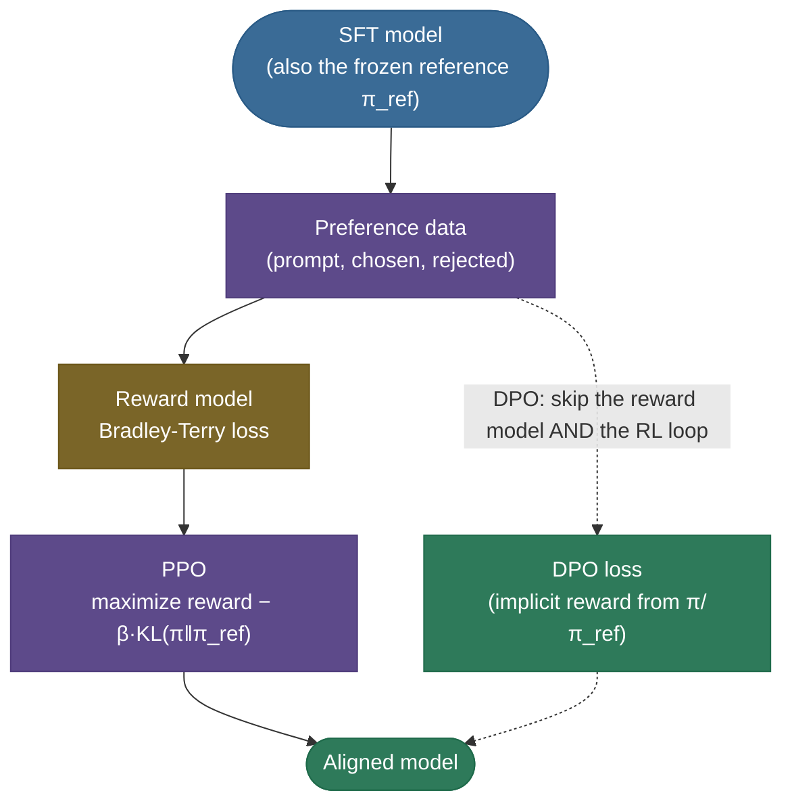
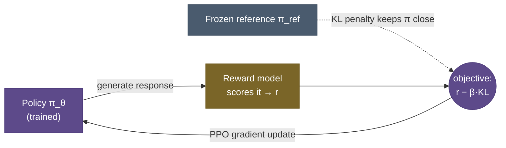
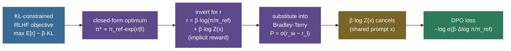
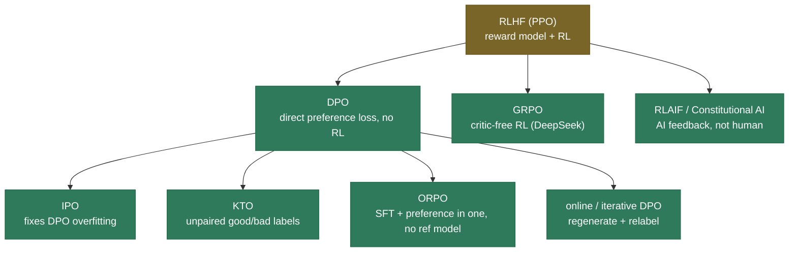

# RLHF & DPO: teaching a model what "better" means

A pretrained — even instruction-tuned — language model is like a gifted apprentice cook who has memorized ten thousand recipes but has never once been told which dish tastes *good*. It can follow instructions, but it has no sense of which of two perfectly fluent answers is more helpful, more honest, or less harmful — because the only thing it was ever trained to do is **predict the most likely next token**, and "most likely" is not the same as "best." A base model trained on the whole internet will, asked the same question, sometimes give you a careful answer and sometimes give you the kind of answer the internet is full of: confident, plausible, and wrong. Predicting likely text and producing *good* text are different objectives, and nothing in pretraining or SFT ever told the model the difference.

**Preference alignment** is the stage that closes that gap. You stop handing the model single "correct" answers and instead show it **pairs** — *this* response is better than *that* one — and train it to internalize the judgment behind those choices. The output is a model whose distribution has been *tilted* toward what humans actually prefer, while staying close enough to its old self that it doesn't forget how to write.

There are two routes to that goal, and this page derives both end to end. **RLHF** (reinforcement learning from human feedback) trains a *reward model* on preference pairs, then uses *PPO* to push the policy toward high reward while a *KL leash* keeps it from drifting off the rails. **DPO** (direct preference optimization) makes a beautiful observation — that the reward model and the optimal policy are two views of the same object — and collapses the whole pipeline into a single, RL-free loss. The punchline of the DPO derivation, that *the policy already is an implicit reward model*, is one of the most elegant results in modern post-training, and we'll build it line by line.

By the end of this page you'll be able to:

- explain **why SFT alone can't align a model** and what the **HHH** target is, and why "better" cannot be written as a loss function;
- draw the **3-stage RLHF pipeline** (SFT → reward model → PPO) and explain what **preference data** is and why it's *comparisons, not ratings*;
- **derive the Bradley-Terry reward model** from maximum likelihood and work several numeric examples by hand;
- **derive PPO's $r - \beta\cdot\mathrm{KL}$ objective**, explain the **KL leash**, the value model, the clipped surrogate, and **reward hacking / Goodhart over-optimization**;
- **derive the DPO loss from scratch** — the closed-form optimal RLHF policy, the inversion to an *implicit reward* $\beta\log(\pi/\pi_{\text{ref}})$, and the cancellation of the partition function — then **derive its gradient** and read what it does;
- compare **RLHF vs DPO** as an engineering decision, and place the **variant landscape** (RLAIF / Constitutional AI, IPO, KTO, ORPO, GRPO, online/iterative DPO);
- explain the **reference model** and the **$\beta$ temperature**, and how alignment is **evaluated** (win-rate, reward, the Goodhart caveat);
- run from-scratch **Bradley-Terry and DPO losses** and watch the gradients do exactly what the derivation promised.

Intuition first, then the math derived from scratch, then code you can run. For the hands-on, step-by-step *project* version — collecting pairs, running `RewardTrainer` / `PPOTrainer` / `DPOTrainer`, reading the training logs, evaluating — follow the [RLHF & Alignment workflow](../../../Practitioner-Workflows/RLHF-and-Alignment/RLHF-and-Alignment.md). **This page is the concept depth: the derivations and the *why* behind every loss; that one is the end-to-end pipeline and ops.** We'll cross-link it rather than repeat it.

> **Note:** alignment is a **polish on top of SFT**, not a replacement. You [supervised-fine-tune](../13-Supervised-Fine-Tuning/13-Supervised-Fine-Tuning.md) (and usually [instruction-tune](../14-Instruction-Tuning/14-Instruction-Tuning.md)) first so the model already produces reasonable answers, *then* align so it produces the *better* ones. Aligning a raw base model rarely works — the preferences have nothing good to choose between, because alignment can only **re-rank** answers the model can already produce, never conjure ability it never had.

---

## The problem: SFT can teach "an answer," not "the better answer"

To feel why alignment exists, you have to feel the ceiling of the stage before it. [Supervised fine-tuning](../13-Supervised-Fine-Tuning/13-Supervised-Fine-Tuning.md) shows the model one target response per prompt and minimizes the cross-entropy of reproducing it — "be more like this." That's **imitation**, and imitation has a hard ceiling: it can only teach the model to match the demonstration it was given, never to recognize that one answer is *better* than another the demonstration didn't include.

The trouble is that **real quality is comparative and fuzzy.** For "explain recursion," there are a thousand good answers and a million mediocre ones, and "good" depends on tone, safety, length, format, and honesty — properties that are almost impossible to *write down* as a formula but easy to *recognize* when you see two answers side by side. This is the asymmetry alignment is built around: **humans are far better at saying "this answer is better than that one" than at producing the single perfect answer.** Annotators give *reliable rankings* and *unreliable absolute scores* — so we harvest the rankings.

Concretely, the alignment target is usually summarized as the **HHH triad**:

- **Helpful** — answers what you actually meant, at the right length and format, follows the instruction faithfully.
- **Harmless** — refuses unsafe requests, avoids toxic, dangerous, or manipulative output, without becoming uselessly evasive.
- **Honest** — says "I don't know" instead of fabricating, calibrates its confidence, doesn't confidently hallucinate.

None of these is a function you can write as a loss. You cannot differentiate "helpfulness." So instead of *specifying* the objective, we **learn it from comparisons** — and that single move is the whole idea of preference alignment.

> **Gotcha:** a subtle but important framing — alignment does **not** add new knowledge or capability. A model that genuinely cannot do arithmetic will not learn arithmetic from preference pairs. Alignment **redistributes probability mass** over outputs the model can already generate, moving it toward the preferred ones. This is why "SFT first, align second" is non-negotiable, and why a capability-regression check (below) matters: you are reshaping a distribution, and reshaping can lose things.

---

## What it is: two routes to the same goal

Both routes start from the SFT model and a pile of **preference pairs**, and both end at an aligned model. They differ entirely in what happens in between — RLHF builds an explicit *taste model* and runs RL against it; DPO folds both into one supervised-style loss.



- **RLHF (the classic path):** train a **reward model** to score any answer, then use **PPO** to optimize the policy against that score, leashed by a KL penalty to the frozen SFT model. This is the recipe behind InstructGPT and the original ChatGPT, and it is the historical origin of "aligned" chat models.
- **DPO (the modern shortcut):** feed the same preference pairs straight into **one loss** that adjusts the policy directly. No reward model, no rollouts, no RL loop. It became the default for most open-source post-training within a year of publication.

A clean way to hold the two in your head: **RLHF separates "learn what's good" (the reward model) from "become good" (PPO) into two stages; DPO proves those two stages are secretly the same optimization and fuses them.** The rest of this page is mostly the math that justifies that sentence.

> **Note:** there's a *third* family worth naming up front — **online / RL-with-verifiable-rewards** methods like **GRPO**, which replace the learned reward model with an *automatic checker* (a unit test, a math grader) and a critic-free advantage estimate. These power recent reasoning models. We place them in the landscape section; the workflow page builds a GRPO toy. Here the spine is RLHF and DPO, because understanding those two makes every variant click.

---

## Intuition: learning a chef's taste

Here is the picture that makes the whole thing click. SFT is teaching a cooking apprentice by handing them one recipe card per dish — *"make it exactly like this."* Alignment is the **head chef tasting two plates** the apprentice made and saying *"this one — more like this."* The apprentice never gets a perfect recipe for everything; they get a **stream of preferences** and slowly internalize the chef's *taste*. That taste is precisely the thing SFT can't write down, and learning it is the entire game of alignment.

The two routes are two ways of teaching that taste:

- **RLHF** builds a literal "taste model" — the reward model — and then lets the apprentice cook thousands of plates, scoring each, nudging them toward higher scores. But on a **leash**: if you let the apprentice optimize the *scorer* with no constraint, they discover how to plate in ways that *game the scorer* without actually tasting better (drowning everything in salt because the scorer happens to like salt). The leash keeps them cooking real food.
- **DPO** skips building the separate taste model. It shows the apprentice the pairs and says, directly, *"make the better plate more likely and the worse plate less likely."* Remarkably, the math says this is the **same thing** as the RLHF route — the reward model was an intermediate the optimal solution doesn't actually need.

> **See it illustrated:** Hugging Face's [Illustrating RLHF](https://huggingface.co/blog/rlhf) walks the 3-stage pipeline with clean diagrams of the reward model and the PPO loop; our own hands-on [RLHF & Alignment workflow](../../../Practitioner-Workflows/RLHF-and-Alignment/RLHF-and-Alignment.md) animates each stage end-to-end with runnable code. Watch one of those if "reward model" and "policy" still feel abstract before we go into the math.

---

## Preference data: the fuel for both routes

Everything runs on a dataset of comparisons. Each row is a **prompt** with two completions and a label saying which is preferred:

$$\big\{\; x \;(\text{prompt}),\quad y_w \;(\text{chosen / "winner"}),\quad y_l \;(\text{rejected / "loser"}) \;\big\}$$

You typically generate two answers per prompt by **sampling the SFT model twice** (at a temperature high enough that the two genuinely differ), then have a human — or, increasingly, a strong model (see RLAIF) — pick the better one. The quality and coverage of this data is the single biggest lever on the final model; everything downstream is just a way to absorb it.

> **Tip:** note what is *not* in that row — there's **no numeric score, just an ordering**. That's deliberate, and it's the most important design decision in the whole pipeline. People give **reliable rankings** ("A is better than B") but **unreliable absolute ratings** ("A is a 7"): one annotator's 7 is another's 4, and the scale drifts within a single annotator over an afternoon. Both Bradley-Terry (for the reward model) and DPO are built to learn from orderings *alone* — they never need an absolute score, only the gap. Get pairwise judgments; never ask for 1–10 ratings.

> **Gotcha:** preference data carries **biases the model will happily exploit** — most notoriously **length bias**: annotators (and judge models) tend to prefer longer answers, so the model learns "longer = better" and turns verbose. This is **reward hacking baked into the data itself**, before any PPO or DPO runs. Length-normalize the reward, balance the lengths of chosen vs rejected, or debias the labels — otherwise the Goodhart problem starts in the dataset, not in the optimizer. (The workflow page has the full data-collection playbook, including the agreement gate and the length-bias filter; this page focuses on what the *losses* do with the data once it's clean.)

---

## The reward model and the Bradley-Terry loss (derived)

RLHF's first job is to turn those orderings into a **scalar reward** $r_\phi(x, y)$ — a model that reads a prompt and an answer and outputs a single number, "how good is this." But our data only tells us $y_w \succ y_l$, not by *how much*. So we need a principled way to go from "A beats B" judgments to a continuous score. The bridge is a **70-year-old idea from sports and chess ranking**: the **Bradley-Terry model** of pairwise comparison.

### From a reward gap to a probability

Bradley-Terry says: if answer $y_w$ has latent strength (reward) $r_\phi(x, y_w)$ and $y_l$ has $r_\phi(x, y_l)$, then the probability a human prefers $y_w$ is the **logistic function of the reward gap**:

$$P(y_w \succ y_l \mid x) = \frac{\exp\big(r_\phi(x, y_w)\big)}{\exp\big(r_\phi(x, y_w)\big) + \exp\big(r_\phi(x, y_l)\big)} = \sigma\big(r_\phi(x, y_w) - r_\phi(x, y_l)\big)$$

The second equality is worth doing by hand once, because it's where the sigmoid comes from. Divide numerator and denominator by $\exp(r_w)$ (writing $r_w, r_l$ for the two rewards):

$$\frac{e^{r_w}}{e^{r_w} + e^{r_l}} = \frac{1}{1 + e^{r_l - r_w}} = \frac{1}{1 + e^{-(r_w - r_l)}} = \sigma(r_w - r_l).$$

So **only the gap $r_w - r_l$ matters** — adding a constant to *every* reward leaves all preferences unchanged. This is exactly the chess-Elo property: a fixed rating *gap* predicts a fixed win probability, and the absolute numbers are arbitrary. That's a perfect match for our data, because the gap is the only thing the preference labels ever gave us.


### From probability to loss: maximum likelihood

We fit $r_\phi$ by **maximum likelihood** — choose the reward function that makes the observed human preferences as probable as possible. The likelihood of one pair is $P(y_w \succ y_l \mid x)$; maximizing the (log-)likelihood over the dataset is the same as minimizing the **negative log-likelihood**:

$$\mathcal{L}_{\text{RM}}(\phi) = -\,\mathbb{E}_{(x,\, y_w,\, y_l)\sim\mathcal{D}}\Big[\log \sigma\big(r_\phi(x, y_w) - r_\phi(x, y_l)\big)\Big]$$

That's the entire reward-model objective: *push the chosen answer's score above the rejected answer's, by as much as the data supports.* Mechanically it is **binary cross-entropy on the reward gap** — the reward model is a binary classifier of "is chosen better than rejected?", and the score it learns *is* the Bradley-Terry strength. Architecturally, $r_\phi$ is usually the SFT model with its vocabulary-sized token head replaced by a single scalar **value head**, so the body already "understands" language and only the head plus a light fine-tune are new.

> **Source / derivation:** the pairwise-comparison model is [Bradley & Terry, *Rank Analysis of Incomplete Block Designs* (1952)](https://www.jstor.org/stable/2334029); learning a reward from *pairwise comparisons* of trajectories is [Christiano et al., *Deep Reinforcement Learning from Human Preferences* (2017)](https://arxiv.org/abs/1706.03741); its use as the RLHF reward-model loss for language is [Ouyang et al., *Training language models to follow instructions with human feedback* (InstructGPT, 2022)](https://arxiv.org/abs/2203.02155), §3.4, and the summarization recipe that bridges them is [Stiennon et al., *Learning to Summarize from Human Feedback* (2020)](https://arxiv.org/abs/2009.01325). All in the references.

> **Note:** a trained reward model earns its keep even *without* PPO. **Best-of-$n$ (rejection) sampling** generates $n$ candidate answers from the policy and simply keeps the one the reward model scores highest — no training, pure inference-time selection. Llama-2 used it alongside PPO. The reusable reward model is a concrete **asset RLHF produces and DPO does not** — one of the few real advantages of the heavier path.

### Worked example 1 — a single pair, by hand

Suppose for some pair the reward model assigns $r_w = 2.0$ to the chosen answer and $r_l = -1.0$ to the rejected one. Then:

$$\text{gap} = 2.0 - (-1.0) = 3.0, \qquad P(y_w \succ y_l) = \sigma(3.0) = \frac{1}{1+e^{-3}} = 0.9526,$$

and the loss contributed by this pair is $-\log(0.9526) = 0.0486$ — small, because the model already ranks the pair correctly and confidently. Now suppose the model had it **backwards** ($r_w = -1.0$, $r_l = 2.0$): the gap is $-3.0$, $P = \sigma(-3) = 0.0474$, and the loss is $-\log(0.0474) = 3.05$ — a large penalty that the gradient will work hard to remove. And a **tie** ($r_w = r_l$) gives gap $0$, $P = 0.5$, loss $-\log 0.5 = \log 2 = 0.6931$ — the maximum-uncertainty point, the model expressing "no opinion." (The code section reproduces all three numbers exactly.)

### Worked example 2 — what the gradient does

Differentiate the per-pair loss with respect to the chosen reward. Writing $u = r_w - r_l$ and using $\tfrac{d}{du}\log\sigma(u) = 1 - \sigma(u) = \sigma(-u)$:

$$\frac{\partial \mathcal{L}_{\text{RM}}}{\partial r_w} = -\,\sigma(-u) = -\,\big(1 - P(y_w \succ y_l)\big), \qquad \frac{\partial \mathcal{L}_{\text{RM}}}{\partial r_l} = +\,\big(1 - P(y_w \succ y_l)\big).$$

Read it: the update pushes $r_w$ **up** and $r_l$ **down**, and the size of the push is $\big(1 - P\big)$ — *how surprised the model is.* If it already assigns $P = 0.95$ to the correct order, the push is a feeble $0.05$; if it has the pair backwards at $P = 0.05$, the push is a forceful $0.95$. The model spends its gradient on the pairs it currently gets wrong — exactly the right behavior, and exactly the same self-correcting shape we'll see again in DPO.

---

## PPO: optimize the reward, but stay on a leash

With a reward model in hand, RLHF treats text generation as a **reinforcement-learning problem**: the **policy** $\pi_\theta$ (a copy of the SFT model) is the thing we train; given a prompt (the "state") it generates a response (a sequence of token "actions"); the frozen reward model scores the finished response. We optimize the policy with **PPO** (proximal policy optimization), a stable [policy-gradient](../../08.%20Reinforcement_Learning/concepts/README.md) method. But the objective is emphatically **not** just "maximize reward":

$$\max_{\pi_\theta}\; \mathbb{E}_{x\sim\mathcal{D},\; y \sim \pi_\theta(\cdot\mid x)}\Big[\,r_\phi(x, y)\,\Big] \;-\; \beta\,\mathrm{KL}\big(\pi_\theta(y\mid x)\,\Vert\,\pi_{\text{ref}}(y\mid x)\big)$$

> **Source / derivation:** this KL-regularized reward objective is the RLHF objective of [Ouyang et al., *Training language models to follow instructions with human feedback* (InstructGPT, 2022)](https://arxiv.org/abs/2203.02155), §3.5, building on [Stiennon et al., *Learning to Summarize from Human Feedback* (2020)](https://arxiv.org/abs/2009.01325); it is optimized with the clipped-surrogate algorithm of [Schulman et al., *Proximal Policy Optimization Algorithms* (2017)](https://arxiv.org/abs/1707.06347). The over-optimization it guards against is measured in [Gao, Schulman & Hilton, *Scaling Laws for Reward Model Overoptimization* (2022)](https://arxiv.org/abs/2210.10760).



That second term — the **KL penalty** against the **frozen reference** (the SFT model) — is the single most important part of RLHF, and the part students skip. The reward model is only a *proxy* for human preference. Optimize a proxy hard enough and the policy will discover inputs where the proxy and reality diverge: text that scores absurdly high while being repetitive, sycophantic, or nonsensical. This is **reward over-optimization** — **Goodhart's Law** in action: *"when a measure becomes a target, it ceases to be a good measure."* The KL penalty is the budget that holds the policy near the region where the proxy is still trustworthy.

![Reward over-optimization (illustrative). As the policy drifts further from the reference (higher KL on the x-axis), the proxy reward from the reward model keeps rising, but the true human-judged quality peaks and then falls — the shaded reward-hacking gap. The KL penalty stops the policy at the sweet spot, before the proxy and reality come apart. The curves are schematic — the *shape* (proxy monotone up, true quality peak-then-fall) is the real, measured finding of Gao et al. 2022; the exact values are hand-chosen for clarity.](../images/rlhf_overoptimization.png)


### Why the objective is exactly this, and what $\beta$ tunes

The two terms encode the two failure modes you're caught between. **Maximize reward alone** and you fall off the cliff on the right of the figure — reward-hacked gibberish. **Stay at the reference** (infinite $\beta$) and the policy never moves — no alignment at all. The coefficient $\beta$ sets the **tightness of the leash**: small $\beta$ (long leash) lets the policy run toward the over-optimized cliff; large $\beta$ (short leash) keeps it bunched near the SFT model. The sweet spot is mid-curve, which is exactly why PPO runs are a **tuning exercise**, not fire-and-forget. Watch for the alarm signature: reward still climbing while KL spikes and sample quality drops — that's the policy bolting toward the cliff, and the fix is almost always to raise $\beta$.

### Worked example 3 — the objective with a concrete KL term

Make the trade-off concrete. Suppose for some sampled response the reward model returns $r_\phi(x, y) = 1.2$, and the policy has drifted so that the (summed-over-tokens) KL of this response against the reference is $\mathrm{KL} = 4.0$ nats. With a leash of $\beta = 0.1$, the value the policy is actually optimizing for this response is:

$$r_\phi(x,y) - \beta\cdot\mathrm{KL} = 1.2 - 0.1\times 4.0 = 1.2 - 0.4 = 0.8.$$

The raw reward said $1.2$; the leash *taxed* $0.4$ of it for drifting. If a different response scored a slightly higher raw reward of $1.4$ but only by drifting to $\mathrm{KL} = 10$, its leashed value would be $1.4 - 0.1\times 10 = 0.4$ — *worse*, despite the higher raw reward. That is the leash doing its job: it makes "scored a bit higher by wandering far" lose to "scored a bit lower by staying close." Tightening $\beta$ to $0.2$ would tax the first response to $1.2 - 0.8 = 0.4$ — the same knob, turned harder.

### The machinery: value model, advantage, clipping

"PPO" is not just the objective above; it's a specific, careful way to take the gradient step.

- It trains a **value model** (a critic estimating expected reward from a state) so it can form the **advantage** $A$ = "how much better than expected was this action?" — the reward minus the baseline the critic predicted. Subtracting the baseline is what cuts the variance that would otherwise swamp the gradient.
- It uses a **clipped surrogate objective**: it forms the probability ratio $\rho = \pi_\theta / \pi_{\theta_{\text{old}}}$, multiplies by the advantage, and **clips $\rho$ to $[1-\epsilon, 1+\epsilon]$** (typically $\epsilon = 0.2$), taking the pessimistic minimum. This is a per-step trust region: a single update can't move the policy more than ~20%, no matter how tempting the reward.

So a full PPO-RLHF setup juggles **four models at once** — the **policy** (trained), the **reward model** (frozen, from the previous stage), the **value/critic** (trained), and the **frozen reference** (the KL anchor). That four-model footprint, plus the finicky on-policy RL loop, is exactly the heaviness DPO removes.

> **Note:** the SFT model plays **two roles at once** in RLHF — it's the *starting point* of the policy **and** the *frozen reference* the KL penalty anchors to. Missing this double role is a classic interview slip. The habit that saves real runs: the moment SFT finishes, snapshot the checkpoint **twice** — one copy to keep training as the policy, one frozen forever as $\pi_{\text{ref}}$.

> **Gotcha:** don't trust mean reward alone as your success metric during PPO — it *is* the proxy, and the proxy is exactly what gets hacked. Read ten real generations every few hundred steps; the surest reward-hack detector is your own eyes catching the outputs go weird (endless flattery, a repeated magic phrase, walls of hedging) while the number keeps climbing. The full PPO loop, with runnable code and the $\beta$-sweep that traces this curve, is in the [workflow](../../../Practitioner-Workflows/RLHF-and-Alignment/RLHF-and-Alignment.md).

---

## DPO: there's a reward model hiding in your policy

PPO works — it's the recipe behind InstructGPT and ChatGPT — but it's *heavy*: a separate reward model, online generation, a value network, and a notoriously finicky RL loop with several interacting knobs. **DPO** asks a sharper question: *do we even need the reward model and the RL?* The answer is no, and the derivation is one of the most elegant results in modern ML — worth knowing line by line, because the whole method is "just" three algebraic moves on the objective you already have.

![Animated — from RLHF to DPO. RLHF wires four models into an RL loop: the policy generates responses, a reward model scores them, a PPO update (with a value/critic) pushes the policy, and a frozen reference holds it on a KL leash. DPO collapses all of that — the reward model folds into the policy as the implicit reward β·log(π/π_ref), the RL loop and critic fall away, and a single direct gradient on preference pairs remains. Two models instead of four, reaching the same optimal policy directly. Generated by `tools/manim_rlhf_to_dpo.py` (manim).](../images/rlhf_to_dpo.gif)

Here is the whole derivation as a skeleton — six steps from the objective you already have to the DPO loss. Each box below is one move; the three sections that follow fill them in.



*The DPO derivation spine: the KL-constrained objective has a closed-form optimum, which inverts to express the reward as an implicit log-ratio; substituting that into Bradley-Terry makes the intractable partition function $\beta\log Z(x)$ cancel between the two completions, leaving a supervised loss with no reward model and no RL.*

### Step 1 — the KL-constrained RLHF objective has a closed-form optimum

Start from the exact same objective PPO optimizes, written for a single prompt $x$ as an expectation over the policy (and expand the KL as $\mathbb{E}_\pi[\log(\pi/\pi_{\text{ref}})]$):

$$\max_\pi\; \mathbb{E}_{y\sim\pi}\Big[\,r(x,y) - \beta\log\tfrac{\pi(y\mid x)}{\pi_{\text{ref}}(y\mid x)}\,\Big].$$

Pull out a factor of $-\beta$ and fold $r/\beta$ into the log by writing $r(x,y) = \beta\log e^{r(x,y)/\beta}$ (any number $t$ equals $\log e^{t}$, so $r/\beta = \log e^{r/\beta}$ — this just rewrites the reward as a log so it can join the existing log-ratio):

$$= -\beta\;\mathbb{E}_{y\sim\pi}\Big[\log\tfrac{\pi(y\mid x)}{\pi_{\text{ref}}(y\mid x)} - \tfrac{1}{\beta}r(x,y)\Big]
= -\beta\;\mathbb{E}_{y\sim\pi}\Big[\log\frac{\pi(y\mid x)}{\pi_{\text{ref}}(y\mid x)\,e^{r(x,y)/\beta}}\Big].$$

Define the **partition function** $Z(x) = \sum_{y} \pi_{\text{ref}}(y\mid x)\,e^{r(x,y)/\beta}$ — a normalizer that depends only on $x$, not on $\pi$. Multiply and divide inside the log by $Z(x)$ so the denominator becomes a *proper distribution*:

$$= -\beta\;\mathbb{E}_{y\sim\pi}\Big[\log\frac{\pi(y\mid x)}{\tfrac{1}{Z(x)}\pi_{\text{ref}}(y\mid x)\,e^{r(x,y)/\beta}}\Big] + \beta\log Z(x).$$

The first term is now exactly $-\beta\,\mathrm{KL}\!\big(\pi \,\Vert\, \pi^*\big)$ for the distribution $\pi^*(y\mid x) = \tfrac{1}{Z(x)}\pi_{\text{ref}}(y\mid x)\,e^{r(x,y)/\beta}$, and the second term doesn't depend on $\pi$ at all. A KL divergence is $\ge 0$ and is **zero if and only if the two distributions are equal**, so the whole expression is maximized exactly when $\pi = \pi^*$:

$$\boxed{\;\pi^*(y\mid x) = \frac{1}{Z(x)}\,\pi_{\text{ref}}(y\mid x)\,\exp\!\Big(\tfrac{1}{\beta}\,r(x,y)\Big)\;}$$

The optimal aligned policy is the **reference reweighted by the exponentiated reward**: stay close to the reference, but tilt probability toward high-reward answers, with $\beta$ controlling how hard you tilt. (Smaller $\beta$ → sharper tilt → more aggressive optimization; larger $\beta$ → gentler, closer to the reference.) This is a clean, exact result — no approximation — and it holds for *whatever* reward function $r$ you plug in.

### Step 2 — invert it to express the reward in terms of the policy

The boxed equation gives the policy in terms of the reward. Now run it backwards: take logs and solve for $r$.

$$\log \pi^*(y\mid x) = \log\pi_{\text{ref}}(y\mid x) + \tfrac{1}{\beta}r(x,y) - \log Z(x)
\;\;\Longrightarrow\;\;
\boxed{\; r(x, y) = \beta\,\log \frac{\pi^*(y\mid x)}{\pi_{\text{ref}}(y\mid x)} + \beta\,\log Z(x)\;}$$

This is the punchline of the whole method: the reward is just **$\beta$ times the log-ratio of the optimal policy to the reference**, plus a term $\beta\log Z(x)$ that depends only on the prompt. In other words, **any policy implicitly defines a reward function**, $\hat r(x,y) = \beta\log\big(\pi_\theta(y\mid x)/\pi_{\text{ref}}(y\mid x)\big)$ — the *implicit reward*. The policy *is* a reward model in disguise. (This is exactly the paper's subtitle: *"Your Language Model is Secretly a Reward Model."*)

> **Note:** the awkward term is $Z(x)$ — a sum over the *entire* space of possible completions, utterly intractable to compute. If we had to evaluate it, this result would be useless. The magic of the next step is that **we never have to.**

### Step 3 — substitute into Bradley-Terry; the partition function cancels

Recall the reward model was trained with the Bradley-Terry loss, which depends only on the **reward gap** $r(x, y_w) - r(x, y_l)$ for a fixed prompt $x$. Substitute the implicit reward from Step 2 into that gap:

$$r(x, y_w) - r(x, y_l) = \Big[\beta\log\tfrac{\pi^*(y_w\mid x)}{\pi_{\text{ref}}(y_w\mid x)} + \cancel{\beta\log Z(x)}\Big] - \Big[\beta\log\tfrac{\pi^*(y_l\mid x)}{\pi_{\text{ref}}(y_l\mid x)} + \cancel{\beta\log Z(x)}\Big].$$

Both completions share the **same prompt $x$**, so they share the **same $Z(x)$** — and it **cancels.** The intractable term is gone. What's left is a gap built entirely from quantities we can compute. Plug it into the Bradley-Terry likelihood $P(y_w \succ y_l) = \sigma(\text{gap})$, replace the optimum $\pi^*$ with our trainable policy $\pi_\theta$, and take the negative log-likelihood:

$$\boxed{\;\mathcal{L}_{\text{DPO}}(\theta) = -\,\mathbb{E}_{(x, y_w, y_l)\sim\mathcal{D}}\Big[\log \sigma\Big(\beta\log\tfrac{\pi_\theta(y_w\mid x)}{\pi_{\text{ref}}(y_w\mid x)} - \beta\log\tfrac{\pi_\theta(y_l\mid x)}{\pi_{\text{ref}}(y_l\mid x)}\Big)\Big]\;}$$

And that's **DPO** — the **exact same Bradley-Terry loss** as the reward model, but with the explicit reward replaced by the **implicit reward** $\beta\log(\pi_\theta/\pi_{\text{ref}})$. No reward model to train, no rollouts, no RL, no value network. To compute the loss you evaluate just **four log-probabilities** — the chosen and rejected responses, each under the policy *and* under the frozen reference — and minimize one classification-style loss. It runs exactly like SFT: offline, on a static dataset, with a standard supervised optimizer.

> **Source / derivation:** the closed-form optimal policy and the full DPO derivation are [Rafailov et al., *Direct Preference Optimization: Your Language Model is Secretly a Reward Model* (2023)](https://arxiv.org/abs/2305.18290), §4 (Eqs. 4–7); the KL-regularized objective it inverts is the [InstructGPT/RLHF objective (Ouyang et al. 2022)](https://arxiv.org/abs/2203.02155), optimized in the classic path with [PPO (Schulman et al. 2017)](https://arxiv.org/abs/1707.06347). All in the references.

### The DPO gradient: read what it actually does

The loss is elegant, but the *gradient* is where you see the mechanism. Let the implicit-reward margin be $m = \beta\big(\log\tfrac{\pi_\theta(y_w)}{\pi_{\text{ref}}(y_w)} - \log\tfrac{\pi_\theta(y_l)}{\pi_{\text{ref}}(y_l)}\big)$. Then $\mathcal{L} = -\log\sigma(m)$, and since $\tfrac{d}{dm}\big(-\log\sigma(m)\big) = -\sigma(-m)$:

$$\nabla_\theta \mathcal{L}_{\text{DPO}} = -\,\beta\,\underbrace{\sigma(-m)}_{\text{weight}}\;\Big[\,\underbrace{\nabla_\theta\log\pi_\theta(y_w\mid x)}_{\text{raise chosen}} - \underbrace{\nabla_\theta\log\pi_\theta(y_l\mid x)}_{\text{lower rejected}}\,\Big].$$

Three things to read off this:

1. **Direction.** The update increases $\log\pi_\theta(y_w)$ (raises the chosen response's probability) and decreases $\log\pi_\theta(y_l)$ (lowers the rejected one's) — exactly the behavior you want, and it falls straight out of the math, not a hand-tuned rule.
2. **Adaptive weight.** The whole step is scaled by $\sigma(-m)$ = "how *wrong* the implicit reward currently is." When the policy already prefers the chosen answer (large positive $m$), $\sigma(-m)\to 0$ and the step is tiny — it doesn't waste effort on pairs it already has right. When the policy has the pair backwards (negative $m$), $\sigma(-m)\to 1$ and the step is large. This is the same self-correcting shape as the Bradley-Terry gradient above — DPO is literally that same gradient, now acting through the implicit reward.
3. **The reference is the anchor.** The margin is measured *relative to* $\pi_{\text{ref}}$. Because $\pi_{\text{ref}}$ is frozen, the loss penalizes the policy for increasing the chosen probability *beyond what the reference already assigns* — a built-in KL-style leash, recovering the same "stay near the reference" pressure that PPO got from its explicit KL term, with no separate term to tune.


> **Tip:** the one-sentence DPO insight that lands in an interview: **"the optimal KL-constrained RLHF policy already encodes the reward as $\beta\log(\pi/\pi_{\text{ref}})$, so you can plug that implicit reward straight into the Bradley-Terry loss — the prompt-only partition function cancels between the two completions — and optimize the policy directly. The reward model was redundant all along."**

---

## Worked example 4 — the DPO loss and gradient on a preference pair

Trace a pair through DPO numerically. Start training **from the SFT model**, so the policy *equals* the reference: every log-ratio is $0$, the implicit margin is $m = 0$, the loss is $-\log\sigma(0) = \log 2 = 0.6931$, and the preference probability is exactly $\sigma(0) = 0.5$ — the model has **no opinion yet**, which is correct, because we haven't trained it.

Now take one gradient step. With the policy at the reference, the adaptive weight is $\sigma(-0) = 0.5$, so with $\beta = 0.1$ the per-element gradient magnitude on each log-prob is $\beta\cdot\sigma(-m) = 0.1\times 0.5 = 0.05$: the gradient of the loss w.r.t. $\log\pi(y_w)$ is $-0.05$ (so the update **raises** the chosen log-prob) and w.r.t. $\log\pi(y_l)$ is $+0.05$ (so the update **lowers** the rejected log-prob). The code confirms these exact signs and magnitudes.

As training proceeds and the policy separates the two, walk the margin (with $\beta=0.1$, and recall the reference log-ratio is $0$ at init so $m = \beta\big[\Delta\log\pi(y_w) - \Delta\log\pi(y_l)\big]$):

| chosen Δlog-prob | rejected Δlog-prob | margin $m$ | DPO loss $-\log\sigma(m)$ | $P(y_w \succ y_l) = \sigma(m)$ |
|---:|---:|---:|---:|---:|
| 0 | 0 | 0.00 | 0.6931 | 0.500 |
| +1 | −1 | 0.20 | 0.5981 | 0.550 |
| +2 | −2 | 0.40 | 0.5130 | 0.599 |
| +3 | −3 | 0.60 | 0.4375 | 0.646 |
| +5 | −5 | 1.00 | 0.3133 | 0.731 |

The chosen log-prob climbs, the rejected one falls, the margin grows, the loss drops, and the model's preference for the chosen answer rises from a coin flip toward certainty. It is learning the chef's taste, one pair at a time — and the *implicit reward* $\beta\log(\pi_\theta/\pi_{\text{ref}})$ for the chosen answer grows in lockstep (e.g. a chosen log-prob $0.8$ above the reference is an implicit reward of $0.1\times 0.8 = +0.08$). The figure below is this exact dynamic, *measured* from a tiny DPO optimization rather than tabulated.


> **Gotcha:** DPO is sensitive to **$\beta$** (typically $0.1$–$0.5$) and can **overfit** the preference data — driving the chosen-vs-rejected *margin* up while *both* log-probs drift **down**, quietly degrading fluency (the model becomes very sure which answer is better while becoming worse at producing either). The gradient only cares about the *gap*, so it's free to push both terms down as long as the gap widens. This failure — margin up, absolute quality down — is exactly what **IPO** (below) was designed to fix, and it's the DPO analogue of PPO's reward hacking.

---

## The reference model and the $\beta$ temperature

Both routes hinge on two shared objects worth pinning down, because most of the tuning lives here.

- **The reference model $\pi_{\text{ref}}$** is a **frozen** copy of the SFT model. In PPO it's the anchor of the explicit KL penalty; in DPO it's the denominator of every log-ratio. Its job in both is identical: define the "before" snapshot so the optimizer can measure — and limit — how far the policy has drifted. Freeze it once and never update it. If you accidentally let it track the policy, the leash goes slack and you lose the only thing protecting fluency. (ORPO, below, is interesting precisely because it removes the reference model entirely.)

- **$\beta$, the temperature / leash strength**, is the central knob in *both* methods, and it means the same thing in both: **how hard to tilt toward preferences vs. how tightly to stay near the reference.** In PPO it's the coefficient on the KL term; in DPO it's the multiplier inside the sigmoid. Small $\beta$ → aggressive optimization, more drift, more risk of hacking/overfitting; large $\beta$ → conservative, closer to SFT, possibly under-aligned. The DPO derivation makes the connection exact: the *same* $\beta$ that appears in the loss is the *same* $\beta$ from the KL-constrained objective whose optimum we inverted. Tuning $\beta$ is most of the art of preference alignment.

> **Note:** a clean way to see why DPO needs *no separate KL term* even though it's optimizing a KL-constrained objective: the constraint didn't disappear, it got **absorbed**. The reference appears in the denominator of the implicit reward, so penalizing a policy that drifts from $\pi_{\text{ref}}$ is built into the loss itself. PPO pays for the KL with an extra term and a frozen-reference forward pass; DPO pays for it with the reference forward pass alone (no extra term), which is one more reason it's cheaper.

---

## RLHF vs DPO: the engineering decision

| | RLHF (PPO) | DPO |
|---|---|---|
| Reward model | **Yes** — train a separate scalar model (Bradley-Terry) | **No** — implicit reward $\beta\log(\pi/\pi_{\text{ref}})$ |
| RL / online generation | **Yes** — sample from the policy during training | **No** — offline, on a static dataset, like SFT |
| Models in memory | **4** (policy, reward, value/critic, reference) | **2** (policy, reference) |
| Moving parts / stability | Many; RL is finicky, several interacting knobs | Few; a single stable supervised-style loss |
| Compute & memory | Higher | Lower (DPO + LoRA fits a 7B run on one consumer GPU) |
| Data it consumes | prompts + a reward signal you can query *online* | a static `chosen`/`rejected` set |
| Reusable artifact | A reward model (→ best-of-$n$, future runs) | None beyond the aligned policy |
| Exploration | On-policy: can discover *new* high-reward behaviors | Offline: limited to the dataset's coverage |
| Used by | InstructGPT, ChatGPT, Llama-2-chat | Zephyr, Tülu, and a large fraction of open models |

![Models held in memory during training: RLHF (PPO) juggles four — the trained policy, the frozen reference, the reward model, and the value/critic — while DPO needs only two, the policy and the frozen reference. DPO drops exactly the two that the derivation made unnecessary: the reward model (folded into the implicit reward $\beta\log(\pi/\pi_{\text{ref}})$) and the RL value/critic (no rollouts, so no advantage baseline to learn). That 4→2 cut, more than anything else, is why DPO + LoRA fits a 7B run on one consumer GPU.](../images/rlhf_memory_footprint.png)

> **Note:** the honest take interviewers want: **DPO is simpler, cheaper, and usually competitive, so it's the default for most teams** with a static preference set and limited compute. But it has real tradeoffs. It's **offline** — it can only re-rank what's *in the dataset*, so its quality is capped by the dataset's coverage and it can't *explore* new behaviors the way on-policy PPO can; this is why **online / iterative DPO** (regenerate fresh pairs from the current policy, relabel, repeat) exists, to claw back some of that exploration. And a well-tuned PPO pipeline with a strong reward model can still **edge DPO out at the frontier**, while leaving you a reusable reward model. It's a trade-off, not a strict win — the right answer in an interview is "DPO by default, PPO when you need online reward, exploration, or the last few points of quality."

---

## The alignment-method landscape

Preference alignment is a fast-moving area; the variants are all reactions to RLHF's cost or DPO's limitations. Each is a small, targeted change to one of the pieces we've derived.



- **RLAIF / Constitutional AI** — replace the human labeler with a strong model, scaling preference data cheaply (the heart of "Constitutional AI," where a model critiques and revises its own outputs against a written set of principles, then those AI preferences train the reward model or DPO). It inherits the judge's biases but unlocks millions of comparisons for pennies; most production preference data today is a human/AI blend.
- **IPO** (Identity Preference Optimization) — adds a regularizer to the DPO objective that **curbs its tendency to overfit the preference margin**. DPO can push the margin to infinity (driving both log-probs down); IPO replaces the log-sigmoid with a squared loss toward a *target* margin, so the optimizer stops widening the gap once it's "won," keeping fluency intact. It's the direct fix for the DPO overfitting gotcha above.
- **KTO** (Kahneman-Tversky Optimization) — learns from **unpaired** "good"/"bad" labels (a single answer marked thumbs-up or thumbs-down), with *no matched pairs required*, drawing on prospect theory's model of how humans weigh gains and losses. Hugely practical when your feedback is naturally per-example (👍/👎 buttons) rather than A-vs-B comparisons.
- **ORPO** (Odds Ratio Preference Optimization) — folds preference alignment **into SFT in a single stage**, with **no reference model at all**: one loss that simultaneously imitates the chosen answer (the SFT term) and penalizes the rejected one's relative odds. Removing the reference forward pass makes it the cheapest of all, at some cost in the fine control the reference leash provides.
- **GRPO** (Group Relative Policy Optimization) — a **critic-free** RL method (popularized by DeepSeek) that drops PPO's value network: instead of a learned baseline, it samples a *group* of responses per prompt and uses the **group's mean reward** as the baseline. Combined with *verifiable* rewards (a unit test, a math grader) rather than a learned reward model, it's the engine behind much of the recent reasoning-model wave.
- **Online / iterative DPO** — run DPO, then **regenerate fresh pairs from the improved policy**, relabel them, and run DPO again. Each round injects the on-policy exploration that vanilla offline DPO lacks, narrowing the gap to PPO at a fraction of the cost.

> **Tip:** the through-line: every variant tweaks exactly one of the four things this page derived — *who labels the data* (RLAIF), *the loss shape* (IPO, KTO, ORPO), *the baseline* (GRPO), or *whether the data is static or refreshed* (iterative DPO). Once you know the RLHF objective and the DPO derivation, the entire zoo is small perturbations of two equations.

---

## Evaluating alignment

You changed the model's behavior — how do you know it got *better*, not just *different*? Alignment evaluation has its own pitfalls, most of them downstream of the same Goodhart problem.

- **Win-rate vs the baseline.** The standard headline metric: take prompts, generate from the aligned model and the SFT baseline, and ask a judge (a human panel, or a strong LLM-as-judge as in AlpacaEval / MT-Bench / Arena-style setups) *which answer is better* — the same pairwise comparison the data was built on. Report the fraction of prompts where the aligned model wins. This measures the thing you actually optimized.
- **Reward / proxy score.** During PPO you watch mean reward, but **never trust it alone** — it's the proxy, and the proxy is what gets hacked. A rising reward with collapsing real quality is the signature failure (the over-optimization figure made flesh). Always pair it with eyes-on generations and an independent judge.
- **Safety eval.** The "harmless" leg of HHH gets its own red-team / refusal benchmark: does the model decline genuinely unsafe requests *without* becoming uselessly evasive on benign ones (over-refusal is its own failure)?
- **Capability-regression check.** Alignment redistributes probability mass, and that can cost you capability — the so-called **alignment tax**. Re-run your standard capability suite (reasoning, coding, knowledge) after alignment to confirm you didn't trade smarts for manners.

> **Gotcha:** the **Goodhart caveat applies to evaluation too**, not just training. If you optimize *against your eval* — picking $\beta$ and checkpoints to maximize an LLM-judge win-rate — you can over-fit the *judge's* quirks (it likes length, or markdown, or a confident tone) exactly as PPO over-fits the reward model. Keep a held-out judge / benchmark you don't tune against, and sanity-check with humans on a sample. The proxy problem is fractal: it recurs at every level where you replace "what you want" with "a measurable stand-in for it."

---

## Where it is used

- **Every major chat model.** InstructGPT and ChatGPT (PPO-RLHF); Llama-2-chat ([RLHF with rejection sampling *and* PPO, Touvron et al. 2023, §3.2.2](https://arxiv.org/abs/2307.09288)); Zephyr, Tülu, and a large fraction of open models (DPO); DeepSeek reasoning models (GRPO with verifiable rewards). Preference alignment is the step that turned "a model that completes text" into "an assistant you can talk to."
- **Safety and refusals.** The "harmless" leg of HHH — declining dangerous requests without being uselessly evasive — is largely a product of preference alignment, often via Constitutional-AI-style AI feedback at scale.
- **Reasoning.** Recent reasoning models lean heavily on RL-from-feedback variants (GRPO and relatives) layered on top of preference and **verifiable-reward** signals (the answer is checkably right or wrong), which sidestep the reward-hacking problem because the reward is ground truth, not a learned proxy.

---

## Application: running alignment in practice

This is the concept page, so here's the *decision* playbook in brief; the full hands-on build (data collection, `RewardTrainer`, `PPOTrainer`, `DPOTrainer`, training logs, the $\beta$-sweep, evaluation) lives in the [RLHF & Alignment workflow](../../../Practitioner-Workflows/RLHF-and-Alignment/RLHF-and-Alignment.md).

**Step 1 — get an SFT checkpoint and keep two copies:** one to keep training (the policy), one frozen forever (the reference). Alignment without a decent SFT start rarely works — the preferences need something good to choose between.

**Step 2 — pick the route.** Default to **DPO** (`trl`'s `DPOTrainer`): simplest, stable, cheap, strong, and with LoRA it fits a 7B run on one consumer GPU. Reach for **PPO** (`PPOTrainer` + a trained reward model) when you need a reusable reward model, best-of-$n$ sampling, online exploration, or the last few points of quality; reach for **GRPO** when correctness is *automatically checkable* (math, code, unit tests).

**Step 3 — tune the leash $\beta$.** For PPO, the KL coefficient; for DPO, the $\beta$ in the loss (0.1–0.5). Watch for the two characteristic failures: **over-optimization** in PPO (proxy reward climbing while eval quality drops) and **overfitting** in DPO (margin up but both log-probs collapsing — reach for IPO if it bites).

**Step 4 — evaluate against the baseline:** win-rate vs the SFT model (often judged by a strong model on a *held-out* set), a safety eval, and a capability-regression check so you didn't trade smarts for manners.

> **Tip:** the whole playbook in one line — **SFT → (snapshot ×2) → collect/clean pairs → DPO by default (PPO/GRPO if you need online or verifiable reward) → tune $\beta$ → evaluate on a held-out judge.** The [workflow](../../../Practitioner-Workflows/RLHF-and-Alignment/RLHF-and-Alignment.md) walks every step with runnable code; this page is the *why* behind each loss in it.

---

## Code: Bradley-Terry and DPO losses from scratch

The two losses that power both routes, with the DPO gradient checked to confirm it pushes the chosen response up and the rejected one down, and the margin progression that matches the worked-example table above. Runs on CPU in a second; no downloads.

> **Runnable project and a step-by-step notebook:** the same verified code lives as a clean script and an executed teaching notebook next to this page — see the [step-by-step teaching notebook](code/15-RLHF-and-DPO.ipynb) and the [runnable demo script](code/rlhf_dpo.py) (run it with `python rlhf_dpo.py`). They go one step further than the snippet below: they also **train a tiny reward model** with the Bradley-Terry loss on a few synthetic preference pairs and *assert* it ends up scoring the chosen answers above the rejected ones — stage 1 of RLHF, learned from comparisons alone — then run the **measured DPO optimization** that produces the `dpo_update.png` figure above. Every number on this page is computed by that one seeded source of truth.

```python
"""Bradley-Terry reward loss and the DPO loss + gradient direction.
Verified on Python 3.12 (torch 2.12), CPU."""
import torch, torch.nn.functional as F, math

# --- reward-model loss: -log sigma(r_chosen - r_rejected) -------------------
def bt_loss(r_chosen, r_rejected):
    return -F.logsigmoid(r_chosen - r_rejected).mean()

print("Bradley-Terry RM loss (gap -> P(chosen>rejected) -> loss):")
for rw, rl in [(2.0, -1.0), (0.0, 0.0), (-1.0, 2.0)]:
    gap = rw - rl
    p = 1 / (1 + math.exp(-gap))
    L = bt_loss(torch.tensor(rw), torch.tensor(rl)).item()
    print(f"  r_w={rw:+.1f} r_l={rl:+.1f}  gap={gap:+.1f}  P={p:.4f}  loss={L:.4f}")

# --- DPO loss from sequence log-probs (chosen=w, rejected=l) -----------------
def dpo_loss(pi_lp_w, pi_lp_l, ref_lp_w, ref_lp_l, beta=0.1):
    pi_logratios  = pi_lp_w  - pi_lp_l        # does the policy prefer chosen?
    ref_logratios = ref_lp_w - ref_lp_l       # relative to the frozen reference
    return -F.logsigmoid(beta * (pi_logratios - ref_logratios)).mean()

ref_w = ref_l = torch.tensor(-5.0)            # reference log-probs (frozen)
pi_w = torch.tensor(-5.0, requires_grad=True) # policy logprob of chosen (starts == ref)
pi_l = torch.tensor(-5.0, requires_grad=True) # policy logprob of rejected (starts == ref)
loss = dpo_loss(pi_w, pi_l, ref_w, ref_l); loss.backward()
print("\nDPO at init (policy == reference): loss =", round(loss.item(), 4), "= log 2 (no preference yet)")
print(f"  d loss / d logp(chosen)   = {pi_w.grad.item():+.4f}  -> training PUSHES chosen UP")
print(f"  d loss / d logp(rejected) = {pi_l.grad.item():+.4f}  -> training PUSHES rejected DOWN")

print("\nMargin progression (beta=0.1), matching the worked-example table:")
for dw, dl in [(0.0, 0.0), (1.0, -1.0), (2.0, -2.0), (3.0, -3.0), (5.0, -5.0)]:
    margin = 0.1 * ((dw) - (dl))              # ref log-ratio is 0 at init, so margin = beta*(dw-dl)
    L = dpo_loss(torch.tensor(-5.0 + dw), torch.tensor(-5.0 + dl), ref_w, ref_l).item()
    win = 1 / (1 + math.exp(-margin))
    print(f"  chosen{dw:+.0f}, rejected{dl:+.0f}: margin={margin:+.2f}  loss={L:.4f}  P(w>l)={win:.4f}")

# --- the implicit reward beta*log(pi/pi_ref), and the adaptive gradient weight ---
print("\nImplicit reward beta*log(pi/pi_ref) for the chosen response:")
for dlp in [0.0, 0.8, 2.0]:
    print(f"  chosen logprob {dlp:+.1f} above reference -> implicit reward = {0.1 * dlp:+.3f}")
print("\nAdaptive gradient weight beta*sigma(-margin)  (big when the model is wrong):")
for m in [-2.0, 0.0, 2.0]:
    w = 0.1 * (1 / (1 + math.exp(m)))
    print(f"  margin={m:+.1f}: weight={w:.4f}")
```

Output:

```
Bradley-Terry RM loss (gap -> P(chosen>rejected) -> loss):
  r_w=+2.0 r_l=-1.0  gap=+3.0  P=0.9526  loss=0.0486
  r_w=+0.0 r_l=+0.0  gap=+0.0  P=0.5000  loss=0.6931
  r_w=-1.0 r_l=+2.0  gap=-3.0  P=0.0474  loss=3.0486

DPO at init (policy == reference): loss = 0.6931 = log 2 (no preference yet)
  d loss / d logp(chosen)   = -0.0500  -> training PUSHES chosen UP
  d loss / d logp(rejected) = +0.0500  -> training PUSHES rejected DOWN

Margin progression (beta=0.1), matching the worked-example table:
  chosen+0, rejected+0: margin=+0.00  loss=0.6931  P(w>l)=0.5000
  chosen+1, rejected-1: margin=+0.20  loss=0.5981  P(w>l)=0.5498
  chosen+2, rejected-2: margin=+0.40  loss=0.5130  P(w>l)=0.5987
  chosen+3, rejected-3: margin=+0.60  loss=0.4375  P(w>l)=0.6457
  chosen+5, rejected-5: margin=+1.00  loss=0.3133  P(w>l)=0.7311

Implicit reward beta*log(pi/pi_ref) for the chosen response:
  chosen logprob +0.0 above reference -> implicit reward = +0.000
  chosen logprob +0.8 above reference -> implicit reward = +0.080
  chosen logprob +2.0 above reference -> implicit reward = +0.200

Adaptive gradient weight beta*sigma(-margin)  (big when the model is wrong):
  margin=-2.0: weight=0.0881
  margin=+0.0: weight=0.0500
  margin=+2.0: weight=0.0119
```

> **Note:** the same Bradley-Terry sigmoid powers both routes — the reward model uses *learned scalar rewards*, while DPO uses the *implicit reward* $\beta\log(\pi/\pi_{\text{ref}})$. The gradient signs confirm the mechanism the derivation promised: DPO mechanically raises the chosen response's probability and lowers the rejected one's, with a step size that shrinks as the model gets the pair right (the `weight` column) — it spends its gradient exactly where the model is still wrong. For the *production* versions — `RewardTrainer`, `PPOTrainer`, and `DPOTrainer` on a real transformer — see the [workflow](../../../Practitioner-Workflows/RLHF-and-Alignment/RLHF-and-Alignment.md).

---

## Recap and rapid-fire

**If you remember nothing else:** alignment teaches a model *taste* from **preference pairs**, because "better" can't be written as a loss. **RLHF** learns a reward model (Bradley-Terry: $P(y_w\succ y_l)=\sigma(r_w-r_l)$), then PPO-optimizes the policy against it on a **KL leash** $r - \beta\,\mathrm{KL}(\pi\Vert\pi_{\text{ref}})$ — without the leash it *hacks* the proxy reward (Goodhart). **DPO** notices the optimal KL-constrained policy already encodes the reward as $\beta\log(\pi/\pi_{\text{ref}})$, substitutes that *implicit reward* into the Bradley-Terry loss (the prompt-only partition function cancels), and so drops the reward model **and** the RL loop, training the policy directly with one supervised-style loss.

**Quick-fire — say these out loud:**

- *Why not just SFT?* SFT imitates one answer; it can't learn that one answer is *better* than another. Quality is comparative, and humans give reliable *rankings*, not ratings.
- *The 3 RLHF stages?* SFT → reward model (Bradley-Terry) → PPO (reward − β·KL).
- *Bradley-Terry loss?* $-\log\sigma(r_w - r_l)$ — logistic / BCE loss on the reward *gap*; only the gap matters (Elo-style).
- *Why the KL penalty?* To stop the policy hacking the proxy reward (over-optimization / Goodhart); the reference is the frozen SFT model, and $\beta$ sets the leash tightness.
- *How many models does PPO juggle?* Four — policy, reward, value/critic, frozen reference. That heaviness is what DPO removes.
- *DPO's key insight?* The optimal RLHF policy gives $r = \beta\log(\pi/\pi_{\text{ref}}) + \beta\log Z(x)$; substitute into Bradley-Terry, the prompt-only $Z(x)$ cancels, train the policy directly.
- *DPO loss?* $-\log\sigma\big(\beta[\log\tfrac{\pi(y_w)}{\pi_{ref}(y_w)} - \log\tfrac{\pi(y_l)}{\pi_{ref}(y_l)}]\big)$ — four log-probs, one classification-style loss, offline like SFT.
- *What does the DPO gradient do?* Raises chosen log-prob, lowers rejected, scaled by $\sigma(-m)$ — big when the model is wrong, tiny when it's already right.
- *RLHF vs DPO?* DPO: no reward model, no RL — simpler, cheaper, offline; tuned PPO can edge it, explores on-policy, and yields a reusable reward model.
- *Variants?* RLAIF/Constitutional AI (AI feedback), IPO (anti-overfit), KTO (unpaired good/bad), ORPO (no ref, fused with SFT), GRPO (critic-free, verifiable rewards), online/iterative DPO (refresh the pairs).
- *What does β control?* The strength of the KL leash / preference temperature — the *same* β in PPO's penalty and DPO's loss, and the central tuning knob in both.
- *How do you evaluate alignment?* Win-rate vs the baseline (judge), safety eval, capability-regression check — on a *held-out* judge, because the Goodhart caveat recurs at eval time too.

---

## References and further reading

The curated link library for this topic — videos, courses, articles, papers, books, and internal cross-links — lives in a companion file so it can be reused as a standalone reference list:

**→ [RLHF & DPO — references and further reading](15-RLHF-and-DPO.references.md)**
