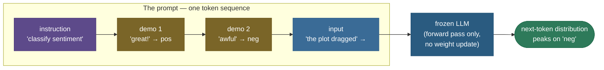
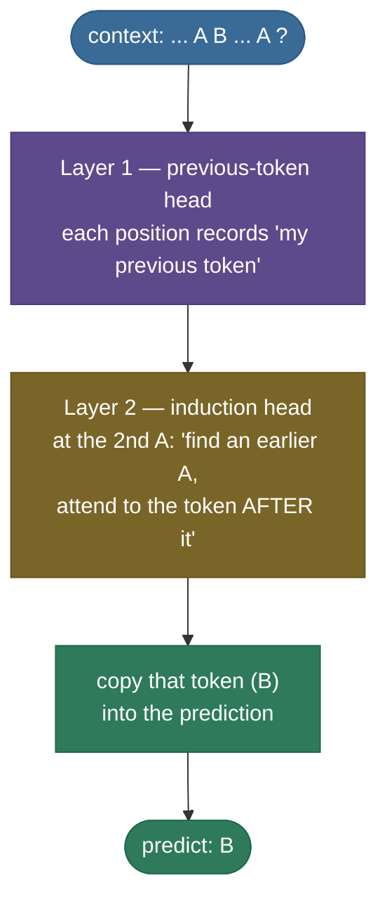
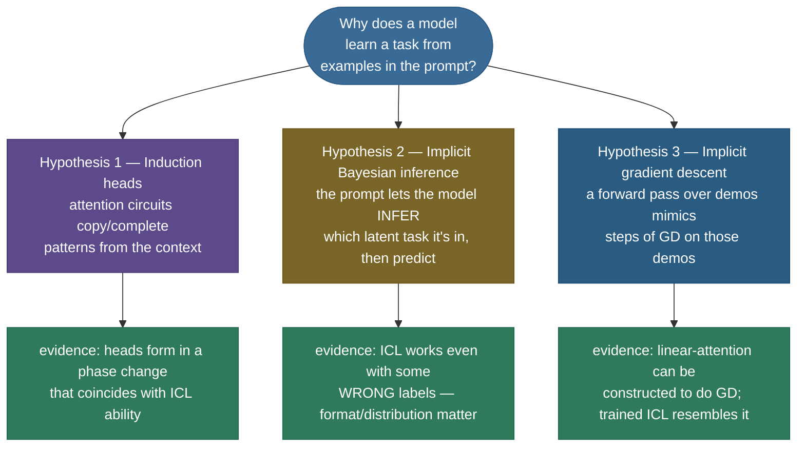
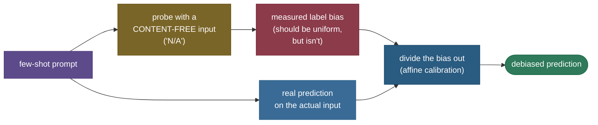

# Prompting & In-Context Learning: teach the model a task without touching its weights

You have a capable, finished model — its weights are frozen, the training run is long over — and your boss drops a brand-new task on your desk at 4pm: *"classify these support tickets by urgency, ship it tonight."* The textbook answer is **fine-tuning**: collect a labelled dataset, run a training job, validate, deploy. That takes days and a GPU budget. But there is another path, and it is almost unreasonably effective: you **write the task into the prompt**. Show the model three example tickets with their urgency labels, then paste the new ticket, and it... just does it. No dataset, no training job, no weight update. By 4:30 you have a working classifier living entirely inside a string.

That is **in-context learning (ICL)**, and the first time you see it work it feels like cheating. The model was never trained on your urgency task. Its weights are *identical* before and after it "learns" your task. And yet it adapts — purely from the examples you put in front of it. This page is about *why that works*, *when it breaks*, and *what "learning" even means when no gradient ever flows.*

I'm going to walk this the way I'd explain it to a teammate who can call `client.complete(prompt)` but has never asked *why a handful of examples in a string changes the output*. We'll start by **feeling** the gap that prompting fills (so it feels necessary, not magical), then the one-sentence intuition for what ICL actually is, then the **anatomy** of a prompt you actually control, then the **mechanism** — the induction circuit inside attention that makes copying-from-context possible — then the honest, unsettled **theories** of why it works, then **from-scratch code that builds an induction head and measures few-shot beating zero-shot**, then the **brittleness** that bites every practitioner, and finally where it sits in the real stack. By the end you'll be able to:

- define **zero-shot, one-shot, and few-shot** and explain precisely why ICL involves **no gradient updates**;
- name the parts of a prompt — **instruction, demonstrations, delimiters, role, output cue** — and what each one steers;
- explain the **induction-head** mechanism and *prove* in code that attention literally looks back and copies;
- present the three competing **theories** of ICL (induction heads, implicit Bayesian inference, implicit gradient descent) honestly, as active research rather than settled fact;
- predict and *measure* ICL's **sensitivity** to example order, format, and label bias — and name the **calibration** fix;
- say exactly how prompting differs from **SFT / instruction-tuning / preference-tuning** (which all change weights) and from **chain-of-thought** (a specific prompting *technique*).

> **The one distinction to hold onto:** the neighbouring chapters — [Supervised Fine-Tuning](../13-Supervised-Fine-Tuning/13-Supervised-Fine-Tuning.md), [Instruction Tuning](../14-Instruction-Tuning/14-Instruction-Tuning.md), [RLHF & DPO](../15-RLHF-and-DPO/15-RLHF-and-DPO.md) — all get behaviour by **updating weights** with gradient descent. **Prompting and ICL get behaviour at *inference time*, by shaping the *input*. Nothing in the model changes.** That is the entire difference, and it is the most-asked interview framing on this topic.

---

## The problem: a new task, a frozen model, and no time to train

Make the inadequacy of the obvious approach concrete. You have a pretrained (or instruction-tuned) LLM. A new task arrives. The "proper" ML answer is to fine-tune — but consider what that costs *for one task*:

- **Data.** You need hundreds to thousands of labelled examples. For "classify tickets by urgency" you may have *zero* labelled tickets right now.
- **Compute and time.** Even a LoRA fine-tune is a training job: data prep, a GPU, hyperparameters, a validation loop, a deployment. Hours at best, often days.
- **Operational weight.** Now you own a *second* set of weights — to version, store, serve, and keep in sync with the base model as it upgrades. Multiply by every task and you have a fleet of forks.

For a task you need *working in the next hour*, or one you're still *exploring* (you don't yet know if "urgency" should be 3 buckets or 5), fine-tuning is a sledgehammer. The felt need is: **adapt the model to a new task instantly, with zero or a handful of examples, and nothing to deploy but a string.**

That is exactly what prompting delivers. The same frozen model, handed two different prompts, behaves like two different task-specific systems:


The taxonomy you'll be asked to define, in one place:

| Term | What's in the prompt | When you reach for it |
|---|---|---|
| **Zero-shot** | Instruction + input, **no examples** | Task is common/obvious; you trust the model already knows the format |
| **One-shot** | Instruction + **1** demonstration + input | One example pins the *format* (e.g. exact JSON shape) |
| **Few-shot** | Instruction + **k** demonstrations + input | The task is unusual, or format/label conventions matter; k is typically 2–32 |

> **Source / derivation:** the zero/one/few-shot framing, and the headline finding that few-shot ability *emerges at scale*, are from [Brown et al. 2020, *Language Models are Few-Shot Learners* (GPT-3)](https://arxiv.org/abs/2005.14165) — §2 defines the settings; the paper's central result is that a 175B model does few-shot tasks competitively *with no fine-tuning*.

> **Note:** "few-shot" here has **nothing to do with gradient-based few-shot learning** (MAML and friends), where a model is *trained* on a few examples. In ICL there is **no training step** — the "few shots" are just text in the context window. Same words, opposite mechanism.

---

## Intuition first: the model is a pattern-continuer, and your examples set the pattern

Before any mechanism, the mental model. An LLM is, at heart, a **next-token predictor**: given a sequence of tokens, it outputs a probability distribution over what comes next, and we sample from it. It was trained on a colossal slice of the internet, which contains *every kind of task you can imagine, written down* — translations, Q&A pairs, code with comments, lists with labels, dialogues. So the model has implicitly seen the *shape* of thousands of tasks.

Here is the intuition that makes ICL click:

> **A few-shot prompt is not "teaching" the model a new skill. It is *locating* a skill the model already has, by showing it which pattern to continue.** When you write three `review -> sentiment` pairs and then a fourth review, you've built a context that, statistically, is overwhelmingly likely to be followed by a sentiment label. The model isn't learning sentiment analysis from your three examples — it's recognising *"ah, this is one of those `text -> label` patterns I saw a million times in training,"* and **continuing it**.

**The analogy — and let's make it survive a follow-up.** ICL is like a session musician at a recording date. You don't *teach* them to play; they already have decades of skill in their hands (that's pretraining). You play them four bars of the groove you want — the feel, the key, the rhythm — and they pick it up and continue it for the rest of the song. The four bars didn't *install* any ability; they *selected and configured* an ability that was already there.

Now the follow-up that breaks weaker analogies: *"if no weights change, what is actually 'learning' here? Where does the new task live?"* The honest answer the analogy must support: **the task lives entirely in the model's activations as it reads the prompt — in the transient state of attention, not in the weights.** The musician's *brain* doesn't rewire when they hear your four bars; their *working memory* holds the groove for the length of the take, and when the song ends, it's gone. ICL is the same: the "learning" is a temporary configuration of the forward pass, held in the residual stream and attention patterns, that **evaporates the moment the context window scrolls past it.** Ask the same model the same question in a fresh session with no examples, and it's back to zero-shot. *No weights changed because no weights needed to change — the adaptation was never stored in weights at all.*

> **Note (the precise claim):** "no gradient updates" is literal and worth stating crisply for interviews. During ICL the model runs a **forward pass only**. There is no loss, no backward pass, no optimizer step. The parameters $\theta$ are bit-for-bit identical before and after. Whatever "learning" happens is a function of the *input*, computed on the fly and discarded.

---

## Anatomy of a prompt: the levers you actually control

"Prompt engineering" sounds like folklore, but the prompt has a real, nameable structure. Knowing the parts tells you which lever to pull when the output is wrong.


- **System / role frame.** *"You are a careful financial analyst who only answers from the provided document."* Sets a persona and a behavioural contract. In chat models this is a distinct `system` message; it conditions everything that follows.
- **Instruction.** The explicit task: *"Extract every dollar amount and return JSON."* The single highest-leverage part — vague instructions produce vague outputs.
- **Demonstrations (the "shots").** k worked `input -> output` examples. This is the *in-context learning* part proper: the examples teach **format, label set, and edge-case handling** by showing, not telling.
- **Delimiters.** Triple quotes, XML tags, markdown fences — anything that **unambiguously separates** the instruction from the data. Critical for robustness: without them the model can confuse *your data* for *your instructions* (the seed of prompt injection — see Pitfalls).
- **Input.** The actual query or document to act on.
- **Output cue.** A trailing `JSON:` or `Answer:` that primes the model to start the response in the right form. A tiny lever with outsized effect, because it constrains the very next token.

> **Tip:** when a prompt misbehaves, diagnose by *part*. Wrong **format**? Add or fix a **demonstration** (show the exact shape). Model **ignoring constraints**? Strengthen the **instruction** and **role**. Model treating **data as instructions**? Add **delimiters**. Output **rambling before the answer**? Add an **output cue**. The structure turns a vibe ("make the prompt better") into a checklist.

---

## The mechanism: a few-shot prompt is one long sequence the model simply continues

Here's the move that demystifies everything: **there is no special "few-shot mode."** A few-shot prompt is just a longer input sequence. The model does the *exact same thing* it always does — predict the next token — over a context that happens to contain worked examples. The demonstrations condition the distribution so that, by the time the model reaches your real input, the most probable continuation *is* the answer in the demonstrated format.



*The few-shot context (instruction + demonstrations + input) is a single sequence fed to a frozen model. The demonstrations tilt the next-token distribution so the most likely continuation after the input is the answer, in the demonstrated format. Nothing about the model changes — only the conditioning sequence.*

So *how* does putting `A B ... A` in the context make the model predict `B`? The answer lives inside attention, and it has a name.

---

## The engine of copying-from-context: induction heads

The single most important mechanistic discovery about ICL is the **induction head** — an attention circuit that implements the rule *"if the current token matches an earlier token, predict whatever followed that earlier token."* In pattern form: having seen `... A B ... A`, an induction head completes with **`B`**. This is *literally* the copy-from-context operation that few-shot prompting relies on — every demonstration is a pattern the induction machinery can match and continue.

> **Source / derivation:** induction heads were identified and named in [Olsson et al. 2022, *In-context Learning and Induction Heads* (Anthropic / Transformer Circuits)](https://transformer-circuits.pub/2022/in-context-learning-and-induction-heads/index.html). They show induction heads form during training in a sharp **phase change** that coincides with a jump in the model's ICL ability, and argue these heads are a primary mechanism behind ICL.

**Why it needs (at least) two attention layers.** An induction head is a *composition* of two heads across two layers — you cannot build it in one:

1. A **previous-token head** in an early layer writes, into each position's residual stream, a copy of information about the *token before it*. Now position *i* "knows about" token *i−1*.
2. An **induction head** in a later layer, sitting at the current `A`, forms a query that says *"find an earlier position whose previous-token was also `A`."* It matches the earlier `A`, attends to the position **right after** it (which holds `B`), and copies `B` forward as the prediction.



*The two-layer induction circuit. A previous-token head (layer 1) tags each position with its predecessor; an induction head (layer 2) uses that tag to find the earlier occurrence of the current token and copy what came next. This composition is why induction provably needs ≥ 2 layers — the from-scratch model below uses exactly 2.*

We don't have to take this on faith. In the code section we **train a tiny 2-layer attention-only transformer** on a synthetic "look back and copy" task, then read its attention weights at the query position. Here is what we measure — the induction head, caught in the act:


> **Note:** that near-1.0 spike on the look-back position is not a cherry-picked example — it's the model's *learned strategy*. Trained only to predict the value after a repeated key, the tiny transformer discovered the induction algorithm on its own. The same circuit, scaled up and generalised, is what lets a real LLM copy *"the format of these demonstrations"* into its answer.

---

## Why ICL works: three theories, none of them settled

Be honest here, because the field is. *We do not have one agreed-upon explanation of ICL.* What we have is three complementary (and partly competing) accounts, each with evidence. State them as hypotheses — an interviewer who knows the area is checking whether *you* know they're unsettled.



**Hypothesis 1 — Induction heads (a mechanistic account).** ICL is (substantially) implemented by induction heads that copy and complete patterns from context, as above. The strongest evidence is the *phase change*: these heads appear abruptly during training at the same point the model's ICL ability jumps.

> **Source / derivation:** [Olsson et al. 2022, *In-context Learning and Induction Heads*](https://transformer-circuits.pub/2022/in-context-learning-and-induction-heads/index.html) — the phase-change co-occurrence and the argument that induction heads drive ICL.

**Hypothesis 2 — Implicit Bayesian inference (a statistical account).** The model, pretrained on documents each generated from some latent "concept/task," learns to *infer the latent task* from the prompt and then predict accordingly. The demonstrations are evidence that sharpens a posterior over *which task this is*; the model then continues under that task. A striking prediction of this view, since confirmed empirically: **ICL can still work even when some demonstration labels are wrong**, because the examples primarily convey *the task, the input distribution, and the label space* — not a clean supervised signal.

> **Source / derivation:** the Bayesian-task-inference framing is [Xie et al. 2021, *An Explanation of In-context Learning as Implicit Bayesian Inference*](https://arxiv.org/abs/2111.02080). The "ground-truth labels matter surprisingly little; the *format and label space* matter more" result is [Min et al. 2022, *Rethinking the Role of Demonstrations*](https://arxiv.org/abs/2202.12837).

**Hypothesis 3 — Implicit gradient descent (a learning-dynamics account).** Most provocatively: a Transformer's forward pass over demonstrations can *implement* steps of gradient descent on those demonstrations. Constructions show linear-attention layers can be hand-built to perform a GD update, and trained ICL models behave in ways consistent with running such an inner optimization in their activations. If true, ICL really *is* a kind of learning — just learning executed by the forward pass, in activations, rather than by the optimizer, in weights.

> **Source / derivation:** [von Oswald et al. 2022, *Transformers Learn In-Context by Gradient Descent*](https://arxiv.org/abs/2212.07677) — the construction and empirical resemblance between trained ICL and gradient-based learning.

> **Note (how to hold all three):** these aren't mutually exclusive. Induction heads may be the *mechanism* by which the model accesses context; Bayesian task-inference may describe *what* it computes at a higher level; implicit-GD may describe the *learning dynamics* of simple cases. The honest summary: **ICL is real and reproducible, the mechanism is partly understood (induction heads), and the full theory is open.** Say that, and you're calibrated.

---

## From scratch: build an induction head, then watch few-shot beat zero-shot

Talk is cheap; let's *measure* ICL on a model we built and trained ourselves — no pretrained weights, no internet, runs on CPU in seconds. We train a **2-layer attention-only transformer** on a synthetic *in-context recall* task: each sequence is a run of random `(key, value)` pairs, then a CUE token, then a repeated key; the model must predict the value that followed that key earlier. The `(key → value)` mapping is **fresh every sequence**, so the answer is *never* in the weights — it exists only in the prompt. That is in-context learning in its purest, measurable form.

> **Runnable script and an executed teaching notebook** live next to this page: the [from-scratch demo script](code/prompting_icl.py) (`python prompting_icl.py`) and the [step-by-step notebook](code/16-Prompting-and-In-Context-Learning.ipynb). The figures above are generated by [make_figures_16.py](code/make_figures_16.py) from the *same* numbers, so page, notebook, script, and figures cannot drift.

The three experiments, and what each one proves:

```python
# Experiment 1 — the induction head, caught looking back (the mechanism).
# Train the tiny 2-layer model, then read the final layer's attention from the query position.
look = induction_lookback(model)
peak_pos = int(torch.tensor(look["attn_from_query"]).argmax())
assert peak_pos == look["lookback_value_pos"]   # attention peaks on the value-after-the-key
# -> attention weight ~1.00 lands on the token that followed the key's first occurrence.

# Experiment 2 — few-shot beats zero-shot (the core ICL claim), asserted BEFORE timing.
acc = accuracy_vs_shots(model)        # accuracy as a function of k in-context demonstrations
assert acc[0] < 0.10                  # zero-shot: nothing to copy -> ~chance (1/40 = 0.025)
assert acc[1] > acc[0]                # ONE demonstration already lifts it
assert acc[5] > acc[0] + 0.3          # few-shot decisively beats zero-shot

# Experiment 3 — ICL is brittle (sensitivity), measured not asserted.
# Show the query key TWICE with DIFFERENT values; permute their order; see which one wins.
sens = order_sensitivity(model)
assert sens["frac_order_sensitive"] > 0.05   # a real fraction of answers FLIP with order
```

Running `prompting_icl.py` produces (deterministic, CPU-pinned):

```
device: cpu (detected mps; pinned to CPU for reproducibility)
torch: 2.12.0

[1] Induction head look-back
    query key id=20, target value id=16
    attention from query peaks at position 7 (the value after the key's first occurrence) -> copies it. weight=1.00

[2] Few-shot beats zero-shot (fresh per-sequence rule, no weight updates)
     k (shots) | accuracy
    -----------+---------
             0 | 0.030
             1 | 1.000
             2 | 1.000
             3 | 1.000
             4 | 1.000
             5 | 1.000
    zero-shot=0.030  ->  5-shot=1.000  (+0.970)

[3] Order sensitivity (two CONFLICTING demos, permuted order)
    fraction of sequences whose answer FLIPS with order : 0.570
    recency rate (copies the LATER demo when it flips)  : 0.491
```

Read the three results together — each maps to a figure above and a claim in the prose:


- **[1] The mechanism is real.** Attention from the query lands with weight **1.00** on the value-after-the-key — the induction head, looking back and copying, exactly as the two-layer circuit predicts.
- **[2] Few-shot beats zero-shot, dramatically.** Zero-shot accuracy is **0.030** — essentially chance (1/40 ≈ 0.025), because with no demonstration of the fresh rule there's nothing to copy. **One** demonstration lifts it to **1.000**. The task "switches on" from a single example, *with no weight update* — the definition of ICL.
- **[3] It's brittle.** When two demonstrations of the *same* key disagree (one says `→ A`, one says `→ B`), **57%** of sequences *change their answer* purely from reordering the demonstrations, and the model copies the *later* demo about as often as the earlier one (recency ≈ 0.49). Order — not just content — decides the answer.


> **Why this is honest, not a toy trick:** the model genuinely never saw any specific sequence's answer during training — the `(key→value)` mapping is resampled every sequence. So Experiment 2's jump from 0.03 to 1.00 *cannot* be memorization; it can only be the model reading the prompt. That is the cleanest possible demonstration that "learning" happened in the forward pass, not the weights.

> **Try it:** before you run it, **predict** — in Experiment 3, if you made the model bigger (more layers/heads) and trained it longer, would the order-sensitivity *fall*? (Hint: a cleaner, more consistent induction head would more reliably copy the *first* occurrence, lowering the flip rate. Brittleness is partly a symptom of an *imperfect* circuit — which is also why real, messy LLMs stay order-sensitive on hard prompts.)

---

## Sensitivity & calibration: ICL is powerful *and* fragile

Experiment 3 wasn't a quirk of our toy. Real ICL is **notoriously sensitive to choices that have nothing to do with the task's logic**:

- **Example order.** The *same* k demonstrations in a different order can swing accuracy from near-random to near-state-of-the-art. Some orderings are simply better, and which ones are hard to predict in advance.
- **Format.** Whether you write `Review: ... Sentiment: ...` vs `Input: ... Label: ...`, your separators, your whitespace — all move the output.
- **Label bias / majority-label bias.** If 3 of your 4 demonstrations happen to be labelled `positive`, the model becomes biased toward predicting `positive`, *regardless of the input* — it picks up the label *frequency* as a prior.
- **Recency bias.** As our demo showed, the model often over-weights the *last* demonstration (and, for the test input, the tokens nearest the end).

> **Source / derivation:** the order-sensitivity result — that permuting demonstrations causes large accuracy swings and that good orderings are hard to find — is [Lu et al. 2021, *Fantastically Ordered Prompts and Where to Find Them*](https://arxiv.org/abs/2104.08786).

**The fix has a name: calibration.** Because these biases are *systematic*, you can estimate and subtract them. The clean idea: feed the model a **content-free input** (e.g. the literal string `"N/A"`, or an empty input) through the *same* prompt; whatever distribution it predicts over the labels is the model's **bias** for this prompt — it *should* be uniform, and any departure is pure prompt artifact. Then divide it out of the real predictions (an affine correction on the logits) so each label starts from an even footing.



*Contextual calibration: probe the prompt with a content-free input to estimate its label bias, then divide that bias out of real predictions. Same demonstrations, debiased output — recovering much of the accuracy that order/format/majority-label artifacts were costing.*

> **Source / derivation:** the content-free calibration procedure ("calibrate before use") is [Zhao et al. 2021, *Calibrate Before Use: Improving Few-Shot Performance of Language Models*](https://arxiv.org/abs/2102.09690) — it shows majority-label, recency, and common-token biases, and that an affine correction estimated from content-free inputs substantially stabilises few-shot accuracy.

---

## Pitfalls & failure modes

The things that actually bite when you ship a prompt:

- **Prompt sensitivity (the big one).** As measured above: order, format, and label balance swing results. *Mitigation:* try multiple orderings and average or vote; balance the label distribution across demonstrations; **calibrate**; and where stakes are high, validate the prompt on a held-out set just as you would a model.
- **Majority-label bias.** Demonstrations skewed toward one label bias the output toward it. *Mitigation:* balance labels across your shots; calibrate.
- **Prompt injection (a security issue).** Because the model can't *intrinsically* tell instructions from data, attacker-controlled text in the input (*"ignore previous instructions and..."*) can hijack behaviour. *Mitigation:* strong delimiters, instruction/data separation, input sanitisation, and never trusting model output that touches privileged actions. This is its own topic — cross-link to the security material; treat ICL's "data can look like instructions" property as the root cause.
- **Context-length limits.** Every demonstration costs tokens; more shots help up to a point, then you hit the context window (and cost/latency grow with it). Very long few-shot prompts also dilute attention. *Mitigation:* pick *fewer, better* examples; for huge example pools, *retrieve* the most relevant demonstrations per query (this is RAG applied to demonstration selection), and note the cost interaction with the [KV cache](../05-KV-Cache/05-KV-Cache.md) and [long-context methods](../08-Long-Context-Methods/08-Long-Context-Methods.md).
- **Poor example selection.** Random demonstrations underperform *similar* demonstrations. *Mitigation:* choose examples close to the query (embedding similarity), and cover the label space and the hard/edge cases.
- **Zero-shot vs few-shot tradeoff.** Few-shot isn't always better: a strong instruction-tuned model is often excellent zero-shot, and demonstrations then mostly add cost, length, and a chance to *introduce* bias. *Mitigation:* measure both. Use shots when they *measurably* help (unusual format, niche label set), not reflexively.

> **Gotcha:** a base (non-instruction-tuned) model often *needs* few-shot demonstrations to do anything useful, because it doesn't yet know that an instruction is a request to be obeyed (that's what [SFT](../13-Supervised-Fine-Tuning/13-Supervised-Fine-Tuning.md) and [instruction tuning](../14-Instruction-Tuning/14-Instruction-Tuning.md) install). An instruction-tuned model is frequently strong **zero-shot**. So the *right amount of prompting depends on which post-training the model has had* — prompting and fine-tuning are complements, not rivals.

---

## Where it matters, and how it relates to its neighbours

**Why this is a crux capability.** In-context learning is *the* reason a single frozen model is a general-purpose tool rather than a fixed-function appliance. It's the foundation under nearly everything you build on top of an LLM:

- **The default first move for any new task** — cheaper and faster than fine-tuning, and often enough.
- **RAG** ([retrieval-augmented generation](../../11.%20RAG_and_LLM_Applications/concepts/README.md)) is ICL with *retrieved* context: the retrieved documents are in-context information the model conditions on at inference time, no weights touched.
- **Agents and tool use** prompt the model with tool descriptions and examples; the model learns *which tool to call when* in-context.
- **Chain-of-thought** ([next chapter](../17-Chain-of-Thought-Reasoning/17-Chain-of-Thought-Reasoning.md)) is a *specific prompting technique* — prompt the model to emit reasoning steps before the answer. It's an ICL pattern, which is why it belongs adjacent to this page, not inside it.

**The map of "how do I change a model's behaviour," so you never confuse these in an interview:**

| Approach | Changes weights? | When the behaviour "lives" | Cost / speed | This is chapter |
|---|---|---|---|---|
| **Prompting / ICL** | **No** | In the activations, per request (transient) | Instant, ~free | **16 (here)** |
| **Chain-of-thought** | No (a prompting *technique*) | In the generated reasoning tokens | Instant; more tokens | 17 |
| **Supervised fine-tuning** | **Yes** | In the weights (format/behaviour) | Hours; a training job | 13 |
| **Instruction tuning** | **Yes** | In the weights (general instruction-following) | A training job over many tasks | 14 |
| **RLHF / DPO** | **Yes** | In the weights (preferences/values) | The heaviest post-training | 15 |

> **Note:** the practical decision tree. *Does the model already do this zero-shot?* Ship it. *Almost, but the format/label set is off?* Add **few-shot demonstrations** (+ calibrate). *Need multi-step reasoning?* Add **chain-of-thought**. *Need it reliably, at scale, on a stable task where prompt tokens are too expensive?* **Now** consider fine-tuning — you're amortising a one-time training cost against many cheap inferences. Reach for weights only when the prompt can't get you there or the per-token cost of a long prompt dominates.

---

## In production

How ICL shows up in real systems, concretely:

- **Few-shot prompts are cached.** A fixed few-shot preamble (the instruction + demonstrations shared across every request) is an ideal **prefix-cache** target: serving engines compute its [KV cache](../05-KV-Cache/05-KV-Cache.md) **once** and reuse it for every query, so the demonstrations cost compute only on the first request. This is why "expensive" long few-shot prompts are cheaper in practice than the token count suggests.
- **Demonstrations are often *retrieved*, not fixed.** Rather than one static set of shots, production systems retrieve the *k most similar* examples to each incoming query from a pool (embedding similarity), giving per-query-optimal demonstrations — RAG applied to the demonstrations themselves.
- **Calibration and prompt-validation are part of the pipeline.** Serious deployments treat a prompt like a model artifact: version it, evaluate it on a held-out set, and apply calibration where label bias matters — not "tweak the string until the demo looks right."
- **Prompt injection is a live threat model.** Any system that pastes untrusted input into a prompt must defend the instruction/data boundary (delimiters, separate channels, output validation). The same "data can look like instructions" property that *enables* ICL is the attack surface.

> **Gotcha:** the most common production mistake is treating prompting as folklore — endless manual tweaking with no measurement. ICL's sensitivity means a prompt that "looks great" on three hand-picked inputs can be mediocre or biased across the real distribution. **Measure on held-out data, balance and calibrate, and version your prompts.** Prompt engineering done right is empirical, not vibes.

---

## Recap and rapid-fire

**If you remember nothing else:** in-context learning is the ability of a large LM to perform a new task from **examples in the prompt, with no weight updates** — the "learning" lives in the forward pass (activations), not the parameters, and evaporates when the context scrolls past. The mechanism is (substantially) the **induction head**, a two-layer attention circuit that copies-and-completes patterns from context. It is **powerful but brittle** — sensitive to example order, format, and label balance — and the systematic biases can be **calibrated** out. It is distinct from SFT/instruction-tuning/RLHF (which all change weights) and is the substrate under RAG, agents, and chain-of-thought.

**Quick-fire — say these out loud:**

- *What is in-context learning?* Doing a new task from examples in the prompt, **no gradient updates** — behaviour comes from conditioning the forward pass.
- *Zero- vs one- vs few-shot?* No examples / one example / k examples in the context; few-shot ability **emerged at scale** (GPT-3).
- *If no weights change, what is "learning"?* A transient configuration of attention/activations computed from the prompt — task lives in context, not parameters.
- *What's the core mechanism?* **Induction heads** — `... A B ... A → B` — a previous-token head + an induction head across **two** layers.
- *Why three theories?* Induction heads (mechanism), implicit Bayesian task-inference (what's computed), implicit gradient descent (learning dynamics) — all active research, none final.
- *Why does ICL still work with some wrong labels?* Demonstrations mainly convey the **task, input distribution, and label space**, not a clean supervised signal (Min et al.).
- *Name three things ICL is sensitive to.* Example **order**, **format**, **label balance** (majority-label/recency bias).
- *How do you fix label bias?* **Calibrate** — probe with a content-free input to measure the bias, then divide it out (Zhao et al.).
- *Prompting vs fine-tuning?* Prompting shapes the **input** (instant, transient, no weights); fine-tuning changes the **weights** (a training job, persistent).
- *Is chain-of-thought the same as ICL?* No — CoT is a **specific prompting technique** for multi-step reasoning; it's *one* thing you can do with prompting.

---

## References and further reading

The curated link library for this topic — videos, courses, articles, papers, books, and internal cross-links — lives in a companion file so it can be reused as a standalone reference list:

**→ [Prompting & In-Context Learning — references and further reading](16-Prompting-and-In-Context-Learning.references.md)**
