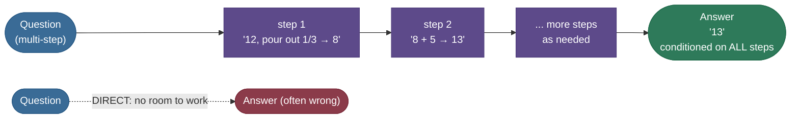
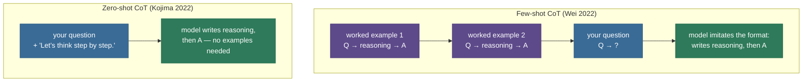
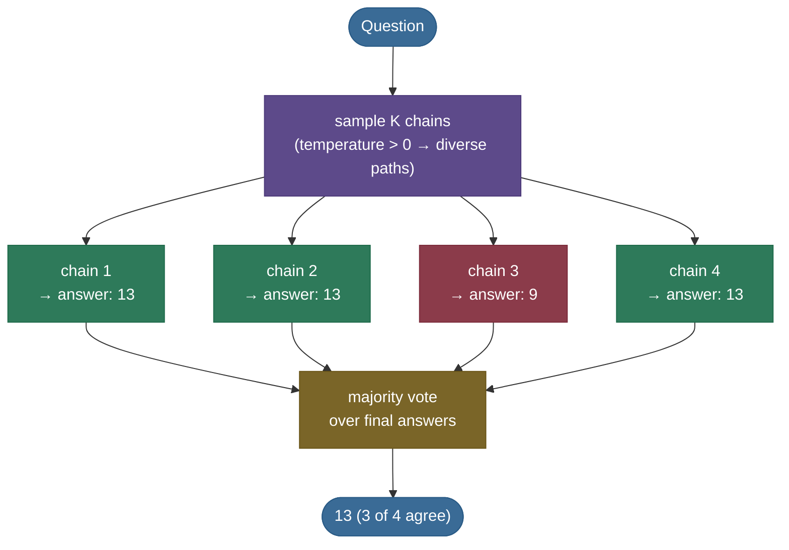
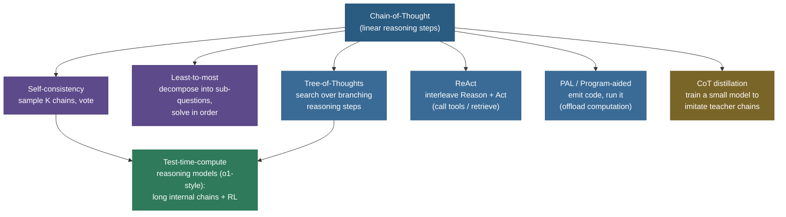
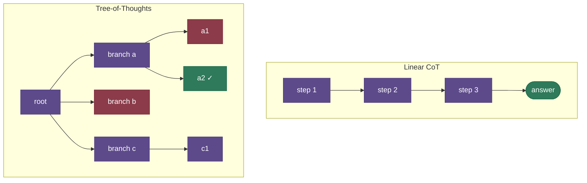

# Chain-of-Thought: make the model show its work

Give a person a multi-step word problem — *"a jug holds 12 cups; pour out a third, then add 5; how many cups now?"* — and demand a single number with no working, instantly. Many people blurt the wrong one. Not because they *can't* do it, but because you gave them no room to do it: pouring out a third (4 cups, leaving 8) and then adding 5 (to get 13) are two separate steps, and you asked for the answer before either could happen. Force the steps out loud — "12, minus 4, is 8; plus 5 is 13" — and the same person gets it right. **Chain-of-Thought (CoT)** is exactly this for a language model: instead of forcing it to emit the answer immediately, you let it generate the *intermediate reasoning steps first*, and the answer it then produces is dramatically more often correct.

That is the entire idea, and it is almost embarrassingly simple — you don't retrain anything, you don't change a single weight, you just change the **prompt** so the model writes its reasoning before its answer. Yet on grade-school math (GSM8K), the same 540B model jumps from blurting **~18%** correct to **~57%** correct purely by being asked to think step by step. This page is about *why* that works, when it works (and when it backfires), and the family of techniques built on top of it — self-consistency, tree-of-thoughts, program-aided reasoning — that lead straight to today's o1-style "reasoning models."

> **Source / derivation:** the headline PaLM-540B GSM8K jump (standard ~18% → CoT ~57%) is from [Wei et al., *Chain-of-Thought Prompting Elicits Reasoning in LLMs* (2022)](https://arxiv.org/abs/2201.11903) and Google's summary [*Language Models Perform Reasoning via Chain of Thought*](https://research.google/blog/language-models-perform-reasoning-via-chain-of-thought/) (which reports CoT at 58%, surpassing the prior 55% state of the art).

By the end you'll be able to:

- explain **what CoT is** and the two ways to invoke it — **few-shot CoT** (worked examples in the prompt) and **zero-shot CoT** ("Let's think step by step");
- explain **why emitting reasoning tokens helps** even though the weights never change — the serial-compute and decomposition arguments;
- explain **self-consistency** (sample many chains, majority-vote) and *why* voting beats a single chain;
- place the landscape — **least-to-most, tree-of-thoughts, ReAct, program-aided** — and how it leads to **test-time-compute reasoning models**;
- name the real pitfalls: **emergence at scale** (CoT can *hurt* small models), **unfaithful reasoning**, latency cost, and prompt sensitivity;
- **measure** CoT's benefit from scratch in runnable code (the decomposition win and the voting win), with the numbers reproduced on the page, in the notebook, and in the figures.

> **Note:** CoT is a *specific* technique — eliciting intermediate **reasoning steps** for multi-step problems. It lives inside the broader topic of **[Prompting & In-Context Learning](../16-Prompting-and-In-Context-Learning/16-Prompting-and-In-Context-Learning.md)** (the general art of conditioning a frozen model at inference time): CoT is *one* prompting technique among many. And the trick of compressing a teacher's reasoning into a smaller model is **CoT distillation**, covered under **[Knowledge Distillation](../11-Knowledge-Distillation/11-Knowledge-Distillation.md)** — we point there rather than absorb it. This page is just about the reasoning-step technique itself.

---

## The problem: a multi-step question, answered in one breath

Autoregressive LLMs generate one token at a time, each conditioned on what came before. When you ask for *the answer* directly, the model must compress an entire multi-step computation into the very first answer token it emits — there is no scratch space, no intermediate state, nowhere to "carry the 8." For a one-step fact ("capital of France?") that's fine. For anything compositional — a two-operation arithmetic problem, a multi-hop question ("the director of the highest-grossing 1997 film was born in what country?"), a logic puzzle — it's like being asked to multiply two three-digit numbers in your head and shout the result with no pencil.

Here's the felt version, the same problem the model gets wrong directly and right with steps:


The crucial observation — and the one that makes the whole technique make sense — is that **the model usually *has* the capability; it just has no room to use it.** The 540B model knows that "a third of 12 is 4" and that "8 plus 5 is 13." What it lacks, when forced to answer immediately, is a place to put those intermediate results so the next step can build on them. CoT gives it that place: the model's own output stream.

> **Source / derivation:** that CoT helps *multi-step* problems specifically (arithmetic, commonsense, symbolic reasoning) while doing little for single-step tasks is the central empirical finding of [Wei et al. (2022), §3–5](https://arxiv.org/abs/2201.11903).

---

## Intuition first: the model thinks *in* its output

Before any mechanism, the mental model. Here is the analogy, and it is precise:

> A transformer doing CoT is a **student working a problem on scratch paper, where the scratch paper and the exam answer are the same sheet** — and the only way the student can use a previous line of working is to have *written it down*. The student's "short-term memory" is exactly the text already on the page. Write nothing, and every step must happen in one mental flash. Write the steps, and each new line can read every line above it.

This analogy has to survive an obvious follow-up, the one a sharp interviewer always asks:

> **"Why would emitting *words* help? You didn't change a single weight — the model is exactly as smart as it was. How does typing 'first, 12 minus 4 is 8' make it better at arithmetic?"**

Two answers, and you should be able to give both. First, **serial compute**: a transformer does a *fixed* amount of computation per token (a fixed number of layers). To produce an answer in one token, all the reasoning must fit in that single fixed-depth forward pass. By emitting intermediate tokens, the model gets to run *more forward passes* — each new token is another full trip through all the layers — and, critically, **each pass can read the tokens already emitted**. Reasoning that doesn't fit in one fixed-depth pass *does* fit when spread across many. The model isn't smarter; it has been given **more serial steps to compute over, and a memory (its own output) to thread state through**.

Second, **decomposition / conditioning**: the final answer token is generated *conditioned on* the reasoning the model just wrote. A single hard joint prediction ("the answer is ___") is replaced by a sequence of easy local predictions, each of which constrains the next. By the time the model emits the answer, the hard work is already on the page in front of it, and the answer is nearly a lookup. We will *measure* both effects in code below.

> **Source / derivation:** the framing of CoT as "allocating more computation to harder problems" by spending intermediate tokens is stated directly in [Wei et al. (2022), §1](https://arxiv.org/abs/2201.11903); the formal result that emitting intermediate tokens strictly increases a transformer's expressive power (constant-depth transformers with a chain of $T$ steps can solve problems a single pass cannot) is [Feng et al., *Towards Revealing the Mystery behind Chain of Thought* (2023)](https://arxiv.org/abs/2305.15408) and [Merrill & Sabharwal, *The Expressive Power of Transformers with Chain of Thought* (2023)](https://arxiv.org/abs/2310.07923).

---

## The mechanism: condition the answer on self-generated steps

Mechanically, CoT changes what sits between the question and the answer in the token stream. Without CoT the model goes question → answer in one jump. With CoT it goes question → **reasoning steps** → answer, and because generation is autoregressive, every reasoning token becomes part of the context the answer is conditioned on.



*The answer token attends back over every reasoning token the model just generated — so the final prediction is conditioned on the model's own derived intermediate results, not squeezed into a single forward pass. The dotted path is the direct ("blurt") route the page opened with.*

There are two ways to make the model take the top path instead of the dotted one. They differ only in what you put in the prompt.

**Few-shot CoT** (Wei et al. 2022) — the original. You include a handful of **worked examples** in the prompt, each showing not just *question → answer* but *question → full reasoning chain → answer*. The model, doing in-context pattern-matching, imitates the format: it too writes a reasoning chain before answering.

**Zero-shot CoT** (Kojima et al. 2022) — the astonishing minimalist version. You add **no** examples. You simply append the phrase **"Let's think step by step."** after the question. That single sentence is enough to trigger the reasoning-then-answer behavior in a large model, lifting zero-shot accuracy on math benchmarks by a wide margin with essentially zero prompt engineering.



*Two ways to elicit a reasoning chain. Few-shot supplies worked demonstrations the model imitates; zero-shot supplies a single trigger phrase. Both produce the same reasoning-then-answer structure.*

> **Source / derivation:** few-shot CoT is [Wei et al. (2022)](https://arxiv.org/abs/2201.11903); zero-shot CoT and the exact trigger phrase "Let's think step by step" are from [Kojima et al., *Large Language Models are Zero-Shot Reasoners* (2022)](https://arxiv.org/abs/2205.11916), which reports the phrase lifting zero-shot GSM8K accuracy from ~17.7% to ~78.7% on the largest model tested (InstructGPT) and gives large gains across arithmetic/symbolic benchmarks.

---

## Why it works, honestly: serial compute, decomposition, and "it's partly empirical"

It's worth being honest about the epistemic status here. Part of *why* CoT works is well-understood, and part of it is "we observe this and have good-but-incomplete theory."

**The well-understood part.** A fixed-depth transformer is a *fixed-compute* function per token. Spreading a computation across $T$ generated tokens gives it up to $T\times$ the serial depth, with each step reading the prior steps — and there are problems (e.g. composing many modular operations, simulating a small automaton) that are provably out of reach for one pass but reachable with a chain. That is the [Feng et al.](https://arxiv.org/abs/2305.15408) / [Merrill & Sabharwal](https://arxiv.org/abs/2310.07923) result. The decomposition view is the same coin's other face: a sequence of locally-easy predictions beats one globally-hard one. **We will measure this exact effect in the code section.**

**The partly-empirical part.** *Why a particular phrase* triggers it, *why* it's so sharply **emergent at scale** (below), and *why* models often produce a correct chain for the right answer but sometimes a plausible-sounding chain that didn't actually drive the answer (**unfaithfulness**, in the pitfalls) — these are observed robustly but not fully derived from first principles. Good teaching here means *labeling* which is which, not pretending the whole thing is a theorem.

The most important empirical fact is that CoT is **emergent**: it helps *large* models and does little or nothing — sometimes *hurts* — for small ones.


> **Source / derivation:** that CoT yields gains only past roughly 100B parameters — and can *underperform* standard prompting for small models — is the emergent-ability finding of [Wei et al. (2022), §3.3 and Fig. 4](https://arxiv.org/abs/2201.11903) and Google's [research summary](https://research.google/blog/language-models-perform-reasoning-via-chain-of-thought/) ("the benefits of chain of thought prompting only materialize with a sufficient number of model parameters, around 100B"). The figure above is **illustrative** — it traces that qualitative shape with the two published 540B anchors; the small-model points are schematic.

---

## Self-consistency: sample many chains, take the majority vote

A single greedy reasoning chain has a failure mode: if the model takes one wrong turn early, the whole chain follows it off a cliff, and you get one confidently-wrong answer. **Self-consistency** (Wang et al. 2022) fixes this with a beautifully simple idea borrowed from how you'd trust a noisy panel of experts: **sample several *different* reasoning chains** (using temperature > 0 so they diverge), read off the final answer from each, and **take the answer that the most chains agree on** — the majority (plurality) vote.



*Self-consistency marginalizes over reasoning paths: many distinct chains may reach the same correct answer by different routes, while wrong chains tend to err in scattered, inconsistent ways. Voting amplifies the agreement and cancels the scattered errors.*

Why does voting help so much? Because **there are many correct reasoning paths to the same right answer but each wrong path tends to be wrong in its own scattered way.** The correct answer is the single most *consistent* outcome across diverse chains even when any one chain is unreliable — so as you sample more chains, the vote concentrates on it (the same statistical reason a noisy panel's majority beats any single member — a Condorcet-style effect). We can demonstrate this from first principles, with no LLM at all, and the curve is striking:


> **Source / derivation:** self-consistency — sample diverse chains, marginalize by majority-voting the final answers — is [Wang et al., *Self-Consistency Improves Chain-of-Thought Reasoning* (2022)](https://arxiv.org/abs/2203.11171), which reports it lifting **PaLM-540B GSM8K from 56.6% (greedy CoT) to 74.4%** (and similar double-digit gains on SVAMP, AQuA, ARC). The accuracy-vs-K curve above is **measured from this chapter's own simulation**, not from the paper — it reproduces the *mechanism* (voting concentrates on the consistent answer), and the exact numbers match the notebook and `chain_of_thought.py`.

> **Tip:** self-consistency trades **compute for accuracy** — K chains cost ~K× the tokens. It's the simplest member of a family ("best-of-N", verifier-reranking, weighted voting) that all spend extra inference compute to buy reliability, and it's a direct conceptual ancestor of the test-time-compute reasoning models below.

---

## The landscape: from a single chain to search and tools

CoT is the root of a fast-growing family. The unifying theme: **structure the model's intermediate computation** — make it longer, branch it, give it tools, or compress it.



*The CoT family tree. Self-consistency and least-to-most keep the linear chain but sample/decompose; Tree-of-Thoughts and ReAct change the chain's shape (search, tool calls); PAL offloads exact computation to code; distillation compresses chains into a smaller model. The frontier (o1-style) combines long internal chains with reinforcement learning on the reasoning itself.*

- **Least-to-most** ([Zhou et al. 2022](https://arxiv.org/abs/2205.10625)) — explicitly decompose the problem into a sequence of easier sub-questions, then solve them in order, each using the previous answers. Helps when the problem is harder than the few-shot examples.
- **Tree-of-Thoughts (ToT)** ([Yao et al. 2023](https://arxiv.org/abs/2305.10601)) — instead of one linear chain, **search** over a tree of partial reasoning steps: generate several candidate next-steps, evaluate them, and explore the promising branches (with backtracking). A linear chain is a single root-to-leaf path; ToT explores the whole tree.



*Linear CoT commits to one path; Tree-of-Thoughts generates and evaluates multiple branches, prunes dead ends (red), and searches for a winning leaf. More compute, better coverage of hard problems with many possible approaches.*

- **ReAct** ([Yao et al. 2022](https://arxiv.org/abs/2210.03629)) — interleave **Rea**soning with **Act**ions: the model reasons a step, then takes an action (search a knowledge base, call a tool, query an API), reads the result, and reasons further. This is the planning core of LLM agents — CoT that can *touch the world*.
- **PAL / Program-aided language models** ([Gao et al. 2022](https://arxiv.org/abs/2211.10435)) — let the model write the *reasoning* but offload the *computation* to a Python interpreter: it emits code, the code runs, and the exact result comes back. This sidesteps the fact that LLMs are unreliable arithmetic engines — the chain decides *what* to compute, the interpreter computes it *correctly*.
- **CoT distillation** — train a small model to imitate a large model's reasoning chains, transferring reasoning ability downward. This is a distillation technique; see **[Knowledge Distillation](../11-Knowledge-Distillation/11-Knowledge-Distillation.md)** for the mechanism (we deliberately don't duplicate it here).
- **Test-time-compute reasoning models (o1-style)** — the modern frontier. Rather than a few prompted steps, these models are *trained* (with reinforcement learning on their own reasoning) to produce **long internal chains of thought** before answering, and they get reliably better as you let them "think" for more tokens. CoT went from a prompting trick to a *trained capability* and a *compute dial*.


> **Source / derivation:** that scaling **test-time (inference) compute** — longer reasoning chains, more samples — improves accuracy with diminishing returns is documented for reasoning models; an accessible primer is OpenAI's [*Learning to Reason with LLMs* (o1)](https://openai.com/index/learning-to-reason-with-llms/) and the analysis in [Snell et al., *Scaling LLM Test-Time Compute Optimally* (2024)](https://arxiv.org/abs/2408.03314). The curve above is **illustrative** — it traces that qualitative diminishing-returns shape, not specific reported values.

---

## Code: measure both wins from scratch (no LLM needed)

You don't need a billion-parameter model to *see* why CoT works — you need to model the *structure* of multi-step reasoning. The two demos below do exactly that with pure numpy, deterministically, and **assert the qualitative result before reporting anything**. The numbers here are the same ones on this page and in the figures.

> **Runnable project and a step-by-step notebook:** the verified code lives as a clean script and an executed teaching notebook next to this page — see the [step-by-step teaching notebook](code/17-Chain-of-Thought-Reasoning.ipynb) and the [runnable demo script](code/chain_of_thought.py) (run it with `python chain_of_thought.py`). The figures are regenerated from the *same* functions by [`make_figures_17.py`](code/make_figures_17.py), so page, notebook, and figures can't drift.

### Demo 1 — decomposition: why emitting intermediate steps helps

We model a 5-step modular-arithmetic chain. The **direct** solver juggles all five operations at once with no scratch space — each operation survives with low reliability (0.55), and one slip with nothing written down derails the rest. The **CoT** solver writes each intermediate result down, turning each step into an *isolated, easier* sub-problem solved with higher reliability (0.90). Same task, same number of steps — the only difference is whether intermediate state is emitted.

```python
import numpy as np

N_STEPS, MODULUS = 5, 7
P_STEP_DIRECT, P_STEP_COT = 0.55, 0.90   # isolating a step (writing it down) makes it easier

def run_direct(rng, params, x0):          # blurt: all-or-nothing joint guess
    state, all_ok = x0, True
    for a, b in params:
        state = (state * int(a) + int(b)) % MODULUS
        if rng.random() >= P_STEP_DIRECT:  # a slip with no scratch space...
            all_ok = False
    return state if all_ok else int(rng.integers(0, MODULUS))  # ...derails into a near-random residue

def run_cot(rng, params, x0):             # show your work: each step isolated and easier
    state = x0
    for a, b in params:
        true_next = (state * int(a) + int(b)) % MODULUS
        state = true_next if rng.random() < P_STEP_COT else int(rng.integers(0, MODULUS))
    return state                          # the emitted intermediate anchors the next step

rng = np.random.default_rng(1)
direct_hits = cot_hits = 0
TRIALS = 20_000
for _ in range(TRIALS):
    params = rng.integers(1, MODULUS, size=(N_STEPS, 2)); x0 = int(rng.integers(0, MODULUS))
    truth = x0
    for a, b in params: truth = (truth * int(a) + int(b)) % MODULUS
    direct_hits += int(run_direct(rng, params, x0) == truth)
    cot_hits    += int(run_cot(rng, params, x0)    == truth)

direct_acc, cot_acc = direct_hits / TRIALS, cot_hits / TRIALS
assert cot_acc > direct_acc, "CoT must beat direct on the compositional task"   # qualitative result FIRST
print(f"direct={direct_acc:.3f}  CoT={cot_acc:.3f}  gain=+{cot_acc-direct_acc:.3f}")
```

Output:

```
direct=0.188  CoT=0.654  gain=+0.466
```

> **Note:** read the gap. The direct solver lands the right answer **18.8%** of the time — one slip in five low-reliability steps and it's effectively guessing a residue mod 7. The CoT solver, doing the *same five steps* but each isolated and anchored by a written-down intermediate, hits **65.4%** — roughly **3.5×** higher. Nothing about the "model" got smarter; emitting intermediate state turned one hard joint prediction into five easy local ones. That is the decomposition mechanism, made measurable.


You can derive both bars from the per-step reliabilities. The direct solver survives all five steps only with probability $0.55^5 \approx 0.05$; on the other ~95% of runs it slips and falls back to a near-random residue mod 7 (correct ~$\tfrac{1}{7}$ of the time), so its accuracy is $\approx 0.05 + 0.95\cdot\tfrac{1}{7} \approx 0.19$ — the measured **0.188**. CoT instead needs each *isolated* step right, $\approx 0.90^5 \approx 0.59$, plus a little coincidental-residue luck on slipped steps that still land on the truth — the measured **0.654**. The compounding exponent is the whole story: at 5 steps, $0.55^5$ vs $0.90^5$ is a ~12× reliability gap before the random-fallback floor narrows it.

> **Source / derivation:** the compounding-reliability model — joint success $\approx p^{N}$ for $N$ steps each succeeding independently with probability $p$ — is the standard reliability-of-a-serial-chain argument; the decomposition-helps-composition framing is formalized in [Feng et al., *Towards Revealing the Mystery behind Chain of Thought* (2023)](https://arxiv.org/abs/2305.15408) and [Merrill & Sabharwal, *The Expressive Power of Transformers with Chain of Thought* (2023)](https://arxiv.org/abs/2310.07923). The exact 0.188 / 0.654 are **measured** by `chain_of_thought.py` and reproduced in the figure and notebook.

### Demo 2 — self-consistency: why voting beats a single chain

Now model a noisy reasoner whose single best guess is only 45% reliable, but whose correct answer is still the single most likely individual outcome (its errors scatter across the other four). Sample K chains, take the majority vote.

```python
import numpy as np

N_ANSWERS, P_CORRECT = 5, 0.45            # one chain: 45% right; errors spread over 4 wrong answers
K_VALUES, TRIALS = (1, 3, 5, 7, 11, 21, 41), 60_000

def sweep():
    acc = {}
    for k in K_VALUES:
        rng = np.random.default_rng(k)     # fresh stream per K so the curve isolates K
        correct = rng.random((TRIALS, k)) < P_CORRECT
        wrong = rng.integers(1, N_ANSWERS, size=(TRIALS, k))
        samples = np.where(correct, 0, wrong)        # answer 0 == correct
        voted = np.array([np.bincount(s, minlength=N_ANSWERS).argmax() for s in samples])
        acc[k] = float((voted == 0).mean())          # fraction where the majority vote is correct
    return acc

acc = sweep()
assert acc[41] > acc[1], "voting must beat a single chain"          # qualitative result FIRST
assert all(acc[b] >= acc[a] - 0.003 for a, b in zip(K_VALUES, K_VALUES[1:])), "must rise with K"
for k in K_VALUES: print(f"K={k:>2}: acc={acc[k]:.3f}")
```

Output:

```
K= 1: acc=0.451
K= 3: acc=0.730
K= 5: acc=0.742
K= 7: acc=0.804
K=11: acc=0.868
K=21: acc=0.950
K=41: acc=0.993
```

> **Note:** a single chain is a coin-flip-ish 0.451. Vote over just 3 chains and you're at 0.730; over 11, 0.868; over 41, **0.993** — near-perfect, from a 45%-reliable base. The vote concentrates on the one *consistent* answer while the scattered wrong answers cancel. This is *exactly* why self-consistency buys large accuracy gains in practice — and why it costs K× the compute. The assert fires on the qualitative claim (rises with K, beats a single chain) *before* any number is printed, so a regression can't hide behind a pretty table. (The near-flat K=3→K=5 step, 0.730→0.742, is sampling noise: each K draws a *fresh* independent random stream so the curve isolates K, which means adjacent points are independent Monte-Carlo estimates and small non-smoothness is expected, not a real plateau — the assert allows 0.003 of slack for exactly this.)

> **Try it:** before running, **predict**: if you raise `P_CORRECT` from 0.45 to 0.49 (still below 0.5), does the K=41 accuracy go *up* or *down*? Now flip it to **0.20** — does voting still climb toward 1, or collapse? (Hint: majority vote concentrates on the correct answer **only while it remains the single most likely individual outcome** — the plurality leader. At `P_CORRECT = 0.20` with 4 wrong answers sharing the remaining 0.80 — 0.20 each — all five answers are equiprobable, so the correct one is no longer the unique leader and voting no longer rescues it. The self-consistency guarantee is "the right answer is the *most consistent* one," not "any K fixes any reasoner.")

---

## Pitfalls and failure modes

CoT is powerful but not magic. These bite in practice:

- **CoT can *hurt* small models (emergence).** Below ~10–100B parameters, prompting a model to reason step-by-step often *lowers* accuracy versus answering directly — the small model generates a plausible-but-flawed chain and then follows it to a wrong answer. **Don't reflexively add "think step by step" to a 1–7B model;** measure. (This is the shaded region in the emergence figure.)
  > **Source / derivation:** [Wei et al. (2022), Fig. 4](https://arxiv.org/abs/2201.11903) — CoT underperforms standard prompting for small models.

- **Unfaithful reasoning — the stated chain may not be the real cause of the answer.** A model can produce a fluent, correct-looking reasoning chain that does *not* reflect the computation that actually produced its answer. Turpin et al. showed models will rationalize an answer biased by features they never mention (e.g. the position of the answer in few-shot examples), writing a confident chain that hides the true cause. **A CoT is an *explanation the model generated*, not a *guaranteed trace of its computation*** — do not treat it as a faithful audit log, especially for safety-critical decisions.
  > **Source / derivation:** [Turpin et al., *Language Models Don't Always Say What They Think* (2023)](https://arxiv.org/abs/2305.04388) — CoT explanations can be systematically unfaithful.

- **Latency and cost.** Reasoning tokens are *generated* tokens — a 200-token chain is 200 decode steps you pay for in latency and dollars, on top of the answer. Self-consistency multiplies this by K. For high-QPS, simple tasks this overhead is pure waste.

- **It doesn't help simple/single-step tasks.** CoT's gains are concentrated on *multi-step* problems. On lookups, classification, or one-step facts, the reasoning preamble adds cost and can even introduce errors. Reach for CoT when the task genuinely has steps.

- **Prompt sensitivity.** Zero-shot CoT is famously sensitive to the exact trigger phrase, and few-shot CoT to the chosen exemplars. Small wording changes can swing accuracy. Treat the prompt as a hyperparameter to validate, not a fixed incantation.
  > **Source / derivation:** the sensitivity of zero-shot CoT to phrasing is discussed in [Kojima et al. (2022)](https://arxiv.org/abs/2205.11916) (which compares several trigger templates).

- **Answer extraction.** With free-form chains you must reliably *parse the final answer* out of the reasoning text (a regex for the last number, a "the answer is X" convention, or a constrained format). A correct chain with a botched extraction scores as wrong — a common silent evaluation bug.

---

## Where it matters most (and where it doesn't)

**Where CoT is the right tool:** any task with genuine intermediate structure on a capable model — grade-school and competition math, multi-hop QA, logical/symbolic reasoning, code reasoning, planning, and tool-use agents (via ReAct). It is the default for "hard reasoning" evals, and the substrate of every modern agent loop. When correctness on multi-step problems matters more than latency, CoT (often + self-consistency) is the first lever.

**Where to *not* reach for it:** latency-critical or high-volume simple tasks (classification, extraction, lookups), small models (where it can backfire), and anything where you need a *faithful* account of the model's true reasoning for audit (the chain is an explanation, not a guaranteed trace).

> **The crux.** CoT matters because it was the first demonstration that **how you spend inference compute** — not just how big the model is or how it was trained — substantially changes what a frozen model can *do*. That insight is the seed of the entire **test-time-compute** paradigm: self-consistency (spend on samples), tree-of-thoughts (spend on search), and o1-style reasoning models (spend on long trained chains) are all "buy accuracy with inference compute." CoT turned the prompt — and later the inference budget — into a reasoning dial.

---

## In production

- **Reasoning models as a product tier.** o1/o3-style models expose CoT as a *trained* capability with a "reasoning effort" knob — the test-time-compute curve above, productized. You pay for (often hidden) reasoning tokens and get higher accuracy on hard problems.
- **Self-consistency / best-of-N behind the scenes.** Many high-accuracy systems sample multiple chains and vote or rerank with a verifier — accepting K× cost for reliability on the queries that warrant it (often gated by a difficulty classifier so cheap queries skip it).
- **ReAct agents.** Production agent frameworks (tool-using assistants, retrieval agents) are CoT-with-actions: reason, call a tool, observe, reason again. The "reasoning" tokens are the planning.
- **PAL for exact computation.** Anywhere arithmetic or precise data manipulation matters, the pattern is "let the model reason about *what* to compute, then run code to compute it" — sidestepping the model's unreliable mental arithmetic.
- **CoT distillation for cheap reasoning.** To get reasoning ability at a smaller model's cost, teams distill a large model's chains into a small one (see [Knowledge Distillation](../11-Knowledge-Distillation/11-Knowledge-Distillation.md)).
- **Cost control.** Because reasoning tokens dominate cost on these workloads, production systems cap reasoning length, route easy queries to non-reasoning models, and cache where possible — the economics of CoT are the economics of generated tokens.

---

## Recap and rapid-fire

**If you remember nothing else:** CoT makes a model emit intermediate **reasoning steps before its answer**, so the answer is conditioned on the model's own derived working instead of squeezed into one fixed-depth forward pass. It needs no weight changes — just a prompt (worked examples, or "Let's think step by step"). It is **emergent at scale** (helps large models, can hurt small ones). **Self-consistency** (sample K chains, majority-vote) buys large further gains by concentrating on the consistent answer. The chain is an *explanation*, not a guaranteed *trace* (it can be unfaithful). CoT is the seed of the **test-time-compute** paradigm — spending inference compute to buy reasoning.

**Quick-fire — say these out loud:**

- *What is CoT?* Prompt the model to generate intermediate reasoning steps before the final answer, on multi-step problems.
- *Few-shot vs zero-shot CoT?* Few-shot = worked reasoning chains in the prompt (Wei 2022); zero-shot = append "Let's think step by step" (Kojima 2022).
- *Why does emitting words help if the weights don't change?* More serial compute (each token is another fixed-depth pass that reads prior tokens) + decomposition (easy local predictions replace one hard joint one).
- *Why is CoT emergent?* It helps only past ~10–100B params; for small models it can *lower* accuracy.
- *What is self-consistency and why does it work?* Sample K diverse chains, majority-vote the answers; many correct paths agree while wrong paths scatter, so the vote concentrates on the right answer.
- *PaLM-540B GSM8K numbers?* ~18% standard → ~57% CoT → ~74% with self-consistency.
- *What is unfaithful reasoning?* The stated chain may not reflect the computation that actually produced the answer — it's an explanation, not an audit trace.
- *Tree-of-Thoughts vs CoT?* CoT is one linear path; ToT searches a tree of branching reasoning steps with backtracking.
- *ReAct? PAL?* ReAct interleaves reasoning with tool actions; PAL offloads exact computation to generated code.
- *How does CoT connect to o1-style models?* Those are CoT trained (via RL) into long internal chains with a test-time-compute knob — "buy accuracy with inference compute."

---

## References and further reading

The curated link library for this topic — videos, courses, articles, papers, books, and internal cross-links — lives in a companion file so it can be reused as a standalone reference list:

**→ [Chain-of-Thought Reasoning — references and further reading](17-Chain-of-Thought-Reasoning.references.md)**
