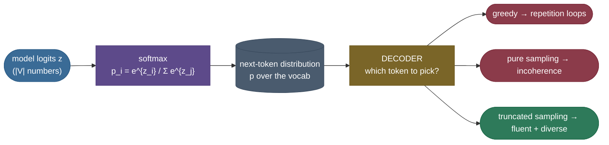
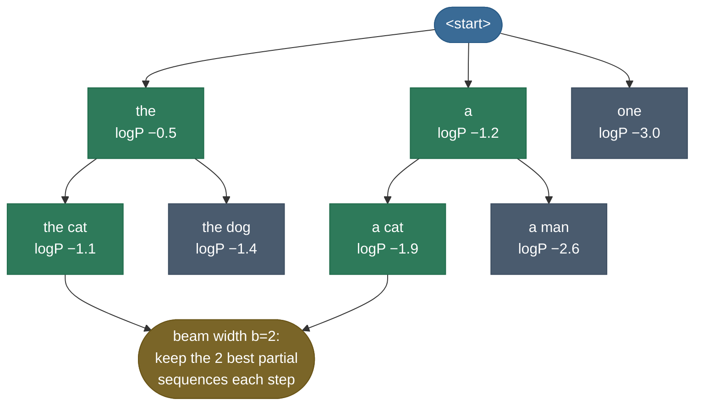
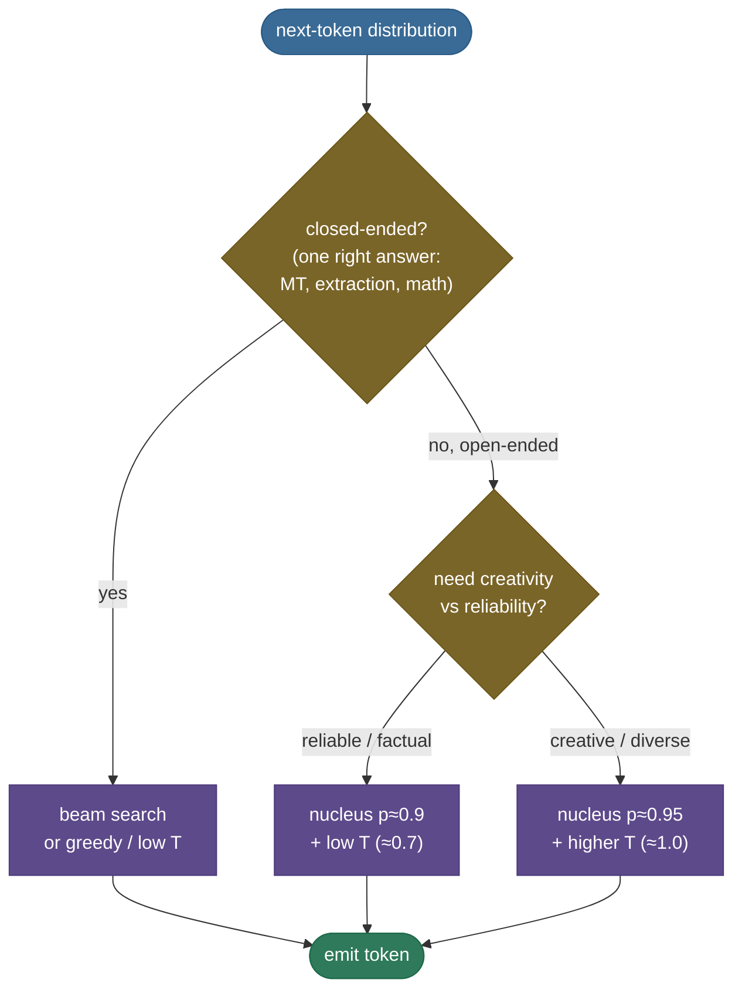

# Decoding & Sampling: turning the next-token distribution into text

A trained language model does **not** output text. At every step it outputs a *probability distribution over the whole vocabulary* — fifty thousand numbers that sum to 1, one per possible next token. "The capital of France is ___" produces a distribution where `Paris` might hold 0.92, `the` 0.01, `a` 0.008, and so on down a long tail. **Decoding** is the separate, deliberate algorithm that turns that distribution into one actual token — and then the next, and the next. The model proposes; the *decoder* disposes.

This is the most under-appreciated lever in all of LLM usage. The *exact same model*, with the *exact same weights*, can produce a crisp factual answer, a repetitive broken loop, or fluent creative prose — and the only thing that changed was **how you picked tokens from its distributions**. Pick the single most-likely token every time and a powerful model will collapse into "*I think that I think that I think that…*". Pick purely at random from the raw distribution and it dissolves into word salad. The art is the narrow corridor between these two failures, and that corridor has a name for each of its settings: **greedy**, **beam search**, **temperature**, **top-k**, and **top-p (nucleus)**.

By the end of this page you'll be able to:

- explain **why** the choice of decoder changes coherence, diversity, and repetition so dramatically;
- derive how **temperature** reshapes the softmax, and predict the effect of $T=0.5$ vs $T=2.0$;
- explain the precise difference between **top-k** (fixed count) and **top-p** (adaptive mass), and *why top-p is usually better*;
- explain **neural text degeneration** (Holtzman 2019) — why likelihood-maximizing decoders loop, and why nucleus sampling fixes it;
- pick the right decoder for a task — **closed-ended** (translation, extraction) vs **open-ended** (chat, story);
- prove every one of these claims in runnable from-scratch code.

> **Note — this is about *which* token, not *how fast*.** A neighbouring page, [Inference Optimization & Serving](../09-Inference-Optimization-and-Serving/09-Inference-Optimization-and-Serving.md), covers **speculative decoding** — but that is a pure *speed* trick whose output is provably **distributionally identical** to plain sampling. This page is about decoding *strategy* — the choice that **changes what text you get**. Speculative decoding makes a given strategy faster; it never changes which strategy you chose. Keep the two ideas in separate drawers.

---

## The problem: a distribution is not a sentence

Here is the felt problem. Run a model forward one step and you get a vector of logits $z \in \mathbb{R}^{|V|}$, which the softmax turns into a probability $p_i$ for each of the $|V|$ vocabulary tokens. You must emit exactly one token, then feed it back in and repeat. **What rule do you use to choose?**

Two obvious rules both fail, and feeling *why* they fail is the whole motivation:

**Naïve rule 1 — always take the most likely token (greedy).** Surely the highest-probability token is the "best"? In practice, on open-ended text, greedy decoding falls into **repetition loops**: once the model emits "*the United States and the United States*", the most-likely continuation is *again* "*and the United States*", because that phrase is now in the context reinforcing itself. The locally-optimal choice is globally catastrophic — and this is not a small model artefact; **GPT-2-large does it too** (Holtzman et al. 2019). Greedy is *myopic*: it optimizes the next token, never the sentence.

**Naïve rule 2 — sample straight from the raw distribution.** If greedy is too rigid, just draw a token at random with probability $p_i$? The problem is the **long tail**. A 50,000-token vocabulary puts a *tiny* probability on each of thousands of irrelevant tokens — but there are *so many* of them that their **combined** mass is large, and you'll regularly draw one. One absurd token ("*The capital of France is **bicycle**…*") derails the whole rest of the generation, because the model now has to continue from nonsense. Pure sampling is *too loose*.



*Decoding sits between the model's distribution and the emitted token. The two naïve rules fail at opposite extremes; every good decoder lives in between — keep the plausible tokens, discard the tail, sample with controlled randomness.*

So we need a rule that is **random enough to be diverse and non-repetitive, but constrained enough to never wander into the nonsense tail.** That single sentence is the design brief for everything below.

---

## Intuition first: the dinner-party menu

Before any math, the mental model I actually use.

Think of the model's distribution as a **menu the chef hands you each round**, with a recommendation score next to every dish. You have to order one dish, eat it, then the chef writes the *next* menu based on what you just ate. How do you order?

- **Greedy** = *always order the single top-scored dish.* Decisive, but you eat the same "safe" dish forever — and because each choice shapes the next menu, ordering "fries" once makes "fries" top-scored again, and you spiral into fries-fries-fries. (Repetition.)
- **Pure sampling** = *roll a weighted die over the entire menu, including the dish the chef scored 0.0001.* Occasionally you order the kitchen-sink special and the evening goes off the rails. (Incoherence.)
- **Temperature** = *how much you trust the scores.* Low temperature ($T<1$): you trust the chef, so you almost always pick near the top — conservative, focused. High temperature ($T>1$): you treat the scores as mere suggestions and spread your orders around — adventurous, wilder.
- **Top-k** = *"only let me order from the top 5 dishes."* A fixed-size shortlist. Simple, but a blunt instrument: if there are really only 2 good dishes tonight you're still forced to consider 5; if there are 30 equally-good dishes you're cruelly limited to 5.
- **Top-p (nucleus)** = *"give me the shortest shortlist that covers 90% of the recommendation score, and let me order from that."* When one dish is clearly best, the shortlist is just that one dish. When ten dishes are all plausible, the shortlist grows to include them all. **The shortlist resizes itself to the chef's confidence.** That self-resizing is the entire reason nucleus sampling beats fixed top-k.

Hold a follow-up question to this analogy — *"what if two dishes tie at the 90% boundary?"* — and it still works: you include the tying dish (the boundary is "at least 90%", so the crossing dish stays on the list). We'll see that exact rule in the math. The analogy maps cleanly: **menu = distribution, score = probability, shortlist = the truncation set, how-much-you-trust-scores = temperature.**


---

## The strategies, derived

There are two families. **Search** decoders (greedy, beam) try to find the *most probable sequence*. **Sampling** decoders (temperature / top-k / top-p) *draw* from the distribution with controlled randomness. We take them in turn, deriving the transform each one applies.

### Greedy: argmax, and why it's myopic

Greedy is the simplest possible rule — at each step emit the single highest-probability token:

$$x_t = \arg\max_i \; p_i = \arg\max_i \; z_i$$

Since softmax is monotonic, the argmax of the probabilities equals the argmax of the logits — so greedy doesn't even need the softmax. It's deterministic (same prompt → same output, no seed) and fast.

> **Source / derivation:** the greedy / argmax decoder and its myopia are laid out in [Jurafsky & Martin, *Speech and Language Processing* (3rd ed.), Ch. 10 — Large Language Models](https://web.stanford.edu/~jurafsky/slp3/10.pdf), which frames autoregressive generation and contrasts greedy against search and sampling.

The flaw is structural, not incidental. Greedy maximizes $p(x_t \mid x_{<t})$ at each step, but the **product** $\prod_t p(x_t \mid x_{<t})$ — the probability of the whole sequence — is *not* maximized by a chain of locally-greedy choices. A token that looks slightly worse now can open up a far more probable continuation later, and greedy can never see it. Worse, on open-ended text the locally-optimal choice **reinforces itself into a loop** (the repetition above). Greedy is the right tool only when the answer is essentially deterministic — "2 + 2 = ___", or extracting a field from a document.

### Beam search: keep several hypotheses alive

Beam search attacks greedy's myopia directly: instead of committing to one token, keep the **$b$ most-probable partial sequences** ("beams") at every step. At each step, expand every beam by every possible next token, score all the resulting candidate sequences by their cumulative log-probability, and keep the top $b$. At the end, return the highest-scoring complete sequence.



*Beam search with width $b=2$. At each step every surviving beam is expanded by all tokens, the candidates are scored by cumulative log-probability, and only the top $b$ survive (green kept, grey pruned). Greedy is the special case $b=1$; exhaustive search is $b = |V|^{T}$.*

> **Source / derivation:** beam search for sequence decoding is presented with worked code in [*Dive into Deep Learning*, Ch. 10 — Beam Search](https://d2l.ai/chapter_recurrent-modern/beam-search.html), which derives greedy as the $b=1$ special case and the length-normalized scoring below.

Beam search shines on **closed-ended** tasks — machine translation, summarization, constrained generation — where there *is* a single best answer and finding the high-probability sequence matters. But on **open-ended** generation it fails in a surprising way: **maximum-probability text is bland and repetitive.** Holtzman et al. showed that the most-likely sequences a model can produce are *degenerate* — humans don't write the highest-probability continuation; real language is full of mildly-surprising choices. Beam search, by hunting probability, hunts exactly the wrong thing for creative text.

For closed-ended use, one practical fix to beam's bias toward *short* sequences (raw cumulative log-prob only ever *subtracts* with each extra token) is **length normalization** — divide the score by $L^\alpha$ for sequence length $L$:

$$\text{score}(x_{1:L}) = \frac{1}{L^\alpha}\sum_{t=1}^{L} \log p(x_t \mid x_{<t})$$

> **Source / derivation:** length-normalized beam scoring is from [Wu et al., *Google's Neural Machine Translation System* (2016)](https://arxiv.org/abs/1609.08144), §7 (the $lp(Y)$ length penalty), and is reproduced with code in [*Dive into Deep Learning*, Ch. 10 — Beam Search](https://d2l.ai/chapter_recurrent-modern/beam-search.html).

### Temperature: a dial on the softmax's sharpness

Now the sampling family. The first knob doesn't truncate anything — it *reshapes* the distribution before you sample. **Temperature** $T$ divides the logits before the softmax:

$$p_i = \frac{\exp(z_i / T)}{\sum_j \exp(z_j / T)}$$

> **Source / derivation:** temperature scaling of the softmax originates in the distillation literature, [Hinton, Vinyals & Dean, *Distilling the Knowledge in a Neural Network* (2015)](https://arxiv.org/abs/1503.02531), §2 ("we use a higher temperature in the softmax"); its use as a decoding knob at scale is documented in the [GPT-3 paper, Brown et al. (2020)](https://arxiv.org/abs/2005.14165).

Let's *derive* the effect rather than assert it. Consider two tokens with logit gap $\Delta = z_a - z_b$. Their **probability ratio** is

$$\frac{p_a}{p_b} = \frac{\exp(z_a/T)}{\exp(z_b/T)} = \exp\!\left(\frac{\Delta}{T}\right).$$

Read off the two limits:

- **$T < 1$ (e.g. 0.5):** dividing by a number $<1$ **magnifies** $\Delta/T$, so the ratio $\exp(\Delta/T)$ *grows* — the gap between the best token and the rest widens, the distribution **sharpens**. As $T \to 0$, the ratio $\to \infty$ for any positive gap, so all mass collapses onto the argmax: **temperature 0 *is* greedy.**
- **$T > 1$ (e.g. 2.0):** dividing by a number $>1$ **shrinks** $\Delta/T$, so the ratio shrinks toward 1 — all tokens become more equal, the distribution **flattens** toward uniform. As $T \to \infty$, every token's probability $\to 1/|V|$: pure uniform randomness.

The clean way to measure "sharp vs flat" is **Shannon entropy** $H = -\sum_i p_i \log_2 p_i$ — low when peaked, high when spread. The demo computes it directly on our toy distribution:

| Temperature $T$ | Entropy (bits) | Top token's prob | Character |
|---|---:|---:|---|
| 0.5 | **0.03** | 0.997 | near-greedy, deterministic |
| 1.0 | **0.61** | 0.913 | the model's own distribution |
| 2.0 | **2.20** | 0.571 | flattened, adventurous |

These exact numbers come from `decoding_sampling.py` (and the figure below is generated from the same function), so the page, notebook, and figure can never disagree.


> **Note:** temperature alone doesn't solve the long-tail problem — even at $T=1$ that fat tail of nonsense tokens is still there to be sampled. Temperature controls the *shape*; **top-k and top-p control the *support*** (which tokens are allowed at all). In practice you combine them: truncate the tail with top-p, then temperature-scale what remains.

### Top-k: keep a fixed number of tokens

The first truncation method. **Top-k sampling** keeps only the $k$ highest-probability tokens, zeroes out the rest, renormalizes, and samples:

$$V^{(k)} = \text{the } k \text{ tokens with highest } p_i, \qquad p'_i = \begin{cases} \dfrac{p_i}{\sum_{j \in V^{(k)}} p_j} & i \in V^{(k)} \\[2mm] 0 & \text{otherwise} \end{cases}$$

> **Source / derivation:** top-k sampling for open-ended generation was introduced and popularized by [Fan, Lewis & Dauphin, *Hierarchical Neural Story Generation* (2018)](https://arxiv.org/abs/1805.04833), §4, which truncates to the top $k$ candidates before renormalizing and sampling.

The renormalization is the load-bearing step: after deleting the tail, the surviving probabilities no longer sum to 1, so we divide by their sum $\sum_{j \in V^{(k)}} p_j$ to make a valid distribution again. Top-k decisively kills the nonsense tail — with $k=40$, those thousands of absurd tokens simply cannot be drawn.

But top-k's fixed size is a genuine weakness, and it's the cleanest way to motivate top-p. **$k$ is the wrong constant for both ends of the confidence spectrum:**

- When the model is **confident** (one token at 0.95), $k=40$ still admits 39 low-probability tokens you'd never want — wasting the truncation.
- When the model is **uncertain** (50 roughly-equal plausible tokens), $k=40$ chops off 10 perfectly good ones for no reason — over-truncating.

The right cutoff *depends on the distribution's shape*, and a fixed $k$ cannot adapt. That is exactly the gap nucleus sampling fills.

### Top-p (nucleus): keep the smallest set covering probability mass $p$

**Top-p sampling** — *nucleus sampling* — replaces "keep a fixed *count*" with "keep a fixed *amount of probability mass*." Sort tokens by probability descending; walk down the list accumulating probability; stop as soon as the cumulative sum reaches $p$. That smallest set is the **nucleus** $V^{(p)}$; renormalize over it and sample.

$$V^{(p)} = \text{smallest set with} \sum_{i \in V^{(p)}} p_i \ge p, \qquad p'_i = \begin{cases} \dfrac{p_i}{\sum_{j \in V^{(p)}} p_j} & i \in V^{(p)} \\[2mm] 0 & \text{otherwise} \end{cases}$$

> **Source / derivation:** nucleus (top-p) sampling and the supporting analysis of neural text degeneration are from [Holtzman, Buys, Du, Forbes & Choi, *The Curious Case of Neural Text Degeneration* (2019)](https://arxiv.org/abs/1904.09751), §3.1 (the nucleus definition) and §3–4 (why likelihood-maximizing decoders degenerate).

The magic is that $|V^{(p)}|$ — the **number** of tokens kept — is now a *consequence of the distribution's shape*, not a fixed input:

- **Peaked distribution** (top token at 0.92): the cumulative sum crosses $p=0.9$ almost immediately, so the nucleus is **just 1–2 tokens**. Tight and focused, exactly when the model is sure.
- **Flat distribution** (many roughly-equal tokens): the cumulative sum crawls upward, needing **many tokens** to reach $p=0.9$. Wide and exploratory, exactly when the model is unsure.

This is the single most important figure on the page — the **same** two distributions, truncated by fixed-$k$ vs adaptive nucleus:


And the adaptivity is monotone — as a distribution flattens (entropy rises), the nucleus grows smoothly while top-k stays pinned at its constant:


That is the crux: **top-p adapts its cutoff to the model's confidence; top-k cannot.** It's why nucleus sampling (often $p \in [0.9, 0.95]$) is the default decoder in most production chat systems, and why the original paper named it for the *nucleus* of probability mass.

### The other knobs, briefly

A handful of refinements you'll meet in practice, each a small twist on the above:

- **Min-p sampling** — keep tokens whose probability is at least $p_{\min} \times p_{\max}$ (a fraction of the *top* token's probability). Like top-p it's adaptive, but it's anchored to the peak rather than to cumulative mass, which keeps it stable at high temperature.
- **Typical sampling** ([Meister et al. 2022](https://arxiv.org/abs/2202.00666)) — keep tokens whose information content $-\log p_i$ is *close to the distribution's expected* information content (its entropy), rather than simply the most probable. Grounded in information theory: human text tends to be "typically" surprising, not maximally probable.
- **Contrastive search** ([Su et al. 2022](https://arxiv.org/abs/2202.06417)) — pick the token that is both high-probability *and* dissimilar (in hidden-state space) to tokens already generated, explicitly penalizing the representation-space repetition that causes degeneration.
- **Repetition penalty** — directly divide the logits of already-generated tokens by a factor $> 1$ before softmax, making repeats less likely. Effective but blunt (see Pitfalls — it can suppress legitimately-repeated tokens like "the").

> **Source / derivation:** typical sampling is from [Meister, Pimentel, Wiher & Cotterell, *Locally Typical Sampling* (2022)](https://arxiv.org/abs/2202.00666); contrastive search and the degeneration-as-anisotropy analysis are from [Su, Lan, Wang, Yogatama, Kong & Collier, *A Contrastive Framework for Neural Text Generation* (2022)](https://arxiv.org/abs/2202.06417).

---

## Neural text degeneration: why the corridor exists

It's worth pausing on *why* both extremes fail, because Holtzman et al. (2019) turned the folklore into a precise observation, and it's the conceptual heart of the topic.

Their finding: **maximizing likelihood produces degenerate text.** Beam search and greedy hunt for high-probability sequences, but the highest-probability sequences a model can produce are *repetition loops* — and the longer they run, the *more* confident the model becomes in continuing the loop (a positive-feedback trap). Meanwhile, the **probability mass in the unreliable tail** is the source of incoherence under pure sampling: integrate over thousands of tail tokens and you draw a derailing one too often.

The resolution is to **truncate the unreliable tail, then sample from what remains** — keeping the diversity that defeats repetition while discarding the tail that causes incoherence. Nucleus sampling does this *adaptively*, which is why it tracks human text statistics (perplexity, repetition rate, vocabulary usage) far better than greedy, beam, or pure sampling.




*The decision you actually make in practice. Closed-ended task with one right answer → search (beam / greedy / low temperature). Open-ended → nucleus sampling, with temperature trading reliability for creativity.*

---

## Worked example: build every decoder from scratch

Here is a single self-contained script that implements **greedy, temperature, top-k, and top-p** on a hand-built toy distribution, and *proves* the claims above — most importantly that **top-p's nucleus shrinks on a peaked distribution and grows on a flat one**, the property top-k cannot have. It runs on CPU in well under a second; no GPU, no model download.

> **Runnable project and a step-by-step notebook:** the same verified code lives as a clean script and an executed teaching notebook next to this page — see the [step-by-step teaching notebook](code/18-Decoding-and-Sampling.ipynb) and the [runnable demo script](code/decoding_sampling.py) (run it with `python decoding_sampling.py`). The page, notebook, and figures all import the functions below, so every quoted number has exactly one source.

```python
"""From-scratch greedy / temperature / top-k / top-p. Verified on Python 3.12 / torch 2.12, CPU."""
import torch
import torch.nn.functional as F

VOCAB = ("the", "cat", "sat", "on", "mat", "dog", "ran", "fast", "blue", "sky")
PEAKED = torch.tensor([5.0, 8.0, 4.0, 3.5, 3.0, 2.5, 2.0, 1.5, 1.0, 0.5])   # "cat" dominates
FLAT   = torch.tensor([2.20, 2.05, 1.95, 2.10, 1.80, 2.00, 1.70, 1.90, 1.85, 1.75])  # spread out

def softmax_T(logits, T):                 # temperature: p_i = softmax(z_i / T)
    return F.softmax(logits / T, dim=-1)

def entropy_bits(p):                       # H = -Σ p log2 p  (low = peaked, high = flat)
    p = p.clamp_min(1e-12)
    return float(-(p * torch.log2(p)).sum())

def top_k_filter(logits, k):               # keep k highest logits, mask rest to -inf
    kth = torch.topk(logits, k).values[..., -1]
    return logits.masked_fill(logits < kth, float("-inf"))

def top_p_filter(logits, p):               # keep smallest set with cumulative prob >= p
    probs = F.softmax(logits, dim=-1)
    s_probs, s_idx = torch.sort(probs, descending=True)
    cumulative = torch.cumsum(s_probs, dim=-1)
    remove_sorted = cumulative > p
    remove_sorted[..., 1:] = remove_sorted[..., :-1].clone()   # shift right: KEEP the crossing token
    remove_sorted[..., 0] = False                              # always keep the top-1 token
    remove = torch.zeros_like(remove_sorted).scatter(-1, s_idx, remove_sorted)
    return logits.masked_fill(remove, float("-inf"))

def nucleus_size(logits, p):               # how many tokens land in the top-p nucleus
    return int(torch.isfinite(top_p_filter(logits, p)).sum())

# --- greedy is just argmax ---
print("greedy(peaked) =", VOCAB[int(torch.argmax(PEAKED))])              # -> 'cat'

# --- temperature reshapes the distribution (measured by entropy) ---
for T in (0.5, 1.0, 2.0):
    print(f"T={T}: entropy = {entropy_bits(softmax_T(PEAKED, T)):.3f} bits")

# --- THE key result: top-k is fixed, top-p ADAPTS ---
print("top-k k=3:  peaked keeps", int(torch.isfinite(top_k_filter(PEAKED,3)).sum()),
      " flat keeps", int(torch.isfinite(top_k_filter(FLAT,3)).sum()))
print("top-p p=0.9: peaked nucleus", nucleus_size(PEAKED,0.9),
      " flat nucleus", nucleus_size(FLAT,0.9))
assert nucleus_size(PEAKED,0.9) < nucleus_size(FLAT,0.9)   # adaptivity, asserted not assumed
```

Output (CPU):

```
greedy(peaked) = cat
T=0.5: entropy = 0.032 bits
T=1.0: entropy = 0.611 bits
T=2.0: entropy = 2.203 bits
top-k k=3:  peaked keeps 3  flat keeps 3
top-p p=0.9: peaked nucleus 1  flat nucleus 9
```

Read the last two lines carefully — they *are* the lesson. **Top-k keeps 3 tokens on both distributions**, blind to their shape. **Top-p keeps 1 token when the distribution is peaked and 9 when it's flat** — it widened by 9× purely because the model was less certain. The `assert nucleus_size(PEAKED) < nucleus_size(FLAT)` makes that adaptivity a *contract*: if a future refactor ever broke it, the script would fail loudly rather than print a wrong number. (The full script adds the empirical-frequency check — that sampling *recovers* the filtered distribution, max error 0.024 over 2000 draws — and the diversity check: distinct tokens over 2000 draws rise 3 → 9 → 10 as $T$ goes 0.5 → 1.0 → 2.0.)

> **Note — the off-by-one that bites everyone (`top_p_filter`):** the two lines that shift the removal mask right and force-keep the top-1 token are not decoration. Without the shift, the token that *crosses* the threshold $p$ is itself removed, so the kept mass ends up *just under* $p$ — and on a sharply peaked distribution where the top token already exceeds $p$, you can remove **everything**, leaving an empty nucleus and a divide-by-zero on renormalization. The shift keeps the crossing token (so mass is always $\ge p$) and the `remove_sorted[..., 0] = False` guarantees at least one token always survives. This is the single most common bug in hand-rolled nucleus implementations.

---

## Pitfalls & failure modes

The things that actually bite, each with the mechanism and the fix:

- **Greedy / beam repetition on open-ended text.** Mechanism: locally-optimal tokens reinforce themselves into a loop; maximizing likelihood maximizes the wrong thing (Holtzman 2019). Fix: switch to nucleus sampling for open-ended generation; reserve greedy/beam for closed-ended tasks (translation, extraction, math).
- **Temperature too high → gibberish.** At $T=2$+ the distribution flattens so far that nonsense tokens become probable (entropy 2.2 of a max 3.32 bits, in our demo). Fix: keep $T \le 1$ for factual work; if you want creativity, raise $T$ *and* tighten top-p so the flattened tail is still truncated.
- **Temperature too low → repetition.** As $T \to 0$ you converge to greedy and inherit its loops. Fix: don't set $T$ below ~0.3 for open-ended text; if you need determinism use greedy *and* a repetition penalty.
- **Top-k's fixed size is wrong on both ends.** Too small when the model is uncertain (chops good tokens), too large when it's confident (admits junk). Fix: prefer top-p, which adapts; or combine `top_k` and `top_p` (most libraries apply both — top-k as a hard cap, top-p as the adaptive cutoff).
- **The nucleus off-by-one / empty-nucleus crash.** Covered above — shift the mask, always keep the top-1 token, and check kept mass $\ge p$, not $> p$.
- **Repetition penalty side effects.** Penalizing *all* previously-seen tokens suppresses legitimately-frequent words ("the", "is", "a") and can degrade fluency or, in code generation, break syntax (you *need* to repeat `}` and `;`). Fix: scope the penalty to a recent window, exempt high-frequency function tokens, or prefer presence/frequency penalties tuned conservatively.
- **Forgetting the seed → irreproducible bugs.** Sampling is stochastic; without a fixed RNG seed the same prompt yields different outputs, and a bug you saw once won't reproduce. Fix: seed the generator (the demo passes an explicit `torch.Generator`), and log it. Greedy and beam are deterministic and need no seed.
- **`float16` softmax overflow at extreme logits.** Very large logits (or very low temperature, which *multiplies* them) can overflow in half precision before the softmax's max-subtraction kicks in. Fix: compute the softmax in `float32`, or rely on a numerically-stable `log_softmax` — the same max-subtraction trick covered in [Loss Functions (softmax & cross-entropy stability)](../../05.%20Deep_Learning/concepts/04-Loss-Functions.md).

---

## Where it matters: choosing the decoder is choosing the behaviour

The crux for practitioners: **the decoder is a product decision, not just a hyperparameter.** Match it to the task.

| Task type | Example | Recommended decoder | Why |
|---|---|---|---|
| **Closed-ended, one right answer** | translation, summarization, field extraction, math | beam search (b=4–8) or greedy / low T | there *is* a best sequence; search for it |
| **Factual / reliable open-ended** | RAG answers, assistants, tool use | nucleus $p\approx0.9$ + $T\approx0.7$ | truncate the tail tightly, low temperature for focus |
| **Creative open-ended** | story, brainstorming, dialogue | nucleus $p\approx0.95$ + $T\approx1.0$ | wider nucleus, full temperature for diversity |
| **Deterministic / testable** | unit-tested pipelines, evals | greedy ($T=0$) | reproducible, no seed dependence |

This is why API providers expose `temperature`, `top_p`, `top_k`, `frequency_penalty`, and `presence_penalty` as first-class parameters — they *are* the behaviour controls. A coding assistant runs near-greedy ($T\approx0.2$) for correctness; a brainstorming tool runs $T\approx1.0$ with $p\approx0.95$ for range. **Same model, different decoder, completely different product.**

---

## In production

A few realities of how this is deployed:

- **Defaults that ship.** Most chat APIs default to **nucleus sampling around $p=0.9$–$1.0$ with $T=0.7$–$1.0$**. OpenAI, Anthropic, and open-source serving stacks (vLLM, TGI) all expose `temperature` + `top_p` (+ often `top_k`, `min_p`, and frequency/presence penalties) as request parameters.
- **Decoders compose with serving optimizations.** [Speculative decoding](../09-Inference-Optimization-and-Serving/09-Inference-Optimization-and-Serving.md) accelerates *whatever* decoder you chose — its rejection-sampling correction makes the sped-up output **distributionally identical** to plain sampling from your chosen strategy. The two are orthogonal: 18 picks the strategy, 09 makes it fast.
- **Beam search is fading for chat, alive for MT.** As models got better at open-ended generation, beam search's blandness made it a poor fit for assistants; it remains standard in **machine-translation and speech** systems where a single best sequence is the goal.
- **Structured / constrained decoding** layers a *grammar* on top of sampling — at each step, mask out tokens that would violate a JSON schema or regex before sampling. It's the same truncation idea (zero out disallowed tokens, renormalize) applied to *syntactic validity* rather than probability, and it's how reliable "respond in JSON" modes work.
- **Reproducibility in evals.** Benchmarks usually decode **greedily** (or at $T=0$) precisely so results are deterministic and comparable; sampling-based metrics report a seed.

---

## Recap and rapid-fire

**If you remember nothing else:** the model emits a *distribution*; the **decoder** turns it into text, and that choice — not the weights — controls coherence, diversity, and repetition. **Greedy/beam** maximize likelihood (great for closed-ended tasks, degenerate/repetitive for open-ended). **Temperature** reshapes the softmax (low = sharp/focused, high = flat/diverse). **Top-k** keeps a *fixed* number of tokens; **top-p (nucleus)** keeps the smallest set covering mass $p$ — an *adaptive* cutoff that's narrow when the model is confident and wide when it's not, which is why it's the open-ended default.

**Quick-fire — say these out loud:**

- *What does the model actually output?* A probability distribution over the whole vocabulary, every step — not text.
- *Why does greedy repeat?* Locally-optimal tokens reinforce themselves; maximizing per-token likelihood maximizes the wrong objective for a sentence.
- *Temperature formula and the two limits?* $p_i = \text{softmax}(z_i/T)$; $T\to0$ is greedy (argmax), $T\to\infty$ is uniform.
- *Top-k vs top-p in one sentence?* Top-k keeps a fixed *count*; top-p keeps a fixed *mass*, so its count adapts to the distribution's shape.
- *Why is top-p usually better than top-k?* Its cutoff widens when the model is uncertain and tightens when it's confident — top-k can't.
- *What is neural text degeneration?* Likelihood-maximizing decoders (greedy/beam) produce repetitive loops; pure sampling produces incoherence; nucleus sampling is the sweet spot (Holtzman 2019).
- *Which decoder for translation? for chat?* Beam search for translation (closed-ended); nucleus sampling for chat (open-ended).
- *Is speculative decoding a decoding strategy?* No — it's a *speed* technique whose output is distributionally identical to your chosen strategy; it changes *how fast*, not *which token*.
- *Most common nucleus bug?* The off-by-one that drops the threshold-crossing token and can empty the nucleus → keep the crossing token, always keep top-1, use $\ge p$.

---

## References and further reading

The curated link library for this topic — videos, courses, articles, papers, books, and internal cross-links — lives in a companion file so it can be reused as a standalone reference list:

**→ [Decoding & Sampling — references and further reading](18-Decoding-and-Sampling.references.md)**
