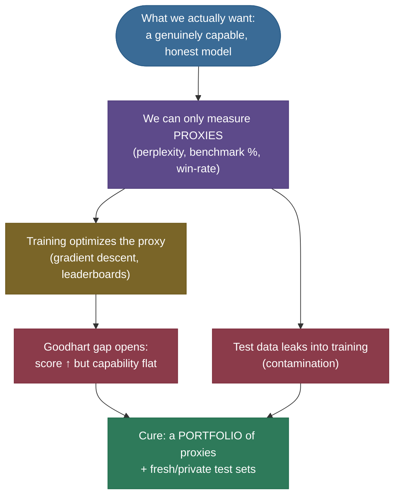
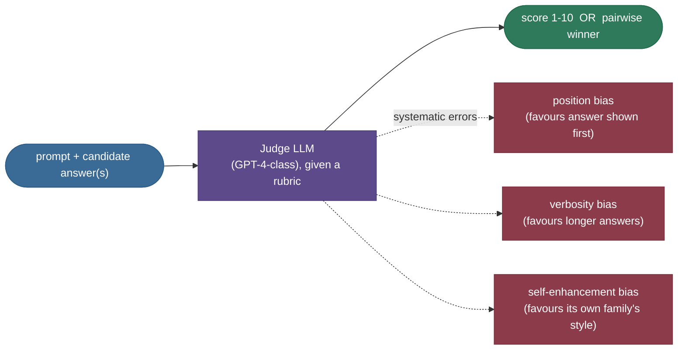
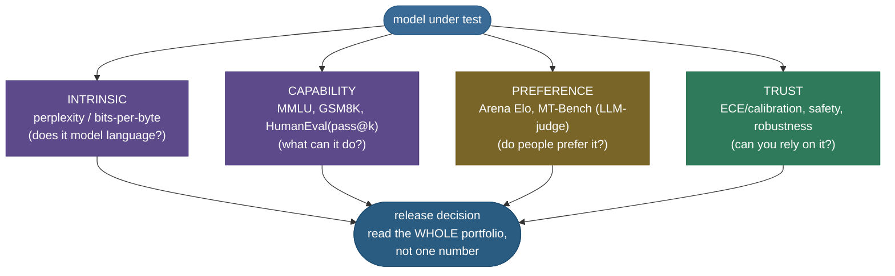

# LLM Evaluation & Benchmarks: measuring a thing that can talk its way out of the test

Here is a problem you do not have when you build a sorting algorithm: you can *prove* the sort is correct. You cannot prove a language model is "good." Goodness here is a moving target made of dozens of half-defined skills — recall, reasoning, code, honesty, helpfulness, refusing the right things — and the model is a fluent generator that can produce text that *looks* right while being wrong, or memorize the answer key without learning the subject. So the entire field has to fall back on **proxies**: numbers that *correlate* with goodness and that we hope are hard to game. Evaluation is the study of which proxies survive contact with a model trying — by gradient descent, not malice — to maximize them.

This is one of the most practically important and most-asked-about topics in the whole LLM stack, because **the metric you choose decides what gets built.** A team that optimizes MMLU ships a model that aces multiple-choice and fumbles a real conversation. A team that trusts a single LLM judge ships a model that learned to write *longer* answers, not better ones. By the end of this note you'll be able to:

- **define perplexity** from cross-entropy and say exactly what it does and does *not* measure;
- **read the benchmark landscape** — MMLU, HellaSwag, ARC, GSM8K, HumanEval, BIG-bench, HELM, MT-Bench — and name each one's *failure mode*;
- **derive the unbiased `pass@k` estimator** $1 - \binom{n-c}{k}/\binom{n}{k}$ and explain why the naive version is biased;
- **explain LLM-as-judge** and its three biases (position, verbosity, self-enhancement), and how much it agrees with humans;
- **derive the Elo / Bradley–Terry update** behind Chatbot Arena;
- **compute ECE** and read a reliability diagram — is the model's confidence honest?
- **reason about contamination and Goodhart** — why scores inflate, and why benchmarks die.

> **Note:** evaluation is not one number. It is a *portfolio* — intrinsic (perplexity), capability (benchmarks), preference (human/judge), and trust (calibration, safety). Each catches what the others miss. The interview-grade answer is never "use benchmark X"; it's "here is the portfolio, and here is the failure mode of each piece."

---

## The problem: every metric is a target, and every target gets gamed

Start with the felt difficulty, because it shapes everything after it. Two forces make LLM evaluation genuinely hard, and both have names.

**Goodhart's law.** *"When a measure becomes a target, it ceases to be a good measure."* The moment a benchmark matters — appears on a leaderboard, gates a release — people optimize for it directly, and the gap between *scoring well* and *being good* widens. A model can learn the *shape* of MMLU questions, the *length* an LLM judge rewards, the *phrasing* that triggers a rubric's keyword match. None of that is the underlying skill. The benchmark still reads high.

**Contamination.** LLMs train on a web-scraped corpus of trillions of tokens. Benchmarks live on that same web. So the test set frequently *leaks into the training set* — the model has literally seen the answers. It then "scores" by recall, not capability, and the headline number is inflated. This is not hypothetical; it is the single largest threat to every public benchmark, and it gets worse every year as more of the web is benchmark-derived.


Put the two together and you get the defining anxiety of the field: **a number going up does not mean the model got better.** It might mean the benchmark leaked, or that the model learned the test's tells. Good evaluation is the discipline of building proxies that resist both — and of *triangulating* across many proxies so no single gamed metric can fool you.



---

## Intuition: four lenses on one model

Before any formula, fix the mental model. Think of evaluating an LLM the way a university evaluates a student — and notice that *no single instrument is trusted alone*:

- **Perplexity** is the **pop quiz on raw material**: given held-out text, how surprised is the model by what comes next? It is cheap, automatic, and measures how well the model *models language* — but a student can be unsurprised by a textbook and still be a poor conversationalist.
- **Benchmarks** (MMLU, GSM8K, HumanEval) are the **standardized exams**: fixed questions, objective scoring, comparable across students. Great for ranking — until the exam leaks, or until everyone aces it and it stops *discriminating*.
- **Human / judge preference** (Chatbot Arena, MT-Bench) is the **oral exam and the interview**: put two answers side by side and ask which is better. This is closest to "is it actually good?" — but it's expensive (humans) or biased (LLM judges).
- **Calibration** (ECE) is the **honesty check**: when the student says "I'm 90% sure," are they right 90% of the time? A confident-but-wrong model is *more* dangerous than an uncertain one, and no accuracy number reveals this.

The analogy holds under a follow-up, which is the test of a good analogy: *"why not just use the standardized exam?"* Because a student who only ever sat multiple-choice exams — and saw the answer key in advance — could top the rankings and still be unable to hold a conversation or admit when they don't know something. That gap between *exam score* and *actual competence* is exactly the gap between a benchmark number and model quality, and it's why you need all four lenses.


---

## Lens 1 — Perplexity: the intrinsic metric

### What it is

**Perplexity (PPL)** measures how well a model predicts held-out text, with *no task and no labels* — just "here is real text the model didn't train on; how surprised is it?" It is the oldest LM metric and still the backbone of pretraining evaluation, because it's cheap, fully automatic, and directly tied to the training objective.

The intuition: perplexity is the **effective branching factor** — the number of equally-likely options the model is hesitating between at each token. PPL = 1 means perfect prediction (it always knew the next token). PPL = 20 means "as confused as if it were guessing uniformly among 20 words at every step." Lower is better.

### The math, derived from cross-entropy

Perplexity is *exactly* the exponential of the cross-entropy loss — the same loss the model was trained on. Let's build it so the connection is unmistakable.

A language model assigns a probability to a sequence by the chain rule:

$$p_\theta(w_1, \dots, w_N) = \prod_{t=1}^{N} p_\theta(w_t \mid w_{<t}),$$

where $w_t$ is the token at position $t$, $w_{<t}$ are all tokens before it, and $\theta$ are the model's parameters. The **cross-entropy** (per token, in nats) is the average negative log-probability the model assigns to the tokens that *actually occurred*:

$$\text{CE} = -\frac{1}{N}\sum_{t=1}^{N} \log p_\theta(w_t \mid w_{<t}).$$

Read it term by term: $p_\theta(w_t \mid w_{<t})$ is the probability the model put on the *true* next token; $-\log$ of it is the model's **surprise** (small if the model was confident-and-right, large if it was caught off guard); averaging over $N$ tokens gives the mean surprise per token. This is *identically* the language-modeling training loss — perplexity is not a separate metric, it's a re-scaling of the loss you already minimize.

**Perplexity is the exponential of that surprise:**

$$\boxed{\;\text{PPL} = \exp(\text{CE}) = \exp\!\left(-\frac{1}{N}\sum_{t=1}^{N} \log p_\theta(w_t \mid w_{<t})\right)\;}$$

> **Source / derivation:** [Jurafsky & Martin, *Speech and Language Processing* (3rd ed.), Ch. 3 "N-gram Language Models" §3.7](https://web.stanford.edu/~jurafsky/slp3/3.pdf) defines perplexity as the inverse geometric-mean probability, $\text{PPL} = p(w_1\dots w_N)^{-1/N}$, which equals $\exp(\text{CE})$ exactly. The cross-entropy framing is in the same text's Ch. 10 on large language models.

Why the exponential? It turns the abstract "nats of surprise" into a concrete **count of choices**. If CE $= \log V$ (the model is maximally uncertain over a vocabulary of $V$ words), then PPL $= V$ — the branching factor is the whole vocabulary. If CE $= 0$ (perfect), PPL $= 1$. The exp() is what makes "perplexity" an interpretable *number of options* rather than a log-scale loss. (If you compute CE in bits with $\log_2$, then PPL $= 2^{\text{CE}}$; same quantity, different base.)

Because exp() is **monotonic**, a lower-CE model is *always* a lower-perplexity model — ranking by perplexity and ranking by loss are the same ranking. That's the whole reason the metric is trustworthy as an *intrinsic* signal.


### From-scratch: prove PPL = exp(CE)

The whole point is that perplexity is not a mysterious metric — it is `exp(mean(-log p(true token)))`, and we can prove the identity rather than assert it. Below, two toy "models" assign distributions to the same held-out sequence; the better one earns the lower perplexity, and `PPL == exp(CE)` holds to machine precision.

```python
import math, torch

# Two toy models score the SAME held-out sequence "the cat sat on mat <eos>".
# Each row is a next-token distribution; we read off the probability of the true token.
HELD_OUT_IDS = (0, 1, 2, 3, 4, 5)
good = torch.tensor([           # confident & correct: high mass on the true token each step
    (0.70, 0.10, 0.05, 0.05, 0.05, 0.05),
    (0.05, 0.70, 0.10, 0.05, 0.05, 0.05),
    (0.05, 0.10, 0.65, 0.10, 0.05, 0.05),
    (0.05, 0.05, 0.10, 0.65, 0.10, 0.05),
    (0.05, 0.05, 0.05, 0.10, 0.70, 0.05),
    (0.05, 0.05, 0.05, 0.05, 0.10, 0.70),
])

def cross_entropy_nats(probs, ids):
    chosen = probs[range(len(ids)), list(ids)]      # p(true token) at each position
    return float(-torch.log(chosen).mean())         # mean per-token surprise (nats)

ce = cross_entropy_nats(good, HELD_OUT_IDS)
ppl = math.exp(ce)                                  # perplexity = exp(cross-entropy)
assert abs(ppl - math.exp(ce)) < 1e-9               # identity, by construction
print(f"CE = {ce:.4f} nats   PPL = {ppl:.3f}")      # CE = 0.3814 nats   PPL = 1.464
```

Real output (from `llm_evaluation.py`, CPU): the good model scores **CE 0.3814 nats, PPL 1.464**; the near-uniform model **CE 1.3863 nats, PPL 4.000**. The near-uniform model's PPL of exactly 4.0 is no accident — when it spreads its mass it behaves like guessing among ~4 options, and perplexity reports precisely that branching factor.

### Pitfalls of perplexity — read these before you ever quote a PPL

Perplexity has sharp edges that bite people constantly:

- **Not comparable across tokenizers.** PPL is *per token*, so a model with a coarser tokenizer (fewer, bigger tokens) has fewer, harder predictions and a *different* PPL than a fine-grained one **on the same text** — even if they model language equally well. Comparing PPL across models with different vocabularies is meaningless. (Normalize to bits-per-byte if you must compare.)
- **Only defined on the model's own distribution.** You can compute PPL for an open-weights model whose probabilities you can read; you *cannot* compute it for a closed chat API that only returns text. This is a big reason the field shifted to behavioral benchmarks.
- **Low PPL ≠ good assistant.** Perplexity measures *next-token modeling of a corpus*, not helpfulness, reasoning, or honesty. A model can have excellent perplexity on web text and still be a poor chat assistant — the corpus is not the conversation.
- **Domain-sensitive.** PPL on Wikipedia and PPL on code are different numbers; always state the eval corpus.

> **Gotcha:** the most common interview trap is "model A has lower perplexity, so it's better." Correct answer: *only* if measured with the **same tokenizer on the same held-out corpus**, and even then it only means A models *that text* better — not that A is the better assistant.

---

## Lens 2 — The benchmark landscape: what each one measures, and how it fails

Benchmarks turn "is it capable?" into "what fraction of these questions does it get right?" — objective, comparable, automatable. The catch is that *each benchmark measures a slice* and *each has a characteristic way of lying to you*. Know the slice and the lie for each.

| Benchmark | What it measures | Format / scoring | Characteristic failure mode |
|---|---|---|---|
| **MMLU** | Broad knowledge, 57 subjects (STEM, law, medicine, …) | 4-way multiple choice, accuracy | Contamination + answer-letter biases; saturating near human-expert |
| **HellaSwag** | Commonsense sentence completion | 4-way multiple choice | Adversarially filtered, but now largely saturated |
| **ARC** (AI2 Reasoning Challenge) | Grade-school science reasoning | multiple choice (Easy/Challenge splits) | "Challenge" set still has retrieval-style shortcuts |
| **GSM8K** | Multi-step grade-school math | open-ended numeric answer, exact-match | Sensitive to prompt format; partly contaminated; answer-only ≠ reasoning |
| **HumanEval** | Python code generation | run unit tests → **pass@k** | 164 problems only; high variance; contamination from public repos |
| **BIG-bench** | 200+ diverse capability probes | mixed (MCQ, exact-match, judged) | Heterogeneous scoring; hard to summarize in one number |
| **HELM** | Holistic: many scenarios × many metrics | accuracy + calibration + robustness + bias + efficiency | Expensive; the point is *not* a single number |
| **MT-Bench** | Multi-turn instruction following | LLM-judge score 1–10 | Inherits the judge's biases (position, verbosity) |

A few deserve unpacking:

**MMLU** ([Hendrycks et al. 2020](https://arxiv.org/abs/2009.03300)) is the de-facto knowledge benchmark — 57 subjects, four-way multiple choice, scored by accuracy. Its strength is breadth; its weaknesses are that (a) multiple-choice with a fixed answer letter invites shortcut biases, (b) it's heavily contaminated by now, and (c) frontier models score in the high 80s, so it's **saturating** — it no longer separates the best models.

**GSM8K** ([Cobbe et al. 2021](https://arxiv.org/abs/2110.14168)) is 8.5K grade-school math word problems requiring 2–8 reasoning steps, scored by exact-match on the final number. It's the canonical *reasoning* benchmark and the reason chain-of-thought prompting took off — but exact-match on the answer rewards a *right number* even from *wrong reasoning*, and the problems are simple enough that strong models now exceed 90%.

**HumanEval** ([Chen et al. 2021](https://arxiv.org/abs/2107.03374)) evaluates code by *running unit tests* — the gold standard for code, because correctness is executable, not judged. It introduced **pass@k**, which we derive next. Its weakness is scale: 164 hand-written problems, so the score has high variance and is vulnerable to repo contamination.

**HELM** ([Liang et al. 2022](https://arxiv.org/abs/2211.09110)) is the deliberate antidote to single-number reporting: a matrix of *scenarios × metrics* (accuracy, calibration, robustness, fairness, toxicity, efficiency) reported *together*, so you see the trade-offs a single accuracy number hides. Its design statement is that holistic transparency beats a leaderboard rank.

### Why benchmarks die: saturation

Every fixed benchmark has a lifecycle. When it's new, models score low and it *discriminates* — a better model gets a clearly higher score. As models improve, scores climb toward the 100% ceiling and bunch up. Once the best models all score ~95%+, the benchmark can no longer tell them apart — it's **saturated**, and the field retires it (HellaSwag, much of MMLU) and builds harder ones (MMLU-Pro, GPQA, FrontierMath).


> **Note:** saturation is the *honest* benchmark death; contamination is the *dishonest* one. Both end with the number losing meaning. A benchmark is useful only while it (a) has headroom and (b) is not in the training data — which is why the most trustworthy modern evals are **private, held-out, and refreshed** (e.g. the Arena's fresh prompts, or a company's internal eval set).

---

## Lens 2a — `pass@k`: scoring code correctly (with the unbiased estimator derived)

Code is the one place evaluation is *objective*: a completion either passes the unit tests or it doesn't. But models are sampled stochastically, so a fair metric must account for *getting multiple tries*. That's **pass@k**: the probability that **at least one of $k$ sampled completions** passes. The subtlety — and a beloved interview question — is estimating it *without bias*.

### The problem with the naive estimate

The obvious recipe: generate $k$ samples, check if any pass, repeat over many problems, average. But the variance is enormous for small $k$, so in practice you generate a **larger** pool of $n$ samples per problem (e.g. $n=200$), count how many pass ($c$), and *estimate* pass@k from $(n, c)$. The naive way to do that — imagine drawing $k$ samples *with replacement* from your pool — is **biased low**, because re-drawing the same wrong sample makes failure look more likely than it is.

### The unbiased estimator, derived

The fix is to compute the *exact* probability that a draw of $k$ from the pool of $n$ — **without replacement** — contains at least one of the $c$ correct samples. Derive it by its complement.

Setup: a pool of $n$ samples, $c$ of them correct (so $n-c$ wrong). Draw $k$ *distinct* samples uniformly at random.

- **Total ways** to choose $k$ from $n$: $\binom{n}{k}$.
- **Ways to choose $k$ that are *all wrong*** (the bad event — zero correct): choose all $k$ from the $n-c$ wrong ones: $\binom{n-c}{k}$.
- **Probability the draw is all-wrong:** $\dfrac{\binom{n-c}{k}}{\binom{n}{k}}$.
- **pass@k = 1 − that:**

$$\boxed{\;\text{pass@}k = 1 - \frac{\binom{n-c}{k}}{\binom{n}{k}}\;}$$

> **Source / derivation:** [Chen et al. 2021, *Evaluating Large Language Models Trained on Code* (Codex)](https://arxiv.org/abs/2107.03374), §2.1 and Fig. 3 — introduces this unbiased estimator and explicitly notes that "calculating pass@k directly… results in high variance," motivating the $n \gg k$ combinatorial form. The complement-counting argument above is the paper's derivation.

Every symbol: $n$ = pool size sampled per problem; $c$ = how many of those passed; $k$ = the budget you're reporting (e.g. pass@1, pass@10); $\binom{a}{b}$ = "$a$ choose $b$," the number of $b$-subsets of an $a$-set. The estimator is *unbiased* because it computes the exact without-replacement probability rather than approximating it by resampling.

Two sanity checks fall right out, and the code asserts both: **pass@1 $= c/n$** (one draw, chance of correct = fraction correct), and **pass@n $= 1$** when $c \geq 1$ (drawing the whole pool must include a correct one). A numerically stable way to evaluate it avoids huge factorials: $\frac{\binom{n-c}{k}}{\binom{n}{k}} = \prod_{i=0}^{k-1}\frac{n-c-i}{n-i}$.

### From-scratch, with the bias made visible

```python
import numpy as np

def pass_at_k(n, c, k):
    """Unbiased: 1 - C(n-c,k)/C(n,k), via a product to dodge big factorials."""
    if n - c < k:        # fewer wrong answers than k -> any k draws MUST include a correct one
        return 1.0
    fail = 1.0
    for i in range(k):
        fail *= (n - c - i) / (n - i)
    return 1.0 - fail

def pass_at_k_naive_mc(n, c, k, trials=20000, seed=0):
    """The BIASED recipe: draw k WITH replacement, measured by Monte-Carlo."""
    rng = np.random.default_rng(seed)
    correct = np.zeros(n, dtype=bool); correct[:c] = True
    hits = sum(correct[rng.integers(0, n, size=k)].any() for _ in range(trials))
    return hits / trials

n, c = 20, 5
print(f"unbiased pass@5 = {pass_at_k(n, c, 5):.3f}")          # 0.806
print(f"naive    pass@5 = {pass_at_k_naive_mc(n, c, 5):.3f}") # 0.761  <- biased LOW
```

Real output: unbiased pass@5 = **0.806**, naive (with-replacement) pass@5 = **0.761** — the naive estimator *systematically under-reports* by re-counting repeated wrong draws as fresh failures. The gap is the bias, *measured*, not asserted.


The shape of pass@k itself is worth internalizing: more attempts *always* help (it's monotonic in $k$), but with **sharply diminishing returns** — the first few samples buy most of the gain, and a model with a low per-sample pass rate needs *exponentially* more tries to reach high pass@k.


> **Gotcha:** pass@k with large $k$ flatters weak models — given enough samples, *anything* eventually passes one unit test. Always report the $k$ that matches deployment (usually pass@1 for "one shot," and a larger $k$ only if you actually sample-and-filter in production). Quoting pass@100 as if it were the user experience is a classic benchmark sleight of hand.

---

## Lens 3 — LLM-as-judge: scaling the oral exam (and its three biases)

For open-ended quality — "which answer is more helpful?" — there's no unit test and human raters are slow and expensive. So the field uses a **strong LLM as the judge**: show it a question and one or two answers, and ask it to score or pick a winner. It's cheap, fast, and reproducible. It is also *biased*, and knowing the biases is the whole skill.



The three biases, catalogued by [Zheng et al. 2023 (MT-Bench / Chatbot Arena)](https://arxiv.org/abs/2306.05685):

- **Position bias** — the judge favors whichever answer it sees *first* (or sometimes *last*). The same pair of answers can swap winners purely by swapping their order.
- **Verbosity bias** — the judge favors *longer*, more detailed answers even when length adds nothing, so a model can win by padding.
- **Self-enhancement bias** — a judge tends to prefer answers in the style of its *own* model family (e.g. a GPT-4 judge slightly favoring GPT-4-style answers).

### Measuring position bias from scratch

The cleanest defense is also a measurement: rate every pair **in both orders** and count how often the verdict flips. A fair judge is order-invariant (flip-rate 0, first-position win-rate exactly 50%). A position-biased judge flips a measurable fraction of near-ties and pushes the first-position win-rate above 50%.

```python
import numpy as np

def position_biased_judge(q_first, q_second, bias):
    """Returns 0 if it prefers the FIRST answer, else 1. `bias` is a thumb on the first slot."""
    return 0 if (q_first + bias) >= q_second else 1

def measure_position_bias(n_pairs, bias, seed=0):
    rng = np.random.default_rng(seed); flips = first_wins = 0
    for _ in range(n_pairs):
        qx, qy = rng.random(), rng.random()                 # two answers, random quality
        win_orig = "x" if position_biased_judge(qx, qy, bias) == 0 else "y"
        win_swap = "y" if position_biased_judge(qy, qx, bias) == 0 else "x"  # order swapped
        flips += (win_orig != win_swap)
        first_wins += (position_biased_judge(qx, qy, bias) == 0)
        first_wins += (position_biased_judge(qy, qx, bias) == 0)
    return flips / n_pairs, first_wins / (2 * n_pairs)

print(measure_position_bias(500, bias=0.0))   # (0.000, 0.500)  fair: never flips
print(measure_position_bias(500, bias=0.15))  # (0.270, 0.635)  biased: 27% flip, 63.5% first-pos
```

Real output: the unbiased judge **never flips** and wins first-position exactly **50%** of the time; a judge with a 0.15 thumb on the first slot **flips 27% of verdicts** and lifts the first-position win-rate to **63.5%**. That flip-rate *is* the bias, turned into a number you can report and mitigate (by always averaging both orders).


### Does the judge agree with humans?

The reason LLM-as-judge is trusted at all: on MT-Bench and Chatbot Arena data, [Zheng et al. 2023](https://arxiv.org/abs/2306.05685) found that **GPT-4's judgments agree with human preferences ~80% of the time — about the same rate two *humans* agree with each other (~81%).** So a strong judge is roughly as reliable as a second human annotator, which is good enough to use it as a *scalable proxy* — provided you control its biases (swap orders, control for length, avoid same-family self-judging) and *spot-check against humans*. It does **not** replace human evaluation for high-stakes decisions; it scales the cheap 80% so humans can focus on the hard 20%.

> **Gotcha:** never let a model judge *itself* or its own family for a release decision — self-enhancement bias makes the score optimistic. And never report an LLM-judge win-rate without stating the judge model, the rubric, and whether you averaged over answer order. An unstated judge is an unreproducible number.

---

## Lens 3a — Chatbot Arena: Elo / Bradley–Terry from pairwise human votes

The gold standard for "which model do people actually prefer?" is **Chatbot Arena** ([Chiang et al. 2024](https://arxiv.org/abs/2403.04132)): users chat with two anonymous models side by side and vote for the better response. From a stream of **pairwise votes**, it computes a single **rating** per model — using the same math that ranks chess players (Elo) and that underlies RLHF reward models (Bradley–Terry). These are the same model; Elo is online Bradley–Terry with a fixed step size.

### The math: expected score, then the update

The **Bradley–Terry** model says: the probability that player A beats player B is a logistic function of their rating difference. Define A's **expected score** (its win probability) as

$$E_A = \frac{1}{1 + 10^{(R_B - R_A)/s}},$$

where $R_A, R_B$ are the two ratings and $s$ is a scale constant (chess convention: $s = 400$). Decode it: when $R_A = R_B$, the exponent is 0, $10^0 = 1$, and $E_A = \tfrac{1}{1+1} = 0.5$ — equal ratings, coin flip. When A leads by one scale unit ($R_A - R_B = 400$), $E_A = \tfrac{1}{1+10^{-1}} \approx 0.91$ — a 91% expected win, i.e. ~10:1 odds. **Every 400 points = 10× the odds of winning.** That's the entire meaning of an Elo gap.


> **Source / derivation:** the logistic form is the [Bradley–Terry model (1952)](https://en.wikipedia.org/wiki/Bradley%E2%80%93Terry_model); the $\pm400 \Rightarrow 10\times$ odds convention and the update rule below are the [Elo rating system](https://en.wikipedia.org/wiki/Elo_rating_system). Chatbot Arena's use of Bradley–Terry on LLM pairwise votes is [Chiang et al. 2024, *Chatbot Arena*](https://arxiv.org/abs/2403.04132), §4.

The **update** after a game: let $S_A \in \{0, 0.5, 1\}$ be the actual outcome (loss / draw / win). Move each rating toward the surprise — the gap between what happened and what was expected:

$$R_A \leftarrow R_A + K\,(S_A - E_A), \qquad R_B \leftarrow R_B + K\,(S_B - E_B),$$

with $K$ the **step size** (how far one game can move a rating). Read the term $S_A - E_A$: if A was *expected* to win ($E_A$ high) and did ($S_A = 1$), the surprise is small and A barely moves; if A *upset* a far-stronger B ($E_A$ low, $S_A = 1$), the surprise is large and A jumps. Beating a strong opponent moves you far; beating a weak one barely moves you — exactly the right incentive. The pool's total rating is conserved (whatever A gains, B loses), so ratings *separate* into the true order without drifting.

### From-scratch: Elo recovers the true ordering from win/loss alone

The convincing demo: take four agents of *known* hidden skill, generate honest win/loss outcomes from that skill, hand Elo **only the outcomes** (never the skills), and watch it recover the correct *ordering* from a flat start.

```python
import numpy as np

def expected_score(ra, rb, s=400.0):
    return 1.0 / (1.0 + 10.0 ** ((rb - ra) / s))

def elo_update(ra, rb, score_a, k=32.0):
    ea = expected_score(ra, rb)
    return ra + k * (score_a - ea), rb + k * ((1 - score_a) - (1 - ea))

TRUE_SKILL = {"A": 1600, "B": 1400, "C": 1200, "D": 1000}   # hidden from the algorithm
rng = np.random.default_rng(0)
ratings = {n: 1000.0 for n in TRUE_SKILL}                   # flat start: everyone equal
for _ in range(4000):
    a, b = rng.choice(list(TRUE_SKILL), size=2, replace=False)
    p_a = expected_score(TRUE_SKILL[a], TRUE_SKILL[b])      # TRUE win prob from latent skill
    score_a = 1.0 if rng.random() < p_a else 0.0           # sample an honest outcome
    ratings[a], ratings[b] = elo_update(ratings[a], ratings[b], score_a)
order = sorted(ratings, key=ratings.get, reverse=True)
assert order == ["A", "B", "C", "D"]                        # recovered the true ranking
print(" > ".join(f"{n}:{ratings[n]:.0f}" for n in order))   # A:1356 > B:1081 > C:912 > D:652
```

Real output: from a flat 1000 start and **only** win/loss, Elo recovers the exact true ordering **A > B > C > D**. (The absolute numbers compress toward the center because four agents in a small pool don't play enough games to reach the full 600-point spread — but the *ranking*, which is what a leaderboard reports, is exactly right.)


> **Note:** Chatbot Arena actually fits Bradley–Terry by **maximum likelihood over all votes at once** (with confidence intervals), not the online Elo update — it's more stable and gives error bars. But online Elo is the right *mental model* and converges to the same ordering, which is why we teach it first. The connection to RLHF is direct: a reward model trained on human preference pairs *is* a Bradley–Terry model; Elo is what you get when you update it one game at a time.

---

## Lens 4 — Calibration and ECE: is the model's confidence honest?

Accuracy tells you *how often* the model is right. **Calibration** tells you whether you can *trust its confidence* — and for anything high-stakes (medical, legal, agentic tool use), that matters as much as accuracy. A model is **well-calibrated** if, among all the times it says "I'm 80% sure," it's right *exactly* 80% of the time. An **over-confident** model says 90% and is right 70% — and that gap is dangerous precisely because it *looks* trustworthy.

### The math: Expected Calibration Error

You can't check calibration at every confidence value (each exact value occurs once), so you **bin**. Partition predictions into $M$ confidence bins (e.g. ten bins of width 0.1). In each bin, compare the **average confidence** to the **empirical accuracy**. ECE is the average gap, weighted by how many predictions land in each bin:

$$\boxed{\;\text{ECE} = \sum_{m=1}^{M} \frac{|B_m|}{N}\,\bigl|\,\text{acc}(B_m) - \text{conf}(B_m)\,\bigr|\;}$$

Every symbol: $B_m$ = the set of predictions whose confidence falls in bin $m$; $|B_m|$ = how many there are; $N$ = total predictions; $\text{conf}(B_m)$ = mean predicted confidence in the bin; $\text{acc}(B_m)$ = fraction actually correct in the bin. The inner $|\text{acc} - \text{conf}|$ is the bin's miscalibration; the $|B_m|/N$ weight means crowded bins count more. Perfect calibration ⇒ accuracy = confidence in every bin ⇒ **ECE = 0**.

> **Source / derivation:** [Guo et al. 2017, *On Calibration of Modern Neural Networks*](https://arxiv.org/abs/1706.04599), §2.1 (Eqs. 2–3) — the binned ECE estimator and the reliability-diagram visualization. The paper's headline finding (modern nets are *over-confident*) is exactly the pattern the demo below reproduces.

### From-scratch: ECE and a reliability diagram

```python
import numpy as np

def expected_calibration_error(conf, correct, n_bins=10):
    edges = np.linspace(0, 1, n_bins + 1)
    idx = np.clip(np.digitize(conf, edges[1:-1]), 0, n_bins - 1)  # bin index per prediction
    ece = 0.0
    for b in range(n_bins):
        in_bin = idx == b
        if in_bin.sum() == 0:
            continue
        acc, c = correct[in_bin].mean(), conf[in_bin].mean()      # accuracy vs confidence
        ece += (in_bin.sum() / len(conf)) * abs(acc - c)          # weighted gap
    return ece

rng = np.random.default_rng(0)
conf = rng.uniform(0.5, 1.0, 6000)
correct_cal  = (rng.random(6000) < conf).astype(float)            # accuracy == confidence
correct_over = (rng.random(6000) < (conf - 0.15)).astype(float)   # accuracy lags by 0.15
print(f"calibrated  ECE = {expected_calibration_error(conf, correct_cal):.4f}")  # 0.0115
print(f"overconfident ECE = {expected_calibration_error(conf, correct_over):.4f}")# 0.1542
```

Real output: the calibrated stream has **ECE 0.0115** (just sampling noise — accuracy tracks confidence), while the over-confident one has **ECE 0.1542** — its accuracy trails its stated confidence by ~0.15 in every bin, and ECE puts a single honest number on that gap.


> **Gotcha:** ECE has its own sharp edges. It depends on the **number of bins** (too few hides miscalibration, too many adds noise); it's a *summary* that can hide a model that's under-confident in one region and over-confident in another (the signed errors partly cancel); and **RLHF tends to *worsen* calibration** — instruction-tuned chat models are often more over-confident than their base models, because preference optimization rewards confident-sounding answers. Always *show the reliability diagram*, not just the scalar.

---

## Putting it together: the evaluation portfolio

No single lens is sufficient; the interview-grade and production-grade answer is to run the **portfolio** and read it as a whole.



Each lens catches what the others miss: perplexity catches a broken language model that benchmarks might not; benchmarks catch capability gaps that perplexity hides; preference catches the "aces exams but bad to talk to" failure; calibration catches the "confidently wrong" failure that every accuracy number conceals. A model that wins on all four is genuinely good; a model that wins on one is *optimized for that one*.

---

## Where this matters in production

Evaluation is not an academic afterthought — it's load-bearing infrastructure:

- **Model selection and release gating.** Every frontier lab and serious product team runs a *held-out, often private* eval suite as a release gate. Public benchmarks alone are too contaminated to trust; the private set is the real bar.
- **The Open LLM Leaderboard** ([Hugging Face](https://huggingface.co/spaces/open-llm-leaderboard/open_llm_leaderboard)) runs a fixed benchmark battery (MMLU-Pro, GPQA, MATH, IFEval, BBH, MuSR) via the **EleutherAI lm-evaluation-harness** — the standard tool you'll actually use to evaluate an open model.
- **Chatbot Arena** ([LMArena](https://lmarena.ai/)) is the most-watched preference leaderboard, and its *fresh, crowd-sourced* prompts are one of the few sources relatively resistant to contamination.
- **RLHF / DPO depend on a reward signal** that *is* an evaluation — a Bradley–Terry preference model. Eval and alignment are the same math wearing different hats (see [RLHF & DPO](../15-RLHF-and-DPO/15-RLHF-and-DPO.md)).
- **Agentic and RAG systems** are evaluated end-to-end with **LLM-as-judge rubrics** (faithfulness, groundedness, task success) because there's no multiple-choice form for "did the agent accomplish the goal?"
- **Contamination audits** (n-gram overlap, canary strings, the "did the model complete a memorized test item?" probe) are now a standard part of any credible benchmark report.

---

## Pitfalls & failure modes — the field's greatest hits

- **Quoting one number.** "It scores 89 on MMLU" is not an evaluation; it's a single contaminated, saturating slice. Always report the portfolio.
- **Cross-tokenizer perplexity comparison.** Meaningless unless normalized to bits-per-byte; see Lens 1.
- **Contamination denial.** Assume public benchmarks are partly in training data unless proven otherwise. Prefer private/fresh sets; run overlap checks.
- **LLM-judge without controls.** No stated judge, no order-swapping, self-judging → an inflated, unreproducible win-rate.
- **pass@k with a flattering k.** Reporting pass@100 as if it were the one-shot user experience.
- **Ignoring calibration.** Shipping an accurate-but-over-confident model into a high-stakes loop because the accuracy number looked fine.
- **Optimizing the metric, not the goal (Goodhart).** Training on benchmark-style data to lift the score; the number rises, the capability doesn't.
- **Trusting a saturated benchmark.** Once everyone scores ~95%, the benchmark can't rank — switch to a harder one.

---

## Recap and rapid-fire

**If you remember nothing else:** every LLM metric is a *proxy* for an un-measurable goal, and proxies get gamed (Goodhart) and contaminated, so you evaluate with a **portfolio** — perplexity (intrinsic), benchmarks (capability), preference/Elo + LLM-judge (helpfulness), and calibration/ECE (trust) — each catching a failure the others hide, and you keep your real test set *private and fresh*.

**Quick-fire — say these out loud:**

- *What is perplexity?* $\exp$ of the per-token cross-entropy; the effective branching factor; lower = better; **only comparable with the same tokenizer on the same corpus**.
- *Why is MMLU/HellaSwag less useful now?* Saturation (scores bunched near the ceiling) + contamination.
- *Derive pass@k.* $1 - \binom{n-c}{k}/\binom{n}{k}$ — one minus the chance all $k$ without-replacement draws are wrong; pass@1 $= c/n$, pass@n $= 1$.
- *Why is the naive pass@k biased?* Drawing with replacement re-counts repeated wrong samples → biased **low**.
- *Three LLM-judge biases?* Position, verbosity, self-enhancement. Fix position bias by averaging both orders.
- *How much does an LLM judge agree with humans?* ~80% (GPT-4 on MT-Bench) — about the human–human agreement rate.
- *What math is Chatbot Arena?* Bradley–Terry / Elo: $E_A = 1/(1+10^{(R_B-R_A)/400})$, update $R \mathrel{+}= K(S-E)$; +400 ≈ 10× odds.
- *What is ECE?* The bin-weighted gap between confidence and accuracy; 0 = perfectly calibrated; RLHF often makes it *worse*.
- *Contamination — what and why bad?* Test set leaks into training → score inflated by recall, not capability.
- *Goodhart in one line?* When a measure becomes a target, it stops being a good measure.

---

## References and further reading

The curated link library for this topic — videos, courses, articles, papers, books, and internal cross-links — lives in a companion file so it can be reused as a standalone reference list:

**→ [LLM Evaluation & Benchmarks — references and further reading](19-LLM-Evaluation-and-Benchmarks.references.md)**
