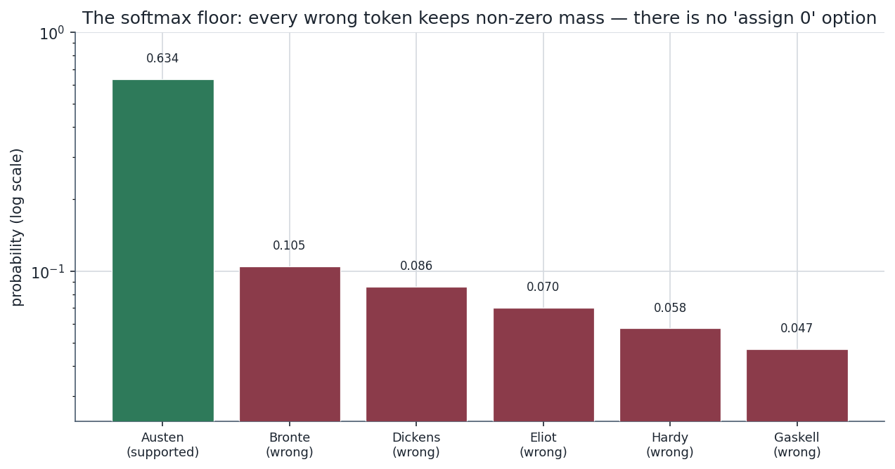
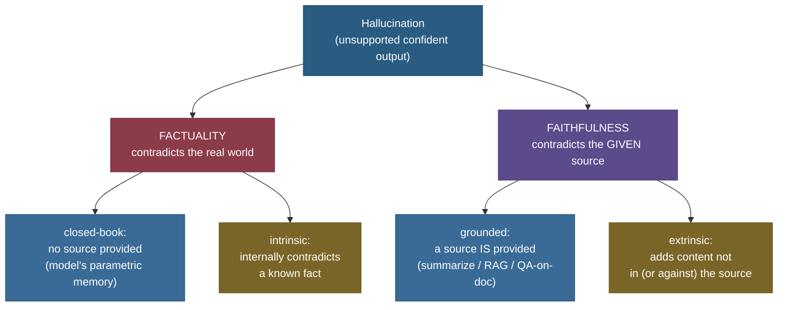
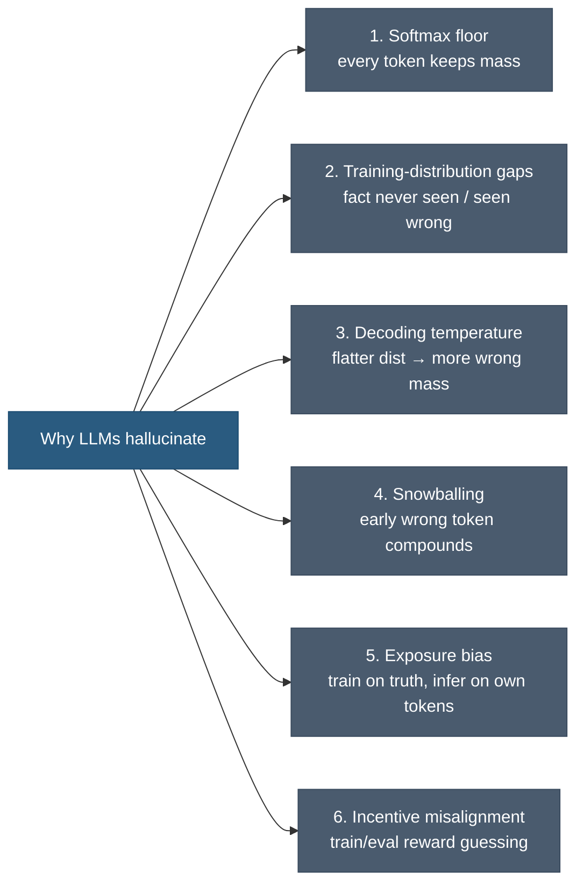
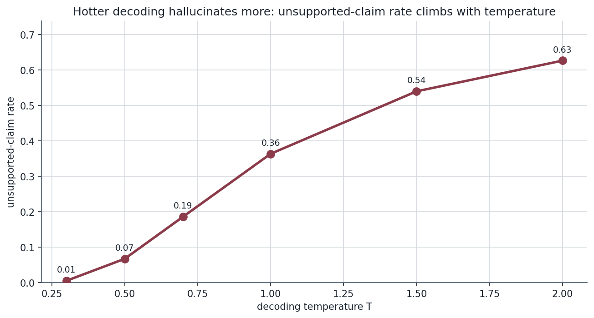
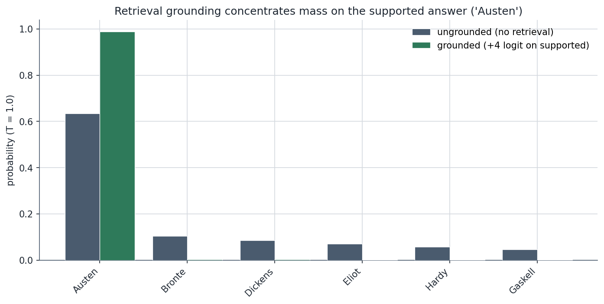
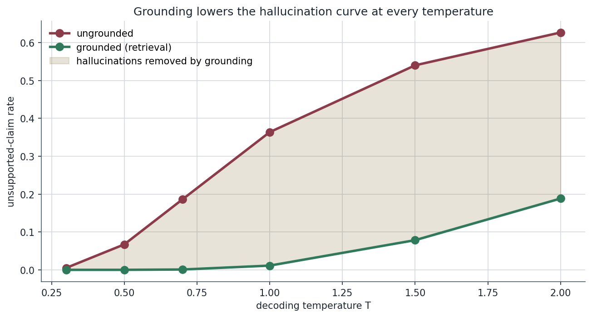
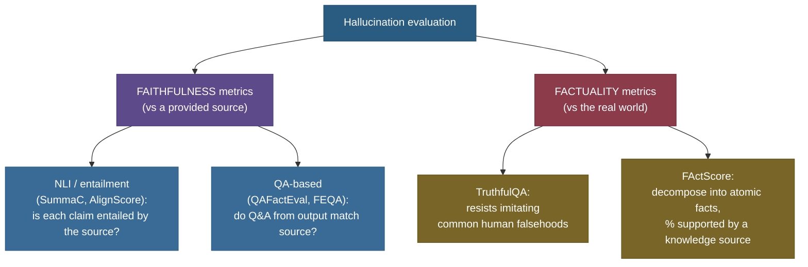
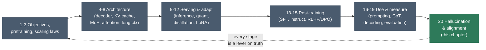

# Hallucination & Alignment Basics: why fluent models lie, and how we ask them not to

Ask a frontier LLM "Who wrote *The Mysteries of Udolpho*?" and it answers instantly, fluently, in perfect prose: *"That novel was written by Jane Austen in 1794."* Confident. Grammatical. Authoritative. And **wrong** — it was Ann Radcliffe. The model didn't *look up* the answer and make a mistake; it never looked anything up. It sampled the next token from a probability distribution, and the distribution put more mass on a plausible-sounding wrong name than on the right one. That is a **hallucination**, and the unsettling part is this: *the model that hallucinated is doing exactly what it was trained to do.* Fluency is not knowledge. A language model is a next-token sampler over a distribution, not a knowledge oracle — and once you internalize that one sentence, every cause and every fix in this chapter follows.

This is the **capstone** of the 20-chapter LLM arc. Everything before it built the machine: [language-modeling objectives](../01-Language-Modeling-Objectives/01-Language-Modeling-Objectives.md) defined the next-token loss, [decoding & sampling](../18-Decoding-and-Sampling/18-Decoding-and-Sampling.md) turned that distribution into text, [RLHF & DPO](../15-RLHF-and-DPO/15-RLHF-and-DPO.md) reshaped its preferences, [RAG](../../11.%20RAG_and_LLM_Applications/README.md) gave it documents to stand on, and [evaluation](../19-LLM-Evaluation-and-Benchmarks/19-LLM-Evaluation-and-Benchmarks.md) measured whether any of it worked. This chapter asks the question that ties them together: **when and why does the machine produce confident falsehoods, and what is the full stack of defenses?** By the end you'll be able to:

- give a **precise taxonomy** of hallucination (factuality vs faithfulness; intrinsic vs extrinsic; closed-book vs grounded) and place any failure in it;
- explain the **root causes** from first principles — why a softmax *always* assigns mass to wrong tokens, why temperature trades coverage for truth, why an early wrong token **snowballs**, and why training/eval *reward* guessing over abstaining;
- define **alignment** (the helpful/harmless/honest framing) and say precisely what **RLHF and DPO optimize** — and where they over-correct into **over-refusal**;
- reach for the right **mitigation** — grounding (RAG), constrained decoding, calibration & abstention, self-consistency/verification — and know what each does and doesn't fix;
- **evaluate** hallucination with the metrics that matter (faithfulness, TruthfulQA, FActScore) and read their numbers honestly;
- prove every one of these in **runnable from-scratch code** — temperature → hallucination, grounding → fewer hallucinations, confidence → calibrated abstention, and the helpful-vs-harmless **Pareto frontier**.

> **The one-sentence core:** an LLM samples the next token from a learned distribution that *never assigns exactly zero probability to a wrong answer* — so hallucination is not a bug bolted on, it is the **base rate** of an ungrounded sampler, and every fix is a way of either **moving mass onto truth** (grounding, tuning) or **refusing to emit the low-confidence tail** (calibration, abstention).

---

## The problem: fluency is not grounding

Feel the inadequacy of the naive view first. The naive view is *"the model knows facts and occasionally gets one wrong, like a person misremembering."* That framing is comforting and completely wrong, and believing it will make you build the wrong defenses.

Here is what actually happens, at the level of the numbers. The model produces a vector of **logits** over its vocabulary, applies a **softmax**, and samples. The softmax is

$$p_i = \frac{e^{z_i}}{\sum_j e^{z_j}}.$$

> **Source / derivation:** the softmax over output logits is the standard LM head, defined in [*Attention Is All You Need*](https://arxiv.org/abs/1706.03762) (Vaswani et al. 2017, §3.4) and unpacked in [Speech and Language Processing, 3rd ed., Ch. 10](https://web.stanford.edu/~jurafsky/slp3/10.pdf) (Jurafsky & Martin). Every term $e^{z_j} > 0$, so **every** $p_i > 0$ — there is no "assign exactly zero" option.

Look at that denominator. Because $e^{z_j} > 0$ for **every** token $j$, the probability of every wrong answer is strictly positive — the model *cannot* express "this is impossible." When the right answer's logit is only modestly larger than a plausible distractor's, the wrong token carries real, samplable mass. The figure below makes this concrete on our toy question "Who wrote \<book\>?": the supported answer ("Austen") wins, but every wrong author keeps non-zero probability.



That residual mass on wrong tokens is the **structural seed of hallucination**. It is always there. The question is never "will the model ever sample a wrong token?" — over enough generations, it will — but "how much mass sits on wrong tokens, and do we let the model emit it?" The rest of this chapter is those two levers.

> **Note (why "hallucination" is a loaded word).** The term anthropomorphizes — it suggests the model *perceives* something false. A more mechanical name is **confabulation**: confidently filling a gap with a plausible fabrication, exactly as the human confabulation literature describes. We keep "hallucination" because it's the field's standard term, but read it mechanically: *fluent output unsupported by fact or by the provided source.*

---

## Intuition: the overconfident exam candidate

Here is an analogy that holds up under follow-up questions. Picture a student taking an exam under a rule every test-taker knows: **a blank answer scores 0; a guess might score points; and there is no penalty for being wrong.** A rational student facing a question they're unsure about will *always* write a confident-sounding guess — never "I don't know" — because guessing strictly dominates abstaining under that scoring rule. The student isn't lying; they're optimizing the incentive they were given.

An LLM is that student, and its "exam" is the training and evaluation pipeline. **Next-token pretraining** rewards producing *something* fluent and plausible for every prompt — there is no token for "I don't know the rest of this Wikipedia sentence." **Benchmark evaluation** then scores accuracy, where a guess can be right but an abstention is always marked wrong. So the entire pipeline trains and selects for *confident guessing over calibrated abstention.* This is not a hand-wavy metaphor; it is the central thesis of [*Why Language Models Hallucinate*](https://arxiv.org/abs/2509.04664) (Kalai et al. 2025): hallucination is the **statistically optimal response to a scoring rule that punishes "I don't know."**

Now stress-test the analogy with the obvious follow-up: *"So can't we just tell the model to say 'I don't know'?"* Yes — and that's exactly **abstention**, which we build later. But it only works if the model has a **calibrated** sense of its own uncertainty (so it knows *when* to abstain) *and* the scoring rule stops penalizing abstention. The analogy predicts the fix: change the incentive (reward honest uncertainty) and give the student a way to gauge confidence (calibration). Both appear below. The analogy breaks in exactly one place, worth naming: a human student *knows* when they're guessing; a base LLM often does **not** — its confidence and its correctness can be decoupled (that decoupling is **miscalibration**, and we measure it directly).

---

## A precise taxonomy: name the failure before you fix it

"Hallucination" is an umbrella over genuinely different failures with different fixes. An interviewer who asks "what kinds of hallucination are there?" wants this structure, drawn from the [*Survey of Hallucination in Natural Language Generation*](https://arxiv.org/abs/2202.03629) (Ji et al. 2022) and [Lilian Weng's *Extrinsic Hallucinations in LLMs*](https://lilianweng.github.io/posts/2024-07-07-hallucination/).



The two axes you must keep straight:

- **Factuality vs faithfulness** — *what is the output measured against?*
  - **Factuality**: does the output match the **real world**? "Jane Austen wrote *Udolpho*" is a **factuality** error — it's just false. This is what you care about in open-ended QA with no provided source (**closed-book**).
  - **Faithfulness**: does the output match the **provided source**? Ask a model to summarize a document and it invents a statistic the document never states — that's a **faithfulness** error, *even if the invented statistic happens to be true in the world.* This is what you care about in summarization, RAG, and any **grounded** task.

  These come apart, and the split matters: **RAG fixes factuality by *converting* it into a faithfulness problem** — it hands the model a source so "is this true?" becomes "is this supported by the retrieved passage?", which is far easier to check and to optimize. (We prove the mass-shift this causes in code.)

- **Intrinsic vs extrinsic** — *how does the output relate to the source/known facts?*
  - **Intrinsic**: the output **contradicts** the source or a known fact (the source says "founded in 1998," the summary says "founded in 2003").
  - **Extrinsic**: the output **adds** content that is neither supported nor contradicted by the source — unverifiable additions (the summary asserts the company "is the market leader," a claim absent from the document). Extrinsic errors are sneakier because they can't be caught by checking against the source alone — they require external knowledge.

| Setting | Measured against | Typical error | Primary fix |
|---|---|---|---|
| Closed-book QA | the real world | factuality (wrong fact) | grounding (RAG), better pretraining, abstention |
| Summarization | the input document | faithfulness, mostly intrinsic | faithfulness training/decoding, NLI checks |
| RAG / QA-on-document | retrieved passages | faithfulness, intrinsic + extrinsic | better retrieval, citation, "answer only from context" |
| Open-ended generation | world + plausibility | extrinsic invention | self-consistency, verification, calibration |

> **Gotcha:** "the model was *confidently wrong*" is not a taxonomy — it's a symptom. Always ask **(1) against what?** (world → factuality; source → faithfulness) and **(2) contradiction or invention?** (intrinsic vs extrinsic). The two answers pick the fix. A faithfulness error in a RAG system is a *retrieval-or-prompting* bug; a factuality error in closed-book QA is a *knowledge-or-abstention* bug. Same surface symptom, completely different on-call response.

---

## Root causes: six reasons a sampler confabulates

The single root cause is the one-sentence core — *an ungrounded next-token sampler always has mass on wrong tokens.* But "why is that mass there, and why does it get sampled?" decomposes into six mechanisms you should be able to name and, where possible, *derive*. The diagram first, then each one.



**1. The softmax floor (the structural one).** As derived above, $p_i = e^{z_i}/\sum_j e^{z_j} > 0$ for every token. There is no "impossible" output. When the model has no strong evidence, the gap between the right logit and the wrong ones is small, and the wrong tokens carry samplable mass. This is the irreducible base rate.

**2. Training-distribution gaps.** The model's "knowledge" is whatever statistical regularities its weights captured from pretraining. For a fact seen **often and consistently** (the capital of France), the supported token's logit dominates. For a fact seen **rarely, inconsistently, or never** (a niche author, a post-cutoff event, a made-up entity in your prompt), there is no dominant token — the distribution is flat over plausible candidates, and *any* sample is a guess. This is why hallucination correlates with **long-tail and rare entities**, and why a model will confidently answer about a person who does not exist: nothing in its weights says "this entity is unknown," so it interpolates from similar-looking names.

**3. Decoding temperature.** From [decoding & sampling](../18-Decoding-and-Sampling/18-Decoding-and-Sampling.md): temperature $T$ rescales logits before the softmax, $p_i = \text{softmax}(z_i / T)$.

$$p_i(T) = \frac{e^{z_i/T}}{\sum_j e^{z_j/T}}.$$

> **Source / derivation:** temperature-scaled softmax is standard sampling, formalized in [*The Curious Case of Neural Text Degeneration*](https://arxiv.org/abs/1904.09751) (Holtzman et al. 2019) and unpacked in this platform's [Decoding & Sampling](../18-Decoding-and-Sampling/18-Decoding-and-Sampling.md). $T \to 0$ concentrates all mass on the argmax (greedy); $T > 1$ flattens the distribution toward uniform, **raising the mass on every wrong token**.

Higher $T$ flattens the distribution → more probability bleeds off the supported token onto distractors → the unsupported-claim rate climbs. We measure this exactly in the code: as $T$ goes $0.3 \to 2.0$, our toy sampler's unsupported-claim rate climbs from **0.005 to 0.627**. The mechanism, visualized:


That bleeding mass is exactly the unsupported-claim rate $R(T)$, and measured by Monte-Carlo sampling it climbs smoothly and monotonically with temperature — from near-zero at $T=0.3$ to 0.63 at $T=2.0$:



**4. Snowballing (the autoregressive one).** This is the cause most people miss. Generation is **autoregressive**: each token conditions on all previous tokens, including the model's *own* prior outputs. So when the model samples one wrong token early — say it commits to "Austen" — every subsequent token is now conditioned on that falsehood. The model doesn't backtrack; it does the *locally coherent* thing, which is to **keep elaborating the false premise** ("...in her 1794 novel, drawing on the Gothic tradition she pioneered..."). One early error compounds into a paragraph of confident fiction. [*How Language Model Hallucinations Can Snowball*](https://arxiv.org/abs/2305.13534) (Zhang et al. 2023) shows models will even assert claims they can separately identify as false, *because* an earlier committed token forces consistency.


**5. Exposure bias.** During training the model always sees the **ground-truth** previous tokens (teacher forcing — see [language-modeling objectives](../01-Language-Modeling-Objectives/01-Language-Modeling-Objectives.md)). At inference it sees its **own** previous tokens, which may already contain errors. The model was never trained to recover from its own mistakes, so a small early error puts it in a state it never saw in training — and its behavior there is unreliable. Exposure bias is the *training-time* reason snowballing is so hard to stop.

**6. Incentive misalignment.** The exam-candidate analogy, made mechanical. Pretraining never rewards "I don't know"; benchmark evaluation marks abstention as wrong. So both the **objective** and the **selection pressure** favor confident guessing. [*Why Language Models Hallucinate*](https://arxiv.org/abs/2509.04664) (Kalai et al. 2025) proves that under a binary right/wrong scoring rule, a model that ever abstains is dominated by one that always guesses — hallucination is the *optimal* policy for that incentive. **Fixing this is an alignment problem, not a capability problem**, which is the bridge to the second half of this chapter.

> **Tip (the interview synthesis):** if asked "why do LLMs hallucinate?" don't list one cause — give the **structure**: *(a) structurally, the softmax always has wrong-token mass; (b) that mass is large exactly where pretraining data was thin (rare facts); (c) decoding temperature and (d) autoregressive snowballing amplify whether and how badly it gets emitted; and (e–f) exposure bias and the train/eval incentive to guess mean the model was never taught to abstain.* That ordering — structural → data → decoding → autoregressive → training incentive — is the whole picture in one breath.

---

## The math: hallucination rate, calibration, and abstention

Three small pieces of math turn the intuitions above into things you can measure. Define every symbol as we go.

### Unsupported-claim rate

Let $\mathcal{S}$ be the set of **supported** answer tokens (true, or entailed by the source) and $\mathcal{U}$ the unsupported ones, with $\mathcal{S} \cup \mathcal{U}$ the whole vocabulary for a given factual slot. The **unsupported-claim rate** at temperature $T$ is the total probability the decoder places on wrong answers:

$$R(T) = \sum_{i \in \mathcal{U}} p_i(T) = 1 - \sum_{i \in \mathcal{S}} p_i(T).$$

Here $p_i(T) = \text{softmax}(z_i/T)_i$ is the temperature-scaled probability of token $i$. Two facts fall straight out of this definition: (1) $R(T) > 0$ **always** (the softmax floor — $\mathcal{U}$ always has mass); and (2) $R(T)$ **increases with $T$** for a peaked distribution, because flattening moves mass off the dominant (supported) token onto the tail (the distractors). That second fact is exactly the rising curve we measure.

> **Source / derivation:** this is just the complement of the supported-mass under a temperature-scaled softmax (Holtzman et al. 2019, [arXiv:1904.09751](https://arxiv.org/abs/1904.09751)); the monotonic increase with $T$ follows because raising $T$ raises the distribution's entropy (Decoding & Sampling chapter), and higher entropy on a peaked distribution means less mass on its mode.

### Confidence and calibration

The model's **confidence** in its chosen answer is its max softmax probability, $\hat{p} = \max_i p_i$. A model is **calibrated** if its confidence equals its accuracy: among all answers it gives with confidence $\hat{p} = 0.8$, exactly 80% should be correct. The standard scalar handle is **Expected Calibration Error (ECE)**: bin predictions by confidence, and in each bin compare mean confidence to actual accuracy.

$$\text{ECE} = \sum_{b=1}^{B} \frac{n_b}{N} \,\bigl|\, \text{acc}(b) - \text{conf}(b) \,\bigr|,$$

where $b$ indexes $B$ confidence bins, $n_b$ is the number of predictions in bin $b$, $N$ the total, $\text{acc}(b)$ the fraction correct in the bin, and $\text{conf}(b)$ the mean confidence in the bin. $\text{ECE} = 0$ is perfect calibration; large ECE means the model's confidence does **not** track how often it is right — the formal definition of "confidently wrong."

> **Source / derivation:** ECE as a binned estimator of calibration is from [*On Calibration of Modern Neural Networks*](https://arxiv.org/abs/1706.04599) (Guo et al. 2017, §2–3), which also documents that modern networks are systematically **over-confident** (confidence > accuracy) — visible as bars sitting *below* the diagonal in a reliability diagram.

Our toy "model" is deliberately miscalibrated (ECE = **0.242**) so the gap is vivid. The reliability diagram shows it directly:


### Abstention: trading coverage for accuracy

Calibration *enables* the fix: if confidence is at least *somewhat* informative, you can **abstain** below a threshold $\tau$ — answer only when $\hat{p} \ge \tau$, otherwise say "I don't know." Define **coverage** (fraction of questions answered) and **answered-accuracy** (accuracy on the answered subset):

$$\text{coverage}(\tau) = \frac{|\{x : \hat{p}(x) \ge \tau\}|}{N}, \qquad \text{acc}(\tau) = \frac{|\{x : \hat{p}(x) \ge \tau \;\wedge\; \text{correct}(x)\}|}{|\{x : \hat{p}(x) \ge \tau\}|}.$$

As $\tau$ rises you keep only high-confidence (and, if calibration is even weakly informative, mostly-correct) answers: **answered-accuracy rises while coverage falls.** This is the **risk–coverage** tradeoff of selective prediction, and it is the honest way to reduce hallucination — *not by getting the model to know more, but by getting it to speak only when it likely knows.*

> **Source / derivation:** the risk–coverage / selective-prediction framework is from [*Selective Classification for Deep Neural Networks*](https://arxiv.org/abs/1705.08500) (Geifman & El-Yaniv 2017); abstaining below a confidence threshold is the simplest selective predictor. The monotone trade (accuracy up, coverage down) holds whenever confidence is positively correlated with correctness — i.e., whenever the model is not *anti*-calibrated.

We measure all three on the toy data below; the curves cross exactly as the math predicts.

---

## Mitigation 1 — grounding (RAG): convert factuality into faithfulness

The most effective single lever against **factuality** hallucination is to stop asking the model to recall and start asking it to **read**. [Retrieval-Augmented Generation](../../11.%20RAG_and_LLM_Applications/README.md) (chapter 11) fetches relevant documents and puts them in the context, so the prompt becomes *"using this passage, who wrote Udolpho?"* instead of *"who wrote Udolpho?"* Mechanically, the retrieved passage **adds evidence that raises the supported token's logit** — it moves mass onto truth.

We model this at the logit level: grounding adds a boost to the supported token's logit. The effect on the distribution is decisive — the supported answer goes from 0.63 of the mass (ungrounded) to **0.99** (grounded) at $T=1.0$:



And because the supported mass goes up, the unsupported-claim rate goes **down at every temperature** — grounding lowers the whole hallucination curve:



This is exactly the **factuality → faithfulness** conversion from the taxonomy: with a source in context, "is this true?" becomes "is this in the passage?", which the model is far better at, and which you can *verify* (cite the span). But grounding is **not a silver bullet**, and the failure modes are the second half of the RAG story:

> **Gotcha:** RAG hallucinates too — in three distinct ways. **(1) Bad retrieval:** if the retriever returns irrelevant or wrong passages, the model grounds confidently on garbage (garbage-in, fluent-garbage-out). **(2) Ignoring the context:** even with a correct passage, the model may override it with its (wrong) parametric memory — the **context-vs-parametric conflict**, studied in [*Knowledge Conflicts in LLMs*](https://arxiv.org/abs/2403.08319). **(3) Extrinsic addition:** the model answers from the passage but *adds* an unsupported flourish — a faithfulness/extrinsic error the passage can't catch. RAG converts factuality errors into faithfulness errors; it does not delete error. The remaining work is good retrieval (chapter 11), an "answer only from the provided context" instruction, and **citation** so a human (or an NLI checker) can verify each claim against its span.

---

## Mitigation 2 — decoding: spend less of your temperature budget on lies

The cheapest lever needs no retrieval and no training: **decode more conservatively on factual tasks.** From the rate formula $R(T)$ and the temperature figure, lower $T$ puts more mass on the supported token, so:

- **Greedy / low temperature for factual QA.** When there is a single right answer, you want the mode, not a sample. Greedy ($T \to 0$) emits the argmax, which on a well-trained, well-grounded distribution *is* the supported token.
- **Save the temperature for creative tasks.** High $T$ is good for brainstorming and style — bad for facts. The right $T$ is **task-dependent**, and conflating them ("we set T=0.9 globally") is a common production cause of factual errors.
- **Constrained decoding** narrows the output space to valid answers — a closed-set classifier head, a grammar/JSON schema, or restricting to spans of the retrieved passage. If the only samplable tokens are valid, the wrong-token mass has nowhere to go.

> **Note (the limit of the decoding lever):** decoding only reshapes the mass that's already there — it **cannot create knowledge the model lacks.** If the supported token's logit is *not* the largest (a real knowledge gap, cause #2), greedy will confidently emit the wrong argmax — *lower* temperature can make a confident hallucination *more* deterministic, not less. Decoding controls the *tail-sampling* contribution to hallucination (causes #1, #3); it does nothing for the *knowledge-gap* contribution (#2). That's why decoding pairs with grounding (which fixes the logits) and abstention (which declines to emit a wrong argmax).

---

## Mitigation 3 — calibration & abstention: teach the model to say "I don't know"

This is the mitigation the exam-candidate analogy predicted. If the model can gauge its own uncertainty, it can **decline to answer** when it likely doesn't know — trading a little coverage for a lot of reliability. We built the math above; here is the result on the toy data. Sweeping the abstention threshold $\tau$:


Read the crossing point: answering **everything** gives 51% accuracy; abstaining below $\tau = 0.9$ gives **86%** accuracy on the 20% it does answer. You traded coverage for trustworthiness — and for many applications (medical, legal, financial) that is exactly the right trade. The techniques that make this work in practice:

- **Confidence signals beyond max-prob.** Raw softmax probability is a weak confidence signal (and miscalibrated). Better signals: **sequence-level log-probability**, **self-consistency agreement** (next mitigation), **semantic entropy** ([Farquhar et al. 2024, *Nature*](https://www.nature.com/articles/s41586-024-07421-0) — cluster sampled answers by meaning and measure entropy *over meanings*, which detects confabulation far better than token entropy), and asking the model to **verbalize** a confidence.
- **Calibration tuning.** Temperature scaling (Guo et al. 2017) recalibrates a model's confidences post-hoc; RLHF can *de*-calibrate a model (a known side effect — the post-RLHF model is often *more* over-confident), which is why calibration is checked after alignment.
- **Honest-uncertainty training.** Explicitly fine-tune the model to abstain when uncertain — changing the very incentive that Kalai et al. identified. This is where mitigation meets **alignment**.

> **Gotcha:** abstention is only safe if confidence is **at least weakly correlated with correctness.** On an *anti*-calibrated model (confident exactly when wrong), thresholding on confidence makes things **worse** — you'd keep the confident hallucinations and abstain on the correct-but-unsure answers. Always measure calibration (ECE, a reliability diagram) **before** shipping an abstention threshold. The threshold is only as trustworthy as the confidence it gates on.

---

## Mitigation 4 — self-consistency & verification: sample, then check

A different lever, drawn straight from [chain-of-thought reasoning](../17-Chain-of-Thought-Reasoning/17-Chain-of-Thought-Reasoning.md): instead of trusting one sample, draw **many** and look for agreement.

- **Self-consistency** ([Wang et al. 2022](https://arxiv.org/abs/2203.11171)): sample $k$ independent chain-of-thought answers and take the **majority vote**. The intuition is sharp — *a correct answer tends to be reached by many different reasoning paths, while hallucinations are idiosyncratic and scatter.* Agreement across samples is itself a calibrated-ish confidence signal: high agreement → likely correct; high disagreement → likely a guess (abstain). This connects directly to **semantic entropy** above — clustering the $k$ samples by meaning and measuring the spread.
- **Self-verification / self-critique:** have the model (or a separate model) **check** a generated answer against the source or known constraints — "does this claim appear in the passage? cite the span." [*Chain-of-Verification*](https://arxiv.org/abs/2309.11495) (Dhuliawala et al. 2023) generates the answer, then generates and answers verification questions, then revises. This catches the **extrinsic** errors that grounding alone misses.
- **NLI-based faithfulness checks:** run a natural-language-inference model to test whether each generated claim is **entailed** by the source. An un-entailed claim is a faithfulness hallucination, flaggable automatically — the basis of metrics like SummaC and the faithfulness scores below.

> **Tip:** self-consistency, semantic entropy, and abstention are the *same idea* wearing three hats — **use disagreement among samples as a hallucination detector.** When the model's samples agree, it likely knows; when they scatter, it's guessing. That single principle ("sample, then measure spread") underlies the most robust closed-book hallucination detectors that don't require retrieval.

---

## Why alignment matters: helpful, harmless, honest

Everything so far reduces hallucination *mechanically*. But there's a deeper question the field calls **alignment**: getting the model to do what we actually want, including being **honest about what it doesn't know**. The canonical framing is the **HHH** triad from [*A General Language Assistant as a Laboratory for Alignment*](https://arxiv.org/abs/2112.00861) (Askell et al. 2021):

- **Helpful** — actually answer the user's question, follow instructions, be useful.
- **Harmless** — refuse to produce harmful content (weapons, malware, harassment), don't deceive or manipulate.
- **Honest** — say true things, express calibrated uncertainty, **don't hallucinate**, and don't claim abilities it lacks.

Honesty is where alignment and hallucination meet: *a model that confidently fabricates is dishonest*, and the fix (reward calibrated uncertainty, penalize confident fabrication) is an **alignment** intervention, not a capability one. This is exactly the incentive Kalai et al. identified — and changing an incentive is what [RLHF and DPO](../15-RLHF-and-DPO/15-RLHF-and-DPO.md) (chapter 15) do.

### What RLHF and DPO actually optimize

Recall from chapter 15 the precise objectives — not "RLHF makes the model nicer" but what it mathematically maximizes.

**RLHF** trains a **reward model** $r_\phi(x, y)$ from human preference comparisons, then optimizes the policy $\pi_\theta$ to maximize reward while staying close to the reference model via a **KL penalty**:

$$\max_{\theta}\; \mathbb{E}_{x \sim \mathcal{D},\, y \sim \pi_\theta(\cdot\mid x)} \bigl[\, r_\phi(x, y) \,\bigr] \;-\; \beta\, \mathrm{KL}\!\bigl[\pi_\theta(\cdot\mid x) \,\|\, \pi_{\text{ref}}(\cdot\mid x)\bigr].$$

Every symbol: $x$ a prompt, $y$ a generated response, $r_\phi$ the learned reward (high when humans prefer $y$), $\pi_\theta$ the model being trained, $\pi_{\text{ref}}$ the frozen starting model, and $\beta$ the strength of the KL leash that keeps the policy from drifting into reward-hacked gibberish. **Honesty enters through $r_\phi$**: if human labelers prefer answers that admit uncertainty over confident fabrications, the reward model learns to score honesty highly, and the policy is pulled toward it.

> **Source / derivation:** this KL-regularized reward objective is the RLHF formulation of [*Training language models to follow instructions with human feedback (InstructGPT)*](https://arxiv.org/abs/2203.02155) (Ouyang et al. 2022, §3) and [*Learning to summarize from human feedback*](https://arxiv.org/abs/2009.01325) (Stiennon et al. 2020); the full derivation lives in this platform's [RLHF & DPO](../15-RLHF-and-DPO/15-RLHF-and-DPO.md).

**DPO** ([Rafailov et al. 2023](https://arxiv.org/abs/2305.18290)) skips the separate reward model and the RL loop, optimizing the same preference objective directly on pairs $(y_w \succ y_l)$ (winner preferred to loser):

$$\mathcal{L}_{\text{DPO}} = -\,\mathbb{E}_{(x, y_w, y_l)}\!\left[\log \sigma\!\left(\beta \log \frac{\pi_\theta(y_w \mid x)}{\pi_{\text{ref}}(y_w \mid x)} - \beta \log \frac{\pi_\theta(y_l \mid x)}{\pi_{\text{ref}}(y_l \mid x)}\right)\right].$$

> **Source / derivation:** DPO's closed form — that the optimal RLHF policy can be recovered by a simple classification loss on preference pairs — is the central result of [*Direct Preference Optimization*](https://arxiv.org/abs/2305.18290) (Rafailov et al. 2023, §4), derived in full in [RLHF & DPO](../15-RLHF-and-DPO/15-RLHF-and-DPO.md). $\sigma$ is the logistic function; $\beta$ again controls deviation from $\pi_{\text{ref}}$.

The point for *this* chapter: **both optimize human (or AI) preferences, and honesty is whatever the preference data rewards.** If your preference labels reward confident-sounding answers (which humans, being human, often do), RLHF will train the model to be *more* confidently wrong — the alignment process can **amplify** hallucination if honesty isn't explicitly in the reward. This is not hypothetical; it's a documented failure of naive RLHF, and the reason honest-uncertainty data is collected deliberately.

**Constitutional AI / RLAIF** ([Bai et al. 2022](https://arxiv.org/abs/2212.08073)) replaces (most) human labels with a model critiquing its own outputs against a written **constitution** of principles — scaling the harmlessness signal without scaling human labeling, and making the honesty/harmlessness principles **explicit and auditable**.

### The helpful–harmless tension: over-refusal

Here is the trap. The easiest way to be **harmless** is to **refuse more** — and a model tuned hard for harmlessness slides into **over-refusal**: declining benign requests ("how do I kill a Python process?" → refused as violent), hedging uselessly, or padding every answer with disclaimers. Over-refusal is a **helpfulness** failure caused by over-correcting a **harmlessness** objective. The two pull against each other, and **no single knob optimizes both** — which we prove directly. Sweeping a one-dimensional refusal/permissiveness threshold traces a **Pareto frontier**:


The frontier never reaches the top-right corner (helpful=1, harmless=1) with a single threshold. *Better* models push the whole frontier outward (more helpful at the same harmlessness) — but that requires a **better harm classifier** (distinguishing genuinely harmful from benign-but-scary requests), not a different threshold. This is precisely why alignment is hard: it is a **multi-objective** problem, and the objectives genuinely conflict.

> **Note (where over-refusal lives in the metrics):** benchmarks now measure both sides — [XSTest](https://arxiv.org/abs/2308.01263) probes over-refusal on *safe* prompts that *look* unsafe, while harmlessness benchmarks probe genuine refusals. A well-aligned model scores high on **both**, which only a model with a good harm boundary can do — exactly the "push the frontier out" move, not the "slide along it" move.

---

## Evaluating hallucination: the metrics that matter

You cannot fix what you cannot measure, and hallucination metrics split along the taxonomy axis — **faithfulness** (vs a source) and **factuality** (vs the world). From [LLM evaluation & benchmarks](../19-LLM-Evaluation-and-Benchmarks/19-LLM-Evaluation-and-Benchmarks.md) (chapter 19):



- **Faithfulness (vs source).** **NLI-based** metrics (SummaC, [AlignScore](https://arxiv.org/abs/2305.16739)) run an entailment model: each generated claim should be *entailed* by the source; an un-entailed claim is a faithfulness hallucination. **QA-based** metrics (QAFactEval) generate questions from the output and check the answers against the source.
- **Factuality (vs world).** **[TruthfulQA](https://arxiv.org/abs/2109.07958)** (Lin et al. 2021) is the famous one: 817 questions engineered to trigger **common human misconceptions** ("What happens if you crack your knuckles?"). It measures whether a model **resists imitating popular falsehoods** from its training data — a direct probe of cause #2 (the model parrots a frequently-seen-but-wrong pattern). **[FActScore](https://arxiv.org/abs/2305.14251)** (Min et al. 2023) decomposes a long generation into **atomic facts** and reports the percentage **supported** by a reliable knowledge source — a fine-grained factual-precision score for long-form output.

> **Gotcha (the metric that lies to you):** a high **faithfulness** score does **not** imply a high **factuality** score. A model can faithfully summarize a document that is *itself wrong*, scoring perfectly on faithfulness while propagating a falsehood into the world. Always know **which** your metric measures. Faithfulness is the right target for RAG/summarization (you control the source); factuality is the right target for closed-book QA (the world is the source). Reporting one as if it were the other is the single most common evaluation mistake in this area.

> **Tip:** also measure **abstention quality** and **over-refusal**, not just accuracy. A model that scores 70% factual accuracy by *answering everything* may be worse in production than one that scores 65% by answering 80% of questions and abstaining on the rest — the second one isn't confidently wrong on the 20% it can't do. Report **accuracy at a fixed coverage** (the risk–coverage curve), not accuracy alone.

---

## Worked code: prove all four claims from scratch

Everything above is claimed; here it is **measured**. The companion script `hallucination_alignment.py` is the single seeded source of truth — the page numbers, the notebook, and every figure import from it, so nothing drifts. Each demo **asserts its qualitative point before printing it**. It runs on CPU in a couple of seconds; pure NumPy plus a single torch softmax.

> **Runnable project and a step-by-step notebook:** the verified code lives next to this page — see the [step-by-step teaching notebook](code/20-Hallucination-and-Alignment-Basics.ipynb) and the [runnable demo script](code/hallucination_alignment.py) (run it with `python hallucination_alignment.py`). Regenerate every figure with [`make_figures_20.py`](code/make_figures_20.py).

Here is the heart of it — the toy "knowledge" sampler, the temperature → hallucination curve, the grounding effect, and the abstention trade, condensed:

```python
"""Hallucination & alignment, from scratch — verified on Python 3.12 / torch 2.12.0 / numpy 2.4.6, CPU."""
import numpy as np, torch, torch.nn.functional as F

SUPPORTED_IDX = 0  # "Austen" — the one supported answer; the rest are plausible distractors
BASE_LOGITS = torch.tensor([4.0, 2.2, 2.0, 1.8, 1.6, 1.4])   # the model "knows" but not decisively
def softmax_T(logits, T): return F.softmax(logits / T, dim=-1)  # temperature-scaled softmax

def unsupported_rate(logits, T, n, gen):                      # Monte-Carlo P(sample a wrong token)
    probs = softmax_T(logits, T)
    draws = torch.multinomial(probs, n, replacement=True, generator=gen)
    return (draws != SUPPORTED_IDX).float().mean().item()

gen = torch.Generator().manual_seed(0)
temps = (0.3, 0.5, 0.7, 1.0, 1.5, 2.0)
rates = [unsupported_rate(BASE_LOGITS, T, 20000, gen) for T in temps]
# CLAIM (a): hotter decoding hallucinates more — assert BEFORE printing.
assert rates[-1] > rates[0] + 0.2, "high T must hallucinate far more than low T"
print("temperature -> unsupported-claim rate:", [f"{r:.3f}" for r in rates])

# CLAIM (b): grounding (a +4 logit boost on the supported token) cuts the rate.
grounded = BASE_LOGITS.clone(); grounded[SUPPORTED_IDX] += 4.0
gen = torch.Generator().manual_seed(0)
r_ungrounded = unsupported_rate(BASE_LOGITS, 1.0, 20000, gen)
gen = torch.Generator().manual_seed(0)
r_grounded   = unsupported_rate(grounded,    1.0, 20000, gen)
assert r_grounded < r_ungrounded - 0.2, "grounding must substantially cut hallucination"
print(f"T=1.0  ungrounded {r_ungrounded:.3f} -> grounded {r_grounded:.3f}")
```

Real measured output (CPU):

```
device: cpu (detected mps; pinned to CPU for reproducibility)
torch: 2.12.0  | numpy: 2.4.6

[a] temperature -> unsupported-claim rate (ungrounded toy 'knowledge' sampler):
   T=0.3:  unsupported-claim rate = 0.005
   T=0.5:  unsupported-claim rate = 0.067
   T=0.7:  unsupported-claim rate = 0.186
   T=1.0:  unsupported-claim rate = 0.364
   T=1.5:  unsupported-claim rate = 0.540
   T=2.0:  unsupported-claim rate = 0.627
   => rate climbs 0.005 (T=0.3) -> 0.627 (T=2.0): hotter decoding hallucinates more.

[b] grounding (retrieval boost) -> unsupported-claim rate at the SAME temperatures:
   T=0.3:  ungrounded 0.005  ->  grounded 0.000
   T=1.0:  ungrounded 0.364  ->  grounded 0.011
   T=2.0:  ungrounded 0.627  ->  grounded 0.188
   => at T=1.0 grounding cuts unsupported claims 0.364 -> 0.011.

[c] abstention: answer only when confidence >= tau (coverage vs answered-accuracy):
   answer-everything accuracy = 0.506   ECE = 0.242
   tau=0.5:  coverage = 1.000   answered-accuracy = 0.506
   tau=0.7:  coverage = 0.596   answered-accuracy = 0.687
   tau=0.9:  coverage = 0.199   answered-accuracy = 0.858
   => abstaining at tau=0.9 lifts accuracy 0.506 -> 0.858 while coverage falls 1.000 -> 0.199.

[d] helpful vs harmless: one permissiveness knob cannot maximize both:
   r=0.00:  helpfulness = 0.000   harmlessness = 1.000
   r=0.50:  helpfulness = 0.700   harmlessness = 0.979
   r=1.00:  helpfulness = 0.999   harmlessness = 0.189
   => as r rises, helpfulness rises and harmlessness falls; no single r aces both (a real Pareto trade).
```

> **Note:** read the asserts as the contract, the prints as the receipt. **(a)** the unsupported-claim rate is *monotone* in temperature — the rate formula $R(T)$ made empirical. **(b)** grounding cuts it ~33× at $T=1.0$ (0.364 → 0.011) — factuality converted to faithfulness, then satisfied. **(c)** abstaining at $\tau=0.9$ buys +35 points of accuracy (0.51 → 0.86) at the cost of 80% of coverage — the risk–coverage trade. **(d)** helpfulness and harmlessness move in *opposite* directions as the single knob slides — the Pareto frontier, and the proof that alignment is multi-objective. These are toy distributions, so trust the **shapes and directions**, not the absolute numbers — every shape matches a real, named phenomenon.

> **Try it:** before you run it — **predict**. The grounding demo adds `+4.0` to the supported logit. If you **halve** the boost to `+2.0`, does the $T=1.0$ grounded rate (currently 0.011) go up, down, or stay the same? Now change `GROUNDING_BOOST` and check. (Hint: a smaller boost means a smaller logit gap means more residual mass on distractors — weaker grounding, higher rate. This is the *retrieval-quality* knob: a vague passage is a small boost; a passage that names the answer is a big one.)

---

## Where it matters: production failure modes

Hallucination is where most LLM **product incidents** live — the demo works, then a user gets confidently lied to. The failures, with the fix each one points at:

- **The plausible-but-wrong citation.** A RAG system invents a reference, a case-law citation, a paper that doesn't exist — confidently formatted. (Real lawyers have been sanctioned for filing LLM-fabricated cases.) *Fix:* require citations to **resolve to retrieved spans**; reject any claim whose cited source isn't in the context.
- **The agent that fabricates a tool result.** An [agentic](../../12.%20Agentic_AI/) loop hallucinates an API response or a file's contents and acts on it — the snowball, now with side effects. *Fix:* never let the model *narrate* a tool result; feed the **actual** tool output back, and verify before acting.
- **The confident closed-book answer.** A chatbot answers a niche factual question (a person, a date, a dosage) with no source and no hedge. *Fix:* grounding + abstention; for high-stakes domains, **refuse to answer closed-book** and require retrieval.
- **Over-refusal in production.** After a safety-tuning pass, the model starts refusing benign developer questions, tanking helpfulness metrics. *Fix:* measure over-refusal (XSTest-style) as a **first-class metric**, not just harmlessness — the frontier, not the threshold.
- **RLHF that amplified confidence.** Post-alignment, the model is *more* fluent and *more* over-confident, and its calibration (ECE) got **worse**. *Fix:* check calibration after every alignment pass; collect explicit honest-uncertainty preference data.
- **The metric that lied.** A team ships on a high faithfulness score and gets factuality complaints, because the source documents were themselves wrong. *Fix:* measure the axis your users care about (world vs source), and report accuracy **at a coverage**, not in aggregate.

> **Note (the through-line):** every fix above is one of the four mitigations — **ground it** (RAG, cite spans), **decode it carefully** (constrain, low-T for facts), **abstain on it** (calibrate, threshold), or **verify it** (self-consistency, NLI, tool-output feedback). When an incident lands, the first question is always: *which of the four is missing here?*

---

## Recap and rapid-fire

**If you remember nothing else:** an LLM is a next-token **sampler**, and its softmax *always* assigns positive probability to wrong tokens — so hallucination is the **base rate** of an ungrounded sampler, not a bug. That base rate is large where pretraining data was thin, amplified by high temperature and by autoregressive **snowballing**, and *rewarded* by a train/eval pipeline that punishes "I don't know." The four mitigations each attack a different part: **ground it** (RAG — convert factuality into checkable faithfulness), **decode it** (low-T/constrained for facts), **abstain on it** (calibration + a confidence threshold), and **verify it** (self-consistency, NLI, self-critique). **Alignment** (HHH via RLHF/DPO/Constitutional AI) is the lever that changes the *incentive* — but it is multi-objective, and helpful-vs-harmless is a genuine **Pareto trade** that over-tuning turns into **over-refusal**.

**Quick-fire — say these out loud:**

- *Why do LLMs hallucinate, in one sentence?* They sample from a softmax that never assigns zero mass to wrong tokens; it's an ungrounded sampler, not a knowledge oracle.
- *Factuality vs faithfulness?* Factuality = matches the world (closed-book QA); faithfulness = matches the provided source (summarization, RAG). RAG converts the first into the second.
- *Intrinsic vs extrinsic?* Intrinsic = contradicts the source/fact; extrinsic = adds unsupported content the source neither confirms nor denies.
- *Why does temperature increase hallucination?* It flattens the distribution, moving mass off the supported token onto wrong distractors — $R(T)$ rises with $T$.
- *What is snowballing?* An early wrong token conditions every later token; the model stays coherent with its own error instead of recovering.
- *Why does the train/eval pipeline cause it?* Pretraining never rewards "I don't know," and benchmarks mark abstention wrong — confident guessing strictly dominates.
- *What does RLHF/DPO optimize?* Human (or AI) preferences under a KL leash to the reference model; honesty is whatever the preference data rewards — naive RLHF can *amplify* confident hallucination.
- *The four mitigations?* Ground (RAG), decode (low-T/constrained), abstain (calibration + threshold), verify (self-consistency/NLI/self-critique).
- *What is ECE?* Mean |confidence − accuracy| over confidence bins; 0 = calibrated, large = confidently wrong.
- *Helpful vs harmless?* A Pareto trade — one refusal knob can't max both; over-tuning harmlessness causes over-refusal.
- *TruthfulQA vs FActScore?* TruthfulQA tests resistance to common human falsehoods (factuality); FActScore decomposes long output into atomic facts and scores % supported.

---

## Capstone: the whole LLM arc in one machine

This is the last chapter of the arc, so step back and see the **whole machine** these twenty chapters built — and notice that hallucination and alignment touch *every* stage of it.



Trace the dotted line back through the arc — each stage you learned is a **lever on whether the model tells the truth**:

- **Objectives & pretraining (1–3):** the next-token loss *is* why the model is a sampler with a softmax floor; data quality and scale set where the knowledge gaps (cause #2) are. The disease starts here.
- **Architecture & serving (4–12):** [KV cache](../05-KV-Cache/05-KV-Cache.md), [quantization](../10-Quantization/10-Quantization.md), and [LoRA](../12-LoRA-and-PEFT/12-LoRA-and-PEFT.md) are about *speed and memory* — but an over-aggressive quantized cache can *degrade* outputs into more errors, and [long-context methods](../08-Long-Context-Methods/08-Long-Context-Methods.md) are what make **grounding** (stuffing retrieved documents into the prompt) physically possible. The infrastructure is the substrate the fixes run on.
- **Post-training (13–15):** [SFT](../13-Supervised-Fine-Tuning/13-Supervised-Fine-Tuning.md), [instruction tuning](../14-Instruction-Tuning/14-Instruction-Tuning.md), and [RLHF/DPO](../15-RLHF-and-DPO/15-RLHF-and-DPO.md) are where **honesty is taught or amplified** — the incentive lever, for better or worse.
- **Use & measurement (16–19):** [prompting](../16-Prompting-and-In-Context-Learning/16-Prompting-and-In-Context-Learning.md) and [chain-of-thought](../17-Chain-of-Thought-Reasoning/17-Chain-of-Thought-Reasoning.md) enable **self-consistency**; [decoding](../18-Decoding-and-Sampling/18-Decoding-and-Sampling.md) is the temperature lever; [evaluation](../19-LLM-Evaluation-and-Benchmarks/19-LLM-Evaluation-and-Benchmarks.md) is how you *know* any of it worked.

The capstone insight: **there is no single place to "fix hallucination."** It is a property of the whole pipeline — born in the objective, shaped by the data, amplified by decoding, taught or untaught in post-training, and revealed only by honest evaluation. The competent practitioner doesn't reach for one trick; they ask *which stage is failing for this workload* and apply the matching lever — exactly the muscle this twenty-chapter arc was built to give you.

---

## References and further reading

The curated link library for this topic — videos, courses, articles, papers, books, and internal cross-links — lives in a companion file so it can be reused as a standalone reference list:

**→ [Hallucination & Alignment Basics — references and further reading](20-Hallucination-and-Alignment-Basics.references.md)**
