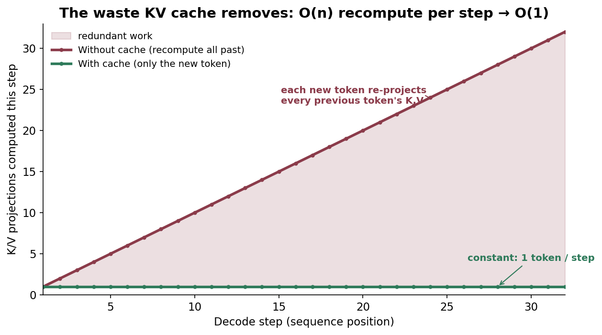
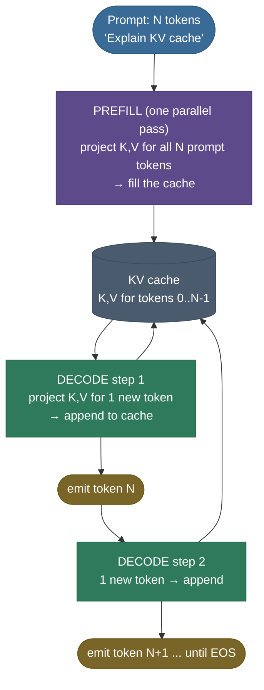
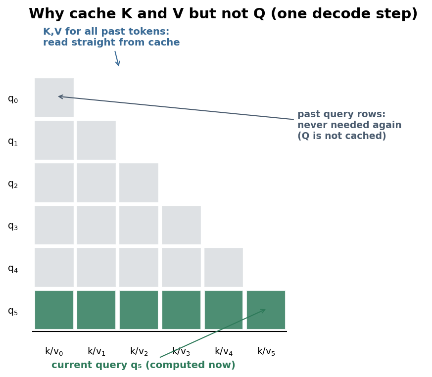
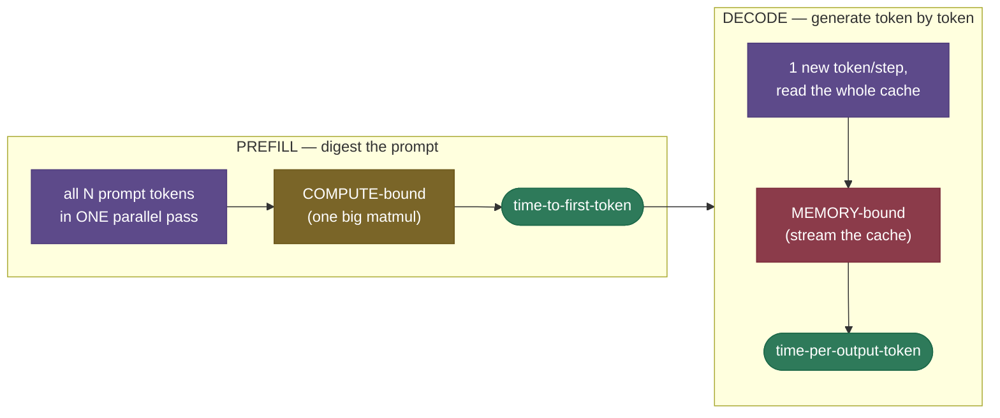
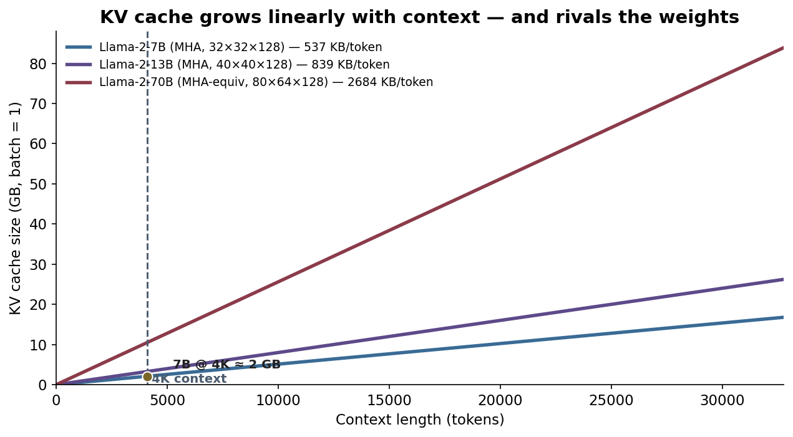
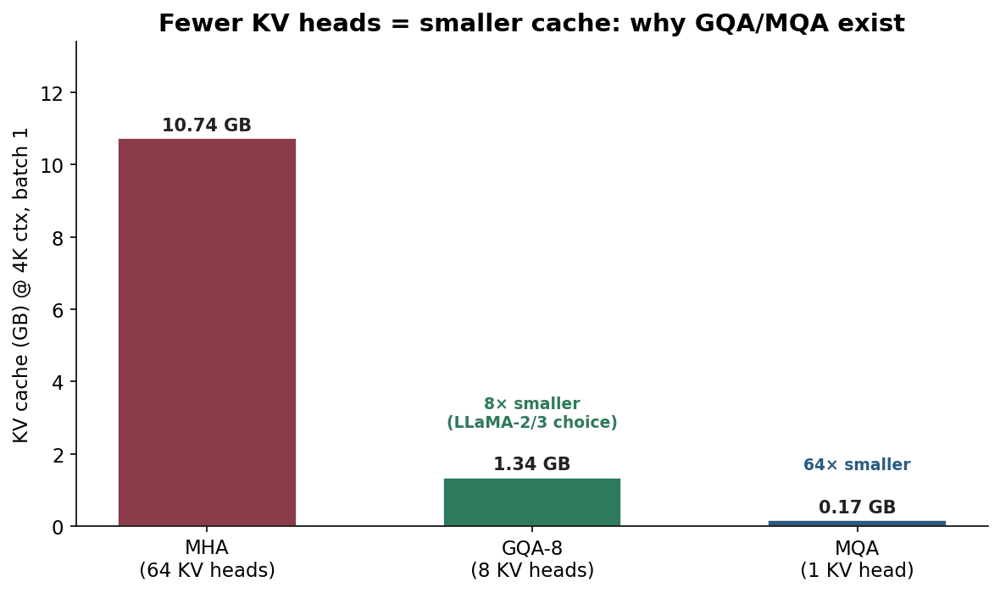

# KV Cache: don't recompute the past

Imagine writing an essay where, before you add each new word, you re-read the entire essay from the very first word — out loud, start to finish — just to decide what comes next. Write word 500 and you've re-read 499 words; write word 1,000 and you've re-read 999. That is *exactly* what a transformer does when it generates text without a **KV cache**: every new token reruns attention over every token that came before, recomputing the same numbers it already computed a step ago. The KV cache is the sticky note that says *"you already worked this out — here it is"*, and it is the single most important optimization in LLM inference.

I'm going to walk this the way I'd actually explain it to a teammate staring at an out-of-memory error in production. We'll start with *why* the cache has to exist (feel the waste), then *what* it is and *why it's K and V and not Q*, then the two phases of inference it creates, then the memory math that decides what you can serve — and finally the four levers (GQA, paging, quantization, windowing) that the entire LLM-serving industry uses to keep that memory in check. By the end you'll be able to:

- explain **what** is cached and **why only K and V** (never Q);
- **compute** the cache footprint for a real model and **size a deployment** from it;
- explain why generation has **two phases** (prefill vs decode) with totally different bottlenecks;
- reason from first principles about why decode is **memory-bandwidth bound**, using arithmetic intensity;
- explain the four levers — **MQA/GQA, PagedAttention, quantized caches, sliding-window** — and *when* to reach for each;
- prove in runnable code that the cache changes **nothing** about the output, only the speed.

> **Note:** the cache is a *speed and memory* mechanism, not a *modeling* one. It changes **nothing** about the output — with or without it, the model produces the identical tokens (we prove this in code below). It only changes how fast, and how much VRAM, that takes.

---

## The problem: autoregressive decoding repeats itself

To see why the cache exists, you have to feel the waste it removes.

LLMs generate **autoregressively** — ***one token at a time, each new token conditioned on every token before it***. To produce token $t$, the model runs self-[attention](../../05.%20Deep_Learning/concepts/15-Attention-Mechanism.md): it forms a **query** for the current position and compares it against a **key** for every previous position, then mixes the corresponding **values**. So far so good. The catch is what happens on the *next* step. Naively, to produce token $t+1$ you run the whole sequence through the model again — which recomputes the keys and values for tokens $1 \dots t$, *the very same keys and values you computed one step ago*.

And here is the crucial observation that makes the whole optimization possible:

> **Note:** in a causal (decoder-only) transformer, the key and value vectors for a token depend **only on that token and the ones before it** — never on anything that comes after. So once token 5's K and V are computed, they are **frozen for the rest of the generation**. Recomputing them on every subsequent step produces bit-for-bit identical numbers. That redundancy is pure waste.

How much waste? At decode step $t$ the naive approach re-projects K and V for all $t$ positions; summed over a sequence of length $n$ that's $1 + 2 + \dots + n = \tfrac{n(n+1)}{2}$ projections — **quadratic** in sequence length. The cache turns each step into a single new projection — **linear** overall.



> **Gotcha:** people often say the cache makes attention "$O(n)$ instead of $O(n^2)$." Be precise in an interview: the cache removes the redundant *recomputation of K/V projections (and the rest of the forward pass) for past tokens*. The attention **scores** for the current token still touch all $n$ past keys, so a single step's attention is still $O(n)$ — what you save is never redoing the past tokens' work again.

---

## What it is

A **KV cache** is a per-layer buffer that stores the **key** and **value** vectors of every token processed so far. With it, generation splits into two phases:

- ***Prefill*** — process the entire prompt in **one parallel pass**, computing and storing K and V for all prompt tokens. This fills the cache.
- ***Decode*** — generate one token at a time. Each step computes K and V for **only the single new token**, appends them to the cache, and attends over the whole cache.

That's the whole idea: **compute each token's K and V exactly once, then reuse them forever.**



> **See it in 3D:** Brendan Bycroft's [interactive LLM visualizer](https://bbycroft.net/llm) walks a single token through the *entire* forward pass of a small GPT — the clearest way to actually *see* where the K and V vectors are produced, per layer, that the cache then stores.

---

## Intuition: the running tab

Think of a bartender keeping a **running tab**. Without a tab, every time you order a drink they re-add every drink you've had all night from the receipts to know your total — slower with every round. With a tab, they keep the current total written down and just **add the new drink**. The KV cache is that tab: the model keeps the "running context" (everyone's keys and values) written down, and each new token only adds its own line.



---

## Why cache K and V, but never Q

The reason it's K and V specifically — and the single most-asked KV-cache interview question — is about **who needs to talk to whom**. When the model generates a new token, that token's *query* needs to ask a question of *all the past tokens' keys*, and gather *all the past tokens' values*. But the past tokens have already had their turn speaking; **their queries did their job and will never be asked again.** So you keep what future tokens will need (the keys and values) and discard what's already spent (the past queries).

> **Note:** the clean answer: **Q is per-step and disposable; K and V are per-token and reused.** Each decode step has exactly one new query; it never revisits old queries, but it *does* revisit every old key and value.

> **Note:** notice there's **no attention mask** in a decode step — the single new query attends to *every* entry in the cache, and that's automatically causal because the cache only ever holds past tokens. The triangular causal mask you learned about only matters during **prefill** (and training), where many query positions are processed in one pass.

---

## The two phases: prefill vs decode

The cache cleanly splits inference into two phases with **opposite performance characteristics** — and confusing them is the root of most serving mistakes.



- **Prefill** processes *all N prompt tokens at once* — a big, dense matmul that keeps the GPU's compute units busy. It's **compute-bound**, and it sets your **time-to-first-token (TTFT)**.
- **Decode** processes *one token at a time*, and the dominant cost is *reading the weights and the cache out of memory* to do very little math. It's **memory-bound**, and it sets your **time-per-output-token (TPOT)**.

> **Tip:** this split is why serving dashboards report **two latency numbers** (TTFT and TPOT) — they have different bottlenecks, so optimizing one rarely helps the other. It's also why modern engines do **chunked prefill** (interleave prefill chunks with decode steps so a long prompt doesn't stall everyone else's token stream) and **continuous batching** (swap finished requests out and new ones in every step, instead of waiting for the whole batch to finish).

> **Tip:** **speculative decoding** is a clever exploit of the memory-bound decode. Since the GPU is idle waiting on memory anyway, a small *draft* model proposes several tokens, and the big model **verifies them all in one forward pass** (a mini-prefill) for roughly the cost of generating one — accepting the longest correct prefix. It needs the cache to tentatively hold the speculated tokens and **roll back** the rejected ones, which is one more reason a paged, block-addressable cache is so convenient.

---

## How it works: the cache tensor and the append

Concretely, the cache for one layer is a pair of tensors shaped `[batch, n_kv_heads, seq_len, head_dim]` — one for K, one for V — and the model holds one such pair **per layer**. The lifecycle:

1. **Prefill.** Run the prompt (length $N$) through every layer once. Each layer projects K and V for all $N$ tokens and writes them into its cache. The `seq_len` dimension is now $N$.
2. **Decode step.** Take the single newest token. In each layer: project its $q, k, v$; **append** $k, v$ to that layer's cache (now length $N{+}1$); compute attention of the one query against the full cached K/V; produce the next token.
3. **Repeat** until an end-of-sequence token or the length limit. Each step grows every layer's cache by one position.

The word "append" hides an important production detail: in a real engine it is an **in-place write into a pre-allocated buffer**, not a fresh allocation. The cache is allocated once (a contiguous slab, or paged blocks), and each step writes the new token's K/V into the next slot and bumps a length counter. Growing the tensor with a `torch.cat` *every step* — as the teaching code below does for clarity — would re-allocate and copy the entire cache on each token, turning an $O(n)$ win back into an $O(n^2)$ disaster. So the real lifecycle is **allocate once → write in place per step → free on completion**.

> **Watch it grow:** this [interactive KV-cache explainer](https://mbrenndoerfer.com/writing/kv-cache-transformer-attention-optimization) animates the cache filling during prefill and then growing by exactly one token per decode step — the lifecycle above, in motion.

> **Gotcha:** the cache grows on **every** step and is **never** freed mid-sequence — it only releases when the request finishes. A naive engine therefore reserves memory for the *worst-case* length a request might reach, which wastes most of it (a request that stops at 50 tokens still holds a 4,096-token reservation). That waste is exactly the problem **PagedAttention** solves — see Lever 2.

---

## The math: how big is the cache, really

This is the formula worth memorizing, because interviewers ask you to derive it on the spot:

$$\text{cache bytes} \;=\; 2 \times n_{\text{layers}} \times n_{\text{kv\_heads}} \times d_{\text{head}} \times \text{seq\_len} \times \text{batch} \times \text{bytes per element}$$

The leading **2** is for storing both **K** and **V**. Everything else is just "how many numbers, at what precision."

> *Where this comes from: the formula falls directly out of the per-layer attention shapes in **Attention Is All You Need** (Vaswani et al. 2017, §3.2), and is worked through explicitly in **Transformer Inference Arithmetic** (Kipply) and **Transformer Math 101** (EleutherAI) — all three in the references.*

**Worked example 1 — cache per token (Llama-2-7B, FP16).** Its config: $n_{\text{layers}}=32$, $n_{\text{kv\_heads}}=32$, $d_{\text{head}}=128$, and FP16 = 2 bytes. Per token:

$$2 \times 32 \times 32 \times 128 \times 2 \;=\; 524{,}288 \text{ bytes} \;\approx\; \mathbf{0.5\ MiB\ per\ token.}$$

So a single sequence at a **4,096-token** context holds $4096 \times 0.5\,\text{MiB} \approx \mathbf{2\ GiB}$ of cache. The model's weights are 7B × 2 bytes ≈ **14 GB**. The cache for *one* sequence is already ~14% of the weights — and it scales with **batch size**.



> **Note:** this is why the **batch size you can serve is usually capped by the KV cache, not by the weights**. Weights are a fixed one-time cost; the cache is paid *per sequence per token*. Run a batch of 32 sequences at 4K context on that 7B model and you're looking at ~64 GB of cache — more than the weights, and more than an 80 GB A100 has room for after weights and activations.

**Worked example 2 — how many requests fit on one GPU?** Take an 80 GB A100 serving that 7B model. Weights take ~14 GB and activations/overhead another ~6 GB, leaving **~60 GB for the cache**. At 0.5 MiB/token a 4K-context request needs 2 GiB, so you fit $60 / 2 \approx \mathbf{30}$ concurrent requests — and *that*, not the weights, is your throughput ceiling. Now switch to **GQA with 8 KV heads** (down from 32): the cache shrinks 4× to 0.125 MiB/token, i.e. 0.5 GiB/request, so the same GPU now holds $60 / 0.5 \approx \mathbf{120}$ requests. **Same hardware, 4× the throughput — purely from shrinking the cache.** That single calculation is *why* GQA exists, and why it's the first lever you reach for.

**Worked example 3 — the long-context wall (128K).** Now push context to 128K tokens. At 0.5 MiB/token (7B MHA) that's $131072 \times 0.5\,\text{MiB} = \mathbf{64\ GiB}$ for **one** sequence — it alone overflows an 80 GB GPU once you add the 14 GB of weights. GQA-8 cuts it to 16 GiB; add an FP8 cache and it's 8 GiB; page it so you only allocate what's used, and now a handful of 128K requests coexist. This is *exactly* how "128K-context" models are served in practice — **not** by one trick but by the whole stack (GQA + quantized cache + paging) applied at once. Without them, long context is simply impossible.

---

## Why decode is memory-bound (from first principles)

It's worth deriving this, because it's the insight the rest of the field is built on. The relevant quantity is **arithmetic intensity** — FLOPs done per byte moved from memory.

A single decode step (batch 1) pushes one token through the model: roughly $2 \times \text{params}$ FLOPs ≈ **14 GFLOP** for a 7B model. To do it, the GPU must **read every weight** (14 GB in FP16) plus the cache. So:

$$\text{arithmetic intensity} \approx \frac{14\times10^9 \text{ FLOP}}{14\times10^9 \text{ bytes}} \approx \mathbf{1\ \text{FLOP/byte}}.$$

> *Where this comes from: the **roofline model** that pits arithmetic intensity against the compute-to-bandwidth ratio is Williams, Waterman & Patterson, "Roofline" (CACM 2009); its application to transformer decode — establishing that autoregressive generation is memory-bound — is laid out in **Efficiently Scaling Transformer Inference** (Pope et al. 2022, in the references).*

An A100 does ~312 TFLOP/s of compute but only ~2 TB/s of memory bandwidth — a ratio of ~**156 FLOP/byte** before compute becomes the limit. At an intensity of ~1, decode is **deeply** memory-bound: the compute units sit ~99% idle, waiting on memory. The cure is **batching**: process $B$ sequences together and you read each weight **once** but do $B\times$ the math, multiplying arithmetic intensity by $B$ and walking toward the compute-bound regime. That's why throughput-oriented serving batches aggressively — and why, once weights are amortized across a big batch, the **KV cache** becomes the bytes you're actually moving, so shrinking it (GQA, FP8) translates almost directly into more tokens/second.

> **Tip:** when you hear "we doubled inference throughput by quantizing the KV cache to FP8," translate it: they **halved the bytes the GPU has to stream per token.** In a bandwidth-bound regime, halving the bytes ≈ doubling the speed. The cache size *is* the speed.

---

## Reading the cache: FlashAttention and FlashDecoding

Shrinking the cache reduces the *bytes*; the attention **kernel** decides how efficiently you move them. Standard attention materializes the full $n \times n$ score matrix in slow HBM, costing $O(n^2)$ memory traffic — wasteful, and for long context impossible to fit. **FlashAttention** ([Dao et al. 2022](https://arxiv.org/abs/2205.14135)) computes the *same* result **without ever materializing that matrix**: it tiles K and V into blocks, streams them through fast on-chip SRAM, and keeps a **running softmax** (the *online-softmax* trick) so each output is accumulated block by block. The result is exact attention at $O(n)$ memory and far fewer HBM round-trips.

Decode has a twist: the query is a *single* token, so the usual parallelism (over many query positions) vanishes — one query against a long cache leaves the GPU underused. **FlashDecoding** restores it by **parallelizing over the cache's key/value dimension**: split the cached sequence into chunks, attend the lone query to each chunk in parallel, then combine the partial softmaxes. For long contexts this keeps even a single decode step bandwidth-saturated.

> **Note:** the cache and the kernel are complementary. The cache (plus GQA/MLA/quantization) sets *how many bytes* must be read; FlashAttention/FlashDecoding set *how close to peak bandwidth* you read them. A real long-context stack needs both — which is why "GQA + paging + FP8 + FlashAttention" is the recurring four-part recipe.

---

## Where it is used, and when it isn't

**Used:** in essentially every autoregressive LLM at **inference** time. Every serving stack — [vLLM](https://github.com/vllm-project/vllm), TGI, TensorRT-LLM, llama.cpp — is built around a KV cache, and most of their cleverness is in *managing* it.

**Not used / not needed:**

- **Training.** Training uses *teacher forcing* — the entire target sequence is known up front and processed in **one parallel pass**, so there's nothing to cache across steps. The cache is purely an *autoregressive-generation* trick.
- **Prefill itself.** The prompt is processed in parallel, so prefill doesn't benefit from the cache — it *creates* it.
- **Encoder-only models** (BERT-style) that don't generate autoregressively.

> **Note:** encoder–decoder models (T5, Whisper) *do* use a KV cache — two, in fact. The decoder caches its own **self-attention** K/V each step, *and* it caches the **cross-attention** K/V, which are computed once from the encoder output and reused for every generated token.

> **Gotcha:** because the cache is an inference-only concept, it's easy to forget it when estimating deployment memory from a training recipe. A model that trained comfortably can still OOM in production purely from KV-cache growth at long context or high batch — the weights fit, the *cache* doesn't.

---

## Lever 1: fewer KV heads — MQA and GQA

The biggest lever is architectural: **share K and V across query heads** so there are simply fewer of them to store.

- ***MHA*** (multi-head attention) — every query head has its own K/V head. Biggest cache.
- ***MQA*** (multi-query attention) — *all* query heads share **one** K/V head. Tens× smaller cache, but a noticeable quality cost.
- ***GQA*** (grouped-query attention) — query heads share K/V in **groups** (e.g. 8 KV heads serving 64 query heads). The sweet spot, used by Llama-2/3, Mistral, and most modern models.



It works because the formula has $n_{\text{kv\_heads}}$ as a direct multiplier: cut KV heads from 64 to 8 and the cache shrinks **8×**, with the query heads (and thus most of the model's expressiveness) untouched. GQA keeps almost all of MHA's quality while paying MQA-like memory.

> **Note:** GQA is *the* reason a modern 70B model is servable at long context — an 8× cut to the dominant memory cost. If you're choosing a base model for long-context serving, **check its KV-head count**, not just its parameter count.

The frontier of this lever is **Multi-head Latent Attention (MLA)** (DeepSeek-V2/V3). Instead of storing K and V per head, MLA caches a single **low-rank latent vector** per token and reconstructs the per-head K and V on the fly with a learned up-projection. The cached object is far smaller than even GQA's — often a *several-fold* further reduction — while keeping close to full-MHA quality. It's the same idea taken to its limit: don't just share the numbers, **compress** them.

> **Gotcha:** MQA/GQA/MLA are **architectural** — they're baked in at pretraining and you can't bolt them onto an existing MHA model without retraining (or a conversion + light fine-tune). The runtime levers below (paging, quantization, windowing) are the ones you *can* apply to a model you've already got.

---

## Lever 2: PagedAttention — page the cache like virtual memory

Even with a small per-token cache, the *allocation* is wasteful. A naive engine gives each request one **contiguous** block sized for the worst-case length. Two pathologies follow: **internal fragmentation** (a request that stops at 50 tokens still holds its 4,096-token reservation) and **external fragmentation** (free gaps too small to fit a new request). Real systems waste 60–80% of cache memory this way.

**PagedAttention** ([vLLM](https://arxiv.org/abs/2309.06180)) borrows the operating-system trick of **virtual memory**: store the cache in small fixed-size **blocks** (e.g. 16 tokens each), with a per-request **block table** mapping logical positions to physical blocks — exactly like an OS page table maps virtual to physical pages. Memory is allocated **on demand**, one block at a time, so a request only ever holds blocks for the tokens it actually generated; there's near-zero waste, and the attention kernel just gathers the scattered blocks via the block table. By reclaiming the 60–80% that fragmentation used to waste, vLLM packs far more concurrent requests onto a GPU and reports **2–4× the throughput** of the contiguous-allocation systems that came before it.

> **Tip:** paging unlocks a second win — **sharing**. Because blocks are addressable, two requests with the same **prefix** (e.g. a shared system prompt, or beam-search branches) can *point at the same physical blocks*, copying-on-write only when they diverge. **Automatic prefix caching** built on this can make agent and chat workloads with long fixed system prompts dramatically cheaper.

---

## Lever 3: quantize the cache

The cache is just numbers, and you rarely need 16 bits of precision for them. Storing K and V in **FP8 or INT8** instead of FP16 **halves or quarters** the bytes — and because decode is bandwidth-bound, fewer bytes streamed per token is *directly* faster, on top of fitting more requests. **FP8** is hardware-native on recent GPUs (Hopper) and often essentially lossless; **INT8** needs **per-token or per-channel scales** to handle outliers; research schemes like **KIVI** push K to ~2 bits by quantizing it per-channel and V per-token — exploiting exactly the asymmetry below.

> **Gotcha:** it's not free quality-wise. **Keys are more sensitive** to quantization than values (a few outlier channels dominate the attention scores), which is why good schemes use **per-channel or per-token scales** and sometimes quantize K and V asymmetrically. FP8 is often near-lossless; INT4 needs care. If you turn on a quantized cache, **measure quality**, don't assume it's free.

---

## Lever 4: bound the context — sliding window and attention sinks

The other levers shrink bytes-per-token; this one caps the **number of tokens**. If you don't truly need unbounded history, keep only the most recent $w$ tokens:

- **Sliding-window attention** (Mistral) — each token attends only to the last $w$ tokens, so the cache never exceeds $w$ entries regardless of how long the conversation runs.
- **Attention sinks** ([StreamingLLM](https://arxiv.org/abs/2309.17453)) — keep the first few tokens *plus* the recent window. The surprising finding is that those first "sink" tokens are load-bearing: the softmax needs somewhere to dump attention mass, and dropping them collapses quality. Keep ~4 sink tokens + the window and you get stable, **infinite-length** streaming at bounded memory.

> **Tip:** these four levers **compose**. A production stack serving "128K context efficiently" is usually **GQA + PagedAttention + FP8 cache** (and FlashAttention for the compute side), with windowing layered on for truly endless streams. Each lever attacks a different term of the cache-bytes formula.

---

## The cache in real models

Tying the levers to models you've heard of makes them concrete:

- **Llama-3** — GQA with 8 KV heads (serving up to 64 query heads), so the cache is ~8× smaller than MHA — which is what makes its 8K–128K context servable on commodity GPUs.
- **Mistral 7B** — GQA **plus** a **sliding window** of 4,096 tokens, so the cache is capped no matter how long the conversation runs.
- **DeepSeek-V2/V3** — **MLA**, caching a compact low-rank latent per token: the most aggressive architectural cache compression shipped in a frontier model.
- **Every serving engine** (vLLM, TGI, TensorRT-LLM) — **PagedAttention**-style block management underneath, increasingly with an **FP8 cache** option and **automatic prefix caching** for shared system prompts.

> **Note:** **beam search** multiplies the cache by the beam width — each beam is a distinct continuation needing its own K/V. A paged, block-addressable cache makes this cheap: the beams **share** the blocks of their common prefix and only fork (copy-on-write) where they diverge. Same trick, again: address the cache in blocks and sharing falls out for free.

---

## Two systems-level wins: prefix caching and disaggregation

The four levers shrink the cache; two serving-architecture ideas change *how it's used* across requests and machines.

**Prefix caching.** Many requests share a long, identical **prefix** — a fixed system prompt, a few-shot preamble, a document everyone asks about. Naively, each request re-runs prefill over that whole prefix. **Prefix caching** computes it **once** and reuses the resulting KV blocks for every request that shares it (vLLM's *automatic prefix caching*; SGLang's **RadixAttention**, which organizes cached prefixes in a radix tree for fast longest-prefix matching). For agent and chat workloads with multi-thousand-token system prompts, this turns most of prefill into a cache hit — a large latency and cost win.

**Disaggregated prefill/decode.** Recall the two phases have *opposite* bottlenecks: prefill is **compute-bound**, decode is **memory-bound**. Running both on the same GPU means a long prompt's prefill stalls everyone else's decode (chunked prefill only juggles the conflict). **Disaggregation** runs prefill on one pool of GPUs and decode on another, **transferring the KV cache** between them over a fast interconnect. Each pool is tuned for its own bottleneck, and a heavy prefill no longer hurts token latency for every other user. It's how several of the largest deployments hit their latency targets at scale.

> **Note:** both ideas are practical only *because* the cache is **addressable in blocks** (Lever 2). Prefix caching **shares** blocks across requests; disaggregation **ships** blocks across machines. Paging isn't merely a memory optimization — it's the substrate the modern serving stack is built on.

---

## Sizing a real deployment: putting it together

Here's the reasoning I'd actually do, end to end, given "serve Llama-3-8B chat on one A100-80GB, 8K context, max throughput":

1. **Per-token cache.** Llama-3-8B uses **GQA with 8 KV heads** ($n_{\text{layers}}=32$, $d_{\text{head}}=128$): $2\times32\times8\times128\times2 \approx 0.125$ MiB/token.
2. **Per-request cache.** 8K context → $8192 \times 0.125 \approx 1$ GiB/request.
3. **Budget.** 80 GB − ~16 GB weights − ~6 GB overhead ≈ **58 GB for cache** → ~**58 concurrent requests**.
4. **Need more?** Turn on an **FP8 cache** (→ 0.5 GiB/request → ~116 requests) and **PagedAttention** (so short requests don't hold 8K reservations). 
5. **Endless chat?** Add **sliding-window + sinks** so a never-ending conversation can't grow the cache without bound.

Every step is just the formula plus one lever. That's the whole job.

---

## Production failure modes

The cache is also where a surprising number of production incidents live — worth knowing before they page you at 2 a.m.:

- **Context bleed.** If the cache isn't **reset between requests** (or a pooled buffer is reused without clearing), one user's tokens can leak into another's generation — a correctness *and* privacy bug. Key the cache strictly to the request.
- **OOM under load spikes.** The cache grows with concurrency × length, so a burst of long requests can overflow VRAM *mid-generation*. Robust engines apply **admission control** and **preemption** — vLLM can evict a request's cache and **recompute** it later rather than crash — but if you planned capacity from the *weights*, a spike still takes you down.
- **Silent quality loss from a quantized cache.** Turning on FP8/INT8 to fit more requests can quietly degrade outputs (keys are sensitive). **Measure** win-rate before and after; don't ship it on faith.
- **Stale prefix cache.** If a shared prefix's content changes but its cache key doesn't, every request reuses the wrong KV. Invalidate on prefix change.
- **Capacity sized from the wrong number.** The most common planning error: budgeting GPUs from parameter count and forgetting the cache. Size from **Worked example 2**, not from the weights.

---

## Code: prove it, then time it

Here's a from-scratch single-layer attention that runs the decode loop **both ways** — recomputing everything vs. keeping a cache — and checks that the outputs are bit-for-bit identical, then times them. It runs on CPU in a few seconds; no GPU needed.

```python
"""From-scratch KV cache: prove identical outputs, then time the speedup.
Verified on Python 3.12 (torch 2.12), CPU."""
import time, torch, torch.nn.functional as F

torch.manual_seed(0)
d_model, n_heads, head_dim = 512, 8, 64
assert n_heads * head_dim == d_model
Wq = torch.randn(d_model, d_model) * 0.02
Wk = torch.randn(d_model, d_model) * 0.02
Wv = torch.randn(d_model, d_model) * 0.02

def split_heads(x):                 # (T, d_model) -> (n_heads, T, head_dim)
    T = x.shape[0]
    return x.view(T, n_heads, head_dim).transpose(0, 1)

def attn_step(q_t, K, V):           # q_t:(n_heads,1,head_dim)  K,V:(n_heads,T,head_dim)
    scores = (q_t @ K.transpose(-1, -2)) / head_dim ** 0.5   # query attends all cached keys
    return (F.softmax(scores, dim=-1) @ V).transpose(0, 1).reshape(1, d_model)

N = 1024
emb = torch.randn(N, d_model) * 0.1   # a fixed stream of token embeddings to "decode"

def decode_no_cache():                # every step re-projects K,V for ALL tokens so far
    outs = []
    for t in range(1, N + 1):
        ctx = emb[:t]
        K, V = split_heads(ctx @ Wk), split_heads(ctx @ Wv)   # recomputed from scratch
        q_t = split_heads(emb[t-1:t] @ Wq)
        outs.append(attn_step(q_t, K, V))
    return torch.cat(outs, 0)

def decode_with_cache():              # project only the NEW token, append to the cache
    outs, K_cache, V_cache = [], None, None
    for t in range(1, N + 1):
        new = emb[t-1:t]
        k_new, v_new = split_heads(new @ Wk), split_heads(new @ Wv)
        K_cache = k_new if K_cache is None else torch.cat([K_cache, k_new], dim=1)
        V_cache = v_new if V_cache is None else torch.cat([V_cache, v_new], dim=1)
        outs.append(attn_step(split_heads(new @ Wq), K_cache, V_cache))
    return torch.cat(outs, 0)

a, b = decode_no_cache(), decode_with_cache()
print("outputs identical:", torch.allclose(a, b, atol=1e-5), "| max diff:", f"{(a-b).abs().max():.2e}")

def timeit(fn, reps=5):
    fn()
    t0 = time.perf_counter()
    for _ in range(reps): fn()
    return (time.perf_counter() - t0) / reps * 1e3

ms_no, ms_yes = timeit(decode_no_cache), timeit(decode_with_cache)  # ms per full decode
print(f"no-cache : {ms_no:6.1f} ms")
print(f"kv-cache : {ms_yes:6.1f} ms")
print(f"speedup  : {ms_no/ms_yes:5.1f}x  (grows with sequence length)")
```

Output on a laptop CPU:

```
outputs identical: True | max diff: 0.00e+00
no-cache :  530.6 ms
kv-cache :  297.6 ms
speedup  :   1.8x  (grows with sequence length)
```

> **Note:** the headline is **`max diff: 0.00e+00`** — the cache changes nothing about *what* the model produces, only *how fast*. The ~1.8× here is modest because this is a single tiny layer on CPU; in a real multi-layer model the saved work (every layer's projections **and** MLPs for past tokens) compounds, and the gap widens with sequence length. The conceptual win — $O(n^2) \to O(n)$ recompute — is the shape of that curve, not this one number.

> **Tip:** to see the real thing, call `model.generate(..., use_cache=True)` vs `use_cache=False` in Hugging Face on a long generation and watch the wall-clock diverge. Same idea, full model.

---

## Recap and rapid-fire

**If you remember nothing else:** during autoregressive decoding a token's K and V never change once computed — so cache them and recompute only the *new* token's. This turns per-step work from O(n) recompute into O(1), splits inference into a compute-bound **prefill** and a memory-bound **decode**, and costs VRAM that **grows linearly with tokens × batch** — the real cap on how much you can serve. The four levers — **GQA/MQA, PagedAttention, quantized caches, sliding-window** — each attack a different term of the cache-size formula.

**Quick-fire — say these out loud:**

- *Why cache K and V but not Q?* Each step has one new, disposable query; K and V are per-token and reused by every future query.
- *Cache for Llama-2-7B at 8K context, batch 1?* 0.5 MiB/token × 8192 ≈ **4 GiB**.
- *Prefill vs decode?* Prefill = one parallel, compute-bound pass (sets TTFT); decode = one-token-at-a-time, memory-bound loop (sets TPOT).
- *Why is decode memory-bound?* Arithmetic intensity ≈ 1 FLOP/byte vs the GPU's ~156 — it moves bytes, barely computes; batching fixes it.
- *What does GQA change in the formula?* It shrinks `n_kv_heads` (e.g. 64 → 8), cutting the cache proportionally.
- *What does PagedAttention fix?* Memory fragmentation — page the cache into blocks (OS-style) for near-zero waste + prefix sharing.
- *How is 128K context actually served?* The full stack at once: GQA + quantized cache + paging (+ windowing for endless streams).
- *Does the cache change the output?* No — bit-for-bit identical; it only changes speed and memory.

---

## References and further reading

The curated link library for this topic — videos, courses, articles, papers, books, and internal cross-links — lives in a companion file so it can be reused as a standalone reference list:

**→ [KV Cache — references and further reading](05-KV-Cache.references.md)**
