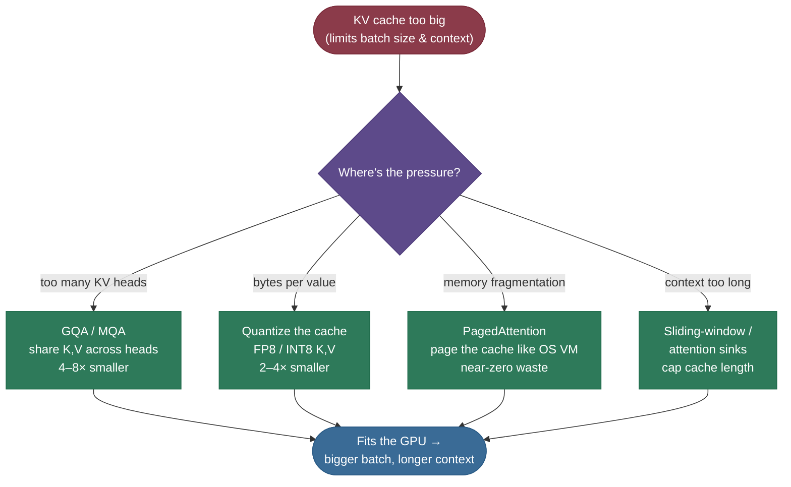

# KV Cache: don't recompute the past

Imagine writing an essay where, before you add each new word, you re-read the entire essay from the very first word — out loud, start to finish — just to decide what comes next. Write word 500 and you've re-read 499 words; write word 1,000 and you've re-read 999. That is *exactly* what a transformer does when it generates text without a **KV cache**: every new token reruns attention over every token that came before, recomputing the same numbers it already computed a step ago. The KV cache is the sticky note that says *"you already worked this out — here it is"*, and it is the single most important optimization in LLM inference.

By the end of this page you'll be able to explain **what** is cached and **why only K and V** (never Q), **compute** the cache's memory footprint for a real model, reason about why decoding is **memory-bandwidth bound rather than compute bound**, and connect the cache to the techniques that exist *because* of it — **GQA/MQA, PagedAttention, and quantized caches**. I'll write it the way I'd explain it to a teammate debugging an out-of-memory error in production: the intuition first, then the math, then the code you can run today, then the step-by-step playbook. Read it top-to-bottom once for the story; the formulas, numbers, and runnable snippets are inline when you sit down to use them.

> **Note:** the cache is a *speed and memory* mechanism, not a *modeling* one. It changes **nothing** about the output — with or without it, the model produces the identical tokens (we prove this in code below). It only changes how fast, and how much VRAM, that takes.

---

## The problem: autoregressive decoding repeats itself

To see why the cache exists, you have to feel the waste it removes.

LLMs generate **autoregressively** — ***one token at a time, each new token conditioned on every token before it***. To produce token $t$, the model runs self-[attention](../../05.%20Deep_Learning/concepts/15-Attention-Mechanism.md): it forms a **query** for the current position and compares it against a **key** for every previous position, then mixes the corresponding **values**. So far so good. The catch is what happens on the *next* step. Naively, to produce token $t+1$ you run the whole sequence through the model again — which recomputes the keys and values for tokens $1 \dots t$, *the very same keys and values you computed one step ago*.

And here is the crucial observation that makes the whole optimization possible:

> **Note:** in a causal (decoder-only) transformer, the key and value vectors for a token depend **only on that token and the ones before it** — never on anything that comes after. So once token 5's K and V are computed, they are **frozen for the rest of the generation**. Recomputing them on every subsequent step produces bit-for-bit identical numbers. That redundancy is pure waste.

How much waste? At decode step $t$ the naive approach re-projects K and V for all $t$ positions; summed over a sequence of length $n$ that's $1 + 2 + \dots + n = \tfrac{n(n+1)}{2}$ projections — **quadratic** in sequence length. The cache turns each step into a single new projection — **linear** overall.


**Gotcha:** people often say the cache makes attention "$O(n)$ instead of $O(n^2)$." Be precise in an interview: the cache removes the redundant *recomputation of K/V projections (and the rest of the forward pass) for past tokens*. The attention **scores** for the current token still touch all $n$ past keys, so a single step's attention is still $O(n)$ — what you save is never redoing the past tokens' work again.

---

## What it is

A **KV cache** is a per-layer buffer that stores the **key** and **value** vectors of every token processed so far. With it, generation splits into two phases:

- ***Prefill*** — process the entire prompt in **one parallel pass**, computing and storing K and V for all prompt tokens. This fills the cache.
- ***Decode*** — generate one token at a time. Each step computes K and V for **only the single new token**, appends them to the cache, and attends over the whole cache.

That's the whole idea: **compute each token's K and V exactly once, then reuse them forever.**


> **Tip:** the prefill/decode split is why you see **two different latency numbers** in serving dashboards — *time-to-first-token* (dominated by prefill, a big parallel matmul) and *time-per-output-token* (dominated by decode, which is memory-bound). They have completely different performance characteristics; optimizing one rarely helps the other.

---

## Intuition: the running tab

Think of a bartender keeping a **running tab**. Without a tab, every time you order a drink they re-add every drink you've had all night from the receipts to know your total — slower with every round. With a tab, they keep the current total written down and just **add the new drink**. The KV cache is that tab: the model keeps the "running context" (everyone's keys and values) written down, and each new token only adds its own line.

The reason this works — and the reason it's K and V specifically — is about **who needs to talk to whom**. When the model generates a new token, that token's *query* needs to ask a question of *all the past tokens' keys*, and gather *all the past tokens' values*. But the past tokens have already had their turn speaking; **their queries did their job and will never be asked again.** So you keep what future tokens will need (the keys and values) and discard what's already spent (the past queries).


> **Note:** this is the cleanest way to answer the classic interview question *"why cache K and V but not Q?"* — **Q is per-step and disposable; K and V are per-token and reused.** Each decode step has exactly one new query; it never revisits old queries, but it does revisit every old key and value.

> **Note:** notice there's **no attention mask** in a decode step — the single new query attends to *every* entry in the cache, and that's automatically causal because the cache only ever holds past tokens. The triangular causal mask you learned about only matters during **prefill** (and training), where many query positions are processed in one pass.

---

## Why it matters

Two payoffs, one cost.

**Payoff 1 — compute.** You stop redoing the past tokens' forward work on every step. For long generations this is the difference between a chatbot that streams and one that crawls, because the redundant work grows with how much you've already written.

**Payoff 2 — it changes the bottleneck.** Once you're not recomputing, each decode step does very little *math* (one token's worth) but must *read the entire cache from memory* to attend over it. Decoding becomes ***memory-bandwidth bound*** — limited by how fast the GPU can move the cache out of HBM, not by how fast it can multiply. This single fact explains most of modern inference engineering.

**The cost — memory.** The cache has to live in GPU memory and it **grows with every token**. That growth is the central tension of LLM serving, and the whole back half of this page is about managing it.

> **Tip:** "decode is memory-bound" is the load-bearing insight for an LLM-serving interview. It's *why* batching many requests together is so valuable (you read the weights once and amortize them over many sequences), and *why* shrinking the cache — GQA, quantization — directly buys throughput.

---

## How it works: prefill, decode, append

Concretely, the cache for one layer is a pair of tensors shaped `[batch, n_kv_heads, seq_len, head_dim]` — one for K, one for V — and the model holds one such pair **per layer**. The lifecycle:

1. **Prefill.** Run the prompt (length $N$) through every layer once. Each layer projects K and V for all $N$ tokens and writes them into its cache. The `seq_len` dimension is now $N$.
2. **Decode step.** Take the single newest token. In each layer: project its $q, k, v$; **append** $k, v$ to that layer's cache (now length $N{+}1$); compute attention of the one query against the full cached K/V; produce the next token.
3. **Repeat** until an end-of-sequence token or the length limit. Each step grows every layer's cache by one position.

> **Gotcha:** the cache grows on **every** step and is **never** freed mid-sequence — it only releases when the request finishes. A serving system therefore has to reserve memory for the *worst-case* length a request might reach, which is exactly the fragmentation problem PagedAttention was built to solve (more below).

---

## The math: how big is the cache, really

This is the formula worth memorizing, because interviewers ask you to derive it on the spot:

$$\text{cache bytes} \;=\; 2 \times n_{\text{layers}} \times n_{\text{kv\_heads}} \times d_{\text{head}} \times \text{seq\_len} \times \text{batch} \times \text{bytes per element}$$

The leading **2** is for storing both **K** and **V**. Everything else is just "how many numbers, at what precision."

**Worked example — Llama-2-7B, FP16.** Its config: $n_{\text{layers}}=32$, $n_{\text{kv\_heads}}=32$, $d_{\text{head}}=128$, and FP16 = 2 bytes. Per token:

$$2 \times 32 \times 32 \times 128 \times 2 \;=\; 524{,}288 \text{ bytes} \;\approx\; \mathbf{0.5\ MiB\ per\ token.}$$

So a single sequence at a **4,096-token** context holds $4096 \times 0.5\,\text{MiB} \approx \mathbf{2\ GiB}$ of cache. The model's weights are 7B × 2 bytes ≈ **14 GB**. The cache for *one* sequence is already ~14% of the weights — and it scales with **batch size**.


> **Note:** this is why the **batch size you can serve is usually capped by the KV cache, not by the weights**. Weights are a fixed one-time cost; the cache is paid *per sequence per token*. Run a batch of 32 sequences at 4K context on that 7B model and you're looking at ~64 GB of cache — more than the weights, and more than an 80 GB A100 has room for after weights and activations.

**Why bandwidth, not FLOPs.** A decode step moves a lot of memory but does very little math. At **batch 1** the bytes are dominated by the **weights**: streaming ~14 GB at an A100's ~2 TB/s ≈ **7 ms/token**, against which the 2 GiB cache (~1 ms) is secondary. So why obsess over the cache? Because **batching amortizes the weights but not the cache**: serve 32 sequences and you still read the 14 GB of weights *once*, but you now pay that per-token cache cost *per sequence*. As batch size and context grow, the KV cache becomes the bytes you're actually moving — which is why shrinking it (GQA, FP8) translates almost directly into throughput. (Note the 2 GiB is already summed across all layers — don't multiply by layer count again.) That's the memory-bound regime, stated in numbers.

> **Tip:** when you hear "we doubled inference throughput by quantizing the KV cache to FP8," translate it: they **halved the bytes the GPU has to stream per token.** In a bandwidth-bound regime, halving the bytes ≈ doubling the speed. The cache size *is* the speed.

---

## Where it is used, and when it isn't

**Used:** in essentially every autoregressive LLM at **inference** time. Every serving stack — [vLLM](https://github.com/vllm-project/vllm), TGI, TensorRT-LLM, llama.cpp — is built around a KV cache, and most of their cleverness is in *managing* it. If a model generates text token-by-token, it uses one.

**Not used / not needed:**

- **Training.** Training uses *teacher forcing* — the entire target sequence is known up front and processed in **one parallel pass**, so there's nothing to cache across steps. The cache is purely an *autoregressive-generation* trick.
- **Prefill itself.** The prompt is processed in parallel, so prefill doesn't benefit from the cache — it *creates* it.
- **Encoder-only models** (BERT-style) that don't generate autoregressively.

> **Note:** encoder–decoder models (T5, Whisper) *do* use a KV cache — two, in fact. The decoder caches its own **self-attention** K/V each step, *and* it caches the **cross-attention** K/V, which are computed once from the encoder output and reused for every generated token. The cache is about *autoregressive decoding*, and encoder–decoders decode autoregressively too.

> **Gotcha:** because the cache is an inference-only concept, it's easy to forget it when estimating deployment memory from a training recipe. A model that trained comfortably can still OOM in production purely from KV-cache growth at long context or high batch — the weights fit, the *cache* doesn't.

---

## Application: a step-by-step playbook

In code you rarely build a cache by hand — frameworks do it for you. In Hugging Face `transformers`, `model.generate(...)` keeps a cache by default (`use_cache=True`), threading a `past_key_values` object through each step. The skill that matters in practice isn't *enabling* the cache — it's **managing its memory**. Here's how I think about it on a real deployment.

**Step 1 — estimate the cache.** Before choosing hardware or batch size, plug your model's config into the formula above for your target `(context length × batch size)`. This number, not the weights, usually decides what fits.

**Step 2 — shrink bytes per token with fewer KV heads.** The biggest lever is architectural: **share K and V across query heads.**

- ***MHA*** (multi-head attention) — every query head has its own K/V head. Biggest cache.
- ***MQA*** (multi-query attention) — *all* query heads share **one** K/V head. ~tens× smaller cache, slight quality cost.
- ***GQA*** (grouped-query attention) — query heads share K/V in **groups** (e.g. 8 KV heads). The sweet spot, used by Llama-2/3, Mistral, and most modern models.


> **Note:** GQA is *the* reason a modern 70B model is servable at long context. It's not a minor tweak — it's an 8× cut to the dominant memory cost, which is why it became the default. If you're choosing a base model for long-context serving, **check its KV-head count**, not just its parameter count.

**Step 3 — if it still doesn't fit, reach for the runtime tricks.** These are the mitigations, and which one you pick depends on *where* the pressure is:



- **PagedAttention** ([vLLM](https://arxiv.org/abs/2309.06180)) — store the cache in fixed-size **blocks** like OS virtual-memory pages instead of one contiguous slab, so you don't have to pre-reserve the worst-case length per request. This is what enables high-throughput batched serving with near-zero memory waste.
- **Quantized cache** — store K and V in **FP8 or INT8** instead of FP16, directly halving or quartering the bytes (and, since decode is bandwidth-bound, the latency).
- **Sliding-window / attention sinks** ([StreamingLLM](https://arxiv.org/abs/2309.17453)) — cap the cache by only keeping the most recent $w$ tokens (plus a few "sink" tokens), trading unbounded context for bounded memory.

> **Tip:** these compose. A production stack often runs **GQA + PagedAttention + FP8 cache** together — architectural, systems, and precision levers stacked. When someone says "we serve 128K context efficiently," this trio (plus FlashAttention for the compute side) is usually how.

> **Gotcha:** quantizing the KV cache is *not* free quality-wise — keys are more sensitive to quantization error than values, which is why some schemes quantize them asymmetrically. If you turn on FP8 cache, **measure quality**, don't assume it's lossless.

---

## Code: prove it, then time it

Here's a from-scratch single-layer attention that runs the decode loop **both ways** — recomputing everything vs. keeping a cache — and checks that the outputs are bit-for-bit identical, then times them. It runs on CPU in a few seconds; no GPU needed.

```python
"""From-scratch KV cache: prove identical outputs, then time the speedup.
Verified on ml-py312 (torch 2.12), CPU."""
import time, torch, torch.nn.functional as F

torch.manual_seed(0)
d_model, n_heads, head_dim = 512, 8, 64
assert n_heads * head_dim == d_model
Wq = torch.randn(d_model, d_model) * 0.02
Wk = torch.randn(d_model, d_model) * 0.02
Wv = torch.randn(d_model, d_model) * 0.02

def split_heads(x):                 # (T, d_model) -> (n_heads, T, head_dim)
    T = x.shape[0]
    return x.view(T, n_heads, head_dim).transpose(0, 1)

def attn_step(q_t, K, V):           # q_t:(n_heads,1,head_dim)  K,V:(n_heads,T,head_dim)
    scores = (q_t @ K.transpose(-1, -2)) / head_dim ** 0.5   # query attends all cached keys
    return (F.softmax(scores, dim=-1) @ V).transpose(0, 1).reshape(1, d_model)

N = 1024
emb = torch.randn(N, d_model) * 0.1   # a fixed stream of token embeddings to "decode"

def decode_no_cache():                # every step re-projects K,V for ALL tokens so far
    outs = []
    for t in range(1, N + 1):
        ctx = emb[:t]
        K, V = split_heads(ctx @ Wk), split_heads(ctx @ Wv)   # recomputed from scratch
        q_t = split_heads(emb[t-1:t] @ Wq)
        outs.append(attn_step(q_t, K, V))
    return torch.cat(outs, 0)

def decode_with_cache():              # project only the NEW token, append to the cache
    outs, K_cache, V_cache = [], None, None
    for t in range(1, N + 1):
        new = emb[t-1:t]
        k_new, v_new = split_heads(new @ Wk), split_heads(new @ Wv)
        K_cache = k_new if K_cache is None else torch.cat([K_cache, k_new], dim=1)
        V_cache = v_new if V_cache is None else torch.cat([V_cache, v_new], dim=1)
        outs.append(attn_step(split_heads(new @ Wq), K_cache, V_cache))
    return torch.cat(outs, 0)

a, b = decode_no_cache(), decode_with_cache()
print("outputs identical:", torch.allclose(a, b, atol=1e-5), "| max diff:", f"{(a-b).abs().max():.2e}")

def timeit(fn, reps=5):
    fn()
    t0 = time.perf_counter()
    for _ in range(reps): fn()
    return (time.perf_counter() - t0) / reps * 1e3

ms_no, ms_yes = timeit(decode_no_cache), timeit(decode_with_cache)  # ms per full decode
print(f"no-cache : {ms_no:6.1f} ms")
print(f"kv-cache : {ms_yes:6.1f} ms")
print(f"speedup  : {ms_no/ms_yes:5.1f}x  (grows with sequence length)")
```

Output on a laptop CPU:

```
outputs identical: True | max diff: 0.00e+00
no-cache :  530.6 ms
kv-cache :  297.6 ms
speedup  :   1.8x  (grows with sequence length)
```

> **Note:** the headline is **`max diff: 0.00e+00`** — the cache changes nothing about *what* the model produces, only *how fast*. The ~1.8× here is modest because this is a single tiny layer on CPU; in a real multi-layer model the saved work (every layer's projections **and** MLPs for past tokens) compounds, and the gap widens with sequence length. The conceptual win — $O(n^2) \to O(n)$ recompute — is the shape of that curve, not this one number.

> **Tip:** to see the real thing, call `model.generate(..., use_cache=True)` vs `use_cache=False` in Hugging Face on a long generation and watch the wall-clock diverge. Same idea, full model.

---

## Recap and rapid-fire

**If you remember nothing else:** during autoregressive decoding a token's K and V never change once computed — so cache them and recompute only the *new* token's. This turns per-step work from O(n) recompute into O(1), makes decoding **memory-bandwidth bound**, and costs VRAM that **grows linearly with tokens × batch** — the real cap on how much you can serve. GQA/MQA, quantized caches, and PagedAttention all exist to shrink or manage that memory.

**Quick-fire — say these out loud:**

- *Why cache K and V but not Q?* Each step has one new, disposable query; K and V are per-token and reused by every future query.
- *Cache for Llama-2-7B at 8K context, batch 1?* 0.5 MiB/token × 8192 ≈ **4 GiB**.
- *Why is decode memory-bound?* It moves a lot of bytes (weights + cache) but does little math per token.
- *What does GQA change in the formula?* It shrinks `n_kv_heads` (e.g. 64 → 8), cutting the cache proportionally.
- *Prefill vs decode?* Prefill is one parallel, compute-bound pass that *fills* the cache; decode is the one-token-at-a-time, memory-bound loop that *grows* it.

---

## References and further reading

The curated link library for this topic — videos, courses, articles, papers, books, and internal cross-links — lives in a companion file so it can be reused as a standalone reference list:

**→ [KV Cache — references and further reading](05-KV-Cache.references.md)**
