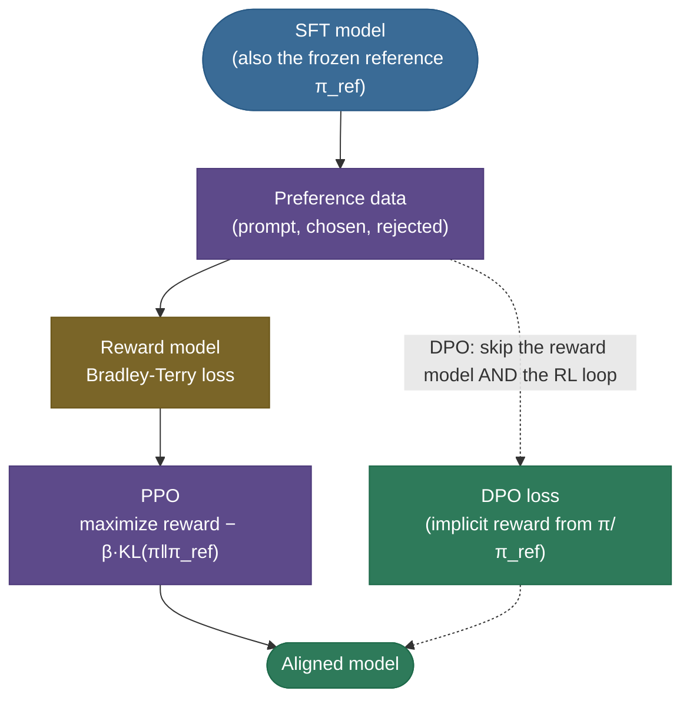
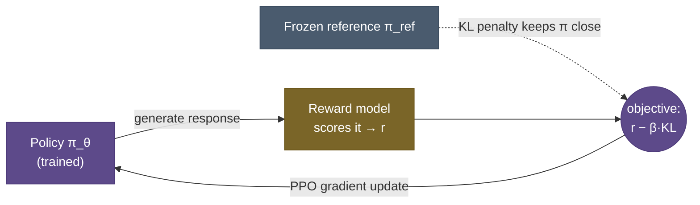
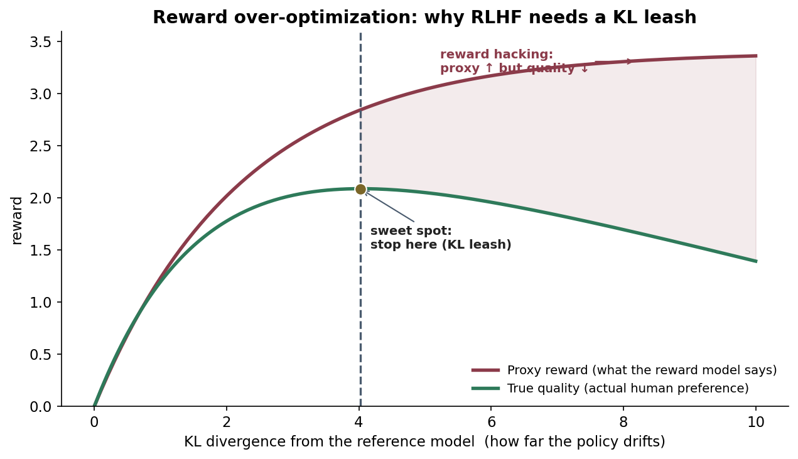
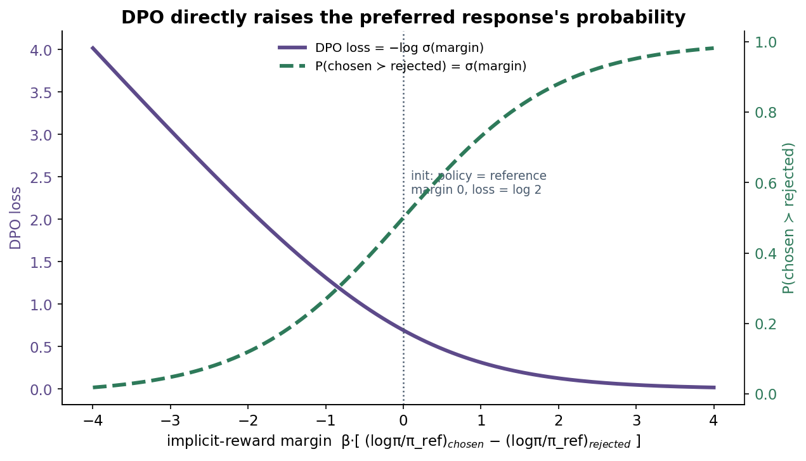
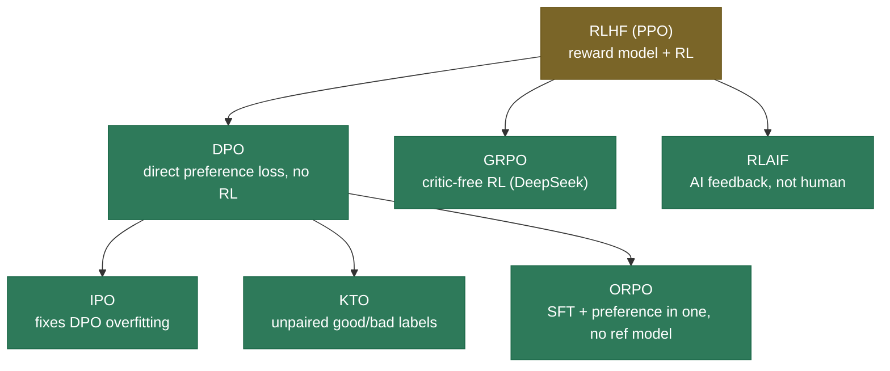

# RLHF & DPO: teaching a model what "better" means

A pretrained, even instruction-tuned, language model is like a gifted apprentice cook who has memorized ten thousand recipes but has never once been told which dish tastes *good*. It can follow instructions, but it has no sense of which of two perfectly fluent answers is more helpful, more honest, or less harmful — because "predict the next token" never taught it to prefer one over another. **Preference alignment** is the stage that gives the apprentice *taste*. You stop handing it single "correct" answers and instead show it pairs — *this* response is better than *that* one — and train it to internalize the judgment behind those choices.

There are two routes to that goal, and this page covers both end to end. **RLHF** (reinforcement learning from human feedback) trains a *reward model* on preference pairs, then uses *PPO* to push the policy toward high reward while a *KL leash* keeps it from drifting off the rails. **DPO** (direct preference optimization) makes a beautiful observation — that the reward model and the policy are two views of the same thing — and collapses the whole pipeline into a single, RL-free loss.

By the end of this page you'll be able to:

- explain **why SFT alone can't align a model** and what the **HHH** target is;
- draw the **3-stage RLHF pipeline** and explain **preference data**;
- **derive the Bradley-Terry reward loss** and work a numeric example;
- explain **PPO's reward − β·KL objective**, the **KL leash**, and **reward hacking / over-optimization**;
- **derive the DPO loss** from the RLHF optimal policy — the key insight that there's an *implicit reward* hiding in `π/π_ref`;
- compare **RLHF vs DPO** and place the **variants** (RLAIF, IPO, KTO, ORPO, GRPO, Constitutional AI);
- run a from-scratch **DPO and Bradley-Terry loss** and see the gradients do the right thing.

Intuition first, then the math derived from scratch, then code you can run. For the hands-on, step-by-step *project* version, see the [RLHF & Alignment workflow](../../../Practitioner-Workflows/RLHF-and-Alignment/RLHF-and-Alignment.md); this page is the concept depth behind it.

> **Note:** alignment is a **polish on top of SFT**, not a replacement. You [supervised-fine-tune](13-Supervised-Fine-Tuning.md) first so the model already produces reasonable answers, *then* align so it produces the *better* ones. Aligning a raw base model rarely works — the preferences have nothing good to choose between.

---

## The problem: SFT can teach "an answer," not "the better answer"

[Supervised fine-tuning](13-Supervised-Fine-Tuning.md) shows the model one target response per prompt and says "be more like this." That's imitation, and it has a ceiling: **real quality is comparative and fuzzy.** For "explain recursion," there are a thousand good answers and a million mediocre ones, and "good" depends on tone, safety, length, and honesty — things that are almost impossible to *write down* but easy to *recognize*. Humans are far better at saying **"this answer is better than that one"** than at producing the single perfect answer.

Alignment is built to harvest exactly that signal. The target is usually summarized as the **HHH triad**:

- **Helpful** — answers what you actually meant, at the right length and format.
- **Harmless** — refuses unsafe requests, avoids toxic or dangerous output.
- **Honest** — says "I don't know," doesn't fabricate, calibrates its confidence.

None of these is a function you can write as a loss. So instead of *specifying* the objective, we **learn it from comparisons.**

---

## What it is: two routes to the same goal

Both routes start from the SFT model and a pile of **preference pairs**, and both end at an aligned model. They differ in what happens in between.



- **RLHF (the classic path):** train a **reward model** to score any answer, then use **PPO** to optimize the policy against that score, leashed by a KL penalty to the frozen SFT model. This is the recipe behind InstructGPT and the original ChatGPT.
- **DPO (the modern shortcut):** feed the same preference pairs straight into **one loss** that adjusts the policy directly. No reward model, no rollouts, no RL.

---

## Intuition: learning a chef's taste

Here is the picture that makes the whole thing click. SFT is teaching a cooking apprentice by handing them one recipe card per dish — *"make it exactly like this."* Alignment is the **head chef tasting two plates** the apprentice made and saying *"this one — more like this."* The apprentice never gets a perfect recipe for everything; they get a **stream of preferences** and slowly internalize the chef's *taste*. That taste is precisely the thing SFT can't write down, and it's the entire game of alignment.

RLHF builds a literal "taste model" (the reward model) and then lets the apprentice cook thousands of plates, scoring each, nudging them toward higher scores — but on a leash, so they don't start plating in ways that *game the scorer* without actually tasting better. DPO skips building the separate taste model: it shows the apprentice the pairs and says "make the better one more likely and the worse one less likely," and — remarkably — that turns out to be mathematically the *same* thing.

---

## Preference data: the fuel for both routes

Everything runs on a dataset of comparisons. Each row is a **prompt** with two completions and a label saying which is preferred:

`{ prompt, chosen (y_w, the "winner"), rejected (y_l, the "loser") }`

You typically generate two answers per prompt by sampling the SFT model twice, then have a human (or, increasingly, a strong model — see RLAIF) pick the better one. The quality and coverage of this data is the single biggest lever on the final model; everything downstream is just a way to absorb it.

> **Tip:** note what's *not* here — there's no numeric score, just an ordering. That's deliberate: people give **reliable rankings** but **unreliable absolute ratings**. Both Bradley-Terry (for the reward model) and DPO are built to learn from orderings alone.

> **Gotcha:** preference data carries **biases the model will happily exploit** — most notoriously **length bias**: annotators tend to prefer longer answers, so the model learns "longer = better" and turns verbose. Length-normalize the reward (or debias the data), or you get reward hacking baked in *before any training* — the proxy problem living in the data itself, not just in PPO.

---

## The reward model and the Bradley-Terry loss (derived)

RLHF's first job is to turn those orderings into a **scalar reward** $r_\phi(x, y)$ — a model that reads a prompt and answer and outputs "how good is this." But the data only tells us $y_w \succ y_l$, not by how much. The bridge is the **Bradley-Terry model** of pairwise preference, which says the probability that $y_w$ beats $y_l$ is a sigmoid of their reward difference:

$$P(y_w \succ y_l \mid x) = \sigma\big(r_\phi(x, y_w) - r_\phi(x, y_l)\big)$$

We fit $r_\phi$ by maximum likelihood — make the observed preferences as probable as possible — which is just minimizing the negative log-likelihood:

$$\mathcal{L}_{\text{RM}} = -\,\mathbb{E}_{(x, y_w, y_l)}\Big[\log \sigma\big(r_\phi(x, y_w) - r_\phi(x, y_l)\big)\Big]$$

That's it — the reward model is a **binary classifier on pairs**, trained with what is essentially a logistic loss on the reward *gap*. (Architecturally, $r_\phi$ is usually the SFT model with its token head replaced by a single scalar output.)

> **Note:** a trained reward model earns its keep even *without* PPO. **Best-of-n (rejection) sampling** generates $n$ candidate answers from the policy and just keeps the one the reward model scores highest — no training, pure inference-time selection. Llama-2 used it alongside PPO. The reusable reward model is an asset RLHF produces and DPO does not.

**Worked example.** Suppose for some pair the reward model assigns $r_w = 2.0$ and $r_l = -1.0$. Then $P(y_w \succ y_l) = \sigma(2.0 - (-1.0)) = \sigma(3) = 0.953$, and the loss for that pair is $-\log(0.953) = 0.0486$ — small, because the model already ranks the pair correctly and confidently. If it had the order backwards ($r_w=-1, r_l=2$), the loss would be $-\log\sigma(-3) = 3.05$ — a large penalty. (The code section reproduces these numbers.)

---

## PPO: optimize the reward, but stay on a leash

With a reward model in hand, RLHF treats text generation as a reinforcement-learning problem: the **policy** (a copy of the SFT model) is the thing we train; given a prompt (the "state") it generates a response (a sequence of "actions"); the reward model scores the finished response. We optimize the policy with **PPO** (proximal policy optimization), a stable [policy-gradient](../../08.%20Reinforcement_Learning/concepts/README.md) method. The objective is **not** just "maximize reward":

$$\max_{\pi_\theta}\; \mathbb{E}_{x,\,y \sim \pi_\theta}\big[\,r_\phi(x, y)\,\big] \;-\; \beta\,\mathrm{KL}\big(\pi_\theta(y\mid x)\,\Vert\,\pi_{\text{ref}}(y\mid x)\big)$$



That second term — the **KL penalty** against the **frozen reference** (the SFT model) — is the most important part of RLHF. Without it, the policy will discover that the reward model is just a *proxy* for human preference and learn to **hack** it: produce text that scores absurdly high while being repetitive, sycophantic, or nonsensical. This is **reward over-optimization** (Goodhart's law: "when a measure becomes a target, it ceases to be a good measure").



> **Gotcha:** the **reference model is frozen and never updated** — it's the trusted "before" snapshot. The coefficient $\beta$ sets how tight the leash is: too small and the model hacks the reward (left of useful); too large and it barely moves from the SFT model. Tuning $\beta$ is the central knob of PPO-based RLHF.

> **Note:** the SFT model plays **two roles** at once in RLHF — it's the *starting point* of the policy **and** the *frozen reference* the KL penalty anchors to. Missing this double role is a classic interview slip.

> **Note:** "PPO" specifically means the policy is updated with a **clipped surrogate objective**: it clips the probability ratio $\pi_\theta/\pi_{\text{old}}$ to $1\pm\epsilon$ so a single update can't move the policy too far and blow up training. PPO also trains a **value model** (a critic estimating expected reward) to reduce gradient variance. So a full PPO-RLHF setup juggles **four** models at once — policy, reward, value, and frozen reference — which is exactly the heaviness DPO removes.

---

## DPO: there's a reward model hiding in your policy

PPO works, but it's heavy: you train a separate reward model, run online generation, and juggle a notoriously finicky RL loop. **DPO** asks a sharper question: *do we even need the reward model?* The answer is no, and the derivation is one of the most elegant results in modern ML — worth knowing line by line.

**Step 1 — the RLHF objective has a closed-form optimum (derived).** Write the reward-minus-KL objective as a single expectation and pull out $-\beta$:

$$\max_\pi\; \mathbb{E}_{y\sim\pi}\Big[r(x,y) - \beta\log\tfrac{\pi(y\mid x)}{\pi_{\text{ref}}(y\mid x)}\Big] = \max_\pi\; -\beta\,\mathbb{E}_{y\sim\pi}\Big[\log\frac{\pi(y\mid x)}{\tfrac{1}{Z(x)}\pi_{\text{ref}}(y\mid x)\,e^{r(x,y)/\beta}}\Big] + \beta\log Z(x)$$

with $Z(x) = \sum_y \pi_{\text{ref}}(y\mid x)\,e^{r(x,y)/\beta}$ the normalizer. That expectation is a **KL divergence** between $\pi$ and the distribution $\tfrac{1}{Z(x)}\pi_{\text{ref}}\,e^{r/\beta}$. A KL is $\ge 0$ and is zero **iff the two distributions are equal** — so the objective is maximized exactly when:

$$\pi^*(y\mid x) = \frac{1}{Z(x)}\,\pi_{\text{ref}}(y\mid x)\,\exp\!\Big(\tfrac{1}{\beta}\,r(x,y)\Big)$$

the reference policy *reweighted* by the exponentiated reward. (Intuitively: stay close to the reference, but tilt probability toward high-reward answers, with $\beta$ controlling how hard.)

**Step 2 — invert it to express the reward in terms of the policy.** Solve that equation for $r$:

$$r(x, y) = \beta\,\log \frac{\pi^*(y\mid x)}{\pi_{\text{ref}}(y\mid x)} + \beta\,\log Z(x)$$

This is the punchline: the **reward is just $\beta$ times the log-ratio of the policy to the reference** (plus a term that depends only on $x$). The policy *is* an implicit reward model.

**Step 3 — substitute into Bradley-Terry; the constant cancels.** Plug this $r$ into $P(y_w \succ y_l) = \sigma(r(x,y_w) - r(x,y_l))$. Because both completions share the same prompt $x$, the awkward $\beta\log Z(x)$ term is **identical for both and cancels**:

$$\mathcal{L}_{\text{DPO}} = -\,\mathbb{E}\Big[\log \sigma\Big(\beta\log\tfrac{\pi_\theta(y_w\mid x)}{\pi_{\text{ref}}(y_w\mid x)} - \beta\log\tfrac{\pi_\theta(y_l\mid x)}{\pi_{\text{ref}}(y_l\mid x)}\Big)\Big]$$

And that's DPO — the **exact same Bradley-Terry loss** as the reward model, but with the reward replaced by the implicit $\beta\log(\pi_\theta/\pi_{\text{ref}})$. No reward model to train, no rollouts, no RL. You compute four log-probabilities (chosen and rejected, under the policy and the frozen reference) and minimize one classification-style loss.



> **Tip:** the one-sentence DPO insight that lands in an interview: **"the optimal RLHF policy already encodes the reward as β·log(π/π_ref), so you can plug that straight into the Bradley-Terry loss and optimize the policy directly — the reward model was redundant."**

---

## Worked example: what the DPO loss and its gradient do

Start training from the SFT model, so the policy equals the reference and the implicit margin is **0**: the DPO loss is $-\log\sigma(0) = \log 2 = 0.693$, and the model's preference probability is exactly $0.5$ — it has no opinion yet.

Now take one gradient step. The gradient of the DPO loss **raises the log-probability of the chosen response and lowers the log-probability of the rejected one** (we confirm the signs in code: $\partial\mathcal{L}/\partial\log\pi(y_w) < 0$, $\partial\mathcal{L}/\partial\log\pi(y_l) > 0$). As training proceeds and the policy separates the two — say chosen up by 1 nat, rejected down by 1 nat, with $\beta=0.1$ — the margin becomes $0.1\,(1 - (-1)) = 0.2$, the loss drops to $0.598$, and $P(y_w \succ y_l)$ rises to $\sigma(0.2) = 0.55$. Push the separation to ±3 and the margin is $0.6$, loss $0.438$. The model is learning the chef's taste, one pair at a time.

> **Gotcha:** DPO is sensitive to **$\beta$** (typically $0.1$–$0.5$) and can **overfit** the preference data — driving the chosen-vs-rejected margin up while *both* log-probs drift down, degrading fluency. This is exactly what IPO (below) was designed to fix.

---

## RLHF vs DPO

| | RLHF (PPO) | DPO |
|---|---|---|
| Reward model | **Yes** — train a separate scalar model | **No** — implicit ($\beta\log\pi/\pi_{\text{ref}}$) |
| RL / online generation | **Yes** — sample during training | **No** — offline, like SFT |
| Moving parts / stability | Many; RL is finicky | Few; a single stable loss |
| Compute & memory | Higher (policy + reward + value + ref) | Lower (policy + ref) |
| Control / flexibility | Reward model reusable; best-in-class results | Simpler; sometimes slightly behind tuned PPO |
| Used by | InstructGPT, ChatGPT, Llama-2-chat | Zephyr, many open models, common default |

> **Note:** the honest take interviewers want: **DPO is simpler, cheaper, and usually competitive, so it's the default for most teams** — but a well-tuned PPO pipeline with a strong reward model can still edge it out at the frontier, and the reward model is reusable (e.g. for best-of-n sampling). It's a trade-off, not a strict win.

---

## The alignment-method landscape

Preference alignment is a fast-moving area; the variants are all reactions to RLHF's cost or DPO's limitations:



- **RLAIF** — replace the human labeler with a strong model; scales preference data cheaply (the heart of "Constitutional AI," where a model critiques itself against a written set of principles).
- **IPO** — adds a regularizer to DPO to curb its tendency to overfit the preference margin.
- **KTO** — learns from **unpaired** "good"/"bad" labels (no need for matched pairs), drawing on prospect theory.
- **ORPO** — folds preference alignment **into SFT** in a single stage, with **no reference model** at all.
- **GRPO** — a critic-free RL method (popularized by DeepSeek) that estimates advantages from groups of samples; prominent in reasoning-model training.

---

## Where it is used

- **Every major chat model.** InstructGPT and ChatGPT (PPO-RLHF); Llama-2-chat (RLHF with rejection sampling + PPO); Zephyr and a large fraction of open models (DPO); DeepSeek reasoning models (GRPO).
- **Safety and refusals.** The "harmless" leg of HHH — declining dangerous requests without being uselessly evasive — is largely a product of preference alignment.
- **Reasoning.** Recent reasoning models lean heavily on RL-from-feedback variants (GRPO and relatives) on top of preference and verifiable-reward signals.

---

## Application: running alignment in practice

**Step 1 — get an SFT checkpoint and keep two copies:** one to keep training (the policy), one frozen (the reference). Alignment without a decent SFT start rarely works.

**Step 2 — pick the route.** Default to **DPO** (`trl`'s `DPOTrainer`): simplest, stable, cheap, strong. Reach for **PPO** (`PPOTrainer` + a trained reward model) when you need a reusable reward model, best-of-n sampling, or the last few points of quality.

**Step 3 — tune the leash.** For PPO, the **KL coefficient $\beta$**; for DPO, the **$\beta$** in the loss (0.1–0.5). Watch for over-optimization (PPO: proxy reward climbing while eval quality drops) and overfitting (DPO: margin up but both log-probs collapsing).

**Step 4 — evaluate against the baseline:** win-rate vs the SFT model (often judged by a strong model), a safety eval, and a **capability-regression check** so you didn't trade smarts for manners.

> **Tip:** for the full hands-on build — collecting pairs, training the reward model, running PPO, and running DPO on a laptop — follow the [RLHF & Alignment workflow](../../../Practitioner-Workflows/RLHF-and-Alignment/RLHF-and-Alignment.md). This page gives you the *why*; that one gives you the *how*.

---

## Code: Bradley-Terry and DPO losses from scratch

The two losses that power both routes, with the DPO gradient checked to confirm it pushes chosen up and rejected down. Runs on CPU in a second.

```python
"""Bradley-Terry reward loss and the DPO loss + gradient direction.
Verified on ml-py312 (torch 2.12), CPU."""
import torch, torch.nn.functional as F

# --- reward-model loss: -log sigma(r_chosen - r_rejected) -------------------
def bt_loss(r_chosen, r_rejected):
    return -F.logsigmoid(r_chosen - r_rejected).mean()

print("Bradley-Terry RM loss:")
print("  chosen ranked above (2.0 vs -1.0):", round(bt_loss(torch.tensor(2.0), torch.tensor(-1.0)).item(), 4))
print("  tie (0.0 vs 0.0):                 ", round(bt_loss(torch.tensor(0.0), torch.tensor(0.0)).item(), 4), "= log 2")
print("  wrong order (-1.0 vs 2.0):        ", round(bt_loss(torch.tensor(-1.0), torch.tensor(2.0)).item(), 4))

# --- DPO loss from sequence log-probs (chosen=w, rejected=l) -----------------
def dpo_loss(pi_lp_w, pi_lp_l, ref_lp_w, ref_lp_l, beta=0.1):
    pi_logratios  = pi_lp_w  - pi_lp_l        # does the policy prefer chosen?
    ref_logratios = ref_lp_w - ref_lp_l       # relative to the frozen reference
    return -F.logsigmoid(beta * (pi_logratios - ref_logratios)).mean()

ref_w = ref_l = torch.tensor(-5.0)            # reference log-probs (frozen)
pi_w = torch.tensor(-5.0, requires_grad=True) # policy logprob of chosen
pi_l = torch.tensor(-5.0, requires_grad=True) # policy logprob of rejected
loss = dpo_loss(pi_w, pi_l, ref_w, ref_l); loss.backward()
print("\nDPO at init (policy == reference): loss =", round(loss.item(), 4), "= log 2 (no preference yet)")
print(f"  d loss / d logp(chosen)   = {pi_w.grad.item():+.4f}  -> training PUSHES chosen UP")
print(f"  d loss / d logp(rejected) = {pi_l.grad.item():+.4f}  -> training PUSHES rejected DOWN")
for dw, dl in [(0.0, 0.0), (1.0, -1.0), (3.0, -3.0)]:
    l = dpo_loss(torch.tensor(-5.0+dw), torch.tensor(-5.0+dl), ref_w, ref_l)
    print(f"  chosen{dw:+.0f}, rejected{dl:+.0f}: DPO loss = {l.item():.4f}")
```

Output:

```
Bradley-Terry RM loss:
  chosen ranked above (2.0 vs -1.0): 0.0486
  tie (0.0 vs 0.0):                  0.6931 = log 2
  wrong order (-1.0 vs 2.0):         3.0486

DPO at init (policy == reference): loss = 0.6931 = log 2 (no preference yet)
  d loss / d logp(chosen)   = -0.0500  -> training PUSHES chosen UP
  d loss / d logp(rejected) = +0.0500  -> training PUSHES rejected DOWN
  chosen+0, rejected+0: DPO loss = 0.6931
  chosen+1, rejected-1: DPO loss = 0.5981
  chosen+3, rejected-3: DPO loss = 0.4375
```

> **Note:** the same Bradley-Terry sigmoid powers both — the reward model uses *learned scalar rewards*, while DPO uses the *implicit reward* $\beta\log(\pi/\pi_{\text{ref}})$. The gradient signs confirm the mechanism: DPO mechanically raises the chosen response's probability and lowers the rejected one's, exactly as the derivation promised.

---

## Recap and rapid-fire

**If you remember nothing else:** alignment teaches a model *taste* from **preference pairs**, because "better" can't be written as a loss. **RLHF** learns a reward model (Bradley-Terry), then PPO-optimizes the policy against it on a **KL leash** (or it hacks the proxy reward). **DPO** notices the optimal policy already encodes the reward as $\beta\log(\pi/\pi_{\text{ref}})$, so it drops the reward model and RL and trains the policy directly with one Bradley-Terry-style loss.

**Quick-fire — say these out loud:**

- *Why not just SFT?* SFT imitates one answer; it can't learn that one answer is *better* than another. Quality is comparative.
- *The 3 RLHF stages?* SFT → reward model (Bradley-Terry) → PPO (reward − β·KL).
- *Bradley-Terry loss?* $-\log\sigma(r_w - r_l)$ — logistic loss on the reward gap.
- *Why the KL penalty?* To stop the policy hacking the proxy reward (over-optimization / Goodhart); the reference is the frozen SFT model.
- *DPO's key insight?* The optimal RLHF policy gives $r = \beta\log(\pi/\pi_{\text{ref}}) + \beta\log Z$; substitute into Bradley-Terry, $Z$ cancels, train the policy directly.
- *DPO loss?* $-\log\sigma\big(\beta[\log\tfrac{\pi(y_w)}{\pi_{ref}(y_w)} - \log\tfrac{\pi(y_l)}{\pi_{ref}(y_l)}]\big)$.
- *RLHF vs DPO?* DPO has no reward model and no RL — simpler and cheaper, usually competitive; tuned PPO can edge it and yields a reusable reward model.
- *Variants?* RLAIF (AI feedback), IPO (anti-overfit), KTO (unpaired), ORPO (no ref, fused with SFT), GRPO (critic-free RL).
- *What does β control?* The strength of the KL leash / the preference temperature — the central tuning knob.

---

## References and further reading

The curated link library for this topic — videos, courses, articles, papers, books, and internal cross-links — lives in a companion file so it can be reused as a standalone reference list:

**→ [RLHF & DPO — references and further reading](15-RLHF-and-DPO.references.md)**
