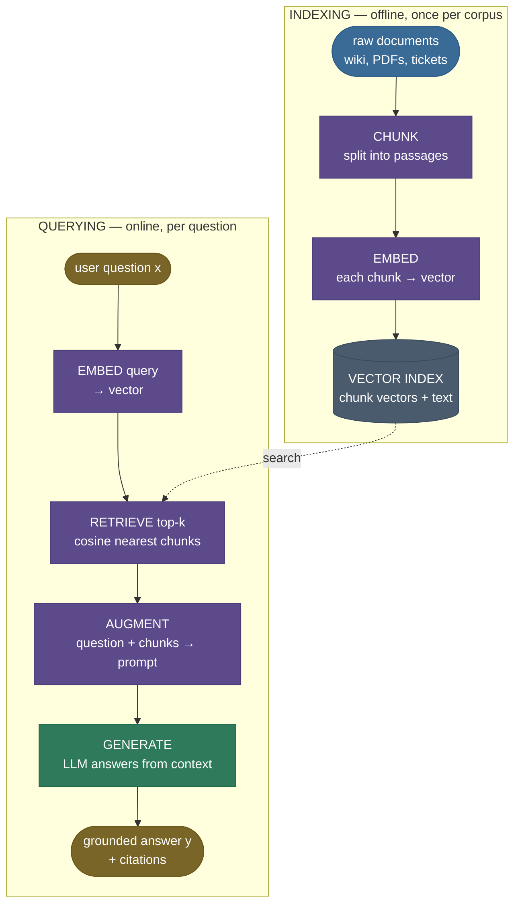

# RAG Fundamentals: retrieve, then generate

Ask a frozen language model *"When was the Helios-7 satellite launched?"* and one of two bad things happens. If Helios-7 is a private internal project, the model has never seen it — so it either refuses or, worse, **confidently invents a date**. If Helios-7 *were* public but launched after the model's training cutoff, same outcome: the knowledge simply isn't in the weights. The model's entire factual world was frozen the day pretraining ended, and there is no amount of clever prompting that puts a fact into weights that never saw it.

**Retrieval-Augmented Generation (RAG)** is the fix that the entire LLM-application industry converged on: don't try to *bake* the knowledge into the model — **fetch it at question time and put it in the prompt.** Before the model answers, a retriever pulls the few most relevant passages from a corpus you control (your docs, your wiki, today's news) and *staples them onto the question*. The model then answers from text sitting right in front of it, not from fuzzy parametric memory. It's the difference between a closed-book exam and an open-book one.

I'm going to build this the way I'd explain it to a teammate wiring up their first RAG system — starting from *why* a bare prompt fails (feel the gap), then the open-book-exam intuition, then the retrieve-then-generate pipeline, the similarity math the retriever runs, a from-scratch RAG you can read end to end, the four failure modes that bite every production system, and where RAG is — and isn't — the right tool. By the end you'll be able to:

- explain **why RAG beats fine-tuning** for fresh/private/factual knowledge, and when it doesn't;
- name every stage of the **chunk → embed → index → retrieve → augment → generate** pipeline and what each does;
- derive **cosine similarity** and **top-k retrieval**, and write the **RAG marginalization** $P(y\mid x)=\sum_z P(z\mid x)\,P(y\mid x,z)$ from the original paper;
- build a tiny RAG from scratch and *see* retrieval pick the right passage by eye;
- diagnose the four classic failures — **bad chunks, low recall, lost-in-the-middle, stale index** — and the fix for each.

> **Note:** RAG is a *knowledge-injection* mechanism, not a *reasoning* one. It changes **what facts the model has access to**, not how well it reasons over them. Give it the wrong passages and a perfect reasoner still answers wrong — which is why almost all of RAG's engineering effort goes into *retrieving the right passages*, the theme of every chapter after this one.

---

## The problem: parametric knowledge is frozen, and it hallucinates

To see why RAG exists, you have to feel the gap a bare prompt leaves.

A pretrained LLM stores everything it "knows" in its weights — its **parametric knowledge**. That knowledge has three hard limits:

1. **It's frozen at the training cutoff.** A model trained through 2023 cannot know a 2024 product launch, last week's incident report, or the price you changed this morning. Re-training to add one fact costs millions of dollars and weeks of compute — absurd for knowledge that changes daily.
2. **It never saw your private data.** Your internal wiki, customer records, and codebase were not in the pretraining corpus. The model has *zero* information about Helios-7 because Helios-7 is yours.
3. **When it doesn't know, it often doesn't *say* it doesn't know.** Decoding samples the most *plausible-sounding* continuation, not the most *true* one. Asked for a fact it lacks, a model frequently emits a fluent, specific, **wrong** answer — a hallucination — because "March 12th, 2023" reads more like a launch-date answer than "I don't know."

Here's the naive approach failing concretely. You just *prompt it*:

```
You: When was the Helios-7 satellite launched?
LLM: The Helios-7 satellite was launched on June 18th, 2021, aboard a Falcon 9 rocket.
```

Every detail is fabricated. There is no Helios-7 in the weights, so the model pattern-matched a fluent satellite-launch sentence. This is the **worst** failure mode: not an error message, but a confident falsehood with fake specifics, indistinguishable from a real answer unless you already know the truth.

You could try to fix this by **fine-tuning** the facts in. It mostly doesn't work for this job: fine-tuning is expensive, has to be redone every time a fact changes, tends to *teach style more reliably than it teaches facts*, and still gives you no **citation** — no way to show *where* an answer came from or to update one fact without retraining. (Fine-tuning shines for teaching *behavior and format*; RAG shines for *knowledge*. They're complementary, not rivals — more in §Where it matters.)

What we actually need: a way to give the model the **right facts at question time**, from a source we control and can update instantly, with the **provenance** to cite and verify. That's retrieval.

![Cosine similarity of all eight corpus passages to the query "When was the Helios-7 satellite launched?", sorted best-first, with the top-3 retrieval cutoff. The answering passage doc[0] scores 0.64 — far above the rest — so it is retrieved and fed to the generator; the unrelated passages (chessboard, water, Eiffel Tower) score near zero and are left out. Generated by `code/make_figures_01.py`.](../images/rag01_similarity_bars.png)

---

## Intuition first: the open-book exam

Here is the mental model that holds up under questioning.

A frozen LLM answering from memory is a student taking a **closed-book exam**: everything must come from what they happened to memorize. Ask about a topic they didn't study and they either blank or — worse — bluff a confident wrong answer.

**RAG turns it into an open-book exam.** The student still has to *understand the question and write the answer in their own words* — that's the language model's job, and it's still essential. But now, before answering, they get to **flip to the relevant pages of the textbook and read the exact passage that addresses the question.** The answer is composed by the student but *grounded in the page they just read*.

Push on the analogy — it survives, and where it bends, it teaches:

- **"What if the textbook doesn't cover the question?"** Then the open book doesn't help — exactly RAG's behavior. If the corpus lacks the answer, retrieval returns junk and the model has nothing to ground on. RAG can only surface knowledge that *exists in the corpus*; it cannot conjure it. (Failure mode: low recall / missing document.)
- **"What if they flip to the wrong page?"** They'll answer confidently from irrelevant text — RAG's single most common failure. The quality of the answer is capped by the quality of *retrieval*, which is why every later chapter is about retrieving better.
- **"What if the page is outdated?"** They'll give a stale answer with full confidence. RAG is only as fresh as its index — re-index when the source changes. (Failure mode: stale index.)
- **"Why not just memorize the whole book?"** That's fine-tuning — slow, expensive, and you must re-memorize the entire book every time one sentence changes. Flipping to a page (retrieval) is instant and updatable.

The mapping to the mechanism is exact: **the textbook is your corpus, flipping to the right page is retrieval, reading the passage into your working memory is prompt augmentation, and writing the answer is generation.** Hold that picture; everything below is the engineering that makes "flip to the right page" fast and accurate.

![Animated — the retrieve → augment → generate loop in motion. Left: the query (star) sweeps the embedding space and lights up its nearest passages (green, with beams) — that's retrieval as nearest-neighbour search. Right: those retrieved passages flow into the augmented prompt as numbered context, and the grounded answer — the launch date — is produced from the evidence, not from memory. The passages that light up are exactly the top-3 the retriever returns on this page. Generated by `code/make_animation_01.py`.](../images/rag01_retrieve_augment_generate.gif)

---

## The mechanism: the retrieve-then-generate pipeline

RAG has two phases that happen at different times. **Indexing** runs *once, offline*: you prepare the corpus so it's searchable. **Querying** runs *every time a user asks*: retrieve, augment, generate. Keeping these straight is the first thing to get right.



Stage by stage:

1. **Chunk.** Split each document into passages small enough to embed meaningfully and to fit several into a prompt — typically a few hundred tokens. Too big and a chunk dilutes its own meaning and blows the context budget; too small and it loses the surrounding context needed to answer. (This one decision is so consequential it gets its own chapter — *Document Chunking Strategies*.)
2. **Embed.** Map each chunk to a dense vector with an embedding model, so that *semantically similar text lands at nearby points*. This is what lets retrieval match on **meaning**, not just keywords — "liftoff date" can find a passage that says "was launched on."
3. **Index.** Store all chunk vectors (with their source text) in a structure built for fast nearest-neighbour search. At our toy scale this is one matrix; at production scale it's an approximate-nearest-neighbour (ANN) index in a vector database (*Vector Databases & ANN Indexes*).
4. **Retrieve.** At query time, embed the question with the **same** model, then find the **top-k** chunks whose vectors are closest to the query vector. "Closest" almost always means highest **cosine similarity** — the math of the next section.
5. **Augment.** Splice the retrieved chunks into a prompt template alongside the question, with an instruction like *"answer using only the context below."* This is the literal "open book on the desk."
6. **Generate.** The LLM reads the augmented prompt and produces an answer grounded in the supplied passages — ideally with citations back to which chunk each claim came from.

> **Note:** the embedder used at **index time** and at **query time must be the same model** (or a matched query/document pair). Embed your corpus with model A and your queries with model B and the two vector spaces don't align — cosine similarities become meaningless and retrieval returns garbage. It's the most common silent RAG bug.

---

## The math: similarity, top-k, and the RAG marginal

Three pieces of math run this pipeline. None is heavy; each connects directly to the intuition.

### 1. Cosine similarity — "how aligned are these two meanings?"

An embedding model maps text to a vector $\mathbf{u}\in\mathbb{R}^{d}$ (here $d$ = embedding dimension; our toy uses $d=256$). To compare a query vector $\mathbf{q}$ with a passage vector $\mathbf{p}$ we use **cosine similarity** — the cosine of the angle between them:

$$
\operatorname{cos}(\mathbf{q},\mathbf{p}) \;=\; \frac{\mathbf{q}\cdot\mathbf{p}}{\lVert\mathbf{q}\rVert\,\lVert\mathbf{p}\rVert} \;=\; \frac{\sum_{i=1}^{d} q_i\,p_i}{\sqrt{\sum_i q_i^2}\,\sqrt{\sum_i p_i^2}} \;\in\; [-1, 1].
$$

> **Source / derivation:** [Manning, Raghavan & Schütze, *Introduction to Information Retrieval*, §6.3 "The vector space model"](https://nlp.stanford.edu/IR-book/html/htmledition/dot-products-1.html) — derives cosine similarity as the angle between TF-IDF document vectors, the foundation retrieval scoring is built on.

Symbols: $q_i, p_i$ are the $i$-th components; $\mathbf{q}\cdot\mathbf{p}$ is the dot product; $\lVert\cdot\rVert$ is the L2 (Euclidean) norm. **Why cosine and not raw dot product or distance?** Cosine measures *direction*, ignoring magnitude — so a long passage and a short query that are *about the same thing* score high, even though their raw vectors differ in length. A score near **1** means "same direction → same meaning"; near **0** means "orthogonal → unrelated."

**The shape trick that makes retrieval one matmul.** If we **L2-normalize** every vector at index time — replace each $\mathbf{p}$ with $\mathbf{p}/\lVert\mathbf{p}\rVert$ so $\lVert\mathbf{p}\rVert = 1$ — then the denominator vanishes and cosine *collapses to a plain dot product*: $\operatorname{cos}(\mathbf{q},\mathbf{p}) = \mathbf{q}\cdot\mathbf{p}$. Stack the $N$ normalized passage vectors into a matrix and one matrix-vector product scores them all at once:

$$
\mathbf{s} \;=\; \mathbf{P}\,\mathbf{q}, \qquad \mathbf{P}\in\mathbb{R}^{N\times d},\;\; \mathbf{q}\in\mathbb{R}^{d},\;\; \mathbf{s}\in\mathbb{R}^{N},
$$

where row $j$ of $\mathbf{P}$ is passage $j$'s unit vector and $s_j = \operatorname{cos}(\mathbf{q}, \mathbf{p}_j)$. (This is exactly the `index @ query_vec` line in the code below.)

### 2. Top-k retrieval — keep the best, drop the rest

Retrieval returns the **$k$ passages with the highest similarity**:

$$
\mathcal{R}_k(\mathbf{q}) \;=\; \operatorname*{arg\,top\text{-}k}_{j \in \{1,\dots,N\}} \; s_j \;=\; \operatorname*{arg\,top\text{-}k}_{j} \; \mathbf{q}\cdot\mathbf{p}_j .
$$

$\mathcal{R}_k(\mathbf{q})$ is the set of $k$ chunk indices fed into the prompt. **$k$ is the central knob:** larger $k$ raises **recall** (the answer is more likely to be *somewhere* in the retrieved set) but adds **noise and cost** (more irrelevant text, more tokens, more chance the model is distracted). We *measure* this tradeoff in code below.

### 3. The RAG marginalization — why "retrieve then generate" is principled

The original RAG paper frames the whole thing probabilistically. We want $P(y\mid x)$: the probability of answer $y$ given question $x$. RAG introduces a **latent retrieved document $z$** and marginalizes over the retrieved set:

$$
P(y\mid x) \;=\; \sum_{z \,\in\, \mathcal{R}_k(x)} \underbrace{P(z\mid x)}_{\text{retriever}} \; \underbrace{P(y\mid x, z)}_{\text{generator}} .
$$

> **Source / derivation:** [Lewis et al. (2020), *Retrieval-Augmented Generation for Knowledge-Intensive NLP Tasks*, Eq. 1–2 (arXiv:2005.11401)](https://arxiv.org/abs/2005.11401) — defines the RAG-Sequence/RAG-Token models that marginalize a generator over the top-k documents returned by a DPR retriever; this is the equation that named the field.

Read it as a clean division of labor. $P(z\mid x)$ is the **retriever**: how relevant is passage $z$ to question $x$ (in practice, a softmax over the cosine scores $s_j$). $P(y\mid x,z)$ is the **generator**: how likely the LLM is to produce answer $y$ given the question *and* that passage in its prompt. The answer is a **retriever-weighted blend** of the answers each passage supports — passages the retriever trusts more pull the final answer toward what they say.

In practice most production systems use the cheaper approximation: take the single best passage set, concatenate it into one prompt, and generate once — i.e. condition on $\mathcal{R}_k(x)$ jointly rather than summing per-document. The marginalization is the *principled* form (and what you'd cite in an interview); the concatenate-and-generate-once version is what the from-scratch code and most apps actually run.

---

## Worked example: a RAG you can read end to end

Let's build the whole pipeline from primitives on a tiny **private** corpus — eight passages the model was never trained on, including the Helios-7 facts. No model download, no GPU: the embedder is a transparent **IDF-weighted hashing** embedding so you can *see* exactly how text becomes a vector and why retrieval picks the passage it does. (Real systems swap in a learned sentence-transformer — same interface, better vectors. We do that swap in *Embedding Models for Retrieval*.)

> **Runnable script + step-by-step notebook:** the verified code lives next to this page — the [step-by-step teaching notebook](code/01-RAG-Fundamentals.ipynb) and the [runnable demo script](code/rag_fundamentals.py) (run it with `python rag_fundamentals.py`). Every number printed below is produced by that code — nothing here is hand-typed.

**Step 1 — embed the corpus into an index.** Each passage becomes a unit vector; stack them into an `(n_docs, dim)` matrix. Because every row is L2-normalized, cosine similarity will be a plain dot product.

```python
import numpy as np
from rag_fundamentals import CORPUS, compute_idf, build_index, embed, cosine_top_k

idf   = compute_idf(CORPUS)          # rare words (e.g. "Helios") weigh more than "the"
index = build_index(CORPUS, idf)     # (n_docs, dim): one unit-norm row per passage
print("index shape (n_docs, dim):", index.shape)        # (8, 256)
print("all rows unit-norm:", np.allclose(np.linalg.norm(index, axis=1), 1.0))   # True
```

```
index shape (n_docs, dim): (8, 256)
all rows unit-norm: True
```

**Step 2 — retrieve the top-k for a question the model can't answer from memory.** Embed the query with the *same* embedder, score every passage with one matmul, take the top-3.

```python
question = "When was the Helios-7 satellite launched?"
q_vec = embed(question, idf)                       # same space as the corpus
top_idx, top_scores = cosine_top_k(q_vec, index, k=3)
for rank, (i, s) in enumerate(zip(top_idx, top_scores), 1):
    print(f"{rank}. doc[{i}] cos={s:.3f} | {CORPUS[i]}")
```

```
1. doc[0] cos=0.638 | The Helios-7 satellite was launched on March 3rd, 2024 from the Kourou spaceport.
2. doc[2] cos=0.282 | The project lead for Helios-7 is Dr. Amara Okoye, based in the Nairobi office.
3. doc[5] cos=0.213 | The Eiffel Tower in Paris was completed in 1889 for the World's Fair.
```

Read those scores: the answering passage **doc[0] scores 0.638 — more than double the runner-up**, because it shares the rare, high-IDF tokens "helios", "satellite", "launched". Notice the #3 result is the **Eiffel Tower** — it sneaks in only because it shares low-content words ("the", "in") and a date-shaped sentence; it's a harmless distractor here, but it's exactly the kind of near-miss that a better embedder and a re-ranker exist to remove (later chapters).

![Retrieval is nearest-neighbour search. The eight corpus passages and the query, projected to 2D (PCA, for visualization only). The query star sits right next to its top-3 retrieved passages (green, with connector lines) — doc[0] (the launch date), doc[2] (the project lead), doc[5] — while unrelated passages (chessboard, water, photosynthesis) are far away in grey. "Find the answer" is literally "find the nearest points." Generated by `code/make_figures_01.py`.](../images/rag01_embedding_space.png)

**Step 3 — augment and generate: the grounded vs ungrounded contrast.** Same question, two ways.

```python
from rag_fundamentals import generate_ungrounded, rag_answer

print("UNGROUNDED:", generate_ungrounded(question).text)
grounded, _, _ = rag_answer(question, CORPUS, idf, index)
print("GROUNDED:  ", grounded.text)
```

```
UNGROUNDED: I don't have information about that.
GROUNDED:   The Helios-7 satellite was launched on March 3rd, 2024 from the Kourou spaceport.
```

That's the whole point in two lines. **Without retrieval** the model has no Helios-7 facts — the honest outcome is "I don't know" (a real frozen LLM would often *hallucinate a date instead*, which is worse). **With retrieval**, the right passage is in the prompt, so the answer is correct *and traceable to doc[0]*.

**Step 4 — the augmented prompt the generator actually sees.** This is the "open book on the desk," made literal:

```
Answer the question using ONLY the context below. If the context does not contain the answer, say you don't know.

Context:
[1] The Helios-7 satellite was launched on March 3rd, 2024 from the Kourou spaceport.
[2] The project lead for Helios-7 is Dr. Amara Okoye, based in the Nairobi office.
[3] The Eiffel Tower in Paris was completed in 1889 for the World's Fair.

Question: When was the Helios-7 satellite launched?
Answer:
```


**The library one-liner.** In production you don't hand-roll this; a framework wires the same six stages:

```python
# LangChain, conceptually — same chunk→embed→index→retrieve→augment→generate pipeline
from langchain_community.vectorstores import FAISS
vectorstore = FAISS.from_texts(CORPUS, embedding=some_embedding_model)   # chunk+embed+index
retriever   = vectorstore.as_retriever(search_kwargs={"k": 3})          # retrieve top-k
# rag_chain = retriever | prompt_template | llm                         # augment + generate
```

The one-liner hides exactly the mechanics we just built by hand — which is why building it by hand once is the lesson the API can't teach.

---

## Pitfalls and failure modes

RAG fails in characteristic ways, and *every one of them is a retrieval problem dressed up as a generation problem.* Name them so you recognize them in the wild.

**1. Chunk-boundary loss.** Split a document badly and the answer straddles two chunks — half in one, half in the next — so no single chunk is fully retrievable.

- *Failing:* a chunker cuts every 100 words mid-sentence. The passage *"...the satellite launched on // March 3rd, 2024..."* splits the date from its subject. A query about the launch date matches the first half (no date) or the second half (no subject), and the model never sees the complete fact.
- *Fix:* chunk on **semantic boundaries** (paragraphs, sections), add **overlap** between adjacent chunks so a straddling fact appears whole in at least one, and keep chunks coherent. This is consequential enough to be the next chapter, *Document Chunking Strategies*.

**2. Retrieval misses / low recall.** The answering passage exists in the corpus but isn't in the top-k — so the model has the wrong evidence and either says "I don't know" or grounds on a distractor.

- *Failing:* with a purely lexical embedder, the query *"liftoff date"* shares no words with the passage *"was launched on"* and ranks it below noisier matches. Across paraphrased queries our toy retriever's **recall@1 is only 0.50** — it misses the right passage on the first try *half the time* (figure below).
- *Fix:* better (learned, semantic) **embeddings** so paraphrases match (*Embedding Models for Retrieval*); **hybrid search** combining dense + keyword/BM25 (*Hybrid Search*); raise **k**; add a **re-ranker** to reorder a larger candidate set (*Re-ranking with Cross-Encoders*).


**3. Lost in the middle.** Even when the right passage *is* retrieved, LLMs use evidence best when it sits at the **start or end** of a long context and *worst when buried in the middle* — a documented U-shaped accuracy curve.

- *Failing:* you retrieve k=20 chunks to be safe; the answer is chunk #11, dead center; the model glosses over it and answers as if it weren't there.
- *Fix:* retrieve **fewer, better** chunks (don't pad k for its own sake); **re-rank** so the most relevant passage is placed first; keep prompts tight. Position matters as much as presence.


**4. Stale index.** The source changed; the index didn't. Every query now retrieves the old facts with full confidence.

- *Failing:* Helios-7's launch slips to April; you update the doc but never re-embed it. RAG keeps citing March 3rd — *worse* than a frozen LLM, because it *looks* sourced.
- *Fix:* a **re-indexing pipeline** triggered on source change (or on a schedule), with content-hash cache keys so changed chunks are re-embedded and stale ones evicted. Freshness is an operational discipline, not a one-time build.

> **Gotcha:** notice all four fixes are about **getting the right text into the prompt** — none is "use a smarter LLM." The generator is rarely the bottleneck; retrieval almost always is. That's the single most important mental adjustment when debugging a RAG system: *suspect retrieval first.*

---

## Where it matters, and where it doesn't

**The one problem RAG solves:** giving a frozen model access to knowledge it doesn't have in its weights — **fresh** (post-cutoff), **private** (your data), or **factual** (where you need it grounded and citable) — *without retraining*, and with **provenance** so answers can be verified and individual facts updated instantly.

**Which layer it lives at.** RAG sits at the **application/serving layer**, wrapped *around* an unmodified LLM — it touches your prompt-construction and a retrieval service, not the model weights. That's its great virtue: swap the base model, keep the whole RAG stack; update a document, no retraining.

**The core tradeoff:** RAG buys freshness, privacy, and citability at the cost of **retrieval complexity and latency** — you now own a chunker, an embedder, a vector index, and a retrieval step on the critical path of every query, plus the failure modes above. You trade "the model just knows" for "the model can look it up, *if* your retrieval is good."

**RAG vs fine-tuning — pick by what you're injecting:**

| You want to change… | Reach for | Why |
|---|---|---|
| **What the model knows** (facts, docs, fresh/private data) | **RAG** | Update the index, not the weights; instant, citable, cheap |
| **How the model behaves** (tone, format, a skill, a domain style) | **Fine-tuning** | Behavior lives in weights; retrieval can't inject a *style* |
| Both | **Both** | Fine-tune the behavior, RAG the knowledge — they compose |

**When RAG is NOT the answer:**

- **The knowledge is already in the weights and stable.** Asking a general model general facts ("how many squares on a chessboard?") needs no retrieval — adding it only adds latency and a distractor. (In our demo the model answers that one fine *without* the corpus.)
- **You need a behavior or skill, not a fact.** "Always reply in formal Japanese" or "write in our house style" is a fine-tuning job; no retrieved passage instills a style.
- **The whole relevant corpus fits comfortably in the context window** *and* cost/latency allow stuffing it all in. Then you may not need *selective* retrieval at all — though at scale this gets expensive and runs straight into lost-in-the-middle (the *Long-Context vs RAG* chapter weighs this directly).
- **The task is pure reasoning/transformation over text already in the prompt** (summarize *this*, translate *this*). There's nothing external to retrieve.

---

## In production

RAG is the backbone of nearly every knowledge-grounded LLM product shipping today:

- **Enterprise "chat with your docs"** — Glean, Notion AI, and countless internal copilots retrieve over a company's wiki/tickets/code so the assistant answers from *your* knowledge with citations, not the base model's frozen memory.
- **Customer support and search** — retrieval over a help center / knowledge base so answers are grounded in current policy and *linkable* to the source article, the property support teams care about most.
- **Coding assistants** — retrieve relevant files/symbols from *your* repository into the prompt so completions reflect your actual codebase, not generic patterns from pretraining.
- **Perplexity-style answer engines** — retrieve live web results, then generate a synthesized answer *with inline citations* — RAG over the open web, with provenance as the headline feature.

**When to reach for it:** the moment your app must answer over knowledge that is **private, changing, or must be cited** — which is most real LLM applications. It's the *default* architecture for knowledge-grounded assistants precisely because it's cheap to update (re-index, don't retrain), model-agnostic (wrap any LLM), and auditable (every claim traces to a source). The frontier — covered across the rest of this domain — is making **retrieval** good enough that the generator always gets the right page: better chunking, better embeddings, hybrid search, re-ranking, query transformation, and evaluation.

> **Note:** the through-line of every remaining chapter in this domain: the generator is the easy part, and *retrieval is where RAG is won or lost.* Internalize that and the whole field organizes itself around one question — *how do we put the right passages in front of the model?*

---

## Recap and rapid-fire

**If you remember nothing else:** a frozen LLM's knowledge is stuck at its training cutoff and never saw your private data, so it hallucinates on facts it lacks. RAG fixes this by **retrieving the relevant passages at query time and putting them in the prompt** — an open-book exam instead of a closed-book one. The pipeline is **chunk → embed → index** (offline) then **retrieve top-k → augment → generate** (per query); retrieval ranks passages by **cosine similarity**, and the principled form marginalizes the generator over retrieved documents, $P(y\mid x)=\sum_z P(z\mid x)P(y\mid x,z)$. Almost every RAG failure is a *retrieval* failure — bad chunks, low recall, lost-in-the-middle, or a stale index.

**Quick-fire — say these out loud:**

- *Why RAG over fine-tuning for facts?* RAG updates an index (instant, cheap, citable); fine-tuning bakes facts into weights (slow, costly, must redo per change, no provenance). Use fine-tuning for *behavior*, RAG for *knowledge*.
- *What are the six stages?* Chunk, embed, index (offline); retrieve top-k, augment, generate (online).
- *Why cosine and not Euclidean distance?* Cosine compares *direction* (meaning), ignoring magnitude — so a long passage and a short query about the same thing still match.
- *Why must index-time and query-time embedders match?* Different models → misaligned vector spaces → meaningless similarities → garbage retrieval.
- *What does k trade off?* Higher k → higher recall (answer more likely retrieved) but more noise, cost, and lost-in-the-middle risk.
- *Write the RAG marginalization.* $P(y\mid x)=\sum_{z}P(z\mid x)\,P(y\mid x,z)$ — retriever × generator, summed over retrieved docs.
- *Most common RAG failure?* Retrieval miss / low recall — the answering passage isn't in the top-k. Suspect retrieval first.
- *When is RAG the wrong tool?* Knowledge already in the weights and stable; you need a behavior not a fact; or the whole corpus fits the context window cheaply.

---

## References and further reading

The curated link library for this topic — videos, courses, articles, papers, books, and internal cross-links — lives in a companion file so it can be reused as a standalone reference list:

**→ [RAG Fundamentals — references and further reading](01-RAG-Fundamentals.references.md)**
