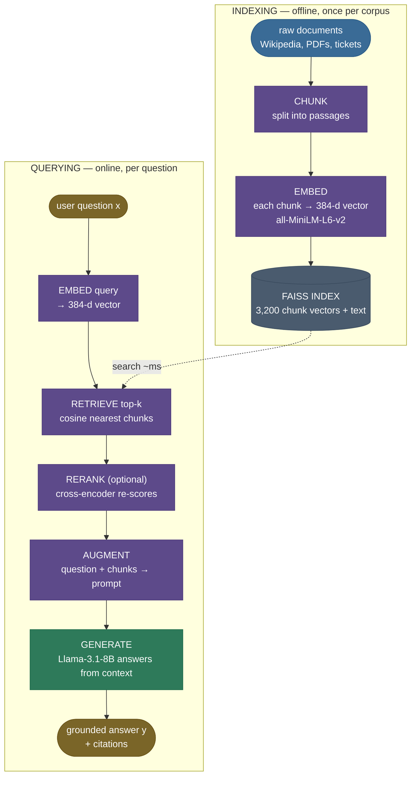

# RAG Fundamentals: retrieve, then generate

Ask a strong language model a real but *obscure* factual question — *"What was reversed about the temperature scale in 1745?"* — and watch what happens. Here is `meta-llama/Llama-3.1-8B-Instruct`, answering live from memory alone, in [the notebook next to this page](code/01-RAG-Fundamentals.ipynb):

```
In 1745, the temperature scale was reversed by Anders Celsius.
```

Fluent, confident, specific — and **wrong**. The Celsius scale *was* flipped in 1745 (from "100 = freezing" to the "0 = freezing" we use today), but it was done by **Carolus Linnaeus**, not Celsius. The model has the *shape* of the fact but the wrong *content*, and it states the error with total assurance. This is the single most dangerous failure mode of a frozen LLM: not "I don't know," but a **plausible falsehood indistinguishable from a real answer** — unless you already know the truth.

Now give the same model the same question, but first **retrieve the relevant Wikipedia passage and put it in the prompt.** The answer changes:

```
The temperature scale was reversed by Carolus Linnaeus in 1745, to how it is today [1].
```

Correct — *and it cites the passage it used.* Nothing about the model changed. The only difference is that the true fact was sitting in front of it when it answered. That is **Retrieval-Augmented Generation (RAG)**, and it is the architecture the entire LLM-application industry converged on: don't try to *bake* knowledge into the weights — **fetch it at question time and staple it onto the prompt.** It's the difference between a closed-book exam and an open-book one.

Everything on this page is run live against **real components** — the same ones production RAG uses, not a classroom stand-in:

| Stage | Real component (verified running) |
|---|---|
| Corpus | [`rag-datasets/rag-mini-wikipedia`](https://huggingface.co/datasets/rag-datasets/rag-mini-wikipedia) — **3,200 real Wikipedia passages + 918 QA pairs** |
| Embeddings | `sentence-transformers/all-MiniLM-L6-v2` — a real bi-encoder, **384-dim** |
| Vector index | **FAISS** `IndexFlatIP` — a real nearest-neighbour index over the real vectors |
| Reranker | `cross-encoder/ms-marco-MiniLM-L-6-v2` — a real cross-encoder |
| Generation | `meta-llama/Llama-3.1-8B-Instruct` via the **Hugging Face Inference API** |

I'm going to build this the way I'd explain it to a teammate wiring up their first RAG system — from *why* a bare prompt fails (you just felt it), through the open-book-exam intuition, the retrieve-then-generate pipeline, the similarity math the retriever runs, the **real** worked pipeline you can re-run, the failure modes that bite every production system *shown failing on this real data*, and where RAG is — and isn't — the right tool. By the end you'll be able to:

- explain **why RAG beats fine-tuning** for fresh/private/factual knowledge, and when it doesn't;
- name every stage of the **chunk → embed → index → retrieve → augment → generate** pipeline and what each does;
- derive **cosine similarity** and **top-k retrieval**, and write the **RAG marginalization** $P(y\mid x)=\sum_z P(z\mid x)\,P(y\mid x,z)$ from the original paper;
- read real retrieval scores and predict which passage the generator will ground on;
- diagnose the classic failures — **bad chunks, low recall, lost-in-the-middle, stale index** — and the fix for each, and know that **reranking lifted our real recall@1 from 0.42 to 0.65**.

> **Note:** RAG is a *knowledge-injection* mechanism, not a *reasoning* one. It changes **what facts the model has access to**, not how well it reasons over them. Give it the wrong passages and a perfect reasoner still answers wrong — which is why almost all of RAG's engineering effort goes into *retrieving the right passages*, the theme of every chapter after this one.

---

## The problem: parametric knowledge is frozen, and it hallucinates

To see why RAG exists, you have to feel the gap a bare prompt leaves — and you just did, with Linnaeus. Let's name why it happens.

A pretrained LLM stores everything it "knows" in its weights — its **parametric knowledge**. That knowledge has three hard limits:

1. **It's frozen at the training cutoff.** A model trained through 2023 cannot know a 2024 product launch, last week's incident report, or the price you changed this morning. Re-training to add one fact costs millions of dollars and weeks of compute — absurd for knowledge that changes daily.
2. **It never saw your private data.** Your internal wiki, customer records, and codebase were not in the pretraining corpus. The model has *zero* information about your Q3 roadmap because your Q3 roadmap is yours.
3. **When it doesn't know — or half-knows — it often doesn't *say* so.** Decoding samples the most *plausible-sounding* continuation, not the most *true* one. Asked for a fact it lacks or half-remembers, a model frequently emits a fluent, specific, **wrong** answer — a hallucination — because "reversed by Anders Celsius" reads more like an answer than "I'm not sure who reversed it."

Our opening example is limit #3 in its purest form. The 1745 scale-reversal is *right on the edge* of the model's memory: it has strongly associated "temperature scale" with "Celsius," so it confidently emits **Celsius** — the most available name, not the correct one (Linnaeus). It's the **worst** failure mode: not an error message, but a confident falsehood with fake specifics.

You could try to fix this by **fine-tuning** the facts in. It mostly doesn't work for this job: fine-tuning is expensive, has to be redone every time a fact changes, tends to *teach style more reliably than it teaches facts*, and still gives you no **citation** — no way to show *where* an answer came from or to update one fact without retraining. (Fine-tuning shines for teaching *behavior and format*; RAG shines for *knowledge*. They're complementary, not rivals — more in §Where it matters.)

What we actually need: a way to give the model the **right facts at question time**, from a source we control and can update instantly, with the **provenance** to cite and verify. That's retrieval — and here is retrieval scoring every candidate passage for that exact question:

![Real cosine similarity of the top corpus passages to the query "What was reversed about the temperature scale in 1745?", sorted best-first, with the top-3 retrieval cutoff. The answering passage doc[144] scores 0.539 — the highest — so it is retrieved and fed to the generator; passages below the cutoff score lower and are left out. These are the actual cosine scores the all-MiniLM-L6-v2 embedder produces over the real 3,200-passage Wikipedia corpus. Generated by `code/make_figures_01.py`.](../images/rag01_similarity_bars.png)

---

## Intuition first: the open-book exam

Here is the mental model that holds up under questioning.

A frozen LLM answering from memory is a student taking a **closed-book exam**: everything must come from what they happened to memorize. Ask about a topic they half-studied and they either blank or — worse — bluff a confident wrong answer (our "Anders Celsius" mistake exactly).

**RAG turns it into an open-book exam.** The student still has to *understand the question and write the answer in their own words* — that's the language model's job, and it's still essential. But now, before answering, they get to **flip to the relevant pages of the textbook and read the exact passage that addresses the question.** The answer is composed by the student but *grounded in the page they just read*. That's why the grounded model got Linnaeus right: the correct sentence was on the open page in front of it.

Push on the analogy — it survives, and where it bends, it teaches:

- **"What if the textbook doesn't cover the question?"** Then the open book doesn't help — exactly RAG's behavior. If the corpus lacks the answer, retrieval returns junk and the model has nothing to ground on. (We see this live below: ask about *yesterday's* stock price and the best match is a meaningless "125px" image caption — so the honest grounded answer is "I don't know.") RAG can only surface knowledge that *exists in the corpus*; it cannot conjure it. (Failure mode: low recall / missing document.)
- **"What if they flip to the wrong page?"** They'll answer confidently from irrelevant text — RAG's single most common failure. The quality of the answer is capped by the quality of *retrieval*, which is why every later chapter is about retrieving better.
- **"What if the page is outdated?"** They'll give a stale answer with full confidence. RAG is only as fresh as its index — re-index when the source changes. (Failure mode: stale index.)
- **"Why not just memorize the whole book?"** That's fine-tuning — slow, expensive, and you must re-memorize the entire book every time one sentence changes. Flipping to a page (retrieval) is instant and updatable.

The mapping to the mechanism is exact: **the textbook is your corpus, flipping to the right page is retrieval, reading the passage into your working memory is prompt augmentation, and writing the answer is generation.** Hold that picture; everything below is the engineering that makes "flip to the right page" fast and accurate.

![Animated — the retrieve → augment → generate loop in motion, on the real corpus. Left: the real query (star) sits in the real 384-d embedding space (projected to 2D) and lights up its nearest passages (green, with beams) — that's retrieval as nearest-neighbour search. Right: those retrieved Wikipedia passages flow into the augmented prompt as numbered context, and the real grounded answer — "reversed by Carolus Linnaeus in 1745 [1]", produced by Llama-3.1-8B — is generated from the evidence, not from memory. The passages that light up are exactly the top-3 the FAISS index returns on this page. Generated by `code/make_animation_01.py`.](../images/rag01_retrieve_augment_generate.gif)

---

## The mechanism: the retrieve-then-generate pipeline

RAG has two phases that happen at different times. **Indexing** runs *once, offline*: you prepare the corpus so it's searchable. **Querying** runs *every time a user asks*: retrieve, augment, generate. Keeping these straight is the first thing to get right.



Stage by stage:

1. **Chunk.** Split each document into passages small enough to embed meaningfully and to fit several into a prompt — typically a few hundred tokens. (Our real corpus ships pre-chunked: 3,200 passages, median **48 words** each.) Too big and a chunk dilutes its own meaning and blows the context budget; too small and it loses the surrounding context needed to answer. (This one decision is so consequential it gets its own chapter — *Document Chunking Strategies*.)
2. **Embed.** Map each chunk to a dense vector with an embedding model, so that *semantically similar text lands at nearby points*. This is what lets retrieval match on **meaning**, not just keywords — "liftoff date" can find a passage that says "was launched on." Our real embedder turns each passage into a **384-dimensional unit vector**.
3. **Index.** Store all chunk vectors (with their source text) in a structure built for fast nearest-neighbour search. Here that's a real **FAISS** index holding 3,200 vectors; at production scale it's an approximate-nearest-neighbour (ANN) index in a vector database (*Vector Databases & ANN Indexes*).
4. **Retrieve.** At query time, embed the question with the **same** model, then find the **top-k** chunks whose vectors are closest to the query vector. "Closest" almost always means highest **cosine similarity** — the math of the next section. On our corpus this is ~**10–30 ms** per query.
5. **Rerank (optional but high-value).** Re-score a shortlist of retrieved candidates with a **cross-encoder** that reads each (query, passage) pair jointly — far more accurate than the fast bi-encoder, so it fixes the misordering the first stage leaves. (We measure its effect below; full treatment in *Re-ranking with Cross-Encoders*.)
6. **Augment.** Splice the retrieved chunks into a prompt template alongside the question, with an instruction like *"answer using only the context below."* This is the literal "open book on the desk."
7. **Generate.** The LLM reads the augmented prompt and produces an answer grounded in the supplied passages — ideally with citations back to which chunk each claim came from (our real answer ends with `[1]`).

> **Note:** the embedder used at **index time** and at **query time must be the same model** (or a matched query/document pair). Embed your corpus with model A and your queries with model B and the two vector spaces don't align — cosine similarities become meaningless and retrieval returns garbage. It's the most common silent RAG bug.

---

## The math: similarity, top-k, and the RAG marginal

Three pieces of math run this pipeline. None is heavy; each connects directly to the intuition and to a real number the code prints.

### 1. Cosine similarity — "how aligned are these two meanings?"

An embedding model maps text to a vector $\mathbf{u}\in\mathbb{R}^{d}$ (here $d$ = embedding dimension; our real embedder uses $d=384$). To compare a query vector $\mathbf{q}$ with a passage vector $\mathbf{p}$ we use **cosine similarity** — the cosine of the angle between them:

$$
\operatorname{cos}(\mathbf{q},\mathbf{p}) \;=\; \frac{\mathbf{q}\cdot\mathbf{p}}{\lVert\mathbf{q}\rVert\,\lVert\mathbf{p}\rVert} \;=\; \frac{\sum_{i=1}^{d} q_i\,p_i}{\sqrt{\sum_i q_i^2}\,\sqrt{\sum_i p_i^2}} \;\in\; [-1, 1].
$$

> **Source / derivation:** [Manning, Raghavan & Schütze, *Introduction to Information Retrieval*, §6.3 "The vector space model"](https://nlp.stanford.edu/IR-book/html/htmledition/dot-products-1.html) — derives cosine similarity as the angle between document vectors, the foundation retrieval scoring is built on.

Symbols: $q_i, p_i$ are the $i$-th components; $\mathbf{q}\cdot\mathbf{p}$ is the dot product; $\lVert\cdot\rVert$ is the L2 (Euclidean) norm. **Why cosine and not raw dot product or distance?** Cosine measures *direction*, ignoring magnitude — so a long passage and a short query that are *about the same thing* score high, even though their raw vectors differ in length. A score near **1** means "same direction → same meaning"; near **0** means "orthogonal → unrelated." Concretely: our in-corpus question scored the right passage at **cos = 0.539**, while an out-of-corpus question's best match limped in at **cos = 0.294** — the number itself signals "I have nothing relevant."

**The shape trick that makes retrieval one matmul.** If we **L2-normalize** every vector at index time — replace each $\mathbf{p}$ with $\mathbf{p}/\lVert\mathbf{p}\rVert$ so $\lVert\mathbf{p}\rVert = 1$ — then the denominator vanishes and cosine *collapses to a plain dot product*: $\operatorname{cos}(\mathbf{q},\mathbf{p}) = \mathbf{q}\cdot\mathbf{p}$. Stack the $N$ normalized passage vectors into a matrix and one matrix-vector product scores them all at once:

$$
\mathbf{s} \;=\; \mathbf{P}\,\mathbf{q}, \qquad \mathbf{P}\in\mathbb{R}^{N\times d},\;\; \mathbf{q}\in\mathbb{R}^{d},\;\; \mathbf{s}\in\mathbb{R}^{N},
$$

where row $j$ of $\mathbf{P}$ is passage $j$'s unit vector and $s_j = \operatorname{cos}(\mathbf{q}, \mathbf{p}_j)$. This is *exactly* what `sentence-transformers`' `normalize_embeddings=True` + FAISS `IndexFlatIP` compute — inner product over unit vectors is cosine, and FAISS does the $N$ dot products for us in ~milliseconds (we confirm every row is unit-norm in the notebook).

### 2. Top-k retrieval — keep the best, drop the rest

Retrieval returns the **$k$ passages with the highest similarity**:

$$
\mathcal{R}_k(\mathbf{q}) \;=\; \operatorname*{arg\,top\text{-}k}_{j \in \{1,\dots,N\}} \; s_j \;=\; \operatorname*{arg\,top\text{-}k}_{j} \; \mathbf{q}\cdot\mathbf{p}_j .
$$

$\mathcal{R}_k(\mathbf{q})$ is the set of $k$ chunk indices fed into the prompt. **$k$ is the central knob:** larger $k$ raises **recall** (the answer is more likely to be *somewhere* in the retrieved set) but adds **noise and cost** (more irrelevant text, more tokens, more chance the model is distracted). We *measure* this tradeoff on real data below — dense recall climbs from **0.42 at $k{=}1$ to 0.74 at $k{=}20$.**

### 3. The RAG marginalization — why "retrieve then generate" is principled

The original RAG paper frames the whole thing probabilistically. We want $P(y\mid x)$: the probability of answer $y$ given question $x$. RAG introduces a **latent retrieved document $z$** and marginalizes over the retrieved set:

$$
P(y\mid x) \;=\; \sum_{z \,\in\, \mathcal{R}_k(x)} \underbrace{P(z\mid x)}_{\text{retriever}} \; \underbrace{P(y\mid x, z)}_{\text{generator}} .
$$

> **Source / derivation:** [Lewis et al. (2020), *Retrieval-Augmented Generation for Knowledge-Intensive NLP Tasks*, Eq. 1–2 (arXiv:2005.11401)](https://arxiv.org/abs/2005.11401) — defines the RAG-Sequence/RAG-Token models that marginalize a generator over the top-k documents returned by a DPR retriever; this is the equation that named the field.

Read it as a clean division of labor. $P(z\mid x)$ is the **retriever**: how relevant is passage $z$ to question $x$ — in practice a **softmax over the cosine scores** $s_j = \mathbf{q}\cdot\mathbf{p}_j$ you just computed,

$$
P(z\mid x) \;=\; \frac{e^{\,s_z}}{\sum_{j\,\in\,\mathcal{R}_k(x)} e^{\,s_j}},
$$

which turns the raw similarities into retrieval probabilities that sum to 1. $P(y\mid x,z)$ is the **generator**: how likely the LLM is to produce answer $y$ given the question *and* that passage in its prompt. The answer is a **retriever-weighted blend** of the answers each passage supports — passages the retriever trusts more (higher $s_z$, so higher $P(z\mid x)$) pull the final answer toward what they say.

In practice most production systems use the cheaper approximation: take the single best passage set, concatenate it into one prompt, and generate once — i.e. condition on $\mathcal{R}_k(x)$ jointly rather than summing per-document. That is exactly what our real pipeline does (`build_prompt` concatenates the top-k, one `chat_completion` call generates). The marginalization is the *principled* form (and what you'd cite in an interview); the concatenate-and-generate-once version is what the real code and most apps actually run.

---

## Worked example: a real RAG you can re-run end to end

Let's walk the **real** pipeline. Everything below is produced by [the teaching notebook](code/01-RAG-Fundamentals.ipynb) and the [production-shaped module](code/rag_fundamentals.py) (`RagPipeline`) beside this page — real dataset, real models, real FAISS, real LLM calls. Every number and every answer is a pasted, executed output; nothing here is hand-typed.

> **Runnable module + step-by-step notebook:** the [deep teaching notebook](code/01-RAG-Fundamentals.ipynb) runs each stage with an intuition lead-in, and [`rag_fundamentals.py`](code/rag_fundamentals.py) is the typed module it imports (`python rag_fundamentals.py` runs the headline demo). Both set the **libomp OpenMP guard** (`KMP_DUPLICATE_LIB_OK`, `OMP_NUM_THREADS=1`) *before* importing faiss/torch — without it, faiss + torch loading two OpenMP runtimes segfaults on macOS. That guard is the first real-world gotcha of building RAG locally.

**Step 1 — load the real corpus and build the index.** `RagPipeline(passages)` embeds all 3,200 Wikipedia passages with `all-MiniLM-L6-v2` and adds them to a FAISS `IndexFlatIP`:

```python
from rag_fundamentals import RagPipeline, load_corpus

passages, qa = load_corpus()          # 3,200 real passages + 918 real QA pairs
pipeline = RagPipeline(passages)      # embed corpus (~6s) + build FAISS index

print(pipeline.embeddings.shape)      # (3200, 384)  — one 384-d unit vector per passage
print(pipeline.index.ntotal)          # 3200         — vectors in the FAISS index
```

```
embeddings shape (n_passages, dim): (3200, 384)
every row unit-norm: True
FAISS index type: IndexFlatIP | vectors indexed: 3200
```

**Step 2 — retrieve the top-k for the headline question.** Embed the query with the *same* embedder, let FAISS score all 3,200 passages, take the top-3:

```python
question = "What was reversed about the temperature scale in 1745?"
hits = pipeline.retrieve(question, k=3)
for rank, h in enumerate(hits, 1):
    print(f"{rank}. doc[{h.doc_id}] cos={h.score:.3f} | {h.text[:80]}")
```

```
FAISS search over 3200 vectors took 27.5 ms

1. doc[144] cos=0.539 | Celsius founded the Uppsala Astronomical Observatory in 1741, and in 1742 he
2. doc[145] cos=0.530 | Anders Celsius was the first to perform and publish careful experiments aiming
3. doc[140] cos=0.420 | The observatory of Anders Celsius, from a contemporary engraving.
```

Read those scores: the answering passage **doc[144]** wins at **cos = 0.539**, and its full text contains the exact fact — *"The scale was reversed by Carolus Linnaeus in 1745, to how it is today."* Retrieval found the right page. And it did so semantically: the query says *"reversed… temperature scale… 1745"* and matches a passage about Celsius, Linnaeus, and thermometers — meaning, not keyword overlap.

![Retrieval is nearest-neighbour search. A real sample of the corpus and the query, projected from 384-d to 2D (PCA, for visualization only). The query star sits right next to its top-3 retrieved passages (green, with connector beams) — doc[144], doc[145], doc[140], the Celsius/Linnaeus cluster — while unrelated passages are scattered far away in grey and near-miss passages (ranks 4–12) sit in between. "Find the answer" is literally "find the nearest points." Generated by `code/make_figures_01.py`.](../images/rag01_embedding_space.png)

**Step 3 — the headline contrast: grounded vs ungrounded, same real LLM.** Ask `Llama-3.1-8B-Instruct` the same question two ways:

```python
ungrounded = pipeline.generate_ungrounded(question)          # bare question, memory only
result     = pipeline.answer(question, rerank=False)          # retrieve → augment → generate
print("UNGROUNDED:", ungrounded)
print("GROUNDED:  ", result.answer)
```

```
UNGROUNDED: In 1745, the temperature scale was reversed by Anders Celsius.
GROUNDED:   The temperature scale was reversed by Carolus Linnaeus in 1745, to how it is today [1].
            [model: meta-llama/Llama-3.1-8B-Instruct | retrieve 27.5 ms | generate 1.08 s]
```

That's the whole point in two lines, on real data. **Without retrieval** the model confidently misattributes the fact to *Celsius* — a real hallucination. **With retrieval**, the correct passage is in the prompt, so the answer names *Linnaeus*, correctly, *and cites doc[1]*. Same model, same question; the only difference is what was in the prompt.

**Step 4 — the augmented prompt the generator actually sees.** This is the "open book on the desk," made literal — the real prompt `build_prompt` constructed:

```
Answer the question using ONLY the context below. If the context does not contain the answer,
say you don't know. Cite the passage number(s) in square brackets that you used.

Context:
[1] Celsius founded the Uppsala Astronomical Observatory in 1741, and in 1742 he proposed the
    Celsius temperature scale... The scale was reversed by Carolus Linnaeus in 1745, to how it
    is today  Linnaeus' thermometer .
[2] Anders Celsius was the first to perform and publish careful experiments aiming at the
    definition of an international temperature scale on scientific grounds...
[3] The observatory of Anders Celsius, from a contemporary engraving.

Question: What was reversed about the temperature scale in 1745?
Answer:
```

![Anatomy of the real augmented prompt: three blocks — the INSTRUCTION ("answer using only the context, cite [n]"), the CONTEXT (the real retrieved Celsius/Linnaeus passages, the grounding), and the QUESTION. The whole block, not just the question, is what the LLM generates from — that's what "augmented" means. Generated by `code/make_figures_01.py`.](../images/rag01_prompt_anatomy.png)

**Step 5 — the honest "I don't know" when the corpus can't help.** Ask something a 2007-era Wikipedia corpus obviously can't contain:

```python
oo = "What was the closing share price of Nvidia stock yesterday?"
print(pipeline.retrieve(oo, k=3)[0].score)      # best cosine = 0.294 (junk)
print(pipeline.answer(oo, rerank=False).answer) # I don't know.
```

```
Best retrieved passages (junk-level cosine):
  1. doc[112]  cos=0.294 | '125px'
  2. doc[2785] cos=0.280 | 'Closing ceremony for the National Stadium'
GROUNDED answer: I don't know.
```

The top match is a meaningless image-size caption at **cos = 0.294** — far below the ~0.54 the in-corpus question scored. Because the prompt says *"if the context does not contain the answer, say you don't know,"* the grounded system **refuses instead of inventing.** That refusal is a feature; the low similarity is itself the signal, and many production systems set a floor below which they decline.

**Step 6 — reranking fixes a real retrieval miss.** The fast bi-encoder embeds query and passage *independently*, so it sometimes misjudges relevance. For *"When was Abraham Lincoln inaugurated as president?"* it ranks a useless title chunk first:

```python
dense    = pipeline.retrieve(rerank_q, k=5)
reranked = pipeline.rerank(rerank_q, dense, k=5)   # cross-encoder re-scores the same 5
```

```
DENSE order (bi-encoder cosine):           RERANKED order (cross-encoder logit):
  1. doc[288] cos=0.654 'Young Abraham        1. doc[322] ce=+9.37 'March 4, 1861,
     Lincoln'         ← useless, ranked #1!     inauguration of Abraham Lincoln'  ← fixed
  2. doc[322] cos=0.585 'March 4, 1861,       2. doc[357] ce=+8.00 ...
     inauguration...'                         3. doc[341] ce=+6.58 ...
  ...                                         5. doc[288] ce=-2.99 'Young Abraham Lincoln'
                                                                    ← demoted to last
```

The bi-encoder put **doc[288]** ("Young Abraham Lincoln" — lexically Lincoln-y, factually empty) at #1 with the *highest* cosine. The cross-encoder, reading each passage *against the question*, gives it the *lowest* score (**ce = −2.99**) and drops it to last, promoting the real inauguration passage **doc[322]** to #1 (**ce = +9.37**). **The bi-encoder retrieves; the cross-encoder judges.**

![Reranking fixes a real retrieval miss (query: Lincoln's inauguration date). Left: the dense bi-encoder ranks doc[288] "Young Abraham Lincoln" #1 by cosine (0.654) — useless. Right: the cross-encoder re-scores the same five candidates and demotes doc[288] to last (logit −2.99), promoting the actual inauguration passage doc[322] to #1 (logit +9.37). These are the real scores both models produce. Generated by `code/make_figures_01.py`.](../images/rag01_rerank_win.png)

**Step 7 — measure what matters: recall@k, dense vs reranked.** One query is an anecdote; to *engineer* RAG you need a number. **Recall@k** — over many real questions, how often is a supporting passage in the top-k? — is the **ceiling on RAG quality** (if the answer isn't retrieved, a perfect LLM still can't answer). Measured over 200 real QA pairs (a passage "supports" a question if its text contains the gold answer string):

```
DENSE recall@k:              recall@1 = 0.420   recall@5 = 0.660   recall@20 = 0.740
+ cross-encoder rerank:      recall@1 = 0.650   recall@3 = 0.710   recall@5  = 0.710
```

Two lessons in those numbers. **Dense recall@1 is only 0.42** — the single top hit supports the answer just 42% of the time — and it climbs with $k$ (more retrieved ⇒ more likely the answer is in the set, at the cost of noise). And **reranking lifts recall@1 from 0.42 to 0.65** — it delivers *top-5 quality at rank 1* by promoting the passage the bi-encoder buried. That is the cheapest large win in retrieval, and exactly why serious RAG adds a reranker.


**The library one-liner.** In production you don't hand-roll the plumbing; a framework wires the same stages — but it hides exactly the mechanics we just made real, which is why building it once by hand is the lesson the API can't teach:

```python
# LangChain, conceptually — same chunk→embed→index→retrieve→augment→generate pipeline
from langchain_community.vectorstores import FAISS
from langchain_huggingface import HuggingFaceEmbeddings

emb = HuggingFaceEmbeddings(model_name="sentence-transformers/all-MiniLM-L6-v2")
vectorstore = FAISS.from_texts(passages, embedding=emb)               # chunk+embed+index
retriever   = vectorstore.as_retriever(search_kwargs={"k": 3})       # retrieve top-k
# rag_chain = retriever | prompt_template | llm                       # augment + generate
```

---

## Pitfalls and failure modes

RAG fails in characteristic ways, and *every one of them is a retrieval problem dressed up as a generation problem.* Name them so you recognize them in the wild — and note that we hit two of them *live* on the real data above.

**1. Chunk-boundary loss.** Split a document badly and the answer straddles two chunks — half in one, half in the next — so no single chunk is fully retrievable.

- *Failing:* a chunker cuts every 100 words mid-sentence. A passage *"...the scale was reversed by // Carolus Linnaeus in 1745..."* splits the actor from the action. A query matches the first half (no name) or the second (no context), and the model never sees the complete fact. (Our real corpus avoids this because doc[144] keeps "reversed by Carolus Linnaeus in 1745" *whole* in one chunk — which is exactly why retrieval + generation nailed it.)
- *Fix:* chunk on **semantic boundaries** (paragraphs, sections), add **overlap** between adjacent chunks so a straddling fact appears whole in at least one, and keep chunks coherent. This is consequential enough to be the next chapter, *Document Chunking Strategies*.

**2. Retrieval misses / low recall.** The answering passage exists in the corpus but isn't in the top-k — so the model has the wrong evidence and either says "I don't know" or grounds on a distractor.

- *Failing (measured):* on our real corpus, **dense recall@1 is only 0.42** — the top hit supports the answer barely half the time. And we saw the *mechanism* of the miss directly: for the Lincoln query the bi-encoder ranked the empty "Young Abraham Lincoln" chunk #1 over the actual inauguration passage.
- *Fix (measured):* better (learned, semantic) **embeddings** so paraphrases match (*Embedding Models for Retrieval*); **hybrid search** combining dense + keyword/BM25 (*Hybrid Search*); raise **k**; add a **re-ranker** — which lifted our real **recall@1 from 0.42 to 0.65** (*Re-ranking with Cross-Encoders*).

**3. Lost in the middle.** Even when the right passage *is* retrieved, LLMs use evidence best when it sits at the **start or end** of a long context and *worst when buried in the middle* — a documented U-shaped accuracy curve.

- *Failing:* you retrieve k=20 chunks to be safe; the answer is chunk #11, dead center; the model glosses over it and answers as if it weren't there.
- *Fix:* retrieve **fewer, better** chunks (don't pad k for its own sake — note our recall@5-after-rerank already matches recall@20-dense, so you *can* afford a small k); **re-rank** so the most relevant passage is placed first; keep prompts tight. Position matters as much as presence.


**4. Stale index.** The source changed; the index didn't. Every query now retrieves the old facts with full confidence.

- *Failing:* a Wikipedia article is edited; you update the doc but never re-embed it. RAG keeps citing the old text — *worse* than a frozen LLM, because it *looks* sourced. (This is also why our out-of-corpus stock question can only ever say "I don't know": a 2007-era snapshot has no 2026 prices — freshness is a corpus property, not a model one.)
- *Fix:* a **re-indexing pipeline** triggered on source change (or on a schedule), with content-hash cache keys so changed chunks are re-embedded and stale ones evicted. Freshness is an operational discipline, not a one-time build.

> **Gotcha:** notice all four fixes are about **getting the right text into the prompt** — none is "use a smarter LLM." The generator is rarely the bottleneck; retrieval almost always is. Our numbers prove it: swapping a bigger LLM wouldn't move recall@1 off 0.42, but a reranker moved it to 0.65. That's the single most important mental adjustment when debugging a RAG system: *suspect retrieval first.*

---

## Where it matters, and where it doesn't

**The one problem RAG solves:** giving a frozen model access to knowledge it doesn't have in its weights — **fresh** (post-cutoff), **private** (your data), or **factual** (where you need it grounded and citable) — *without retraining*, and with **provenance** so answers can be verified and individual facts updated instantly. Our Linnaeus example is the "factual/grounded" case in miniature: the fact existed publicly, but the model half-knew it and got it wrong from memory — retrieval fixed both the correctness *and* gave a citation.

**Which layer it lives at.** RAG sits at the **application/serving layer**, wrapped *around* an unmodified LLM — it touches your prompt-construction and a retrieval service, not the model weights. That's its great virtue: swap the base model (we could drop in Llama-3.3-70B or DeepSeek-V3 by changing one list), keep the whole RAG stack; update a document, no retraining.

**The core tradeoff:** RAG buys freshness, privacy, and citability at the cost of **retrieval complexity and latency** — you now own a chunker, an embedder, a vector index, and a retrieval step on the critical path of every query, plus the failure modes above. (In our run, retrieval added ~30 ms and reranking a bit more, while generation dominated at ~1 s — but *retrieval quality*, not its latency, is what determines whether the answer is right.) You trade "the model just knows" for "the model can look it up, *if* your retrieval is good."

**RAG vs fine-tuning — pick by what you're injecting:**

| You want to change… | Reach for | Why |
|---|---|---|
| **What the model knows** (facts, docs, fresh/private data) | **RAG** | Update the index, not the weights; instant, citable, cheap |
| **How the model behaves** (tone, format, a skill, a domain style) | **Fine-tuning** | Behavior lives in weights; retrieval can't inject a *style* |
| Both | **Both** | Fine-tune the behavior, RAG the knowledge — they compose |

**When RAG is NOT the answer:**

- **The knowledge is already in the weights and stable.** Asking a general model general facts ("who was the 16th US president?") needs no retrieval — the model knows it cold, and adding retrieval only adds latency and a distractor. (RAG earns its keep precisely on the *obscure* edge — the Linnaeus attribution the model got wrong from memory.)
- **You need a behavior or skill, not a fact.** "Always reply in formal Japanese" or "write in our house style" is a fine-tuning job; no retrieved passage instills a style.
- **The whole relevant corpus fits comfortably in the context window** *and* cost/latency allow stuffing it all in. Then you may not need *selective* retrieval at all — though at scale this gets expensive and runs straight into lost-in-the-middle (the *Long-Context vs RAG* chapter weighs this directly).
- **The task is pure reasoning/transformation over text already in the prompt** (summarize *this*, translate *this*). There's nothing external to retrieve.

---

## In production

RAG is the backbone of nearly every knowledge-grounded LLM product shipping today. The pipeline you just ran on 3,200 Wikipedia passages is, architecturally, the same one behind:

- **Enterprise "chat with your docs"** — Glean, Notion AI, and countless internal copilots retrieve over a company's wiki/tickets/code so the assistant answers from *your* knowledge with citations, not the base model's frozen memory. (Same `retrieve → augment → generate`, larger corpus, an ANN index instead of `IndexFlatIP`.)
- **Customer support and search** — retrieval over a help center / knowledge base so answers are grounded in current policy and *linkable* to the source article, the property support teams care about most.
- **Coding assistants** — retrieve relevant files/symbols from *your* repository into the prompt so completions reflect your actual codebase, not generic patterns from pretraining.
- **Perplexity-style answer engines** — retrieve live web results, then generate a synthesized answer *with inline citations* — RAG over the open web, with provenance as the headline feature.

**Scaling the toy to real:** three things change from our 3,200-vector demo to a billion-chunk system. (1) **The index** — `IndexFlatIP` does exact search in ~ms here; at millions/billions of vectors you switch to an **approximate** index (HNSW, IVF-PQ) in a vector database, trading a little recall for sub-linear search (*Vector Databases & ANN Indexes*). (2) **Freshness** — a real re-indexing pipeline replaces our one-shot build. (3) **Retrieval quality** — everything the rest of this domain is about: better chunking, better embeddings, hybrid search, reranking (which we saw lift recall@1 by 23 points), query transformation, and evaluation.

**When to reach for it:** the moment your app must answer over knowledge that is **private, changing, or must be cited** — which is most real LLM applications. It's the *default* architecture for knowledge-grounded assistants precisely because it's cheap to update (re-index, don't retrain), model-agnostic (wrap any LLM), and auditable (every claim traces to a source).

> **Note:** the through-line of every remaining chapter in this domain: the generator is the easy part, and *retrieval is where RAG is won or lost.* Our own numbers said it — a reranker moved recall@1 from 0.42 to 0.65 while the LLM never changed. Internalize that and the whole field organizes itself around one question — *how do we put the right passages in front of the model?*

---

## Recap and rapid-fire

**If you remember nothing else:** a frozen LLM's knowledge is stuck at its training cutoff and half-remembers facts on its edge, so it hallucinates *confidently* (our model swore the temperature scale was reversed by "Anders Celsius" — it was Linnaeus). RAG fixes this by **retrieving the relevant passages at query time and putting them in the prompt** — an open-book exam instead of a closed-book one — and the same model then answered *correctly, with a citation*. The pipeline is **chunk → embed → index** (offline) then **retrieve top-k → (rerank) → augment → generate** (per query); retrieval ranks passages by **cosine similarity**, and the principled form marginalizes the generator over retrieved documents, $P(y\mid x)=\sum_z P(z\mid x)P(y\mid x,z)$. Almost every RAG failure is a *retrieval* failure — bad chunks, low recall, lost-in-the-middle, or a stale index — which is why reranking (recall@1: 0.42 → 0.65) beats a bigger LLM.

**Quick-fire — say these out loud:**

- *Why RAG over fine-tuning for facts?* RAG updates an index (instant, cheap, citable); fine-tuning bakes facts into weights (slow, costly, must redo per change, no provenance). Use fine-tuning for *behavior*, RAG for *knowledge*.
- *What are the stages?* Chunk, embed, index (offline); retrieve top-k, optionally rerank, augment, generate (online).
- *Why cosine and not Euclidean distance?* Cosine compares *direction* (meaning), ignoring magnitude — so a long passage and a short query about the same thing still match. (Normalize vectors → cosine == dot product == one FAISS matmul.)
- *Why must index-time and query-time embedders match?* Different models → misaligned vector spaces → meaningless similarities → garbage retrieval.
- *What does k trade off?* Higher k → higher recall (answer more likely retrieved: 0.42→0.74 from k=1 to k=20 on our data) but more noise, cost, and lost-in-the-middle risk.
- *What does a reranker buy you?* A cross-encoder re-scores the top candidates jointly; on our real data it lifted recall@1 from 0.42 to 0.65 — top-5 quality at rank 1.
- *Write the RAG marginalization.* $P(y\mid x)=\sum_{z}P(z\mid x)\,P(y\mid x,z)$ — retriever × generator, summed over retrieved docs.
- *Most common RAG failure?* Retrieval miss / low recall — the answering passage isn't in the top-k. Suspect retrieval first.
- *When is RAG the wrong tool?* Knowledge already in the weights and stable; you need a behavior not a fact; or the whole corpus fits the context window cheaply.

---

## References and further reading

The curated link library for this topic — videos, courses, articles, papers, books, and internal cross-links — lives in a companion file so it can be reused as a standalone reference list:

**→ [RAG Fundamentals — references and further reading](01-RAG-Fundamentals.references.md)**
