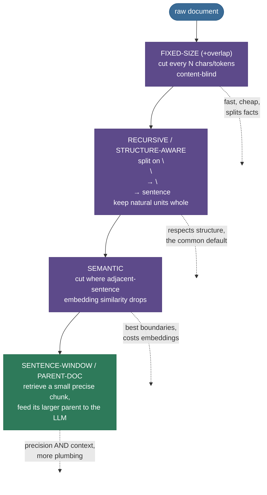

# Document Chunking Strategies: where you cut decides what you can find

In [RAG Fundamentals](../01-RAG-Fundamentals/01-RAG-Fundamentals.md) we ended on a promise: the most common RAG failure is **chunk-boundary loss** — the answer straddles two chunks, so no single chunk holds it whole, and retrieval can never return it. This chapter is that promise paid off. Before any text can be embedded, indexed, or retrieved, it has to be **split into chunks** — and *how* you make that cut silently sets the ceiling on everything downstream. A perfect embedder and a perfect LLM cannot recover a fact your chunker sliced in half.

Here is the failure, concretely. Take a one-line fact — *"It was launched on March 3rd, 2024"* — and split the document into fixed 140-character chunks, the laziest possible strategy. The boundary lands at character 140, which falls **inside the date**: chunk 0 ends `...on Marc` and chunk 1 begins `h 3rd, 2024...`. The phrase "March 3rd, 2024" now exists in **neither chunk whole**. Embed those chunks, ask "when was it launched?", and retrieval returns a fragment with no usable date. The fact was *in the document* — your chunker destroyed it.

I'll build this the way I'd tune a real RAG index — start from *why* the cut matters (feel a fact shatter), then the index-card intuition, then the strategy ladder from blind fixed-size up to semantic and parent-document, the size/overlap math with its token cost, three chunkers built and **measured** from scratch, the cuts that bite in production, and where each strategy wins. By the end you'll be able to:

- explain why chunk size sets a **recall vs precision** tradeoff, and why both extremes fail;
- name the strategy ladder — **fixed → recursive → semantic → sentence-window/parent-document** — and when to climb it;
- compute the **token cost of overlap** and pick an overlap that's worth it;
- implement fixed-size, recursive, and semantic chunkers from scratch and **measure** which keeps a fact retrievable;
- diagnose the cuts that bite — mid-sentence, mid-table, mid-code, lost headings — and the fix for each.

> **Note:** chunking is the **cheapest, highest-leverage knob** in a RAG pipeline. It costs nothing at query time (it's done once, offline, at index build), needs no model training, and yet it caps retrieval quality more than the embedder choice does. Spend your first optimization hour here, not on a fancier LLM.

---

## The problem: a blind cut destroys a fact that was right there

To feel why this matters, watch a fact die.

A chunker turns a document into a list of passages. The naive strategy — **fixed-size**: walk the raw text and cut every $N$ characters (or tokens) — is content-blind. It has no idea where a sentence, a fact, a table row, or a code block begins or ends; it cuts wherever the counter lands. On our toy mission spec, a 140-character window puts a boundary at offset 140 — and the launch-date phrase lives at offsets 136–151, so the boundary slices straight through it:


This is worse than it looks. It's not that retrieval ranks the fact low — it's that **the fact no longer exists as a retrievable unit**. The embedding of `...operated by the Nairobi office. It was launched on Marc` is *about* an office and a partial sentence; the embedding of `h 3rd, 2024 from the Kourou spaceport...` is about a spaceport. A query "when was it launched?" matches neither well, and even if it did, the chunk it returns can't answer the question. Our from-scratch run confirms it: with the naive split, the answer phrase is **intact in zero chunks**, and top-1 retrieval **fails** (we measure this below).

The two obvious "fixes" both fail on their own:

- **Make chunks bigger** so facts don't get split. But a 2,000-token chunk dilutes its own embedding (it's "about" ten different things, so its mean direction points nowhere specific — low retrieval precision), wastes the prompt's token budget, and buries the one relevant sentence among nine irrelevant ones (straight into [lost-in-the-middle](../01-RAG-Fundamentals/01-RAG-Fundamentals.md)).
- **Make chunks smaller** so each embedding is focused. But a 1-sentence chunk pulled out of its document is often **meaningless alone**: "It completes one orbit every 97 minutes" — *what* does? The pronoun's referent was three sentences up, in a different chunk.

So you can't win by tuning size alone. You win by **cutting at the right places** — which is the whole subject of this chapter.

---

## Intuition first: cutting a book into index cards

Here's the mental model that holds up.

Imagine turning a textbook into a stack of **index cards** for quick lookup — one idea per card, so you can pull the right card to answer a question. The skill isn't the size of the cards; it's **where you cut**. Cut at the end of a complete thought and each card stands on its own: pull it out, read it, and it makes sense. Cut **mid-thought** — mid-sentence, mid-definition, mid-table — and the card is gibberish when pulled alone, because the half that gives it meaning is on a different card.

Push on it — the analogy survives, and where it bends, it teaches:

- **"Why not just make every card a whole chapter?"** Then each card covers ten ideas; when you pull it to answer one question, nine-tenths of the card is noise, and a search that matches "the gist of the chapter" can't distinguish the one card you need. (Too-large chunks: unfocused embedding, low precision.)
- **"Why not one sentence per card?"** Because a sentence often leans on its neighbours — "It launched in March" needs the previous card to say *what* "it" is. A card that can't be understood alone is a card retrieval can return but the model can't use. (Too-small chunks: lost context.)
- **"What if a fact spans the seam between two cards?"** Then neither card holds it whole — exactly the failure above. The fix is **overlap**: let each card re-include the last sentence or two of the previous one, so a fact sitting on the seam appears complete on at least one card.
- **"How do I know where the ideas end?"** Cheaply, by **structure** (paragraphs, headings, sentences — recursive splitting); better, by **meaning** (cut where the topic shifts — semantic splitting). Both are just "cut at idea boundaries, not at a blind ruler mark."

The mapping is exact: **the book is your document, each card is a chunk, cutting at idea boundaries is structure-aware/semantic chunking, and re-including the seam is overlap.** Hold that picture; the strategy ladder below is just increasingly smart ways to find the idea boundaries.


---

## The mechanism: the chunking strategy ladder

Chunking strategies form a ladder — each rung spends a little more compute to find better cut points. Climb only as far as your content and budget justify.



1. **Fixed-size (+ overlap).** Cut every $N$ characters or tokens, optionally re-including an $O$-character overlap with the previous chunk. Dead simple, fast, predictable size — and content-blind, so it splits facts (the failure above). Overlap is its only defense.
2. **Recursive / structure-aware.** Split on the **coarsest natural boundary first** (paragraphs, on a blank line), and only descend to finer boundaries (single newlines, then sentences) when a piece is still too big. This keeps whole paragraphs and sentences intact. It's LangChain's `RecursiveCharacterTextSplitter` and the sensible default for most prose.
3. **Semantic.** Embed each sentence and cut **where the topic shifts** — where the cosine similarity between adjacent sentences drops below a threshold. It finds idea boundaries the structure can't see (a section that changes subject mid-paragraph), at the cost of embedding every sentence up front.
4. **Sentence-window / parent-document.** Decouple the **retrieval** unit from the **generation** unit: index *small* precise chunks (one sentence, or a tight window) so retrieval is sharp, but at generation time **feed the LLM the surrounding parent** (the paragraph or section) so it has context. Best of both — retrieve small, read large — with more index plumbing.

> **Note:** there's a fifth rung — **LLM-driven ("agentic") chunking**, where a model reads the document and proposes semantic break points (e.g. LumberChunker). It can beat all of the above on messy long-form text, but it's slow and costs an LLM call per document, so it's reserved for high-value corpora. The ladder above is the practical 95%.

---

## The math: size, overlap, and embedding coherence

Three quantities govern chunking. None is heavy; each ties to a knob you'll actually turn.

### 1. Chunk size — the recall vs precision tradeoff

Treat retrieval of a target fact as a detection problem and chunk size $S$ trades off two quantities:

- **Recall** — does *some* chunk contain the whole fact? A fact of length $f$ survives a content-blind cut only if it doesn't straddle a boundary. For a fact at a random offset, the probability a fixed cut of size $S$ splits it is roughly $f/S$, so **recall rises with $S$** (bigger chunks straddle less often).
- **Precision** — what fraction of the retrieved chunk is actually the answer (its "signal density")? Roughly $f/S$: a chunk that is mostly the fact is high-precision; a chunk where the fact is one sentence in twenty is low-precision. So **precision falls as $S$ grows**.

$$
\text{recall}(S) \;\approx\; 1 - \frac{f}{S}\,, \qquad \text{precision}(S) \;\approx\; \frac{f}{S}\,.
$$

> **Source / derivation:** [Chroma Research, *Evaluating Chunking Strategies for Retrieval* (2024)](https://research.trychroma.com/evaluating-chunking) — an empirical study measuring how chunk size trades recall against precision (their "IoU"/token-level recall–precision), the tradeoff formalized here.

These pull in opposite directions, so there's no size that maximizes both — the classic tension. Our toy makes the *recall* side vivid: sweep $S$ and the recall of the launch-date fact stays high **except** at the sizes where a boundary happens to land inside it (like $S=140$), where it crashes to zero. Precision, meanwhile, decays monotonically as chunks grow.


### 2. Overlap — and the token cost it adds

**Overlap** $O$ re-includes the last $O$ tokens of each chunk at the start of the next, so a fact straddling a boundary appears whole in at least one chunk.


With chunk size $S$ and overlap $O$, the window advances by a **step** of $S-O$, so the number of chunks for a document of length $L$ is

$$
n_{\text{chunks}} \;\approx\; \frac{L}{S - O}\,,
$$

and the **extra fraction of text you embed** (the duplicated overlap regions, over the no-overlap baseline) is

$$
\text{extra} \;=\; \frac{O}{S - O}\,.
$$

> **Source / derivation:** [Pinecone, *Chunking Strategies for LLM Applications*](https://www.pinecone.io/learn/chunking-strategies/) — the standard practitioner reference on chunk size and overlap; the step $S-O$ and the duplication it introduces follow directly from the sliding-window definition there.

That extra text is re-embedded and re-stored, so overlap is **not free** — it's a robustness-for-cost trade. At a typical 10–15% overlap the cost is small ($O/S = 0.125 \Rightarrow$ extra $= 0.125/0.875 \approx 14\%$), but push overlap to 50% and you embed **twice** the text.


### 3. Embedding coherence — why a too-broad chunk drifts off-topic

Why does a large chunk lose precision, mechanically? An embedding model maps a chunk to one vector that is (loosely) a **weighted average of its sentences' meanings**. If a chunk covers one coherent idea, those sentence-meanings point the same way and the average is a sharp, on-topic vector. If a chunk staples together $m$ unrelated sub-topics with sentence vectors $\mathbf{e}_1,\dots,\mathbf{e}_m$, the chunk vector

$$
\bar{\mathbf{e}} \;=\; \frac{1}{m}\sum_{i=1}^{m} \mathbf{e}_i
$$

is their centroid — and the centroid of vectors pointing in different directions is **short and points at none of them**. A query about sub-topic 1 aligns poorly with this muddied average, so a broad chunk retrieves *worse* for any specific question even though it "contains" the answer. This is the embedding-level reason precision falls with size — and exactly the signal semantic chunking exploits: a **drop in adjacent-sentence similarity flags where one coherent idea ends and another begins.**

> **Source / derivation:** [Reimers & Gurevych (2019), *Sentence-BERT* (arXiv:1908.10084)](https://arxiv.org/abs/1908.10084) — establishes sentence embeddings whose cosine similarity tracks semantic relatedness; semantic chunking cuts where that adjacent-sentence similarity drops, and the centroid-averaging intuition follows from how pooled embeddings combine sentence vectors.

---

## Worked example: three chunkers, measured

Let's build the three core strategies from scratch on a toy multi-section document and **measure** which keeps the launch-date fact retrievable — reusing the chapter-01 hashing embedder + cosine retrieval so it all runs on CPU in milliseconds, no model download.

> **Runnable script + step-by-step notebook:** the verified code is next to this page — the [step-by-step teaching notebook](code/02-Document-Chunking-Strategies.ipynb) and the [runnable demo script](code/document_chunking.py) (run it with `python document_chunking.py`). Every number below is produced by that code and matches the executed notebook — nothing is hand-typed.

**The fixed-size splitter (with optional overlap).** Slide a window of `size` characters, stepping by `size - overlap`:

```python
from document_chunking import DOCUMENT, chunk_fixed

naive = chunk_fixed(DOCUMENT, size=140, overlap=0)
for i, c in enumerate(naive):
    intact = "March 3rd, 2024" in c
    print(f"chunk[{i}] ({len(c):>3} chars) holds the date: {intact}")
```

```
chunk[0] (140 chars) holds the date: False
chunk[1] (140 chars) holds the date: False
chunk[2] (140 chars) holds the date: False
chunk[3] (139 chars) holds the date: False
chunk[4] (  2 chars) holds the date: False
```

The date is whole in **no chunk** — the cut at offset 140 split it. (Note chunk[4] is a 2-character orphan `g.` — another fixed-size pathology: blind cuts leave runt chunks.)

**The recursive splitter.** Prefer the coarsest natural boundary (paragraph), descend to sentences only when a piece overflows:

```python
from document_chunking import chunk_recursive

for i, c in enumerate(chunk_recursive(DOCUMENT)):
    print(f"chunk[{i}] ({len(c):>3} chars): {c[:55]!r}")
```

```
chunk[0] ( 27 chars): '# Helios-7 Mission Overview'
chunk[1] (175 chars): 'The Helios-7 satellite is an Earth-observation platfo'
chunk[2] ( 13 chars): '# Instruments'
chunk[3] (160 chars): 'Helios-7 carries a hyperspectral imager with a ground'
chunk[4] (  7 chars): '# Orbit'
chunk[5] (170 chars): 'Helios-7 completes one orbit of Earth every 97 minutes'
```

Cuts land on paragraph boundaries, so the launch-date sentence stays **whole inside chunk[1]** — retrievable.

**The semantic splitter.** Embed each sentence, cut where adjacent-sentence similarity dips below a percentile of the trace (the LlamaIndex breakpoint method):

```python
from document_chunking import _split_sentences, compute_idf, adjacent_similarities

sents = _split_sentences(DOCUMENT)
sims = adjacent_similarities(sents, compute_idf(sents))
print("adjacent-sentence similarities:", [round(float(s), 3) for s in sims])
```

```
adjacent-sentence similarities: [0.135, 0.0, 0.048, 0.075, 0.145]
```

The dips at gaps `1|2` (0.0) and `2|3` (0.048) are the section boundaries — exactly where a human would cut. The detector cuts there, yielding 3 topic-coherent chunks.


**Now measure all four on the probe "When was the Helios-7 satellite launched?"** — top-1 retrieval, and whether the answer survived the split at all:

```python
from document_chunking import evaluate_strategy, compute_idf, chunk_fixed, chunk_recursive, chunk_semantic, _split_sentences

idf_sent = compute_idf(_split_sentences(DOCUMENT))
strategies = {
    "fixed (no overlap)": chunk_fixed(DOCUMENT, overlap=0),
    "fixed (+overlap)":   chunk_fixed(DOCUMENT, overlap=40),
    "recursive":          chunk_recursive(DOCUMENT),
    "semantic":           chunk_semantic(DOCUMENT, idf_sent),
}
for name, chunks in strategies.items():
    res = evaluate_strategy(name, chunks, compute_idf(chunks))
    print(f"{name:<20} | {res.n_chunks} chunks | answer in top-1: {res.answer_intact}")
```

```
fixed (no overlap)   | 5 chunks | answer in top-1: False
fixed (+overlap)     | 6 chunks | answer in top-1: False
recursive            | 6 chunks | answer in top-1: True
semantic             | 3 chunks | answer in top-1: True
```

Read it top to bottom — this is the whole lesson in one table. **Naive fixed loses the fact** (it's not even intact in any chunk). **Fixed + overlap** makes the fact *survive* in some chunk (overlap recovers the straddling phrase) but the runt/boundary chunks still confuse top-1 here — overlap is a patch, not a cure. **Recursive and semantic both retrieve the fact**, because they cut at idea boundaries so the fact was never split. Same document, same embedder, same query — **only the cut points changed**, and that alone decided success or failure.


**The library one-liners.** In production you use a framework's splitter with sensible defaults rather than hand-rolling:

```python
# LangChain — recursive is the standard default
from langchain_text_splitters import RecursiveCharacterTextSplitter
splitter = RecursiveCharacterTextSplitter(chunk_size=1000, chunk_overlap=200)  # chars; ~20% overlap
chunks = splitter.split_text(DOCUMENT)

# LlamaIndex — semantic splitting via the breakpoint-percentile method we built above
# from llama_index.core.node_parser import SemanticSplitterNodeParser
# parser = SemanticSplitterNodeParser(buffer_size=1, breakpoint_percentile_threshold=95, embed_model=...)
```

LangChain's default `chunk_size=1000` chars with `chunk_overlap=200` (≈20%) is a fine starting point for prose — but as the table shows, the *strategy* matters more than the exact numbers, and the right choice depends on your content.

---

## Pitfalls and failure modes

Every one of these is a **cut in the wrong place**. Name them to spot them.

**1. Mid-sentence / mid-fact cuts.** A content-blind boundary slices a sentence — or a fact — in half, as we saw with the launch date.

- *Failing:* fixed-size at 140 chars → `...on Marc` | `h 3rd, 2024...`; the date is retrievable from neither chunk.
- *Fix:* use a **recursive/structure-aware** splitter so cuts fall on sentence/paragraph boundaries; add **overlap** so any straddling fact survives whole in one chunk.

**2. Mid-table and mid-code cuts.** Tables and code have structure a prose splitter destroys: a table split between rows loses its header (so "4" no longer means "4 meters resolution"); a function split mid-body is unparseable and its meaning is gone.

- *Failing:* a markdown table chunked by character count → chunk 2 has data rows but not the header row that names the columns.
- *Fix:* **structure-aware splitting per content type** — keep a table or a code block as one unit (or attach the header/signature to each piece); many splitters support format-specific separators.

**3. Chunk so large the embedding is unfocused.** A huge chunk's embedding is the centroid of many topics — short and on-topic for none (the coherence math above).

- *Failing:* one 2,000-token chunk covering launch, instruments, and orbit; a query about the orbit matches it only weakly because the vector is an average of all three.
- *Fix:* **smaller, topic-coherent chunks** (recursive or semantic); if you need the broad context at generation time, use **parent-document** retrieval — retrieve the small precise chunk, feed the larger parent.

**4. Lost headings / metadata.** The chunk `"It completes one orbit every 97 minutes"` has lost the heading `# Orbit` and the subject `Helios-7` — so out of context it's ambiguous, and its embedding lacks the keywords that would match a query.

- *Failing:* a body chunk separated from its `# Orbit` heading retrieves poorly for "Helios-7 orbital period" because neither "Helios-7" nor "orbit" is in the chunk.
- *Fix:* **prepend context to each chunk before embedding** — its heading breadcrumb, document title, or a one-line LLM-generated summary of where it sits. This is exactly **Anthropic's Contextual Retrieval** (next section), and it's the highest-impact fix on this list.

> **Gotcha:** notice every fix is about **where and how you cut, plus what context you keep** — none is "use a better embedder." Like retrieval in chapter 1, chunking failures masquerade as embedding failures. When recall is bad, **inspect your chunks first** — print them and read them; half the time the bug is visible to the naked eye.

---

## Where it matters, and where each strategy wins

**The one problem chunking solves:** turning documents into retrieval units that are **small enough to embed sharply and fit in a prompt, yet whole enough to be meaningful alone** — so retrieval can actually find and use the answer. Get it wrong and you've capped your whole pipeline; get it right and a modest embedder performs well.

**Which strategy, when:**

| Content | Reach for | Why |
|---|---|---|
| Clean prose (docs, articles, wikis) | **Recursive** | Respects paragraphs/sentences; the reliable default |
| Topic-drifting long-form (reports, transcripts) | **Semantic** | Cuts at real topic shifts the structure can't see |
| Tables, code, structured formats | **Structure-aware per type** | Keep rows/blocks/headers intact as units |
| Precision matters but context needed | **Sentence-window / parent-document** | Retrieve small + precise, generate with the larger parent |
| Throwaway prototype / uniform short text | **Fixed-size (+overlap)** | Fastest to ship; overlap limits the damage |

**When chunking is NOT the lever:** if your documents are already short, self-contained units (FAQ entries, product cards, tweets), one document = one chunk and there's nothing to tune. And if retrieval is failing because of **paraphrase mismatch** (query words don't match passage words), that's an **embedding** problem ([chapter 3](../03-Embedding-Models-for-Retrieval/03-Embedding-Models-for-Retrieval.md)), not a chunking one — fixing your splitter won't help.

---

## In production

Real systems treat chunking as a first-class, measured decision:

- **Anthropic — Contextual Retrieval.** The highest-leverage modern recipe: before embedding each chunk, prepend a short, chunk-specific blurb (generated by an LLM) explaining where it sits in the document — its section, subject, surrounding context. Anthropic reports contextual embeddings alone cut the top-20 retrieval **failure rate by 35%** (5.7%→3.7%), rising to **49%** when combined with contextual BM25, and **67%** with a reranker added — precisely by curing the "lost headings/metadata" pitfall above. It's the production answer to "isolated chunks lose meaning."
- **LangChain `RecursiveCharacterTextSplitter`** — the de-facto default, `chunk_size=1000`, `chunk_overlap=200` (chars). Most RAG apps start here.
- **LlamaIndex `SemanticSplitterNodeParser`** — semantic chunking with `breakpoint_percentile_threshold=95` by default (cut at the top-5% similarity dips), and **sentence-window** / **parent-document** retrievers built in for the retrieve-small-feed-large pattern.
- **Chroma's chunking evaluation** — the reminder that you should **measure**, not guess: chunking choices change retrieval quality enough that A/B-ing your splitter on real queries is worth the hour.

**When to reach for it:** *first*, before any other RAG optimization. Chunking is offline, free at query time, and caps everything downstream — so the moment retrieval quality matters, audit your chunks before you touch the embedder or the LLM.

> **Note:** the through-line from chapter 1 continues — retrieval is where RAG is won or lost, and **chunking is the first place you win it.** The next chapters climb the rest of the retrieval stack: better [embeddings](../03-Embedding-Models-for-Retrieval/03-Embedding-Models-for-Retrieval.md) so paraphrases match, [vector indexes](../04-Vector-Databases-and-ANN-Indexes/04-Vector-Databases-and-ANN-Indexes.md) for scale, [hybrid search](../05-Hybrid-Search-BM25-and-Dense/05-Hybrid-Search-BM25-and-Dense.md), and [re-ranking](../06-Re-ranking-Cross-Encoders/06-Re-ranking-Cross-Encoders.md). But none of them can recover a fact your chunker already destroyed.

---

## Recap and rapid-fire

**If you remember nothing else:** how you split a document sets the ceiling on what retrieval can ever find — cut a fact in half and no embedder or LLM can recover it. Chunk size trades **recall** (bigger chunks split facts less) against **precision** (smaller chunks embed sharper); **overlap** rescues straddling facts at a token cost of $O/(S{-}O)$; and the strategy ladder — **fixed → recursive → semantic → parent-document** — is increasingly smart ways to cut at *idea* boundaries instead of blind ruler marks. Recursive is the default; semantic finds topic shifts; parent-document retrieves small and reads large; contextual retrieval prepends context to fix the "lost meaning" of isolated chunks.

**Quick-fire — say these out loud:**

- *Why does chunking cap RAG quality?* A fact split across chunks is retrievable from none — no downstream component can recover it.
- *Chunk size tradeoff?* Bigger → higher recall (facts split less) but lower precision (unfocused embedding); smaller → sharper embedding but lost context.
- *What does overlap buy, and what does it cost?* It rescues facts straddling a boundary; it costs $O/(S-O)$ extra embedded tokens (≈14% at ~12% overlap).
- *Recursive vs semantic?* Recursive cuts on structure (paragraph→sentence), cheap and reliable; semantic cuts where adjacent-sentence embedding similarity drops, finding topic shifts structure misses.
- *Why does a huge chunk retrieve worse?* Its embedding is the centroid of many topics — short and aligned with none, so any specific query matches it weakly.
- *Parent-document / sentence-window?* Index small precise chunks for sharp retrieval; feed the larger parent to the LLM for context — retrieve small, read large.
- *Best fix for "isolated chunk lost its meaning"?* Prepend context (heading/title/summary) before embedding — Anthropic's Contextual Retrieval (−49% retrieval failures).
- *First thing to check when RAG recall is bad?* Print and read your chunks — the bad cut is usually visible to the naked eye.

---

## References and further reading

The curated link library for this topic — videos, courses, articles, papers, books, and internal cross-links — lives in a companion file so it can be reused as a standalone reference list:

**→ [Document Chunking Strategies — references and further reading](02-Document-Chunking-Strategies.references.md)**
