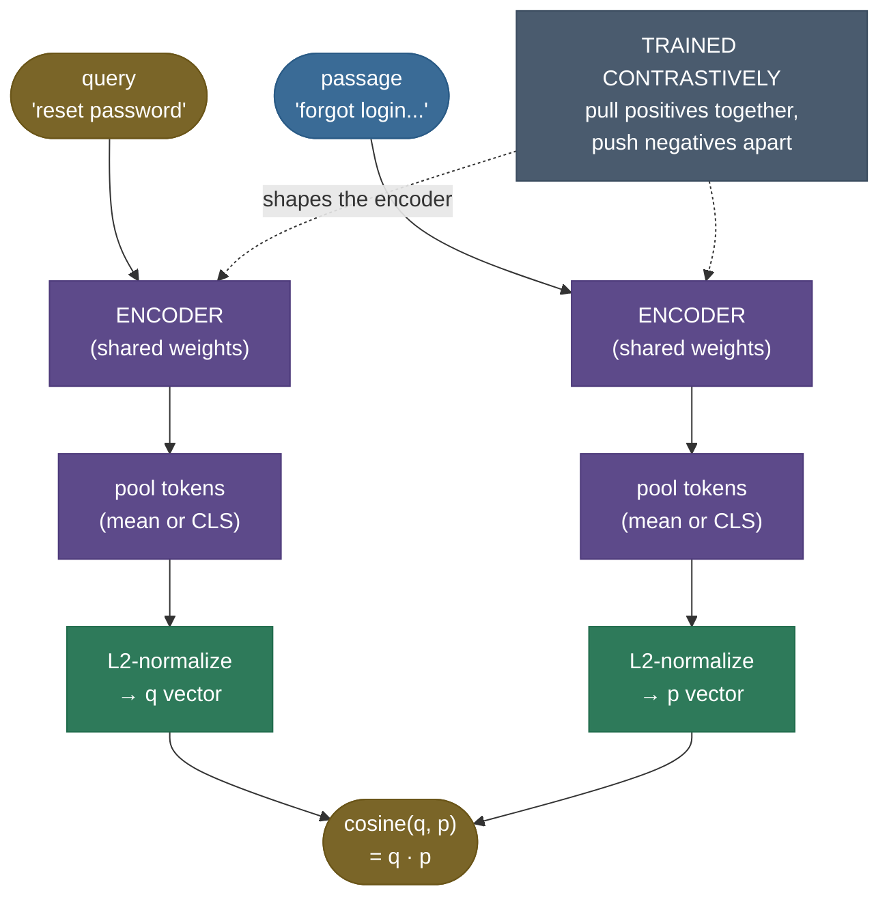

# Embedding Models for Retrieval: the model that decides what's near what

[Chapter 1](../01-RAG-Fundamentals/01-RAG-Fundamentals.md) left a crack in the foundation, and [chapter 2](../02-Document-Chunking-Strategies/02-Document-Chunking-Strategies.md) named it: when a query and its answer use *different words*, retrieval misses. Our chapter-1 toy retriever, built on a lexical (bag-of-words) embedder, scored **recall@1 of only 0.50** on paraphrased queries — it found the answer half the time, because "liftoff date" shares no words with "was launched on." Chapter 2 was explicit that this is **not** a chunking problem ("fixing your splitter won't help"); it's an **embedding** problem. This chapter fixes it.

Here's the whole thing in one sentence: **retrieval can only find what the embedder places near the query in vector space.** No chunking strategy, no clever index, no reranker can recover a passage the embedder pushed far from the query. The embedding model sets the geometry, and the geometry sets the ceiling. So the central question of dense retrieval is: *can we build an embedder that puts "reset my password" near "forgot my login credentials" — even though they share almost no words?*

The answer is yes, and the mechanism is **contrastive learning**: train an encoder so that paraphrases are pulled together and unrelated text is pushed apart. I'll build this the way I'd actually demonstrate it — start from the felt failure (a lexical embedder missing a paraphrase), then the "meaning → coordinates" intuition, then the bi-encoder mechanism and the InfoNCE loss that trains it, a from-scratch dense embedder you watch *learn* to cluster paraphrases (plus a real pretrained model confirming it), the production pitfalls that silently wreck retrieval, and how to pick a model. By the end you'll be able to:

- explain why a **lexical** embedder fails paraphrases and a **dense** one succeeds — and prove the gap in code;
- describe the **bi-encoder** (encode independently, compare by cosine) and contrast it with the cross-encoder ([chapter 6](../06-Re-ranking-Cross-Encoders/06-Re-ranking-Cross-Encoders.md));
- write the **InfoNCE** contrastive loss with in-batch negatives, define $\tau$, and say why we normalize;
- avoid the silent killers — **asymmetric-prefix** mistakes, forgotten **L2-normalization**, **domain mismatch**, **truncation**;
- pick an embedding model with the **MTEB** leaderboard and the dimension/cost tradeoff in mind.

> **Note:** the embedder is the *single highest-leverage model choice* in a RAG system. You can swap the LLM freely, but the embedder is baked into your index — re-embedding a large corpus is expensive — so choosing it well (and getting the encoding details right) matters more than almost any other decision downstream.

---

## The problem: a lexical embedder can't see a paraphrase

To feel why dense embeddings exist, watch a lexical one fail.

A **lexical / sparse** embedder represents text as a bag of words: one vector slot per vocabulary word, nonzero only where that word literally appears (TF-IDF is the classic example, and our chapter-1 hashing embedder is a cousin). Two texts are similar *only if they share words*. That's fine for "Helios-7 launch date" → "Helios-7 was launched", but it falls apart the moment the query is a **paraphrase**:

```
query:    "how do I reset my password"
passage:  "I forgot my login credentials"
shared content words:  (almost none — "i", "my")
```

These mean the *same thing*, but a bag-of-words embedder sees almost no overlap, so it scores them as **unrelated**. Run our four toy paraphrase pairs through a from-scratch sparse embedder and the failure is total:

```
SPARSE bag-of-words — paraphrase (diagonal) similarity:   0.091
SPARSE bag-of-words — unrelated (off-diagonal) similarity: 0.082
```

The paraphrase pairs (the ones that *should* match) score **0.091**; the unrelated pairs score **0.082** — a gap of **+0.009**, essentially zero. The sparse embedder **cannot tell a paraphrase from an unrelated sentence.** Three of the four pairs share *no* content words at all, so to a bag-of-words model they look as different as random sentences. This is exactly the chapter-1 recall@1=0.50 failure, isolated and made stark.

You cannot fix this with chunking (the words still don't match), a bigger index (the vectors are still far apart), or a better LLM (it never receives the passage). The fix has to live in the **embedder** — it must map text by *meaning*, not by *surface words*.


---

## Intuition first: meaning becomes coordinates

Here's the mental model that holds up.

A good embedding model is a **map-maker for meaning**. It reads a piece of text and assigns it coordinates in a high-dimensional space, with one rule: **things that mean similar things get similar coordinates.** "Car" and "automobile" land in the same neighborhood; "car" and "banana" land far apart — *even though "car" and "automobile" share zero letters and "car" and... 'cargo' share three*. Surface form is irrelevant; **meaning is the geography.** Retrieval then becomes pure geometry: to answer a query, go to its coordinates and grab the nearest passages. Distance *is* dissimilarity.

Push on the analogy — it survives, and where it bends, it teaches:

- **"How can it place two texts together if they share no words?"** Because it doesn't read words in isolation — it was *trained* on millions of examples of which texts mean the same thing, and it learned features that fire for "vehicle-ness" or "authentication-ness" regardless of the exact word. "Reset password" and "forgot login credentials" both light up the *account-access* region. (This is what we'll train from scratch below.)
- **"What about antonyms — 'hot' vs 'cold'?"** This is where the analogy bends instructively. Antonyms are *about the same topic*, so embedders often place them **close** (both are temperature words) — embedding similarity measures **relatedness/topicality, not truth or polarity**. A retriever asked "is the server up?" may happily retrieve a passage saying "the server is down" because they're topically adjacent. Negation is a known weak spot of dense retrieval; don't assume cosine similarity respects logical opposites.
- **"So nearby always means 'good answer'?"** No — nearby means *semantically related*, which is necessary but not sufficient. That's why retrieval is a *first stage*: get the topically-near candidates fast, then (chapter 6) use a slower, more precise reranker to sort relevance among them.

The mapping to the mechanism is exact: **the map-maker is the embedding model, the coordinates are the embedding vector, "similar meaning → similar coordinates" is what contrastive training enforces, and "grab the nearest" is cosine top-k retrieval.** Everything below is how we build and train that map-maker.


---

## The mechanism: the bi-encoder, trained contrastively

The workhorse of dense retrieval is the **bi-encoder** (a.k.a. dual encoder). Its defining property: it encodes the query and each passage **independently** into fixed-length vectors, then compares them by cosine similarity. "Independently" is the key word — and the reason retrieval can be *fast*.



Three mechanism details matter:

1. **Pooling.** A transformer emits one vector *per token*; retrieval needs *one vector per text*. Two standard ways to pool: take the special **`[CLS]`** token's vector (BERT-style), or **mean-pool** all token vectors. Sentence-BERT ([Reimers & Gurevych 2019](https://arxiv.org/abs/1908.10084)) found mean-pooling works better for similarity, and it's the common default for retrieval embedders.
2. **L2-normalization.** Divide each vector by its length so it sits on the unit sphere. Then cosine similarity *is* the dot product — fast, and the comparison depends only on **direction (meaning)**, not magnitude. (Forget this and your similarities are silently wrong; see Pitfalls.)
3. **Independent encoding → precomputability.** Because the passage is encoded without seeing the query, you can **embed your whole corpus once, offline**, and at query time only encode the (short) query and do nearest-neighbour search. This is what makes dense retrieval scale to millions of documents.

**Contrast with the cross-encoder.** A *cross-encoder* feeds the query and passage **together** through the transformer (`[CLS] query [SEP] passage`), letting them attend to each other, and outputs a single relevance score. It's far more accurate — but it must run the model *once per (query, passage) pair* at query time, so it **cannot** precompute passage vectors and is far too slow for first-stage retrieval over a large corpus. The standard architecture uses **both**: a bi-encoder to retrieve top-k candidates fast, then a cross-encoder to **rerank** those few — the subject of [chapter 6](../06-Re-ranking-Cross-Encoders/06-Re-ranking-Cross-Encoders.md).

---

## The math: cosine recap, then the contrastive loss

### Cosine, briefly

From chapter 1: with L2-normalized vectors $\mathbf{q}, \mathbf{p} \in \mathbb{R}^{d}$ ($d$ = embedding dimension), cosine similarity collapses to a dot product, $\operatorname{cos}(\mathbf{q}, \mathbf{p}) = \mathbf{q}\cdot\mathbf{p} \in [-1, 1]$. That's the *comparison*. The interesting question is how the encoder is *trained* so this number is high for paraphrases and low otherwise.

### InfoNCE: the contrastive loss with in-batch negatives

Embedders are trained on **positive pairs** — a query and a passage that *should* match (a question and its answer, a sentence and its paraphrase). The trick that makes training cheap and effective is **in-batch negatives**: within a batch of $B$ pairs, each query's positive is its own paired passage, and *every other passage in the batch* serves as a negative. One batch gives you $B$ positives and $B(B{-}1)$ negatives for free.

Let $\mathbf{q}_i$ be the embedding of query $i$ and $\mathbf{p}_j$ the embedding of passage $j$ (all L2-normalized). Define the scaled similarity score $s_{ij} = \mathbf{q}_i \cdot \mathbf{p}_j / \tau$. The **InfoNCE** loss treats "which passage matches query $i$?" as a $B$-way classification where the correct answer is $j=i$. The query→passage direction is:

$$
\mathcal{L}_{q\to p} = -\frac{1}{B}\sum_{i=1}^{B} \log \frac{\exp(\mathbf{q}_i \cdot \mathbf{p}_i / \tau)}{\sum_{j=1}^{B}\exp(\mathbf{q}_i \cdot \mathbf{p}_j / \tau)}.
$$

> **Source / derivation:** [van den Oord, Li & Vinyals (2018), *Representation Learning with Contrastive Predictive Coding* (arXiv:1807.03748)](https://arxiv.org/abs/1807.03748) — introduces the InfoNCE loss (Eq. 4): a softmax over one positive against a set of negatives, maximizing a lower bound on mutual information. Its use for sentence retrieval with in-batch negatives is [Karpukhin et al. (2020), *Dense Passage Retrieval* (arXiv:2004.04906)](https://arxiv.org/abs/2004.04906).

Define every symbol: $B$ is the batch size; $\mathbf{q}_i, \mathbf{p}_j$ the unit-norm query/passage embeddings; $\mathbf{q}_i \cdot \mathbf{p}_j$ their cosine similarity; $\tau > 0$ the **temperature**. Read the loss: the numerator is the positive pair's score; the denominator sums the positive *and* all in-batch negatives. Minimizing it **maximizes the positive's score relative to the negatives** — exactly "pull positives together, push negatives apart." It's just cross-entropy with the identity matrix as labels (row $i$'s correct class is column $i$). The equation above is the query→passage direction; the code computes the **symmetric** version, averaging $\mathcal{L}_{q\to p}$ with the mirror-image $\mathcal{L}_{p\to q}$ (the same loss on the *transposed* score matrix, asking "which query matches passage $j$?"), $\mathcal{L} = \tfrac{1}{2}(\mathcal{L}_{q\to p} + \mathcal{L}_{p\to q})$ — a standard stabilization that trains both encoding directions at once.

**Why divide by $\tau$?** The temperature controls how *sharp* the softmax is. Small $\tau$ (e.g. 0.05) makes the loss punish a negative that scores near the positive very harshly (sharp contrast, hard negatives dominate the gradient); large $\tau$ flattens it, so the gradient barely distinguishes the positive from the negatives and training makes little progress. We use $\tau = 0.07$, a common value. You can *feel* this in our own trainer — same data, same steps, only $\tau$ changed:

```
Temperature sweep — final InfoNCE loss after training (lower = learned more):
  tau=0.07: final loss 0.0000
  tau= 1.0: final loss 0.5827
  tau= 5.0: final loss 1.1933
```

The loss **stays high as $\tau$ grows** — at $\tau=5$ the softmax is too flat for the gradient to push the positive past the negatives, so the model barely learns. (On this tiny, easy 4-pair toy the positives still *eventually* separate even at large $\tau$; on real data with hard negatives, a too-large $\tau$ visibly fails to separate them. The loss-stays-high signal is the honest, reproducible part — and too *small* a $\tau$ makes training unstable on real data.)

**Why L2-normalize before this?** Two reasons. (1) It bounds $\mathbf{q}\cdot\mathbf{p}$ to $[-1,1]$ so $\tau$ has a consistent meaning across batches. (2) Without it, the model could cheat by making *magnitudes* large instead of *directions* aligned — normalization forces it to encode meaning in **direction**, which is what cosine retrieval reads.

### A note on dimension, and Matryoshka

The embedding dimension $d$ is a capacity/cost knob: more dimensions can encode finer distinctions (higher retrieval quality, with diminishing returns) but cost proportionally more memory and compute — every vector is $d$ floats, and a million-document index is a million of them. **Matryoshka Representation Learning (MRL)** trains a model so that the *first* $k$ dimensions of its output are themselves a usable embedding — letting you **truncate** a 1536-dim vector to 256 dims and trade a little quality for big storage savings, no re-encoding needed.

> **Source / derivation:** [Kusupati et al. (2022), *Matryoshka Representation Learning* (arXiv:2205.13147)](https://arxiv.org/abs/2205.13147) — trains nested representations so a single embedding can be truncated to many shorter lengths; this is what powers the `dimensions` parameter in OpenAI's `text-embedding-3` models.


*This tradeoff is the knob behind the model-selection rubric below: it's why a 384-dim model (all-MiniLM) is a strong default and why Matryoshka-truncatable models let you dial dimension down to cut storage with little quality loss.*

---

## Worked example: watch a dense embedder learn to cluster paraphrases

Let's build the dense bi-encoder from scratch and watch it beat the sparse one — on the same four paraphrase pairs, CPU-runnable in under a second, fully deterministic.

> **Runnable script + step-by-step notebook:** the verified code is next to this page — the [step-by-step teaching notebook](code/03-Embedding-Models-for-Retrieval.ipynb) and the [runnable demo script](code/embedding_models.py) (run it with `python embedding_models.py`). Every number below is produced by that code and matches the executed notebook — nothing is hand-typed.

**The setup: a tiny bi-encoder.** A real bi-encoder is a transformer; ours is a single learned linear map (bag-of-words → 16-dim vector → L2-normalized), so the *mechanism* is visible end to end. The encoder is what training shapes:

```python
import torch.nn as nn, torch.nn.functional as F

class DenseBiEncoder(nn.Module):
    def __init__(self, vocab_size, dim=16):
        super().__init__()
        self.proj = nn.Linear(vocab_size, dim, bias=False)   # the learned embedding map
    def forward(self, bow):
        return F.normalize(self.proj(bow), dim=-1)           # L2-normalize → cosine = dot product
```

**The loss: InfoNCE with in-batch negatives**, exactly the equation above — note it's just cross-entropy against the identity (row $i$'s correct passage is column $i$):

```python
def info_nce_loss(query_emb, passage_emb, temperature=0.07):
    scores = query_emb @ passage_emb.t() / temperature   # (B,B): every query vs every passage
    labels = torch.arange(query_emb.shape[0])            # correct passage for row i is column i
    return 0.5 * (F.cross_entropy(scores, labels) + F.cross_entropy(scores.t(), labels))
```

**Train it and measure the gap.** Before training, the sparse baseline can't separate paraphrases from unrelated text (gap +0.009). After 800 steps of contrastive training, the dense encoder does:

```python
from embedding_models import PARAPHRASE_PAIRS, build_vocab, train_bi_encoder, similarity_matrix, diagonal_vs_offdiagonal, bow_tensor

vocab = build_vocab([t for pair in PARAPHRASE_PAIRS for t in pair])
model, losses = train_bi_encoder(PARAPHRASE_PAIRS, vocab)   # 800 InfoNCE steps, seeded
print(f"loss {losses[0]:.3f} -> {losses[-1]:.4f}")
dense_fn = lambda t: model(bow_tensor(t, vocab).unsqueeze(0)).squeeze(0).detach().numpy()
queries = [q for q, _ in PARAPHRASE_PAIRS]; passages = [p for _, p in PARAPHRASE_PAIRS]
diag, off = diagonal_vs_offdiagonal(similarity_matrix(queries, passages, dense_fn))
print(f"paraphrase sim {diag:.3f} | unrelated sim {off:.3f} | gap {diag-off:+.3f}")
```

```
loss 3.862 -> 0.0000
paraphrase sim 0.675 | unrelated sim -0.220 | gap +0.895
```

The dense embedder pulls paraphrases to **0.675** and pushes unrelated pairs to **−0.220** — a gap of **+0.895**, versus the sparse model's **+0.009**. *Same sentences, same words (or lack of them); only the embedder changed.* The model learned, from the paraphrase pairs alone, that "reset password" and "forgot login credentials" belong together.

> **Try it:** before you run anything, **predict** — the encoder trained on four *fixed* sentences. Feed it a **brand-new** query made of recombined known words, `"my vehicle will not turn on"`, and ask its cosine to each training passage. Does it land near the *car* passage ("my automobile won't turn on"), or does it fail because it only memorized the exact training sentences? Run `dense_fn("my vehicle will not turn on")` and compare. *(It lands at **+0.904** to the car passage and negative to the rest — it generalizes to recombinations of words it learned, even though "vehicle" itself was never in training. That word contributes nothing — the in-vocab "will/not/turn/on" carry it home. The OOV blind spot is exactly why real embedders use subword tokenization and train on massive corpora.)*

![The query×passage cosine matrix under sparse (left) vs dense (right). The dense diagonal — each query against its own paraphrase — lights up (0.64–0.73), while the off-diagonal (unrelated pairs) stays low or negative; the sparse matrix is flat near zero everywhere, unable to distinguish paraphrases. (The one strongly-negative dense cell, query 2 vs passage 1 ≈ −0.66, is the model actively pushing an *unrelated* pair apart — a contrastive success, not a retrieval miss.) Generated by `code/make_figures_03.py`.](../images/rag03_cosine_heatmap.png)


**Confirm it on a real model.** The from-scratch demo proves the *mechanism*; a production embedder confirms it at scale. Loading **all-MiniLM-L6-v2** (a 384-dim Sentence-BERT model) and encoding the same pairs:

```python
from sentence_transformers import SentenceTransformer
model = SentenceTransformer("all-MiniLM-L6-v2")
q = model.encode(queries, normalize_embeddings=True)   # (4, 384)
p = model.encode(passages, normalize_embeddings=True)
# cosine = q @ p.T  → paraphrase diagonal ~0.63, unrelated ~0.16, gap +0.47
```

```
pretrained — paraphrase similarity: 0.631 | unrelated: 0.160 | gap: +0.471
```

A real 384-dim model trained on hundreds of millions of pairs lands the same result: paraphrases near (**0.631**), unrelated far (**0.160**), a clean **+0.471** gap. The library one-liner — `SentenceTransformer(name).encode(texts, normalize_embeddings=True)` — hides exactly the bi-encoder + contrastive training we just built by hand.


---

## Pitfalls and failure modes

These are the silent killers — they don't error, they just quietly tank retrieval quality.

**1. Asymmetric search: wrong (or missing) prefixes.** Many top retrieval models are **asymmetric** — they're trained to encode a *short query* and a *long passage* differently, and they expect an **instruction prefix** to tell them which is which. E5 models want `"query: "` prepended to queries and `"passage: "` to documents; BGE models want a query instruction. Forget the prefix, or swap them, and similarities silently degrade — often by a large margin — with no error.

- *Failing:* you embed both queries and passages with no prefix (or `"query:"` on both) using an E5 model; retrieval quality drops well below the model's benchmark numbers and you blame the model.
- *Fix:* **read the model card** and apply the exact prefixes it was trained with — `"query: "` / `"passage: "` for E5, the instruction for BGE. Symmetric models (like all-MiniLM) need no prefix; asymmetric ones break without it.


**2. Forgetting L2-normalization.** If you compare raw (unnormalized) embeddings with a dot product, longer vectors dominate regardless of meaning, and your "similarity" is partly measuring text length.

- *Failing:* you store unnormalized vectors and use inner-product search; a long irrelevant passage outranks a short perfect one because its vector is longer.
- *Fix:* **L2-normalize** every embedding at index time (or use a cosine/normalized-IP index). Most libraries have a `normalize_embeddings=True` flag — use it consistently for queries *and* documents.

**3. Domain mismatch.** A general-purpose embedder trained on web text may be mediocre on **code**, **legal**, **medical**, or **multilingual** text, where the vocabulary and notion of similarity differ.

- *Failing:* a general model retrieves poorly over a Python codebase because it doesn't know `defaultdict` relates to `dict`, or over case law because it misreads citations.
- *Fix:* use a **domain-tuned** embedder (e.g. a code-specific model) or **fine-tune** one on in-domain pairs; check the relevant MTEB sub-task, not the overall average.

**4. Silent truncation past max sequence length.** Every embedder has a **maximum input length** (often 256–512 tokens). Text past that is **silently dropped** — the model embeds only the prefix, so a chunk's tail (which may hold the answer) is invisible.

- *Failing:* you embed 2,000-token chunks with a 512-token model; everything after token 512 is ignored, and a fact in the second half is unretrievable — even though chapter 2's chunker kept it whole.
- *Fix:* keep chunks **within the embedder's max length** (a constraint that should drive your chunk size from chapter 2), and verify the model's actual limit.

**5. Using a cross-encoder for first-stage retrieval.** Tempting, because cross-encoders are more accurate — but a cross-encoder must score *every* (query, passage) pair at query time, so over a million-document corpus it's catastrophically slow.

- *Failing:* you "improve" retrieval by replacing the bi-encoder with a cross-encoder over the whole corpus; query latency explodes from milliseconds to minutes.
- *Fix:* **bi-encoder retrieves, cross-encoder reranks** the top-k only ([chapter 6](../06-Re-ranking-Cross-Encoders/06-Re-ranking-Cross-Encoders.md)). Never run a cross-encoder over the full corpus.

> **Gotcha:** pitfalls 1, 2, and 4 are *silent* — no exception, just degraded recall you might not notice for weeks. The discipline that catches them: **measure retrieval on a held-out set of (query, known-answer) pairs** whenever you change the embedder or the encoding. A 10-line eval harness saves you from shipping a quietly-broken index.

---

## Where it matters, and how to choose

**The one problem an embedder solves:** mapping queries and passages into a shared space where *semantic* nearness — not word overlap — drives retrieval, so paraphrases, synonyms, and related concepts are findable. It sits at the **indexing and retrieval layer**, and it's the model whose geometry every other RAG component inherits.

**Reading the leaderboard.** The [**MTEB** leaderboard](https://huggingface.co/spaces/mteb/leaderboard) (Massive Text Embedding Benchmark) ranks embedders across tasks. The trap: don't pick by the *headline average* — for RAG you care about the **Retrieval** task (NDCG@10), and within it, the **domains and languages** matching yours.

> **Source / derivation:** [Muennighoff et al. (2022), *MTEB: Massive Text Embedding Benchmark* (arXiv:2210.07316)](https://arxiv.org/abs/2210.07316) — defines the multi-task benchmark (including Retrieval) behind the leaderboard used to select embedding models.

**Choosing — a quick rubric:**

| Need | Reach for |
|---|---|
| Fast, free, local, general English | **all-MiniLM-L6-v2** (384-dim) — small and surprisingly strong; the default starter |
| Stronger open retrieval, asymmetric | **E5** / **BGE** families (remember the prefixes) |
| Best managed quality, tunable dims | **OpenAI `text-embedding-3-small` (1536) / `-large` (3072)** — Matryoshka-truncatable; or **Cohere embed v3** |
| Domain-specific (code, legal, multilingual) | a **domain-tuned** model, or fine-tune — verify on the matching MTEB sub-task |

**Fine-tune vs off-the-shelf:** start off-the-shelf (a top general model is usually excellent). Fine-tune only when you have a domain where general models measurably underperform *and* you have in-domain (query, positive-passage) pairs to train on — the same InfoNCE recipe we built, on real data.

---

## In production

Real systems, with **verified** specs:

- **OpenAI `text-embedding-3`** — `-small` outputs **1536** dims, `-large` outputs **3072**, and *both* support **Matryoshka** dimension shortening via the `dimensions` API parameter (truncate to 256/512/1024 to save storage at a small quality cost). The managed default for many teams.
- **all-MiniLM-L6-v2** — a **384-dim** Sentence-BERT bi-encoder; tiny (~80 MB), fast on CPU, no prefix needed, and the one we confirmed our lesson on. The go-to free local model.
- **E5** (`intfloat/e5-*`) and **BGE** (`BAAI/bge-*`) — leading **open** retrieval families; **asymmetric** — E5 requires `"query: "` / `"passage: "` prefixes, BGE a query instruction. Strong on MTEB Retrieval.
- **Cohere embed v3** — a managed model with **1024**-dim outputs and explicit input-type flags (`search_query` vs `search_document`) that bake in the asymmetric treatment for you.

**When to reach for which:** prototype with **all-MiniLM** (free, instant), graduate to an **E5/BGE** or a **managed** model when retrieval quality matters and your corpus grows, and **fine-tune** only for a genuine domain gap. Whatever you pick, it's baked into your index — so measure on *your* queries before committing, because re-embedding a large corpus later is the expensive part.

> **Note:** the through-line continues. Chapter 1 framed retrieval; chapter 2 chunked the documents; this chapter chose the *model that defines nearness*. Next, [chapter 4](../04-Vector-Databases-and-ANN-Indexes/04-Vector-Databases-and-ANN-Indexes.md) makes "find the nearest vectors" *fast* at scale (approximate nearest neighbour), [chapter 5](../05-Hybrid-Search-BM25-and-Dense/05-Hybrid-Search-BM25-and-Dense.md) combines dense with lexical search (getting the best of both this chapter contrasted), and [chapter 6](../06-Re-ranking-Cross-Encoders/06-Re-ranking-Cross-Encoders.md) adds the cross-encoder reranker. The embedder set the geometry; the rest of the stack searches it.

---

## Recap and rapid-fire

**If you remember nothing else:** retrieval can only find what the embedder places near the query, so the embedder sets the quality ceiling. A **lexical** embedder matches only shared words and fails paraphrases (+0.01 gap in our demo); a **dense bi-encoder**, trained **contrastively** to pull positives together and push negatives apart (InfoNCE with in-batch negatives, temperature $\tau$), maps by *meaning* and separates them cleanly (+0.90 from scratch, +0.47 on a real 384-dim model). Encode query and passage independently, L2-normalize, compare by cosine — and mind the asymmetric prefixes, the normalization, the domain, and the max-length truncation.

**Quick-fire — say these out loud:**

- *Why does a lexical embedder fail paraphrases?* It matches shared words; paraphrases share few, so they look unrelated.
- *Bi-encoder vs cross-encoder?* Bi-encoder encodes query and passage *independently* (precomputable, fast, first-stage retrieval); cross-encoder encodes them *together* (accurate but slow, reranking only).
- *What does InfoNCE do?* Treats "which passage matches this query?" as classification over in-batch passages; maximizes the positive's score vs the negatives. Pull together, push apart.
- *What's $\tau$ for?* Temperature — sharpens the softmax; small $\tau$ punishes near-miss negatives harder. Too small = unstable, too large = no separation.
- *Why L2-normalize?* So cosine = dot product, comparison depends on direction (meaning) not magnitude, and $\tau$ is consistent.
- *What's asymmetric search?* Query and passage get different prefixes (E5 `"query:"`/`"passage:"`); forgetting them silently degrades retrieval.
- *What is Matryoshka / MRL?* Nested embeddings you can truncate (e.g. 3072 → 256) to save storage with little quality loss; powers OpenAI's `dimensions` param.
- *How do you pick a model?* MTEB **Retrieval** task (not the headline average), matching your domain/language, weighing dimension vs cost; start with all-MiniLM, measure on your queries.
- *Most common silent bug?* Forgotten/mismatched prefixes or normalization — measure retrieval on held-out (query, answer) pairs to catch it.

---

## References and further reading

The curated link library for this topic — videos, courses, articles, papers, books, and internal cross-links — lives in a companion file so it can be reused as a standalone reference list:

**→ [Embedding Models for Retrieval — references and further reading](03-Embedding-Models-for-Retrieval.references.md)**
