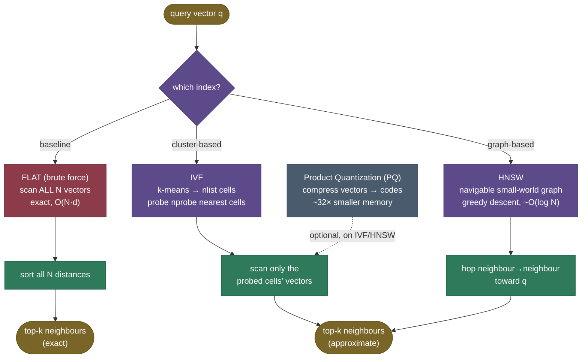

# Vector Databases & ANN Indexes: searching millions of vectors in milliseconds

[Chapter 3](../03-Embedding-Models-for-Retrieval/03-Embedding-Models-for-Retrieval.md) ended with retrieval reframed as pure geometry: embed the query, find the nearest passage vectors. It even promised this chapter — "makes 'find the nearest vectors' *fast* at scale." That promise hides a brutal cost problem, and this chapter is how production systems beat it.

Everything below is **real and measured**. We embed **30,000 real Wikipedia passages** with a real sentence-transformer (`BAAI/bge-small-en-v1.5`, 384-dim), build **real [FAISS](https://github.com/facebookresearch/faiss) indexes** (exact `IndexFlatIP`, `IndexIVFFlat`, `IndexHNSWFlat`, `IndexIVFPQ`), run real semantic queries, and *measure* what every ANN engineer measures: **recall@10 against exact search** and **real query latency** as we turn the recall/speed knob. There are no hand-made toy vectors and no faked library calls — every number on this page comes from the [executed teaching notebook](code/04-Vector-Databases-and-ANN-Indexes.ipynb) over that real corpus. (Because it's real, wall-clock latency varies run-to-run; we report representative medians and flag what's inherently variable.)

Here's the wall. The obvious way to find a query's nearest neighbours is to **compare it to every vector** — compute the distance to all $N$ passages and keep the smallest. That's **exact** ("flat" or "brute-force") search, and it's $O(N \cdot d)$ per query. For a few thousand vectors it's instant. But RAG corpora are big: at **10 million passages × 768-dimensional embeddings**, a single query is $10{,}000{,}000 \times 768 \approx \mathbf{7.7\ billion}$ multiply-adds — *per query*. Run that for every user, at every keystroke of an autocomplete, and you've built a space heater, not a search engine. RAG needs **sub-millisecond** retrieval over corpora this size.

The fix is **Approximate Nearest Neighbour (ANN)** search: build an **index** that lets you *skip* almost all the vectors — route the query to the right neighbourhood and only scan what's nearby — trading a tiny, controllable amount of **recall** for **orders-of-magnitude** speed. I'll build this the way I'd actually tune a vector store: feel the exact-search cost, then the "skip most of the haystack" intuition, then the two dominant index families (IVF and HNSW) with the math that governs their recall/speed knobs, a real measured sweep where you *watch* recall trade for speed, the production gotchas that bite (the recall cliff, filtering, the curse of dimensionality), and how to choose and operate a vector database. By the end you'll be able to:

- explain why exact search is $O(N \cdot d)$ and when it's still the right answer;
- describe **IVF** (k-means cells + probe `nprobe`) and **HNSW** (navigable graph + greedy descent), and their knobs;
- derive the IVF cost and recall↔`nprobe` tradeoff, the HNSW $O(\log N)$ navigation, and PQ's memory compression;
- read a **real recall cliff and recall/latency frontier** and pick a tuning point against a recall SLO;
- avoid the silent failures — the recall cliff, metadata-filtering traps, index-build blowups, stale graphs.

> **Note:** ANN is a *systems* optimization, not a *modeling* one. It changes **how fast** you find neighbours and **how much memory** the index costs — not what "near" means (that's the embedder, chapter 3). A great index over bad embeddings still retrieves the wrong things, fast.

---

## The problem: exact search doesn't scale

To feel why ANN exists, count the work exact search does.

Flat search answers "what are the $k$ nearest vectors to $\mathbf{q}$?" by computing the distance from $\mathbf{q}$ to **every** vector and sorting. Each distance is $O(d)$ (a $d$-dimensional dot product on our unit-norm vectors), and there are $N$ of them, so one query is $O(N \cdot d)$. Concretely, our real corpus ($N = 30{,}000$, $d = 384$) does $30{,}000 \times 384 = \mathbf{11{,}520{,}000}$ multiply-adds per query. Scale to a production corpus and it explodes:

$$
\text{flat cost per query} = N \cdot d \;\;\xrightarrow{\;N=10^7,\; d=768\;}\;\; 7.68 \times 10^9 \approx \mathbf{7.7\ \text{billion multiply-adds}}.
$$

> **Source / derivation:** [Johnson, Douze & Jégou (2017/2019), *Billion-scale similarity search with GPUs* (arXiv:1702.08734)](https://arxiv.org/abs/1702.08734) — the FAISS GPU paper; §2 lays out the exact (flat) search cost $O(N \cdot d)$ that ANN indexes are built to avoid, and the brute-force baseline the library still ships as `IndexFlat`.

The cost grows **linearly with $N$**: double the corpus, double every query. That linear wall is the whole motivation for ANN.

![Exact search cost O(N·d) (red) grows linearly with corpus size N — reaching ~7.7 billion multiply-adds per query at a 10M×768 production corpus — while an IVF index (green) that scans √N centroids plus a few cells' worth of vectors stays orders of magnitude below it. The amber line anchors our *real* measured corpus (N=30,000, d=384), where exact search takes ~1 ms/query on one core. Both axes log scale; the curves are the asymptotic shapes, the N-anchor is measured. Generated by `code/make_figures_04.py`.](../images/rag04_bruteforce_growth.png)

**A crucial, honest caveat about "milliseconds."** FAISS's exact search is extraordinarily well-optimized (SIMD dot products, cache-friendly layout). On our real 30k×384 corpus, a single query against `IndexFlatIP` takes only **~1 ms on one core** — already fast. So at *this* scale the win from ANN is real but modest; the dramatic $O(N)$ blow-up bites at 10M–1B vectors, where exact search crosses from milliseconds into tens-to-hundreds of milliseconds *per query on one core*, and where the memory (raw float32 vectors) stops fitting in RAM. You could throw hardware at it (more cores, GPUs — what FAISS does), but that only buys a constant factor; the $O(N)$ growth still wins eventually. The real fix is algorithmic: **stop comparing the query to vectors that obviously can't be its neighbours.** Even at 30k, we'll *measure* that skipping most of the corpus gives a genuine **~15–30× speedup** at high recall — and at production scale that factor becomes the difference between a viable product and a space heater.

---

## Intuition first: don't search the whole haystack

Here's the mental model that holds up.

Imagine finding the closest restaurant in a country. The brute-force way: measure the distance to *every* restaurant in the nation and take the smallest. Insane. What you actually do: **go to the right city first**, then search only within it. You skip 99.9% of restaurants because they're in cities you never visit. You might *occasionally* miss a restaurant just across a city line that's technically closer than anything in your city — but you accept that small risk for an enormous speedup.

That's ANN exactly. Build an index that **organizes vectors by neighbourhood** (cluster them, or wire them into a graph), then at query time **only look in the neighbourhoods near the query**. The "approximate" is the city-line risk: a true neighbour sitting just outside the regions you searched gets missed. That's the one thing you give up — and it's *tunable*: search more neighbourhoods to recover those misses, at the cost of more time.

Push on the analogy — it survives, and where it bends, it teaches:

- **"What exactly do I lose?"** Recall. If a true top-$k$ neighbour lives in a cell (or graph region) you didn't probe, you never see it — so **recall < 100%**. ANN reports "approximate" results; how approximate is a knob (`nprobe` for IVF, `efSearch` for HNSW). We *measure* this loss below, on real data.
- **"Can I always just search more neighbourhoods?"** Yes, and at the limit (probe every cell) you recover exact search — but then you've paid the full brute-force cost. The art is finding the smallest search that gives the recall you need.
- **"Does this get easier or harder in high dimensions?"** Harder. In high-dimensional space, distances concentrate (everything is roughly equidistant — the *curse of dimensionality*), so "neighbourhoods" are less cleanly separated and you must probe more to hit the same recall. ANN over 384- or 768-dim embeddings is genuinely hard; the indexes below are what make it work anyway.

The mapping is exact: **organizing vectors by neighbourhood is the index build (k-means cells or a graph), going to the right city is query routing, and the city-line risk is the recall you trade for speed.** Two index families dominate, differing only in *how* they organize the neighbourhoods.

![Animated — the recall/speed knob, turning. The query (star) lands in its Voronoi cell; at nprobe=1 only that one cell is scanned and several true neighbours are still missed (red rings). As nprobe grows the probed region expands to cover the neighbouring cells, the misses turn to hits (green), and recall climbs to 1.0 — at the cost of scanning more vectors. This 2D schematic shows the *routing*; the real, steep high-dimensional cliff over our 384-D corpus is measured in the recall-cliff figure below. Generated by `code/make_animation_04.py`.](../images/rag04_nprobe_growth.gif)

---

## The mechanism: IVF and HNSW (and a flat baseline)



**Flat (the baseline).** Store the vectors, scan them all, sort. Exact, simple, and the *right choice* below ~10k vectors (an index's overhead isn't worth it at that scale). It's also, always, the **ground truth**: its top-k is what we score every approximate index's recall against. Everything else trades a little of flat's perfect recall for speed.

**IVF (Inverted File — cluster-based).** Build: run **k-means** to partition the vectors into `nlist` cells (Voronoi regions), and store an *inverted list* mapping each cell to the vectors in it. Query: find the `nprobe` cell **centroids** nearest the query, then exact-search only the vectors in those cells. You scan roughly `(N / nlist) × nprobe` vectors instead of all $N$ — a big cut when `nprobe ≪ nlist`. The miss: a true neighbour in an unprobed cell is invisible. (IVF builds on [k-means](../../04.%20Unsupervised_Learning/01-K-Means-Clustering/01-K-Means-Clustering.md) — the partitioning *is* k-means. FAISS trains the real k-means for us.)

![SCHEMATIC (2D projection for intuition — the real index lives in 384-D): IVF partitions the corpus into Voronoi cells (coloured by k-means centroid, the dark plus-marks). For a query (star), only the 3 nearest cells are probed (saturated colours); the rest of the corpus (faded) is skipped entirely. The query's true top-10 neighbours (green rings) all fall in the probed cells here — but a neighbour just over a cell boundary would be missed, which is the recall cost. Generated by `code/make_figures_04.py`.](../images/rag04_voronoi_cells.png)

**HNSW (Hierarchical Navigable Small World — graph-based).** Build: wire each vector to its nearest neighbours as a **graph**, with *multiple layers* — a sparse top layer of long-range links for fast travel, dense lower layers for precision (like express vs local subway lines). Query: start at an entry point in the top layer and **greedily hop** to whichever neighbour is closer to the query; when you can't get closer, drop to the next layer down and repeat, until the dense base layer. The hierarchy means each query touches only $\approx O(\log N)$ nodes instead of $N$.


> **Note:** IVF vs HNSW in one line — **IVF partitions space (cells you probe); HNSW connects points (a graph you walk).** HNSW usually gives higher recall at a given speed and is the default in most modern vector DBs, but it costs more memory (the graph links) and is harder to update (deletes degrade the graph). IVF is lighter and trivially updatable but needs the `nprobe` tuned. Many systems offer both. We'll *measure* HNSW's advantage on our real corpus below.

---

## The math: the cost and recall of each index

### IVF — the cost, and the recall↔nprobe knob

IVF's per-query cost is two terms: find the nearest cells, then scan them.

$$
\text{IVF cost} \;\approx\; \underbrace{n_{\text{list}} \cdot d}_{\text{scan centroids}} \;+\; \underbrace{\frac{N}{n_{\text{list}}} \cdot n_{\text{probe}} \cdot d}_{\text{scan probed cells}}.
$$

> **Source / derivation:** [Jégou, Douze & Schmid (2011), *Product Quantization for Nearest Neighbor Search* (PAMI)](https://inria.hal.science/inria-00514462v2/document) — §IV introduces the inverted-file (IVFADC) structure: a coarse quantizer (k-means cells) you probe, with the cost split into the centroid scan plus the probed inverted lists.

Symbols: $N$ vectors, $d$ dimensions, $n_{\text{list}}$ cells, $n_{\text{probe}}$ cells probed per query. With $n_{\text{list}} = \sqrt{N}$ (a common rule), both terms are $\approx \sqrt{N}\cdot d \cdot$(constant) — **sub-linear** in $N$, the whole point. The **recall↔`nprobe` tradeoff** is the central knob: more cells probed → more candidate neighbours seen → higher recall, but more vectors scanned → slower. At `nprobe = nlist` you've scanned everything (exact recall, no speedup); at `nprobe = 1` you scan one cell (fastest, lowest recall). Our real IVF (`nlist = 256` over 30k vectors) makes this concrete in the next section.

### HNSW — the $O(\log N)$ navigation and the efSearch knob

HNSW's greedy descent visits $\approx O(\log N)$ nodes per query (the hallmark of navigable small-world graphs — like binary search's $\log N$, the hierarchy halves the remaining space each step):

$$
\text{HNSW query} \;\approx\; O(\log N) \text{ hops}, \qquad \text{build} \;\approx\; O(N \log N).
$$

> **Source / derivation:** [Malkov & Yashunin (2016/2018), *Efficient and robust approximate nearest neighbor search using Hierarchical Navigable Small World graphs* (arXiv:1603.09320)](https://arxiv.org/abs/1603.09320) — introduces HNSW; the multi-layer structure gives the polylogarithmic search complexity and defines the build parameters $M$ (links per node) and `efConstruction` / `efSearch` (candidate-list sizes).

The knobs: **`M`** (links per node — higher = better recall, more memory and slower build), **`efConstruction`** (how hard the build searches for good links — higher = better graph, slower build), and **`efSearch`** (how many candidates the query keeps — the **recall↔speed knob at query time**, HNSW's analogue of `nprobe`: raise it for more recall, lower it for speed). We build a real graph with `M = 32`, `efConstruction = 200`, and sweep `efSearch` below.

> **Note (build cost is real):** $O(N \log N)$ build is not free. On our 30k corpus, single-threaded, the HNSW graph takes **~10 seconds** to construct while the IVF k-means + add takes **~0.1 s** and Flat is instant. HNSW buys query speed with build time and memory — a trade you'll see plotted below.

### Product Quantization — the memory compression

Storing $N$ raw vectors costs $N \cdot d \cdot 4$ bytes (float32). At a billion 768-dim vectors that's ~3 TB — too much for RAM. **Product Quantization (PQ)** compresses each vector by splitting it into $m$ sub-vectors and replacing each with the **id** of its nearest sub-centroid (from a learned codebook of $2^{\text{nbits}}$ centroids per sub-space):

$$
\text{raw bytes} = d \cdot 4, \qquad \text{PQ bytes} = \frac{m \cdot \text{nbits}}{8}, \qquad \text{ratio} = \frac{32 \, d}{m \cdot \text{nbits}}.
$$

> **Source / derivation:** [Jégou, Douze & Schmid (2011), *Product Quantization for Nearest Neighbor Search* (PAMI)](https://inria.hal.science/inria-00514462v2/document) — §III defines PQ: decompose the space into $m$ subspaces, quantize each with a $2^{\text{nbits}}$-entry codebook, store the codes; the asymmetric-distance trick estimates distances from the codes.

For our real corpus ($d = 384$, $m = 48$, nbits $= 8$): raw $= 384 \times 4 = \mathbf{1{,}536}$ bytes; PQ $= 48 \times 8 / 8 = \mathbf{48}$ bytes — a **32× memory cut** (46.1 MB → 1.44 MB for the whole corpus). The catch: PQ distances are *approximate* (computed from the codes), adding a second source of recall loss on top of the cell/graph misses — we measure it below (an `IndexIVFPQ`, the billion-scale workhorse).


---

## Worked example: the real pipeline, measured

This is the heart of the chapter — the same code the [teaching notebook](code/04-Vector-Databases-and-ANN-Indexes.ipynb) runs, over the real embedded Wikipedia corpus. The production module lives at [`code/vector_indexes.py`](code/vector_indexes.py) (a typed FAISS wrapper) and the corpus is built once by [`code/embed_corpus.py`](code/embed_corpus.py). Every number here is produced by that code and matches the executed notebook — nothing is hand-typed.

> **One implementation reality worth naming.** On macOS, `faiss` and `torch` both link `libomp`, and importing them in the *same* process double-initialises OpenMP and **crashes** (even with `KMP_DUPLICATE_LIB_OK=TRUE`). So the pipeline is split into two processes: `embed_corpus.py` (torch / sentence-transformers) embeds the corpus and writes plain `.npy` vectors; `vector_indexes.py` and the notebook (numpy + faiss, **never torch**) load those vectors and do all the indexing. That split is also correct production architecture — embedding is a batch job, the index is a serving system. We also measure latency **one query at a time on one core** (not a parallel batch), because that's the honest per-request serving cost.

**Load the real corpus and build the exact baseline.**

```python
from vector_indexes import load_corpus, build_flat, exact_topk, exact_latency_ms, TOP_K

corpus = load_corpus()                       # 30,000 real passages × 384-dim (bge-small-en-v1.5)
flat = build_flat(corpus.embeddings)         # IndexFlatIP — exact, and our recall ground truth
ground_truth = exact_topk(flat, corpus.queries, TOP_K)
print(exact_latency_ms(flat, corpus.queries))   # ~1.0 ms/query over 30,000 vectors, one core
```

The retrieved neighbours are genuinely on-topic — for a "USB" query, exact search returns the USB passages (usability, durability, compatibility, standards). That's the point of using real data: you can *read* that retrieval works before we start approximating it.

**Build a real IVF index and sweep `nprobe` — the recall cliff.** IVF trains real k-means into `nlist = 256` cells; we sweep `nprobe` and measure recall@10 (vs the exact ground truth) and real latency:

```python
from vector_indexes import build_ivf, sweep_ivf
ivf = build_ivf(corpus.embeddings)                       # FAISS k-means → 256 cells + inverted lists
for p in sweep_ivf(ivf, corpus.queries, ground_truth):   # measured on the real index
    print(p.knob, p.recall, p.latency_ms)
```

```
 nprobe | recall@10 | ms/query | speedup vs exact
 -------------------------------------------------
      1 |     0.674 |    0.017 |          60.5x
      2 |     0.791 |    0.022 |          46.0x
      4 |     0.876 |    0.032 |          32.0x
      8 |     0.933 |    0.053 |          18.9x
     16 |     0.970 |    0.088 |          11.4x
     32 |     0.987 |    0.175 |           5.8x
     64 |     0.997 |    0.310 |           3.3x
    128 |     0.999 |    0.622 |           1.6x
    256 |     1.000 |    1.171 |           0.9x
```

Read it top to bottom — this is the **recall cliff**, and it's the single most important thing to understand about ANN. At **`nprobe=1`** the index is **~60× faster** than exact but recall is only **0.674** — it misses a third of the true neighbours, because they live in cells it didn't probe. As `nprobe` climbs, recall recovers fast: **0.674 → 0.791 → 0.876 → 0.933 → 0.970**. The **sweet spot is around `nprobe=8–16`**: recall **0.93–0.97** while still **~11–19× faster** than exact. Past that, you pay a lot more latency for almost no recall gain (at `nprobe=256` you've scanned every cell — recall 1.0, but *slower* than exact because of the centroid-scan overhead). *That* shape — steep climb then plateau — is what you tune against.


**Build a real HNSW index and sweep `efSearch`.** HNSW takes the other route — a real multi-layer navigable graph:

```python
from vector_indexes import build_hnsw, sweep_hnsw
hnsw = build_hnsw(corpus.embeddings)                       # M=32, efConstruction=200 — the real graph
for p in sweep_hnsw(hnsw, corpus.queries, ground_truth):
    print(p.knob, p.recall, p.latency_ms)
```

```
 efSearch | recall@10 | ms/query | speedup vs exact
 --------------------------------------------------
        8 |     0.979 |    0.035 |          29.0x
       16 |     0.991 |    0.054 |          18.8x
       32 |     0.996 |    0.083 |          12.2x
       64 |     0.998 |    0.145 |           7.0x
      128 |     0.999 |    0.268 |           3.8x
      256 |     1.000 |    0.491 |           2.1x
      512 |     1.000 |    0.988 |           1.0x
```

Notice how much *higher and flatter* HNSW's curve starts: even at `efSearch=8` it's already at **recall 0.979 while ~29× faster than exact** — a point IVF never reaches (IVF's fastest 0.97-recall setting is only ~11× faster). That's HNSW's reputation in one table.


**Compare them honestly — the recall/latency frontier.** A single number lies; the real comparison is the **frontier**: at a target recall, which index is faster? This is exactly what [ANN-Benchmarks](https://ann-benchmarks.com/) plots.

```python
target = 0.95
def fastest_at(points, t):
    ok = [p for p in points if p.recall >= t]
    return min(ok, key=lambda p: p.latency_ms) if ok else max(points, key=lambda p: p.recall)
# at recall ≥ 0.95:  IVF nprobe=16 → 0.97 recall, ~11× vs exact
#                    HNSW efSearch=8 → 0.98 recall, ~29× vs exact  → HNSW wins here
```


On this corpus HNSW dominates — higher recall at lower latency across the board. That's *why* it's the default in most modern vector DBs. The cost shows up elsewhere: build time and memory.


**Product Quantization — the memory trade, measured.** An `IndexIVFPQ` combines IVF routing with PQ-compressed vectors:

```python
from vector_indexes import build_ivfpq, pq_memory_bytes, recall_at_k
raw_b, pq_b, ratio = pq_memory_bytes(corpus.dim)     # 1536 B → 48 B, 32× smaller (46.1 MB → 1.44 MB)
ivfpq = build_ivfpq(corpus.embeddings); ivfpq.nprobe = 16
_s, ids = ivfpq.search(corpus.queries, TOP_K)
print(recall_at_k(ids, ground_truth))                # ~0.69 — PQ's approximate distances cost recall
```

At `nprobe=16`, plain IVF gave recall 0.97; the PQ-compressed `IndexIVFPQ` gives **~0.69** for the same routing — that's the price of 32× less memory (PQ distances are estimated from the codes, not the raw vectors). At billion scale you pay that recall cost gladly because the raw vectors simply don't fit in RAM; you usually recover some recall by over-fetching candidates and re-ranking the survivors on their exact vectors.

**The library one-liners.** The code above *is* the library — this is exactly how you use FAISS in production. For completeness, the same in Postgres via **pgvector**: `CREATE INDEX ... USING hnsw (embedding vector_cosine_ops) WITH (m = 16, ef_construction = 64)` (its documented defaults), or `USING ivfflat (...) WITH (lists = 100)`, tuning `SET hnsw.ef_search = 40` (default) per session.

---

## Pitfalls and failure modes

These are where vector search quietly breaks in production.

**1. The recall cliff at too-low `nprobe`/`efSearch`.** The most common ANN mistake: set the search knob too low to "make it fast," and silently lose neighbours.

- *Failing:* you ship `nprobe=1` because latency looked great in testing; recall is **0.674** (our real table) and users get visibly worse answers, with no error to alert you.
- *Fix:* **measure recall against exact ground truth** on a held-out query set and pick the smallest `nprobe`/`efSearch` that clears your recall target — the sweet spot (nprobe≈16 → recall 0.97 here), not the fastest setting.

**2. Metadata filtering + ANN (the production trap).** You often want "nearest vectors *where* `tenant_id = X` and `date > Y`." Combining filters with ANN is genuinely hard, and both naive approaches fail:

- *Post-filter* (ANN first, then drop non-matching results): if the filter is selective, the top-k ANN results may *all* get filtered out, **starving** you of results — you asked for 10 and got 2.
- *Pre-filter* (restrict to matching vectors, then search): this **breaks the graph/cells** — HNSW's links assume the full graph, and removing most nodes destroys navigability; IVF cells may be nearly empty.
- *Fix:* use a vector DB with **native filtered search** (Qdrant's filterable HNSW, Weaviate's, pgvector's row filters with the index) that integrates the filter into traversal, or **over-fetch** (retrieve far more than $k$ then post-filter) when filters are mild. Never assume naive post-filtering is safe.

**3. Index build time + memory blow-up.** HNSW's graph links and PQ's codebooks aren't free. We *measured* it: HNSW built in ~10 s at 30k (single-threaded) vs ~0.1 s for IVF; a large `M` or `efConstruction` makes both worse, and HNSW memory can be *multiples* of the raw vectors.

- *Failing:* you set `M=64, efConstruction=512` for "max recall," and the index takes far longer to build and OOMs the box.
- *Fix:* start with sane defaults (HNSW `M=16`, `efConstruction=64` — pgvector's defaults; we used `M=32` here), measure recall, and raise only if needed; use **PQ** (or a quantized index) when memory is the constraint, accepting its recall loss (our IVFPQ dropped from 0.97 to ~0.69).

**4. Updates and deletes degrading a graph index.** HNSW doesn't delete cleanly — removing a node leaves dangling links, and graphs that churn heavily drift from optimal.

- *Failing:* a high-churn corpus (frequent doc updates) on HNSW slowly loses recall as deletes pile up as tombstones.
- *Fix:* use **soft-deletes + periodic rebuilds**, or an index that supports updates better (IVF re-assigns more cleanly); many vector DBs handle this for you — know your store's update story before you pick it.

> **Gotcha:** notice the curse of dimensionality lurking under all of this — in high-$d$ space, distances concentrate, so cells and graph neighbourhoods are less separable and you need *more* `nprobe`/`efSearch` for the same recall than a 2D intuition suggests. Our real cliff is already steep at $d=384$; at $d=768$ (or $d=1536$ for large embedders) it's a real engineering effort to keep recall high *and* latency low. That tension is the job.

---

## Where it matters, and when flat is right

**The one problem ANN solves:** finding the (approximately) nearest vectors in a large corpus in **sub-millisecond** time, by indexing the vectors so a query scans a tiny, relevant fraction instead of all $N$ — trading a tunable sliver of recall for orders-of-magnitude speed at scale, and (with PQ) a large memory saving. It's the **retrieval-serving** layer of RAG: the embedder (chapter 3) defines *what's near*; the index makes *finding it* fast.

**When flat (exact) is the right answer — don't index:** below **~10,000 vectors**, brute force is already sub-millisecond (we measured ~1 ms even at 30k), and an ANN index only adds build time, memory, and a recall penalty for little real speed benefit. FAISS ships `IndexFlat` precisely for this. *Reach for an index when $N$ is large enough that the linear scan hurts, or when the raw vectors stop fitting in RAM* — not before.

**The core tradeoffs you're always balancing:**

| Lever | More of it → | Cost |
|---|---|---|
| `nprobe` (IVF) / `efSearch` (HNSW) | higher recall | slower query |
| `M`, `efConstruction` (HNSW) | better graph, higher recall | slower build, more memory |
| `nlist` (IVF) | finer cells (less to scan per cell) | more centroids to scan, harder to fill |
| PQ (compression) | far less memory | extra recall loss (approximate distances) |

---

## In production

Real systems, with **verified** specifics:

- **FAISS** (Meta) — the foundational library, and the one we used on this page: `IndexFlat` (exact), `IndexIVFFlat`, `IndexHNSWFlat`, and `IndexIVFPQ` (the billion-scale workhorse — IVF routing + PQ compression). The reference for index choice and tuning; powers many of the DBs below under the hood.
- **pgvector** (Postgres extension) — HNSW and IVFFlat indexes inside your existing database. Documented defaults: **HNSW `m = 16`, `ef_construction = 64`**, query-time **`ef_search = 40`**; IVFFlat `lists` guidance is **`rows/1000`** up to 1M rows and **`√rows`** beyond, with a starting **`probes ≈ √lists`**. The pragmatic choice when you don't want a separate vector store.
- **Pinecone, Weaviate, Qdrant, Milvus** — managed/dedicated vector DBs, almost all **HNSW**-based, adding the production layer ANN libraries lack: **native metadata filtering**, horizontal sharding, replication, and live updates. Qdrant and Weaviate are known for **filterable HNSW** (the pitfall-2 fix); Milvus scales to billions with IVF/PQ + GPU.
- **Chroma** — a lightweight embedded store (HNSW via hnswlib) ideal for prototypes and small corpora — and a reminder that **for small $N$, an in-process flat/HNSW index is plenty**; you don't need a cluster.

**When to reach for which:** prototype with a flat scan or **Chroma** (small $N$); add **pgvector** when your data already lives in Postgres; graduate to **Pinecone/Weaviate/Qdrant/Milvus** when you need scale, filtering, and operations. Whatever you choose, the discipline is the same one we practised on this page: **measure recall against exact ground truth, then tune the search knob to the smallest value that meets your recall SLO.**

> **Note:** the through-line continues. Chapters 1–3 built the retrieval *quality* stack (pipeline, chunks, embeddings); this chapter made search *fast at scale*. Next, [chapter 5](../05-Hybrid-Search-BM25-and-Dense/05-Hybrid-Search-BM25-and-Dense.md) combines this dense ANN search with lexical (BM25) search for the best of both, and [chapter 6](../06-Re-ranking-Cross-Encoders/06-Re-ranking-Cross-Encoders.md) reranks the candidates this index returns — and, as we saw with IVFPQ, re-ranking on exact vectors is also how you recover recall lost to compression. ANN gets you the *right neighbourhood, fast*; the rest of the stack sharpens *which* of those candidates wins.

---

## Recap and rapid-fire

**If you remember nothing else:** exact ("flat") nearest-neighbour search is $O(N \cdot d)$ — fine for thousands (~1 ms even at our 30k×384 corpus), hopeless at 10M×768 (~7.7B ops/query). **ANN indexes** skip almost all vectors by organizing them into neighbourhoods — **IVF** (k-means cells you probe with `nprobe`) or **HNSW** (a navigable graph you descend, ~$O(\log N)$) — trading a tunable bit of **recall** for orders-of-magnitude speed. The recall↔search-knob tradeoff is a **cliff**, which we measured on real data: low `nprobe`/`efSearch` is fast but misses neighbours (IVF recall 0.674 at nprobe=1), recovering to ~1.0 as you probe more (IVF sweet spot nprobe≈16: recall 0.97 at ~11× faster; HNSW hits recall 0.98 at ~29× faster — it dominates the frontier). **PQ** compresses vectors 32× for billion-scale memory (46 MB → 1.4 MB here) at a real recall cost (0.97 → ~0.69). Below ~10k vectors, **just use flat**.

**Quick-fire — say these out loud:**

- *Why doesn't exact search scale?* It's $O(N \cdot d)$ — linear in corpus size; 10M×768 ≈ 7.7B ops per query, and the raw vectors stop fitting in RAM.
- *IVF in one sentence?* k-means the vectors into cells; at query time probe only the `nprobe` nearest cells.
- *HNSW in one sentence?* A multi-layer navigable graph; greedily hop neighbour→neighbour toward the query, ~$O(\log N)$.
- *What's the recall cliff?* Too-low `nprobe`/`efSearch` is fast but silently misses neighbours (IVF recall 0.67 at nprobe=1 in our measured sweep).
- *IVF vs HNSW?* IVF partitions space (lighter, updatable, tune `nprobe`); HNSW connects points (dominates the recall/latency frontier, but more memory, ~10 s build, harder to update).
- *What does PQ buy and cost?* 32× less memory (codes vs raw floats); costs recall from approximate distances (we measured 0.97 → 0.69).
- *Why is filtering + ANN hard?* Post-filter can starve results; pre-filter breaks the graph — use native filtered search or over-fetch.
- *When NOT to use an ANN index?* Below ~10k vectors — flat is already ~1 ms; the index only adds build time, memory, and recall loss.
- *How do you tune it?* Measure recall vs exact ground truth; pick the smallest search knob that meets your recall SLO — read it off the recall/latency frontier.

---

## References and further reading

The curated link library for this topic — videos, courses, articles, papers, books, and internal cross-links — lives in a companion file so it can be reused as a standalone reference list:

**→ [Vector Databases & ANN Indexes — references and further reading](04-Vector-Databases-and-ANN-Indexes.references.md)**
