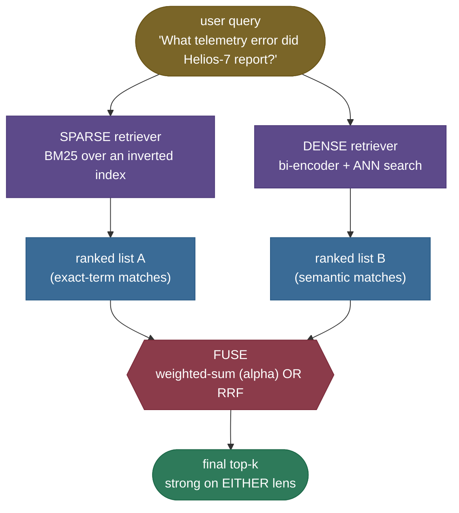

# Hybrid Search: two lenses, fused

Ask your RAG system *"What telemetry error did Helios-7 report?"* and watch the dense retriever do something maddening: it returns a chatty passage that is *about* errors in general and pushes the one line that literally says **"Error E-4011"** down to second place. Now ask *"How did the vehicle gain height after blast-off?"* and watch your BM25 keyword search score the correct passage — *"Climbing steadily, Helios-7 rose skyward..."* — at **exactly zero**, because the query and the answer share no words. Each retriever just failed, and they failed in **opposite** ways. The dense lens blurred an exact token; the lexical lens was blind to a paraphrase.

**Hybrid search** is the fix the retrieval industry converged on: stop choosing. Run *both* a lexical retriever (BM25) and a dense retriever, then **fuse** their two ranked lists into one, so a passage that is strong on *either* lens — exact keyword match *or* semantic match — surfaces near the top. It is the single highest-leverage upgrade you can make to a pure-vector RAG pipeline, and it is why every serious vector engine ships a `hybrid` mode.

I'm going to build this the way I'd explain it to a teammate whose vector search keeps missing product codes — starting from *why* each lens has a blind spot (feel both failures on our corpus), then the two-lenses intuition, then the parallel-retrieve-then-fuse mechanism, the full BM25 math and the two fusion formulas derived not dropped, a from-scratch hybrid you can read end to end (with the recall/MRR lift **measured**), the traps that bite every production system, and where hybrid is — and isn't — worth it. By the end you'll be able to:

- explain **what each lens misses** and *why* — dense blurs exact tokens, BM25 is blind to paraphrase;
- write the **full BM25 score** and explain tf-saturation ($k_1$) and length-normalization ($b$) from the formula;
- explain the **#1 fusion trap** — the BM25-vs-cosine **scale mismatch** — and the two cures (normalize-then-weight, or rank-based RRF);
- derive and contrast **weighted-sum fusion** (the `alpha` dial) and **Reciprocal Rank Fusion** ($k=60$);
- build a hybrid retriever from scratch and *measure* it beating both single lenses on a mixed query set;
- name the real systems (Elasticsearch/OpenSearch, Weaviate, Qdrant, pgvector, Pinecone) and their exact knobs.

> **Note:** hybrid search is a *retrieval* upgrade, not a *generation* one. It changes **which passages reach the prompt**, nothing about the LLM. As [chapter 1](../01-RAG-Fundamentals/01-RAG-Fundamentals.md) hammered: almost every RAG failure is a retrieval failure — and a single missed exact code or paraphrase is exactly the kind of retrieval failure hybrid removes.

---

## The problem: each lens has a blind spot the other doesn't

To see why hybrid exists, you have to feel **both** failures — on the same corpus. We use [chapter 1's](../01-RAG-Fundamentals/01-RAG-Fundamentals.md) eight-passage Helios-7 corpus plus three passages chosen to expose each lens (the full list prints in the [notebook](code/05-Hybrid-Search-BM25-and-Dense.ipynb), Step 2):

- `doc[8]` — a terse **exact-code** line: *"Error E-4011 appeared in the Helios-7 telemetry stream."*
- `doc[9]` — a **paraphrase** line: *"Climbing steadily, Helios-7 rose skyward moments past liftoff."*
- `doc[10]` — a chatty **same-topic distractor**: *"The Helios-7 ground team spent the afternoon investigating several telemetry errors and console warnings."*

**Failure 1 — the dense lens blurs an exact token.** Query: *"What telemetry error did Helios-7 report?"* A dense bi-encoder ([chapter 3](../03-Embedding-Models-for-Retrieval/03-Embedding-Models-for-Retrieval.md), here `all-MiniLM-L6-v2`) embeds query and passages by *meaning*. The chatty distractor `doc[10]` is more "about errors" overall than the terse `doc[8]`, so dense ranks it **#1** and the passage that literally contains the answer code **#2**:

```
DENSE  top-3: [10, 8, 0]   gold rank #2
```

In a system that feeds the **#1** result to the generator (or to a reranker that trusts rank order), that exact-code answer just lost. The dense model didn't *miss* the meaning — it smeared the discriminative token "E-4011" into a neighbourhood of error-talk, where a wordier passage won.

**Failure 2 — the lexical lens is blind to paraphrase.** Query: *"How did the vehicle gain height after blast-off?"* BM25 scores by **shared words**. The gold `doc[9]` ("rose skyward... liftoff") shares **no content word** with the query ("gain height... blast-off"), so BM25 scores it **exactly 0.000** and ranks unrelated passages above it — a full miss:

```
shared tokens (query ∩ gold): NONE
BM25 score of gold : 0.000   (0 -> BM25 cannot retrieve it)
SPARSE top-3: [5, 0, 10]   gold rank MISS
```

These two failures are the whole motivation. Neither lens is reliable across **query types**: lexical owns exact identifiers and rare keywords; dense owns paraphrase and synonymy. A real corpus gets both kinds of query, so a single lens is a coin flip on the kind it's bad at.

![Each lens misses one query type; hybrid never catastrophically misses. Bars show the rank the correct passage receives under all four methods — dense, sparse (BM25), weighted hybrid (α=0.6), and RRF — for both probes (rank 1 at top). Dense ranks the exact-code gold #2; BM25 misses the paraphrase gold entirely; the **weighted hybrid (α=0.6) puts both golds at #1**; **RRF lands both at #2** — still top-3, never a miss (the robustness RRF trades for not reaching #1 on this tiny set). Generated by `code/make_figures_05.py`.](../images/rag05_lens_miss_catch.png)

> **Note:** this is *not* an artifact of a weak embedder. A strong learned model (MiniLM here) genuinely matches the paraphrase — that's its job — but it still cannot guarantee an exact-token passage outranks a wordier semantic neighbour, because it ranks by *overall similarity*, not by *exact-match presence*. Lexical search is the only lens that gives an exact token a hard, large signal. That complementarity is permanent, not a tuning problem.

---

## Intuition first: two lenses, and a referee

Here is the mental model that holds up under questioning.

Think of two specialists reading the same library to answer your question. One is a **proofreader**: she scans for the *exact words and codes* in your query and flags every page that literally contains them. She is unbeatable on "find the page that says **E-4011**" and useless when your wording differs from the book's. The other is a **subject expert**: he understands what you *mean* and flags pages that are *about the same idea* even in different words. He nails "find the page about the rocket climbing after launch" and can be fooled into preferring a page that merely *sounds* on-topic over the terse page that holds the literal answer.

**Hybrid search hires both, then adds a referee** — the **fusion** step — that combines their two shortlists into one final ranking. The proofreader is BM25; the subject expert is the dense retriever; the referee is the fusion rule. A page wins if *either* specialist is confident about it.

Push on the analogy — it survives, and where it bends, it teaches:

- **"What if the two specialists disagree?"** That's the *normal* case, and exactly what the referee is for. The proofreader's #1 (exact code) and the expert's #1 (semantic best) are usually different pages; fusion **arbitrates**, surfacing both near the top instead of forcing a winner. Disagreement isn't a bug — it's the signal that the two lenses see different things.
- **"What if they agree?"** Then fusion reinforces it: a page both specialists rank highly rises to the top (this is exactly why a doc that is *strong in both* lists can beat one that is *#1 in only one* — the worked RRF example below shows the mechanism; on our tiny two-probe set it shows up as RRF never *missing*, even if a {1,2}↔{2,1} tie keeps it from reaching #1).
- **"How much do I trust each specialist?"** That's the **`alpha` dial** — weight the expert more (`alpha→1`) or the proofreader more (`alpha→0`). Tune it to your corpus; an internal docs corpus full of codes leans lexical, a conversational FAQ leans dense.
- **"What if one specialist screams much louder than the other?"** That's the central trap. BM25's "loudness" (raw score) is on a totally different scale than cosine's — so you must make them speak at a **comparable volume** (normalize) before the referee can fairly combine them, or use a referee that listens only to their **rankings**, not their volume (RRF).

The mapping to the mechanism is exact: **the proofreader is BM25, the subject expert is the dense retriever, the two shortlists are the two ranked candidate lists, and the referee is the fusion rule — weighted-sum or RRF.** Hold that picture; everything below is the engineering that makes the referee fair and fast.


---

## The mechanism: retrieve in parallel, then fuse

Hybrid search has a simple shape: **two retrievers run in parallel over the same corpus, each returns a ranked candidate list, and a fusion step merges the two lists into the final top-$k$.**



Stage by stage:

1. **Sparse retrieve (BM25).** Score every document for the query with BM25 over an inverted index (term → postings list). Returns a ranked list whose top entries **literally contain the query's terms**, weighted by rarity and saturated tf. This is the lens that nails codes, names, acronyms.
2. **Dense retrieve.** Embed the query with the same bi-encoder used at index time, then find the nearest passage vectors — at scale via an [ANN index](../04-Vector-Databases-and-ANN-Indexes/04-Vector-Databases-and-ANN-Indexes.md) (HNSW/IVF). Returns a ranked list of **semantic** matches.
3. **Fuse.** Combine the two ranked lists into one. Two families: (a) **score fusion** — normalize each list's scores onto a common scale, then take a weighted sum $\alpha\cdot\text{dense}+(1-\alpha)\cdot\text{sparse}$; (b) **rank fusion** — ignore raw scores and combine **ranks** via Reciprocal Rank Fusion. The output is the final top-$k$ handed to the generator (or to a [reranker](../06-Re-ranking-Cross-Encoders/06-Re-ranking-Cross-Encoders.md)).

> **Note:** in practice you retrieve a **larger candidate pool from each lens** (say top-50 or top-100 each) and fuse those, then keep the final top-$k$ (e.g. 3–10). Fusing only each lens's top-3 throws away signal — a passage at sparse-rank 8 and dense-rank 4 might deserve the final #1, and you can only see that if both lists run deep enough to contain it. The pool size before fusion is its own knob.

---

## The math, part 1: BM25 derived

BM25 ("Best Match 25") is the lexical lens, and the formula is worth knowing cold because interviewers ask you to read it term by term. The score of document $d$ for query $q$ is a **sum over the query's terms**:

$$\text{BM25}(q,d)\;=\;\sum_{t\,\in\,q}\;\text{IDF}(t)\;\cdot\;\frac{tf_{t,d}\,(k_1+1)}{tf_{t,d}+k_1\!\left(1-b+b\,\dfrac{|d|}{\text{avgdl}}\right)}$$

> **Source / derivation:** [Robertson & Zaragoza, *The Probabilistic Relevance Framework: BM25 and Beyond* (FnTIR 2009), §3](https://www.staff.city.ac.uk/~sbrp622/papers/foundations_bm25_review.pdf) — derives the full BM25 saturation-and-length-normalization scoring function from the probabilistic relevance model; the canonical reference for every term below.

Define every symbol:

- $t \in q$ — each **term** (token) in the query; the score sums one contribution per query term.
- $tf_{t,d}$ — the **term frequency**: how many times $t$ occurs in document $d$.
- $|d|$ — the **length** of document $d$ (in tokens); $\text{avgdl}$ — the **average document length** across the corpus (here `avgdl = 12.55`, printed in the notebook).
- $k_1$ — the **saturation** parameter (Lucene/Elasticsearch default $k_1=1.2$; classic range $[1.2,\,2.0]$).
- $b$ — the **length-normalization** parameter (near-universal default $b=0.75$).
- $\text{IDF}(t)$ — the **inverse document frequency** of $t$ (below).

The formula has two ideas bolted together; read them separately.

**IDF — rare terms matter more.** A term in every document is no fingerprint; a term in one document is a strong one. The Lucene variant of the probabilistic IDF is:

$$\text{IDF}(t)\;=\;\ln\!\left(1+\frac{N-n_t+0.5}{n_t+0.5}\right)$$

> **Source / derivation:** [Robertson & Zaragoza (2009), §3.2](https://www.staff.city.ac.uk/~sbrp622/papers/foundations_bm25_review.pdf) — the Robertson–Spärck-Jones probabilistic IDF with $+0.5$ smoothing; the outer $1+(\cdot)$ is Lucene's modification that keeps IDF strictly positive even for a term in more than half the corpus (the classic $\ln\frac{N-n_t+0.5}{n_t+0.5}$ goes negative there).

where $N$ is the corpus size and $n_t$ the number of documents containing $t$. On our corpus the notebook prints `IDF('helios')=0.470` (Helios appears in most passages — common, low weight) versus `IDF('telemetry')=1.569` (rare — high weight). That rarity weighting is why BM25 nails an exact code: the code is a rare token with a large IDF, so the one passage containing it gets a big, hard-to-beat contribution.

**The saturated-tf-with-length-norm factor.** The fraction
$$\frac{tf\,(k_1+1)}{tf+k_1\!\left(1-b+b\,\frac{|d|}{\text{avgdl}}\right)}$$
does two jobs at once:

- **Saturation (via $k_1$).** As $tf\to\infty$ the fraction approaches its ceiling $k_1+1$ — so the 11th occurrence of a word adds far less than the 2nd, and a document **cannot win by keyword-stuffing**. The notebook makes this concrete: at $k_1=1.2$ the gain from $tf$ 1→2 is **0.375** but from $tf$ 10→50 only **0.184** (ceiling = $k_1+1$ = **2.2**). Larger $k_1$ delays saturation (rewards repetition more); $k_1\to0$ saturates instantly (one occurrence is as good as ten).


- **Length normalization (via $b$).** The factor $\left(1-b+b\,\frac{|d|}{\text{avgdl}}\right)$ sits in the denominator. For an **average-length** document ($|d|=\text{avgdl}$) it equals 1 — no effect. A **longer** document inflates the denominator (lower score), because a long passage matches many terms by chance and shouldn't be rewarded for sheer length; a **shorter** one shrinks it (higher score). $b=0$ ignores length entirely; $b=1$ penalizes fully; $b=0.75$ is the standard middle. This is exactly why our *terse* exact-code line `doc[8]` (short) beats the *chatty* distractor `doc[10]` (long) under BM25 even though both mention "telemetry" and "error" — the notebook prints BM25 `doc[8]=5.003` vs `doc[10]=2.323`.


> **Gotcha:** the term that makes BM25 *retrieve nothing* for a paraphrase is the very first one — the sum is over $t \in q$, and a query term **absent from the document contributes 0**. If *no* query term appears in the passage, every contribution is 0 and the total is **exactly 0** — which is precisely the paraphrase failure: zero shared tokens → score 0 → unretrievable. The notebook asserts this (`BM25 score of gold : 0.000`). No amount of $k_1$/$b$ tuning fixes it; only a *different lens* (dense) can.

---

## The math, part 2: fusing two scores that live on different scales

Now the referee. We have two score vectors — dense cosine and BM25 — and we want one combined ranking. The naive idea, **add them**, is the single most common hybrid bug, and it's worth seeing fail.

### The scale-mismatch trap

Cosine similarity is bounded in $[-1, 1]$. BM25 is **unbounded** and routinely reaches 5, 15, 50 depending on corpus and query length. On our paraphrase probe the notebook prints the two ranges:

```
raw cosine range : [-0.039, +0.325]   (bounded, subset of [-1, 1])
raw BM25 range   : [+0.000, +1.039]   (unbounded, >= 0)
in a NAIVE sum, BM25 supplies 87% of the magnitude -> it drowns out cosine
```

Add these raw and **BM25 decides the ordering almost alone** — it supplies 87% of the sum's magnitude here, so the dense signal is nearly ignored. Concretely, the dense lens ranks the paraphrase gold **#1**, but a naive `dense + sparse` **collapses it to #6** (the notebook asserts this):

```
gold dense rank      : #1
gold NAIVE-add rank  : #6   (collapsed by BM25 magnitude)
gold NORMALIZED rank : #6
```

But notice the last line: **normalization alone doesn't rescue it either** — the equal min-max-normalized sum *still* ranks the gold **#6** here. Normalizing fixes the **scale**, not the **weighting**: with both lenses equally weighted, a distractor that scores decently on both still outranks a gold that is excellent on dense but zero on sparse. It takes `alpha`-weighting *toward dense* (the next section, $\alpha\approx0.6$) to actually surface it. Normalization is necessary but not sufficient; weighting is the other half.

![Incomparable scales on the paraphrase probe (the same probe as the prose above, so the plotted ranges match its numbers). Each dot is one passage's score: cosine (top row) sits in [−0.04, 0.32]; BM25 (bottom) spreads to ~1.04 — still several times larger, so a naive sum is decided by BM25 alone, which is why you must normalize each lens onto a common scale before combining. Generated by `code/make_figures_05.py`.](../images/rag05_scale_mismatch.png)

### Cure A — normalize, then weight (the `alpha` dial)

Map each score vector onto a common $[0,1]$ axis with **min-max normalization**, then take a convex combination:

$$\hat{s}_j\;=\;\frac{s_j-\min_i s_i}{\max_i s_i-\min_i s_i}\,,\qquad\quad \text{fused}_j\;=\;\alpha\,\hat{s}^{\text{dense}}_j+(1-\alpha)\,\hat{s}^{\text{sparse}}_j$$

> **Source / derivation:** [Bruch, Gai & Ingber, *An Analysis of Fusion Functions for Hybrid Retrieval* (ACM TOIS 2023, arXiv:2210.11934)](https://arxiv.org/abs/2210.11934) — analyzes convex-combination fusion of normalized lexical and dense scores (incl. min-max and theoretical-min-max normalization), and shows a tuned convex combination is competitive with and often beats RRF.

Here $\alpha\in[0,1]$ is the **trust dial**: $\alpha=1$ is pure dense, $\alpha=0$ pure sparse, $\alpha=0.5$ equal. This is exactly **Weaviate's `alpha`**. Normalizing first is what stops BM25's magnitude from deciding alone — both lenses now contribute on a $[0,1]$ scale.

**`alpha` is a knob you *tune*, not a constant you assume.** Sweeping it on our two-probe set, the optimum is **interior** — neither pure lens:

```
 alpha |    MRR |  recall@3 | note
   0.0 |  0.500 |     0.500 | = pure sparse
   0.2 |  0.500 |     0.500 |
   0.4 |  0.500 |     0.500 |
   0.5 |  0.500 |     0.500 |
   0.6 |  1.000 |     1.000 | <- best blend
   0.7 |  1.000 |     1.000 | <- best blend
   0.8 |  1.000 |     1.000 | <- best blend
   1.0 |  0.750 |     1.000 | = pure dense
```

At $\alpha=0.6$ **both** golds rank #1 — MRR and recall@3 both hit **1.0**, strictly beating dense alone (MRR 0.75) and sparse alone (recall 0.5). Note everything from $\alpha=0.0$ through $\alpha=0.5$ ties pure sparse (MRR 0.5) — $\alpha=0.5$ is *not* automatically best — and the win only appears once $\alpha$ crosses toward dense ($0.6$–$0.8$), which is the whole reason you tune $\alpha$ per corpus.


### Cure B — Reciprocal Rank Fusion (ignore the scores entirely)

The scale problem evaporates if you throw away the raw scores and keep only the **ranks**. RRF scores each document by summing $1/(k+\text{rank})$ across the input lists:

$$\text{RRF}(d)\;=\;\sum_{i\,\in\,\text{lists}}\frac{1}{k+r_i(d)}$$

> **Source / derivation:** [Cormack, Clarke & Büttcher, *Reciprocal Rank Fusion Outperforms Condorcet and Individual Rank Learning Methods* (SIGIR 2009)](https://plg.uwaterloo.ca/~gvcormack/cormacksigir09-rrf.pdf) — introduces RRF (Eq. 1) and the constant $k=60$, showing this simple rank-based fusion beats more complex learned combination methods.

where $r_i(d)$ is document $d$'s **1-based rank** in list $i$ (rank 1 = best), and $k$ is a constant that damps the influence of low ranks. Because RRF reads only ranks, it needs **no normalization** and is **immune to the scale mismatch** — its single biggest practical advantage. The constant $k$ controls how sharply rank-1 dominates: the notebook prints the weights at $k=60$ — rank 1 is worth `0.01639`, rank 10 is worth `0.01429`, rank 100 worth `0.00625`. A **smaller** $k$ makes being #1 far more decisive; a **larger** $k$ flattens the curve so deep ranks still count.

The standard default is **$k=60$** (Cormack et al. 2009; the default in Elasticsearch). A doc that is *decent in both* lists can overtake a doc that is *#1 in only one* — strong-in-both beats strong-in-one — which is exactly the robustness you want.

**Reconcile that with our data, honestly.** On this two-probe set RRF lands both golds at **#2** (recall@3 = 1.0 — never a catastrophic miss, vs sparse's 0.5) but on **MRR it ties pure sparse at 0.500**, *below* dense's 0.750. That tie is *mathematical*, not a fluke: each gold is rank {1,2} in one lens and {2,1} in the other, and RRF's symmetric $1/(k+\text{rank})$ contributions for "{1,2}" and "{2,1}" are nearly equal, so RRF cannot break the tie to push either gold to #1. The lesson is precise: **RRF's win here is recall robustness and scale-freedom — never whiffing — not top-rank precision.** Top-rank precision is exactly what the *tuned weighted-sum* buys ($\alpha=0.6$ reaches both #1). On larger, noisier corpora RRF's strong-in-both behaviour does lift precision too; on a two-doc-gold toy it can only guarantee the never-miss property.


> **Note:** weighted-sum vs RRF is a real tradeoff, not a clear winner. **RRF** needs zero tuning, ignores scale, and is the robust default — but it discards score *magnitude* (the gap between a 0.95 and a 0.55 cosine is invisible to it). **Weighted-sum**, *tuned*, can exploit that magnitude and edge RRF out (as our $\alpha=0.6$ does), but it requires per-corpus normalization and tuning. The honest summary, matching [Bruch et al. 2023](https://arxiv.org/abs/2210.11934): RRF is the safe default; a tuned convex combination is the performance ceiling if you'll do the tuning.

---

## Worked example: a hybrid you can read end to end

Let's build the whole thing from primitives — BM25 from scratch, a dense bi-encoder, both fusion rules — and **measure** the lift. CPU-runnable, deterministic.

> **Runnable script + step-by-step notebook:** the verified code lives next to this page — the [step-by-step teaching notebook](code/05-Hybrid-Search-BM25-and-Dense.ipynb) and the [runnable demo script](code/hybrid_search.py) (run it with `python hybrid_search.py`). Every number printed below is produced by that code — nothing here is hand-typed. Our from-scratch BM25 uses the **Lucene IDF variant** ($\ln(1+\cdots)$); the notebook (Step 3 cross-check against `rank_bm25.BM25Okapi`, matching $k_1$/$b$) shows it gives the **same ranking on the chapter's two probes** but — honestly — *differs on a third query*, because `BM25Okapi` uses the **classic IDF** (no outer $1+$). Same algorithm, a known IDF-offset difference — not "identical in general."

**Step 1 — BM25 from scratch.** The lexical lens: precompute IDF and per-doc term frequencies once, then score per query. The saturated-tf-with-length-norm factor and the IDF are exactly the formula above.

```python
class BM25:
    def _idf(self, term):                      # Lucene variant: strictly positive
        df = self.df.get(term, 0)
        return math.log(1.0 + (self.n_docs - df + 0.5) / (df + 0.5))

    def score(self, query, doc_index):         # sum over query terms
        tokens_in_doc = self.tf[doc_index]
        length_norm = 1.0 - self.b + self.b * self.doc_len[doc_index] / self.avgdl
        total = 0.0
        for term in tokenize(query):
            tf = tokens_in_doc.get(term, 0)
            if tf == 0:                        # absent term -> 0 (the paraphrase failure)
                continue
            total += self.idf.get(term, 0.0) * (tf * (self.k1 + 1.0)) / (tf + self.k1 * length_norm)
        return total
```

**Step 2 — feel both blind spots.** Score each lens on each probe and read the gold's rank:

```python
from hybrid_search import BM25, DenseRetriever, full_corpus, build_probes
corpus = full_corpus()
bm25, dense = BM25(corpus), DenseRetriever(corpus)
for p in build_probes(corpus):
    print(p.label, "| DENSE", dense.search(p.query).indices, "| SPARSE", bm25.search(p.query).indices)
```

```
exact-code  | DENSE (10, 8, 0)  gold #2 | SPARSE (8, 10, 9)  gold #1
paraphrase  | DENSE (9, 1, 0)   gold #1 | SPARSE (5, 0, 10)  gold MISS
```

Each lens fails a different probe — dense ranks the exact-code gold #2, BM25 misses the paraphrase entirely. (These are the exact ranks the notebook's Step 5 prints.)

**Step 3 — fuse, two ways.** Weighted-sum (normalize first, then blend by `alpha`) and RRF (rank-based):

```python
def weighted_sum_fusion(dense_scores, sparse_scores, alpha):
    return alpha * min_max_normalize(dense_scores) + (1 - alpha) * min_max_normalize(sparse_scores)

def reciprocal_rank_fusion(score_lists, k_rrf=60):
    fused = np.zeros(len(score_lists[0]))
    for scores in score_lists:
        ranks = {doc: r for r, doc in enumerate(np.argsort(scores)[::-1], start=1)}
        for doc in range(len(scores)):
            fused[doc] += 1.0 / (k_rrf + ranks[doc])
    return fused
```

**Step 4 — measure the lift (assert before you claim).** Over **both** probes, MRR and recall@3 per method:

```
method                         |    MRR |  recall@3
dense only                     |  0.750 |     1.000
sparse only (BM25)             |  0.500 |     0.500
hybrid weighted (a=0.6)        |  1.000 |     1.000
hybrid RRF (k=60)              |  0.500 |     1.000
```

Read it: **BM25 alone misses half the queries** (recall@3 = 0.500 — it never retrieves the paraphrase). **Dense alone** ranks the exact-code gold #2 (MRR = 0.750). The **tuned weighted-sum hybrid** reaches **MRR = 1.0 and recall@3 = 1.0** — strictly better than either single lens, which the code *asserts* before printing. **RRF** reaches recall@3 = 1.0 (it lands both golds at #2 — never a catastrophic miss) but ties pure sparse on MRR (0.500) on this tiny set, because of the symmetric-rank tie explained above; it is scale-free with no tuning, the reason it's the robust production *default* even when tuned weighted-sum edges it on precision. That measured lift, not a hand-wave, is *why* hybrid exists.

**The library one-liners.** In production each engine wires the same two families:

```python
# Weaviate — hybrid with an alpha dial (0 = pure BM25, 1 = pure vector, 0.5 = equal)
collection.query.hybrid(query="telemetry error", alpha=0.6, limit=3)

# Elasticsearch / OpenSearch — RRF over a BM25 retriever + a kNN (dense) retriever
#   "retriever": { "rrf": { "retrievers": [ {"standard": {...BM25...}}, {"knn": {...}} ],
#                           "rank_constant": 60, "rank_window_size": 100 } }

# Qdrant — Query API: prefetch both, fuse with RRF
#   client.query_points(prefetch=[dense_q, sparse_q], query=models.FusionQuery(fusion=models.Fusion.RRF))

# pgvector + Postgres FTS — blend ts_rank (lexical) with 1 - (embedding <=> query) (cosine)
# Pinecone — sparse-dense vectors in one index; the dot product spans both parts
```

The one-liner hides exactly the mechanics we built by hand — which is why building it once is the lesson the API can't teach.

---

## Pitfalls and failure modes

Hybrid search fails in characteristic ways. Name them so you catch them in the wild.

**1. Score-scale mismatch (the #1 trap).** Adding raw cosine ($[-1,1]$) and raw BM25 (unbounded) lets BM25's larger magnitude decide alone.

- *Failing:* `fused = cosine + bm25`. On our paraphrase probe BM25 supplies **87%** of the sum's magnitude, collapsing a dense **#1** to **#6**.
- *Fix:* **min-max normalize each lens to $[0,1]$ before summing**, then weight (`alpha`); or use **RRF**, which reads only ranks and is immune to scale.

**2. Untuned `alpha`.** Equal weighting (`alpha=0.5`) is a *guess*, not an optimum.

- *Failing:* shipping `alpha=0.5` on a code-heavy corpus where lexical should dominate; on our set `alpha=0.5` ties *pure sparse* (MRR 0.5) while `alpha=0.6` hits 1.0.
- *Fix:* **sweep `alpha`** on a labeled query set and pick the interior optimum; re-tune when the corpus or query mix shifts.

**3. Misunderstanding the RRF constant $k$.** $k$ is not a relevance threshold; it's how sharply rank-1 dominates.

- *Failing:* setting $k$ huge "to be safe" flattens the weight curve until deep, irrelevant ranks count as much as the top — diluting the signal.
- *Fix:* start at the **$k=60$** default (Cormack et al. 2009; Elasticsearch's default). Lower $k$ to sharpen top-rank dominance, raise it to let more of the tail vote.

**4. Wrong BM25 $k_1$/$b$.** Defaults exist for a reason.

- *Failing:* assuming "more tf is always better" — without saturation, a keyword-stuffed page wins; without length-norm, long pages win by sheer size.
- *Fix:* keep the defaults **$k_1\approx1.2$** (Lucene) **and $b=0.75$** unless you measure a reason to move; raise $k_1$ for corpora where repetition is meaningful, lower $b$ if your docs are uniformly sized.

**5. Tokenization mismatch between the two lenses.** BM25 and the dense model tokenize differently.

- *Failing:* BM25 lowercases and splits on whitespace/punctuation while the dense model uses sub-word BPE — so "E-4011" is one BM25 token but several dense sub-words. If your BM25 analyzer strips hyphens or digits, it *also* loses the exact code, and the one lens that was supposed to nail it can't.
- *Fix:* configure the BM25 analyzer to **preserve identifiers** (codes, SKUs, hyphenated terms); verify the exact-match path actually keeps the tokens you care about.

**6. Duplicate / near-duplicate handling across the two lists.** The same passage appears in both lists, and naive concatenation double-counts or floods the top with near-dupes.

- *Failing:* fusing without **deduping by document id**, so one passage's two appearances both consume top-$k$ slots, or three near-identical chunks crowd out diversity.
- *Fix:* fuse on a **document id** key (sum the contributions for the same doc, as RRF naturally does), and apply near-duplicate suppression *after* fusion if your corpus has redundant chunks.

> **Gotcha:** notice five of the six fixes are about *making the two lenses combine fairly* — normalization, weighting, the RRF constant, tokenization parity, dedup. Fusion is where hybrid is won or lost, the same way retrieval is where RAG is won or lost. Get the referee right and the two specialists do the rest.

---

## Where it matters, and where it doesn't

**The one problem hybrid solves:** no single retriever is reliable across **query types**. Lexical (BM25) owns exact identifiers, codes, names, and rare keywords; dense owns paraphrase, synonymy, and intent. Real corpora get both kinds of query, so fusing the two lenses removes the per-type coin flip — *that* is the entire value proposition.

**Which layer it lives at.** Hybrid sits at the **retrieval layer**, between the index and the generator — it changes *which candidates* reach the prompt, nothing about the LLM or the embeddings themselves. You can add it to an existing RAG stack without retraining anything: stand up a BM25 index alongside your vector index and add a fusion step.

**The core tradeoff:** hybrid buys robustness across query types at the cost of **two indexes, two retrieval calls, and a fusion step** — more moving parts, a tokenization-parity concern, and a fusion knob (`alpha` or $k$) to tune. You trade "one simple vector search" for "two searches plus a referee, that rarely whiffs."

**When hybrid is the answer:**
- **Mixed query workloads** — a help center where users paste error codes *and* describe symptoms in their own words.
- **Identifier-heavy corpora** — internal docs, code, product catalogs, legal/medical text full of codes, SKUs, statutes, drug names that dense search blurs.
- **High-stakes recall** — when missing the one exact-match passage is expensive, BM25's hard exact-term signal is a safety net dense search can't provide.

**When hybrid is NOT worth it:**
- **Purely conversational, paraphrase-dominated queries** with no exact identifiers — dense alone is often enough; the BM25 leg adds latency and a tuning surface for little gain.
- **Tiny corpora that fit the context window** — just stuff everything in; retrieval (let alone hybrid) is overkill (the [Long-Context vs RAG](../12-Long-Context-vs-RAG/12-Long-Context-vs-RAG.md) chapter weighs this).
- **When you haven't measured a lexical gap** — if dense already nails your eval set, adding BM25 is complexity without a proven win. Measure first.

---

## In production

Hybrid search is a first-class feature in essentially every modern retrieval engine, almost always with **RRF as the default fusion** and an optional weighted/`alpha` mode:

- **Elasticsearch / OpenSearch** — native **RRF** combining a BM25 (`standard`) retriever with a `knn` (dense) retriever, default **`rank_constant: 60`** and a `rank_window_size` (the candidate pool before fusion). The reference production hybrid stack.
- **Weaviate** — `hybrid` queries with an **`alpha`** dial (`alpha=0` pure BM25/keyword, `alpha=1` pure vector, `alpha=0.5` equal) and a choice of fusion method (`relativeScoreFusion`, the default since v1.24, or `rankedFusion`).
- **Qdrant** — the Query API runs **prefetch** of a dense and a sparse query, then fuses with **RRF** (or DBSF, distribution-based score fusion) in one round trip; sparse vectors (e.g. SPLADE/BM25-style) live in the same collection.
- **pgvector + Postgres full-text** — combine `ts_rank` (lexical) with `1 - (embedding <=> query)` (cosine) in SQL; the standard Postgres-native hybrid pattern, often fused with RRF in application code.
- **Pinecone** — **sparse-dense** vectors in a single index; a record carries both a dense vector and a sparse (term-weight) vector, and the dot product spans both, giving hybrid scoring without a separate fusion step.

**When to reach for it:** the moment your corpus contains identifiers, codes, or rare keywords that users will quote *and* paraphrase — which is most enterprise search. It's cheap to add (a second index + a fusion step), model-agnostic (wrap any embedder + any BM25), and the lift is measurable on a labeled query set. The frontier — covered in the next chapters — sharpens *which* of the fused candidates wins: [re-ranking with cross-encoders](../06-Re-ranking-Cross-Encoders/06-Re-ranking-Cross-Encoders.md) reorders the fused top-$k$ with a far more expensive but more accurate scorer, and [query transformation](../07-Query-Transformation-HyDE-Multi-Query/07-Query-Transformation-HyDE-Multi-Query.md) rewrites the query so *both* lenses retrieve better in the first place.

> **Note:** the through-line continues. [Chapter 3](../03-Embedding-Models-for-Retrieval/03-Embedding-Models-for-Retrieval.md) chose the dense lens; [chapter 4](../04-Vector-Databases-and-ANN-Indexes/04-Vector-Databases-and-ANN-Indexes.md) made dense search fast at scale; **this chapter added the lexical lens back and fused the two**, recovering the exact-match strength that pure-vector RAG threw away. Next, [chapter 6](../06-Re-ranking-Cross-Encoders/06-Re-ranking-Cross-Encoders.md) reranks whatever this hybrid retriever returns. Retrieve broadly with two lenses, then sharpen — that's the shape of a strong RAG stack.

---

## Recap and rapid-fire

**If you remember nothing else:** dense embeddings match meaning but blur exact tokens; BM25 matches exact terms but is blind to paraphrase — *complementary* blind spots. **Hybrid search runs both and fuses the two ranked lists**, so a passage strong on *either* lens surfaces. BM25 scores by IDF × saturated-tf × length-norm (defaults $k_1\approx1.2$, $b=0.75$); fusion is either **weighted-sum** (min-max normalize each lens, then $\alpha\cdot\text{dense}+(1-\alpha)\cdot\text{sparse}$ — tune $\alpha$) or **RRF** ($\sum 1/(k+\text{rank})$, $k=60$, scale-free, the robust default). The #1 trap is the **score-scale mismatch** — never add raw cosine and BM25.

**Quick-fire — say these out loud:**

- *Why hybrid over pure dense?* Dense blurs exact tokens (codes, names); BM25 is blind to paraphrase. Each fails a different query type; fusion covers both.
- *Write the BM25 score.* $\sum_{t\in q}\text{IDF}(t)\cdot\frac{tf(k_1+1)}{tf+k_1(1-b+b\,|d|/\text{avgdl})}$.
- *What do $k_1$ and $b$ do?* $k_1$ = tf saturation (ceiling $k_1+1$, default ~1.2); $b$ = length normalization (default 0.75; $b=0$ ignores length, $b=1$ penalizes fully).
- *Why can't you just add cosine and BM25?* Different scales — cosine $\in[-1,1]$, BM25 unbounded — so BM25's magnitude dominates. Normalize first, or use RRF.
- *Write RRF.* $\text{RRF}(d)=\sum_i 1/(k+r_i(d))$, default $k=60$; rank-based, so no normalization needed.
- *Weighted-sum vs RRF?* Weighted-sum (tuned `alpha`) can exploit score magnitude and win; RRF is scale-free, needs no tuning, and is the robust default.
- *What does Weaviate's `alpha` mean?* `alpha=0` pure BM25, `alpha=1` pure vector, `alpha=0.5` equal.
- *Most common hybrid bug?* The score-scale mismatch — naive-adding raw BM25 and cosine. Suspect fusion first.

---

## References and further reading

The curated link library for this topic — videos, courses, articles, papers, books, and internal cross-links — lives in a companion file so it can be reused as a standalone reference list:

**→ [Hybrid Search (BM25 + Dense) — references and further reading](05-Hybrid-Search-BM25-and-Dense.references.md)**
