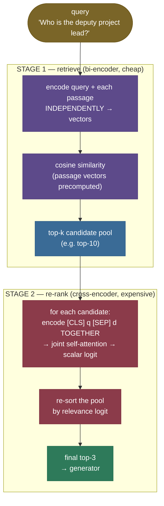

# Re-ranking with Cross-Encoders: cheap recall, then expensive precision

Your retriever just returned its top-3 for the query *"Who is the deputy project lead for Helios-7?"* — and the passage that literally answers it, *"The deputy project lead for Helios-7 is Dr. Amara Okoye,"* **isn't in them.** It came back at rank 4, edged out by three vaguer passages — *"...overseen by a steering committee,"* *"...leadership rotates annually,"* *"the chief scientist... reports to the principal investigator"* — that *sound* like leadership but answer a different question. Your bi-encoder did its job (the answer is topically near), but it ranked by *overall similarity*, and on that axis "deputy project lead" and "leadership rotates annually" look almost the same. The right answer is *in the haystack* — just not on top.

This is the gap **re-ranking** fills. The bi-encoder (or BM25, or [hybrid](../05-Hybrid-Search-BM25-and-Dense/05-Hybrid-Search-BM25-and-Dense.md)) is a fast, coarse **first stage** — great at pulling the right *neighbourhood* of passages cheaply. A **cross-encoder** is a slow, precise **second stage** — it re-reads the top-k candidates, this time with the query and each passage fed through the model **together**, and re-sorts them by a far more accurate relevance score. Retrieve a wide net cheaply, then sharpen the top with an expensive model: cheap **recall**, then expensive **precision**. It is the single highest-leverage precision upgrade in a RAG stack, and it's why every serious retrieval pipeline ends with a re-ranker.

I'm going to build this the way I'd explain it to a teammate whose vector search keeps ranking the right passage *almost* first — starting from *why* the bi-encoder is structurally coarse (feel the miss), then the two-stage-funnel intuition, then the bi-encoder-vs-cross-encoder mechanism, the score and the cost math derived not dropped, a from-scratch two-stage pipeline with the **nDCG/MRR lift measured**, the traps that bite every production system, and where re-ranking is — and isn't — worth it. By the end you'll be able to:

- explain **why a bi-encoder can't model query↔document interaction** and a cross-encoder can;
- write the **cross-encoder scoring** path (`[CLS] q [SEP] d` → joint attention → scalar) and the **cost asymmetry** that forces two stages;
- define **nDCG@k** and **MRR** precisely and compute the re-ranking lift;
- build a two-stage retrieve-then-rerank pipeline from scratch and *measure* the gold rise from #4 to #1;
- name the real models (`ms-marco-MiniLM`, BGE rerankers, Cohere Rerank, ColBERT) and the production pipeline shape;
- avoid the killers: **latency** (k forward passes), the **recall ceiling** (rerank ≠ rescue), and treating the **uncalibrated logit** as a probability.

> **Note:** re-ranking is a *precision* upgrade, not a *recall* one. It can only **reorder the candidates the first stage already fetched** — it cannot conjure a passage retrieval missed. Get that one fact wrong and you'll "add a re-ranker" to a pipeline whose real problem is that the gold never made the candidate pool. We prove this limit in code below; internalize it now.

---

## The problem: independent encodings are coarse

To see why re-ranking exists, you have to feel what the first stage *structurally* cannot do.

A [bi-encoder](../03-Embedding-Models-for-Retrieval/03-Embedding-Models-for-Retrieval.md) — the dense retriever from chapter 3 — embeds the query and every passage **independently** into vectors, then ranks by cosine similarity. That independence is exactly what makes it fast: the passage vectors are precomputed once, offline, and at query time you embed only the query and take dot products. But it is also exactly why it's coarse: **the query never sees the passage.** Each is crushed to a single vector in isolation, so the model can never ask "does *this passage* answer *this specific query*?" — only "are these two summaries pointing the same general direction?"

Watch it fail on our corpus (chapter 3's bi-encoder, `all-MiniLM-L6-v2`, over 12 look-alike Helios-7 leadership passages — the full list prints in the [notebook](code/06-Re-ranking-Cross-Encoders.ipynb), Step 2). Query: *"Who is the deputy project lead for Helios-7?"* The bi-encoder's top of the ranking:

```
 1. doc[ 3] cos=0.744   The Helios-7 program is overseen by a steering committee of the partner agencies.
 2. doc[ 5] cos=0.742   Project leadership responsibilities for Helios-7 rotate annually among the agencies.
 3. doc[ 8] cos=0.730   The chief scientist for the Helios-7 payload reports to the principal investigator.   | top-3 cutoff
 4. doc[ 0] cos=0.720   The deputy project lead for Helios-7 is Dr. Amara Okoye, who runs the Nairobi office.   <- GOLD
```

The true answer **`doc[0]` lands at rank 4** — by a hair (0.720 vs 0.730), but *below the top-3 cutoff*. Three passages about leadership-in-general edged out the one passage that *names the deputy lead*. To a bi-encoder, "deputy project lead" and "leadership rotates annually" are nearly the same point in space, because it compressed each passage to a vector *without ever looking at the query*. If your pipeline feeds the top-3 to the generator (a common default), the right answer never arrives — and the model either says "I don't know" or grounds on a vaguer passage.


> **Note:** this is *not* a weak-embedder artifact. `all-MiniLM-L6-v2` is a strong, widely-used retriever — and it still buries the answer, because the limitation is **architectural**: independent encoding throws away query↔passage interaction *before* the comparison happens. No bigger bi-encoder removes it; only a model that reads the pair *together* can. That model is the cross-encoder.

---

## Intuition first: the résumé screen and the interview

Here is the mental model that holds up under questioning.

Hiring runs in two stages for a reason. First, a **keyword screen** scans thousands of résumés fast and cheap — does this résumé broadly match the role? It's lossy (good candidates with unusual phrasing slip; buzzword-stuffed ones pass) but it shrinks thousands to a shortlist in seconds. Then comes the **interview**: a human sits down with each shortlisted candidate and reads them *in the context of the actual job*, probing the fit no keyword scan could see. You'd never interview all thousand applicants (too slow), and you'd never hire straight off the keyword screen (too coarse). You **screen wide and cheap, then interview narrow and deep.**

Re-ranking is exactly that. The **bi-encoder is the keyword screen**: fast, precomputed, coarse — it turns the whole corpus into a shortlist (the top-k). The **cross-encoder is the interview**: it takes each shortlisted passage and reads it *together with the query*, with full attention between them, to judge true relevance. The funnel is the point — cheap recall, then expensive precision.

Push on the analogy — it survives, and where it bends, it teaches:

- **"Why not interview everyone — cross-encode the whole corpus?"** Same reason you don't interview a thousand people: cost. The cross-encoder runs a full transformer forward pass *per (query, passage) pair* at query time, so scoring a million passages per query is minutes, not milliseconds. You can only afford it on the shortlist. (This is the cost asymmetry we derive below.)
- **"Why not skip the screen and just interview the best few?"** Because the screen is what *produces* the shortlist — and its quality caps everything. If the keyword screen rejects your best candidate, no interview brings them back. **The re-ranker can only reorder who made the shortlist; a gold passage missed by retrieval is gone.** (The recall ceiling — the single most important caveat.)
- **"What makes the interview better than the screen?"** The interview reads the candidate *in context* — the same résumé means different things for different roles. The cross-encoder reads each passage *conditioned on the query*: "deputy project lead" lights up for *this* query in a way "leadership rotates annually" does not, because query and passage tokens attend to each other.
- **"Is one cross-encoder score comparable across queries?"** No — it's an interview verdict for *this* candidate-and-job pairing, not an absolute grade. The score is an uncalibrated relevance logit; use it to *order* candidates for one query, not to compare across queries or threshold as a probability (a pitfall below).

The mapping to the mechanism is exact: **the keyword screen is the bi-encoder's independent encoding, the shortlist is the top-k candidate pool, and the interview is the cross-encoder reading query and passage jointly.** Hold that picture; everything below is the engineering that makes the interview accurate and the funnel affordable.


---

## The mechanism: bi-encoder retrieves, cross-encoder re-ranks

The two stages differ in *one* structural choice — whether the query and passage are encoded apart or together — and everything else (speed, precomputability, accuracy) follows from it.



**Stage 1 — bi-encoder retrieve (independent encoding).** Encode the query once; the passage vectors were already encoded offline. Rank by cosine. Cost at query time: one query encode + $N$ cheap dot products. Because the passage vectors don't depend on the query, they're **precomputed and indexed** ([ANN](../04-Vector-Databases-and-ANN-Indexes/04-Vector-Databases-and-ANN-Indexes.md)), which is why first-stage retrieval scales to millions of passages in milliseconds. The output is a **top-k candidate pool** — wide enough to (almost) always contain the gold, narrow enough to re-rank affordably.

**Stage 2 — cross-encoder re-rank (joint encoding).** For each of the $k$ candidates, concatenate the query and passage into one sequence `[CLS] query [SEP] passage` and run the transformer over the pair. Now **every query token can attend to every passage token and back** — the model directly measures whether *this* passage answers *this* query. A small head on the `[CLS]` representation emits a single **relevance logit**, and you re-sort the pool by it. Cost: $k$ full forward passes at query time, and — critically — the score *cannot be precomputed*, because it depends on the query.

![Bi-encoder (left): two independent towers encode query and passage separately to vectors, compared by cosine — the passage vector is precomputed once, and the query and passage never interact. Cross-encoder (right): one joint tower over `[CLS] query [SEP] passage` with full self-attention between every query and passage token, emitting a single relevance logit — one forward pass per pair, nothing precomputable. Generated by `code/make_figures_06.py`.](../images/rag06_bi_vs_cross.png)

> **Note:** the dividing line is **where the comparison happens**. A bi-encoder compares *after* encoding (two finished vectors → cosine), so encoding is query-independent and cacheable. A cross-encoder compares *during* encoding (attention across the pair), so encoding is query-dependent and not cacheable. That single difference is the entire bi-vs-cross trade-off — accuracy vs precomputability — and the reason you use both, in stages. **[ColBERT](https://arxiv.org/abs/2004.12832)** is the clever middle ground: it keeps *per-token* passage vectors (precomputable) and compares them to query tokens with a late **MaxSim** interaction — more interaction than a bi-encoder, more precomputable than a cross-encoder.

---

## The math, part 1: the cross-encoder score

The cross-encoder is a transformer encoder with a scalar relevance head. For a (query $q$, passage $d$) pair, form the joint input sequence and score it:

$$\text{score}(q, d) \;=\; \mathbf{w}^\top\,\text{Encoder}\big(\texttt{[CLS]}\;q\;\texttt{[SEP]}\;d\big)_{\texttt{[CLS]}} \;+\; b \;\in\; \mathbb{R}$$

> **Source / derivation:** [Nogueira & Cho, *Passage Re-ranking with BERT* (2019), §3 (arXiv:1901.04085)](https://arxiv.org/abs/1901.04085) — feeds `[CLS] query [SEP] passage [SEP]` through BERT and puts a single linear layer on the `[CLS]` vector to produce a relevance score, trained with cross-entropy over relevant/non-relevant passages; the model behind every cross-encoder re-ranker.

Define every symbol: $\text{Encoder}(\cdot)$ is the transformer (e.g. a 6-layer MiniLM); $\text{Encoder}(\dots)_{\texttt{[CLS]}}\in\mathbb{R}^{h}$ is the final-layer hidden state at the `[CLS]` position (a pooled representation of the *whole pair*, dimension $h$); $\mathbf{w}\in\mathbb{R}^{h}$ and $b\in\mathbb{R}$ are the learned head weights and bias; the output is a single real number. The magic is inside `Encoder`: self-attention runs over the **concatenated** sequence, so a query token like "deputy" and a passage token like "deputy" (or "Okoye") attend to each other directly. That cross-attention between the two halves is the signal a bi-encoder discards — and it's why the cross-encoder can tell *"names the deputy lead"* from *"talks about leadership."*

**The output is an uncalibrated logit, not a probability.** It's trained to *rank* (relevant pairs score higher than non-relevant), so its magnitude is only meaningful *relative to other passages for the same query*. On our query the cross-encoder scores the gold **+11.125** and the runner-up **+6.459** (notebook Step 4) — a decisive gap that *orders* them, but +11 is not "91% relevant." Don't threshold it as a probability or compare it across queries (a pitfall below); if you need a probability, apply a sigmoid only after calibration.

> **Note:** because the model reads the pair jointly, it naturally handles the exact-term and the semantic signal at once — it sees "deputy project lead" appear verbatim *and* understands "Dr. Amara Okoye" as the answer to a *who* question. That's why a cross-encoder typically beats both a pure bi-encoder and BM25 on precision: it doesn't have to choose between lexical and semantic, the way [hybrid fusion](../05-Hybrid-Search-BM25-and-Dense/05-Hybrid-Search-BM25-and-Dense.md) does — it attends to both inside one forward pass.

---

## The math, part 2: the cost asymmetry that forces two stages

Why not cross-encode the whole corpus and skip the bi-encoder? Because the two stages have fundamentally different cost structures. Let $N$ = corpus size, $k$ = re-rank pool size, $d$ = embedding dimension.

**Bi-encoder, query time:** one query encode (a single transformer forward pass) + $N$ dot products of length $d$. The $N$ passage encodes happened **offline, once**, and are cached. So query-time work is $\approx 1$ forward pass + $O(N\,d)$ cheap arithmetic — and the $O(Nd)$ part is what [ANN indexes](../04-Vector-Databases-and-ANN-Indexes/04-Vector-Databases-and-ANN-Indexes.md) cut to $O(\log N)$. Milliseconds over millions of passages.

**Cross-encoder, query time:** $k$ transformer forward passes (one per candidate pair), and **zero** of them can be precomputed, because each score depends on the query. So the cost is $k \times (\text{one transformer forward pass})$ — orders of magnitude more per passage than a dot product.

$$\underbrace{\text{bi-encoder} \approx 1\ \text{encode} + O(N d)\ \text{compare}}_{\text{precompute } N,\ \text{cheap at query time}} \qquad\text{vs}\qquad \underbrace{\text{cross-encoder} = k\ \text{forward passes}}_{\text{nothing precomputable, } O(k)\ \text{transformer runs}}$$

> **Source / derivation:** [Reimers & Gurevych, *Sentence-BERT* (2019), §1–§2 (arXiv:1908.10084)](https://arxiv.org/abs/1908.10084) — quantifies exactly this: BERT cross-encoders are accurate but require a forward pass per pair (their example: finding the most similar pair in 10,000 sentences needs ~50M inferences / ~65 hours), which is *why* they introduce the bi-encoder (SBERT) for retrieval and reserve the cross-encoder for re-ranking a shortlist.

The consequence is the whole architecture: run the cross-encoder only on a **small** $k$. Set $k$ too large and re-ranking dominates your latency; set it too small and the gold falls outside the pool (the recall ceiling). The practical sweet spot is $k \approx$ 50–100 — wide enough to catch the gold, small enough that $k$ forward passes stay within budget.


---

## The math, part 3: measuring the lift — nDCG@k and MRR

To *prove* re-ranking helps you need a ranking-quality metric, not eyeballing. Two standard ones, both defined for a single query with a known relevant passage (the **gold**).

**MRR — Mean Reciprocal Rank.** The reciprocal of the gold's rank, averaged over queries:

$$\text{MRR} \;=\; \frac{1}{|Q|}\sum_{q\in Q}\frac{1}{\text{rank}_q}, \qquad \text{RR} = \frac{1}{\text{rank of the gold}}.$$

Gold at #1 → RR = 1; at #2 → 0.5; at #4 → 0.25; absent → 0. Simple and rank-focused.

**nDCG@k — normalized Discounted Cumulative Gain at cutoff $k$.** First the **DCG**: sum each retrieved item's relevance, discounted by a log of its rank:

$$\text{DCG@}k \;=\; \sum_{i=1}^{k}\frac{\text{rel}_i}{\log_2(i+1)},$$

> **Source / derivation:** [Järvelin & Kekäläinen, *Cumulated Gain-based Evaluation of IR Techniques* (ACM TOIS 2002)](https://dl.acm.org/doi/10.1145/582415.582418) — introduces DCG and its normalization nDCG, with the $\log_2(i+1)$ rank discount that rewards placing relevant documents higher; the standard ranking metric used to evaluate re-rankers.

where $\text{rel}_i$ is the relevance of the item at rank $i$ (here binary: 1 for the gold, 0 otherwise) and $\log_2(i+1)$ is the **rank discount** — a document deeper in the list contributes less, which is exactly what makes ranking the answer *higher* score better. Then **normalize** by the ideal DCG (the best possible ordering, here the gold at rank 1):

$$\text{nDCG@}k \;=\; \frac{\text{DCG@}k}{\text{IDCG@}k} \;\in\; [0, 1].$$

With one gold, $\text{IDCG} = 1/\log_2(2) = 1$, so nDCG@k equals the gold's own discounted gain: **1.0 at rank 1, 0.631 at rank 2, 0.431 at rank 4, and 0.0 once the gold falls past rank $k$.** The notebook prints this discount table (Step 5) so the metric isn't a black box.

Now the measured lift on our query. The bi-encoder ranks the gold #4, so it scores **nDCG@3 = 0.000** (the gold isn't in the top-3 at all) and **MRR = 0.250**. The cross-encoder re-ranks it to #1, so both jump to **1.000**:

```
metric     |  bi-encoder |  re-ranked
nDCG@3     |       0.000 |      1.000
nDCG@5     |       0.431 |      1.000
nDCG@10    |       0.431 |      1.000
MRR        |       0.250 |      1.000
```

(nDCG@5 = nDCG@10 = 0.431 for the bi-encoder because the gold sits at rank 4, inside both windows but discounted to $1/\log_2(5)$.) That is the entire value of re-ranking, in two numbers a reader can reproduce.


---

## Worked example: a two-stage pipeline you can read end to end

Let's build retrieve-then-rerank from primitives and **measure** the lift. CPU-runnable; uses the real `all-MiniLM-L6-v2` bi-encoder and `cross-encoder/ms-marco-MiniLM-L-6-v2` re-ranker.

> **Runnable script + step-by-step notebook:** the verified code lives next to this page — the [step-by-step teaching notebook](code/06-Re-ranking-Cross-Encoders.ipynb) and the [runnable demo script](code/reranking.py) (run it with `python reranking.py`). Every number on this page is produced by that code — nothing is hand-typed. Both models load on CPU in the build environment; if a model is unavailable the module falls back to a transparent deterministic scorer and **says so in its banner**, so you always know whether a real model or a fallback produced the numbers.

**Step 1 — stage 1, the bi-encoder retriever.** Encode the query and passages independently; rank by cosine. The passage vectors are precomputed once at construction.

```python
class BiEncoderRetriever:
    def all_scores(self, query):
        q_vec = self._encode([query])[0]
        return self.doc_vectors @ q_vec        # unit-norm rows => dot product == cosine

    def retrieve(self, query, k):
        scores = self.all_scores(query)
        order = np.argsort(scores)[::-1][:k]   # the candidate pool for re-ranking
        return RankedList(tuple(int(i) for i in order), tuple(float(scores[i]) for i in order))
```

The bi-encoder buries the gold at rank 4 (notebook Step 3) — `doc[3]`, `doc[5]`, `doc[8]` (vague leadership passages) outrank `doc[0]` (the actual answer).

**Step 2 — stage 2, the cross-encoder re-ranker.** Score each (query, passage) pair *jointly*, then re-sort. This is the library one-liner, wrapped:

```python
from sentence_transformers import CrossEncoder
ce = CrossEncoder("cross-encoder/ms-marco-MiniLM-L-6-v2")
scores = ce.predict([(query, passage) for passage in candidate_passages])   # one logit per pair
reranked = [c for _, c in sorted(zip(scores, candidates), reverse=True)]
```

On the top-10 pool the cross-encoder scores the gold **+11.125** — far above the runner-up **+6.459** — and re-sorts it to **#1**.


**Step 3 — measure the lift (assert before you claim).** Over the query, nDCG@k and MRR before vs after:

```
metric     |  bi-encoder |  re-ranked
nDCG@3     |       0.000 |      1.000
nDCG@5     |       0.431 |      1.000
MRR        |       0.250 |      1.000
```

The code *asserts* `bi_gold_rank > 3`, `reranked_gold_rank == 1`, and `nDCG@3: 0.0 → 1.0` **before** printing — the claim can't drift from the computation.

**Step 4 — the recall ceiling, demonstrated.** Re-ranking only reorders the pool. Retrieve just the top-3 (which excludes the gold) and re-rank — the gold is gone for good:

```
retrieve top-3  -> pool [3, 5, 8] | gold in pool: False
  re-ranked gold rank: MISS -- unrecoverable (re-ranking reorders, it cannot retrieve)
retrieve top-10 -> pool [3, 5, 8, 0, 10, 6, 2, 1, 4, 9] | gold in pool: True
  re-ranked gold rank: #1  (recovered)
```

The fix isn't a better re-ranker — it's a **wider retrieval pool** so the gold is present for re-ranking to find. This is the most important operational lesson in the chapter.


---

## Pitfalls and failure modes

Re-ranking fails in characteristic ways. Name them so you catch them in the wild.

**1. The recall ceiling (the #1 trap).** A re-ranker can only reorder the candidates retrieval fetched. A gold missed by the first stage is unrecoverable.

- *Failing:* retrieve top-3, then "add a re-ranker" to fix precision — but the gold was at retrieval-rank 4, so it's never in the pool; the re-ranker shuffles three wrong passages. On our query that's exactly `pool [3, 5, 8]`, gold **MISS**.
- *Fix:* retrieve a **wide pool** (50–100) so the gold is almost always present, *then* re-rank. Tune the pool size by measuring recall@k of the first stage — re-ranking can't raise it.

**2. Latency from too-large a pool.** The cross-encoder runs $k$ forward passes; cost is linear in $k$.

- *Failing:* re-ranking the top-1000 "to be safe" adds a thousand transformer forward passes to every query — hundreds of milliseconds to seconds, often worse than the gain.
- *Fix:* keep $k$ small (≈ 50–100); if you need a deeper pool, use a **cheaper re-ranker** (a smaller cross-encoder, or ColBERT-style late interaction) or batch the pairs on a GPU.

**3. Cross-encoding the whole corpus.** Tempting because cross-encoders are more accurate — but their scores can't be precomputed or indexed.

- *Failing:* replacing the bi-encoder with a cross-encoder over a million-passage corpus; query latency explodes from milliseconds to minutes (one forward pass per passage, every query).
- *Fix:* **never** run a cross-encoder as the first stage. Bi-encoder/BM25/hybrid retrieves; cross-encoder re-ranks the shortlist only. (This is the same warning [chapter 3](../03-Embedding-Models-for-Retrieval/03-Embedding-Models-for-Retrieval.md) gave from the retrieval side.)

**4. Treating the logit as a probability.** The score is an uncalibrated relevance logit, meaningful only *relative to other passages for the same query*.

- *Failing:* thresholding "keep passages with score > 0.5" as if it were a probability, or comparing scores across different queries to decide which query "retrieved better." Our gold scores +11.125 — not a probability, and not comparable to another query's +3.
- *Fix:* use the score only to **order** candidates within one query. If you need an absolute keep/drop threshold or a probability, **calibrate** first (fit a sigmoid/isotonic mapping on labeled data) — don't trust the raw logit.

**5. Domain / model mismatch.** A re-ranker trained on web QA (MS MARCO) may not transfer to your domain.

- *Failing:* an `ms-marco`-trained cross-encoder on dense legal or biomedical text underperforms, sometimes *below* the first stage, because its notion of relevance doesn't match the domain.
- *Fix:* evaluate the re-ranker on *your* data (nDCG/MRR on a labeled set) before trusting it; consider a domain-matched re-ranker (e.g. a BGE reranker) or fine-tuning on in-domain pairs. A re-ranker is not automatically an improvement — *measure it.*

> **Gotcha:** notice the through-line — most re-ranking failures are about **the boundary with the first stage** (recall ceiling, pool size, never-cross-encode-everything) or **misreading the score** (logit ≠ probability). The cross-encoder itself rarely misbehaves; the *system* around it does. Suspect the pool and the score semantics first.

---

## Where it matters, and where it doesn't

**The one problem re-ranking solves:** first-stage retrieval gets the right *neighbourhood* but not the right *order* — the gold is in the top-k but not on top, because independent encoding can't model query↔passage interaction. A cross-encoder re-reads the shortlist with full attention and fixes the order. It's the highest-precision-per-effort upgrade in a RAG stack: drop it in *after* retrieval, no change to your index or embeddings.

**Which layer it lives at.** Re-ranking sits at the **retrieval layer, between the first-stage retriever and the generator** — it consumes the candidate pool and emits a re-ordered top-few. It's model-agnostic on both sides: any retriever (bi-encoder, BM25, hybrid) feeds it, and the re-ranked top goes to any LLM.

**The core tradeoff:** re-ranking buys precision at the cost of **$k$ transformer forward passes of query-time latency** and a model that can't be precomputed or indexed. You trade "fast and coarse" for "fast-enough and sharp," and you accept a tuning surface (pool size $k$) and a hard ceiling (it can't fix recall).

**When re-ranking is the answer:**
- **The gold is in your top-k but not your top-few** — measure it: if recall@50 is high but recall@3 (or nDCG@3) is low, re-ranking is precisely the fix.
- **Precision-critical RAG** — when the generator gets only 3–5 passages and the *order* matters (lost-in-the-middle), getting the best passage to #1 is worth a cross-encoder pass.
- **Heterogeneous or noisy first-stage results** — hybrid/BM25 pools with mixed-quality candidates benefit most from a precise re-sort.

**When re-ranking is NOT worth it:**
- **Your first stage already nails the top-few** — if nDCG@3 is already high, a re-ranker adds latency for little gain. Measure before adding.
- **The gold is missed by retrieval entirely** — re-ranking can't rescue it; fix recall first (better embeddings, hybrid, wider pool).
- **Hard latency budgets with no GPU** — $k$ CPU forward passes may blow your latency SLA; consider a smaller cross-encoder or skip it.

---

## In production

Re-ranking is a standard final stage in production retrieval, with a few well-trodden choices:

- **Open cross-encoders** — `cross-encoder/ms-marco-MiniLM-L-6-v2` (the one used here; small and fast, trained on MS MARCO passage ranking) and larger MiniLM/`electra` variants. The default open re-ranker for English QA.
- **BGE rerankers** — `BAAI/bge-reranker-base` and `bge-reranker-large` (and the v2-m3 multilingual line): strong open cross-encoders that frequently top the bi-encoder-then-rerank pipelines on retrieval benchmarks. The common open upgrade over `ms-marco-MiniLM`.
- **Cohere Rerank** — a hosted re-rank endpoint (`rerank-english-v3.0` / multilingual): you send the query and candidate passages, it returns relevance scores — a cross-encoder you don't host. The default managed option.
- **ColBERT / late interaction** — the middle ground: per-token passage embeddings are **precomputed** (unlike a cross-encoder), and relevance is a late **MaxSim** over token similarities — more interaction than a bi-encoder, far cheaper than a full cross-encoder, so it can re-rank (or even retrieve) deeper pools.

**The typical pipeline:** retrieve **top 50–100** with a bi-encoder / BM25 / hybrid, **re-rank** that pool with a cross-encoder, hand the **top 3–5** to the generator. Latency budget: the re-rank adds $k$ forward passes (tens of ms on GPU for $k\approx 50$ with a small cross-encoder; more on CPU), which is why pool size is the knob you tune against your SLA.

**When to reach for it:** the moment you measure high recall@k but weak nDCG@3 — your retriever finds the answer but ranks it poorly. Re-ranking is cheap to add (no index change), model-agnostic, and the lift is measurable on a labeled query set. The frontier — covered next — attacks the *other* end: [query transformation](../07-Query-Transformation-HyDE-Multi-Query/07-Query-Transformation-HyDE-Multi-Query.md) rewrites the query so the first stage retrieves a better pool in the first place (which raises the ceiling re-ranking is bounded by).

> **Note:** the through-line of this domain completes its first arc here. [Chapter 3](../03-Embedding-Models-for-Retrieval/03-Embedding-Models-for-Retrieval.md) built the dense lens; [chapter 4](../04-Vector-Databases-and-ANN-Indexes/04-Vector-Databases-and-ANN-Indexes.md) made it fast; [chapter 5](../05-Hybrid-Search-BM25-and-Dense/05-Hybrid-Search-BM25-and-Dense.md) fused it with lexical search; **this chapter added the precise second stage that re-orders whatever they retrieved.** Retrieve broadly and cheaply, then re-rank narrowly and precisely — that two-stage funnel is the backbone of every strong RAG retrieval pipeline.

---

## Recap and rapid-fire

**If you remember nothing else:** a bi-encoder encodes query and passage **independently** (fast, precomputable, coarse — it can't model their interaction), so the gold often lands in the top-k but not on top. A **cross-encoder** encodes them **together** (`[CLS] q [SEP] d` → joint attention → scalar logit), far more accurate but one forward pass per pair, so you run it only on the first stage's top-k. Retrieve wide and cheap, re-rank narrow and precise; measure the lift with **nDCG@k** (DCG = Σ relᵢ/log₂(i+1), normalized) and **MRR**. Re-ranking only **reorders the pool** — it cannot rescue a gold retrieval missed (the recall ceiling).

**Quick-fire — say these out loud:**

- *Bi-encoder vs cross-encoder?* Bi encodes query and passage separately → cosine (precomputable, fast, first-stage); cross encodes them together → scalar (accurate, slow, rerank-only).
- *Why not cross-encode the whole corpus?* One forward pass per (query, passage) pair, not precomputable — $O(N)$ transformer runs per query. Infeasible at corpus scale.
- *Write the cross-encoder score.* $\text{score} = \mathbf{w}^\top\text{Encoder}(\texttt{[CLS]}\,q\,\texttt{[SEP]}\,d)_{\texttt{[CLS]}} + b$ — a scalar relevance logit.
- *What's the recall ceiling?* Re-ranking reorders the retrieved pool; a gold missed by retrieval is unrecoverable. Fix recall first; retrieve a wide pool.
- *Define nDCG@k.* $\text{DCG@}k=\sum_{i\le k}\text{rel}_i/\log_2(i+1)$, divided by the ideal DCG → $[0,1]$; rewards ranking the answer higher.
- *Is the cross-encoder score a probability?* No — an uncalibrated logit, meaningful only relative to other passages for the same query. Calibrate before thresholding.
- *Typical pipeline?* Retrieve top 50–100 (bi/BM25/hybrid) → cross-encoder rerank → top 3–5 to the generator.
- *What's ColBERT?* The middle ground — precomputed per-token vectors + a late MaxSim interaction; more than a bi-encoder, cheaper than a cross-encoder.

---

## References and further reading

The curated link library for this topic — videos, courses, articles, papers, books, and internal cross-links — lives in a companion file so it can be reused as a standalone reference list:

**→ [Re-ranking with Cross-Encoders — references and further reading](06-Re-ranking-Cross-Encoders.references.md)**
