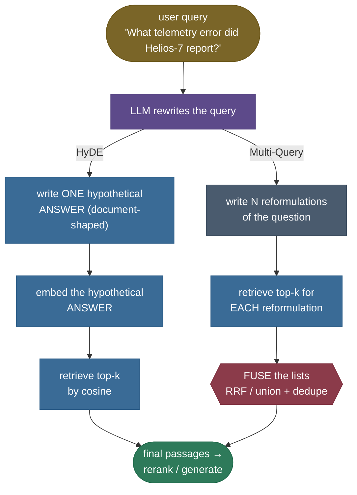

# Query Transformation: fix the question before you retrieve

Ask your RAG system *"How long does Helios-7 take to circle the Earth once?"* The answer is sitting right there in the corpus — *"Helios-7 completes one orbit of Earth every 97 minutes in a sun-synchronous orbit."* — and yet the two share almost no words. Now ask *"What telemetry error did Helios-7 report?"* and watch the dense retriever hand back a chatty passage that is *about* errors and shove the line that literally says **"Error E-4011"** down to second place. Both times the retriever did its honest best, and both times the **raw query was a bad probe**. It was short, it was phrased as a *question*, and questions live in a different neighbourhood of the embedding space than the *answer passages* that hold their answers.

That last sentence is the whole chapter. A bi-encoder ([chapter 3](../03-Embedding-Models-for-Retrieval/03-Embedding-Models-for-Retrieval.md)) ranks passages by **overall similarity to whatever you embed** — and what you embed, the bare question, is systematically *unlike* its own answer. This is the **question ↔ document asymmetry**, and it is the reason a perfectly good corpus can still return the wrong passage. **Query transformation** is the fix the retrieval world converged on: don't retrieve with the raw question — first **rewrite it into something shaped like the answer**, then retrieve with *that*.

I'm going to build this the way I'd explain it to a teammate whose vector search keeps missing the obvious passage. We'll *feel* the asymmetry on real embeddings first (measure how far a question sits from its own answer), then the two transforms that fix it — **HyDE** (write a hypothetical answer, retrieve with *its* embedding) and **Multi-Query** (fan the query into N reformulations, retrieve each, fuse the union) — then the math each rests on (derived, not dropped), a from-scratch demo where **every number is measured on a real encoder**, the traps that bite in production (starting with HyDE hallucination), and exactly when transforming *hurts*. By the end you'll be able to:

- explain the **question ↔ answer asymmetry** and *why* a raw question is a weak retrieval probe;
- derive **HyDE** — retrieve with a *hypothetical answer's* embedding — and answer the killer follow-up (*"what if the hypothetical is wrong?"*);
- derive **Multi-Query** union recall $P(\ge 1\text{ hit}) = 1-\prod_i(1-p_i)$ and say why the independence in it is *optimistic*;
- reuse **RRF** ([chapter 5](../05-Hybrid-Search-BM25-and-Dense/05-Hybrid-Search-BM25-and-Dense.md)) to fuse the reformulations' lists;
- name the failure modes — **hallucinated hypotheticals, extra LLM latency, over-expansion drift, dedup** — and when to *skip* transformation entirely;
- map it to the real libraries (LlamaIndex `HyDEQueryTransform`, LangChain `MultiQueryRetriever`, RAG-Fusion).

> **Note:** query transformation is a **retrieval-side** upgrade. It changes **what you embed and search with**, nothing about the index, the encoder, or the generator. That is exactly why it's a drop-in: no re-embedding your corpus, no new model on the retrieval path. The cost it *does* add — an extra LLM call to write the transform — is the thing the pitfalls section makes you pay attention to.

> **Honesty up front (it matters for every number below):** HyDE and Multi-Query both need a **generative LLM** to write the hypothetical answer / the reformulations. This chapter's runnable code is **encoder-only** (sentence-transformers, no generative model), so we do **not** fake an LLM. The **retrieval is 100% real and measured** — the same learned bi-encoder (`all-MiniLM-L6-v2`) chapters 3 and 5 use, over [chapter 1's](../01-RAG-Fundamentals/01-RAG-Fundamentals.md) corpus — and the **generation step is shown with a few fixed, clearly-labelled exemplars** standing in for what an LLM would produce. Every cosine, rank, recall, and MRR number on this page prints in an executed [notebook](code/07-Query-Transformation-HyDE-Multi-Query.ipynb) cell. The retrieval improvement is real; only the *text* of the hypotheticals and paraphrases is hand-authored rather than LLM-generated. Where a number is illustrative (a figure's curve on a "harder corpus"), it says so.

---

## The problem: a question is a bad probe for its own answer

To feel why transformation exists, measure the gap it closes. We reuse [chapter 1's](../01-RAG-Fundamentals/01-RAG-Fundamentals.md) Helios-7 corpus plus [chapter 5's](../05-Hybrid-Search-BM25-and-Dense/05-Hybrid-Search-BM25-and-Dense.md) three blind-spot passages (11 passages total), and the same `all-MiniLM-L6-v2` bi-encoder. Take the exact-code probe — *"What telemetry error did Helios-7 report?"* — and its gold answer `doc[8]`: *"Error E-4011 appeared in the Helios-7 telemetry stream."* Embed both and measure their cosine:

```
cos(question, gold answer)     = 0.761
```

0.761 is *positive* — they're clearly related — but it's not high enough to guarantee the gold beats every distractor. And it doesn't: the chatty same-topic line `doc[10]` ("...investigating several telemetry errors and console warnings") is *more* "about errors" overall, so the raw question ranks it **#1** and the passage that literally holds the answer **#2**:

```
RAW  query top-3 ids [10, 8, 0]   gold rank #2
```

In a pipeline that feeds the **#1** result to the generator (or to a reranker that trusts rank order), the exact-code answer just lost — not because the corpus lacked it, but because *the question was the wrong thing to search with*.

**Why does a question sit so far from its answer?** Because they are different *kinds of text*. A question is short, interrogative, and often uses the asker's vocabulary ("circle the Earth", "gain height", "telemetry error"); the answer is a declarative statement in the *document's* vocabulary ("completes one orbit", "rose skyward", "E-4011"). A bi-encoder trained to place *semantically similar text* nearby will place two *questions* near each other and two *answers* near each other — but a question and its answer are only as near as their surface forms allow. That is the **question ↔ document asymmetry**, and you can see it directly in the geometry:

![The question≠answer gap, drawn in 2D. Every corpus passage (slate) plus the gold answer (green star), the raw question (blue), and the HyDE hypothetical answer (amber diamond), projected from the real 384-dim all-MiniLM embeddings by PCA. The raw question sits far up-and-right from its gold answer (cos 0.761), while the hypothetical answer lands right on top of the gold cluster (cos 0.938). The axes are principal components (not interpretable units); the geometry — who is near whom — is faithful. Generated by `code/make_figures_07.py`.](../images/rag07_asymmetry_2d.png)

Look at where the blue dot (the raw question) sits versus the green star (its answer): they're in different regions. The amber diamond — a *hypothetical answer* to the same question — is practically on top of the star. That jump is the entire idea of HyDE, and we're about to make it.

---

## Intuition first: rewrite the query into the answer's form

Here is the mental model, and it holds up under questioning.

**You are looking for a specific book in a library, and you can only find books by handing the librarian a slip of paper — she'll fetch whatever is written most like your slip.** If you write your *question* on the slip ("how long to circle the Earth?"), she brings back books that *sound like questions about orbits* — close, but she's matching your phrasing, not the book's. Now instead you write a **guess at the answer** on the slip ("it orbits roughly every hour and a half in a sun-synchronous orbit") — a sentence shaped like a *passage*. Suddenly she's matching passage-to-passage, and she walks straight to the shelf that holds the real answer. **You didn't change the library or the librarian. You changed the slip.** That's HyDE.

The two transforms are two ways of writing a better slip:

- **HyDE** (Hypothetical Document Embeddings) — hand the LLM the question and ask it to *write the answer it thinks is true*. Retrieve using **that hypothetical answer's embedding** instead of the question's. The hypothetical lives in answer-space, so it lands near the real answer.
- **Multi-Query** — hand the LLM the question and ask for **N different rephrasings** of it. Retrieve with each, then **fuse the lists** into one. Each rephrasing covers a slightly different slice of vocabulary, so the union catches passages any single phrasing would miss. (A cousin, **query decomposition**, splits a *complex multi-part* question into sub-questions and retrieves for each — the same "one query becomes several" move, aimed at multi-hop questions.)

Now push on the analogy where it bends — that's where it teaches:

- **"What if my guessed answer is *wrong*?"** This is *the* HyDE question, and the answer is beautiful: **it usually still works.** You retrieve with the hypothetical's embedding, and the dense encoder is a **lossy bottleneck** — it keeps the *topical relevance pattern* ("this is about Helios-7's orbital period") and discards the fabricated *specifics* ("every 250 minutes"). So a wrong-but-on-topic hypothetical still lands in the right neighbourhood. We *measure* exactly this below — including the honest case where a wrong hypothetical's raw cosine dips slightly, yet the gold still ranks #1. HyDE's own paper puts it precisely: the encoder's "dense bottleneck filters out the incorrect details."
- **"What if the rephrasings all say the same thing?"** Then Multi-Query buys you nothing — the union of identical lists is one list. The value comes from **diversity**: the reformulations must genuinely cover different words/facets. Over-expand into near-duplicates and you pay N× the retrieval cost for ≈1× the recall. This is why the recall math below is *optimistic* and the pitfalls section flags **over-expansion drift**.
- **"Why not just embed the question better?"** You can (that's what a stronger encoder or asymmetric prefixes do — [chapter 3](../03-Embedding-Models-for-Retrieval/03-Embedding-Models-for-Retrieval.md)), and it helps. But no encoder can guarantee a *question* out-similars its *answer* against every distractor, because it ranks by overall similarity, not by "is this the answer to this question?" Transformation sidesteps the asymmetry by making the probe *be* answer-shaped in the first place.

The mapping to the mechanism is exact: **the slip is the retrieval probe; HyDE rewrites the slip as a hypothetical answer; Multi-Query writes several slips and merges what each fetches; the librarian is the unchanged bi-encoder + index.** Hold that picture — the rest is the engineering.

![Animated — the HyDE jump. The raw question (blue) sits far from its gold answer (green star) in question-space; the LLM rewrites it as a hypothetical answer and the retrieval probe *travels* across the embedding space (amber trail) to land in the gold's neighbourhood, and the gold's retrieval rank snaps from #2 to #1. The two endpoints are real all-MiniLM embeddings (PCA-2D) with the chapter's measured cosines (0.761→0.938); only the travel between is interpolated. Generated by `code/make_animation_07.py`.](../images/rag07_hyde_jump.gif)

---

## The mechanism: transform, then retrieve (then fuse)

Both transforms share one shape — **insert an LLM step *before* retrieval** — and differ only in what that step produces and whether a fusion step follows.



Stage by stage:

1. **Transform (the LLM step).** For HyDE, prompt the LLM to *answer* the query — even if it must guess — producing one document-shaped hypothetical. For Multi-Query, prompt it to produce N alternative phrasings of the query. This is the only new call on the path, and its cost is the recurring theme of the pitfalls.
2. **Retrieve.** HyDE embeds the **hypothetical answer** and does one ordinary top-k search — identical machinery to a normal query, just a different input vector. Multi-Query runs **one search per reformulation**, yielding N ranked lists.
3. **Fuse (Multi-Query only).** Combine the N lists into one. The robust default is **Reciprocal Rank Fusion** — the exact rank-based fusion [chapter 5](../05-Hybrid-Search-BM25-and-Dense/05-Hybrid-Search-BM25-and-Dense.md) built — which needs no score normalization and rewards a passage ranked high by *any* reformulation. Dedupe (the same passage retrieved by several reformulations must count once), then keep the final top-k.
4. **Downstream is unchanged.** The final passages go to a [reranker](../06-Re-ranking-Cross-Encoders/06-Re-ranking-Cross-Encoders.md) or straight into the [augmented prompt](../01-RAG-Fundamentals/01-RAG-Fundamentals.md). Transformation slots in *ahead* of everything else in the stack.

> **Note:** HyDE and Multi-Query **compose** — and with hybrid search too. **RAG-Fusion** is literally "Multi-Query + RRF." You can run HyDE to write a hypothetical, then Multi-Query to diversify it, then hybrid ([chapter 5](../05-Hybrid-Search-BM25-and-Dense/05-Hybrid-Search-BM25-and-Dense.md)) on each, then RRF the whole pile. Each stage is another LLM call and another fan-out, so you trade latency and cost for recall — the engineering judgment the last two sections sharpen.

---

## The math, part 1: HyDE — embed the answer, not the question

HyDE's formula is almost embarrassingly simple, which is the point. Let $E(\cdot)$ be the bi-encoder that maps text to a unit-norm vector, $q$ the query, $d^\star$ the gold answer passage, and $D = \{d_1,\dots,d_M\}$ the corpus. Ordinary dense retrieval scores each passage by

$$
s_{\text{raw}}(d) \;=\; \cos\!\big(E(q),\, E(d)\big) \;=\; E(q)\cdot E(d),
$$

(the dot product because the vectors are unit-norm — [chapter 3's](../03-Embedding-Models-for-Retrieval/03-Embedding-Models-for-Retrieval.md) geometry), and returns the top-k. **HyDE changes exactly one thing:** it first has an LLM $G$ generate a hypothetical answer $h = G(q)$, then scores with $E(h)$ in place of $E(q)$:

$$
s_{\text{HyDE}}(d) \;=\; \cos\!\big(E(h),\, E(d)\big), \qquad h = G(q).
$$

Define every symbol: $q$ the raw question, $h$ the LLM's hypothetical answer (a *document*, not a question), $E(h)$ its embedding, $E(d)$ each passage's embedding, $\cos$ the cosine (dot product on unit vectors). The bet HyDE makes is a single inequality about the **gold** passage $d^\star$:

$$
\boxed{\;\cos\!\big(E(h),\,E(d^\star)\big)\;>\;\cos\!\big(E(q),\,E(d^\star)\big)\;}
$$

— *the hypothetical answer is closer to the gold than the raw question is.* If that holds, the gold gets a higher score and climbs the ranking. It holds because $h$ is written in answer-space, where $d^\star$ also lives. On our two probes, **measured on the real encoder**:

| probe | $\cos(\text{question}, \text{gold})$ | $\cos(\text{HyDE}, \text{gold})$ | lift |
|---|---:|---:|---:|
| orbit | 0.736 | 0.927 | **+0.191** |
| exact-code | 0.761 | 0.938 | **+0.177** |

The boxed inequality is satisfied on both — by a wide margin — and it flips the exact-code probe's gold from rank #2 to **#1**. Every one of these numbers prints in the [notebook](code/07-Query-Transformation-HyDE-Multi-Query.ipynb).

> *Where this comes from: HyDE is **Gao, Ma, Lin & Callan, "Precise Zero-Shot Dense Retrieval without Relevance Labels" (2022, [arXiv:2212.10496](https://arxiv.org/abs/2212.10496))**. Their pipeline is exactly the two lines above — instruct an LLM to "generate a hypothetical document [that] captures relevance patterns but is unreal and may contain false details," then encode it and retrieve — and their key claim is that "the encoder's dense bottleneck filters out the incorrect details." The closely related **query2doc (Wang, Yang & Wei, 2023, [arXiv:2303.07678](https://arxiv.org/abs/2303.07678))** *appends* the LLM's pseudo-document to the query rather than replacing it, and reports +3–15% for BM25. Both sources are in the [references](07-Query-Transformation-HyDE-Multi-Query.references.md).*

![The HyDE pipeline and its measured payoff. Left: the four stages — user question (question-space) → LLM writes a hypothetical answer (answer-space) → embed the answer, not the question → retrieve by cosine. Right: the chapter's own measured cosines — cos(question, gold) vs cos(HyDE, gold) — for both probes, showing the hypothetical answer embeds far nearer the gold (0.736→0.927 and 0.761→0.938). The "generation shown with fixed exemplars" caption is the honesty note: an LLM writes the hypothetical in production. Generated by `code/make_figures_07.py`.](../images/rag07_hyde_pipeline.png)

---

## The math, part 2: Multi-Query — union recall, and why independence lies

Multi-Query's math is about **recall**, not similarity. Suppose reformulation $i$ retrieves the gold within the top-k with probability $p_i$ (its per-query recall@k). We retrieve with all N reformulations and take the **union** of their results, so the gold is found if *any* one of them finds it. If the reformulations' successes were **independent**, the union recall is

$$
P(\ge 1 \text{ hit}) \;=\; 1 - \prod_{i=1}^{N} (1 - p_i).
$$

Read it: $\prod_i(1-p_i)$ is the probability that **every** reformulation *misses*; one minus that is the probability at least one hits. With equal $p_i = p$ it simplifies to the familiar $1-(1-p)^N$, which climbs toward 1 fast — e.g. at $p=0.55$, a single query recalls 55%, but the union of $N=3$ reaches $1-0.45^3 \approx 0.91$.

**But that independence assumption is optimistic, and you must say so.** Reformulations of the *same* question **share its meaning**, so their retrievals are correlated — when one paraphrase misses the gold (because the gold is phrased oddly), the others tend to miss it too. Correlated failures co-occur, so real union recall sits **below** the independence curve. The gap between them is the price of correlation, and it's exactly why "just generate 20 paraphrases" hits diminishing returns:

![Multi-Query union recall vs N. The green curve is the independent ceiling 1−(1−p)^N (here p=0.55, illustrative); the amber curve is a correlated model (ρ=0.5) that lags it because paraphrases share meaning and their misses co-occur — the shaded band is the cost of correlation. The dotted line is a single query's recall (p=0.55). On this chapter's tiny 11-doc corpus each reformulation already hits (p̂=1.00 → union=1.00, recall saturated), so the curves show the *law* on a harder corpus with p and ρ illustrative — labelled as such. Generated by `code/make_figures_07.py`.](../images/rag07_union_recall.png)

> *Where this comes from: the union-recall identity $1-\prod_i(1-p_i)$ is the elementary probability of a union of events (the complement of "all miss"); the independence caveat is standard. The Multi-Query **retriever** pattern is popularized by **LangChain's `MultiQueryRetriever`** (generate several phrasings, retrieve each, return the **unique union**), and the **RAG-Fusion** variant adds RRF on top. Both are in the [references](07-Query-Transformation-HyDE-Multi-Query.references.md).*

### Fusing the lists: RRF, reused

Taking a bare *union* throws away the ranking signal — a passage that was rank-1 for two reformulations should beat one that was rank-8 for one. So we fuse with **Reciprocal Rank Fusion** (Cormack, Clarke & Büttcher, 2009), the same rank-based fusion [chapter 5](../05-Hybrid-Search-BM25-and-Dense/05-Hybrid-Search-BM25-and-Dense.md) built. For a passage $d$ appearing at rank $r_i(d)$ in reformulation $i$'s list, its fused score is

$$
\text{RRF}(d) \;=\; \sum_{i=1}^{N} \frac{1}{k + r_i(d)}, \qquad k = 60.
$$

RRF ignores raw scores (so there's no cross-list scale mismatch to normalize) and rewards being ranked high by *any* reformulation; the constant $k=60$ damps deep ranks so being #1 in one list beats being #50 in several. On this chapter's three reformulations, all of which rank the gold `doc[1]` at #1, RRF locks it at #1:

![RRF over the chapter's three reformulations. Left: the RRF weight 1/(k+rank) by rank for k=10/60/200 — being #1 is worth far more than #5, and larger k flattens the curve. Right: a worked fusion of the three reformulations' actual top-5 rankings (real numbers from this chapter's encoder) into one order; the gold doc[1] (green) is ranked #1 by every reformulation, so RRF fuses it to #1 (score 0.0492). Generated by `code/make_figures_07.py`.](../images/rag07_rrf_fusion.png)

> *Where this comes from: **Cormack, Clarke & Büttcher, "Reciprocal Rank Fusion outperforms Condorcet and individual Rank Learning Methods" (SIGIR 2009, [DOI:10.1145/1571941.1572114](https://doi.org/10.1145/1571941.1572114))** — the $k=60$ default and the "high in any list wins" behaviour are theirs, worked through in full in [chapter 5](../05-Hybrid-Search-BM25-and-Dense/05-Hybrid-Search-BM25-and-Dense.md). Source in the [references](07-Query-Transformation-HyDE-Multi-Query.references.md).*

---

## Code: measure the transform on a real encoder

Here's the honest experiment. The retrieval, encoder, and metrics are **real** — the `all-MiniLM-L6-v2` bi-encoder and the RRF/MRR/recall machinery imported straight from [chapter 5](../05-Hybrid-Search-BM25-and-Dense/05-Hybrid-Search-BM25-and-Dense.md) (which imports [chapter 1's](../01-RAG-Fundamentals/01-RAG-Fundamentals.md) corpus). The **generation is represented by fixed, labelled exemplars** standing in for an LLM. It runs on CPU in a couple of seconds.

> **Runnable project and a step-by-step notebook:** the same verified code lives as a clean script and an executed teaching notebook next to this page — see the [step-by-step teaching notebook](code/07-Query-Transformation-HyDE-Multi-Query.ipynb) and the [runnable demo script](code/query_transformation.py) (run it with `python query_transformation.py`).

**HyDE from scratch — the only change is *what gets embedded*.** Note the fixed hypothetical answers are marked as LLM stand-ins:

```python
"""HyDE from scratch: retrieve with a hypothetical ANSWER's embedding, not the question's.
Retrieval/encoder are REAL and measured; the hypothetical answer is a FIXED exemplar standing in
for an LLM's generation (this env is encoder-only). Verified on Python 3.12 / sentence-transformers."""
from hybrid_search import DenseRetriever, full_corpus   # ch5's real bi-encoder + ch1's corpus
from query_transformation import cosine_to_gold          # cos(text, gold passage) under the encoder

corpus = full_corpus()                                  # 11 passages (ch1 + ch5 blind-spot lines)
dense = DenseRetriever(corpus)                           # all-MiniLM-L6-v2, unit-norm, cosine=dot

query = "What telemetry error did Helios-7 report?"      # the raw question (question-space)
gold  = next(i for i, d in enumerate(corpus) if "E-4011" in d)

# In production an LLM writes this from `query`. Here it is a FIXED exemplar (document-shaped answer):
hypothetical = ("Helios-7 reported telemetry error E-4011, which appeared in its telemetry "
                "stream during operations.")

# The ONLY difference between raw retrieval and HyDE is the text we embed to search with:
raw_hits  = dense.search(query,        k=3).indices      # embed the QUESTION
hyde_hits = dense.search(hypothetical, k=3).indices      # embed the hypothetical ANSWER

# Assert BEFORE claiming: HyDE must move the probe closer to the gold and lift its rank.
cos_q = cosine_to_gold(dense, corpus, query, gold)
cos_h = cosine_to_gold(dense, corpus, hypothetical, gold)
assert cos_h > cos_q, "the hypothetical answer must embed closer to the gold than the question"
print(f"cos(question,gold)={cos_q:.3f}  cos(HyDE,gold)={cos_h:.3f}")
print(f"RAW  top-3 {list(raw_hits)}  gold rank {list(raw_hits).index(gold)+1 if gold in raw_hits else 'MISS'}")
print(f"HyDE top-3 {list(hyde_hits)}  gold rank {list(hyde_hits).index(gold)+1 if gold in hyde_hits else 'MISS'}")
```

Output (from the executed notebook):

```
cos(question,gold)=0.761  cos(HyDE,gold)=0.938
RAW  top-3 [10, 8, 0]  gold rank 2
HyDE top-3 [8, 10, 0]  gold rank 1
```

The hypothetical answer's embedding is **+0.177** closer to the gold, and that's enough to promote the gold past the chatty distractor `doc[10]` — from **#2 to #1**.

**Multi-Query from scratch — retrieve each reformulation, fuse with RRF.** Same encoder, N probes, one fused list:

```python
"""Multi-Query from scratch: fan into N reformulations, retrieve each, fuse with RRF (ch5).
Reformulations are FIXED exemplars standing in for an LLM's generation; retrieval is real."""
from hybrid_search import DenseRetriever, full_corpus, reciprocal_rank_fusion, recall_at_k

corpus = full_corpus()
dense  = DenseRetriever(corpus)
gold   = next(i for i, d in enumerate(corpus) if "hyperspectral" in d)

query = "What's the deal with Helios-7's imaging?"       # vague — a weak probe on its own
# In production an LLM writes these from `query`; here they are FIXED exemplars, each a facet:
reformulations = (
    "What is the ground resolution of the Helios-7 imager?",
    "What type of imaging sensor does Helios-7 carry?",
    "How detailed are the images Helios-7 captures of the ground?",
)
all_queries = (query, *reformulations)

# Retrieve every reformulation, then fuse the ranked lists with RRF (rank-based, no normalization).
score_lists = [dense.all_scores(q) for q in all_queries]  # one score vector per reformulation
fused = reciprocal_rank_fusion(score_lists, k_rrf=60, k=3).indices

raw = dense.search(query, k=3).indices
assert recall_at_k(fused, gold) >= recall_at_k(raw, gold)   # fusing must not lose the gold
print(f"RAW (vague) top-3 {list(raw)}   gold rank {list(raw).index(gold)+1 if gold in raw else 'MISS'}")
print(f"MULTI-QUERY  top-3 {list(fused)}   gold rank {list(fused).index(gold)+1 if gold in fused else 'MISS'}")
```

Output:

```
RAW (vague) top-3 [10, 1, 2]   gold rank 2
MULTI-QUERY  top-3 [1, 10, 2]   gold rank 1
```

The vague raw query ranks the gold #2; each sharper reformulation ranks it #1, and RRF fuses them so the gold takes **#1** overall.

**The payoff, aggregated (measured, asserted before claimed).** Over each transform's probe set, MRR before vs after:

| method | MRR | recall@3 |
|---|---:|---:|
| raw query (HyDE probe set) | 0.750 | 1.000 |
| **HyDE** (HyDE probe set) | **1.000** | 1.000 |
| raw query (Multi-Query probe) | 0.500 | 1.000 |
| **Multi-Query** (Multi-Query probe) | **1.000** | 1.000 |


> **Note (read the recall column honestly):** recall@3 is **1.000 everywhere** because the corpus is *tiny* — the top-3 of 11 passages almost always contains the gold, so recall can't fall. On this corpus the **MRR** carries the signal: it captures the *rank* improvement (gold from #2→#1) that recall@3 is too coarse to see. On a realistically large corpus recall@k would drop and the union-recall gain would show there too — which is exactly the law the `rag07_union_recall.png` figure plots. Don't over-read a saturated metric; read the one that moves.

**The library one-liners.** In production you don't hand-roll either transform — but note the honesty flag: **both require a generative LLM**, so they won't run in this encoder-only environment. LlamaIndex wraps HyDE:

```python
# LlamaIndex — HyDE. REQUIRES a generative LLM (the default is configured via Settings.llm).
from llama_index.core import VectorStoreIndex, SimpleDirectoryReader
from llama_index.core.indices.query.query_transform.base import HyDEQueryTransform
from llama_index.core.query_engine import TransformQueryEngine

index = VectorStoreIndex.from_documents(SimpleDirectoryReader("./data").load_data())
hyde = HyDEQueryTransform(include_original=True)                 # keep the raw query too, then add HyDE
engine = TransformQueryEngine(index.as_query_engine(), query_transform=hyde)
response = engine.query("What telemetry error did Helios-7 report?")
```

LangChain wraps Multi-Query:

```python
# LangChain — Multi-Query. REQUIRES an LLM to generate the reformulations.
from langchain.retrievers.multi_query import MultiQueryRetriever

# from_llm's default prompt asks the LLM for 3 alternative versions of the question, retrieves each,
# and returns the UNIQUE UNION of all retrieved docs (include_original=False by default).
retriever = MultiQueryRetriever.from_llm(retriever=base_retriever, llm=chat_llm)
docs = retriever.invoke("What's the deal with Helios-7's imaging?")
```

Both hide exactly the transform-then-retrieve(-then-fuse) pipeline we built by hand — `HyDEQueryTransform(include_original=True)` embeds the hypothetical (optionally alongside the original), and `MultiQueryRetriever.from_llm`'s default prompt generates **3** reformulations and returns their **unique union**.

---

## Pitfalls and failure modes

Every one of these bites a real production system. Each is named, shown failing, then fixed.

**1. HyDE hallucination — a wrong hypothetical retrieving the wrong neighbourhood.** This is the pitfall everyone worries about, and the reality is more nuanced than "wrong answer → wrong retrieval." We hand HyDE a *deliberately wrong* hypothetical (right topic, fabricated specifics — e.g. "error E-9999" instead of E-4011) and measure:

```
PROBE [orbit]        cos(HyDE-good,gold)=0.927   cos(HyDE-WRONG,gold)=0.832   wrong>question? yes   gold rank #1
PROBE [exact-code]   cos(HyDE-good,gold)=0.938   cos(HyDE-WRONG,gold)=0.750   wrong>question? no    gold rank #1
```

Two lessons, both measured. First, **the wrong hypothetical is always worse than the good one** (0.832 < 0.927; 0.750 < 0.938) — fabrication *has a cost*. Second, and this is the subtle honest bit: on the exact-code probe the wrong hypothetical's cosine (0.750) actually dips **just below** the raw question's (0.761) — yet the gold **still ranks #1**. Why? Because retrieval acts on the *ordering of the whole corpus*, not on the gold's absolute cosine: the wrong hypothetical is still more answer-shaped than the question, so it out-ranks the distractors even though its cosine to the gold slipped. The dense encoder's bottleneck kept the *topical neighbourhood* and dropped the fabricated "E-9999" — exactly HyDE's design claim. *When it does bite:* if the hypothetical drifts to the **wrong topic** entirely (the LLM misreads an ambiguous query), it retrieves a wrong-but-coherent neighbourhood and the answer is confidently wrong. *Fixes:* keep the original query in the mix (`include_original=True`), retrieve with **both** the question and the hypothetical and fuse (so a bad hypothetical can't fully hijack the result), and always put a **reranker** ([chapter 6](../06-Re-ranking-Cross-Encoders/06-Re-ranking-Cross-Encoders.md)) after — it re-scores query-against-passage and catches a topically-plausible-but-wrong retrieval.

**2. The extra LLM call — latency and cost you didn't have.** Every transformed query now runs an LLM *before* retrieval even starts. HyDE adds one generation (often longer than the answer itself); Multi-Query adds one generation *plus* N searches *plus* fusion. *Failing:* a p95 latency budget that was fine for pure vector search blows past its SLA once every query waits on a 400-token hypothetical. *Fixes:* generate the transform with a **small, fast** model (you need a *plausible* hypothetical, not a correct essay); **cache** transforms for repeated/similar queries; run the N Multi-Query searches **concurrently**; and **gate** transformation — only transform queries a cheap classifier flags as vague or paraphrase-prone (pitfall 5).

**3. Multi-Query dedup — the same passage counted N times.** When several reformulations retrieve the same passage, a naive union lists it multiple times, wasting top-k slots and skewing any downstream count. *Failing:* your "top-10" is really "top-4 distinct passages, one of them four times." *Fixes:* **deduplicate by document id** before returning (LangChain's `MultiQueryRetriever` returns the *unique* union for this reason), and prefer **RRF**, which sums a passage's contributions across lists into one fused entry rather than repeating it.

**4. Over-expansion drift — too many reformulations, watered down.** Push N high and the LLM starts producing paraphrases that drift *off* the original intent ("Helios-7 imaging" → "satellite photography history"), pulling in on-topic-sounding but irrelevant passages that dilute the fused ranking. *Failing:* recall stops climbing (the union-recall curve flattens — correlation) while **precision falls** as drifted reformulations inject noise. *Fixes:* keep N **small** (3–5 is the common sweet spot; LangChain defaults to 3), constrain the generation prompt to *rephrase, don't reinterpret*, and let **RRF's** $k$ and a final **reranker** suppress the noise a drifted reformulation adds.

**5. When transformation *hurts* — the already-precise query.** Transformation exists to fix *weak* probes. Hand it a query that's already an excellent probe — a keyword query, an exact code, a precisely-worded question the raw retriever nails at #1 — and a HyDE detour can only **add latency and a chance of drift**, never recall. Measured on a precise query:

```
precise query: "Helios-7 hyperspectral imager ground resolution 4 meters"
RAW top-3 ids [1, 0, 9]   gold rank #1     cos(precise query, gold) = 0.932
```

The raw query already scores 0.932 and ranks the gold **#1** — there is nothing to fix, and a hypothetical could only move it. *Rule:* **skip transformation for exact-keyword, code, and already-precise queries;** reach for it on **short, vague, or vocabulary-mismatched** ones. Lexical/hybrid search ([chapter 5](../05-Hybrid-Search-BM25-and-Dense/05-Hybrid-Search-BM25-and-Dense.md)) already handles exact tokens — transformation is for the semantic-gap cases.

---

## Where it's used, and when to reach for it

**Used:** query transformation is a standard advanced-RAG layer, shipped in every major framework.

- **LlamaIndex** — `HyDEQueryTransform` (with `TransformQueryEngine`) implements HyDE directly; `include_original=True` retrieves with both the question and the hypothetical.
- **LangChain** — `MultiQueryRetriever.from_llm(...)` generates (by default) **3** reformulations and returns the **unique union**; its default prompt frames the goal as overcoming "the limitations of distance-based similarity search." Community **RAG-Fusion** implementations add RRF on top.
- **RAG-Fusion** — the popular pattern that *is* Multi-Query + RRF, now a common default in production RAG stacks and vector-DB tutorials.
- **Query decomposition** — for **multi-hop** questions ("Compare the orbit of Helios-7 with its imager resolution"), an LLM splits the query into sub-questions, retrieves for each, and the generator composes the answer — the same "one query → several" move, used by agentic and multi-hop RAG ([chapter 10](../10-Agentic-RAG/10-Agentic-RAG.md)).

**When to reach for it vs skip it:**

| Situation | Reach for | Why |
|---|---|---|
| Short, vague, or paraphrase-heavy queries | **HyDE / Multi-Query** | the raw probe is weak; transformation closes the asymmetry |
| Vocabulary mismatch (query words ≠ doc words) | **HyDE** | the hypothetical answer speaks the document's vocabulary |
| One query with several facets / multi-hop | **Multi-Query / decomposition** | union covers facets a single probe misses |
| Exact codes, keywords, IDs | **skip** → hybrid/BM25 ([ch5](../05-Hybrid-Search-BM25-and-Dense/05-Hybrid-Search-BM25-and-Dense.md)) | lexical nails exact tokens; a hypothetical can only blur them |
| Already-precise queries retriever nails at #1 | **skip** | nothing to fix; transform adds latency + drift risk |
| Tight latency / cost budget | **gate or skip** | every transform is an extra LLM call on the hot path |

> **Note:** transformation and the rest of the stack **compose, and each attacks a different failure**. Hybrid search fixes *exact-token* misses; reranking fixes *ordering* of a good candidate set; query transformation fixes a *bad probe* before retrieval even runs. A mature pipeline often does all three: transform the query → hybrid-retrieve a large pool → RRF/union → **rerank** the top → generate. The chapters build that stack piece by piece.

---

## In production: verified specs and numbers

Grounding the levers in what the tools actually do:

- **HyDE (the paper).** Gao et al. (2022) report HyDE **significantly outperforms** the unsupervised dense retriever Contriever and is **comparable to fine-tuned retrievers** across web search, QA, and fact verification, and across languages (Swahili, Korean, Japanese) — *without any relevance labels*. The mechanism they credit is the encoder's "dense bottleneck [that] filters out the incorrect details" of the hypothetical.
- **query2doc (the append variant).** Wang et al. (2023) report their pseudo-document expansion **boosts BM25 by 3% to 15%** on MS-MARCO and TREC DL, and also helps state-of-the-art dense retrievers — *without model fine-tuning*. The difference from HyDE: query2doc **concatenates** the generated pseudo-document to the query (helping lexical *and* dense), where HyDE **replaces** the query embedding (dense only).
- **LangChain `MultiQueryRetriever`.** Verified against the source: `from_llm(retriever, llm, include_original=False)`; the `DEFAULT_QUERY_PROMPT` instructs the LLM to "generate **3** different versions of the given user question"; `_get_relevant_documents` retrieves for each and returns the **unique union** (`include_original=True` appends the original query to the generated set).
- **LlamaIndex `HyDEQueryTransform`.** Verified against the docs: constructed as `HyDEQueryTransform(include_original=True)` and applied via `TransformQueryEngine(query_engine, query_transform=hyde)`; the transform generates a hypothetical document and uses **its** embedding for the lookup.
- **RRF default.** $k=60$, from Cormack et al. (2009) — the same constant [chapter 5](../05-Hybrid-Search-BM25-and-Dense/05-Hybrid-Search-BM25-and-Dense.md) and Elasticsearch's RRF use.

The one production number to carry: **transformation trades an extra LLM call for higher recall on weak queries.** On a 400-token hypothetical with a fast model that's tens to low-hundreds of milliseconds and a few hundred tokens of cost *per query* — cheap when it rescues a retrieval, wasteful when the query didn't need it. That trade — *is this query weak enough to be worth transforming?* — is the whole operational decision.

---

## Recap and rapid-fire

**If you remember nothing else:** a raw question is a poor retrieval probe because it lives in *question-space*, systematically far from the *answer passages* it's looking for (the question ↔ document asymmetry — we measured cos(question, gold) ≈ 0.76 versus cos(hypothetical, gold) ≈ 0.94). **Query transformation rewrites the probe into answer-shaped text before retrieving:** HyDE writes one hypothetical *answer* and retrieves with its embedding (the encoder's bottleneck forgives wrong facts, keeping the topic); Multi-Query fans the query into N reformulations, retrieves each, and fuses the union with RRF (union recall $1-\prod_i(1-p_i)$, optimistic under correlation). It costs an extra LLM call — so **skip it for precise/keyword queries** and reach for it on **vague, paraphrase-prone** ones.

**Quick-fire — say these out loud:**

- *Why is a raw question a bad probe?* It embeds in question-space, far from its answer passage — the question↔document asymmetry.
- *What does HyDE embed?* A hypothetical **answer** to the query, not the query — it lives in answer-space, near the gold.
- *What if the hypothetical is wrong?* Usually fine — the encoder's dense bottleneck keeps the topical relevance pattern and drops the fabricated specifics; a reranker + keeping the original query backstop it.
- *HyDE vs query2doc?* HyDE **replaces** the query embedding (dense only); query2doc **appends** the pseudo-doc to the query (helps BM25 *and* dense).
- *Multi-Query union recall?* $1-\prod_i(1-p_i)$; independence is optimistic because paraphrases' misses correlate.
- *How do you fuse the reformulations' lists?* RRF ($k=60$) — rank-based, no normalization, high-in-any-list wins; dedupe by id.
- *When does transformation hurt?* Exact-code/keyword/already-precise queries — it only adds latency and drift; hybrid/BM25 owns those.
- *What's RAG-Fusion?* Multi-Query + RRF.
- *Where does it sit in the stack?* Before retrieval — transform → (hybrid) retrieve → RRF/union → rerank → generate.

---

## References and further reading

The curated link library for this topic — videos, courses, articles, papers, and internal cross-links — lives in a companion file so it can be reused as a standalone reference list:

**→ [Query Transformation (HyDE & Multi-Query) — references and further reading](07-Query-Transformation-HyDE-Multi-Query.references.md)**
