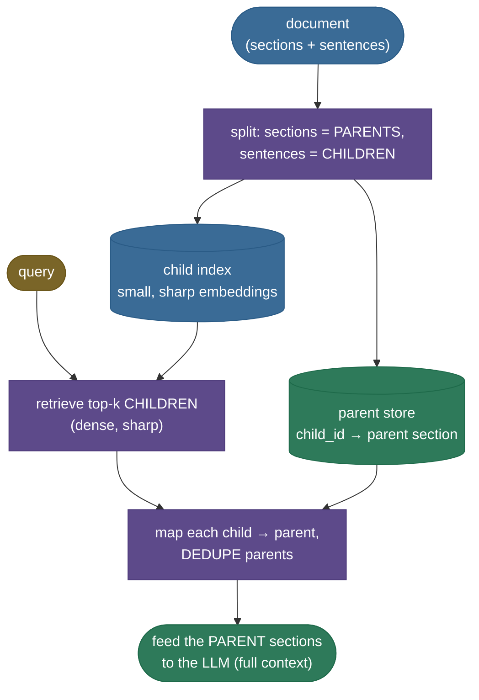
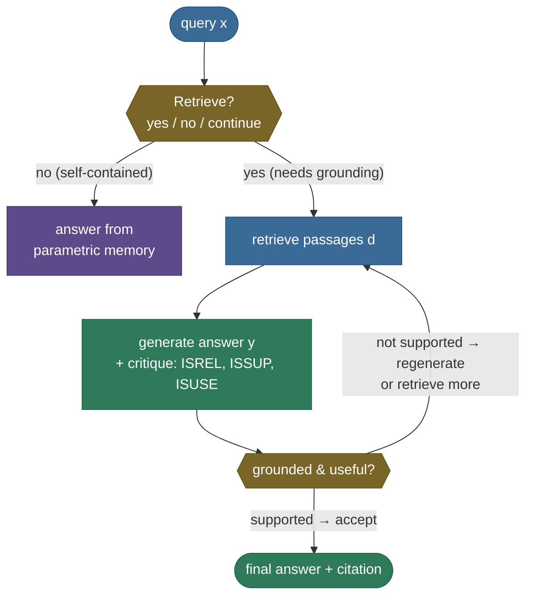

# Advanced RAG: decouple the units, then let the model check its own work

Naive RAG — embed a chunk, retrieve the top-k, stuff them in the prompt — plateaus for three structural reasons, and every "advanced RAG" technique is a fix for one of them.

The first you already felt in [chapter 2](../02-Document-Chunking-Strategies/02-Document-Chunking-Strategies.md): the **small-vs-big chunk dilemma**. Retrieve on *small* chunks and the embedding is sharp — but you hand the LLM a **context-starved fragment**. On our mission spec, the sentence that best answers *"what keeps the local solar time of each pass constant?"* is `"This orbit keeps the local solar time of each pass roughly constant for stable imaging."` — and it opens with **"This orbit"**. *Which* orbit? The referent (`sun-synchronous orbit`) is in the *previous* sentence, which the small chunk doesn't include. Retrieve on *big* chunks instead and you fix the context but blur the embedding, so retrieval gets worse. There is no chunk size that wins both.

The second you met in [chapter 7](../07-Query-Transformation-HyDE-Multi-Query/07-Query-Transformation-HyDE-Multi-Query.md): a **single query is a narrow probe**. The third is the deepest: naive RAG **always retrieves** — even for *"hello"* or *"what is 2+2?"* where retrieval can only add noise — and it **never checks** whether its own answer is actually grounded in what it retrieved. It will confidently cite a passage that doesn't support its claim.

This chapter is the three fixes, and they share one deep idea: **stop forcing one unit and one blind pass to do everything.** (1) **Parent-Document** retrieval *decouples the retrieval unit from the generation unit* — retrieve on small precise children, but feed the LLM the larger **parent**. (2) **RAG-Fusion** is [chapter 7's](../07-Query-Transformation-HyDE-Multi-Query/07-Query-Transformation-HyDE-Multi-Query.md) multi-query + RRF, named as a pattern. (3) **Self-RAG** lets the model *decide when to retrieve* and *critique its own grounding* with reflection tokens. By the end you'll be able to:

- explain the **small-vs-big dilemma** and how parent-document retrieval dissolves it (retrieve small, read large);
- build a **child→parent** index and measure the precision-vs-context tradeoff it resolves;
- recognize **RAG-Fusion** as multi-query + RRF and reuse [chapter 7's](../07-Query-Transformation-HyDE-Multi-Query/07-Query-Transformation-HyDE-Multi-Query.md) machinery;
- explain **Self-RAG's** reflection tokens (`Retrieve` / `ISREL` / `ISSUP` / `ISUSE`) and its retrieve-on-demand + self-critique loop;
- implement the two Self-RAG decisions that *are* computable with an encoder — the **retrieve-on-demand gate** and a **support check** — and know exactly where a cosine proxy stops and a *trained* critic is required;
- map it to real systems (LlamaIndex `AutoMergingRetriever` / `SentenceWindowNodeParser`, LangChain `ParentDocumentRetriever`, Self-RAG, CRAG).

> **Note:** these are all **retrieval-and-orchestration** upgrades — they change *what unit you retrieve*, *how many queries you fan out*, and *whether you trust the result*, not the embedder or the base LLM. They compose with each other and with hybrid search ([ch5](../05-Hybrid-Search-BM25-and-Dense/05-Hybrid-Search-BM25-and-Dense.md)) and reranking ([ch6](../06-Re-ranking-Cross-Encoders/06-Re-ranking-Cross-Encoders.md)).

> **Honesty up front (it governs every number below):** parent-document retrieval and RAG-Fusion are **fully implementable and measured** here on the real `all-MiniLM-L6-v2` encoder (chapters 3/5's embedder) over [chapter 2's](../02-Document-Chunking-Strategies/02-Document-Chunking-Strategies.md) Helios-7 document. **Self-RAG's true reflection tokens require a specially *trained* LLM** — this environment is encoder-only, so we do **not** fake trained `ISREL`/`ISSUP`/`ISUSE` tokens or an LLM's generated answer text. Instead we implement the two Self-RAG decisions that *are* computable with an encoder — the **retrieve-on-demand gate** and a **support check** (does the answer's claim actually match the retrieved context? — a real cosine measurement) — and represent the generated answer / critique *text* with clearly-labelled fixed exemplars. Every cosine, recall, and support score on this page prints in an executed [notebook](code/08-Advanced-RAG-Parent-Doc-Fusion-Self-RAG.ipynb) cell. **Real:** encoder, all retrieval, the support-check math. **Illustrative:** the generator's answer/critique text and the gate's hand-coded rule (a trained LM makes those decisions in production).

---

## Part 1 — Parent-Document retrieval: retrieve small, read large

### The problem, measured: a sharp retrieval that hands over a fragment

We reuse [chapter 2's](../02-Document-Chunking-Strategies/02-Document-Chunking-Strategies.md) multi-section Helios-7 spec. The natural hierarchy: each **section** (`# Orbit`, `# Instruments`, …) is a **parent**; each **sentence** in it is a **child**. Index the *children* (small, sharp embeddings) and ask *"What keeps the local solar time of each pass roughly constant?"*. The real encoder retrieves this child at #1:

```
top child hit: child[5] (cos=0.662)
  child text: 'This orbit keeps the local solar time of each pass roughly constant for stable imaging.'
referent 'sun-synchronous orbit' in the #1 child alone: False
```

The retrieval is *correct* — that sentence is the answer. But feed it to the LLM alone and the model reads *"This orbit..."* with no idea **which** orbit: the referent `sun-synchronous orbit` lives one sentence up, outside the child. This is the small-chunk failure from chapter 2, now concrete: **a precise retrieval can still deliver a context-starved fragment.**

### Intuition: index the index cards, hand over the page

Think of a **book with a good index**. The index entries are tiny and precise — *"sun-synchronous orbit, p.14"* — perfect for *finding* the right spot fast. But you don't hand someone the index *entry* and call it an answer; you turn to **page 14** and hand them the whole page, which has the sentences around the fact that make it make sense. **Parent-document retrieval is exactly that: search the precise little entries (children), but return the page (parent).** You get the sharp retrieval of a small unit *and* the context of a large one — the dilemma dissolves because the retrieval unit and the generation unit no longer have to be the same thing.

Push the analogy where it bends:

- **"What if the page (parent) is huge — a whole chapter?"** Then you're back to the big-chunk problem *for generation*: you've stuffed the prompt with mostly-irrelevant text, diluting the answer and burning tokens. So the parent must be *a section, not the book* — big enough to carry the referent, small enough to stay on-topic. (This is the "parent too large" pitfall below, and it's why LlamaIndex's hierarchy is *graded* — 2048 → 512 → 128 — not one giant parent.)
- **"What if several retrieved children live in the same section?"** Then their parents collide, and you must **dedupe** to one copy of the section (else you feed it three times). Real; handled below.


### The mechanism: a child→parent map, retrieve children, dedupe to parents



Stage by stage: **(1)** split the document so sections are parents and sentences are children, each child storing its `parent_id`; **(2)** build a dense index over the **children only** — they're what you retrieve on; **(3)** at query time, retrieve the top-k children (sharp); **(4)** map each retrieved child to its parent and **dedupe** (several children can share one parent); **(5)** feed the deduped **parent sections** to the LLM.

![The child→parent hierarchy and the retrieve-small/read-large flow. Left: every child sentence (blue) maps to its parent section (green). Right: for the demo query, the #1 child (child[5], cos 0.662, amber) is retrieved, mapped and deduped to parents [2, 1], and its parent (# Orbit) is fed to the LLM. Sharp retrieval on a small unit; full context from the larger parent. Generated by `code/make_figures_08.py`.](../images/rag08_parent_child.png)

### The mechanics, measured: precision × context

The whole value proposition is *precision of retrieval* AND *context of generation* at once. Measured on the demo query:

- **Precision (retrieval):** the top child sits in the correct **`Orbit`** section — retrieval is sharp, exactly as a small focused embedding should be.
- **Context (generation):** the child alone is **87 chars**; its parent section is **179 chars** — **2.1× more context**, and it *contains* the `sun-synchronous orbit` referent the child lacked.

```
top child's parent section: 'Orbit'   (sharp: correct section)
child delivered to LLM: 87 chars | parent delivered: 179 chars
context multiplier (parent/child): 2.1x more context, SAME sharp retrieval
```

That is the dilemma resolved in one number: **2.1× the context with no loss of retrieval sharpness.**


> **Source / derivation:** [LangChain — ParentDocumentRetriever](https://python.langchain.com/docs/how_to/parent_document_retriever/) and [LlamaIndex — Auto Merging / sentence-window retrievers](https://developers.llamaindex.ai/python/framework/integrations/retrievers/auto_merging_retriever/) — the retrieve-small-return-large mechanism. LangChain's docs state the exact tension it resolves: "you may want small documents so their embeddings most accurately reflect their meaning … [but] long enough documents that the context of each chunk is retained," and it "fetches the small chunks but then looks up the parent IDs … and returns those larger documents." Both sources are in the [references](08-Advanced-RAG-Parent-Doc-Fusion-Self-RAG.references.md).

### Sentence-window and auto-merging: two shapes of the same idea

- **Sentence-window** (LlamaIndex `SentenceWindowNodeParser`): the child is *one sentence*; the parent is a **window of ±k sentences** around it. Maximally sharp retrieval, a tight context window.
- **Auto-merging** (LlamaIndex `AutoMergingRetriever` + `HierarchicalNodeParser`): build a *graded* hierarchy (default chunk sizes **2048 → 512 → 128**); retrieve leaf nodes, and when *enough* leaves under the same parent are retrieved (beyond a threshold), **merge them up** to that parent. It's parent-document with a *dynamic* parent size — return a small chunk if only one leaf hit, a bigger one if many did.

All three are the same move — **retrieve a small unit, generate from a larger one** — differing only in how the "larger unit" is defined (a mapped section, a sentence window, or a threshold-merged ancestor).

---

## Part 2 — RAG-Fusion: multi-query + RRF, named

You already built this in [chapter 7](../07-Query-Transformation-HyDE-Multi-Query/07-Query-Transformation-HyDE-Multi-Query.md): expand the query into N reformulations, retrieve each, and fuse the results with **Reciprocal Rank Fusion** — for each document, sum $1/(k + \text{rank}_i)$ across the reformulations' lists, with the standard **$k=60$**. As a named production pattern this is **RAG-Fusion**. It fixes the second naive-RAG weakness — a single query is a narrow probe — and it composes directly with parent-document retrieval: run the fusion over the **child** index, then resolve the fused winners to parents.

The one thing worth re-measuring here is that it *recovers facts a single vague query misses*. Over the child index, ask the deliberately vague *"What are the imaging capabilities of Helios-7?"* and look for the specific "200 spectral bands" child at **top-2**:

```
vague query: "What are the imaging capabilities of Helios-7?"
  RAW child hits (top-2) [2, 0]   gold child[3] rank: MISS
  RAG-FUSION child hits (top-2) [2, 3]   gold child[3] rank: #2
  recall@2: raw 0 -> RAG-Fusion 1
```

The single vague probe never surfaces the specific fact (recall 0); fusing three sharper reformulations with RRF pulls it into the top-2 (recall 1). Same mechanism as chapter 7, now feeding a parent-document generator.

![RAG-Fusion recovers a fact the single vague query misses (measured, top-2). Left: the raw single query's top-2 [2, 0] — gold child[3] absent. Right: the fused reformulations' top-2 [2, 3] — gold recovered at #2. The recall bars make the 0 → 1 lift explicit. Generated by `code/make_figures_08.py`.](../images/rag08_ragfusion_recovery.png)

> **Source / derivation:** [Cormack, Clarke & Büttcher, "Reciprocal Rank Fusion outperforms Condorcet…" (SIGIR 2009)](https://doi.org/10.1145/1571941.1572114) — **RAG-Fusion** = multi-query expansion + this RRF ($k=60$), the fusion [chapter 5](../05-Hybrid-Search-BM25-and-Dense/05-Hybrid-Search-BM25-and-Dense.md) and [chapter 7](../07-Query-Transformation-HyDE-Multi-Query/07-Query-Transformation-HyDE-Multi-Query.md) build and reuse. The `retrieve_multiquery` function here is imported directly from chapter 7. Source in the [references](08-Advanced-RAG-Parent-Doc-Fusion-Self-RAG.references.md).

---

## Part 3 — Self-RAG: retrieve on demand, then critique your own grounding

### The problem: naive RAG retrieves blindly and never checks itself

Two failures in one: naive RAG (1) **always retrieves**, even when the query needs no external fact (*"hello"*, *"what is 2+2?"*), pulling in noise that can *degrade* the answer; and (2) **never verifies** that its generated answer is actually *supported* by what it retrieved — it will happily produce a fluent claim the context doesn't back.

### Intuition: a writer who cites, and checks the citation

Picture a careful writer. Before reaching for a reference, they ask **"do I even need to look this up?"** — for *"say hello"* they just write it; for *"when did Helios-7 launch?"* they go find the source. Then, after writing a sentence *from* a source, they **re-check it against the source**: does the source actually say this? If yes, keep it (and cite it); if not, rewrite or go find better evidence. **Self-RAG bakes both habits into the model** with special *reflection tokens*: one decides **when to retrieve**, others **grade** the retrieved passage and the answer's grounding.

Push it: **"why not just always retrieve and always trust — isn't more evidence better?"** No — retrieving for a query that needs no grounding injects distractors (the model must now ignore irrelevant passages), and trusting without checking is exactly how RAG systems cite a passage that doesn't support the claim. The two reflexes — *gate* and *verify* — are what separate Self-RAG from stuff-and-hope.

### The mechanism: reflection tokens and the reflect loop

Self-RAG trains a single LM to emit four kinds of **reflection token** (Asai et al. 2023):

| Token | Question it answers | Values |
|---|---|---|
| **`Retrieve`** | Do we need to retrieve now? | `yes` / `no` / `continue` (reuse prior evidence) |
| **`ISREL`** | Is a retrieved passage *relevant*? | `relevant` / `irrelevant` |
| **`ISSUP`** | Is the output *supported* by the evidence? | `fully` / `partially` / `no support` |
| **`ISUSE`** | Is the response *useful*? | `5` … `1` |




> **Source / derivation:** [Asai, Wu, Wang, Sil & Hajishirzi, "Self-RAG: Learning to Retrieve, Generate, and Critique through Self-Reflection" (2023)](https://arxiv.org/abs/2310.11511) — the four reflection tokens and their values are Table 1 of that paper. Self-RAG **trains** the LM to emit them; the corrective cousin [**CRAG** (Yan et al. 2024)](https://arxiv.org/abs/2401.15884) instead adds a lightweight *retrieval evaluator* that grades retrieved docs and triggers a web-search fallback when they're poor. Both are in the [references](08-Advanced-RAG-Parent-Doc-Fusion-Self-RAG.references.md).

### What we can measure honestly: the gate and the support check

The true reflection tokens need a *trained* model. But two of Self-RAG's decisions are computable with an encoder, and we implement them for real.

**(a) The retrieve-on-demand gate.** A transparent proxy for the `Retrieve` token — skip retrieval when the query plainly needs no external fact:

```
query                                                 | gate: retrieve?
When was Helios-7 launched?                           | True
Hello, how are you today?                             | False
What is 2+2?                                          | False
What is the ground resolution of the Helios-7 imager? | True
```

(The *decision rule* here is a hand-coded illustrative stand-in for Self-RAG's trained `Retrieve` token — but the *behaviour* it demonstrates, **don't retrieve when retrieval can't help**, is the real lesson.)

**(b) The support check — a real, measured proxy for `ISSUP`.** This one is genuinely computable: *does the answer's claim actually appear in the retrieved context?* Encode the claim and each context sentence, take the **max cosine** — high if the claim is a paraphrase of something in the context, low if it's fabricated. Retrieve the launch context, then score three claims:

```
claim type                         | support |  >= 0.5?
grounded (true)                    |   0.780 |     True   ← accept
off-topic hallucination            |   0.158 |    False   ← reject
same-structure false (date swap)   |   0.614 |     True   ← SLIPS PAST (see below)
```

The support check does its core job: it **accepts** the grounded claim (0.780) and **rejects** the off-topic hallucination (0.158). This is the `ISSUP` grounding gate in action — *ground before you trust* — and every number is measured on the real encoder.

> **Source / derivation:** [Self-RAG, Asai et al. 2023 — the `ISSUP` token](https://arxiv.org/abs/2310.11511) — the support/entailment judgement ("is the output supported by the evidence?") this cosine check approximates. The specific proxy — **max cosine of the claim against each retrieved-context sentence** — is ours, a cheap stand-in for the trained token (its limits are measured just below). Source in the [references](08-Advanced-RAG-Parent-Doc-Fusion-Self-RAG.references.md).

> **Note (the threshold is illustrative):** the **`0.5` support bar is tuned on this tiny corpus, not a production ship value.** On unit-norm all-MiniLM cosines, paraphrase-level support lands ~0.6–0.9 and unrelated text ~0.0–0.3, so 0.5 cleanly separates *these* claims — but the right threshold is corpus-, encoder-, and risk-dependent and must be **calibrated on held-out labelled claims** (or replaced by a trained/NLI critic) before you rely on it.


**The honest limitation (measured, not hidden).** The same-structure false claim — *"Helios-7 launched in July 2021 from Cape Canaveral"* — scores **0.614** and **slips past** the 0.5 bar. Why? Because cosine measures **topical** similarity, not **factual entailment**: the false claim has the same shape ("Helios-7 launched [date] from [place]") as the true sentence, so it lands close in embedding space *even though its facts are wrong*. It still scores **below** the true claim (0.614 < 0.780), but a raw-cosine gate can't reliably catch a plausible fact-swap. **This is precisely why Self-RAG trains an `ISSUP` token** (a learned entailment/NLI judgement) rather than thresholding a similarity — the trained critic is what our encoder proxy only *approximates*. Knowing where the cheap proxy stops is the point.

---

## Pitfalls and failure modes

**1. Parent too large — the big-chunk dilemma, re-created.** Make the parent a whole chapter (or the whole document) and you've undone the fix *for generation*: the prompt fills with mostly-irrelevant text that dilutes the answer and burns tokens. *Failing:* you set `parent = full document`, retrieval is sharp but the LLM now reasons over 5,000 tokens of which 50 are relevant, and answer quality *drops*. *Fix:* keep the parent a **section-sized** unit; use a **graded** hierarchy (LlamaIndex's 2048/512/128) or **auto-merging** so the parent is only as big as the number of retrieved leaves justifies — small when one child hit, larger when many did.

**2. Parent dedup — the same section fed twice.** Several retrieved children often live in the *same* parent. Our demo's top-3 children are **`[5, 4, 3]`** (printed and asserted in the [notebook](code/08-Advanced-RAG-Parent-Doc-Fusion-Self-RAG.ipynb), Step 3): children **5 and 4 both sit in `# Orbit`**, and child 3 in `# Instruments` — so mapping without dedup would feed the Orbit section **twice**, wasting context and skewing any position-sensitive reader. *Failing:* your "3 parents" are really *two* sections, one of them duplicated. *Fix:* **dedupe parents by id**, preserving first-hit order — exactly what `ParentDocumentRetriever.retrieve` does here, collapsing children `[5, 4, 3]` to unique `parent_ids = [2, 1]` (Orbit, then Instruments).

**3. Self-RAG / critique cost — extra passes per query.** Every reflection step is *more model calls*: the gate, the per-passage `ISREL`, the `ISSUP` grounding check, the `ISUSE` grade, and a possible regenerate loop. On a naive implementation that's several forward passes where naive RAG had one. *Failing:* p95 latency triples because every answer runs a full critique-and-maybe-regenerate cycle. *Fix:* Self-RAG folds the reflection tokens into the *same* decoding pass (they're just special tokens the trained model emits), so it's one model, not five — but if you *emulate* it with separate calls, **gate aggressively** (only critique when the gate said "retrieve") and cap the regenerate loop.

**4. Over-retrieval when the model already knows.** Retrieving for a query that needs no grounding *injects distractors* the model must now ignore — Self-RAG's own motivation ("indiscriminately retrieving … regardless of whether retrieval is necessary … diminishes LM versatility"). *Failing:* you retrieve for *"summarize this paragraph I just pasted"* and the model blends in an irrelevant retrieved passage. *Fix:* the **retrieve-on-demand gate** — skip retrieval when the query is self-contained.

**5. Trusting a cosine support-check as if it were entailment.** As measured above, a same-structure fact-swap (wrong date, wrong place) can score **0.614** and pass a 0.5 cosine bar. *Failing:* you gate "is this grounded?" on embedding similarity and a plausible hallucination sails through. *Fix:* use a **trained critic** (Self-RAG's `ISSUP`) or a **natural-language-inference / entailment** model for the support decision; reserve raw cosine for catching *off-topic* drift, which it does well. Never conflate topical similarity with factual support.

---

## Where it's used, and when to reach for each

| Technique | Reach for it when | Real systems |
|---|---|---|
| **Parent-Document / sentence-window** | small chunks retrieve well but lose context (referents, headings) | LangChain `ParentDocumentRetriever`; LlamaIndex `SentenceWindowNodeParser` |
| **Auto-merging** | you want the parent size to *adapt* to how many children hit | LlamaIndex `AutoMergingRetriever` + `HierarchicalNodeParser` (2048/512/128) |
| **RAG-Fusion** | queries are vague/underspecified and a single probe misses facets | multi-query + RRF ([ch7](../07-Query-Transformation-HyDE-Multi-Query/07-Query-Transformation-HyDE-Multi-Query.md)); RAG-Fusion implementations |
| **Self-RAG** | you need adaptive retrieval + self-verified grounding/citations | Self-RAG (trained 7B/13B models) |
| **CRAG** | retrieval quality is unreliable and you want a graceful fallback | Corrective RAG (retrieval evaluator + web-search fallback) |

**When to skip:** don't reach for Self-RAG's machinery on a corpus where naive retrieval already grounds well and queries always need retrieval — the gate and critique are overhead you don't need. Don't use parent-document when your chunks are *already* self-contained (a FAQ of standalone Q&A pairs has no referent problem). Advanced RAG is for the failures you can *name*: fragmented context → parent-doc; narrow probe → fusion; blind/ungrounded generation → Self-RAG/CRAG.

---

## In production: verified specs and numbers

- **LangChain `ParentDocumentRetriever`.** Verified against source/docs: it "retrieve[s] small chunks then retrieve[s] their parent documents"; configured with a `child_splitter` and optional `parent_splitter`; the "parent document" is "the document that a small chunk originated from … either the whole raw document OR a larger chunk." Docs' example: parent `chunk_size=2000`, child `chunk_size=400`.
- **LlamaIndex `AutoMergingRetriever` + `HierarchicalNodeParser`.** Verified: the hierarchy parser's default `chunk_sizes = [2048, 512, 128]` (coarse-to-fine); **leaf** nodes go in the vector index, the rest in a docstore; `AutoMergingRetriever` "recursively merges subsets of leaf nodes that reference a parent node beyond a given threshold" — dynamic parent size.
- **Self-RAG.** Verified against Asai et al. (2023): a single LM trained to emit four reflection tokens (`Retrieve`, `ISREL`, `ISSUP`, `ISUSE`); the paper reports Self-RAG (7B/13B) **outperforms ChatGPT and retrieval-augmented Llama2-chat** on open-domain QA, reasoning, and fact verification, with gains in **factuality and citation accuracy** for long-form generation.
- **CRAG.** Verified against Yan et al. (2024): a **lightweight retrieval evaluator** grades retrieved docs into `correct` / `ambiguous` / `incorrect`, triggering different actions (use, refine, or **web-search fallback**), plus a decompose-then-recompose filter; **plug-and-play** on top of existing RAG.
- **The measured claims on this page** — child[5] cos 0.662, 87→179 chars (2.1×), RAG-Fusion recall 0→1, support scores 0.780 / 0.158 / 0.614 — all come from the executed [notebook](code/08-Advanced-RAG-Parent-Doc-Fusion-Self-RAG.ipynb) over the real `all-MiniLM-L6-v2` encoder; the generated answer/critique *text* is illustrative (an LLM produces it in production).

---

## Recap and rapid-fire

**If you remember nothing else:** advanced RAG fixes naive RAG's three structural weaknesses by refusing to make one unit and one blind pass do everything. **Parent-Document** retrieval decouples the retrieval unit (small, sharp children) from the generation unit (larger parents) — *retrieve small, read large* — dissolving the chunk-size dilemma (measured: 2.1× context, no loss of retrieval precision). **RAG-Fusion** is multi-query + RRF, recovering facts a single probe misses (recall 0→1). **Self-RAG** adds a *retrieve-on-demand gate* and *self-critique* via reflection tokens (`Retrieve`/`ISREL`/`ISSUP`/`ISUSE`) — and the support-check teaches its own limit: cosine catches off-topic hallucinations but *not* plausible fact-swaps, which is why the real `ISSUP` is a **trained** entailment judgement, not thresholded cosine.

**Quick-fire — say these out loud:**

- *What does parent-document retrieval decouple?* The **retrieval** unit (small child, sharp embedding) from the **generation** unit (larger parent, full context) — retrieve small, read large.
- *Why not just retrieve big chunks?* Big chunks embed fuzzily (low retrieval precision); parent-doc keeps the sharp small-chunk retrieval *and* adds context.
- *What breaks if the parent is too large?* You re-create the big-chunk dilution for generation — keep the parent section-sized; auto-merging adapts the size.
- *Why dedupe parents?* Several retrieved children share one parent; without dedup you feed the same section multiple times.
- *What is RAG-Fusion?* Multi-query expansion + RRF ([ch7](../07-Query-Transformation-HyDE-Multi-Query/07-Query-Transformation-HyDE-Multi-Query.md)) — recovers facts a single vague query misses.
- *Self-RAG's four reflection tokens?* `Retrieve` (when to retrieve), `ISREL` (passage relevant?), `ISSUP` (output supported?), `ISUSE` (useful?).
- *Why train `ISSUP` instead of thresholding cosine?* Cosine = topical similarity, not entailment; a same-structure fact-swap can slip past a cosine bar (measured 0.614 > 0.5).
- *Self-RAG vs CRAG?* Self-RAG *trains* the LM to self-reflect with tokens; CRAG bolts on a *retrieval evaluator* + web-search fallback, plug-and-play over any RAG.
- *When to skip advanced RAG?* When naive retrieval already grounds well and every query needs retrieval — the gate/critique/parent plumbing is then pure overhead.

---

## References and further reading

The curated link library for this topic — videos, courses, articles, papers, and internal cross-links — lives in a companion file so it can be reused as a standalone reference list:

**→ [Advanced RAG (Parent-Document · RAG-Fusion · Self-RAG) — references and further reading](08-Advanced-RAG-Parent-Doc-Fusion-Self-RAG.references.md)**
