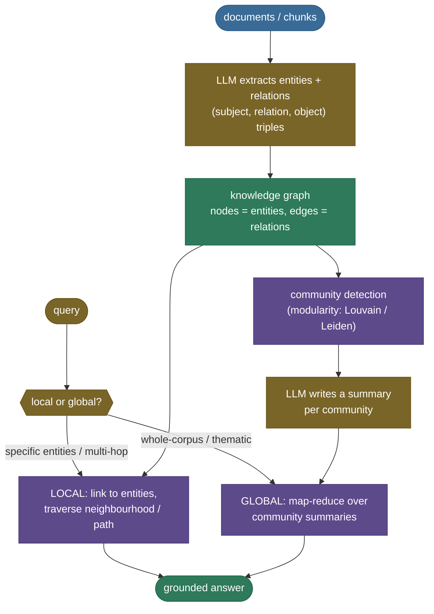

# GraphRAG: turn the pile of documents into a connected map

Ask flat vector RAG *"Where is the team based that leads the satellite carrying the hyperspectral imager?"* and watch it fail — not because the answer isn't in the corpus, but because **it's split across three sentences that no single chunk holds together**. One chunk says *Helios-7 carries a hyperspectral imager*; another says *Helios-7 is led by Dr. Amara Okoye*; a third says *Dr. Okoye is based in the Nairobi office*. Top-k similarity retrieves the *endpoints* — the imager chunk and maybe the office — but nothing that **connects** them. The answer requires *chaining* facts, and a bag of independent chunks can't chain.

Now ask a different kind of question: *"What are the main themes across the whole corpus?"* Flat RAG fails again, for the opposite reason — the answer isn't in *any* chunk; it's an **aggregate** over all of them. There's no top-k to retrieve because no passage says "the themes are…". Vector RAG is a *lookup*; this is a *summarization of the whole dataset*.

These two failures — **multi-hop** (connect facts across documents) and **global/thematic** (aggregate over the whole corpus) — are exactly what **GraphRAG** fixes. The idea is one move: stop treating your documents as a flat pile of chunks and turn them into a **connected map** — a **knowledge graph** of *entities* (nodes) and *relationships* (edges). Then you answer by **traversing** the graph (multi-hop) or by **summarizing its communities** (global). It's the technique that lets RAG answer *"how does A connect to D?"* and *"what's this whole dataset about?"*.

I'm going to build this the way I'd explain it to a teammate whose vector search keeps whiffing on "connect-the-dots" questions — starting from *why* flat RAG structurally can't (feel both failures on our corpus), then the connected-map intuition, then the two search modes (local traversal, global community-summarization), the graph and modularity math derived, a from-scratch GraphRAG you can read end to end (with a **real** graph, **real** traversal, and **real** community detection — measured), the traps that bite in production, and where GraphRAG is — and isn't — worth its cost. By the end you'll be able to:

- explain the **two question types flat RAG can't answer** — multi-hop and global — and *why*;
- build an **entity–relation knowledge graph** and answer a multi-hop query by **graph traversal** that flat top-k misses;
- define **modularity $Q$** and detect **communities** (Louvain/Leiden family) — and read the score;
- explain **local vs global search** and the **map-reduce over community summaries** that answers thematic questions;
- name the real systems (Microsoft GraphRAG, Neo4j, LlamaIndex `PropertyGraphIndex`) and the **cost tradeoff** that decides when to reach for it.

> **Note:** GraphRAG is not a replacement for flat RAG — it's a **different tool for different questions**. For a local factoid (*"what's the imager's resolution?"*) flat vector RAG is faster, cheaper, and just as good. GraphRAG earns its (considerable) cost on **multi-hop** and **global** questions over **densely-connected** corpora. The last two sections make that call precise.

> **Honesty up front (it governs every number below):** a real GraphRAG pipeline uses an **LLM to extract entities and relations** from each chunk and to **write community summaries** — this environment is encoder-only, so we do **not** fake an LLM. What runs **real and measured** is the part that matters most for understanding the mechanism: the **knowledge graph is a real `networkx` graph**, the **multi-hop traversal is a real shortest-path**, the **community detection is real modularity optimization** (`networkx`), the **modularity score $Q$ is real**, and the **flat-RAG baseline is the real `all-MiniLM-L6-v2` dense retriever** from [chapter 5](../05-Hybrid-Search-BM25-and-Dense/05-Hybrid-Search-BM25-and-Dense.md). What's **illustrative (clearly labelled)** is the entity/relation *extraction* and the community *summaries*/answers — a small fixed hand-authored set standing in for the LLM. Every graph statistic, path, community count, and modularity number on this page prints in an executed [notebook](code/09-GraphRAG.ipynb) cell. In production an LLM produces the triples and summaries; the graph algorithms you see run for real over them.

---

## The problem: flat RAG can't chain, and can't aggregate

To feel why GraphRAG exists, watch flat vector RAG fail on both question types — on [chapter 1's](../01-RAG-Fundamentals/01-RAG-Fundamentals.md) Helios-7 corpus, using the same real `all-MiniLM-L6-v2` retriever from [chapter 5](../05-Hybrid-Search-BM25-and-Dense/05-Hybrid-Search-BM25-and-Dense.md).

**Failure 1 — multi-hop: the endpoints, but no chain.** Query: *"Where is the team based that leads the satellite carrying the hyperspectral imager?"* The dense retriever returns its top-3 chunks:

```
flat-RAG top-3 chunks: [1, 0, 10]
  chunk[1]: Helios-7 carries a hyperspectral imager with a ground resolution of 4 meters.
  chunk[0]: The Helios-7 satellite was launched on March 3rd, 2024 from the Kourou spaceport.
  chunk[10]: The Helios-7 ground team spent the afternoon investigating several telemetry errors...
any single corpus chunk links the imager AND the 'Nairobi office': False
```

It found the imager chunk — but **no chunk in the entire corpus mentions both the imager and the Nairobi office**, so there is nothing to retrieve that connects them. This isn't a ranking miss you can fix with a bigger `k`; it's *structural*. The answer lives in the **relationships between** chunks, which a flat index throws away.

**Failure 2 — global: no chunk holds "the themes."** Query: *"What are the main themes across the corpus?"* There is no passage to retrieve, because the answer is a **summary of the whole dataset**, not a fact in it. Flat RAG's top-k returns a few arbitrary chunks; the aggregate is nowhere.

These two failures are the whole motivation. Flat RAG excels at "find the chunk that answers this" and structurally fails at "connect these facts" and "summarize everything." GraphRAG is built for exactly those.

---

## Intuition first: a map, not a pile

Here's the mental model that holds up under questioning.

Imagine you're handed a stack of index cards, each a single fact about a space mission. **Flat RAG is a keyword-and-vibe search over the stack** — you can pull the cards most *similar* to your question, but the cards don't know about each other. Ask "which office runs the satellite with the imager?" and you get the imager card and (maybe) an office card, sitting side by side, unlinked. You, the reader, would have to notice they share "Helios-7" and chain them — but flat RAG doesn't do that; it just hands you the pile.

**GraphRAG first builds a map.** It reads every card and draws a **graph**: each distinct *thing* (Helios-7, the imager, Dr. Okoye, the Nairobi office) becomes a **node**, and each stated *relationship* (carries, led-by, based-in) becomes an **edge** connecting two nodes. Now the cards are *wired together*. To answer the multi-hop question you don't search for a card that contains the whole answer — you **start at one node and walk the edges**: imager → (carries) → Helios-7 → (led-by) → Dr. Okoye → (based-in) → Nairobi office. The graph *connected the facts the cards kept separate.*

And for the global question, the map has a second superpower: **its shape reveals structure.** Densely-wired clusters of nodes are **communities** — natural themes. Summarize each community once, and "what are the main themes?" becomes "read the community summaries" — an aggregate the flat pile could never produce.

Push the analogy where it bends — that's where it teaches:

- **"Isn't the extraction lossy? What if the map is wrong?"** Yes — and this is GraphRAG's central risk. The graph is only as good as the entities and relations the LLM extracted. **Garbage extraction → garbage graph → confidently wrong traversals.** A missed edge disconnects two facts that *should* connect; a hallucinated edge invents a link that isn't real. (This is the top pitfall below — and why extraction quality, not the graph algorithm, is where GraphRAG projects succeed or fail.)
- **"Why not just make chunks bigger so one chunk holds the chain?"** Because the facts are genuinely in *different documents* — the imager spec, the org chart, the personnel file. No chunk size unifies documents that were never adjacent. The graph is what spans them.
- **"Isn't this just more expensive RAG?"** Much more — you pay an **LLM call per chunk** to build the graph, up front, before you can answer anything. That cost is the whole reason GraphRAG is a *specialist* tool, not the default (the cost pitfall and the "when to skip" table make this precise).

The mapping to the mechanism is exact: **the cards are your chunks, the map is the knowledge graph, the nodes are entities, the edges are extracted relations, walking the edges is local (multi-hop) search, and reading the community summaries is global search.** Hold that picture; everything below is the engineering.


---

## The mechanism: build the graph, then search it two ways

GraphRAG has an expensive **indexing** phase (done once) and a cheap **query** phase (per question), and the query phase branches into **local** and **global** search.



**Indexing (once, LLM-heavy).** (1) An LLM reads each chunk and extracts **(subject, relation, object)** triples. (2) The triples assemble into a **knowledge graph** — deduplicating entities that appear under different names (*entity resolution*). (3) **Community detection** partitions the graph into densely-connected clusters. (4) An LLM writes a **summary ("community report")** for each community. Steps 1 and 4 are the expensive LLM calls that make GraphRAG costly to build.

**Querying (per question).** *Local search* handles specific-entity and multi-hop questions: link the query to graph entities, then **traverse** their neighbourhood/shortest path to gather connected facts. *Global search* handles thematic questions: **map-reduce** over the pre-computed community summaries — each summary produces a partial answer (map), then all partials are synthesized into a final answer (reduce).

> **Source / derivation:** [Edge et al., "From Local to Global: A Graph RAG Approach to Query-Focused Summarization" (2024)](https://arxiv.org/abs/2404.16130) — the two-stage LLM index (entity graph, then pregenerated community summaries) and the local/global split are Microsoft's GraphRAG. The paper's framing: baseline "RAG fails on global questions … such as *What are the main themes in the dataset?*, since this is inherently a query-focused summarization task, rather than an explicit retrieval task." Source in the [references](09-GraphRAG.references.md).

Below is the real graph our from-scratch build produces from the (illustrative) extraction — **10 entities, 10 relations**:

![The Helios-7 knowledge graph: 10 entities (nodes) and 10 relations (labelled edges), coloured by the real detected community (Q=0.320). Nodes are things (Helios-7, the imager, Dr. Okoye, the Nairobi office…); edges are extracted relations (carries, led_by, based_in…). This connected map is exactly what flat RAG never builds. Graph structure, traversal, and community detection are real (networkx); the entity/relation extraction is an illustrative LLM stand-in. Generated by `code/make_figures_09.py`.](../images/rag09_knowledge_graph.png)

---

## Local search: multi-hop by graph traversal

The multi-hop question flat RAG couldn't answer — *"Where is the team based that leads the satellite carrying the hyperspectral imager?"* — is trivial once you have the graph. Link the query to a start entity (**hyperspectral imager**), then compute the **shortest path** to the answer region. On our real graph:

```
GRAPH traversal (3 hops): hyperspectral imager -[carries]-> Helios-7 -[led_by]-> Dr. Amara Okoye -[based_in]-> Nairobi office
answer entity: Nairobi office
```

Three hops, three edges, three facts that lived in three different chunks — **chained by the graph into an answer no single chunk contained**. That's local search: the graph's edges are the connective tissue flat retrieval discards.


> **Source / derivation:** [Microsoft GraphRAG — Local Search](https://microsoft.github.io/graphrag/query/local_search/) — local search "identifies a set of entities from the knowledge graph that are semantically-related to the user input [as] access points into the knowledge graph, enabling the extraction of further relevant details such as connected entities, relationships … and community reports." Our shortest-path traversal is the minimal form of that neighbourhood extraction. Source in the [references](09-GraphRAG.references.md).

---

## The math: graph construction and community detection

### The graph

A **knowledge graph** is $G = (V, E)$: $V$ is the set of **entities** (nodes), $E$ the set of **relations** (edges). Each edge carries a **type** (the relation label). We use an **undirected** graph here because multi-hop *questions* traverse relations in either direction — "the office responsible for the satellite" walks `led_by` and `based_in` from the satellite side. Our extraction yields $|V| = 10$ entities and $|E| = 10$ relations. Multi-hop answering is then a **shortest-path** query on $G$: given start entity $s$ and target region, return the minimum-length path $s \to \dots \to t$ (breadth-first search on an unweighted graph).

### Communities and modularity

For global questions we need to find the graph's **thematic clusters**. The workhorse quality function is **modularity** $Q$ — how many edges fall *within* clusters versus how many you'd expect if the same edges were rewired at random. For a partition of $V$ into communities, with $c_i$ the community of node $i$:

$$
Q \;=\; \frac{1}{2m} \sum_{i,j} \left[ A_{ij} - \frac{k_i k_j}{2m} \right] \delta(c_i, c_j)
$$

Define every symbol: $A_{ij}$ is the **adjacency** (1 if an edge connects $i, j$, else 0); $k_i = \sum_j A_{ij}$ is node $i$'s **degree**; $m = \tfrac{1}{2}\sum_i k_i$ is the total number of edges; $\delta(c_i, c_j)$ is **1 if $i$ and $j$ are in the same community, else 0** (so only within-community pairs count). Read the bracket: $A_{ij}$ is the **actual** edge, $\tfrac{k_i k_j}{2m}$ is the **expected** edge weight between $i$ and $j$ under a random rewiring that preserves degrees. Their difference, summed over within-community pairs, is *"edges inside communities minus what chance would give"* — normalized by $2m$ to land $Q$ in roughly $[-\tfrac{1}{2}, 1]$. **$Q > 0$ means the partition captures real structure; higher is stronger.**

**Community detection** is then: *find the partition that maximizes $Q$.* Exhaustive maximization is NP-hard, so practical algorithms are greedy/heuristic: **Louvain** (Blondel et al. 2008) greedily moves nodes between communities to increase $Q$, then coarsens and repeats; **Leiden** (Traag et al. 2019) fixes a defect where Louvain can produce badly- or dis-connected communities, and runs faster. Our code uses networkx's `greedy_modularity_communities` (the same modularity-maximizing family). On our graph it finds **3 communities** with **$Q = 0.3200$**:

```
detected 3 communities | modularity Q = 0.3200
  community 0 (5 entities): ['Ariane 6', 'Helios-7', 'Kourou spaceport', 'hyperspectral imager', 'sun-synchronous orbit']
  community 1 (3 entities): ['Error E-4011', 'ground team', 'telemetry stream']
  community 2 (2 entities): ['Dr. Amara Okoye', 'Nairobi office']
modularity of the trivial 'everything in one community' partition: 0.0000
```

The three clusters *are* the corpus's themes — spacecraft & mission, operations & faults, people & program — discovered from **graph structure alone**, no labels. And the number proves it's real structure: the detected partition scores **$Q = 0.320$** versus **$Q = 0.000$** for lumping everything into one community. (One community always scores $Q = 0$ — every pair is "within," so actual and expected cancel; any positive $Q$ beats it.)


> **Source / derivation:** [Newman, "Modularity and community structure in networks" (PNAS 2006)](https://doi.org/10.1073/pnas.0601602103) — the modularity $Q$ above ("the number of edges falling within groups minus the expected number in an equivalent network with edges placed at random"). Maximizing it: [Blondel, Guillaume, Lambiotte & Lefebvre, "Fast unfolding of communities in large networks" (Louvain, 2008)](https://doi.org/10.1088/1742-5468/2008/10/P10008) and [Traag, Waltman & van Eck, "From Louvain to Leiden" (2019)](https://arxiv.org/abs/1810.08473) — Leiden "yields communities that are guaranteed to be connected" and is faster than Louvain. All three are in the [references](09-GraphRAG.references.md).

---

## Global search: map-reduce over community summaries

Now the thematic question flat RAG couldn't touch — *"What are the main themes across the corpus?"* — has a clean answer. Each community gets a **summary** (an LLM "community report" in production; a fixed exemplar here), and global search runs a **map-reduce**: **map** — each community summary produces a partial answer; **reduce** — the partials are synthesized into a final answer. On our 3 real communities:

```
MAP — one partial theme per community (3 communities):
  community 0: Spacecraft & mission: Helios-7 itself, its launch from Kourou aboard Ariane 6, the hyperspectral imager it carries, and its sun-synchronous orbit.
  community 1: Operations & faults: telemetry error E-4011, the telemetry stream it appeared in, and the ground team investigating it.
  community 2: People & program leadership: Dr. Amara Okoye, who leads the program, and the Nairobi office she is based in.
REDUCE — final answer:
  Main themes across the corpus: Spacecraft & mission: … | Operations & faults: … | People & program leadership: …
```

The answer draws on **every community** — it's an aggregate over the whole graph that **no single chunk could hold**. That's the class of "global sensemaking" question GraphRAG was built for.


> **Source / derivation:** [Microsoft GraphRAG — Global Search](https://microsoft.github.io/graphrag/query/global_search/) — global search "uses a collection of LLM-generated community reports … as context data to generate response in a map-reduce manner. At the `map` step, community reports are segmented into text chunks … [each] used to produce an intermediate response containing a list of points, each … accompanied by a numerical rating indicating … importance. At the `reduce` step, a filtered set of the most important points … are aggregated and used as the context to generate the final response." Source in the [references](09-GraphRAG.references.md).

### Local vs global, side by side


---

## Code: a real graph, real traversal, real communities

Here's the honest experiment. The **graph, traversal, and community detection are real `networkx`**; the flat-RAG baseline is the **real dense retriever** from [chapter 5](../05-Hybrid-Search-BM25-and-Dense/05-Hybrid-Search-BM25-and-Dense.md); the **entity/relation extraction and summaries are fixed, labelled exemplars** standing in for an LLM. It runs on CPU in a couple of seconds.

> **Runnable project and a step-by-step notebook:** the same verified code lives as a clean script and an executed teaching notebook next to this page — see the [step-by-step teaching notebook](code/09-GraphRAG.ipynb) and the [runnable demo script](code/graph_rag.py) (run it with `python graph_rag.py`).

**Build the graph and traverse it — multi-hop that flat RAG misses:**

```python
"""GraphRAG from scratch: a real networkx knowledge graph + real traversal.
The graph/traversal/community detection are REAL; the entity/relation EXTRACTION is a FIXED exemplar
standing in for an LLM (this env is encoder-only). Verified on Python 3.12 / networkx 3.x."""
import networkx as nx

# In production an LLM extracts these (subject, relation, object) triples from each chunk.
# Here they are a FIXED, labelled hand-authored set — but the GRAPH ALGORITHMS below run for real.
RELATIONS = [
    ("Helios-7", "carries", "hyperspectral imager"),
    ("Helios-7", "led_by", "Dr. Amara Okoye"),
    ("Dr. Amara Okoye", "based_in", "Nairobi office"),
    # ... (launched_from Kourou, flies_in orbit, E-4011 appeared_in telemetry, ...)
]

graph = nx.Graph()
for subj, rel, obj in RELATIONS:
    graph.add_edge(subj, obj, relation=rel)          # a real knowledge graph

# Multi-hop LOCAL search = shortest path on the graph (real BFS):
path = nx.shortest_path(graph, "hyperspectral imager", "Nairobi office")
rendered = " ".join([path[0]] + [f"-[{graph.edges[a, b]['relation']}]-> {b}"
                                 for a, b in zip(path, path[1:])])
print(f"{len(path) - 1} hops:", rendered)
assert path[-1] == "Nairobi office"                  # arrived at the answer entity
```

Output (from the executed notebook):

```
3 hops: hyperspectral imager -[carries]-> Helios-7 -[led_by]-> Dr. Amara Okoye -[based_in]-> Nairobi office
```

**Detect communities and score the partition — real modularity:**

```python
from networkx.algorithms.community import greedy_modularity_communities, modularity

communities = greedy_modularity_communities(graph)     # real modularity-maximizing detection
q = modularity(graph, communities)                     # real modularity score
q_blob = modularity(graph, [set(graph.nodes())])       # the trivial one-community partition
print(f"{len(communities)} communities | Q = {q:.4f}  (one-blob Q = {q_blob:.4f})")
assert q > q_blob                                      # the split beats lumping everything together
```

Output:

```
3 communities | Q = 0.3200  (one-blob Q = 0.0000)
```

The graph found 3 structural clusters — the corpus's themes — with positive modularity, provably better than no split. Every number here prints in the [notebook](code/09-GraphRAG.ipynb).

**The library one-liners.** In production you don't hand-roll extraction or community reports — but both need a **generative LLM**, so they won't run in this encoder-only environment:

```python
# Microsoft GraphRAG — the full local/global pipeline (needs an LLM for extraction + reports)
#   graphrag index --root ./ragproject          # LLM extraction → graph → communities → reports
#   graphrag query --method local  --query "..."  # multi-hop / specific-entity
#   graphrag query --method global --query "..."  # whole-corpus / thematic (map-reduce)

# LlamaIndex — PropertyGraphIndex: LLM extracts triples, builds a queryable graph
from llama_index.core import PropertyGraphIndex
index = PropertyGraphIndex.from_documents(documents)   # default kg_extractors: SimpleLLMPathExtractor + ImplicitPathExtractor
retriever = index.as_retriever(include_text=True, similarity_top_k=2)
nodes = retriever.retrieve("Which office runs the satellite carrying the imager?")
```

Both hide exactly the extract-triples → build-graph → traverse/summarize pipeline we built by hand.

---

## Pitfalls and failure modes

Every one of these bites a real GraphRAG deployment. Each is named, shown, then fixed.

**1. Extraction quality — garbage entities → garbage graph.** The graph is *only as good as the LLM's extraction*. A missed relation **disconnects** facts that should link (traversal fails to find a path that exists in reality); a hallucinated relation invents an edge (traversal confidently returns a wrong chain). *Failing:* the extractor writes `("Helios-8", "led_by", "Dr. Okoye")` — a typo'd entity — and now the imager→office path breaks because "Helios-7" and "Helios-8" are different nodes. *Fixes:* use a strong extractor with a **constrained schema** (allowed entity types and relation types), run **extraction validation** (reject triples with unknown entity types), and — the single biggest lever — **entity resolution** (pitfall 3). The graph algorithm is never the bottleneck; extraction is.

**2. Indexing cost — an LLM call per chunk.** Building the graph is *expensive*: an LLM extraction call for **every chunk** at index time, plus a summary call for **every community**. For a large corpus this is thousands of LLM calls *before you can answer a single question* — GraphRAG's defining cost. *Failing:* you point GraphRAG at a 1 M-token corpus and the indexing bill (and hours) dwarf what flat RAG's embed-once cost. *Fixes:* **only index what needs the graph** (GraphRAG for the multi-hop/global sub-corpus, flat RAG for the rest); use a **cheaper model** for extraction than for answering; cache and **incrementally update** the graph rather than rebuilding; and honestly, **skip GraphRAG** when your questions are local factoids (the "when to skip" table).

**3. Entity resolution — the same thing under different names.** *"Dr. Amara Okoye"*, *"Amara Okoye"*, *"Dr. Okoye"*, and *"the project lead"* are one person — but naive extraction makes **four nodes**, fragmenting the graph so traversal can't connect through them. *Failing:* the "based_in" edge attaches to "Dr. Okoye" but the "led_by" edge points to "Amara Okoye", so the imager→office path is broken by a name mismatch. *Fixes:* an **entity-resolution / co-reference** pass that merges surface forms into one canonical node (embedding-similarity clustering of entity names, or an LLM dedup step). Microsoft GraphRAG and LlamaIndex both do this during graph construction; if you build your own, it is *not* optional.

**4. Community granularity — too coarse or too fine.** Modularity optimization gives *a* partition, but the right **level** depends on the question. Too coarse (few huge communities) and each summary blurs distinct themes together; too fine (many tiny communities) and you drown in fragmentary summaries and the map-reduce cost explodes. *Failing:* one giant community summary says "the corpus is about a space mission" — true but useless for a themes question. *Fixes:* GraphRAG builds a **community *hierarchy*** (multiple resolution levels) and lets global search **choose the level**; tune the resolution parameter, and pick a **finer level for detailed answers**, coarser for high-level ones.

**5. When GraphRAG is overkill — the local factoid.** For *"what's the imager's ground resolution?"* the answer is *in one chunk*. GraphRAG's extraction+graph+communities machinery adds latency, build cost, and (via imperfect extraction) *risk* — for zero benefit over flat vector RAG. *Failing:* you route every query through GraphRAG and single-fact lookups get slower and occasionally *worse* (a bad extraction beats a chunk that literally contained the answer). *Fix:* **route by question type** — local factoid → flat/hybrid RAG ([ch5](../05-Hybrid-Search-BM25-and-Dense/05-Hybrid-Search-BM25-and-Dense.md)); multi-hop or global → GraphRAG. GraphRAG is a scalpel, not a hammer.

---

## Where it's used, and when to reach for it

**Used:** GraphRAG is the go-to for **multi-hop reasoning** and **global sensemaking** over connected corpora.

- **Microsoft GraphRAG** — the reference implementation: LLM entity/relation extraction → graph → Leiden communities → community reports; **local search** (specific-entity/multi-hop) and **global search** (map-reduce over reports), plus **DRIFT** (a hybrid of the two).
- **Neo4j + LLM** — a property-graph database as the store, with LLM extraction (Neo4j's `LLMGraphTransformer`/GraphRAG packages) and Cypher traversal for retrieval.
- **LlamaIndex** — `PropertyGraphIndex` (LLM path extractors → labeled property graph, queried by synonym + vector-context retrievers) and the older `KnowledgeGraphIndex` (triples via `max_triplets_per_chunk`).
- **LangChain** — graph transformers + graph-QA chains over Neo4j/other graph stores.

**When to reach for it vs skip it:**

| Situation | Reach for | Why |
|---|---|---|
| Multi-hop questions (connect facts across documents) | **GraphRAG (local)** | the graph's edges chain facts no single chunk holds |
| Global / thematic ("main themes?", "how do X and Y relate overall?") | **GraphRAG (global)** | the answer is an aggregate over the corpus, not any chunk |
| Densely-connected corpus (entities recur, relationships matter) | **GraphRAG** | the graph structure carries real signal to exploit |
| Local factoid ("what's the resolution?") | **skip → flat/hybrid RAG** | the answer is in one chunk; graph machinery is pure overhead + risk |
| Small corpus / tight build budget / one-off queries | **skip → flat RAG** | GraphRAG's per-chunk LLM indexing cost isn't amortized |
| Sparse, unconnected documents | **skip** | few real relations → a thin graph adds little over retrieval |

> **Note:** GraphRAG **composes** with the rest of the stack. Microsoft's local search itself blends graph traversal with vector retrieval of text units, and community reports with entity descriptions — it's "graph *plus* flat," not "graph *instead of* flat." The right production system often **routes**: cheap flat/hybrid RAG for local factoids, GraphRAG for the multi-hop and global questions that justify its cost.

---

## In production: verified specs and numbers

- **Microsoft GraphRAG.** Verified against the paper and docs: a two-stage LLM index (entity knowledge graph, then **pregenerated community summaries** for closely-related entity groups), with **local search** ("identifies a set of entities … as access points into the knowledge graph") and **global search** (map-reduce over community reports; map produces points with **1–10 importance ratings**, reduce aggregates the top-rated). Edge et al. report GraphRAG gives "substantial improvements over a conventional RAG baseline for both the **comprehensiveness and diversity** of generated answers" on global sensemaking questions over ~1 M-token datasets.
- **Community detection.** Verified: **Leiden** (Traag et al. 2019) "yields communities that are guaranteed to be connected" and is faster than **Louvain** (Blondel et al. 2008); both maximize **modularity** $Q$ (Newman 2006). Our from-scratch build uses networkx's `greedy_modularity_communities` (the same modularity-maximizing family) and networkx's `modularity` for the score.
- **LlamaIndex.** Verified: `PropertyGraphIndex.from_documents(...)` with default `kg_extractors` = `SimpleLLMPathExtractor` + `ImplicitPathExtractor`, retrieved by `LLMSynonymRetriever` + `VectorContextRetriever`; the older `KnowledgeGraphIndex.from_documents(..., max_triplets_per_chunk=2)` extracts (subject, relation, object) triples.
- **The measured claims on this page** — 10 entities / 10 relations, the 3-hop path, 3 communities at $Q = 0.3200$ (vs $0.0000$ for one blob) — all come from the executed [notebook](code/09-GraphRAG.ipynb) over a **real networkx graph and real dense retriever**; the entity/relation extraction and community summaries are illustrative (an LLM produces them in production).

---

## Recap and rapid-fire

**If you remember nothing else:** flat vector RAG retrieves *similar chunks* and structurally can't answer two whole classes of question — **multi-hop** ("connect facts across documents") because no single chunk holds the chain, and **global/thematic** ("main themes?") because the answer is an aggregate over the corpus. **GraphRAG turns the pile of documents into a connected map** — an entity–relation **knowledge graph** — and answers by **traversing** it (local search: our real 3-hop path imager → Helios-7 → Dr. Okoye → Nairobi office) or by **summarizing its communities** (global search: map-reduce over the 3 clusters our real modularity detection found at $Q = 0.320$). It costs an **LLM call per chunk** to build, so it's a specialist tool — reach for it on multi-hop/global questions over connected corpora, skip it for local factoids.

**Quick-fire — say these out loud:**

- *Two questions flat RAG can't answer?* Multi-hop (no chunk holds the chain) and global/thematic (the answer is an aggregate over the corpus).
- *What does GraphRAG build?* An entity–relation knowledge graph — nodes = entities, edges = extracted relations.
- *Local vs global search?* Local = link to entities + traverse (multi-hop); global = map-reduce over community summaries (thematic).
- *What is modularity $Q$?* Edges within communities minus the number expected at random; $Q > 0$ = real structure, higher = stronger.
- *Louvain vs Leiden?* Both maximize modularity greedily; Leiden guarantees connected communities and is faster (fixes a Louvain defect).
- *Biggest GraphRAG risk?* Extraction quality — garbage entities/relations → garbage graph → wrong traversals; entity resolution is critical.
- *Why is GraphRAG expensive?* An LLM extraction call per chunk (and a summary per community) at index time — before any query.
- *When to skip it?* Local factoids in one chunk, sparse/unconnected corpora, tight build budgets — flat/hybrid RAG wins there.
- *Reference implementation?* Microsoft GraphRAG (local/global search, community reports); also Neo4j+LLM, LlamaIndex `PropertyGraphIndex`.

---

## References and further reading

The curated link library for this topic — videos, courses, articles, papers, and internal cross-links — lives in a companion file so it can be reused as a standalone reference list:

**→ [GraphRAG — references and further reading](09-GraphRAG.references.md)**
