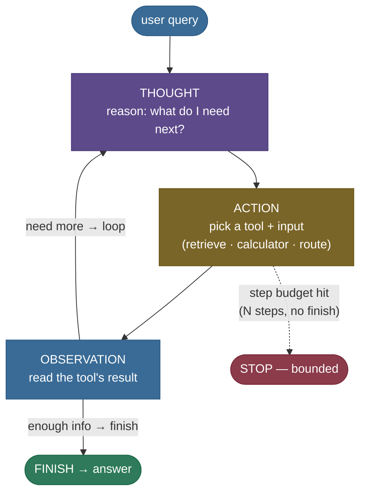
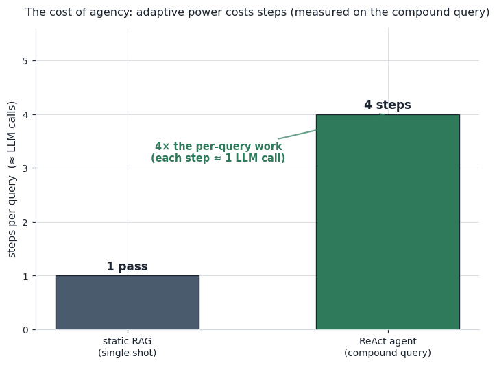

# Agentic RAG: put an LLM in the driver's seat

Ask a static RAG system a simple question — *"When was Helios-7 launched?"* — and it shines: embed
the query, pull the top passages, ground the answer. Now ask it a **compound** one — *"How many
complete orbits does Helios-7 make in a day, and what is its imager's ground resolution?"* — and
watch it fall apart. It retrieves some passages in a single shot, but there is **no step anywhere in
the pipeline that divides 1440 minutes by the orbit period**, so the *count* is simply never
computed. The pipeline is a straight line: retrieve once → stuff → generate once. It cannot loop
back, cannot reach for a calculator, cannot notice it's missing a fact and go get it.

**Agentic RAG** fixes this by changing *who is in charge*. Instead of a fixed pipeline, an **LLM
agent** sits in a loop and makes decisions: it *reasons* about what it still needs, *picks a tool*
(retriever, calculator, web search, a different index), *reads* the result, and *decides again* —
retrieve more, reformulate, or answer. That loop — **Thought → Action → Observation, repeat** — is
the **ReAct** pattern, and it turns retrieval from a fixed pipeline into an adaptive program.

I'll walk this the way I'd explain it to a teammate who has a working static RAG and a query it keeps
botching. We'll *feel* the failure on a real query first, build the intuition for why a loop fixes
it, then make the mechanism concrete: the ReAct control loop, the router that picks a source, the
step budget that keeps it from hanging. Then we'll write the whole thing from scratch (a **real**
control loop over **real** tools) and prove it solves the query static RAG couldn't. By the end you'll
be able to:

- explain **why** a fixed retrieve-then-generate pipeline can't handle multi-step / compound queries;
- describe the **ReAct loop** as a control policy, and routing as a scoring decision;
- reason about the **step budget** and the **cost** (each step ≈ an LLM call) — the central tradeoff;
- name the failure modes — **infinite loops, error cascades, tool mis-selection, over-agentic** use —
  and their fixes;
- map it to production: **LangGraph, LlamaIndex `ReActAgent`/router/sub-question engines, tool
  calling**, and *when agentic is worth the cost versus static*.

> **Honesty up front — what's real vs illustrative in this chapter.** The code below builds a **real**
> ReAct control loop over **real** tools: a real dense retriever (chapter 5's all-MiniLM
> `DenseRetriever`), a real safe calculator, and a real router (cosine of the query against each
> tool's description). Every step count, tool call, cosine, and assembled fact is measured and
> asserted. The **one** illustrative piece is the **action-selection policy** — in production an LLM
> decides the next action from the running trace; this environment is encoder-only, so we use a
> transparent **deterministic rule-based stand-in** that makes the *same* decisions an LLM would. The
> tools it invokes run for real. This is flagged again at the code.

---

## The problem: a fixed pipeline can't do multi-step work

To feel why the agent has to exist, watch static RAG hit a wall on a query it *should* be able to
answer — every fact it needs is right there in the corpus.

Our corpus is the shared Helios-7 knowledge base (chapters 1 and 5). Two of its passages:

```
doc[1]  Helios-7 carries a hyperspectral imager with a ground resolution of 4 meters.
doc[3]  Helios-7 completes one orbit of Earth every 97 minutes in a sun-synchronous orbit.
```

Now the compound query:

> *"How many complete orbits does Helios-7 make in one day, and what is the ground resolution of its
> imager?"*

Static single-shot RAG retrieves the top-3 passages in one pass — and it *does* surface both `doc[1]`
and `doc[3]`. So the resolution part it can answer: "4 meters", read straight off the passage. But
the **orbit-count** part needs a computation — a day is 1440 minutes, the period is 97 minutes, so
the count is $\lfloor 1440 / 97 \rfloor = 14$ — and **the pipeline has no step that does arithmetic**.
Retrieve → stuff → generate. There is nowhere for the division to happen.

Here is that failure, measured (from the runnable module below):

```
query: How many complete orbits does Helios-7 make in one day, and what is the ground resolution of its imager?
  static retrieved (top-3): [imager…4 meters, orbit…97 minutes, launched…March 3rd]
  resolution it can read off passages : 4 meters
  orbits-per-day it can compute        : None  (no arithmetic step in the pipeline)
```

The `None` is the whole point: not a bad answer, an **impossible** one for this architecture. A
compound question that mixes *retrieval* with *computation* (or with a second, dependent retrieval)
is outside what a single forward pass through a fixed pipeline can express.

> **Note:** this isn't a retrieval-quality problem you can tune away with a better embedder or a
> re-ranker — those got the passages here just fine. It's a **control-flow** problem: the pipeline's
> shape is fixed at design time, and this query needs a shape (retrieve, *then compute*, *then*
> retrieve again) the pipeline doesn't have.

---

## Intuition: a fixed recipe vs a cook who tastes and adjusts

Static RAG is a **recipe card**: do step 1, then 2, then 3, then plate. It's fast and predictable,
and it's perfect when the dish is always the same. But hand that card a new constraint — "the sauce
is too thin" — and the card is useless, because it has no step for *tasting and reacting*.

Agentic RAG is a **cook**. The cook has **tools** (a whisk, a thermometer, a pantry) and a **goal**,
and works in a loop: look at the dish (observe), decide what it needs (reason), do one thing (act),
taste again. The cook *retrieves* an ingredient, *reduces* the sauce, *tastes*, and only plates when
it's right. If a step fails, the cook notices and tries something else.

Map it to the mechanism exactly — this is the analogy worth holding onto:

| Cook | Agent |
|---|---|
| the goal ("a good sauce") | the user's query |
| looking at the dish | reading the last **Observation** |
| deciding what it needs next | the **Thought** (an LLM reasons) |
| reaching for one tool | the **Action** (pick a tool + input) |
| tasting the result | the next **Observation** |
| plating when it's right | the `finish` action → the answer |
| a kitchen timer so dinner isn't at midnight | the **step budget** |

**Now the honest follow-up** — the one that separates a good analogy from a slogan: *isn't a cook
slower than following a card?* **Yes — and that's the real tradeoff.** A cook who tastes and adjusts
takes more time and effort than someone slapping together a fixed recipe. Every "taste" is a decision
(in production, an **LLM call**), so the agent costs more latency and money per query. You bring in
the cook when the dish *needs* judgment — a compound or open-ended query — and you keep the recipe
card when the dish is always the same (a simple lookup). Using the cook for toast is the
**over-agentic** mistake we'll name later.


---

## The mechanism: the ReAct loop, a router, and a budget

Three pieces make an agentic RAG system, and it's worth seeing each as a distinct idea.

**1) The ReAct control loop.** The agent alternates **reasoning** and **acting**. A *Thought* is
free-text reasoning about the current state; an *Action* names a tool and its input; an *Observation*
is what the tool returned. The loop repeats — the agent reads its own growing trace and decides the
next Action — until it emits a special `finish` action (with the answer) or runs out of budget.



> **Source / derivation:** [ReAct: Synergizing Reasoning and Acting in Language Models](https://arxiv.org/abs/2210.03629) (Yao et al. 2022) — the interleaved *reason → act → observe* loop, and the [project page](https://react-lm.github.io/) with worked traces. This is the control policy the diagram draws.


Contrast that with the static pipeline: a straight line, no branches, no loop, no tools. The whole
difference is **fixed control flow versus adaptive control flow**.


**2) The router.** "The agent picks the right source" is concretely a **scoring decision**. Give each
tool a natural-language **description**; to route a query, embed it and each description and pick the
tool whose description it's most similar to (argmax cosine). A math query lands on the calculator; a
fact lookup lands on the retriever; in a bigger system, a query about code lands on the code index
rather than the docs index. Routing is classification by embedding similarity.

**3) The step budget.** The loop needs a hard stop. If the policy never emits `finish` (a bad model,
a query it can't resolve, a tool that keeps returning junk), the loop would run forever. A **maximum
step count** turns that hang into a bounded, debuggable stop. It's not optional polish — it's the
difference between a slow query and a wedged server.

---

## The math: the loop as a policy, routing as argmax, and the cost

Three small pieces of math make the mechanism precise. Every symbol is defined at first use.

**The ReAct loop as a control policy.** At step $t$ the agent holds a **trace** $h_t = (a_1, o_1,
\dots, a_{t-1}, o_{t-1})$ — the actions taken and observations seen so far — plus the query $q$. A
**policy** $\pi$ maps the trace to the next action:

$$a_t = \pi(q, h_t), \qquad o_t = \text{tool}(a_t), \qquad h_{t+1} = h_t \oplus (a_t, o_t)$$

where $a_t$ is the chosen (tool, input), $o_t$ is what running that tool returns, and $\oplus$ appends
the new (action, observation) to the trace. The loop stops when $a_t = \texttt{finish}$ (emitting the
answer) or when $t$ reaches the budget $N$. **In production $\pi$ is the LLM** — it reads $h_t$ as
text and generates the next Thought + Action. In our code $\pi$ is a deterministic rule-based
stand-in that makes the same decisions; the tools it calls are real either way.

> **Source / derivation:** the trace-conditioned policy $a_t = \pi(q, h_t)$ is the formalization of
> [ReAct](https://arxiv.org/abs/2210.03629) (Yao et al. 2022, §2); the *learn to critique and revise
> the trace* extension is [Reflexion](https://arxiv.org/abs/2303.11366) (Shinn et al. 2023), and
> *learning to call tools from the trace* is [Toolformer](https://arxiv.org/abs/2302.04761) (Schick
> et al. 2023). All three are in the references.

**Routing as argmax cosine.** With tools $\{T_1, \dots, T_m\}$, each with description embedding
$\mathbf{d}_i = \text{enc}(\text{desc}_i)$, and a query embedding $\mathbf{q} = \text{enc}(q)$ (all
$L_2$-normalized so cosine is a dot product), the route is

$$\text{route}(q) = \arg\max_{i} \; \mathbf{q} \cdot \mathbf{d}_i .$$

This is exactly the cosine top-1 retrieval of chapter 1, applied to *tool descriptions* instead of
documents — a clean reuse. It's a real decision, and it can be **marginal**: when two tools' scores
are close, the argmax is a coin-flip, which is why production routers sometimes add a margin or a
tie-break (we'll *see* a near-tie in the code).

> **Source / derivation:** routing as similarity-to-tool-description is the LlamaIndex
> [RouterQueryEngine](https://docs.llamaindex.ai/en/stable/examples/query_engine/RouterQueryEngine/)
> pattern; learned query-complexity routing (simple vs multi-step) is [Adaptive-RAG](https://arxiv.org/abs/2403.14403)
> (Jeong et al. 2024). Both in the references.

**The cost of a run.** If a run takes $S$ steps and step $t$ makes an LLM call of cost $c^{\text{llm}}_t$
(to produce the Thought + Action) and a tool call of cost $c^{\text{tool}}_t$, the per-query cost is

$$\text{cost} = \sum_{t=1}^{S} \left( c^{\text{llm}}_t + c^{\text{tool}}_t \right).$$

Static RAG is the $S = 1$ special case (one retrieval + one generation). The agent's power is bought
with a larger $S$ — and since $c^{\text{llm}}$ (a full LLM forward pass) usually dominates
$c^{\text{tool}}$ (a vector lookup), **each extra step is roughly one more LLM call**. That single
inequality, $S_\text{agent} > S_\text{static}$, is the entire tradeoff of going agentic.

---

## From-scratch: a real ReAct loop over real tools

Here's the core, built from primitives so every decision is inspectable. The **control loop**, the
**tool registry**, and every **tool** are real; only the **action-selection policy** is a labelled
deterministic stand-in for an LLM. The tools reuse chapter 5's real `DenseRetriever`, so this chapter
sits on the same corpus and encoder as the rest.

> **Runnable script and a step-by-step notebook:** the full verified code lives next to this page —
> the [runnable demo script](code/agentic_rag.py) (`python agentic_rag.py`) and the [step-by-step
> teaching notebook](code/10-Agentic-RAG.ipynb).

The loop itself — the heart of the whole idea — is tiny:

```python
class ReActAgent:
    FINISH = "finish"  # the sentinel action that ends the loop with an answer

    def __init__(self, tools, max_steps=6):
        self.tools = {t.name: t for t in tools}
        self.max_steps = max_steps

    def run(self, query, policy):
        result = AgentResult()
        for _ in range(self.max_steps):                 # the step budget: the hard stop
            thought, tool_name, tool_input = policy(query, result.steps)   # in prod, an LLM
            if tool_name == self.FINISH:
                result.answer = tool_input              # finish's "input" is the final answer
                result.steps.append(Step(thought, tool_name, tool_input, "(done)"))
                return result
            obs = self.tools[tool_name].run(tool_input)  # RUN the chosen tool for real
            result.steps.append(Step(thought, tool_name, tool_input, obs.text))
        result.hit_budget = True                        # fell out without finishing -> bounded stop
        result.answer = "(step budget exhausted -- no final answer)"
        return result
```

The tools are real and measured. The retriever wraps chapter 5's all-MiniLM index; the calculator is
a **safe** AST evaluator (never `eval` — a tool that takes model-generated input must not be able to
execute arbitrary code):

```python
def safe_eval(expression: str) -> float:
    """Evaluate pure arithmetic via AST walking — only numeric literals + whitelisted operators."""
    def _eval(node):
        if isinstance(node, ast.Expression): return _eval(node.body)
        if isinstance(node, ast.Constant) and isinstance(node.value, (int, float)):
            return float(node.value)
        if isinstance(node, ast.BinOp) and type(node.op) in _ALLOWED_BINOPS:
            return _ALLOWED_BINOPS[type(node.op)](_eval(node.left), _eval(node.right))
        if isinstance(node, ast.UnaryOp) and type(node.op) in _ALLOWED_UNARYOPS:
            return _ALLOWED_UNARYOPS[type(node.op)](_eval(node.operand))
        raise ValueError(f"disallowed expression element: {ast.dump(node)}")   # names/calls refused
    return _eval(ast.parse(expression, mode="eval"))
```

> **Note:** the AST whitelist blocks *code execution*, but `**` still allows a pure-arithmetic
> resource blowup (`9**9**9` → an astronomically large number that pins CPU/memory). The module adds
> a small denial-of-service guard — an exponent above `MAX_EXPONENT` is refused — a reminder that a
> tool taking model-generated input needs to bound *resource* use, not just *code* execution.

Now run the agent on the compound query with the (illustrative) policy that decomposes it. The
**trace is the lesson** — read it top to bottom:

```
step 1
  Thought:     The question has two parts. First I need the orbit period, then I can compute orbits per day.
  Action:      retrieve('Helios-7 orbit period in minutes')
  Observation: Helios-7 completes one orbit of Earth every 97 minutes in a sun-synchronous orbit.
step 2
  Thought:     The passage says the period is 97 minutes. A day has 1440 minutes, so I divide to get orbits per day.
  Action:      calculator('1440 / 97')
  Observation: 1440 / 97 = 14.8454
step 3
  Thought:     That gives the orbits per day; the whole-number part is the count of COMPLETE orbits. Now I still need the imager's ground resolution.
  Action:      retrieve('Helios-7 imager ground resolution')
  Observation: Helios-7 carries a hyperspectral imager with a ground resolution of 4 meters.
step 4
  Thought:     I now have both facts: the orbit count and the resolution. I can answer.
  Action:      finish('Helios-7 completes 14 full orbits per day (14.85 raw), and its imager has a ground resolution of 4 meters.')
  Observation: (done)

FINAL ANSWER: Helios-7 completes 14 full orbits per day (14.85 raw), and its imager has a ground resolution of 4 meters.
steps taken: 4 | tools used: ['retrieve', 'calculator', 'retrieve', 'finish'] | hit budget: False
```

Four steps: **retrieve → compute → retrieve → finish**. The agent sent the retriever *focused
sub-questions* (not the whole compound query), used the calculator for the step static RAG lacked, and
assembled both facts. The code **asserts before it claims** — the tool sequence, the `14 full orbits`,
the `4 meters` — so the trace can't be quietly wrong.


And the headline contrast, side by side — same query, two pipelines, what each can actually deliver:


**Routing, measured.** The router scores each probe against the two tool descriptions and takes the
argmax. Read the near-tie on the third row — routing is a real decision that can be marginal:

```
query                                        |       route | retrieve / calculator
------------------------------------------------------------------------------------
Who is the project lead for Helios-7?        |    retrieve | +0.629 / -0.017
What is 1440 divided by 97?                  |  calculator | +0.232 / +0.252   ← near-tie
When was Helios-7 launched?                  |    retrieve | +0.730 / -0.015
Compute 200 times 4.                         |  calculator | +0.084 / +0.388
```


### The library one-liners (and what they map to)

Once you understand the loop, the frameworks are thin wrappers over it. Each of these builds the same
Thought/Action/Observation machinery you just saw:

```python
# LlamaIndex: a ReAct agent over tools (the loop above, productionized)
from llama_index.core.agent import ReActAgent
agent = ReActAgent.from_tools([retriever_tool, calculator_tool], llm=llm, max_iterations=6)
response = agent.chat("How many complete orbits does Helios-7 make in a day, and its imager resolution?")

# LlamaIndex: a router that picks ONE query engine by description (our argmax-cosine router)
from llama_index.core.query_engine import RouterQueryEngine
router = RouterQueryEngine(selector=..., query_engine_tools=[docs_tool, code_tool])

# LlamaIndex: decompose a compound query into sub-questions, answer each, combine
from llama_index.core.query_engine import SubQuestionQueryEngine
sub_q = SubQuestionQueryEngine.from_defaults(query_engine_tools=[orbit_tool, imager_tool])

# LangGraph: a stateful graph with CYCLES — nodes = steps, edges = the loop-back / finish decision
from langgraph.graph import StateGraph  # add_node("retrieve"/"grade"/"generate"), add_conditional_edges(...)
```

- **`ReActAgent`** *is* the loop in this page — it drives Thought/Action/Observation over your tools.
- **`RouterQueryEngine`** *is* the argmax-cosine router — one hop, pick the right engine.
- **`SubQuestionQueryEngine`** decomposes a compound query into parts (our step-1/step-3 split, done
  by an LLM up front) and combines the answers.
- **[LangGraph](https://docs.langchain.com/oss/python/langgraph/agentic-rag)** models the whole thing
  as a **stateful graph with cycles** — the general form when your loop has branches (grade docs →
  retry / web-search fallback → generate), which is how CRAG/Self-RAG/Adaptive-RAG are built in
  practice.

> **Try it:** before you run the notebook's last cell, **predict**. The compound query took **4**
> steps (retrieve, calc, retrieve, finish). Now give the agent a query that needs only **one** fact —
> *"When was Helios-7 launched?"* — with a matching one-step policy. Will it run **more, fewer, or the
> same** number of steps, and which tools will appear? Then run it and check. *(Hint: a single-fact
> question needs one retrieval and a finish — no calculator, no second retrieval. The agent adapts
> its step count to the query; that adaptivity is the point, and also why simple queries shouldn't
> pay the multi-step tax.)* The notebook asserts the answer: **2 steps, `['retrieve', 'finish']`**.

---

## Pitfalls and failure modes

Agentic RAG's flexibility is exactly what makes it fragile. Each pitfall below is named, shown
failing, then fixed.

**1) No step budget → infinite loop.** A policy that never emits `finish` — a confused model, an
unanswerable query, a tool stuck returning junk — loops forever. In our module a deliberately broken
policy that only ever re-retrieves demonstrates it:

```
broken policy (never emits `finish`) ran 6 steps, hit budget: True
final answer: (step budget exhausted -- no final answer)
```

**Fix:** the step budget (here `MAX_STEPS = 6`) turns the hang into a bounded stop. Every production
agent framework has one (`max_iterations`, recursion limit, etc.). It's the first thing to set and the
easiest to forget.

**2) Cost and latency blow-up.** Each step is (in production) an LLM call, so an agent that takes 4
steps costs ~4× a static query's LLM work — measured on our compound query:

```
static single-shot RAG : 1 pass  (1 retrieval + 1 generation)
ReAct agent            : 4 steps (2 retrievals, 1 calc, 1 finish)
ratio                  : 4x the per-query work of static RAG
```

**Fix:** cap the budget tightly, cache repeated retrievals/tool calls, and route simple queries to a
one-shot path ([Adaptive-RAG](https://arxiv.org/abs/2403.14403)) so only the queries that *need* the
loop pay for it.



**3) Error cascade.** The loop conditions each step on the previous observation, so a **wrong early
action derails the whole chain**: retrieve the wrong passage at step 1 and the calculator at step 2
divides the wrong number, and every later step compounds the error. Unlike static RAG (where a bad
retrieval just yields a bad answer), an agent's mistakes *propagate*. **Fix:** grade each observation
before trusting it (the Self-RAG support check from [chapter 8](../08-Advanced-RAG-Parent-Doc-Fusion-Self-RAG/08-Advanced-RAG-Parent-Doc-Fusion-Self-RAG.md)),
and let the policy *retry* a step whose observation looks wrong instead of barreling ahead.

**4) Tool mis-selection.** The router picks the wrong tool — remember the `+0.232 / +0.252` near-tie:
a slightly different phrasing could have sent *"What is 1440 divided by 97?"* to the retriever, which
would return a passage, not a number. **Fix:** write **sharp, disjoint tool descriptions** (the router
scores against them), add a confidence margin so near-ties fall back to a default or ask for
clarification, and — for compound queries — decompose first so each sub-question routes cleanly.

**5) Over-agentic (the most common real mistake).** Reaching for an agent when static RAG would do.
An agent on a simple lookup pays 3–5× the latency and cost for **zero** benefit, and adds new failure
modes (loops, cascades) a fixed pipeline doesn't have. **Fix:** default to static RAG; escalate to the
agent **only** when the query genuinely needs multi-step reasoning, tool use, or a decision about
*which* source. "Could a single retrieve-then-generate answer this?" — if yes, don't use an agent.

> **Gotcha:** it's tempting to make everything agentic because the demos are impressive. In
> production the opposite discipline wins: the cheapest correct path. Agentic RAG is a *scalpel* for
> compound and open-ended queries, not a hammer for every query.

---

## Where it's used, and when it isn't

**Used** — agentic RAG is worth its cost when the query is:

- **Compound / multi-hop** — "compare the imager's approach vs the newer method, and which is
  cheaper?" needs several dependent retrievals plus a comparison, exactly the loop's strength.
- **Computational** — anything needing arithmetic, unit conversion, or a lookup-then-compute (our
  orbit count) — a calculator or code tool in the loop.
- **Multi-source** — route across a vector index, a SQL database, and web search depending on the
  question (a docs-vs-code-vs-web router).
- **Self-correcting** — grade retrieved docs, and on a weak result **reformulate** or fall back to web
  search (CRAG) rather than answering from thin evidence. Self-RAG/CRAG/Adaptive-RAG (chapter 8) are
  special cases of the general agentic loop.

**Not used / not worth it:**

- **Simple factoid lookups** — "When was Helios-7 launched?" A single retrieve-then-generate is
  faster, cheaper, and has fewer failure modes. Using an agent here is the over-agentic pitfall.
- **Latency-critical paths** — an autocomplete or a typeahead can't afford 4 sequential LLM calls.
- **When you can't bound the loop** — if you can't set a sane step budget and grade observations,
  an agent will eventually hang or cascade; keep it static until you can.

---

## In production

The mechanism above is exactly what the mainstream frameworks implement — with the loop, tools, and
routing named as first-class objects:

- **[LangGraph](https://docs.langchain.com/oss/python/langgraph/agentic-rag)** (LangChain) models the
  agent as a **stateful graph with cycles**: nodes are steps (retrieve, grade, generate), edges are
  the loop-back / finish / fallback decisions. It's the standard way to build the branching CRAG /
  Self-RAG / Adaptive-RAG loops, because those need conditional edges the linear pipeline can't
  express.
- **[LlamaIndex](https://docs.llamaindex.ai/en/stable/examples/agent/react_agent/)** ships the loop as
  `ReActAgent`, plus
  [`RouterQueryEngine`](https://docs.llamaindex.ai/en/stable/examples/query_engine/RouterQueryEngine/)
  (pick one source by description) and
  [`SubQuestionQueryEngine`](https://docs.llamaindex.ai/en/stable/examples/query_engine/sub_question_query_engine/)
  (decompose a compound query, answer each part, combine) — the three patterns this page built from
  scratch.
- **Tool / function calling** — [OpenAI function calling](https://platform.openai.com/docs/guides/function-calling)
  and the equivalents are the *primitive* the loop is built on: the LLM emits a structured tool call
  (name + JSON arguments) matching a tool's schema, the runtime executes it, and the result goes back
  into the trace as the next Observation. That schema-driven call is our `Action`, and the description
  the model sees is exactly what the router scores against.
- **Multi-agent frameworks** — **CrewAI** and **AutoGen** extend the single loop to *several*
  cooperating agents (a retriever agent, a coder agent, a critic), each running its own ReAct loop and
  passing results between them.

The reliability techniques from chapter 8 are agentic special cases: **Self-RAG** (retrieve-on-demand
+ self-critique), **CRAG** (grade docs → web-search fallback), and **Adaptive-RAG** (route simple vs
complex queries to different strategies) are all *policies* over the same loop. The
[Agentic RAG survey](https://arxiv.org/abs/2501.09136) (Singh et al. 2025) maps the full space —
single-agent, multi-agent, routing, and tool patterns.

> **Note:** the honest bottom line for a system designer: **most queries in a real product are
> simple**, so a production RAG stack usually runs static RAG by default and *escalates* to the
> agentic loop only for the compound / multi-source / self-correcting minority. That routing decision
> — static vs agentic — is itself the first and most valuable "agentic" choice you make.

---

## Recap and rapid-fire

**If you remember nothing else:** static RAG is a *fixed pipeline* (retrieve once → generate once)
that can't do multi-step retrieval, computation, source selection, or self-correction. Agentic RAG
puts an **LLM in a loop** — **Thought → Action(pick a tool) → Observation, repeat** (the ReAct
pattern) — so it can retrieve iteratively, route to the right source, compute, and verify, until it
can answer. The power costs **steps** (≈ LLM calls), so you use it only when the query *needs* it, and
you **bound the loop** with a step budget.

**Quick-fire — say these out loud:**

- *Why can't static RAG answer a compound query?* Fixed control flow — no step to compute, route, or
  retrieve again; it's a straight line, not a loop.
- *What is the ReAct loop?* Thought (reason) → Action (pick tool + input) → Observation (tool result),
  repeated until `finish` or the step budget.
- *What is routing, mechanically?* Argmax cosine of the query embedding against each tool's
  description embedding — classification by similarity.
- *Why a step budget?* Without it a policy that never finishes loops forever; the cap turns a hang
  into a bounded stop.
- *What's the cost of agency?* Each step ≈ one LLM call, so an $S$-step agent is ~$S\times$ a static
  query's work — the central tradeoff.
- *Name the failure modes.* Infinite loop (→ budget), cost blow-up (→ cap + cache + adaptive routing),
  error cascade (→ grade observations, retry), tool mis-selection (→ sharp descriptions + margin),
  over-agentic (→ default to static).
- *When do you NOT use an agent?* Simple lookups, latency-critical paths, or when you can't bound the
  loop — the over-agentic mistake.
- *How is it built in production?* LangGraph (stateful graph with cycles), LlamaIndex
  (`ReActAgent`/router/sub-question), tool/function calling; Self-RAG/CRAG/Adaptive-RAG are policies
  over the same loop.

---

## References and further reading

The curated link library for this topic — videos, courses, articles, papers, books, and internal
cross-links — lives in a companion file so it can be reused as a standalone reference list:

**→ [Agentic RAG — references and further reading](10-Agentic-RAG.references.md)**
