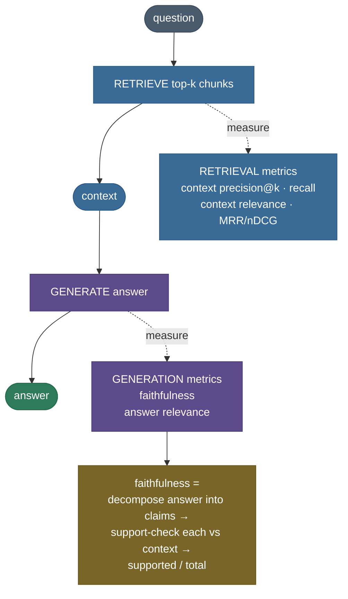

# RAG Evaluation: measure retrieval AND generation

You built a RAG pipeline. It answers questions, the demo looks great, you ship it. Then someone
asks *"what's the imager's resolution?"* and it confidently replies *"2 meters"* — fluent, well-cited,
and **wrong** (the corpus says 4). Nobody notices, because the answer *reads* correct. That is the
nightmare RAG evaluation exists to prevent: **fluent is not the same as faithful**, and "seems fine"
is not a number you can put in a CI gate.

Here's the trap made concrete. Two answers to *"what is the Helios-7 imager's resolution, and when
did it launch?"*:

- **A:** "The imager has a ground resolution of 4 meters. Helios-7 launched on March 3rd, 2024 from
  Kourou." — every claim is in the retrieved context.
- **B:** the same two sentences, plus "Helios-7 is powered entirely by solar panels." — that last
  claim is **nowhere in the corpus**. It's a hallucination.

Both read fluently. A human skimming would pass both. But **B smuggled in an ungrounded fact**, and
that's exactly the failure that erodes trust in production. The only way to catch it at scale is to
*measure* it — and this note builds the measurements from scratch.

The core idea is that RAG has **two failure surfaces you must evaluate separately**: did we fetch the
right **context** (retrieval), and given that context, is the answer **faithful** to it and **relevant**
to the question (generation)? By the end you'll be able to:

- explain **why** retrieval and generation need separate metrics — and how that localizes a failure;
- define and compute **context precision@k / recall** (retrieval) and the **RAGAS triad** —
  faithfulness, answer relevance, context relevance (generation);
- derive **faithfulness = supported-claims / total-claims** via claim decomposition + a support check;
- explain why a **faithful answer can still be useless** (why relevance is a separate axis);
- name the failure modes — **LLM-judge bias, cosine ≠ entailment, bad eval sets, metric gaming** —
  and their fixes;
- map it to production: **RAGAS, TruLens, DeepEval, LangSmith, ARES**, and the offline→CI→online loop.

> **Honesty up front — what's real vs illustrative in this chapter.** The code builds **real**
> measurements: ALL retrieval metrics (context precision/recall, MRR, nDCG — on real ranked
> retrieval from chapter 5's all-MiniLM `DenseRetriever`, reusing chapter 6's ranking metrics), the
> **support** signal (encoder cosine of each claim vs the context, chapter 8's real proxy), and
> **relevance** (embedding cosine). Every score is measured and asserted. The **illustrative** pieces
> are **claim decomposition** (splitting an answer into claims) and the **judge** (deciding
> support/relevance) — in production an LLM does both; this env is encoder-only, so claim-splitting
> is a rule-based sentence splitter and the judge is a cosine threshold. Flagged again at the code.

---

## The problem: "seems fine" doesn't survive a code change

Say your RAG works today. Tomorrow you tweak the chunk size from 512 to 256 tokens to fit more
context. Did that help or hurt? Without metrics you have **no idea** — you'd have to eyeball a
handful of answers and hope. Worse, the two things that could break are *different systems*:

- **Retrieval** could regress — smaller chunks might split the answer across two chunks, so the one
  you retrieve no longer contains the full fact.
- **Generation** could regress — with noisier context the LLM might hallucinate to fill the gap.

If you only measure "final answer looks right," you can't tell **which** broke, so you can't fix it.
And a single fluent-but-wrong answer (our "2 meters") passes a human skim. This is why RAG evaluation
is *two* evaluations, each producing numbers you can regression-test.

Here is the felt failure, measured on the real pipeline — the same two claims, one honest answer and
one that appends a hallucination:

```
FAITHFUL answer   -> faithfulness = 1.000  (2/2 claims supported)
UNFAITHFUL answer -> faithfulness = 0.667  (2/3 claims supported)
    [SUPPORTED   0.848] The Helios-7 imager has a ground resolution of 4 meters.
    [SUPPORTED   0.933] Helios-7 launched on March 3rd, 2024 from the Kourou spaceport.
    [UNSUPPORTED 0.487] Helios-7 is powered entirely by solar panels.
```

The `0.667` is the number that catches what a skim misses: one of three claims isn't in the context.
Fluency hid it; **faithfulness surfaced it.**

---

## Intuition: two inspections, like a factory line

Think of RAG as a two-station assembly line. Station 1 (**retrieval**) fetches the raw parts (context
chunks); station 2 (**generation**) assembles them into a product (the answer). When a product is
defective, you don't just inspect the finished product — you inspect **each station**, because the
fix is different depending on where the defect entered:

| Factory | RAG | Metric | If it's low, fix… |
|---|---|---|---|
| Did the right parts arrive? | did we retrieve the relevant chunks? | **context recall** | the retriever (recall) |
| Were they on top of the bin? | are relevant chunks ranked high? | **context precision@k** | the retriever (ranking) |
| Were the parts even the right kind? | is the context on-topic? | **context relevance** | the retriever / router |
| Was the product built only from the supplied parts? | is every claim grounded in context? | **faithfulness** | the generator / prompt |
| Does the product do the job asked? | does the answer address the question? | **answer relevance** | the generator |

The last three — **context relevance, faithfulness, answer relevance** — are the **RAGAS / TruLens
triad**, the generation-side inspection. The first two are the retrieval-side inspection.

**Now the follow-up that separates a real understanding from a slogan:** *if an answer is faithful
(every claim grounded), isn't it a good answer?* **No — and this is the crucial subtlety.** A perfectly
faithful answer can be **useless** if it answers the *wrong question*. Ask "what's the imager
resolution?" and get "the project lead is Dr. Amara Okoye" — every word is grounded in the corpus
(faithfulness 1.0), but it doesn't *answer the question* (low answer relevance). Faithfulness and
relevance are **orthogonal axes**: you need both high. That is exactly why the triad has three legs,
not one.


---

## The mechanism: a two-stage evaluation pipeline

Evaluation mirrors the RAG pipeline, measuring each stage independently.



The retrieval metrics run on the ranked context; the generation metrics run on the answer. The
faithfulness metric has its own internal pipeline — **decompose → check each claim → aggregate** —
which is where the semantic work (and the LLM judge, in production) lives.


---

## The math: each metric, derived

Every symbol is defined at first use. Throughout, the encoder maps a text to an $L_2$-normalized
vector $\text{enc}(\cdot)$, so a cosine similarity is a dot product $\mathbf{u} \cdot \mathbf{v} \in
[-1, 1]$.

**Faithfulness** decomposes an answer into $n$ atomic **claims** $c_1, \dots, c_n$ and counts how many
are **supported** by the retrieved context $C$ (a set of sentences $s_1, \dots, s_m$). A claim is
supported if its best cosine to any context sentence clears a threshold $\tau$:

$$\text{support}(c) = \max_{j} \; \text{enc}(c) \cdot \text{enc}(s_j), \qquad
\text{faithfulness} = \frac{\big|\{\, i : \text{support}(c_i) \ge \tau \,\}\big|}{n}.$$

The score is in $[0, 1]$: 1.0 = every claim grounded; each ungrounded (hallucinated) claim subtracts
$1/n$. We use $\tau = 0.5$, chapter 8's middle bar on unit-norm all-MiniLM cosines.

> **Source / derivation:** the supported-claims / total-claims definition is [RAGAS](https://arxiv.org/abs/2309.15217) (Es et al. 2023, §3.1 "Faithfulness"), formalized in the [RAGAS metric docs](https://docs.ragas.io/en/stable/concepts/metrics/available_metrics/). The per-claim **support** via max cosine to a context sentence is the encoder-cosine groundedness proxy from [chapter 8](../08-Advanced-RAG-Parent-Doc-Fusion-Self-RAG/08-Advanced-RAG-Parent-Doc-Fusion-Self-RAG.md) (standing in for RAGAS's LLM NLI judge — see the pitfalls).

**Answer relevance** measures whether the answer $a$ addresses the question $q$. RAGAS generates $N$
questions *from* the answer and averages their similarity to $q$; with no generator we use the direct
cosine (an illustrative simplification that captures the same signal):

$$\text{answer\_relevance}(q, a) = \text{enc}(q) \cdot \text{enc}(a).$$

An answer *about the right thing* embeds near the question; a grounded-but-off-topic answer does not.

> **Source / derivation:** answer relevance as similarity between the question and questions
> regenerated from the answer is [RAGAS](https://arxiv.org/abs/2309.15217) (Es et al. 2023, §3.2
> "Answer Relevance"); the direct $\text{enc}(q)\cdot\text{enc}(a)$ here is a labelled simplification
> of that (no generator LLM).

**Context relevance** scores how on-topic the retrieved context is for the question — the mean cosine
of each retrieved chunk $k_i$ to the question:

$$\text{context\_relevance}(q, K) = \frac{1}{|K|} \sum_{k_i \in K} \text{enc}(q) \cdot \text{enc}(k_i).$$

> **Source / derivation:** context relevance as the third leg of the triad is [TruLens's RAG Triad](https://www.trulens.org/getting_started/core_concepts/rag_triad/) and [RAGAS](https://arxiv.org/abs/2309.15217) (Es et al. 2023, §3.3); the mean-chunk-cosine form is the encoder proxy for it.

**Context precision@k** rewards ranking relevant chunks *high*. Let $\mathrm{rel}(i) = 1$ if the chunk
at rank $i$ is relevant. Then, over the top $k$:

$$\text{context\_precision@}k = \frac{\sum_{i=1}^{k} \text{Precision@}i \cdot \mathrm{rel}(i)}
{\big|\{\, i \le k : \mathrm{rel}(i) = 1 \,\}\big|}, \qquad
\text{Precision@}i = \frac{\sum_{j=1}^{i} \mathrm{rel}(j)}{i}.$$

It averages precision@$i$ only at the ranks holding a relevant chunk — so a relevant chunk at rank 1
lifts every later precision@$i$, and burying the relevant chunk lowers the score.

> **Source / derivation:** the rank-averaged context precision is [RAGAS context precision](https://docs.ragas.io/en/stable/concepts/metrics/available_metrics/) (Es et al. 2023); it is the standard Average-Precision-at-k form applied to retrieved context.

**Context recall** is the fraction of the relevant chunks (set $\mathcal{R}$) actually retrieved into
the top $k$:

$$\text{context\_recall@}k = \frac{\big|\{\, d \in \text{top-}k : d \in \mathcal{R} \,\}\big|}{|\mathcal{R}|}.$$

Recall is the **ceiling** on everything downstream: a chunk never retrieved cannot ground the answer,
no matter how good generation is. The form above is the **reference-set** (ID-based, non-LLM) recall:
you supply the set $\mathcal{R}$ of relevant chunk IDs and count how many were retrieved. Note this is
*not* RAGAS's default — RAGAS's `LLMContextRecall` instead decomposes the **ground-truth answer** into
claims and uses an LLM to attribute each claim to the retrieved context, so "recall" there means "what
fraction of the answer's claims are covered by the retrieved context." Same intent (did we retrieve
enough to answer?), different unit (chunk IDs here vs answer-claims there).

> **Source / derivation:** context recall as (relevant retrieved) / (all relevant) is classic IR recall ([Jurafsky & Martin, SLP3 Ch. 14](https://web.stanford.edu/~jurafsky/slp3/14.pdf)); the claim-attribution `LLMContextRecall` default and the reference-set `NonLLMContextRecall` variant are [RAGAS context recall](https://docs.ragas.io/en/stable/concepts/metrics/available_metrics/) (Es et al. 2023). Both in the references.

For single-gold ranking we also reuse **MRR** ($1/\text{rank}$ of the gold) and **nDCG@k** from
[chapter 6](../06-Re-ranking-Cross-Encoders/06-Re-ranking-Cross-Encoders.md) — the same ranking
metrics, applied to the retrieved context.

> **Source / derivation:** MRR and nDCG@k are defined and derived in [chapter 6 (Re-ranking)](../06-Re-ranking-Cross-Encoders/06-Re-ranking-Cross-Encoders.md); this chapter imports the very same `ndcg_at_k` / `reciprocal_rank` functions so the numbers are consistent across chapters.

---

## From-scratch: the metrics in code

Here's the core, built from primitives so every metric is inspectable. The **retrieval metrics,
support cosines, and relevance sims are real**; only **claim decomposition** and the **judge** are
labelled stand-ins for an LLM.

> **Runnable script and a step-by-step notebook:** the full verified code lives next to this page —
> the [runnable demo script](code/rag_evaluation.py) (`python rag_evaluation.py`) and the [step-by-step
> teaching notebook](code/11-RAG-Evaluation.ipynb).

Faithfulness is the heart — decompose, check each claim, aggregate:

```python
def faithfulness(dense, answer, context, threshold=SUPPORT_THRESHOLD):
    claims = split_into_claims(answer)              # ILLUSTRATIVE: rule-based; an LLM does this in prod
    supports = [claim_support(dense, c, context) for c in claims]   # REAL: max cosine to any ctx sentence
    supported = [s >= threshold for s in supports]
    return sum(supported) / len(claims)             # supported / total  ∈ [0, 1]

def claim_support(dense, claim, context):           # REAL encoder-cosine groundedness (ch8's proxy)
    ctx_sents = split_into_claims(context)
    claim_vec = dense._encode([claim])[0]           # unit-norm
    ctx_vecs = dense._encode(ctx_sents)             # (m, dim) unit-norm
    return float(np.max(ctx_vecs @ claim_vec))      # best cosine to any context sentence
```

Run it on the two answers over the same retrieved context, and the hallucination is caught:

```
FAITHFUL answer   -> faithfulness = 1.000  (2/2 claims supported)
UNFAITHFUL answer -> faithfulness = 0.667  (2/3 claims supported)
    [SUPPORTED   0.848] The Helios-7 imager has a ground resolution of 4 meters.
    [SUPPORTED   0.933] Helios-7 launched on March 3rd, 2024 from the Kourou spaceport.
    [UNSUPPORTED 0.487] Helios-7 is powered entirely by solar panels.
```


The claim-decomposition mechanism, per claim:


**Relevance is a separate axis.** A grounded answer to the *wrong* question scores high faithfulness
but low answer relevance:

```
on-topic answer   : answer relevance = 0.906
faithful-but-off-topic answer (project lead): faithfulness = 1.000, answer relevance = 0.458
```


**Retrieval metrics localize a failure to the retriever:**

```
GOOD ranking (real retrieval) top-3: [1, 0, 10]   context precision@3 = 1.000  recall@3 = 1.000
BAD  ranking (relevant buried) top-3: [2, 3, 4]    context precision@3 = 0.000  recall@3 = 0.000
```


**The full triad on the good answer** — three independent lenses, all high:


### The library one-liners (and what they map to)

Production frameworks compute exactly these metrics with an LLM as the judge. In RAGAS:

```python
# RAGAS: the four core metrics, LLM-judged (the from-scratch metrics above, productionized)
from ragas import evaluate
from ragas.metrics import faithfulness, answer_relevancy, context_precision, context_recall
result = evaluate(dataset, metrics=[faithfulness, answer_relevancy, context_precision, context_recall])

# TruLens: the RAG triad as feedback functions wrapped around your app
from trulens.core import TruSession           # context_relevance + groundedness + answer_relevance

# DeepEval: pytest-style RAG metrics with an LLM judge
from deepeval.metrics import FaithfulnessMetric, AnswerRelevancyMetric

# LangSmith: run evaluators over a dataset in CI, track scores across versions
from langsmith.evaluation import evaluate as ls_evaluate
```

- **`faithfulness`** *is* the metric above — RAGAS decomposes the answer into claims and uses an LLM
  to judge each claim's entailment by the context (an NLI decision, not a cosine).
- **`answer_relevancy`** generates questions from the answer and averages their similarity to the
  original — the version our direct cosine approximates.
- **`context_precision` / `context_recall`** are the retrieval metrics above; recall needs a **ground-
  truth answer or relevant set** (reference-based), which is why building a golden eval set matters.
- **TruLens** packages the triad as *feedback functions*; **DeepEval** exposes them as pytest metrics
  for CI; **LangSmith** runs evaluators over a dataset and tracks scores across versions; **ARES**
  trains lightweight judges instead of calling a big LLM every time.

> **Try it:** before you run the notebook's last cell, **predict**. The unfaithful answer had **3**
> claims, **2** supported → faithfulness **0.667**. Now add a **second** hallucinated claim (another
> fact absent from the context) — so **4** claims, still **2** supported. Will faithfulness go
> **up, down, or stay** at 0.667? Then run it and check. *(Hint: faithfulness = supported / total;
> the new claim grows the denominator but not the numerator, so the fraction falls — 2/4 = 0.5.
> Every ungrounded claim is punished.)* The notebook asserts **0.5**.

---

## Pitfalls and failure modes

Each pitfall below is named, shown failing, then fixed.

**1) Faithful but irrelevant (why relevance is separate).** A grounded answer to the wrong question
scores faithfulness 1.0 yet answer relevance 0.458 — measured above. If you only track faithfulness,
you'll grade a useless answer as perfect. **Fix:** always report **both** faithfulness *and* answer
relevance; they're orthogonal, and a good answer needs both high.

**2) Cosine support ≈ topic, not entailment.** The honest limit carried forward from chapter 8: the
cosine proxy measures *topical* similarity, not factual *entailment*. Swap "4 meters" → "2 meters"
and the false claim is topically near-identical, so it slips past the bar:

```
TRUE claim (4 meters)    -> support 0.848  (>= 0.5: True)
SWAPPED claim (2 meters) -> support 0.836  (>= 0.5: True)  ← a WRONG number clears the bar
```

**Fix:** this is *exactly why RAGAS uses an LLM judge* (an NLI-style entailment decision), not a
cosine threshold. The encoder proxy is a fast, cheap approximation; when factual precision matters
(numbers, dates, negations), you need the judge. Never claim the cosine proxy catches fact-swaps — it
doesn't.

**3) LLM-judge bias and variance.** The LLM judge behind these metrics is itself imperfect:
**position bias** (favouring the first answer in a pairwise comparison), **verbosity bias**
(favouring longer answers), and **self-preference** (favouring its own style). Two runs can disagree.
**Fix:** the MT-Bench remedies — **swap positions** and average, control for length, use a strong
judge, and calibrate against human labels on a sample.

> **Source / derivation:** the LLM-as-judge biases (position, verbosity, self-enhancement) and the
> position-swapping fix are [Judging LLM-as-a-Judge with MT-Bench and Chatbot Arena](https://arxiv.org/abs/2306.05685) (Zheng et al. 2023, §3), summarized practically in the [HF LLM-judge cookbook](https://huggingface.co/learn/cookbook/en/llm_judge).

**4) Reference-based vs reference-free.** Some metrics (faithfulness, answer relevance) are
**reference-free** — they need only the question, context, and answer. Others (context recall,
exact-match) need a **ground-truth** answer or relevant set. **Fix:** know which you're using; if you
have no golden answers you can still measure faithfulness/relevance, but you *cannot* measure recall
without knowing what *should* have been retrieved.

**5) Garbage eval set → meaningless scores.** A metric is only as good as the questions you run it on.
An eval set that's too easy, unrepresentative, or mislabeled produces confident, useless numbers.
**Fix:** curate a **golden set** that mirrors real traffic (hard cases, edge cases, known failures),
label it carefully, and grow it from production misses.

**6) Metric gaming.** Optimize a single metric and you'll game it — maximize faithfulness by having
the model only ever parrot the context verbatim (high faithfulness, terrible relevance and
usefulness). **Fix:** track the **whole triad plus retrieval**; a system that's good is good on *all*
axes, and a suspicious jump in one metric with drops elsewhere is the tell.

> **Gotcha:** these are proxy metrics, not ground truth. They *correlate* with quality and catch
> regressions cheaply — that's their job. They do not *prove* an answer is correct; a human review of
> a sample is still the calibration anchor.

---

## Where it's used, and when it isn't

**Used** — evaluation is worth its cost whenever you need to:

- **Gate a change** — run the eval set in CI before merging a chunker/prompt/model change; block the
  merge if faithfulness or recall regresses past a threshold.
- **Compare configurations** — chunk size, top-k, re-ranker on/off, embedding model — pick the one
  that wins on the metrics, not on vibes.
- **Monitor in production** — sample live traffic, score it, and alert when faithfulness drifts
  (a model or data change silently degraded grounding).
- **Localize a failure** — low retrieval metrics → fix the retriever; high retrieval but low
  faithfulness → fix the generator/prompt. The split is the diagnostic.

**Not worth it / careful:**

- **Tiny prototypes** — for a 10-question demo, reading the answers by hand is faster than building an
  eval harness. Evaluation earns its keep at scale and over time (regression tracking).
- **When you can't build a representative eval set** — a bad eval set gives confidently-wrong numbers;
  better to say "not yet measurable" than to trust a garbage score.
- **Trusting a single metric** — never gate on faithfulness alone (metric gaming); use the whole
  triad + retrieval.

---

## In production

The mechanism above is what the mainstream frameworks implement, with an LLM as the judge:

- **[RAGAS](https://docs.ragas.io/en/stable/concepts/metrics/available_metrics/)** — the reference-
  free framework this chapter builds toward: `faithfulness`, `answer_relevancy`, `context_precision`,
  `context_recall`, computed with an LLM judge over your (question, context, answer[, ground-truth])
  dataset.
- **[TruLens](https://www.trulens.org/getting_started/core_concepts/rag_triad/)** — packages the
  **RAG triad** (context relevance + groundedness + answer relevance) as *feedback functions* you wrap
  around a running app for live scoring and tracing.
- **DeepEval** — pytest-style RAG metrics (`FaithfulnessMetric`, `AnswerRelevancyMetric`, …) so evals
  run in your test suite and fail the build on a regression.
- **[LangSmith](https://docs.smith.langchain.com/evaluation/concepts)** evaluators — run a metric over
  a dataset in CI, track scores across versions, and diff regressions (the eval-in-CI loop).
- **[ARES](https://arxiv.org/abs/2311.09476)** — trains lightweight judges for context relevance,
  faithfulness, and answer relevance, cheaper than calling a large LLM on every example.

The production loop is **offline eval → CI regression gate → online monitoring**: build a golden set,
run RAGAS/DeepEval on every change and block regressions, then sample live traffic and alert on
drift. And the recurring judgment call — *which metric to trust* — comes back to the pitfalls: cheap
cosine proxies for fast iteration, an LLM judge (or a trained one) when factual precision matters, and
always the whole triad, never a single number.

> **Note:** the honest bottom line for a system designer: evaluation doesn't *prove* correctness — it
> *catches regressions cheaply and localizes failures*. That is enough to iterate safely, which is
> the whole point. Pair it with periodic human calibration and you have a RAG system you can actually
> improve with confidence instead of vibes.

---

## Recap and rapid-fire

**If you remember nothing else:** RAG has **two failure surfaces** — retrieval (did we fetch the right
context? → context precision/recall) and generation (is the answer faithful to it and relevant to the
question? → the RAGAS triad). **Faithfulness = supported-claims / total-claims** catches the fluent-
but-hallucinated answer a human skim misses; **answer relevance** is a separate axis (grounded ≠
useful). Measure both stages so you can **localize** a failure and **gate** changes in CI.

**Quick-fire — say these out loud:**

- *What are RAG's two evaluation surfaces?* Retrieval (context precision/recall) and generation
  (faithfulness, answer relevance).
- *Define faithfulness.* Fraction of the answer's claims that are supported by the retrieved context
  (supported / total).
- *Why is answer relevance separate from faithfulness?* A grounded answer to the wrong question is
  faithful (1.0) but useless (low relevance) — orthogonal axes.
- *What's the RAGAS/TruLens triad?* Context relevance + faithfulness + answer relevance.
- *Context precision vs recall?* Precision = are relevant chunks ranked *high*; recall = did we
  retrieve *all* the relevant chunks (the downstream ceiling).
- *Why an LLM judge, not cosine?* Cosine measures *topic*, not *entailment* — a number-swap ("2m" for
  "4m") slips past a cosine bar; an NLI judge catches it.
- *Name the LLM-judge biases.* Position, verbosity, self-preference — fix by swapping positions,
  controlling length, calibrating to humans (MT-Bench).
- *Reference-free vs reference-based?* Faithfulness/answer-relevance need no gold answer; context
  recall / exact-match need a ground-truth.
- *Where does it run?* Offline eval → CI regression gate → online drift monitoring.

---

## References and further reading

The curated link library for this topic — videos, courses, articles, papers, books, and internal
cross-links — lives in a companion file so it can be reused as a standalone reference list:

**→ [RAG Evaluation — references and further reading](11-RAG-Evaluation.references.md)**
