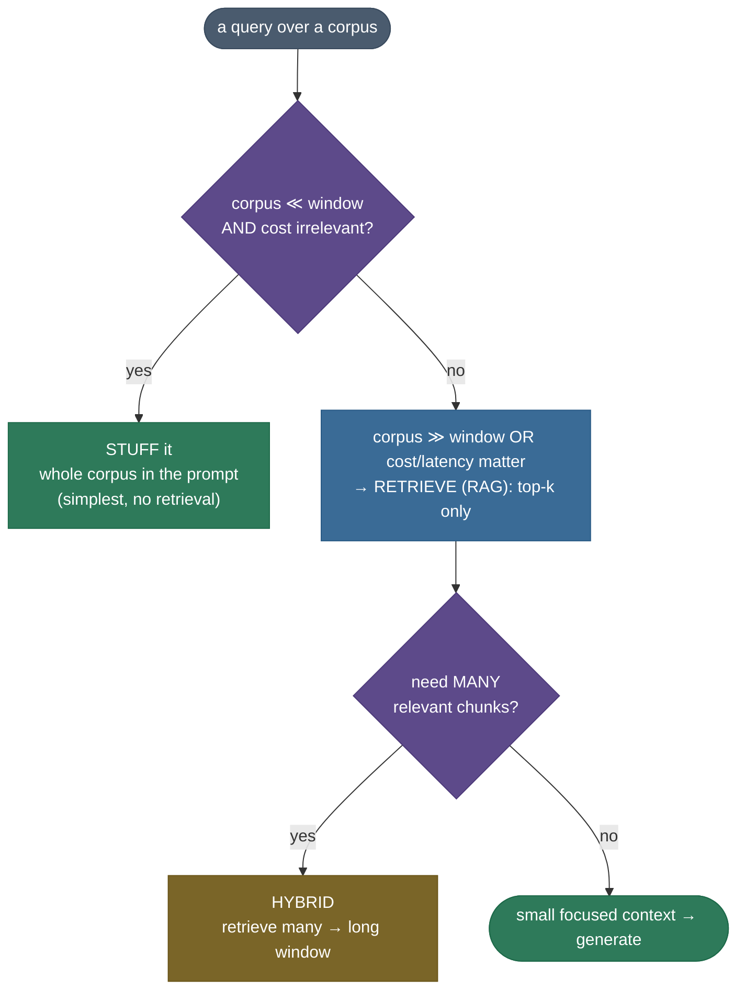
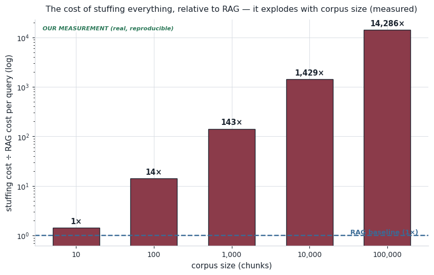
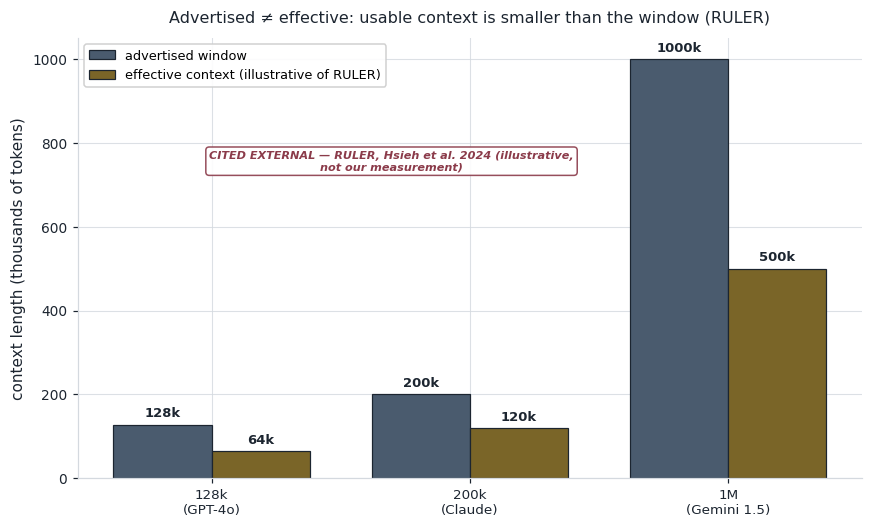

# Long-Context vs RAG: a cost-and-accuracy decision

A 2-million-token context window feels like it should kill RAG. Just paste the whole knowledge base
into the prompt and let the model sort it out — no chunking, no vector database, no retrieval to build
and maintain. It's such a tempting shortcut that "is RAG dead?" became the trendiest debate in the
field. The honest answer is **no**, and the reasons are concrete, not tribal: stuffing everything in
costs money *on every query*, the model reads the *middle* of a long context worst, and its **usable**
context is smaller than the number on the box. A corpus of any real size makes all three bite at once.

Here's the trap made concrete. You have a 100,000-chunk corpus (~10M tokens). Stuff it into the prompt
and **every single query** re-pays for all 10M tokens; RAG retrieves the ~5 relevant chunks and pays
for ~700 tokens. At the same price that's a **~14,000× cost difference per query** — and the 10M
tokens don't even fit in a 2M window. Long context isn't a *replacement* for retrieval; it's a bigger
*place to put* what retrieval selects.

I'll walk this the way I'd reason about it choosing an architecture for a real product. We'll feel the
cost first (real arithmetic), then the two accuracy failures (lost-in-the-middle and effective context),
then the decision rule. By the end you'll be able to:

- do the **cost math** — where stuffing's per-query cost crosses RAG's fixed cost, and why the gap
  explodes with corpus size;
- explain **lost-in-the-middle** — why accuracy dips for mid-context evidence, citing the evidence;
- distinguish **advertised context from effective context** (RULER) — the window ≠ what's usable;
- apply the **decision rule** — stuff vs retrieve vs hybrid, by corpus-size-vs-window and cost;
- reason about how **prompt caching** shifts the cost math without erasing the accuracy problems.

> **Honesty up front — our measurement vs cited external.** The code builds two **real, reproducible**
> measurements: the **cost arithmetic** (token counts × prices) and an **encoder dilution proxy** (real
> all-MiniLM cosines over the shared corpus). Every number those print is computed and asserted. The
> **lost-in-the-middle U-curve** (Liu et al. 2023), the **effective-vs-advertised context** gap
> (RULER, Hsieh et al. 2024), and **provider window sizes / prices** are **cited external** constants
> from their papers/docs — we label them as such and never pass them off as our own measurement.

---

## The problem: a big window doesn't make the tokens free

The seductive pitch for long context is *simplicity*: skip the retrieval stack entirely. And for a
small, bounded corpus that fits comfortably in the window, stuffing genuinely is the right call — it's
less to build. The trouble starts the moment the corpus grows, because three costs grow with it.

**Cost per query scales with tokens.** You pay per input token, *every query*. Stuffing an $N$-chunk
corpus costs $N \times (\text{tokens per chunk})$ tokens **on every request**; RAG retrieves a fixed
top-$k$ and pays a fixed amount regardless of $N$. Underneath, attention is $O(n^2)$ in context length
$n$, so a long prompt is also *slower* and more compute-heavy — latency grows with context too.

**You pay for mostly-irrelevant tokens.** If one chunk answers the question and you stuffed 100,000,
you paid to process 99,999 irrelevant ones — and, as we'll see, dragging them along actively *hurts*
accuracy, not just cost.

Here is the cost failure, measured on the real cost model (100 tokens/chunk, RAG retrieves $k=5$ +
overhead = 700 tokens/query, at a representative \$3 / 1M input tokens):

```
 corpus (chunks) | stuff tokens |  stuff $/q |   RAG $/q | cheaper
------------------------------------------------------------------------------
               7 |          700 |   0.00210$ |  0.00210$ | stuff  <- just below (stuffing still wins)
               8 |          800 |   0.00240$ |  0.00210$ | RAG  <- crossover (RAG wins from here)
              10 |        1,000 |   0.00300$ |  0.00210$ | RAG
             100 |       10,000 |   0.03000$ |  0.00210$ | RAG
           1,000 |      100,000 |   0.30000$ |  0.00210$ | RAG
         100,000 |   10,000,000 |  30.00000$ |  0.00210$ | RAG
```

Read the top two rows together: at **7 chunks** stuffing still ties/wins (the 700-token RAG overhead
dominates a tiny corpus); at **8 chunks** — the crossover — RAG takes the lead and never gives it back.
Past it, RAG is cheaper on *every* query and the gap only widens: at 100k chunks, stuffing costs
~14,000× RAG's per-query tokens. The crossover is small precisely because stuffing's cost grows *per
chunk per query* while RAG's is fixed.


> **Note:** the *exact* crossover depends on your chunk size, top-$k$, and prices — but the *shape*
> is robust: a per-query-growing cost always overtakes a fixed one, and then diverges. The interesting
> number isn't the crossover (usually tiny); it's the **multiplier at scale**, which is where the
> money actually goes.

---

## Intuition: re-read the whole book, or look up the page

Long context is like **re-reading the entire book from page one every time someone asks you a
question**. You *can* do it — a big enough memory holds the whole book — but you re-read all 900
irrelevant pages to answer a question about page 40, every single time, and by the time you reach the
middle your attention has wandered. RAG is like **using the index**: look up the two pages that matter,
read those. A bigger working memory doesn't remove the value of the index; it just lets you put *more*
of the right pages in front of you once you've found them.

Map it to the mechanism, because the analogy holds under pressure:

| Re-reading the book | Long-context stuffing |
|---|---|
| re-reading all 900 pages each question | re-processing the whole corpus every query (cost) |
| attention wandering in the middle chapters | lost-in-the-middle: worst recall for mid-context evidence |
| the book being longer than you can hold | corpus > context window (it simply doesn't fit) |
| "I read it but can't use all of it" | effective context < advertised window (RULER) |
| using the index to find the 2 right pages | RAG: retrieve the top-$k$ relevant chunks |
| putting those pages *and a few neighbors* on your desk | hybrid: retrieve many → place in a long window |

**The follow-up that decides the debate:** *doesn't a 2M-token window just kill RAG?* No — for three
reasons the window size can't fix. **(1) Cost** still scales per token per query, so stuffing a huge
corpus is expensive forever. **(2) Lost-in-the-middle** means even when it *fits*, accuracy sags for
anything buried mid-prompt. **(3) Effective context** (what the model can actually use) is well below
the advertised window. A bigger box changes *how much you can stuff*, not *whether stuffing is the
right move*.

---

## The mechanism: the decision path

The whole chapter reduces to one decision, driven by corpus-size-vs-window and whether cost/latency
matter.




---

## The math: cost, the crossover, and position

Every symbol is defined at first use.

**Per-query token cost.** Let $N$ be the corpus size in chunks, $t$ the tokens per chunk, $k$ the number
of chunks RAG retrieves, $h$ a fixed prompt overhead (question + instructions), and $p$ the price per
token. Then:

$$\text{cost}_{\text{stuff}}(N) = N \cdot t \cdot p, \qquad \text{cost}_{\text{RAG}} = (k \cdot t + h)\cdot p.$$

Stuffing is **linear in the corpus size $N$**; RAG is **constant** (independent of $N$). Attention's
compute is $O(n^2)$ in the context length $n = N t$, so a long prompt costs more *and* runs slower —
the token price is only part of the penalty.

> **Source / derivation:** the $O(n^2)$ attention scaling in context length is Vaswani et al.'s
> scaled dot-product attention ([Attention Is All You Need](https://arxiv.org/abs/1706.03762), §3.2);
> the per-token dollar cost is provider input pricing (cited in the references). The token-count
> comparison here is our own arithmetic in `long_context_vs_rag.py`.

**The crossover.** RAG is cheaper exactly when $\text{cost}_{\text{RAG}} < \text{cost}_{\text{stuff}}(N)$.
The price $p$ cancels (both sides scale with it), so the crossover is a pure token comparison — the
smallest corpus size $N^\ast$ with $N^\ast t > k t + h$:

$$N^\ast = \left\lfloor \frac{k t + h}{t} \right\rfloor + 1.$$

For $t=100$, $k=5$, $h=200$: $N^\ast = \lfloor 700/100 \rfloor + 1 = 8$ chunks. Below it stuffing wins
(the overhead dominates on a tiny corpus); at and beyond it, RAG wins, and the ratio
$\text{cost}_{\text{stuff}}/\text{cost}_{\text{RAG}} = Nt/(kt+h)$ grows without bound.

> **Source / derivation:** this crossover is our own derivation, computed and asserted in
> `long_context_vs_rag.py` (`cost_crossover_chunks`); it's a direct consequence of comparing the two
> cost formulas above.



**Lost-in-the-middle: accuracy vs position.** Empirically, an LLM's answer accuracy is a **U-shaped
function of where the relevant evidence sits** in the context: highest at the very start or end,
lowest in the middle. Liu et al. (2023) measured, on multi-document QA, a drop from ~**75%** (gold at
position 1) to ~**54%** (gold in the middle) — roughly **20 points** — recovering toward the end.

> **Source / derivation:** the accuracy-vs-position U-curve is [Lost in the Middle](https://arxiv.org/abs/2307.03172) (Liu et al. 2023) — *their* measured result on GPT-3.5/Claude-class models, cited here (not our measurement). The related "usable context < advertised window" finding is [RULER](https://arxiv.org/abs/2404.06654) (Hsieh et al. 2024).


This is *why* placement matters: retrieval hands the model a few chunks it can put where it reads
best, instead of burying the answer in the middle of a million tokens.

---

## From-scratch: the cost model and an honest accuracy proxy

The code makes two things real and keeps a third clearly external.

> **Runnable script and a step-by-step notebook:** the full verified code lives next to this page —
> the [runnable demo script](code/long_context_vs_rag.py) (`python long_context_vs_rag.py`) and the
> [step-by-step teaching notebook](code/12-Long-Context-vs-RAG.ipynb).

**(1) The cost model — our real arithmetic:**

```python
def stuff_tokens(corpus_chunks, tokens_per_chunk=100):
    return corpus_chunks * tokens_per_chunk          # every chunk, every query

def rag_tokens(k=5, tokens_per_chunk=100, overhead=200):
    return k * tokens_per_chunk + overhead           # fixed, independent of corpus size

def cost_crossover_chunks(k=5, tokens_per_chunk=100, overhead=200):
    fixed_rag = rag_tokens(k, tokens_per_chunk, overhead)
    return fixed_rag // tokens_per_chunk + 1          # smallest corpus where stuffing > RAG
```

**(2) The context-dilution proxy — our real encoder measurement.** The true lost-in-the-middle effect
needs a generative LLM (this env is encoder-only), so we measure a *retrieval-visible shadow* of it:
as we surround a gold "needle" passage with more distractors, does the gold's **margin** (its cosine
lead over the best distractor) shrink? It does — and RAG's focused top-$k$ keeps it wide:

```
 # distractors | best distractor cos | gold margin
---------------------------------------------------
             0 |               0.000 |       0.804   ← RAG focused (gold alone)
             5 |               0.600 |       0.204
           100 |               0.615 |       0.189
           500 |               0.617 |       0.187   ← stuffed (77% narrower margin)
```


> **Note (be precise about what this proves):** the dilution proxy is a **retrieval-side** measurement —
> it shows *more irrelevant context makes the needle harder to pick out*, with real cosines. It is
> **not** a measurement of the LLM's mid-context accuracy drop; that is the *cited* Liu et al. result.
> We keep the two strictly separate on the page and in every figure.

**(3) Effective vs advertised context — cited external (RULER).** A model's advertised window (128k,
200k, 1M…) is not the length over which it can reliably *use* information. RULER (Hsieh et al. 2024)
showed effective context is well below the advertised number:



### The provider landscape (verified context sizes)

```python
# window sizes verified against provider docs; prices are representative input rates (cited)
PROVIDERS = (
    Provider("GPT-4o (128k)",          128_000,   2.50, "OpenAI API docs"),
    Provider("Claude Sonnet (200k)",   200_000,   3.00, "Anthropic docs"),
    Provider("Gemini 1.5 Pro (1M–2M)", 2_000_000, 1.25, "Google Developers Blog"),
)
```

- **GPT-4o / GPT-4 Turbo:** 128,000-token context ([OpenAI API docs](https://developers.openai.com/api/docs/models/gpt-4o)).
- **Claude (3.5 Sonnet and current Haiku):** 200,000-token context ([Anthropic docs](https://platform.claude.com/docs/en/docs/about-claude/models)).
- **Gemini 1.5 Pro:** 1,048,576 tokens, extended to **2,000,000** ([Google Developers Blog](https://developers.googleblog.com/en/new-features-for-the-gemini-api-and-google-ai-studio/)).

> **Note (pricing detail):** providers often charge a **higher input rate above ~128k tokens** — e.g.
> Gemini's long-context tier is priced above its short-context rate ([Google pricing](https://ai.google.dev/pricing)),
> which makes stuffing a *huge* prompt cost *even more* than the flat rate used above. But the
> **crossover itself is price-independent** — the price $p$ cancels in the comparison
> $Nt\,p$ vs $(kt+h)\,p$ — so a higher long-context rate only *widens* the gap in RAG's favour; it
> never moves the crossover.

Even the largest window is finite: a 1M-chunk corpus (~100M tokens) overflows a 2M-token window
outright — so past some corpus size, retrieval isn't a *cheaper* option, it's the *only* one that
scales.

> **Try it:** before you run the notebook's last cell, **predict**. The default crossover uses $k=5$
> retrieved chunks (a 700-token RAG cost) and lands at ~**8 chunks**. If you retrieve **more** context
> per query — say $k=20$ — does the crossover corpus size go **up, down, or stay the same**? Then run
> it and check. *(Hint: a bigger $k$ raises RAG's fixed cost, so stuffing has to reach a **larger**
> corpus before it overtakes — the crossover moves **up**.)* The cell asserts the $k=20$ crossover
> (23 chunks) is larger than the $k=5$ one (8 chunks).

---

## Pitfalls and failure modes

Each pitfall is named, shown failing, then fixed.

**1) "Long context = no RAG."** The headline mistake: assuming a big window removes the need for
retrieval. It ignores the two costs a window can't fix — **per-query dollars** (stuffing a large corpus
is expensive forever) and **lost-in-the-middle** (buried evidence is read worst). **Fix:** treat the
window as a *budget to fill wisely*, not a reason to dump everything; retrieve, then place the few
right chunks in the window.

**2) Paying for irrelevant tokens.** Stuffing means paying to process the 99,999 chunks that don't
answer the question — on every query. **Fix:** the crossover math — beyond a small corpus, RAG's fixed
cost wins and the gap widens; retrieve.

**3) Context window ≠ effective context.** Buying a 1M-token model and assuming you get 1M usable
tokens. RULER shows the effective context is smaller — reliability degrades well before the advertised
limit. **Fix:** don't fill the whole window; keep the *relevant* content within the *effective* range,
which is exactly what retrieval does.

**4) Stuffing degrades precision and faithfulness.** More irrelevant context doesn't just cost money —
it dilutes the signal (our dilution proxy) and gives the model more rope to hallucinate or cite the
wrong passage, *lowering* answer quality even when the answer is technically present. **Fix:** a smaller,
focused, retrieved context typically scores *higher* on the RAGAS metrics from
[chapter 11](../11-RAG-Evaluation/11-RAG-Evaluation.md) than a giant stuffed one.

**5) Latency and cache implications.** A long prompt has a long prefill (compute-bound) and a large KV
cache ([ch. KV-Cache](../../09.%20LLMs/05-KV-Cache/05-KV-Cache.md)), so latency and memory grow with
context. **Prompt caching** helps *if the long prefix is reused across queries* — you pay to process it
once and cache it — but it does **not** fix lost-in-the-middle, and it only helps when the same big
context is queried repeatedly. **Fix:** use caching for a shared, static long prefix; use retrieval
when the relevant slice differs per query.

> **Gotcha:** prompt caching changes the *cost* math (a reused prefix becomes near-free after the
> first call) but leaves the *accuracy* math untouched — a cached million-token prompt is still read
> worst in the middle. Don't let a caching win talk you out of retrieval when accuracy is the concern.

---

## Where it matters, and when to reach for each

- **Stuff (long context):** the corpus is small and bounded (a single contract, one codebase module,
  a handful of docs), fits comfortably inside the *effective* window, cost/latency don't matter, and
  simplicity wins. This is a real and good choice — don't build a retrieval stack you don't need.
- **Retrieve (RAG):** the corpus is large or dynamic (a wiki, a document store, anything that grows or
  changes), cost/latency matter, or you need freshness (retrieve the current version) — the common
  production case.
- **Hybrid (retrieve → long window):** you need *many* relevant chunks (multi-hop questions, broad
  synthesis). Retrieve a generous set, then place them in a long window so the model sees all the
  evidence at once. This is where big windows *and* retrieval combine — the window is the place, RAG
  is the selection.

---

## In production

- **Provider windows (verified):** GPT-4o/4-turbo **128k**, Claude **200k**, Gemini 1.5 Pro **1M→2M**.
  Large, but finite — and effective < advertised (RULER), so retrieval is still the scaling answer.
- **Benchmarks that decide it:** **needle-in-a-haystack** (can the model find one fact in a long
  context?), **RULER** (effective context across task types), and head-to-head studies — Databricks'
  measured long-context-RAG results, and the "RAG or long-context?" and "revisits" papers — all land on
  *both/hybrid*, not "one killed the other."
- **Prompt caching** ([Gemini context caching](https://ai.google.dev/gemini-api/docs/long-context),
  Anthropic/OpenAI prompt caching): if a big context is reused across many queries, cache it and pay to
  process it once — this shifts the cost crossover meaningfully, but not the accuracy story.
- **The pricing reality:** input tokens cost money per call; at scale, retrieving ~700 tokens vs
  stuffing millions is the difference between a viable product and a runaway bill.

The recurring engineering answer, verified by the studies: **long context and RAG are complements, not
competitors.** Use retrieval to *select* what's worth putting in a large window; use the large window
to *hold* more of what retrieval found.

---

## Recap and rapid-fire

**If you remember nothing else:** a big context window doesn't kill RAG. Stuffing the whole corpus
costs money *per query* (RAG's cost is fixed), the model is **lost in the middle** (worst recall for
mid-context evidence), and **effective context < advertised window** (RULER). Use retrieval to select
the few right chunks; use the big window to hold more of them (hybrid). Stuff only when the corpus is
small, fits the *effective* window, and cost doesn't matter.

**Quick-fire — say these out loud:**

- *Does a 2M window kill RAG?* No — cost scales per token per query, lost-in-the-middle, and effective
  context < advertised.
- *Cost of stuffing vs RAG?* Stuffing = $N t p$ (grows with corpus); RAG = $(kt+h)p$ (fixed). RAG wins
  past a small crossover, and the gap widens.
- *What is lost-in-the-middle?* Accuracy is a U-curve in the position of the evidence — best at the
  edges, worst in the middle (~20-point drop, Liu et al. 2023).
- *Advertised vs effective context?* Usable context is smaller than the window (RULER) — don't fill it
  to the brim.
- *When do you stuff?* Small/bounded corpus that fits the effective window, cost irrelevant, simplicity
  wins.
- *When hybrid?* Need many relevant chunks — retrieve many, place them in a long window.
- *Does prompt caching change the answer?* It changes the *cost* math for a reused prefix, not the
  *accuracy* math (still lost in the middle).
- *Provider windows?* GPT-4o 128k, Claude 200k, Gemini 1.5 Pro 1M→2M — all finite; retrieval scales
  past them.

---

## References and further reading

The curated link library for this topic — videos, courses, articles, papers, books, and internal
cross-links — lives in a companion file so it can be reused as a standalone reference list:

**→ [Long-Context vs RAG — references and further reading](12-Long-Context-vs-RAG.references.md)**
