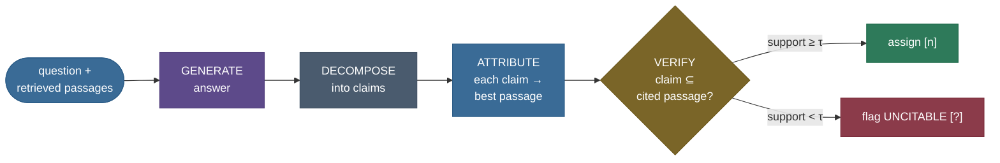

# Citations & Attribution: make every claim checkable

Ask a RAG system a question and you get back a paragraph that *sounds* authoritative — confident,
fluent, specific. Here is the uncomfortable part: **you cannot tell, by reading it, which sentences
came from the retrieved documents and which the model made up.** A fluent hallucination and a
grounded fact look identical on the page. The whole promise of RAG — "grounded in *your* documents"
— evaporates the moment the reader can't check.

Citations are the fix, and they are deceptively deep. This note is about attaching every **claim** in
the answer to the exact **source passage** it came from, so the reader can verify it — and about
*measuring* how well that attachment was done. We'll build **post-hoc attribution** from scratch on
CPU (decompose the answer into claims, match each to its best-supporting retrieved passage, assign a
citation, and flag any claim that matches nothing as **uncitable** — the likely hallucination), then
measure it with **citation precision and recall**. By the end you'll be able to:

- explain the difference between **coarse** (which document) and **fine** (which exact span)
  attribution, and **generation-time** (model emits `[1]` as it writes) vs **post-hoc** (map claims
  back afterward);
- **build** post-hoc attribution and read the per-claim verdict — cited vs uncitable;
- **derive and compute** citation precision and recall, and reason about what each punishes
  (false citations, over-citation, missing citations);
- explain — and *demonstrate* — why a cosine matcher assigns **false citations** (cosine ≈ topic,
  not entailment), and why ALCE/AIS score citations with an **NLI entailment model**;
- reach for the right production API (Anthropic Citations, Vertex grounding, LlamaIndex
  `CitationQueryEngine`) and know what it does under the hood.

> **Honesty up front (this is the standing caveat of the whole page).** The attribution *matching*
> (each claim's cosine to each retrieved passage, via ch5's `all-MiniLM` encoder) and the
> *precision/recall* numbers are **real and measured** — every one is printed by an executed
> notebook cell and asserted before it's claimed. The **claim decomposition** (splitting an answer
> into claims) and the **generator** are **illustrative stand-ins** for an LLM — this environment is
> encoder-only. And the carried caveat from [ch8](../08-Advanced-RAG-Parent-Doc-Fusion-Self-RAG/08-Advanced-RAG-Parent-Doc-Fusion-Self-RAG.md)/[ch11](../11-RAG-Evaluation/11-RAG-Evaluation.md):
> encoder cosine measures **topical** similarity, not **entailment** — so it can (and here does)
> assign a **false citation**. That gap is the reason production attribution uses an NLI judge.

---

## The problem: a fluent wrong answer is indistinguishable from a right one

Here is a real RAG answer to *"When did Helios-7 launch, what is its imager resolution, and what
powers it?"*, generated over three retrieved passages:

> Helios-7 launched on March 3rd, 2024 from the Kourou spaceport. Its hyperspectral imager has a
> ground resolution of 4 meters. Helios-7 is powered entirely by solar panels.

Three claims, one flowing paragraph. Two of them are grounded in the retrieved passages. **One is a
hallucination** — nothing in the corpus says anything about solar panels; the model filled a gap
with a plausible-sounding fact. Read the paragraph again: **which one is the invented claim?** You
can't tell. It reads exactly as confidently as the true claims. That is the failure mode citations
exist to kill — and in a legal brief, a medical summary, or an enterprise report, that indistinguishable
false claim is the one that gets someone sued, misdiagnosed, or fired.

Now watch what post-hoc attribution does to the *same* answer once each claim is attached to its
source (these are the real per-claim verdicts our code prints):

```
claim 1: CITED [2] (cos 0.933)  <- The Helios-7 satellite was launched on March 3rd, 2024 ...
claim 2: CITED [1] (cos 0.782)  <- Helios-7 carries a hyperspectral imager with a ground resolution of 4 meters.
claim 3: UNCITABLE (best cos 0.488 < 0.5)  <- no passage supports this
```

The two grounded claims each snap to the passage that supports them, carrying a citation you can
click and verify. The solar-panels claim matches *no* retrieved passage above the bar — it is
flagged **`[?]` uncitable**, and *that flag is the signal*: the one claim you cannot verify is the
one to distrust. A citation isn't decoration; it's the difference between "trust me" and "check for
yourself."

> **Note:** attribution and hallucination detection are two sides of one coin. A claim that
> **cannot** be attributed to any source is, by construction, the claim most likely to be
> hallucinated. Citations don't just *display* provenance — the *absence* of provenance is itself a
> hallucination alarm.

---

## Intuition first: a bibliography for every sentence

Think of how a careful researcher writes. Every factual sentence carries a footnote `[1]`, `[2]`
pointing at the exact source it came from, and the bibliography lets any reader **follow the footnote
back and check**. If a sentence has no honest footnote — no source actually says it — the researcher
either cuts it or marks it as their own speculation. Citations in RAG are that discipline, applied
mechanically to a model's output.

The analogy holds under a follow-up, which is where most analogies break. Ask: *"can't I just put a
footnote next to any sentence that's on the same topic?"* No — and that's the crux. A footnote is
only honest if the cited source **actually says** the thing. A source paragraph *about* the project
lead does **not** license a footnote on a sentence naming a *different* lead in a *different* city,
even though they're on the same topic. A real footnote requires **entailment** (the source supports
*this specific claim*), not mere topical adjacency. Keep that distinction — it's the single most
important idea on this page, and the one our from-scratch cosine matcher will get *wrong* on purpose,
so you can see exactly why production systems reach for something stronger.


Two axes organize everything that follows:

- **Coarse vs fine attribution.** *Coarse* points a claim at a whole **document** ("see Doc A") —
  cheap, but the reader still has to hunt for the sentence. *Fine* points at the **exact span** (the
  specific sentence or character range) — the verifiable ideal, and what the best production APIs
  return.
- **Generation-time vs post-hoc.** *Generation-time* attribution has the model emit `[1]` **as it
  writes**, so the citation is part of decoding. *Post-hoc* attribution generates first, then maps
  each claim back to the context **afterward** — which works on *any* model's output, no special
  decoding required. We build post-hoc (the honest thing in an encoder-only environment) and point
  at the real generation-time APIs.


---

## The mechanism: retrieve → generate → decompose → attribute → verify

Post-hoc attribution is a stage that runs **after** generation. Its pipeline:



Read it left to right: the model generates an answer from the retrieved passages; we **decompose**
the answer into atomic claims; for each claim we **attribute** it to the retrieved passage that best
supports it; and we **verify** — is the claim actually entailed by that passage? If the support
clears a threshold τ, assign the citation `[n]`; if nothing clears it, flag the claim **uncitable**.
The verify step is the load-bearing one: a good verifier checks *entailment*, and the whole "cosine ≠
entailment" story below is about what happens when your verifier is a cheap topical proxy instead.

![The full attribution pipeline: retrieve → generate → decompose → attribute → verify, with the
verify step branching to "assign [n]" or "flag UNCITABLE". Two callouts: the post-hoc vs
generation-time regimes, and the honest bar (does the passage ENTAIL the claim? cosine ≈ topical
match; an NLI model checks true entailment). Matches the Mermaid diagram above.](../images/rag13_attribution_pipeline.png)

> **Note:** the **generation-time** path collapses "generate" and "attribute" into one step — the
> model is prompted (or trained) to emit `[1][2]` inline while decoding, so attribution *is* part of
> generation. That's what Anthropic's Citations API, Vertex grounding, and LlamaIndex's
> `CitationQueryEngine` do. Post-hoc is more general (works on any output) and is what we can build
> and *measure* here honestly; the two are complementary, and production stacks often do both
> (generate with citations, then verify them post-hoc).

---

## The math: attribution matching, then citation precision & recall

Let the answer decompose into claims $s_1, \dots, s_m$ and the retrieval return passages
$p_1, \dots, p_k$. Attribution needs two ingredients: a way to **match** a claim to a passage, and a
way to **score** the whole set of assignments.

### Matching a claim to a source

We need a support function $\phi(s_i, p_j) \in [0,1]$: *how strongly does passage $p_j$ support claim
$s_i$?* The **honest** definition is **entailment** — does a reader, given $p_j$, agree that $s_i$
follows? That's a natural-language-inference (NLI) judgment. Our **computable proxy** (the one we can
run on CPU with no LLM) is the **encoder cosine** ch8/ch11 already use:

$$
\phi(s_i, p_j) \;=\; \cos\!\big(E(s_i),\, E(p_j)\big) \;=\; E(s_i) \cdot E(p_j),
$$

where $E(\cdot)$ is the `all-MiniLM-L6-v2` embedder and both vectors are **L2-normalized**, so the
cosine *is* the dot product. The claim is **attributed** to its best passage, and **cited** only if
that best support clears a threshold τ:

$$
j^\star_i = \arg\max_j \phi(s_i, p_j), \qquad
\text{cite}(s_i) = \begin{cases} j^\star_i & \text{if } \phi(s_i, p_{j^\star_i}) \ge \tau \\[2pt] \varnothing \;(\text{uncitable}) & \text{otherwise.} \end{cases}
$$

We use **τ = 0.5** — ch8/ch11's deliberate middle bar on unit-norm `all-MiniLM` cosines: a claim
genuinely paraphrasing a passage scores ~0.6–0.9 and clears it; an off-topic or fabricated claim
scores ~0.0–0.3 and does not. Every symbol here — $E$, the cosine, τ, the argmax — is exactly what
the code computes.

> **Source / derivation:** [ALCE — *Enabling LLMs to Generate Text with Citations*, Gao et al. 2023 (EMNLP)](https://arxiv.org/abs/2305.14627)
> defines citation quality with a support function $\phi$ realized by an **NLI entailment model**;
> our cosine $\phi$ is the computable proxy for that entailment check (the same encoder-cosine
> groundedness proxy carried from [ch8](../08-Advanced-RAG-Parent-Doc-Fusion-Self-RAG/08-Advanced-RAG-Parent-Doc-Fusion-Self-RAG.md)/[ch11](../11-RAG-Evaluation/11-RAG-Evaluation.md)).
> The "attributable iff the source supports the statement" definition of attribution is [AIS —
> *Measuring Attribution in NLG*, Rashkin et al. 2021](https://arxiv.org/abs/2112.12870), applied to
> QA by [*Attributed QA*, Bohnet et al. 2022](https://arxiv.org/abs/2212.08037).

### Scoring the attribution: citation precision and recall

Once each claim is assigned a citation (or flagged uncitable), we grade the result against ground
truth. Let $G_i \subseteq \{1,\dots,k\}$ be the set of passages that **genuinely** support claim
$s_i$ (a human/NLI judgment; $G_i = \varnothing$ for a hallucination). Then:

$$
\textbf{citation precision} = \frac{\#\{\,i : \text{cite}(s_i) \neq \varnothing \ \wedge\ \text{cite}(s_i) \in G_i\,\}}{\#\{\,i : \text{cite}(s_i) \neq \varnothing\,\}},
$$

$$
\textbf{citation recall} = \frac{\#\{\,i : G_i \neq \varnothing \ \wedge\ \text{cite}(s_i) \in G_i\,\}}{\#\{\,i : G_i \neq \varnothing\,\}}.
$$

In words: **precision** is *of the claims that cite a source, how many cite a genuinely-supporting
one?* — it punishes **false citations** (citing a passage that doesn't support the claim) and
**over-citation**. **Recall** is *of the supportable claims, how many got a correct citation?* — it
punishes **missing citations** (a grounded claim left uncited). Crucially, a **hallucinated claim is
not in recall's denominator** ($G_i = \varnothing$): correctly leaving it uncited *helps precision*
(it isn't a false cite) and is *invisible to recall*. That asymmetry is exactly right — you should
never be *rewarded* for citing something unsupportable, only *penalized* for it.

> **Source / derivation:** [ALCE, Gao et al. 2023 (§3, citation recall & precision)](https://arxiv.org/abs/2305.14627)
> defines **citation recall** = 1 iff the concatenated citations *entail* the statement (via an NLI
> model $\phi$), and **citation precision** = 1 iff the statement has recall and no cited passage is
> *irrelevant* (a passage that alone can't support the statement and whose removal doesn't change
> support). Our per-claim single-citation form is the same quantities specialized to one gold passage
> per claim, computed on the cosine proxy in place of ALCE's NLI $\phi$.

> **Note:** these mirror the retrieval precision/recall from [ch11](../11-RAG-Evaluation/11-RAG-Evaluation.md),
> but on a *different object*: ch11 measured whether the **retriever** fetched the right chunks; here
> we measure whether the **attributor** cited the right passage for each *claim in the answer*. A
> pipeline can have perfect retrieval and still cite badly.

---

## Worked example, from scratch: attribute the answer, then measure

Here is the whole attributor from primitives — decompose, match each claim to its best passage via
real encoder cosine, assign a citation above τ or flag uncitable. It reuses ch5's `DenseRetriever`
(the `all-MiniLM` encoder ch8/ch11 also use), so every number is the chapter's own. It runs on CPU
in a couple of seconds.

> **Runnable script and a step-by-step notebook:** the verified code lives next to this page — the
> [step-by-step teaching notebook](code/13-Citations-and-Attribution.ipynb) and the
> [runnable demo script](code/citations_attribution.py) (`python citations_attribution.py`). Every
> number quoted below is printed by an executed cell and asserted before it's claimed.

```python
import numpy as np
from citations_attribution import (
    DenseRetriever, full_corpus, retrieve_passages, split_into_claims,
)

SUPPORT_THRESHOLD = 0.5  # τ: a claim is citable only if its best-passage cosine clears this bar

def claim_passage_scores(dense, claim, passages):
    """Cosine of one claim against every retrieved passage (real all-MiniLM output, unit-norm)."""
    claim_vec = dense._encode([claim])[0]            # unit-norm claim embedding
    passage_vecs = dense._encode(list(passages))     # (k, dim), unit-norm rows
    return passage_vecs @ claim_vec                  # dot == cosine, one score per passage

def attribute(dense, answer, passages, threshold=SUPPORT_THRESHOLD):
    """Decompose -> for each claim, cite the best passage above tau, else flag UNCITABLE."""
    out = []
    for claim in split_into_claims(answer):          # illustrative sentence split (stands in for an LLM)
        scores = claim_passage_scores(dense, claim, passages)  # REAL encoder cosine
        best = int(np.argmax(scores))
        citable = scores[best] >= threshold
        out.append((claim, best + 1 if citable else None, float(scores[best])))  # (claim, [n] or None, cos)
    return out

corpus = full_corpus()
dense = DenseRetriever(corpus)
passages, _ = retrieve_passages(dense, corpus, k=3)
ANSWER = ("Helios-7 launched on March 3rd, 2024 from the Kourou spaceport. "
          "Its hyperspectral imager has a ground resolution of 4 meters. "
          "Helios-7 is powered entirely by solar panels.")  # 2 grounded claims + 1 hallucination

for claim, cite, cos in attribute(dense, ANSWER, passages):
    tag = f"[{cite}]" if cite else "[?] UNCITABLE"
    print(f"{tag:>14} (cos {cos:.3f})  {claim}")
```

Output (real, from the executed notebook):

```
           [2] (cos 0.933)  Helios-7 launched on March 3rd, 2024 from the Kourou spaceport.
           [1] (cos 0.782)  Its hyperspectral imager has a ground resolution of 4 meters.
 [?] UNCITABLE (cos 0.488)  Helios-7 is powered entirely by solar panels.
```

Read it top to bottom. The launch claim matches the launch passage at **cos 0.933** and cites `[2]`;
the resolution claim matches the imager passage at **cos 0.782** and cites `[1]`; the solar-panels
hallucination's best match is only **cos 0.488** — *below* τ = 0.5 — so it's flagged **uncitable**.
The invented claim is the one with no valid source, exactly as it should be.


### Now measure it: citation precision & recall

Attribution you can't grade is attribution you can't trust. Supply a labelled gold — launch &
resolution are supportable (one passage each); solar-panels is unsupportable — and score the
attributor:

```python
from citations_attribution import (
    attribute_claims, build_golds, citation_precision, citation_recall,
)
attributions = attribute_claims(dense, ANSWER, passages)
golds = build_golds(passages)                       # launch & resolution supportable; solar-panels not
print("citation precision =", citation_precision(attributions, golds))  # 1.0
print("citation recall    =", citation_recall(attributions, golds))     # 1.0
```

```
citation precision = 1.000   (of emitted citations, how many point to a supporting passage)
citation recall    = 1.000   (of supportable claims, how many got a correct citation)
```

On this clean case the attributor is **perfect on both axes**: it cited the two grounded claims to
their true passages (precision 1.0) and cited both supportable claims (recall 1.0), while correctly
leaving the hallucination uncited. Now the interesting part — the two ways this goes wrong.

### The library one-liner (generation-time)

Post-hoc attribution is the general tool. In production you often want **generation-time** citation,
where the model emits `[1]` as it writes and the API returns the exact cited span. The real one-liners
(verified against each provider's docs; see [Where it's used](#where-its-used-and-why-it-matters)):

```python
# Anthropic Citations API — set citations.enabled on a document; the response carries
# `cited_text` + `document_index` + start/end char indices (sentence-chunked, fine-grained).
import anthropic
client = anthropic.Anthropic()
client.messages.create(
    model="claude-opus-4-8", max_tokens=1024,
    messages=[{"role": "user", "content": [
        {"type": "document",
         "source": {"type": "text", "media_type": "text/plain",
                    "data": "The Helios-7 imager has a ground resolution of 4 meters."},
         "title": "Helios-7 spec", "citations": {"enabled": True}},   # <- the whole feature
        {"type": "text", "text": "What is the imager resolution? Cite your source."},
    ]}],
)
# each answer block comes back with a `citations` list: cited_text + document_index + start/end char
```

```python
# LlamaIndex CitationQueryEngine — splits sources into citation chunks, injects [1][2] into the
# prompt, and returns response.source_nodes so you can verify each citation.
from llama_index.core.query_engine import CitationQueryEngine
engine = CitationQueryEngine.from_args(index, citation_chunk_size=512)  # granularity dial
response = engine.query("What is the Helios-7 imager resolution?")
print(response)                # answer text with inline [1], [2] ...
print(response.source_nodes)   # the chunks each [n] points to — verify here
```

Both do what our from-scratch code does, minus the honesty tax: the model (or API) is the claim
extractor *and* the verifier. The mechanism you just built is what's running under the label.

---

## Pitfalls & failure modes

Attribution is where "looks fine" and "is fine" diverge hardest. Each pitfall below is named, shown
failing on real numbers, then fixed.

### Pitfall 1 — false citation: cosine ≈ topic, not entailment

This is *the* pitfall, and it's the honest limit of the entire from-scratch approach. Encoder cosine
measures **topical** similarity; a real citation requires **entailment** (the passage actually
supports *this* claim). A claim that is topically near a passage it does **not** entail — indeed one
the passage **contradicts** — still scores high, so the matcher assigns a **false citation**.

Watch it happen on a claim that names the *wrong* project lead in the *wrong* city:

```
claim (CONTRADICTED by the passage it will be cited to):
  "The Helios-7 project lead is Dr. Lars Vinter, based in the Oslo office."
cosine cites passage [3] at cos 0.711  (clears 0.5: True)
  passage [3]: "The project lead for Helios-7 is Dr. Amara Okoye, based in the Nairobi office."
```

The claim shares the passage's vocabulary ("project lead", "office", "Helios-7"), so cosine rates it
at **0.711** — comfortably above τ — and **cites it**. But the passage says the lead is *Amara Okoye
in Nairobi*; the claim says *Lars Vinter in Oslo*. The citation is topically plausible and factually
**wrong** — the cited passage actively contradicts the claim. Cosine cannot tell "*about* the project
lead" from "*entails* this lead."

> **Source / derivation:** [ALCE, Gao et al. 2023](https://arxiv.org/abs/2305.14627) uses a
> **natural-language-inference (NLI) entailment model** for its support function $\phi$ precisely
> because topical similarity is insufficient; the [AIS framework, Rashkin et al. 2021](https://arxiv.org/abs/2112.12870)
> defines attribution as *"a generic hearer would affirm the statement, given the source"* — an
> entailment condition, not a similarity one.

**The fix:** verify with an **NLI entailment model** (or an LLM judge prompted "does passage P
support claim C? yes/no"), not raw cosine. Cosine is a fast *candidate generator* — use it to shortlist
the likely source, then run entailment to confirm. The two-stage "retrieve-by-cosine, verify-by-NLI"
pattern is exactly how ALCE, RARR, and production groundedness checks work.

### Pitfall 2 — over-citation drops precision

The lazy fix for "I don't want missing citations" is to cite *everything* — drop the threshold to
zero so every claim gets its argmax passage. That force-cites the hallucination too, adding a **false
citation** and tanking precision:

```
with threshold 0, the hallucination is force-cited to passage [3] (cos 0.488)
citation precision: 1.000 (thresholded)  ->  0.667 (over-cited)
citation recall   : 1.000 (thresholded)  ->  1.000 (unchanged)
```

Precision falls **1.00 → 0.667** (one of three emitted citations is now wrong); recall is
**unchanged** — the hallucination was never in its denominator. **The fix:** keep the support
threshold. τ is the precision/recall dial — raise it to cite *less but cleaner* (higher precision,
risk of missing a weakly-worded true claim), lower it to cite *more* (higher recall, risk of false
cites). Tune it on a labelled set, exactly as you'd tune a retrieval threshold.


### Pitfall 3 — missing citations: a grounded claim left uncited

The opposite failure: a threshold set too high (or a weak matcher) leaves a genuinely-supported claim
**uncited**, so a reader can't verify a claim that *was* actually grounded. This tanks **recall** (a
supportable claim got no correct citation) and erodes trust just as badly — an unverifiable true
claim is treated with the same suspicion as a false one. **The fix:** measure recall, not just
precision; a system that cites nothing has perfect precision and useless recall. The two metrics only
mean something *together*.

### Pitfall 4 — wrong-span citation

Even a *correct* document can be cited at the *wrong span*. Coarse attribution ("see Doc A") is
technically right but forces the reader to hunt; a citation pointing at the wrong sentence *within*
the right document is worse — it looks precise but sends the reader to text that doesn't support the
claim. **The fix:** fine-grained attribution (sentence- or character-level spans, like the Anthropic
Citations API's `start_char_index`/`end_char_index`), and verify the *span*, not just the document,
entails the claim.

### Pitfall 5 — post-hoc misattribution: the model didn't use the cited passage

The subtlest one. In **post-hoc** attribution we find the passage that best *matches* a claim after
the fact — but that's not proof the model *used* that passage. The model may have produced the claim
from its **parametric knowledge** (what it memorized in pretraining) and we retroactively found a
context passage that happens to agree. The citation looks grounded but the generation wasn't. **The
fix:** generation-time attribution (the model commits to `[1]` *while* producing the claim, so the
citation reflects the actual source used), or attribution methods that inspect the generation, not
just the surface text. Post-hoc attribution answers "*is* this claim supported by the context?"; only
generation-time answers "did the model *use* the context to make this claim?"

---

## Try it: predict, then run {#try-it}

The two grounded claims above matched their sources closely (cos 0.93, 0.78). Now add a **second
hallucination** to the answer — a claim about the launch site's *weather* that no passage states:
*"The Kourou spaceport enjoyed clear skies on launch day."*

> **Try it:** **predict, before you run the [notebook](code/13-Citations-and-Attribution.ipynb) cell.**
> The new answer has 4 claims — 2 supportable (launch, resolution) and 2 unsupportable (solar panels,
> weather). What will citation **recall** be? And will the weather claim be flagged **uncitable** like
> the solar-panels one (keeping **precision** at 1.0), or will it *sneak a false citation*?

Now run it. The asserted cell prints:

```
claim 4:  [2] (best cos 0.535)  The Kourou spaceport enjoyed clear skies on launch day.
citation precision = 0.667   citation recall = 1.000
emitted citations: 3   false citations: 1
```

**Recall holds at 1.000** — both supportable claims still cite correctly, and the hallucinations
never entered recall's denominator. But **precision drops to 0.667**, because the weather claim
**does not get flagged** — it shares the launch passage's vocabulary ("Kourou", "launch day"), scores
**cos 0.535** (just over τ), and **false-cites passage [2]**. This is Pitfall 1, live: a topical
match that isn't entailment slips a false citation past the cosine bar. (The solar-panels claim, with
*no* topical anchor in the corpus, stays correctly uncitable at 0.488.) The lesson the number proves:
**cosine ≠ entailment** — which is exactly why the fix is an NLI judge, not a lower threshold.

---

## Where it's used, and why it matters {#where-its-used-and-why-it-matters}

Citations are the feature that turns RAG from a demo into something a professional will stake their
name on. Where it shows up (each verified against the provider's own docs):

- **Consumer answer engines.** [Perplexity](https://www.perplexity.ai/) and Bing/Copilot put **inline
  numbered citations** on every answer, sourced from live web results — the citation *is* the product,
  because it's what makes a synthesized answer trustworthy enough to act on.
- **Anthropic Citations API.** Set `"citations": {"enabled": true}` on a document and Claude returns,
  for each answer block, a `citations` list with the exact **`cited_text`**, the **`document_index`**,
  and **character-level span** (`start_char_index`/`end_char_index`) — documents are sentence-chunked,
  so citations are fine-grained and verifiable. Generation-time attribution, done right.
- **Vertex AI grounding.** Google's `generateContent` returns **`groundingMetadata`** with
  **`groundingChunks`** (the supporting sources) and **`groundingSupports`** that link each generated
  segment back to the chunks that support it — grounding + citations in one response.
- **LlamaIndex `CitationQueryEngine`.** Splits source nodes into citation chunks (`citation_chunk_size`,
  default 512), injects `[1][2]` numbering into the prompt, and returns `response.source_nodes` so you
  can verify each citation. The from-scratch mechanism of this page, as a library.
- **The ALCE benchmark.** [Gao et al. 2023](https://arxiv.org/abs/2305.14627) is the standard way to
  *measure* citation quality (recall & precision via NLI) across ASQA/QAMPARI/ELI5 — how you'd evaluate
  any of the above.
- **Post-hoc attribution & revision.** [RARR (Gao et al. 2022)](https://arxiv.org/abs/2210.08726)
  finds attribution for *any* model's output and edits unsupported claims — the research lineage of the
  post-hoc attributor you built.

**When it matters most:** anywhere the answer will be **acted on** and a wrong claim is expensive —
**legal** (cite the statute/case, or the brief is malpractice), **medical** (cite the study, or the
recommendation is dangerous), **enterprise/financial** (cite the filing, or the report is
unauditable). In these domains an *uncited* claim is not just unhelpful — it's unusable, and a
*falsely-cited* one is worse than no answer, because it *looks* verified. **When it matters less:**
brainstorming, creative writing, or single-source summarization where provenance is already obvious —
citation overhead buys little.

---

## Recap and rapid-fire

**If you remember nothing else:** a fluent RAG answer hides which claims are grounded and which are
invented, so **attach every claim to the source passage it came from** — cite it if a passage
supports it, flag it **uncitable** if none does (the likely hallucination). Measure the attachment
with **citation precision** (of emitted citations, how many are correct — punishes false & over-
citation) and **recall** (of supportable claims, how many got cited — punishes missing citations).
And the load-bearing caveat: a cosine matcher cites by **topic**, not **entailment**, so it assigns
**false citations** — which is why real systems verify with an **NLI/entailment judge**.

**Quick-fire — say these out loud:**

- *Why cite at all?* A fluent hallucination is indistinguishable from a grounded fact; the citation
  (or its absence) is what lets a reader verify.
- *Coarse vs fine attribution?* Coarse = which document; fine = which exact span (sentence/char
  range) — fine is the verifiable ideal.
- *Generation-time vs post-hoc?* Generation-time: model emits `[1]` as it writes (Anthropic/Vertex/
  LlamaIndex). Post-hoc: map claims back after the fact (works on any output).
- *Citation precision vs recall?* Precision = of emitted citations, fraction correct (punishes false/
  over-citation). Recall = of supportable claims, fraction cited (punishes missing citations).
- *Why does a hallucination not hurt recall?* It's not in recall's denominator ($G_i=\varnothing$);
  correctly leaving it uncited only helps precision.
- *Why cosine ≠ a valid citation?* Cosine ≈ topical match; a citation needs **entailment**. A passage
  *about* X doesn't *entail* a specific false claim about X — the false-citation trap.
- *How do you fix false citations?* Verify with an **NLI entailment model** (ALCE/AIS), not raw
  cosine; use cosine only to shortlist candidates.
- *What's the risk of post-hoc attribution specifically?* Misattribution — the model may have used
  parametric knowledge, and you retroactively matched a passage that merely agrees.

---

## References and further reading

The curated link library for this topic — videos, courses, articles, papers, and internal
cross-links — lives in a companion file so it can be reused as a standalone reference list:

**→ [Citations & Attribution — references and further reading](13-Citations-and-Attribution.references.md)**
