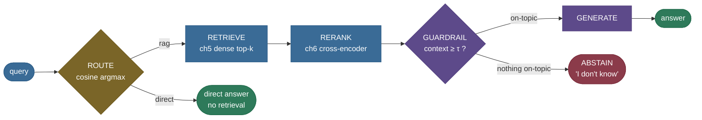

# LLM App Orchestration: wire real steps into one chain, route, and run a graph

By now you have the *steps* of a real LLM app scattered across the last dozen chapters: a retriever
(ch5), a re-ranker (ch6), an agent router (ch10), a grounding guardrail (ch14). A production app is
none of these alone — it is **all of them wired together** into a pipeline: retrieve → rerank →
guardrail → generate → format, often with **branching** (route a query to the right path), state
passing, retries, and error handling. The question this chapter answers is the one every "build an
LLM app" interview eventually reaches: *how do you actually structure that?*

The naive answer — one big glue function that calls each step in sequence — breaks the moment the app
grows. This note builds a tiny **orchestrator** from scratch (typed **steps** over a shared **state**,
a **chain** that composes them, a **router** that picks the path, a **stateful graph** that adds
cycles, and **retry** that recovers transient failures), then **wires a real mini-RAG app** out of the
earlier chapters' actual steps. By the end you'll be able to:

- explain the three orchestration shapes — sequential **chain**, **routed** branch, cyclic **graph** —
  and when each is the right tool;
- **build** a typed step/chain/router/graph and **wire** real retrieve/rerank/guardrail steps into one app;
- explain **routing** as a scoring decision (a cosine argmax over path descriptions) and read its
  confidence from the **margin**;
- reason about what the orchestrator adds over bare function composition — **retries, branching,
  state, observability** — and why a giant glue function has none of them;
- reach for the right framework (LangChain **LCEL**, **LangGraph**, LlamaIndex **QueryPipeline**,
  **DSPy**) and know what each one is.

> **Honesty up front.** The **orchestration primitives** (Step, Chain, Router argmax, StatefulGraph
> run-loop, retry/backoff) and every **wired step** — retrieval (ch5), re-rank (ch6), the grounding
> gate (ch14), the cosine route (ch10's idea) — are **real and measured**: every trace line, router
> score, and retry count is printed by an executed notebook cell and asserted before it's claimed.
> The only **illustrative** piece is the **generate** step's answer *text* (no LLM in this env — it
> surfaces the top passage so the guardrail has something concrete to gate). The pipeline that
> produces it is real. Carried caveat: the grounding gate uses encoder cosine (topic, not entailment),
> so a wired step keeps its own documented limits — orchestration wires steps honestly; it doesn't
> upgrade them.

---

## The problem: one giant glue function has no retry, no branch, no trace

Here is the app everyone writes first — a single function that calls each step in order:

```python
def answer(query):
    docs = retriever.search(query)          # ch5
    reranked = reranker.rerank(query, docs) # ch6
    context = reranked[:2]
    answer = llm.generate(query, context)   # an API call
    return guardrail.check(answer, context) # ch14
```

It works in the demo. Then reality arrives:

- **The LLM call fails transiently** (a rate limit, a 503). The whole function throws, and the user
  gets a stack trace instead of an answer. There is nowhere to add a **retry**.
- **A greeting comes in** ("hi there"). You don't want to run retrieval + re-rank + an LLM call for
  chit-chat, but the function has no way to **branch** — every query pays for every step.
- **The answer is wrong and you can't see why.** Did retrieval miss? Did the re-ranker mis-order? Did
  the guardrail mis-fire? The function is a black box — no **trace** of which step did what.
- **A step quietly clobbers shared state** (two steps both write a `context` variable). A
  hard-to-find bug, because nothing enforces that steps only *add* to the state.

None of these are LLM problems — they're **orchestration** problems. The fix is to stop writing glue
and start composing *typed steps* that an orchestrator runs, threading state, handling retries, and
recording a trace. That is the entire chapter.

---

## Intuition first: an assembly line with a foreman

Think of the app as a factory **assembly line**. Each **station** (step) does one job to the product
(the state) and passes it down the line: station 1 retrieves parts, station 2 sorts them, station 3
inspects, station 4 assembles. The line runs left to right, and the product accumulates work at each
station.

But a bare conveyor belt isn't enough — you also need a **foreman** (the orchestrator) standing over
the line, who does the things no single station can: if a station jams, the foreman **re-runs** it
(retry) instead of shutting down the whole factory; the foreman **routes** a product to the express
lane or the full line depending on what it is; and the foreman keeps a **logbook** of every station
each product passed through (the trace), so when a defect ships you can see exactly where it came from.

The analogy holds under the obvious follow-up — *"isn't this just function composition? `c(b(a(x)))`?"*
Yes, the **line itself** is function composition over a typed state: `Chain([a, b, c])(s) == c(b(a(s)))`.
But the **foreman** is what function composition doesn't give you: retries, routing, a step budget for
loops, and a trace. That's the whole value the orchestrator adds on top of `∘`. Composition is the
*what*; the orchestrator is the *how*.


The three shapes you compose with — increasing in power:

- **Chain (sequential):** `A → B → C`, a fixed order. Function composition over a typed state.
- **Routed (branch):** a router picks `B1` vs `B2` by scoring the input. One decision, then a chain.
- **Graph (stateful, cyclic):** nodes + edges where each edge decides the next node *from the state*,
  so the app can **branch** and **loop** (a retry edge, an agent loop) — bounded by a step budget.


---

## The mechanism: route → retrieve → rerank → guardrail → generate

The wired app is a **router** in front of two **chains** — a RAG chain and a direct chit-chat chain —
with the guardrail as a step *inside* the RAG chain that can divert to an abstain exit:



Read it left to right: the **router** scores the query against each route's description and dispatches
it (a fact query → the RAG chain, a greeting → the direct chain); the RAG chain **retrieves**
candidates (ch5), **re-ranks** them (ch6), runs the **guardrail** (ch14: is the retrieved context
on-topic for the query?), and either **generates** an answer or **abstains**. Every arrow is a real
step transforming the shared state; the trace records each one.

> **Note:** the guardrail runs *before* generation on purpose — it asks "did retrieval find anything
> on-topic?" (context relevance ≥ τ), and if not, the app abstains rather than pay for a generation it
> would only have to refuse. That's an orchestration decision — *where* in the chain a check sits — that
> a giant glue function makes implicitly and an explicit chain makes visible and movable.

---

## The math: a chain is `f∘g∘h`; routing is a cosine argmax

### A chain is typed function composition

A step is a typed function over the app's state, $\text{step}: S \to S$. A chain composes them:

$$
\text{Chain}([f_1, f_2, \dots, f_n])(s) \;=\; (f_n \circ \dots \circ f_2 \circ f_1)(s) \;=\; f_n(\dots f_2(f_1(s))\dots).
$$

The state $s$ is **immutable**: each step returns a *new* copy with fields *added*, never mutated in
place. That immutability is what makes the pipeline safe — a step can only extend the state, so no step
can silently clobber a field another relies on, and every intermediate version is recorded in the trace.

> **Source / derivation:** the "everything is a composable, typed `Runnable`, chained with `|`" model
> is [LangChain Expression Language (LCEL)](https://python.langchain.com/docs/concepts/lcel/) — `chain
> = prompt | model | parser` is exactly this $f_n \circ \dots \circ f_1$ over a state, with the
> orchestrator adding streaming, batching, and retries around each `Runnable`.

### Routing is an argmax over a similarity score

The router turns "which path?" into a **scoring decision**. Each route $r_j$ has a natural-language
description $d_j$; embed them once with the encoder $E$. At query time, embed the query and score it
against every description, then take the argmax:

$$
\text{route}(q) \;=\; \arg\max_{j}\, \cos\!\big(E(q),\, E(d_j)\big).
$$

This is exactly ch10's tool-routing decision applied to whole sub-chains: a real learned-embedding
score, not a hand-written `if`. The **margin** between the top two scores measures the router's
confidence — a wide margin is a clear-cut route, a narrow one is a borderline query where you'd add a
fallback.

> **Source / derivation:** semantic routing — embed each route's description and pick the query's
> nearest — is [LangChain's routing recipes](https://python.langchain.com/docs/how_to/routing/) and
> the same cosine-vs-tool-description decision from [ch10 Agentic RAG](../10-Agentic-RAG/10-Agentic-RAG.md);
> the argmax uses `np.argmax`, which breaks ties by first occurrence (deterministic).

### A graph generalizes the chain with a bounded run loop

A stateful graph is nodes (named steps) + edges, where each edge is a function $e: S \to \text{name}$
picking the next node from the current state (`""` stops). The run loop applies the current node, then
follows its edge, for at most `max_steps` iterations:

$$
s_{t+1} = \text{node}_{c_t}(s_t), \qquad c_{t+1} = e_{c_t}(s_{t+1}), \qquad t < \text{max\_steps}.
$$

Because an edge can return a node already visited, the graph can **loop** — and the step budget
`max_steps` is what guarantees it terminates (the same stop condition ch10's agent loop uses). A chain
is the special case where every edge is fixed.

> **Source / derivation:** the stateful, cyclic, checkpointable graph model is [LangGraph's
> `StateGraph`](https://docs.langchain.com/oss/python/langgraph/) — `add_node` / `add_edge` /
> `add_conditional_edges` / `compile`, with a state threaded through and cycles bounded by a recursion
> limit; our `StatefulGraph` is that model in miniature.

---

## Worked example, from scratch: wire the app, route, retry

The whole orchestrator from primitives, then the real mini-RAG app wired from prior chapters. It runs
on CPU in a couple of seconds.

> **Runnable script and a step-by-step notebook:** the verified code lives next to this page — the
> [step-by-step teaching notebook](code/15-LLM-App-Orchestration.ipynb) and the
> [runnable demo script](code/orchestration.py) (`python orchestration.py`). Every number quoted below
> is printed by an executed cell and asserted before it's claimed.

### The primitives: a typed state, a step, a chain

```python
from dataclasses import dataclass, replace

@dataclass(frozen=True)
class AppState:                       # the immutable state threaded through every step
    query: str
    context: tuple[str, ...] = ()
    answer: str = ""
    trace: tuple[str, ...] = ()       # the observability log
    def log(self, msg):               # each step appends to the trace
        return replace(self, trace=(*self.trace, msg))

@dataclass(frozen=True)
class Chain:                          # sequential composition == f∘g∘h over the state
    steps: tuple
    def __call__(self, state):
        for step in self.steps:
            state = step(state)       # each step returns a NEW state (no mutation)
        return state
```

### Wire the real steps and run the app

```python
from orchestration import build_app, full_corpus, FACT_QUERY
app = build_app(full_corpus())        # router + RAG chain (ch5 retrieve, ch6 rerank, ch14 guardrail) + direct chain
result = app.run(FACT_QUERY)
for line in result.trace:
    print(line)
print("ANSWER:", result.answer)
```

Output (real, from the executed notebook):

```
[route] 'What is the ground resolution of...' -> 'rag' (cosine 0.552)
[retrieve] top-4 candidates: [1, 0, 2, 10]
[rerank] kept top-2: [1, 10]
[guardrail] context relevance 0.817 -> context is on-topic -> allow
[generate] from doc pool [1, 10]
ANSWER: Helios-7 carries a hyperspectral imager with a ground resolution of 4 meters.
```

One `app.run(...)` wired **four real steps** and produced a **5-line trace** — you can see the route
(cosine **0.552**), the retrieved candidates (**[1, 0, 2, 10]**), the reranked survivors (**[1, 10]**),
the guardrail's context-relevance check (**0.817** ≥ τ), and the generated answer. That trace is the
observability a giant glue function can't give you.


### Routing: contrasting queries take different paths

```python
for query in (FACT_QUERY, "Hey there, how are you doing today?"):
    scores = app.router.route_scores(query)   # cosine to each route description
    chosen, score = app.router.route(query)   # argmax
    pairs = ", ".join(f"{r.name}={s:.3f}" for r, s in zip(app.router.routes, scores))
    print(f"{query[:38]:40} -> {chosen.name:7} [{pairs}]")
```

```
What is the ground resolution of the He -> rag     [rag=0.552, direct=0.053]
Hey there, how are you doing today?      -> direct  [rag=0.113, direct=0.284]
```

The fact query peaks on `rag` (**0.552** vs 0.053); the greeting peaks on `direct` (**0.284** vs
0.113). A real embedding decision — no hand-written keyword rules.


### Retry: a transient failure the orchestrator recovers

```python
from orchestration import FlakyStep, with_retry, AppState, StepError
flaky = FlakyStep(fail_times=1)                  # raises once, then succeeds
recovered = with_retry(flaky, max_attempts=3)(AppState(query="probe"))
for line in recovered.trace:
    print(line)
```

```
[retry] 'flaky-retrieve' failed attempt 1: transient fault (call 1)
[flaky] succeeded on call 2
[retry] 'flaky-retrieve' succeeded on attempt 2
```

The *same* transient fault that would crash the naive glue function is caught, retried, and
**recovered on attempt 2** — with every attempt logged to the trace. That is the foreman re-running a
jammed station instead of shutting down the line.


### The library one-liners

Our from-scratch orchestrator is the mechanism. In production you reach for a framework (each verified
against its current docs; see [Where it's used](#where-its-used-and-why-it-matters)):

```python
# LangChain LCEL — compose Runnables with the pipe operator; .invoke() runs the chain.
chain = prompt | model | output_parser          # f∘g∘h over the state, streaming/batching for free
result = chain.invoke({"question": "What is the imager resolution?"})
```

```python
# LangGraph — a stateful, cyclic graph: add nodes + edges, compile, invoke.
from langgraph.graph import StateGraph, START, END
builder = StateGraph(AppStateSchema)
builder.add_node("retrieve", retrieve_node)
builder.add_node("generate", generate_node)
builder.add_edge(START, "retrieve")
builder.add_conditional_edges("retrieve", route_by_relevance, ["generate", END])  # branch on state
builder.add_edge("generate", END)
graph = builder.compile()
graph.invoke({"query": "What is the imager resolution?"})
```

```python
# LlamaIndex QueryPipeline — a DAG of modules linked explicitly.
# (LlamaIndex now recommends Workflows for NEW pipelines; QueryPipeline remains for existing DAGs.)
from llama_index.core.query_pipeline import QueryPipeline
qp = QueryPipeline()
qp.add_modules({"retriever": retriever, "reranker": reranker, "synth": response_synthesizer})
qp.add_link("retriever", "reranker", dest_key="nodes")
qp.add_link("reranker", "synth")
qp.run(query="What is the imager resolution?")
```

Each does what our code does — compose typed steps, thread state, add retries/branching — behind a
richer API.

---

## Pitfalls & failure modes

Each pitfall below is named, shown failing, then fixed.

### Pitfall 1 — the giant glue function

The failure we opened with: one function that calls every step inline. It works until you need a
retry (nowhere to add one), a branch (every query pays for every step), or a trace (it's a black box).
**The fix:** compose *named typed steps* an orchestrator runs — retries, routing, and tracing become
cross-cutting concerns added *around* the steps, not tangled *inside* them. The whole chapter is this fix.

### Pitfall 2 — silent failures

A mid-chain step fails and the pipeline either crashes with a raw stack trace or, worse, swallows the
error and returns a corrupted result. In our retry demo the naive step does exactly this:

```
naive step (no retry): CRASHED -> transient fault (call 1)
```

**The fix:** make failure a first-class, *typed* signal (a `StepError`) the orchestrator handles —
retry the transient ones with backoff, fall back on the permanent ones, and **log every attempt** so
the failure is visible, not silent. `with_retry` turns the crash above into the logged recovery shown
earlier.

### Pitfall 3 — state-mutation bugs

Two steps both write a shared mutable field; the second silently overwrites the first, and you get a
bug that only appears when those steps run in a particular order. **The fix:** an **immutable** state —
each step returns a `replace(...)` *copy* that can only *add* fields. A step physically cannot clobber
another's data, and the trace records every version. Our `AppState` is frozen for exactly this reason.

### Pitfall 4 — over-orchestration

The opposite error: reaching for a graph framework, a router, and a checkpointer for an app that is
*one prompt*. The framework's abstraction tax (learning curve, debugging opacity, dependency weight)
buys nothing when there's nothing to orchestrate. **The fix:** match the shape to the app — a single
LLM call is a function; a fixed 3-step pipeline is a chain; only reach for a **routed** or **cyclic
graph** when you genuinely branch or loop. Don't pay for orchestration you don't use.

### Pitfall 5 — no tracing (debugging opacity)

Even with a framework, if you can't see *which step ran and what it produced*, a wrong answer is
un-debuggable — did retrieval miss, the reranker mis-order, or the guardrail mis-fire? **The fix:**
trace every step (our `state.log(...)` per step; in production, **LangSmith** or **Langfuse**). The
5-line trace our app prints is the difference between "the answer is wrong" and "the *rerank* step
dropped the right passage." Observability is not optional in an orchestrated app.

---

## Try it: predict, then run {#try-it}

The router chose `rag` for the fact query with a *wide* margin (cosine **0.552** vs **0.053** ≈ **0.499**
apart). Now consider a vague request that is neither a clean fact lookup nor a clear greeting:
**"Can you help me with something?"**

> **Try it:** **predict, before you run the [notebook](code/15-LLM-App-Orchestration.ipynb) cell.**
> Which route wins — `rag` or `direct`? And what will the *margin* between the two cosine scores be,
> compared to the clean fact query's ≈ 0.499?

Now run it. The asserted cell prints:

```
'Can you help me with something?'
  -> direct (0.088)   [rag=0.058, direct=0.088]   margin=0.030
borderline margin 0.030  <  clean fact-query margin 0.499
```

The router still picks a side by argmax (`direct`), but the **margin is 0.030** — a *sixteenth* of the
clean fact query's 0.499. That tiny margin is the real lesson of semantic routing: it's a **soft**
argmax, and a low-margin query sits right on the boundary where a one-word change could flip the route.
A confident router decision has a wide margin; a borderline one has a narrow margin — and the narrow
ones are exactly where you'd add a **fallback**, a tie-break rule, or escalate to an LLM router. The
number (0.030 vs 0.499) is what tells you *how much* to trust the route.

---

## Where it's used, and why it matters {#where-its-used-and-why-it-matters}

Orchestration is the layer every real LLM app is built on. The production toolkit (each verified
against its current docs):

- **LangChain LCEL / Runnables.** The `chain = prompt | model | parser` pipe model — everything is a
  composable `Runnable` with `.invoke()`, `.stream()`, `.batch()` — so streaming, batching, and retries
  come for free with composition. The chain-as-`f∘g∘h` idea, productized.
- **LangGraph.** A **stateful, cyclic, checkpointable** graph: `StateGraph` with `add_node`,
  `add_edge`, `add_conditional_edges`, `compile`, and a threaded state. The tool for branching, loops,
  human-in-the-loop, and durable long-running agents — a superset of the chain.
- **LlamaIndex QueryPipeline.** A **DAG** of modules linked with `add_modules` + `add_link` (or a
  sequential `chain=[...]`), purpose-built for RAG pipelines (retriever → reranker → synthesizer).
  (LlamaIndex now recommends **Workflows** for new pipelines; `QueryPipeline` remains for existing DAGs.)
- **DSPy.** [Khattab et al. 2023](https://arxiv.org/abs/2310.03714) — a **declarative** framework:
  you write **signatures** and **modules**, and a **compiler/optimizer** tunes the prompts (and
  demonstrations) to a metric, instead of you hand-writing prompt chains.
- **Haystack pipelines.** Another node-and-edge pipeline framework for search/RAG apps, with the same
  compose-typed-components model.
- **Tracing (LangSmith / Langfuse).** The observability layer — per-step traces, latencies, token
  counts — that turns Pitfall 5's black box into a debuggable pipeline.

**When to reach for a framework vs plain code:** a single LLM call is a **function** — no framework. A
fixed retrieve → rerank → generate pipeline is a **chain** (LCEL or 20 lines of your own, like this
chapter's). Reach for a **graph** (LangGraph) only when you genuinely **branch or loop** —
agent loops, human-in-the-loop, retry cycles, multi-turn state. Reach for **DSPy** when you want the
*prompts themselves* optimized rather than hand-tuned. The failure mode (Pitfall 4) is reaching for
the heavy tool too early; the other failure mode (Pitfall 1) is never reaching for one at all.

---

## Recap and rapid-fire

**If you remember nothing else:** a real LLM app is a **pipeline of typed steps over a shared state**,
not one glue function. Compose them as a **chain** (`f∘g∘h`), add a **router** (a cosine argmax over
path descriptions) to branch, and graduate to a **stateful graph** (nodes + edges + a step budget) when
you loop. The orchestrator is what a bare `c(b(a(x)))` is missing: **retries, branching, immutable
state, and a trace** — the four things that make an app robust, testable, and observable.

**Quick-fire — say these out loud:**

- *Chain vs router vs graph?* Chain = fixed sequence (`f∘g∘h`); router = pick a path by scoring the
  input; graph = nodes + state-dependent edges (branch + loop), bounded by a step budget.
- *Isn't a chain just function composition?* Yes — plus retries, routing, state threading, and
  observability the orchestrator adds around the composition.
- *How does semantic routing decide?* Argmax of cosine(query, route-description) — a real embedding
  decision; the top-two **margin** is its confidence.
- *Why immutable state?* So a step can only *add* fields, never silently clobber another's — kills the
  state-mutation bug and gives you a full trace.
- *What does the orchestrator add over glue code?* Retry/fallback, branching/routing, a bounded run
  loop for cycles, and per-step tracing.
- *When NOT to use a framework?* A one-prompt app — over-orchestration is a real pitfall; match the
  shape to the app.
- *LCEL vs LangGraph?* LCEL: linear `|` chains of Runnables. LangGraph: stateful cyclic graphs
  (branch, loop, checkpoint) — reach for it when a linear chain isn't enough.
- *How do you debug a wrong answer?* The trace — see which step ran and what it produced (LangSmith /
  Langfuse in production).

---

## References and further reading

The curated link library for this topic — videos, courses, articles, papers, and internal
cross-links — lives in a companion file so it can be reused as a standalone reference list:

**→ [LLM App Orchestration — references and further reading](15-LLM-App-Orchestration.references.md)**
