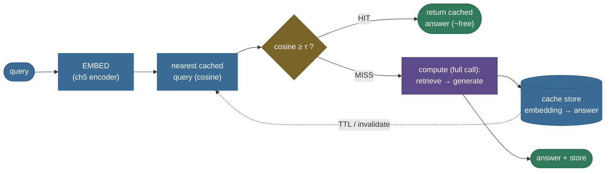

# Caching & Cost Optimization: serve repeated work for free

You have built a RAG app, wired it into a pipeline (ch15), and protected its quality (ch14). Now it
has to be *affordable*. Every query costs money and time — embed the query, retrieve, and make an LLM
call, billed per token and measured in latency. At any real scale the query stream is not a set of
unique questions; it is **full of repeats and paraphrases**. "How tall is the imager?" and "imager
height?" want the same answer. A support bot answers the same ten FAQs all day. An agent loop re-asks
the same sub-question. A naive app re-pays the **full** cost for every one of them.

This chapter — the last of the RAG domain — is about making repeated work **free**. The central lever
is the **semantic cache**: serve a stored answer whenever a new query is close enough (by embedding
cosine) to one you've already answered. We'll build one from scratch on CPU, measure the cost and
latency it saves on a real query stream, and — because a cache that serves the *wrong* answer is worse
than no cache — expose the **false-hit** risk that comes with matching by similarity. By the end you'll
be able to:

- state the **cost model** — expected per-query cost `(1−h)·full + h·hit`, savings ≈ hit rate — and
  compute the saving for a given hit rate;
- **build** a semantic cache (embed → nearest cached query → HIT/MISS at a threshold) and measure its
  hit rate;
- explain the **false-hit / miss tradeoff** as the threshold moves, and why a false hit is the
  dangerous error (cosine ≈ topic, not exact intent);
- distinguish **semantic**, **prompt/prefix**, **embedding**, and **retrieval** caching, and know what
  each one saves;
- reach for the right tool (GPTCache, LangChain semantic cache, Anthropic/OpenAI prompt caching) and
  know when caching pays off (high-repeat traffic) versus not (all-unique queries).

> **Honesty up front.** The **semantic cache** (embed → nearest cached query by cosine → HIT/MISS at a
> threshold), the **hit rate** over a real query stream, and the **cost/latency** arithmetic (ch12's
> token cost model + a modelled per-call latency) are **real and measured** — every number is printed
> by an executed notebook cell and asserted, by value. The only **illustrative** pieces are the answer
> *text* a MISS "computes" (no LLM in this env) and the exact **latency constants** (a real call is
> ~hundreds of ms, a cache hit ~a few ms). Carried caveat from [ch11](../11-RAG-Evaluation/11-RAG-Evaluation.md)/[ch13](../13-Citations-and-Attribution/13-Citations-and-Attribution.md)/[ch14](../14-Guardrails-and-Hallucination-Mitigation/14-Guardrails-and-Hallucination-Mitigation.md):
> the cache matches by cosine — *topic*, not exact intent — so a too-low threshold serves a **false
> hit** (the wrong cached answer). We show it explicitly.

---

## The problem: at scale, you re-pay for the same work

Take a modest support workload: an app answering questions about the Helios-7 satellite. Its cost per
query, using ch12's cost model, is the RAG prompt (retrieved chunks + question + instructions) plus a
short answer — call it **760 input+output tokens ≈ \$0.00228** per query at a representative
\$3/M-token price, and **~800 ms** of latency for the retrieve+generate round trip.

Now run a *stream* of eight queries — three distinct questions, plus repeats and paraphrases of them:

```
What is the ground resolution of the Helios-7 imager?   (new)
When was Helios-7 launched?                             (new)
What is the ground resolution of the Helios-7 imager?   (exact repeat)
How fine is the Helios-7 imager's ground resolution?    (paraphrase)
Who is the Helios-7 project lead?                       (new)
What date did Helios-7 lift off?                        (paraphrase)
Who leads the Helios-7 project?                         (paraphrase)
When was Helios-7 launched?                             (exact repeat)
```

A naive no-cache app pays the **full \$0.00228 and 800 ms for all eight** — even though five of them
are asking a question it *already answered*. That's **\$0.01824 and 6,400 ms** to answer three
distinct questions. Five-eighths of that work is pure waste. Multiply by millions of queries a day and
"wasted repeated work" is a line item that dwarfs everything else. The fix is to answer each distinct
question *once* and serve the rest from a cache.

---

## Intuition first: a barista who remembers your order

Picture a busy coffee shop. A naive barista makes every drink from scratch, every time — grind, pull,
steam — even when the same regular orders the same latte they order every morning. A good barista
**remembers**: when your order matches one they've made, they serve it in seconds instead of minutes.
A *great* barista remembers by **meaning**, not exact words — "my usual," "the oat latte," "same as
yesterday" all map to the same drink. That is a **semantic cache**: it recognizes that a new query
*means* the same as one already answered, and serves the stored answer instead of re-doing the work.

The analogy holds under the obvious follow-up — *"isn't exact-match caching enough? just cache by the
exact query string."* No, and this is the whole reason semantic caching exists: **users phrase the
same question differently.** "How fine is the imager's resolution?" and "What is the ground resolution
of the imager?" are the same question in different words; an exact-string cache misses the second one
and re-pays the full cost. A semantic cache catches paraphrases by embedding similarity. **But** — and
this is the risk the analogy also warns about — a barista who's *too* eager to match might serve you
someone else's drink because it sounded similar. Match too loosely and a genuinely *different* query
("what's the imager's *wavelength*?") gets served the *wrong* cached answer. That is a **false hit**,
and it is the central danger of semantic caching: cosine measures *topic*, not exact intent.


Caching happens at **four layers**, each removing a different repeated cost — they compose:

- **Semantic cache** — serve a stored *answer* when a new query is a near-paraphrase (skips the whole
  retrieve+generate). *This chapter's focus.*
- **Prompt / prefix cache** — the provider reuses the *KV state* of a fixed prompt prefix (system
  prompt, retrieved docs) across calls (cuts input-token cost 50–90%).
- **Embedding cache** — don't re-embed the same text; memoize embeddings by content.
- **Retrieval cache** — reuse a query's retrieved chunk IDs when the same query recurs (skips the
  vector search).


---

## The mechanism: embed → nearest cached → hit or miss



Read it left to right: the query is **embedded** with the same encoder the whole corpus uses; its
cosine to every **cached query** is computed; if the best match clears a threshold τ it's a **HIT**
(return the stored answer, paying only the tiny lookup-embedding cost); otherwise a **MISS** — compute
the full answer, return it, and **store** it so the next paraphrase hits. The dashed edge is
**invalidation**: entries carry a TTL (or are evicted when the underlying documents change) so a stale
answer isn't served forever.

> **Note:** the cache lives *in front of* the whole pipeline of the previous chapters. A hit skips
> retrieval (ch5), re-ranking (ch6), generation, *and* the guardrail (ch14) — it returns an answer the
> pipeline already produced and (ideally) already vetted. That's why a semantic hit is the biggest
> single saving: it short-circuits everything downstream.

---

## The math: the cost model and the hit rule

### Expected cost under a hit rate

Let a fraction $h$ of queries be cache hits. A hit costs $c_{\text{hit}}$ (just the lookup embedding);
a miss costs $c_{\text{full}}$ (the full retrieve+generate call). The **expected per-query cost** is:

$$
\mathbb{E}[\text{cost}] \;=\; (1-h)\,c_{\text{full}} \;+\; h\,c_{\text{hit}},
$$

and the **fraction of the bill saved** versus no cache is:

$$
\text{savings} \;=\; 1 - \frac{\mathbb{E}[\text{cost}]}{c_{\text{full}}} \;=\; h\left(1 - \frac{c_{\text{hit}}}{c_{\text{full}}}\right) \;\approx\; h \quad (\text{since } c_{\text{hit}} \ll c_{\text{full}}).
$$

Because a hit is nearly free relative to a full call, **the savings fraction is essentially the hit
rate**: a 60% hit rate cuts ~60% of the bill. That single fact is the whole economics of caching — the
payoff scales directly with how repetitive your traffic is.

> **Source / derivation:** this is the standard cache expected-cost identity; the per-query token cost
> $c_{\text{full}}$, $c_{\text{hit}}$ reuse [ch12's cost model](../12-Long-Context-vs-RAG/12-Long-Context-vs-RAG.md)
> (`query_cost_usd(tokens)` = tokens ÷ 1M × price). [GPTCache (Bang 2023, NLP-OSS)](https://aclanthology.org/2023.nlposs-1.24/)
> reports the same structure: a cache hit is 2–10× faster and near-free, so savings track the hit rate.


### The hit rule and the false-hit / miss tradeoff

A new query $q$ hits the nearest cached query $q^\star$ iff their cosine clears a threshold:

$$
\text{hit}(q) \;\iff\; \max_{q' \in \text{cache}} \cos\!\big(E(q), E(q')\big) \;\ge\; \tau.
$$

We use a deliberately **high** τ = 0.8 — higher than ch14's 0.5 grounding bar — because a cache serves
a *stored answer verbatim*, so a wrong hit is worse than a wrong retrieval. Sweeping τ trades two
errors, exactly like ch14's threshold:

$$
\textbf{false-hit rate} = \frac{\#\{\text{different-intent queries with } \cos \ge \tau\}}{\#\{\text{different-intent queries}\}}, \qquad
\textbf{miss rate} = \frac{\#\{\text{true paraphrases with } \cos < \tau\}}{\#\{\text{true paraphrases}\}}.
$$

A **low** τ catches more paraphrases (fewer misses) but serves more **false hits** — a genuinely
different query gets the wrong cached answer. A **high** τ is safer but misses real paraphrases (they
re-pay the full cost). You cannot minimize both — and even τ=0.8 admits **2 of 3** of this adversarial
probe set (false-hit rate 0.667; only τ=0.9 balances the two). τ is a **dial, not a guarantee**: pair a
high threshold with an **exact-match fast path** and answer **verification** (Pitfall 1) — never rely on
cosine alone to protect against a false hit.

> **Source / derivation:** the similarity-threshold hit rule and its false-hit vs miss tradeoff are the
> semantic-cache design [GPTCache (Bang 2023)](https://aclanthology.org/2023.nlposs-1.24/) formalizes
> (an embedding similarity gate with a tunable threshold); it is the same reject-threshold shape as
> ch14's grounding gate ([Geifman & El-Yaniv 2017](https://arxiv.org/abs/1705.08500)), applied to cache
> admission instead of abstention.


### Prompt-cache savings (a different lever)

Semantic caching reuses whole *answers*. **Prompt caching** reuses the model's internal *KV state* for
a fixed prompt *prefix* — the system prompt, few-shot examples, or a retrieved document that's constant
across many queries. The provider bills the cached prefix at a fraction of the input price:

$$
\text{prefix cost} = \underbrace{p_{\text{write}} \cdot n_{\text{prefix}}}_{\text{first call (cache write)}} + \underbrace{p_{\text{read}} \cdot n_{\text{prefix}} \cdot (m-1)}_{\text{next } m-1 \text{ calls (cache read)}}, \quad p_{\text{read}} \ll p_{\text{base}}.
$$

**Break-even (analytic, not a measured value):** with Anthropic's $p_{\text{write}}=1.25\times$ and $p_{\text{read}}=0.1\times$ base, prefix caching beats re-paying full price ($p_{\text{base}}\cdot n_{\text{prefix}}\cdot m$) once $1.25 + 0.1(m-1) < m$, i.e. $m > 1.28$ — so it pays off from the **2nd call ($m \ge 2$)**: a single cache read already earns back the 1.25× write premium.

> **Source / derivation:** [Anthropic prompt caching](https://platform.claude.com/docs/en/docs/build-with-claude/prompt-caching)
> prices a cache **write** at **1.25×** base input and a cache **read** at **0.1×** base (5-minute
> TTL, min 1,024 tokens); [OpenAI automatic prompt caching](https://developers.openai.com/api/docs/guides/prompt-caching)
> caches prefixes **≥1,024 tokens** (exact-prefix match) — cached input tokens are discounted steeply
> (the guide cites **up to ~90% input-cost and ~80% latency** reduction on cache-heavy prompts; the flat
> 50% figure was the 2024 GPT-4o-class launch rate — flagship models now cache-read at ~0.1× base). The underlying mechanism — reusing precomputed attention for a recurring prefix — is
> [*Prompt Cache*, Gim et al. 2023 (MLSys 2024)](https://arxiv.org/abs/2311.04934).

---

## Worked example, from scratch: the stream, the savings, the false hit

The whole semantic cache from primitives, then measured on the stream. It runs on CPU in a couple of
seconds.

> **Runnable script and a step-by-step notebook:** the verified code lives next to this page — the
> [step-by-step teaching notebook](code/16-Caching-and-Cost-Optimization.ipynb) and the
> [runnable demo script](code/caching_cost.py) (`python caching_cost.py`). Every number quoted below is
> printed by an executed cell and asserted by value.

### The cache and the stream

```python
from caching_cost import (
    DenseRetriever, full_corpus, run_stream, QUERY_STREAM, STREAM_ANSWERS,
)
dense = DenseRetriever(full_corpus())            # ch5's all-MiniLM encoder
result = run_stream(dense, QUERY_STREAM, STREAM_ANSWERS)  # embed each query, HIT/MISS at tau=0.8
print("hit pattern:", result.hits)
print(f"hit rate: {sum(result.hits)}/{len(result.hits)} = {result.hit_rate:.3f}")
```

Output (real, from the executed notebook):

```
hit pattern: (False, False, True, True, False, True, True, True)
hit rate: 5/8 = 0.625
```

The three *distinct* questions each **miss once** (cold cache) and are stored; every repeat and
paraphrase after **hits** — a **5/8 = 0.625** hit rate. The per-query cosines tell the story: the exact
repeats hit at cosine **1.000**, the paraphrases at **0.920**, **0.844**, **0.974** (all ≥ 0.8), while
the cold misses score below τ against whatever's in the cache so far.

### The savings

```python
print(f"cost   : ${result.cost_no_cache_usd:.6f} -> ${result.cost_cached_usd:.6f}  "
      f"({result.cost_saved_usd / result.cost_no_cache_usd:.1%} saved)")
print(f"latency: {result.latency_no_cache_ms:.0f}ms -> {result.latency_cached_ms:.0f}ms  "
      f"({result.latency_saved_ms / result.latency_no_cache_ms:.1%} saved)")
```

```
cost   : $0.018240 -> $0.007020  (61.5% saved)
latency: 6400ms -> 2425ms  (62.1% saved)
```

A **0.625** hit rate cut **61.5%** of the cost and **62.1%** of the latency — savings ≈ hit rate,
exactly as the model predicts. (It's *slightly* below the hit rate because a hit isn't perfectly free —
it still pays the tiny lookup embedding.)


### The false hit, concretely

Now the danger. At a **low** threshold, a query about a *different* imager attribute gets served the
wrong cached answer:

```python
from caching_cost import SemanticCache, BASE_ANSWERS
cached_q = "What is the ground resolution of the Helios-7 imager?"
danger   = "What is the wavelength range of the Helios-7 imager?"   # DIFFERENT attribute

low = SemanticCache(dense, threshold=0.50); low.store(cached_q, BASE_ANSWERS[cached_q])
print("tau=0.50:", low.lookup(danger).hit, f"(cos {low.lookup(danger).best_cosine:.3f})")
strict = SemanticCache(dense, threshold=0.80); strict.store(cached_q, BASE_ANSWERS[cached_q])
print("tau=0.80:", strict.lookup(danger).hit, f"(cos {strict.lookup(danger).best_cosine:.3f})")
```

```
tau=0.50: True (cos 0.757)    # FALSE HIT — served the RESOLUTION answer to a WAVELENGTH question
tau=0.80: False (cos 0.757)   # correct MISS — no wrong answer served
```

At τ=0.5 the wavelength query (cosine **0.757** to the cached resolution query) **false-hits** and is
served *"the imager has a ground resolution of 4 meters"* — a confidently wrong answer to a question
about wavelength. At the default τ=0.8 the *same* query correctly **misses**. Cosine matched the topic
(*the imager*), not the intent (*wavelength vs resolution*) — the same cosine ≠ exact-meaning gap the
earlier chapters carry, here as the false-hit risk.

### The library one-liners

Our from-scratch cache is the mechanism. In production you reach for a library or a provider feature
(each verified against its current docs; see [Where it's used](#where-its-used-and-why-it-matters)):

```python
# LangChain — an exact-match cache (InMemoryCache) or a SEMANTIC cache (embedding + threshold).
from langchain.globals import set_llm_cache
from langchain_community.cache import InMemoryCache
set_llm_cache(InMemoryCache())                       # exact-string cache, one line
# semantic cache (concrete class): from langchain_community.cache import RedisSemanticCache
#   set_llm_cache(RedisSemanticCache(redis_url="redis://localhost:6379", embedding=..., score_threshold=0.2))
```

```python
# GPTCache — an open-source semantic cache: an embedding function + a similarity threshold.
from gptcache import Cache
from gptcache.adapter import openai                  # wraps the OpenAI client; hits skip the API call
# configure with an embedding model + a similarity evaluation + a threshold (the tau above)
```

```python
# Anthropic prompt (prefix) caching — reuse the KV of a fixed prefix; write 1.25x, read 0.1x base.
import anthropic
client = anthropic.Anthropic()
client.messages.create(
    model="claude-opus-4-8", max_tokens=512,
    system=[{"type": "text", "text": LONG_FIXED_SYSTEM_PROMPT,
             "cache_control": {"type": "ephemeral"}}],   # <- cache this prefix (5-min TTL)
    messages=[{"role": "user", "content": user_query}],
)
```

```python
# OpenAI — automatic prompt caching: no code change; prefixes >= 1024 tokens cached (up to ~90% input-cost / ~80% latency off).
# Just put static content (instructions, docs) FIRST and variable content (the user query) LAST.
```

---

## Pitfalls & failure modes

Each pitfall below is named, shown failing, then fixed.

### Pitfall 1 — false cache hit

The signature failure, shown above: at a low threshold a semantically-near but different-intent query
(wavelength vs resolution, cosine **0.757**) is served the wrong cached answer. **The fix:** a **high
threshold** (admit only near-duplicates, τ≈0.8–0.9), an **exact-match fast path** in front of the
semantic layer (for the many exact repeats, which need no similarity risk), and — for high-stakes
apps — a cheap **verification** step (does the cached answer actually address this query?). Never set
the threshold low to chase hit rate; a false hit is worse than a miss.

### Pitfall 2 — stale cache (invalidation)

A cached answer is only correct as long as the underlying documents haven't changed. Cache "the imager
resolves at 4 m," then the spec is updated to 3 m, and every hit now serves the **old, wrong** answer.
**The fix:** a **TTL** on every entry (expire after minutes/hours), and **invalidation on write** —
when a document changes, evict cache entries derived from it. Anthropic's prompt cache makes this
concrete with a **5-minute default TTL**; a semantic answer cache needs a TTL tuned to how fast your
knowledge changes.

### Pitfall 3 — caching on the wrong key

Cache keyed on the query alone will serve one user's answer to another when the answer depends on
*who's asking* (their permissions, their tenant, their locale). **The fix:** include the relevant
context in the cache key — cache on `(query, user_scope)` not just `query` — or **don't cache
personalized content at all** (see Pitfall 4).

### Pitfall 4 — over-caching dynamic / personalized content

Caching a *stock price*, a *"today's date"* answer, or a *user-specific* response serves stale or
wrong data on every hit. **The fix:** cache only **stable, non-personalized** answers (facts, FAQs,
documentation), and mark dynamic/personalized queries as **non-cacheable**. A cache is a bet that the
answer won't change before the next identical query; only make that bet where it holds.

### Pitfall 5 — the lookup cost itself, and cold start

The cache isn't free: every query pays an **embedding + nearest-neighbour lookup** even on a miss, and
an **empty cache** (cold start) hits nothing — early traffic is all misses paying *extra* for the
lookup. **The fix:** keep the lookup cheap (a small encoder, an ANN index for a large cache — see
[ch4](../04-Vector-Databases-and-ANN-Indexes/04-Vector-Databases-and-ANN-Indexes.md)), and accept that
caching only pays off once traffic is warm and repetitive. On a stream of all-unique queries a cache
*loses* — it adds lookup cost for zero hits. **Measure your repeat rate before adding a cache.**

---

## Try it: predict, then run {#try-it}

The stream's hit rate was **5/8 = 0.625**. Now imagine **heavier-repeat** traffic — the same stream,
but with each of the three distinct questions asked one extra time at the end (3 more queries, all
repeats of already-cached questions).

> **Try it:** **predict, before you run the [notebook](code/16-Caching-and-Cost-Optimization.ipynb)
> cell.** Will the new hit rate be higher or lower than 0.625? And roughly what fraction of the bill
> will the cache now save?

Now run it. The asserted cell prints:

```
stream length: 8 -> 11
hit rate: 8/11 = 0.727  (was 0.625)
cost saved: 71.6%  (was 61.5%)
```

The three extra queries are all repeats of already-cached questions, so they **all hit** — the hit
count rises from 5 to **8 out of 11**, and the saving climbs from 61.5% to **~71.6%**. This is the
whole economics of caching in one number: **the payoff scales with how repetitive your traffic is.**
High-repeat workloads (FAQs, popular queries, agent loops re-asking the same sub-question) are where a
cache pays off enormously; a stream of all-unique queries would save *nothing* (and cost a little extra
for the lookups). Before you add a cache, measure your repeat rate — it *is* your savings.

---

## Where it's used, and why it matters {#where-its-used-and-why-it-matters}

Caching is the layer that turns an affordable prototype into an affordable *product*. The production
toolkit (each verified against its current docs):

- **GPTCache.** [Bang 2023 (NLP-OSS)](https://aclanthology.org/2023.nlposs-1.24/) — the reference
  open-source **semantic cache**: an embedding function + a similarity threshold + a vector store,
  wrapping the LLM client so a hit skips the API call (2–10× faster on a hit). The library form of this
  chapter's from-scratch cache.
- **LangChain caching.** `set_llm_cache(InMemoryCache())` for an exact-string cache in one line, or a
  vector-store-backed **semantic cache** (`...SemanticCache(embedding=..., score_threshold=...)`) for
  paraphrase matching — the same embed-and-threshold pattern.
- **Anthropic prompt caching.** `cache_control: {type: "ephemeral"}` on a fixed prefix reuses its KV
  state — **cache write 1.25×** base input, **cache read 0.1×**, **5-minute** default TTL, minimum
  1,024 tokens. Ideal for a long system prompt or a document reused across many queries.
- **OpenAI automatic prompt caching.** No code change — prefixes **≥1,024 tokens** are cached
  automatically (exact-prefix match); cached input tokens are discounted steeply — the docs cite
  **up to ~90%** input-cost and **~80%** latency reduction on cache-heavy prompts (flagship models
  cache-read at ~0.1× base). Structure prompts static-first, variable-last to maximize hits.
- **Redis / vector-DB semantic caches.** A production semantic cache at the gateway, backed by a vector
  index for fast nearest-neighbour lookup over a large cache.

**When caching pays off:** high-repeat traffic — support bots and FAQs (the same questions all day),
popular public queries, agent loops that re-ask sub-questions, and any app with a long fixed prompt
prefix (prompt caching). **When it doesn't:** a stream of genuinely unique queries (no hits → the cache
only adds lookup cost), or answers that must be fresh/personalized (caching serves stale or wrong data
— Pitfall 4). The decision is a single measurement: **your repeat rate**.

---

## Recap, rapid-fire, and the RAG domain tied together

**If you remember nothing else:** repeated and paraphrased queries re-pay the full LLM cost unless you
cache. A **semantic cache** serves a stored answer when a new query is close enough (cosine ≥ τ) to one
already answered, so the saving is **≈ the hit rate**. The threshold is a **false-hit / miss** dial: a
low τ serves the *wrong* cached answer (cosine ≈ topic, not intent), a high τ misses paraphrases. Cache
at four layers — **semantic, prompt/prefix, embedding, retrieval** — invalidate stale entries with a
TTL, and only bet on caching where your traffic actually repeats.

**Quick-fire — say these out loud:**

- *What does a semantic cache save?* `hit_rate × (full-call cost − hit cost)` ≈ hit_rate × per-query
  cost — a hit is nearly free.
- *Semantic vs exact-match cache?* Exact matches only the identical string; semantic matches
  paraphrases by embedding cosine — at the risk of a false hit.
- *What's a false hit?* A different-intent query served the wrong cached answer because its cosine to a
  cached query cleared τ. The dangerous error.
- *Which way to set τ?* High (0.8–0.9) — a cache serves an answer verbatim, so admit only near-
  duplicates; add an exact-match fast path.
- *Semantic vs prompt caching?* Semantic reuses whole *answers* by query similarity; prompt/prefix
  reuses the model's *KV state* for a fixed prefix (Anthropic/OpenAI).
- *Anthropic prompt-cache pricing?* Cache write 1.25×, cache read 0.1× base input, 5-min TTL.
- *When does a cache LOSE?* All-unique traffic (no hits, pays lookup cost) or dynamic/personalized
  answers (serves stale/wrong data).
- *How do you avoid a stale cache?* TTL on every entry + invalidate on document change.

### The thread through all 16 RAG chapters

This is the last chapter of the domain, so step back. Every chapter here has been about one thing:
**getting the right context to the model, for the least cost, without sacrificing quality.** Chunking
(ch2) sized the retrievable unit; embeddings (ch3) and retrieval (ch4–7) found the right context
cheaply; re-ranking (ch6) spent expensive compute only on the top-k; GraphRAG and agentic RAG (ch9–10)
handled the queries a flat retriever couldn't; long-context-vs-RAG (ch12) weighed stuffing's cost
against retrieval's; evaluation and citations (ch11, ch13) measured and proved quality; orchestration
(ch15) wired the steps into an app; guardrails (ch14) protected it; and **caching — this chapter —
makes the whole thing affordable at scale.** Cost, latency, and quality are the three axes every RAG
decision trades against. Master those trades, and you can build a retrieval system that is not just
*correct* in a demo but *affordable and fast* in production. That is the craft of RAG.

---

## References and further reading

The curated link library for this topic — videos, courses, articles, papers, and internal
cross-links — lives in a companion file so it can be reused as a standalone reference list:

**→ [Caching & Cost Optimization — references and further reading](16-Caching-and-Cost-Optimization.references.md)**
